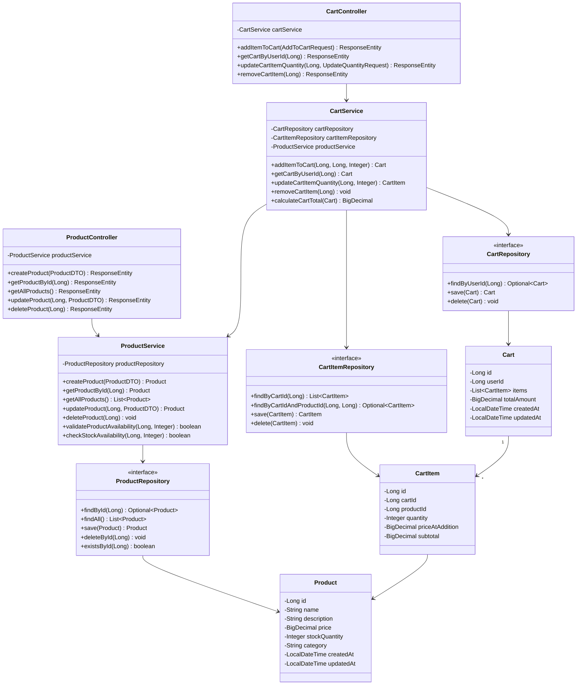
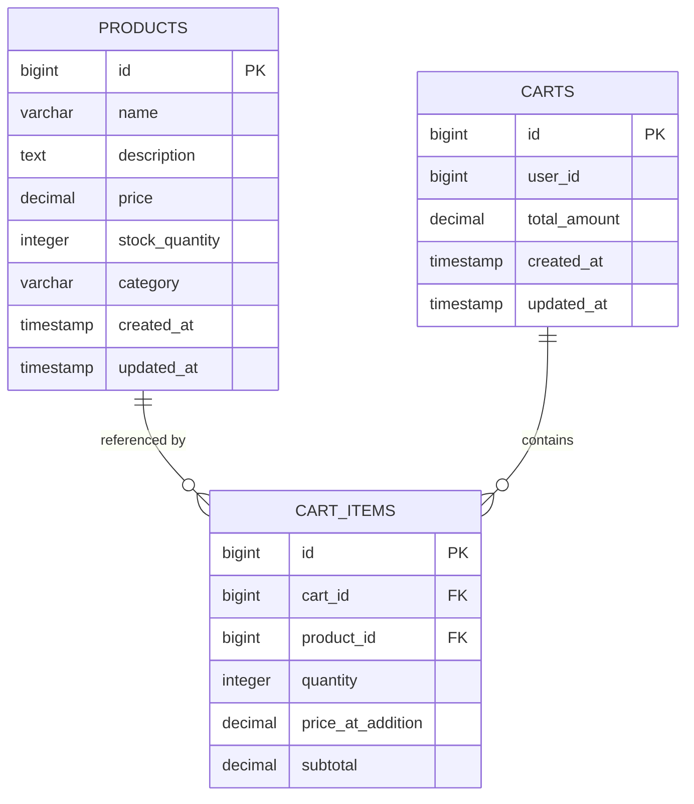
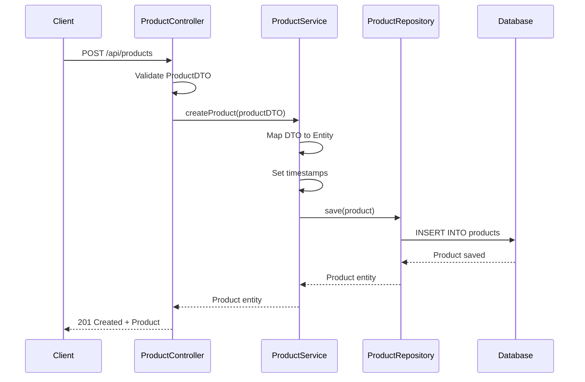
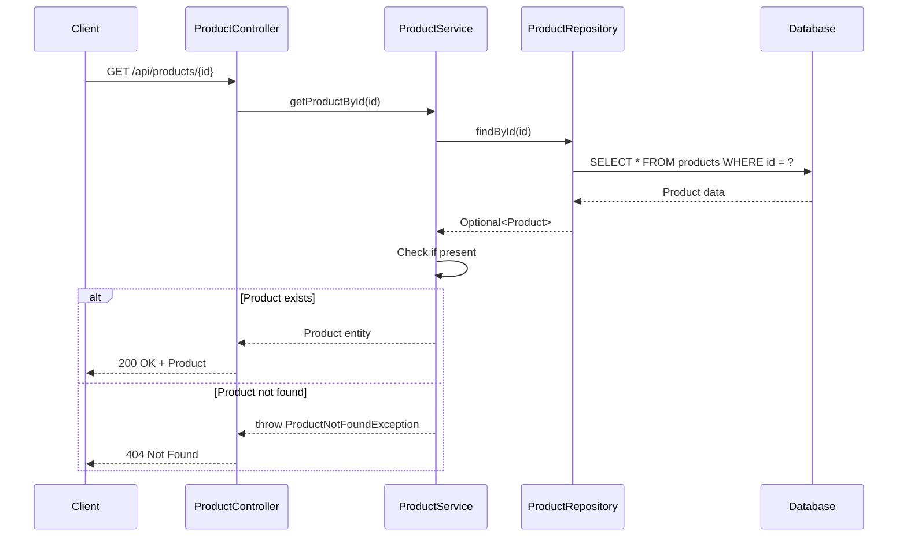
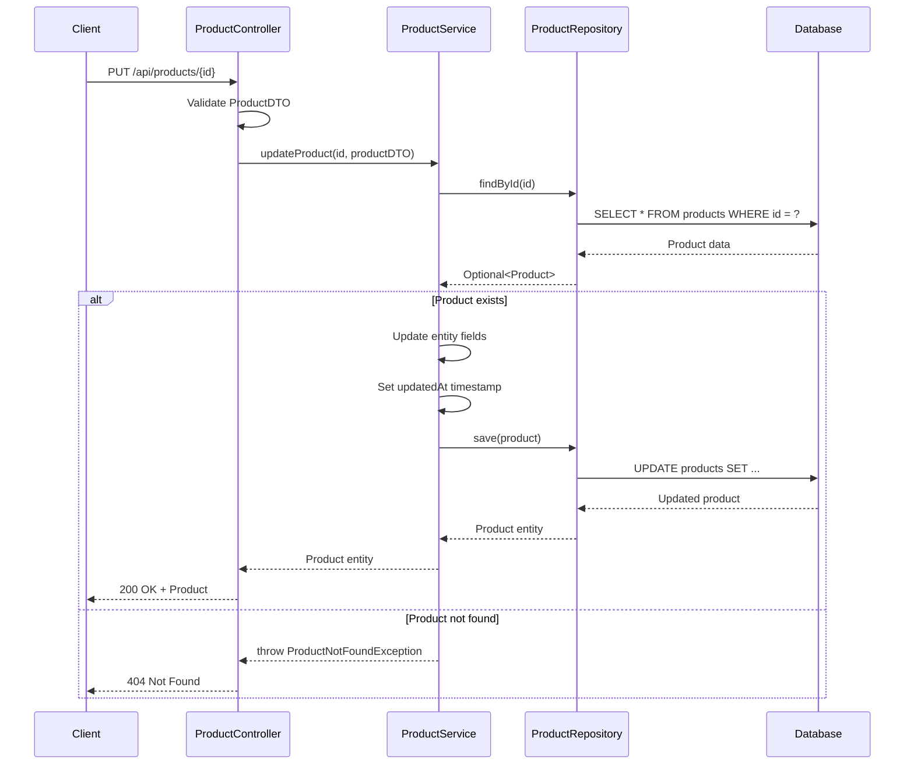
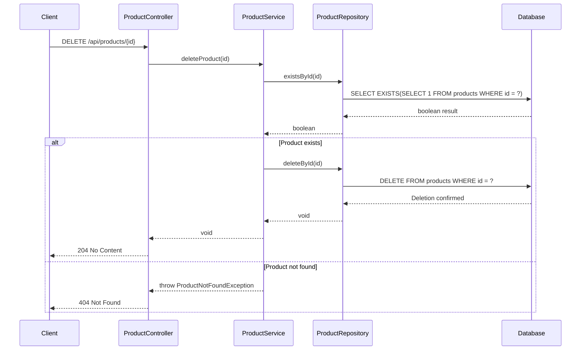
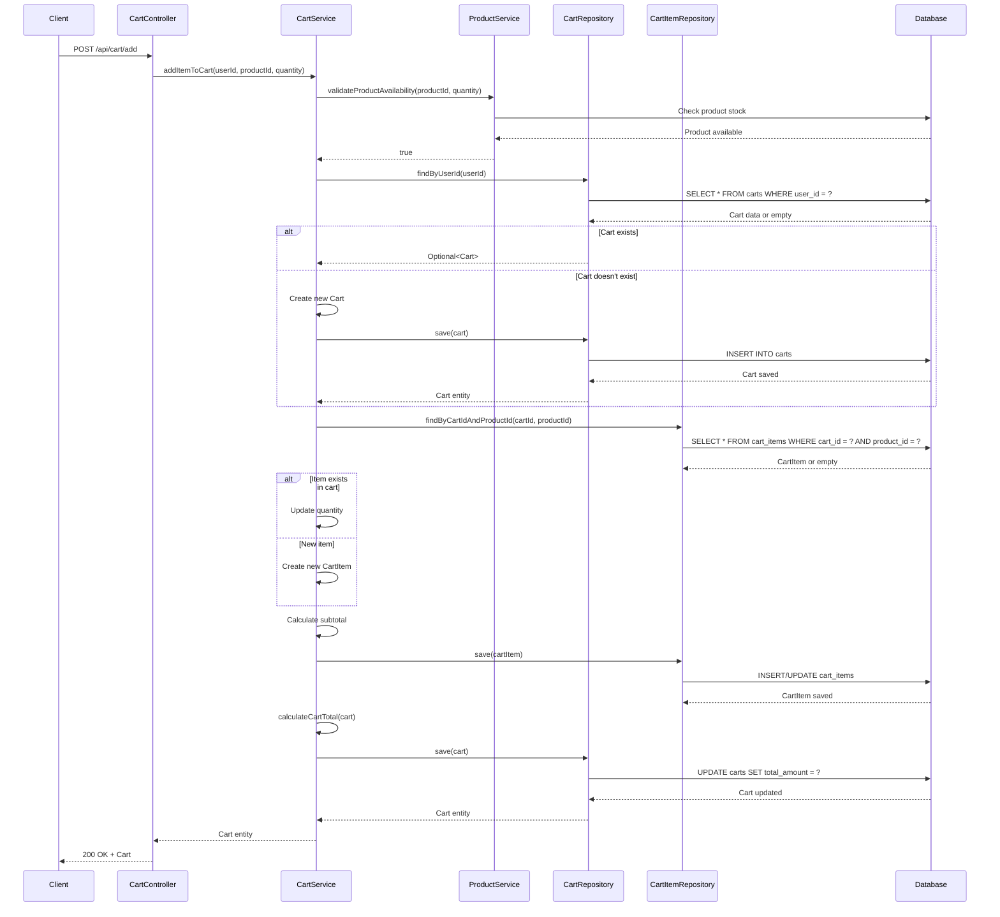
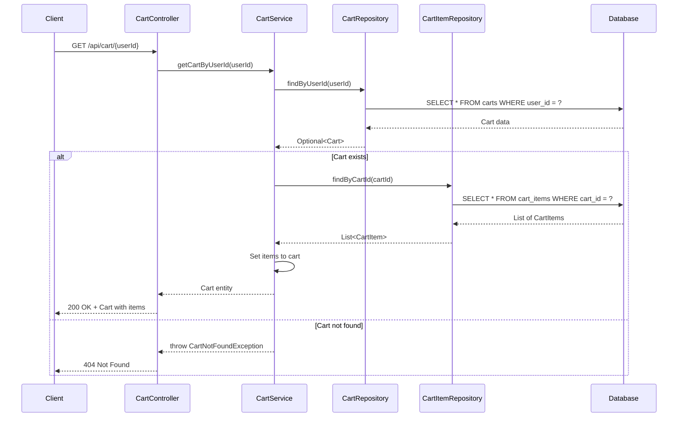
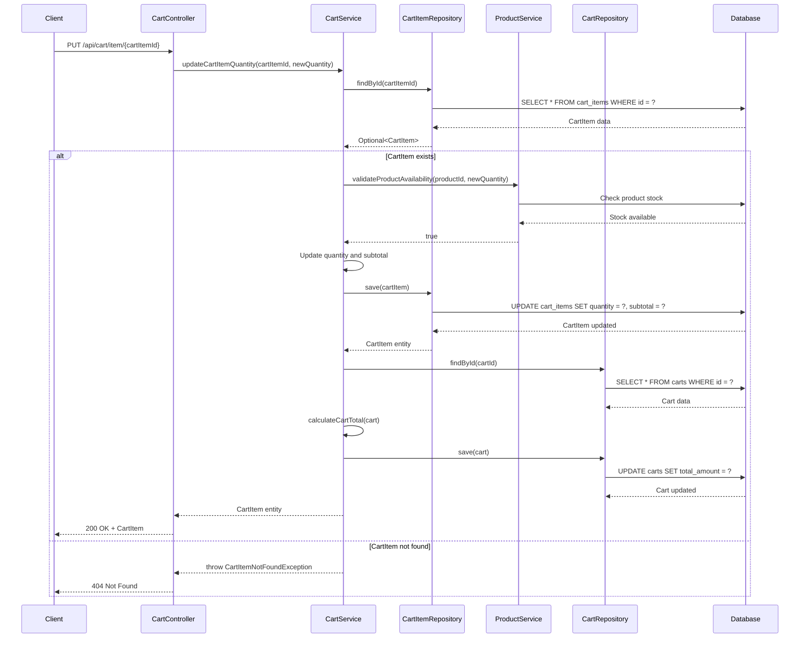
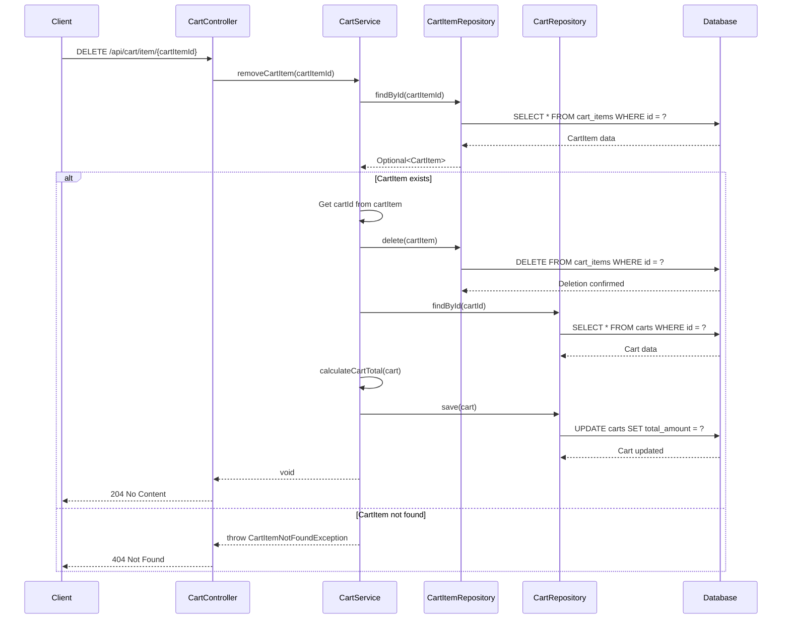

# Low Level Design Document: E-commerce Product Management and Shopping Cart System

## 1. Project Overview

This document provides a comprehensive Low Level Design (LLD) for an E-commerce Product Management and Shopping Cart System built using Spring Boot, Java 21, and PostgreSQL. The system enables users to manage products and shopping carts with full CRUD operations, business logic for cart calculations, and robust validation.

### 1.1 System Purpose
- Manage product catalog with CRUD operations
- Handle shopping cart functionality for users
- Calculate cart totals with business rules
- Ensure data integrity and validation

### 1.2 Technology Stack
- **Backend Framework**: Spring Boot 3.x
- **Programming Language**: Java 21
- **Database**: PostgreSQL
- **ORM**: Spring Data JPA / Hibernate
- **Build Tool**: Maven/Gradle
- **API Style**: RESTful

---

## 2. System Architecture

### 2.1 Class Diagram

### 2.2 Entity Relationship Diagram

---

## 3. Sequence Diagrams

### 3.1 Create Product Flow

### 3.2 Get Product by ID Flow

### 3.3 Update Product Flow

### 3.4 Delete Product Flow

### 3.5 Add Item to Cart Flow

### 3.6 Get Cart by User ID Flow

### 3.7 Update Cart Item Quantity Flow

### 3.8 Remove Cart Item Flow

---

## 4. API Endpoints Summary

### 4.1 Product Endpoints

| Method | Endpoint | Description | Request Body | Response |
|--------|----------|-------------|--------------|----------|
| POST | `/api/products` | Create a new product | ProductDTO | 201 Created + Product |
| GET | `/api/products/{id}` | Get product by ID | - | 200 OK + Product |
| GET | `/api/products` | Get all products | - | 200 OK + List<Product> |
| PUT | `/api/products/{id}` | Update product | ProductDTO | 200 OK + Product |
| DELETE | `/api/products/{id}` | Delete product | - | 204 No Content |

### 4.2 Cart Endpoints

| Method | Endpoint | Description | Request Body | Response |
|--------|----------|-------------|--------------|----------|
| POST | `/api/cart/add` | Add item to cart | AddToCartRequest (userId, productId, quantity) | 200 OK + Cart |
| GET | `/api/cart/{userId}` | Get cart by user ID | - | 200 OK + Cart with items |
| PUT | `/api/cart/item/{cartItemId}` | Update cart item quantity | UpdateQuantityRequest (quantity) | 200 OK + CartItem |
| DELETE | `/api/cart/item/{cartItemId}` | Remove item from cart | - | 204 No Content |

---
