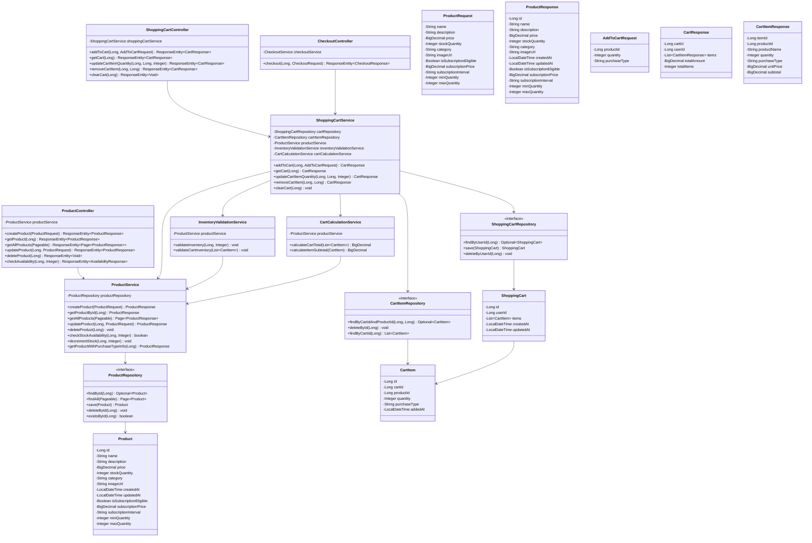

# Low Level Design Document: E-commerce Product Management System

## 1. System Overview

This document provides the Low Level Design (LLD) for an E-commerce Product Management System built using Spring Boot and Java 21. The system manages products, shopping carts, and checkout operations with comprehensive inventory management and subscription support.

### Technology Stack
- **Framework**: Spring Boot 3.2.x
- **Language**: Java 21
- **Database**: PostgreSQL
- **ORM**: Spring Data JPA (Hibernate)
- **Build Tool**: Maven
- **API Documentation**: SpringDoc OpenAPI

## 2. Architecture Overview

The system follows a layered architecture pattern:

```
┌─────────────────────────────────────┐
│     Controller Layer (REST API)     │
├─────────────────────────────────────┤
│         Service Layer               │
├─────────────────────────────────────┤
│       Repository Layer (JPA)        │
├─────────────────────────────────────┤
│         Database (PostgreSQL)       │
└─────────────────────────────────────┘
```

## 3. Class Diagram


```mermaid
classDiagram
    class ProductController {
        -ProductService productService
        +createProduct(ProductRequest) ResponseEntity~ProductResponse~
        +getProduct(Long) ResponseEntity~ProductResponse~
        +getAllProducts(Pageable) ResponseEntity~Page~ProductResponse~~
        +updateProduct(Long, ProductRequest) ResponseEntity~ProductResponse~
        +deleteProduct(Long) ResponseEntity~Void~
        +checkAvailability(Long, Integer) ResponseEntity~AvailabilityResponse~
    }

    class ProductService {
        -ProductRepository productRepository
        +createProduct(ProductRequest) ProductResponse
        +getProductById(Long) ProductResponse
        +getAllProducts(Pageable) Page~ProductResponse~
        +updateProduct(Long, ProductRequest) ProductResponse
        +deleteProduct(Long) void
        +checkStockAvailability(Long, Integer) boolean
        +decrementStock(Long, Integer) void
        +getProductWithPurchaseTypeInfo(Long) ProductResponse
    }

    class ProductRepository {
        <<interface>>
        +findById(Long) Optional~Product~
        +findAll(Pageable) Page~Product~
        +save(Product) Product
        +deleteById(Long) void
        +existsById(Long) boolean
    }

    class Product {
        -Long id
        -String name
        -String description
        -BigDecimal price
        -Integer stockQuantity
        -String category
        -String imageUrl
        -LocalDateTime createdAt
        -LocalDateTime updatedAt
        -Boolean isSubscriptionEligible
        -BigDecimal subscriptionPrice
        -String subscriptionInterval
        -Integer minQuantity
        -Integer maxQuantity
    }

    class ShoppingCartController {
        -ShoppingCartService shoppingCartService
        +addToCart(Long, AddToCartRequest) ResponseEntity~CartResponse~
        +getCart(Long) ResponseEntity~CartResponse~
        +updateCartItemQuantity(Long, Long, Integer) ResponseEntity~CartResponse~
        +removeCartItem(Long, Long) ResponseEntity~CartResponse~
        +clearCart(Long) ResponseEntity~Void~
    }

    class ShoppingCartService {
        -ShoppingCartRepository cartRepository
        -CartItemRepository cartItemRepository
        -ProductService productService
        -InventoryValidationService inventoryValidationService
        -CartCalculationService cartCalculationService
        +addToCart(Long, AddToCartRequest) CartResponse
        +getCart(Long) CartResponse
        +updateCartItemQuantity(Long, Long, Integer) CartResponse
        +removeCartItem(Long, Long) CartResponse
        +clearCart(Long) void
    }

    class ShoppingCartRepository {
        <<interface>>
        +findByUserId(Long) Optional~ShoppingCart~
        +save(ShoppingCart) ShoppingCart
        +deleteByUserId(Long) void
    }

    class CartItemRepository {
        <<interface>>
        +findByCartIdAndProductId(Long, Long) Optional~CartItem~
        +deleteById(Long) void
        +findByCartId(Long) List~CartItem~
    }

    class ShoppingCart {
        -Long id
        -Long userId
        -List~CartItem~ items
        -LocalDateTime createdAt
        -LocalDateTime updatedAt
    }

    class CartItem {
        -Long id
        -Long cartId
        -Long productId
        -Integer quantity
        -String purchaseType
        -LocalDateTime addedAt
    }

    class InventoryValidationService {
        -ProductService productService
        +validateInventory(Long, Integer) void
        +validateCartInventory(List~CartItem~) void
    }

    class CartCalculationService {
        -ProductService productService
        +calculateCartTotal(List~CartItem~) BigDecimal
        +calculateItemSubtotal(CartItem) BigDecimal
    }

    class CheckoutController {
        -CheckoutService checkoutService
        +checkout(Long, CheckoutRequest) ResponseEntity~CheckoutResponse~
    }

    class ProductRequest {
        -String name
        -String description
        -BigDecimal price
        -Integer stockQuantity
        -String category
        -String imageUrl
        -Boolean isSubscriptionEligible
        -BigDecimal subscriptionPrice
        -String subscriptionInterval
        -Integer minQuantity
        -Integer maxQuantity
    }

    class ProductResponse {
        -Long id
        -String name
        -String description
        -BigDecimal price
        -Integer stockQuantity
        -String category
        -String imageUrl
        -LocalDateTime createdAt
        -LocalDateTime updatedAt
        -Boolean isSubscriptionEligible
        -BigDecimal subscriptionPrice
        -String subscriptionInterval
        -Integer minQuantity
        -Integer maxQuantity
    }

    class AddToCartRequest {
        -Long productId
        -Integer quantity
        -String purchaseType
    }

    class CartResponse {
        -Long cartId
        -Long userId
        -List~CartItemResponse~ items
        -BigDecimal totalAmount
        -Integer totalItems
    }

    class CartItemResponse {
        -Long itemId
        -Long productId
        -String productName
        -Integer quantity
        -String purchaseType
        -BigDecimal unitPrice
        -BigDecimal subtotal
    }

    ProductController --> ProductService
    ProductService --> ProductRepository
    ProductRepository --> Product
    ShoppingCartController --> ShoppingCartService
    ShoppingCartService --> ShoppingCartRepository
    ShoppingCartService --> CartItemRepository
    ShoppingCartService --> ProductService
    ShoppingCartService --> InventoryValidationService
    ShoppingCartService --> CartCalculationService
    ShoppingCartRepository --> ShoppingCart
    CartItemRepository --> CartItem
    ShoppingCart --> CartItem
    CheckoutController --> ShoppingCartService
    InventoryValidationService --> ProductService
    CartCalculationService --> ProductService
```

## 4. Entity/Model Layer

### 4.1 Product Entity

```java
package com.ecommerce.product.entity;

import jakarta.persistence.*;
import lombok.AllArgsConstructor;
import lombok.Builder;
import lombok.Data;
import lombok.NoArgsConstructor;
import java.math.BigDecimal;
import java.time.LocalDateTime;

@Entity
@Table(name = "products")
@Data
@Builder
@NoArgsConstructor
@AllArgsConstructor
public class Product {
    
    @Id
    @GeneratedValue(strategy = GenerationType.IDENTITY)
    private Long id;
    
    @Column(nullable = false, length = 255)
    private String name;
    
    @Column(columnDefinition = "TEXT")
    private String description;
    
    @Column(nullable = false, precision = 10, scale = 2)
    private BigDecimal price;
    
    @Column(name = "stock_quantity", nullable = false)
    private Integer stockQuantity;
    
    @Column(length = 100)
    private String category;
    
    @Column(name = "image_url", length = 500)
    private String imageUrl;
    
    @Column(name = "is_subscription_eligible")
    private Boolean isSubscriptionEligible;
    
    @Column(name = "subscription_price", precision = 10, scale = 2)
    private BigDecimal subscriptionPrice;
    
    @Column(name = "subscription_interval", length = 50)
    private String subscriptionInterval;
    
    @Column(name = "min_quantity")
    private Integer minQuantity;
    
    @Column(name = "max_quantity")
    private Integer maxQuantity;
    
    @Column(name = "created_at", nullable = false, updatable = false)
    private LocalDateTime createdAt;
    
    @Column(name = "updated_at")
    private LocalDateTime updatedAt;
    
    @PrePersist
    protected void onCreate() {
        createdAt = LocalDateTime.now();
        updatedAt = LocalDateTime.now();
    }
    
    @PreUpdate
    protected void onUpdate() {
        updatedAt = LocalDateTime.now();
    }
}
```

### 4.2 ShoppingCart Entity

```java
package com.ecommerce.cart.entity;

import jakarta.persistence.*;
import lombok.AllArgsConstructor;
import lombok.Builder;
import lombok.Data;
import lombok.NoArgsConstructor;
import java.time.LocalDateTime;
import java.util.ArrayList;
import java.util.List;

@Entity
@Table(name = "shopping_carts")
@Data
@Builder
@NoArgsConstructor
@AllArgsConstructor
public class ShoppingCart {
    
    @Id
    @GeneratedValue(strategy = GenerationType.IDENTITY)
    private Long id;
    
    @Column(name = "user_id", nullable = false, unique = true)
    private Long userId;
    
    @OneToMany(mappedBy = "cart", cascade = CascadeType.ALL, orphanRemoval = true)
    @Builder.Default
    private List<CartItem> items = new ArrayList<>();
    
    @Column(name = "created_at", nullable = false, updatable = false)
    private LocalDateTime createdAt;
    
    @Column(name = "updated_at")
    private LocalDateTime updatedAt;
    
    @PrePersist
    protected void onCreate() {
        createdAt = LocalDateTime.now();
        updatedAt = LocalDateTime.now();
    }
    
    @PreUpdate
    protected void onUpdate() {
        updatedAt = LocalDateTime.now();
    }
    
    public void addItem(CartItem item) {
        items.add(item);
        item.setCart(this);
    }
    
    public void removeItem(CartItem item) {
        items.remove(item);
        item.setCart(null);
    }
}
```

### 4.3 CartItem Entity

```java
package com.ecommerce.cart.entity;

import jakarta.persistence.*;
import lombok.AllArgsConstructor;
import lombok.Builder;
import lombok.Data;
import lombok.NoArgsConstructor;
import java.time.LocalDateTime;

@Entity
@Table(name = "cart_items")
@Data
@Builder
@NoArgsConstructor
@AllArgsConstructor
public class CartItem {
    
    @Id
    @GeneratedValue(strategy = GenerationType.IDENTITY)
    private Long id;
    
    @ManyToOne(fetch = FetchType.LAZY)
    @JoinColumn(name = "cart_id", nullable = false)
    private ShoppingCart cart;
    
    @Column(name = "product_id", nullable = false)
    private Long productId;
    
    @Column(nullable = false)
    private Integer quantity;
    
    @Column(name = "purchase_type", length = 20)
    private String purchaseType; // "ONE_TIME" or "SUBSCRIPTION"
    
    @Column(name = "added_at", nullable = false, updatable = false)
    private LocalDateTime addedAt;
    
    @PrePersist
    protected void onCreate() {
        addedAt = LocalDateTime.now();
    }
}
```

## 5. Repository Layer

### 5.1 ProductRepository

```java
package com.ecommerce.product.repository;

import com.ecommerce.product.entity.Product;
import org.springframework.data.domain.Page;
import org.springframework.data.domain.Pageable;
import org.springframework.data.jpa.repository.JpaRepository;
import org.springframework.data.jpa.repository.Query;
import org.springframework.stereotype.Repository;

import java.util.Optional;

@Repository
public interface ProductRepository extends JpaRepository<Product, Long> {
    
    Page<Product> findAll(Pageable pageable);
    
    Optional<Product> findById(Long id);
    
    @Query("SELECT p FROM Product p WHERE p.category = :category")
    Page<Product> findByCategory(String category, Pageable pageable);
    
    boolean existsById(Long id);
}
```

### 5.2 ShoppingCartRepository

```java
package com.ecommerce.cart.repository;

import com.ecommerce.cart.entity.ShoppingCart;
import org.springframework.data.jpa.repository.JpaRepository;
import org.springframework.data.jpa.repository.Query;
import org.springframework.stereotype.Repository;

import java.util.Optional;

@Repository
public interface ShoppingCartRepository extends JpaRepository<ShoppingCart, Long> {
    
    Optional<ShoppingCart> findByUserId(Long userId);
    
    @Query("SELECT c FROM ShoppingCart c LEFT JOIN FETCH c.items WHERE c.userId = :userId")
    Optional<ShoppingCart> findByUserIdWithItems(Long userId);
    
    void deleteByUserId(Long userId);
    
    boolean existsByUserId(Long userId);
}
```

### 5.3 CartItemRepository

```java
package com.ecommerce.cart.repository;

import com.ecommerce.cart.entity.CartItem;
import org.springframework.data.jpa.repository.JpaRepository;
import org.springframework.data.jpa.repository.Query;
import org.springframework.stereotype.Repository;

import java.util.List;
import java.util.Optional;

@Repository
public interface CartItemRepository extends JpaRepository<CartItem, Long> {
    
    @Query("SELECT ci FROM CartItem ci WHERE ci.cart.id = :cartId AND ci.productId = :productId AND ci.purchaseType = :purchaseType")
    Optional<CartItem> findByCartIdAndProductIdAndPurchaseType(Long cartId, Long productId, String purchaseType);
    
    List<CartItem> findByCartId(Long cartId);
    
    void deleteById(Long id);
    
    @Query("SELECT ci FROM CartItem ci WHERE ci.cart.userId = :userId")
    List<CartItem> findByUserId(Long userId);
}
```
