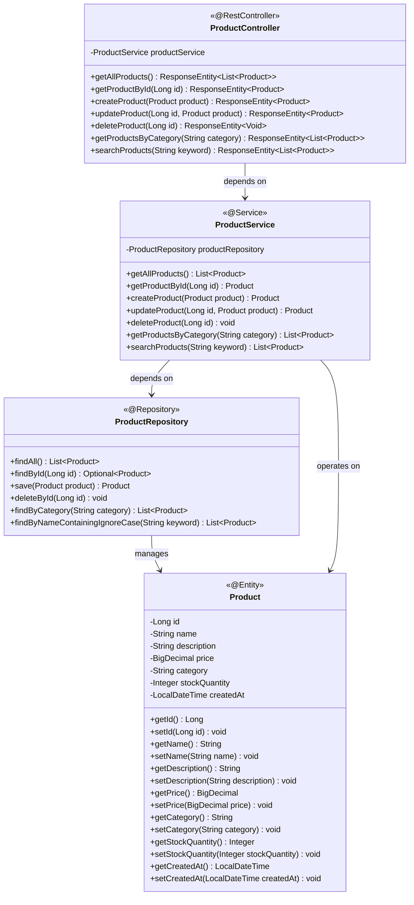
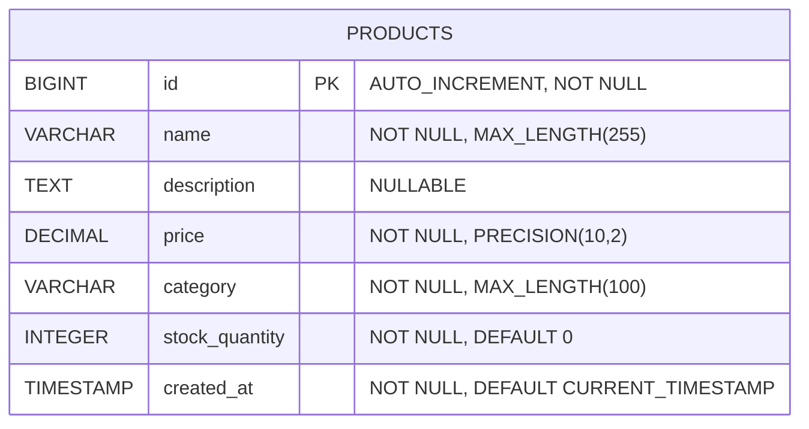
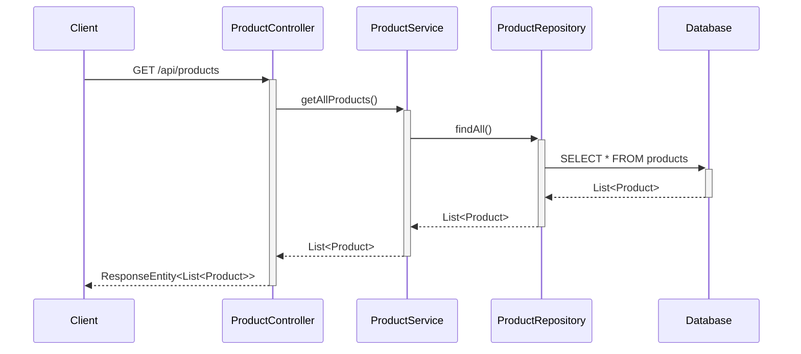
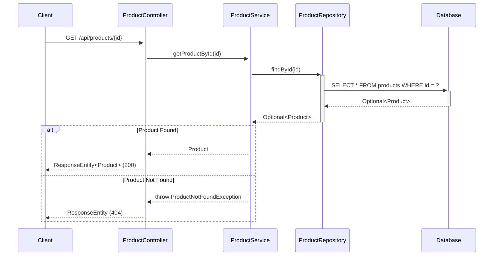
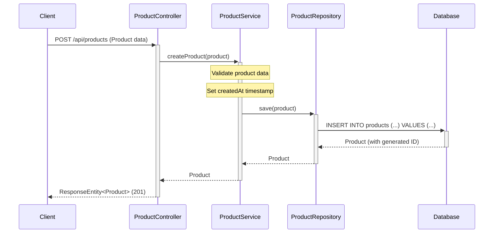
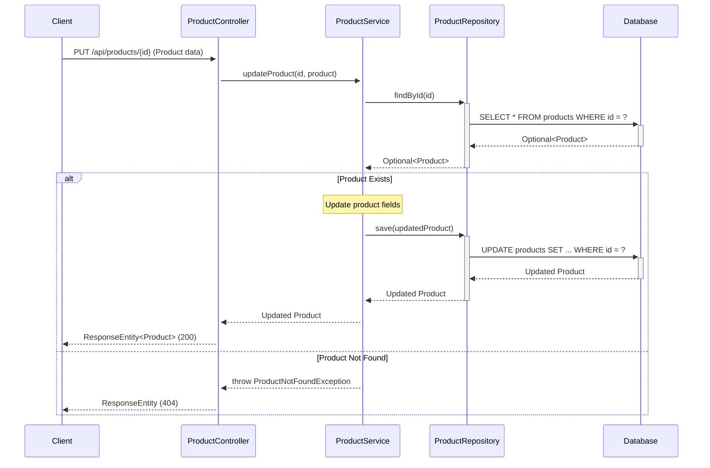
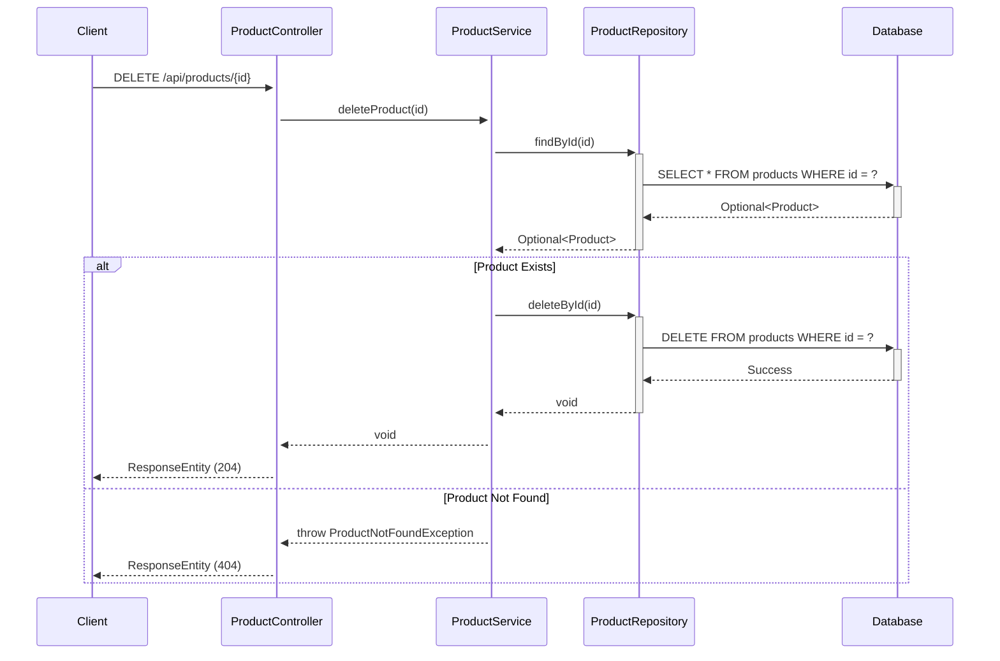
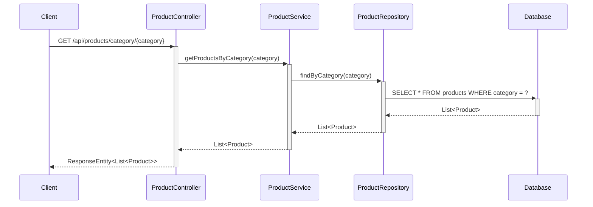
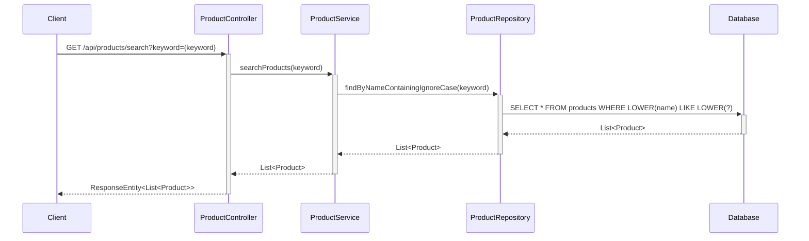
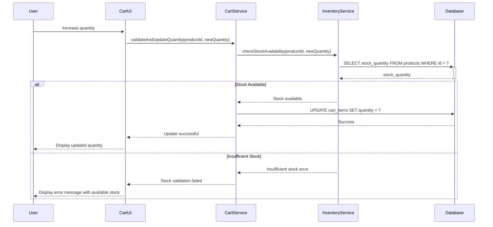

# Low-Level Design (LLD) - E-commerce Product Management System

## 1. Project Overview

**Framework:** Spring Boot  
**Language:** Java 21  
**Database:** PostgreSQL  
**Module:** ProductManagement  

## 2. System Architecture

### 2.1 Class Diagram


```mermaid
classDiagram
    class ProductController {
        <<@RestController>>
        -ProductService productService
        +getAllProducts() ResponseEntity~List~Product~~
        +getProductById(Long id) ResponseEntity~Product~
        +createProduct(Product product) ResponseEntity~Product~
        +updateProduct(Long id, Product product) ResponseEntity~Product~
        +deleteProduct(Long id) ResponseEntity~Void~
        +getProductsByCategory(String category) ResponseEntity~List~Product~~
        +searchProducts(String keyword) ResponseEntity~List~Product~~
    }
    
    class ProductService {
        <<@Service>>
        -ProductRepository productRepository
        +getAllProducts() List~Product~
        +getProductById(Long id) Product
        +createProduct(Product product) Product
        +updateProduct(Long id, Product product) Product
        +deleteProduct(Long id) void
        +getProductsByCategory(String category) List~Product~
        +searchProducts(String keyword) List~Product~
    }
    
    class ProductRepository {
        <<@Repository>>
        <<interface>>
        +findAll() List~Product~
        +findById(Long id) Optional~Product~
        +save(Product product) Product
        +deleteById(Long id) void
        +findByCategory(String category) List~Product~
        +findByNameContainingIgnoreCase(String keyword) List~Product~
    }
    
    class Product {
        <<@Entity>>
        -Long id
        -String name
        -String description
        -BigDecimal price
        -String category
        -Integer stockQuantity
        -LocalDateTime createdAt
        +getId() Long
        +setId(Long id) void
        +getName() String
        +setName(String name) void
        +getDescription() String
        +setDescription(String description) void
        +getPrice() BigDecimal
        +setPrice(BigDecimal price) void
        +getCategory() String
        +setCategory(String category) void
        +getStockQuantity() Integer
        +setStockQuantity(Integer stockQuantity) void
        +getCreatedAt() LocalDateTime
        +setCreatedAt(LocalDateTime createdAt) void
    }
    
    ProductController --> ProductService : depends on
    ProductService --> ProductRepository : depends on
    ProductRepository --> Product : manages
    ProductService --> Product : operates on
```

### 2.2 Entity Relationship Diagram


```mermaid
erDiagram
    PRODUCTS {
        BIGINT id PK "AUTO_INCREMENT, NOT NULL"
        VARCHAR name "NOT NULL, MAX_LENGTH(255)"
        TEXT description "NULLABLE"
        DECIMAL price "NOT NULL, PRECISION(10,2)"
        VARCHAR category "NOT NULL, MAX_LENGTH(100)"
        INTEGER stock_quantity "NOT NULL, DEFAULT 0"
        TIMESTAMP created_at "NOT NULL, DEFAULT CURRENT_TIMESTAMP"
    }
```

## 3. Sequence Diagrams

### 3.1 Get All Products


```mermaid
sequenceDiagram
    participant Client
    participant ProductController
    participant ProductService
    participant ProductRepository
    participant Database
    
    Client->>+ProductController: GET /api/products
    ProductController->>+ProductService: getAllProducts()
    ProductService->>+ProductRepository: findAll()
    ProductRepository->>+Database: SELECT * FROM products
    Database-->>-ProductRepository: List<Product>
    ProductRepository-->>-ProductService: List<Product>
    ProductService-->>-ProductController: List<Product>
    ProductController-->>-Client: ResponseEntity<List<Product>>
```

### 3.2 Get Product By ID


```mermaid
sequenceDiagram
    participant Client
    participant ProductController
    participant ProductService
    participant ProductRepository
    participant Database
    
    Client->>+ProductController: GET /api/products/{id}
    ProductController->>+ProductService: getProductById(id)
    ProductService->>+ProductRepository: findById(id)
    ProductRepository->>+Database: SELECT * FROM products WHERE id = ?
    Database-->>-ProductRepository: Optional<Product>
    ProductRepository-->>-ProductService: Optional<Product>
    
    alt Product Found
        ProductService-->>ProductController: Product
        ProductController-->>Client: ResponseEntity<Product> (200)
    else Product Not Found
        ProductService-->>ProductController: throw ProductNotFoundException
        ProductController-->>Client: ResponseEntity (404)
    end
```

### 3.3 Create Product


```mermaid
sequenceDiagram
    participant Client
    participant ProductController
    participant ProductService
    participant ProductRepository
    participant Database
    
    Client->>+ProductController: POST /api/products (Product data)
    ProductController->>+ProductService: createProduct(product)
    
    Note over ProductService: Validate product data
    Note over ProductService: Set createdAt timestamp
    
    ProductService->>+ProductRepository: save(product)
    ProductRepository->>+Database: INSERT INTO products (...) VALUES (...)
    Database-->>-ProductRepository: Product (with generated ID)
    ProductRepository-->>-ProductService: Product
    ProductService-->>-ProductController: Product
    ProductController-->>-Client: ResponseEntity<Product> (201)
```

### 3.4 Update Product


```mermaid
sequenceDiagram
    participant Client
    participant ProductController
    participant ProductService
    participant ProductRepository
    participant Database
    
    Client->>+ProductController: PUT /api/products/{id} (Product data)
    ProductController->>+ProductService: updateProduct(id, product)
    
    ProductService->>+ProductRepository: findById(id)
    ProductRepository->>+Database: SELECT * FROM products WHERE id = ?
    Database-->>-ProductRepository: Optional<Product>
    ProductRepository-->>-ProductService: Optional<Product>
    
    alt Product Exists
        Note over ProductService: Update product fields
        ProductService->>+ProductRepository: save(updatedProduct)
        ProductRepository->>+Database: UPDATE products SET ... WHERE id = ?
        Database-->>-ProductRepository: Updated Product
        ProductRepository-->>-ProductService: Updated Product
        ProductService-->>ProductController: Updated Product
        ProductController-->>Client: ResponseEntity<Product> (200)
    else Product Not Found
        ProductService-->>ProductController: throw ProductNotFoundException
        ProductController-->>Client: ResponseEntity (404)
    end
```

### 3.5 Delete Product


```mermaid
sequenceDiagram
    participant Client
    participant ProductController
    participant ProductService
    participant ProductRepository
    participant Database
    
    Client->>+ProductController: DELETE /api/products/{id}
    ProductController->>+ProductService: deleteProduct(id)
    
    ProductService->>+ProductRepository: findById(id)
    ProductRepository->>+Database: SELECT * FROM products WHERE id = ?
    Database-->>-ProductRepository: Optional<Product>
    ProductRepository-->>-ProductService: Optional<Product>
    
    alt Product Exists
        ProductService->>+ProductRepository: deleteById(id)
        ProductRepository->>+Database: DELETE FROM products WHERE id = ?
        Database-->>-ProductRepository: Success
        ProductRepository-->>-ProductService: void
        ProductService-->>ProductController: void
        ProductController-->>Client: ResponseEntity (204)
    else Product Not Found
        ProductService-->>ProductController: throw ProductNotFoundException
        ProductController-->>Client: ResponseEntity (404)
    end
```

### 3.6 Get Products By Category


```mermaid
sequenceDiagram
    participant Client
    participant ProductController
    participant ProductService
    participant ProductRepository
    participant Database
    
    Client->>+ProductController: GET /api/products/category/{category}
    ProductController->>+ProductService: getProductsByCategory(category)
    ProductService->>+ProductRepository: findByCategory(category)
    ProductRepository->>+Database: SELECT * FROM products WHERE category = ?
    Database-->>-ProductRepository: List<Product>
    ProductRepository-->>-ProductService: List<Product>
    ProductService-->>-ProductController: List<Product>
    ProductController-->>-Client: ResponseEntity<List<Product>>
```

### 3.7 Search Products


```mermaid
sequenceDiagram
    participant Client
    participant ProductController
    participant ProductService
    participant ProductRepository
    participant Database
    
    Client->>+ProductController: GET /api/products/search?keyword={keyword}
    ProductController->>+ProductService: searchProducts(keyword)
    ProductService->>+ProductRepository: findByNameContainingIgnoreCase(keyword)
    ProductRepository->>+Database: SELECT * FROM products WHERE LOWER(name) LIKE LOWER(?)
    Database-->>-ProductRepository: List<Product>
    ProductRepository-->>-ProductService: List<Product>
    ProductService-->>-ProductController: List<Product>
    ProductController-->>-Client: ResponseEntity<List<Product>>
```

## 4. API Endpoints Summary

| Method | Endpoint | Description | Request Body | Response |
|--------|----------|-------------|--------------|----------|
| GET | `/api/products` | Get all products | None | List<Product> |
| GET | `/api/products/{id}` | Get product by ID | None | Product |
| POST | `/api/products` | Create new product | Product | Product |
| PUT | `/api/products/{id}` | Update existing product | Product | Product |
| DELETE | `/api/products/{id}` | Delete product | None | None |
| GET | `/api/products/category/{category}` | Get products by category | None | List<Product> |
| GET | `/api/products/search?keyword={keyword}` | Search products by name | None | List<Product> |

## 5. Database Schema

### Products Table

```sql
CREATE TABLE products (
    id BIGINT PRIMARY KEY AUTO_INCREMENT,
    name VARCHAR(255) NOT NULL,
    description TEXT,
    price DECIMAL(10,2) NOT NULL,
    category VARCHAR(100) NOT NULL,
    stock_quantity INTEGER NOT NULL DEFAULT 0,
    created_at TIMESTAMP NOT NULL DEFAULT CURRENT_TIMESTAMP
);

CREATE INDEX idx_products_category ON products(category);
CREATE INDEX idx_products_name ON products(name);
```

## 6. Technology Stack

- **Backend Framework:** Spring Boot 3.x
- **Language:** Java 21
- **Database:** PostgreSQL
- **ORM:** Spring Data JPA / Hibernate
- **Build Tool:** Maven/Gradle
- **API Documentation:** Swagger/OpenAPI 3

## 7. Design Patterns Used

1. **MVC Pattern:** Separation of Controller, Service, and Repository layers
2. **Repository Pattern:** Data access abstraction through ProductRepository
3. **Dependency Injection:** Spring's IoC container manages dependencies
4. **DTO Pattern:** Data Transfer Objects for API requests/responses
5. **Exception Handling:** Custom exceptions for business logic errors

## 8. Key Features

- RESTful API design following HTTP standards
- Proper HTTP status codes for different scenarios
- Input validation and error handling
- Database indexing for performance optimization
- Transactional operations for data consistency
- Pagination support for large datasets (can be extended)
- Search functionality with case-insensitive matching

---

## 9. Cart Management Module - Functional Requirements

### 9.1 Cart Management - Product Addition

**Requirement Reference:** AC-1: Product addition with default quantity and minimum procurement threshold handling

**Description:**
Implement functionality to add products to the shopping cart with the following capabilities:
- Default quantity of 1 when adding a product
- Automatic adjustment to minimum procurement threshold if applicable
- Support for subscription vs one-time purchase quantity logic
- Validation of product availability before addition

**Implementation Details:**
- Check product stock availability before adding to cart
- Apply minimum procurement threshold rules based on product type
- Handle subscription product quantity rules differently from one-time purchases
- Persist cart state across user sessions

### 9.2 Cart Display

**Requirement Reference:** AC-2: Cart page display with product details

**Description:**
Design and implement a comprehensive cart page layout that displays:
- Product name with link to product details
- Unit price per item
- Quantity selector with increment/decrement controls
- Line item subtotal (unit price × quantity)
- Overall cart total
- Product thumbnail images
- Remove item button for each cart entry

**UI Components:**
- Cart item card component displaying all product information
- Quantity selector with +/- buttons
- Subtotal calculation display
- Cart summary section with total
- Empty cart state message

### 9.3 Real-time Updates

**Requirement Reference:** AC-3: Instant quantity updates and total recalculation

**Description:**
Implement real-time cart update functionality:
- Instant quantity updates without page refresh
- Automatic line item subtotal recalculation
- Overall cart total recalculation
- Optimistic UI updates with rollback on error
- Debounced API calls to prevent excessive requests

**Technical Implementation:**
- Use client-side state management for immediate UI response
- Implement debouncing for quantity change API calls
- Handle concurrent update conflicts
- Provide visual feedback during updates

### 9.4 Item Removal

**Requirement Reference:** AC-4: Product removal and total recalculation

**Description:**
Implement product removal functionality:
- Delete button for each cart item
- Confirmation dialog for removal action
- Automatic cart total recalculation after removal
- Smooth animation for item removal
- Update cart badge count in navigation

**User Experience:**
- Clear visual indication of remove action
- Undo option for accidental removals (optional)
- Instant UI update with backend synchronization

### 9.5 Empty Cart State

**Requirement Reference:** AC-5: Empty cart messaging and navigation

**Description:**
Handle empty cart state with:
- "Your cart is empty" message display
- Call-to-action button to return to product catalog
- Suggested products or categories (optional)
- Clear visual indication of empty state

**UI Design:**
- Centered empty state message
- Prominent "Continue Shopping" button
- Optional product recommendations
- Consistent styling with overall design system

### 9.6 Inventory Validation

**Requirement Reference:** AC-6: Stock availability validation and error messaging

**Description:**
Implement comprehensive inventory validation:
- Real-time stock availability checking
- Prevent quantity increases beyond available stock
- Display appropriate error messages for stock limitations
- Show current stock availability to users
- Handle out-of-stock scenarios gracefully

**Validation Rules:**
- Check stock before allowing quantity increase
- Display warning when approaching stock limits
- Prevent checkout if any item exceeds available stock
- Provide alternative suggestions for out-of-stock items


```mermaid
sequenceDiagram
    participant User
    participant CartUI
    participant CartService
    participant InventoryService
    participant Database
    
    User->>+CartUI: Increase quantity
    CartUI->>+CartService: validateAndUpdateQuantity(productId, newQuantity)
    CartService->>+InventoryService: checkStockAvailability(productId, newQuantity)
    InventoryService->>+Database: SELECT stock_quantity FROM products WHERE id = ?
    Database-->>-InventoryService: stock_quantity
    
    alt Stock Available
        InventoryService-->>CartService: Stock available
        CartService->>Database: UPDATE cart_items SET quantity = ?
        Database-->>CartService: Success
        CartService-->>CartUI: Update successful
        CartUI-->>User: Display updated quantity
    else Insufficient Stock
        InventoryService-->>CartService: Insufficient stock error
        CartService-->>CartUI: Stock validation failed
        CartUI-->>User: Display error message with available stock
    end
```
