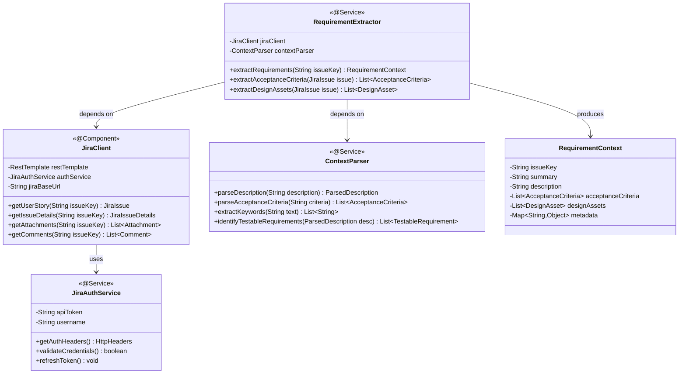
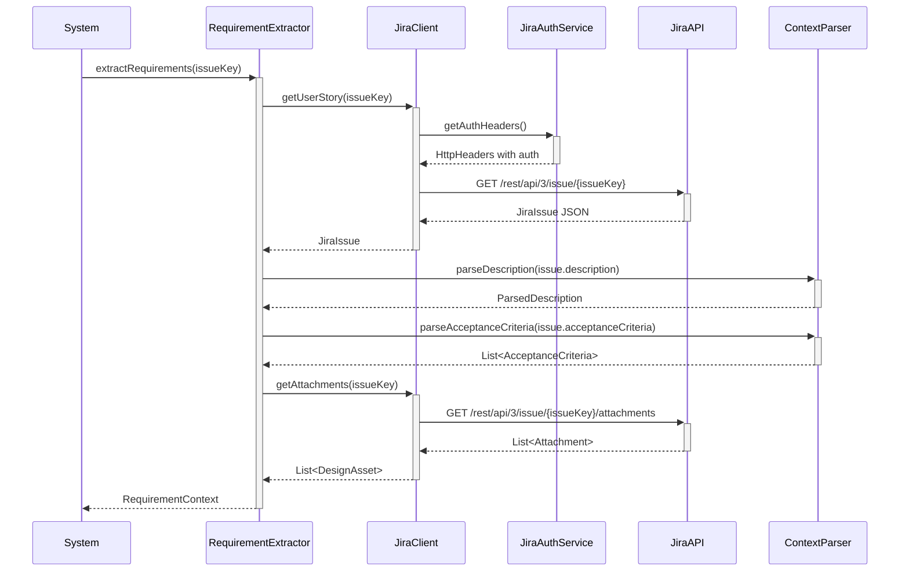
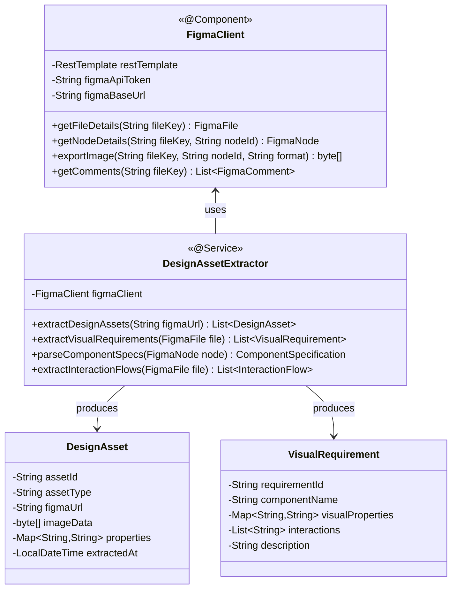
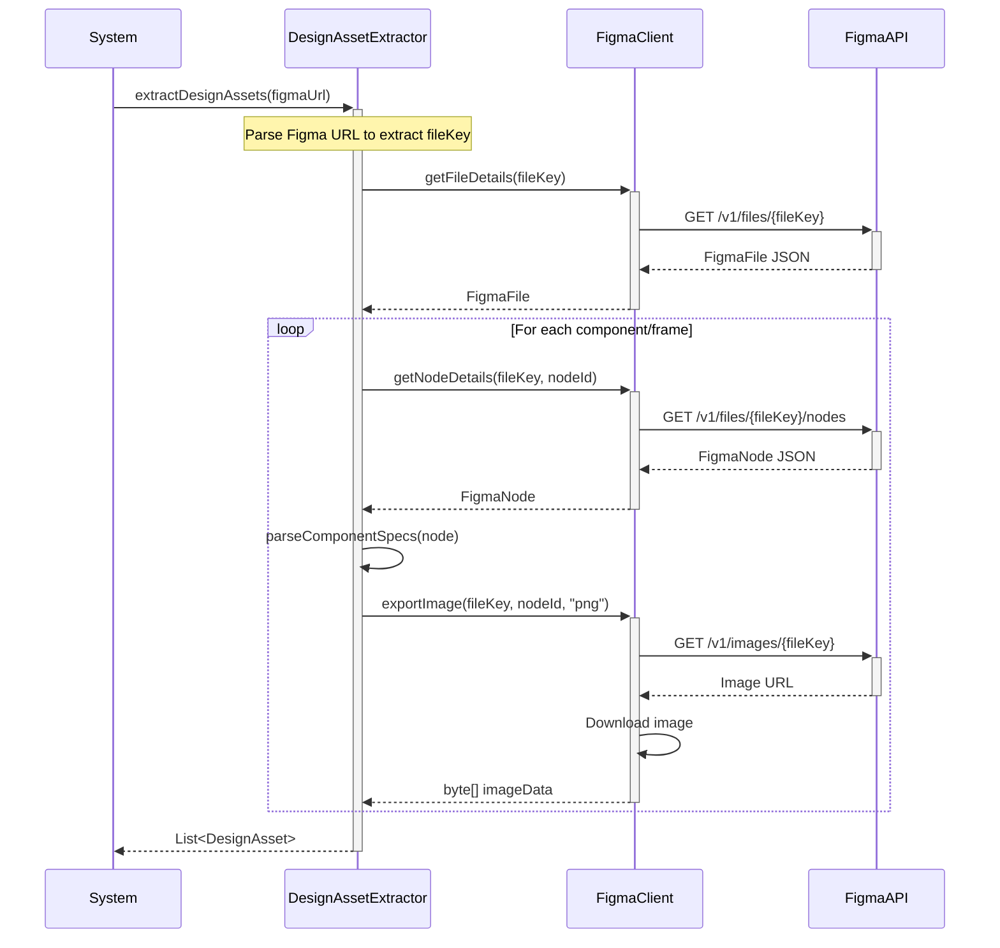
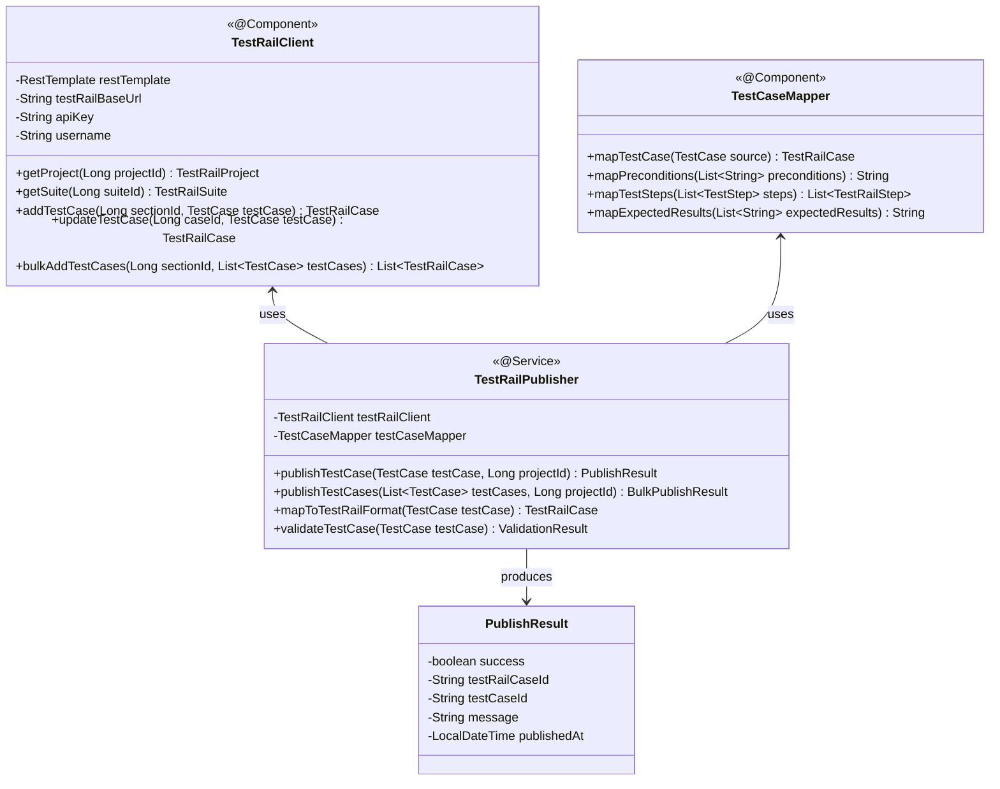
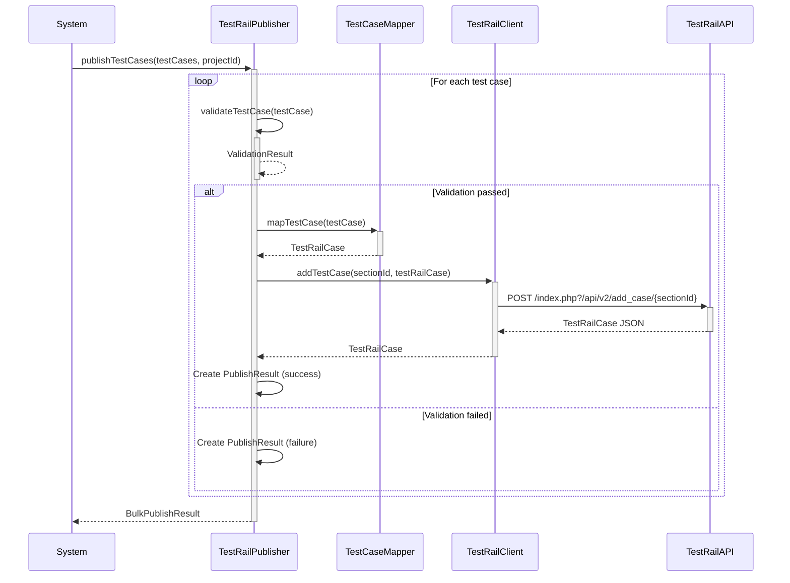

# Low-Level Design (LLD) - E-commerce Product Management System

## 1. Project Overview

**Framework:** Spring Boot  
**Language:** Java 21  
**Database:** PostgreSQL  
**Module:** ProductManagement  

## 2. System Architecture

## 3. Technology Stack

- **Backend Framework:** Spring Boot 3.x
- **Language:** Java 21
- **Database:** PostgreSQL
- **ORM:** Spring Data JPA / Hibernate
- **Build Tool:** Maven/Gradle
- **API Documentation:** Swagger/OpenAPI 3

## 4. Key Features

- RESTful API design following HTTP standards
- Proper HTTP status codes for different scenarios
- Input validation and error handling
- Database indexing for performance optimization
- Transactional operations for data consistency
- Pagination support for large datasets (can be extended)
- Search functionality with case-insensitive matching

## 5. Integration Layer - Context Ingestion

**Requirement Reference:** Epic SCRUM-338 - Context Ingestion

### 5.1 Jira API Integration

This section describes the integration with Jira API to extract User Story descriptions, acceptance criteria, and design assets for ingesting product requirements.

#### 5.1.1 Integration Architecture

```mermaid
classDiagram
    class JiraClient {
        <<@Component>>
        -RestTemplate restTemplate
        -JiraAuthService authService
        -String jiraBaseUrl
        +getUserStory(String issueKey) JiraIssue
        +getIssueDetails(String issueKey) JiraIssueDetails
        +getAttachments(String issueKey) List~Attachment~
        +getComments(String issueKey) List~Comment~
    }
    
    class JiraAuthService {
        <<@Service>>
        -String apiToken
        -String username
        +getAuthHeaders() HttpHeaders
        +validateCredentials() boolean
        +refreshToken() void
    }
    
    class RequirementExtractor {
        <<@Service>>
        -JiraClient jiraClient
        -ContextParser contextParser
        +extractRequirements(String issueKey) RequirementContext
        +extractAcceptanceCriteria(JiraIssue issue) List~AcceptanceCriteria~
        +extractDesignAssets(JiraIssue issue) List~DesignAsset~
    }
    
    class ContextParser {
        <<@Service>>
        +parseDescription(String description) ParsedDescription
        +parseAcceptanceCriteria(String criteria) List~AcceptanceCriteria~
        +extractKeywords(String text) List~String~
        +identifyTestableRequirements(ParsedDescription desc) List~TestableRequirement~
    }
    
    class RequirementContext {
        -String issueKey
        -String summary
        -String description
        -List~AcceptanceCriteria~ acceptanceCriteria
        -List~DesignAsset~ designAssets
        -Map~String,Object~ metadata
    }
    
    JiraClient --> JiraAuthService : uses
    RequirementExtractor --> JiraClient : depends on
    RequirementExtractor --> ContextParser : depends on
    RequirementExtractor --> RequirementContext : produces
```

#### 5.1.2 Jira Context Ingestion Flow

```mermaid
sequenceDiagram
    participant System
    participant RequirementExtractor
    participant JiraClient
    participant JiraAuthService
    participant JiraAPI
    participant ContextParser
    
    System->>+RequirementExtractor: extractRequirements(issueKey)
    RequirementExtractor->>+JiraClient: getUserStory(issueKey)
    JiraClient->>+JiraAuthService: getAuthHeaders()
    JiraAuthService-->>-JiraClient: HttpHeaders with auth
    JiraClient->>+JiraAPI: GET /rest/api/3/issue/{issueKey}
    JiraAPI-->>-JiraClient: JiraIssue JSON
    JiraClient-->>-RequirementExtractor: JiraIssue
    
    RequirementExtractor->>+ContextParser: parseDescription(issue.description)
    ContextParser-->>-RequirementExtractor: ParsedDescription
    
    RequirementExtractor->>+ContextParser: parseAcceptanceCriteria(issue.acceptanceCriteria)
    ContextParser-->>-RequirementExtractor: List<AcceptanceCriteria>
    
    RequirementExtractor->>+JiraClient: getAttachments(issueKey)
    JiraClient->>+JiraAPI: GET /rest/api/3/issue/{issueKey}/attachments
    JiraAPI-->>-JiraClient: List<Attachment>
    JiraClient-->>-RequirementExtractor: List<DesignAsset>
    
    RequirementExtractor-->>-System: RequirementContext
```

### 5.2 Figma Design Integration

**Requirement Reference:** Story Description - Figma Integration

This section describes the integration with Figma to extract design assets and visual requirements.

#### 5.2.1 Figma Integration Architecture

```mermaid
classDiagram
    class FigmaClient {
        <<@Component>>
        -RestTemplate restTemplate
        -String figmaApiToken
        -String figmaBaseUrl
        +getFileDetails(String fileKey) FigmaFile
        +getNodeDetails(String fileKey, String nodeId) FigmaNode
        +exportImage(String fileKey, String nodeId, String format) byte[]
        +getComments(String fileKey) List~FigmaComment~
    }
    
    class DesignAssetExtractor {
        <<@Service>>
        -FigmaClient figmaClient
        +extractDesignAssets(String figmaUrl) List~DesignAsset~
        +extractVisualRequirements(FigmaFile file) List~VisualRequirement~
        +parseComponentSpecs(FigmaNode node) ComponentSpecification
        +extractInteractionFlows(FigmaFile file) List~InteractionFlow~
    }
    
    class DesignAsset {
        -String assetId
        -String assetType
        -String figmaUrl
        -byte[] imageData
        -Map~String,String~ properties
        -LocalDateTime extractedAt
    }
    
    class VisualRequirement {
        -String requirementId
        -String componentName
        -Map~String,String~ visualProperties
        -List~String~ interactions
        -String description
    }
    
    FigmaClient <-- DesignAssetExtractor : uses
    DesignAssetExtractor --> DesignAsset : produces
    DesignAssetExtractor --> VisualRequirement : produces
```

#### 5.2.2 Figma Asset Extraction Flow

```mermaid
sequenceDiagram
    participant System
    participant DesignAssetExtractor
    participant FigmaClient
    participant FigmaAPI
    
    System->>+DesignAssetExtractor: extractDesignAssets(figmaUrl)
    Note over DesignAssetExtractor: Parse Figma URL to extract fileKey
    
    DesignAssetExtractor->>+FigmaClient: getFileDetails(fileKey)
    FigmaClient->>+FigmaAPI: GET /v1/files/{fileKey}
    FigmaAPI-->>-FigmaClient: FigmaFile JSON
    FigmaClient-->>-DesignAssetExtractor: FigmaFile
    
    loop For each component/frame
        DesignAssetExtractor->>+FigmaClient: getNodeDetails(fileKey, nodeId)
        FigmaClient->>+FigmaAPI: GET /v1/files/{fileKey}/nodes
        FigmaAPI-->>-FigmaClient: FigmaNode JSON
        FigmaClient-->>-DesignAssetExtractor: FigmaNode
        
        DesignAssetExtractor->>DesignAssetExtractor: parseComponentSpecs(node)
        
        DesignAssetExtractor->>+FigmaClient: exportImage(fileKey, nodeId, "png")
        FigmaClient->>+FigmaAPI: GET /v1/images/{fileKey}
        FigmaAPI-->>-FigmaClient: Image URL
        FigmaClient->>FigmaClient: Download image
        FigmaClient-->>-DesignAssetExtractor: byte[] imageData
    end
    
    DesignAssetExtractor-->>-System: List<DesignAsset>
```

### 5.3 TestRail Integration

**Requirement Reference:** Epic SCRUM-338 - Test Management Integration

This section describes the integration with TestRail API to publish generated test cases.

#### 5.3.1 TestRail Integration Architecture

```mermaid
classDiagram
    class TestRailClient {
        <<@Component>>
        -RestTemplate restTemplate
        -String testRailBaseUrl
        -String apiKey
        -String username
        +getProject(Long projectId) TestRailProject
        +getSuite(Long suiteId) TestRailSuite
        +addTestCase(Long sectionId, TestCase testCase) TestRailCase
        +updateTestCase(Long caseId, TestCase testCase) TestRailCase
        +bulkAddTestCases(Long sectionId, List~TestCase~ testCases) List~TestRailCase~
    }
    
    class TestRailPublisher {
        <<@Service>>
        -TestRailClient testRailClient
        -TestCaseMapper testCaseMapper
        +publishTestCase(TestCase testCase, Long projectId) PublishResult
        +publishTestCases(List~TestCase~ testCases, Long projectId) BulkPublishResult
        +mapToTestRailFormat(TestCase testCase) TestRailCase
        +validateTestCase(TestCase testCase) ValidationResult
    }
    
    class TestCaseMapper {
        <<@Component>>
        +mapTestCase(TestCase source) TestRailCase
        +mapPreconditions(List~String~ preconditions) String
        +mapTestSteps(List~TestStep~ steps) List~TestRailStep~
        +mapExpectedResults(List~String~ expectedResults) String
    }
    
    class PublishResult {
        -boolean success
        -String testRailCaseId
        -String testCaseId
        -String message
        -LocalDateTime publishedAt
    }
    
    TestRailClient <-- TestRailPublisher : uses
    TestCaseMapper <-- TestRailPublisher : uses
    TestRailPublisher --> PublishResult : produces
```

#### 5.3.2 TestRail Publishing Flow

```mermaid
sequenceDiagram
    participant System
    participant TestRailPublisher
    participant TestCaseMapper
    participant TestRailClient
    participant TestRailAPI
    
    System->>+TestRailPublisher: publishTestCases(testCases, projectId)
    
    loop For each test case
        TestRailPublisher->>+TestRailPublisher: validateTestCase(testCase)
        TestRailPublisher-->>-TestRailPublisher: ValidationResult
        
        alt Validation passed
            TestRailPublisher->>+TestCaseMapper: mapTestCase(testCase)
            TestCaseMapper-->>-TestRailPublisher: TestRailCase
            
            TestRailPublisher->>+TestRailClient: addTestCase(sectionId, testRailCase)
            TestRailClient->>+TestRailAPI: POST /index.php?/api/v2/add_case/{sectionId}
            TestRailAPI-->>-TestRailClient: TestRailCase JSON
            TestRailClient-->>-TestRailPublisher: TestRailCase
            
            TestRailPublisher->>TestRailPublisher: Create PublishResult (success)
        else Validation failed
            TestRailPublisher->>TestRailPublisher: Create PublishResult (failure)
        end
    end
    
    TestRailPublisher-->>-System: BulkPublishResult
```
