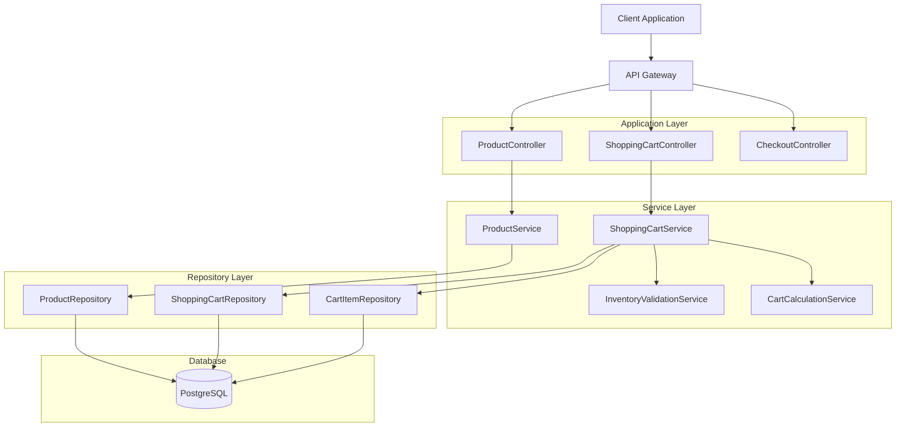

# Low-Level Design: E-commerce Product Management System

## 1. System Overview

This document provides the low-level design for an E-commerce Product Management System that supports both one-time purchases and subscription-based products. The system enables customers to browse products, add items to their shopping cart, and complete purchases through a streamlined checkout process.

### 1.1 Purpose
To provide detailed technical specifications for implementing a scalable product management and shopping cart system with support for multiple purchase types.

### 1.2 Scope
- Product catalog management
- Shopping cart functionality
- Inventory management
- Purchase type handling (one-time and subscription)
- Checkout process

## 2. Architecture Overview

### 2.1 System Architecture

```mermaid
graph TB
    Client[Client Application]
    Gateway[API Gateway]
    
    subgraph "Application Layer"
        PC[ProductController]
        SCC[ShoppingCartController]
        CC[CheckoutController]
    end
    
    subgraph "Service Layer"
        PS[ProductService]
        SCS[ShoppingCartService]
        IVS[InventoryValidationService]
        CCS[CartCalculationService]
    end
    
    subgraph "Repository Layer"
        PR[ProductRepository]
        SCR[ShoppingCartRepository]
        CIR[CartItemRepository]
    end
    
    subgraph "Database"
        DB[(PostgreSQL)]
    end
    
    Client --> Gateway
    Gateway --> PC
    Gateway --> SCC
    Gateway --> CC
    
    PC --> PS
    SCC --> SCS
    
    SCS --> IVS
    SCS --> CCS
    
    PS --> PR
    SCS --> SCR
    SCS --> CIR
    
    PR --> DB
    SCR --> DB
    CIR --> DB
```

### 2.2 Technology Stack
- **Backend Framework**: Spring Boot 3.x
- **Language**: Java 17
- **Database**: PostgreSQL 14+
- **ORM**: Spring Data JPA / Hibernate
- **API Documentation**: OpenAPI 3.0 / Swagger
- **Build Tool**: Maven
- **Caching**: Redis (for cart sessions)
