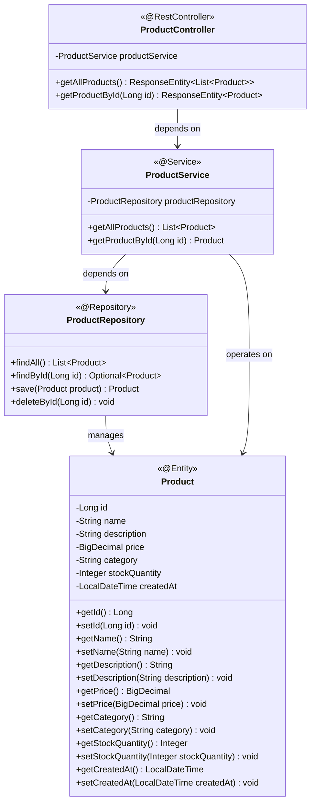
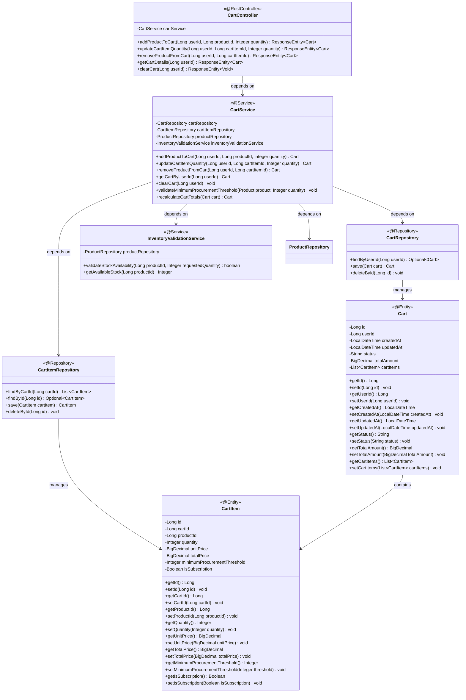
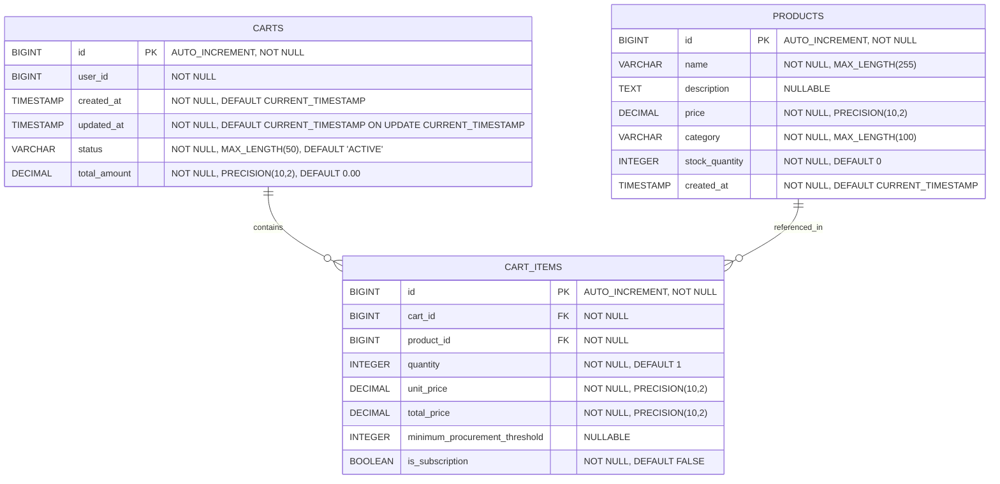
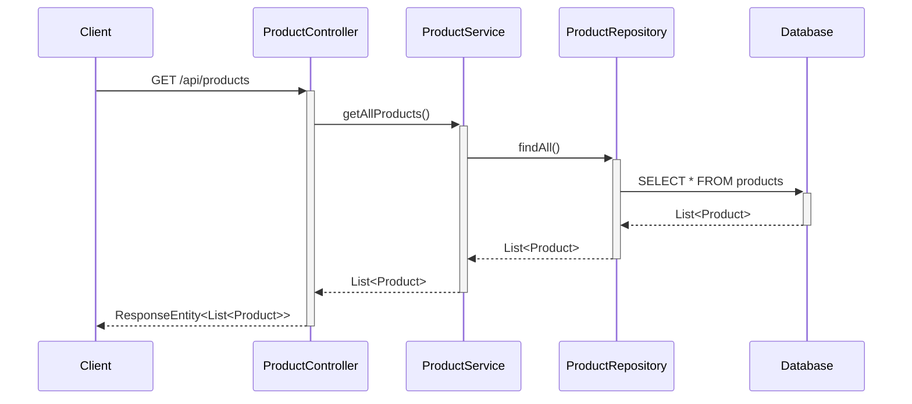
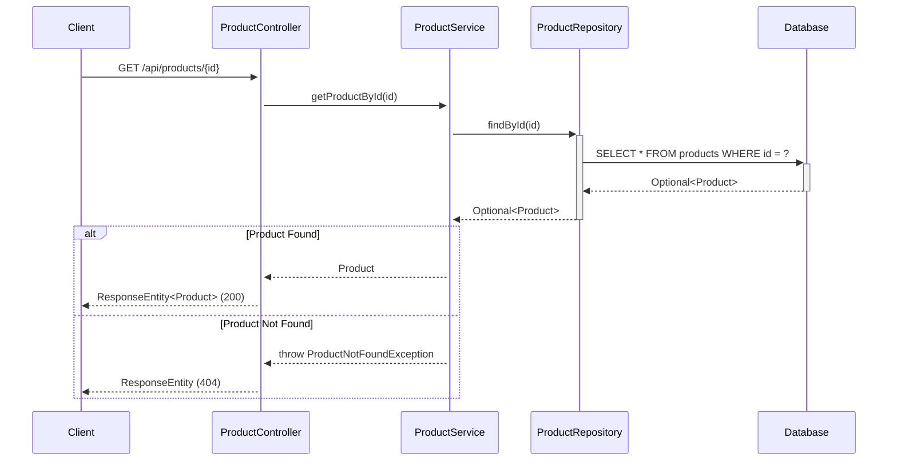
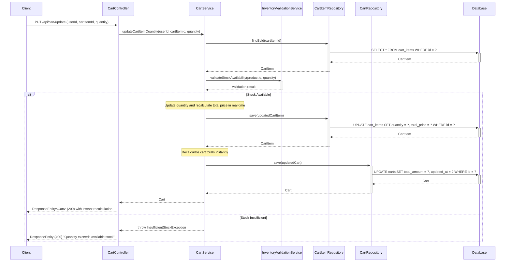
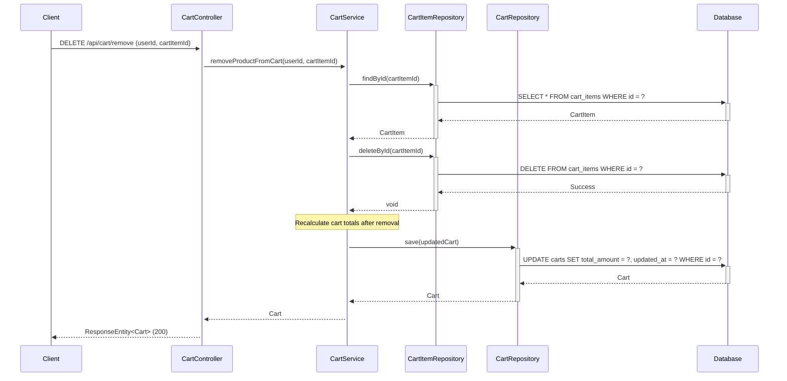
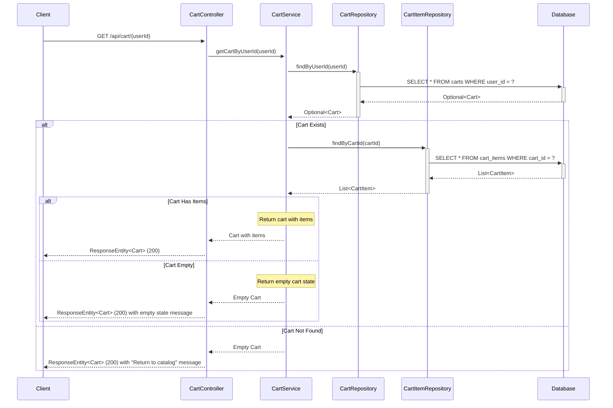
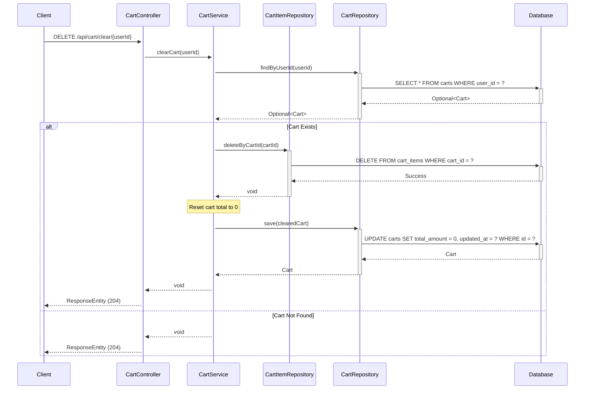

# Low-Level Design (LLD) - E-commerce Product Management System

## 1. Project Overview

**Framework:** Spring Boot  
**Language:** Java 21  
**Database:** PostgreSQL  
**Module:** ProductManagement  

## 2. System Architecture

### 2.1 Class Diagram

```mermaid
classDiagram
    class ProductController {
        <<@RestController>>
        -ProductService productService
        +getAllProducts() ResponseEntity~List~Product~~
        +getProductById(Long id) ResponseEntity~Product~
    }
    
    class ProductService {
        <<@Service>>
        -ProductRepository productRepository
        +getAllProducts() List~Product~
        +getProductById(Long id) Product
    }
    
    class ProductRepository {
        <<@Repository>>
        <<interface>>
        +findAll() List~Product~
        +findById(Long id) Optional~Product~
        +save(Product product) Product
        +deleteById(Long id) void
    }
    
    class Product {
        <<@Entity>>
        -Long id
        -String name
        -String description
        -BigDecimal price
        -String category
        -Integer stockQuantity
        -LocalDateTime createdAt
        +getId() Long
        +setId(Long id) void
        +getName() String
        +setName(String name) void
        +getDescription() String
        +setDescription(String description) void
        +getPrice() BigDecimal
        +setPrice(BigDecimal price) void
        +getCategory() String
        +setCategory(String category) void
        +getStockQuantity() Integer
        +setStockQuantity(Integer stockQuantity) void
        +getCreatedAt() LocalDateTime
        +setCreatedAt(LocalDateTime createdAt) void
    }
    
    ProductController --> ProductService : depends on
    ProductService --> ProductRepository : depends on
    ProductRepository --> Product : manages
    ProductService --> Product : operates on
```

### 2.1.1 Cart Management Class Diagram (NEW)

```mermaid
classDiagram
    class CartController {
        <<@RestController>>
        -CartService cartService
        +addProductToCart(Long userId, Long productId, Integer quantity) ResponseEntity~Cart~
        +updateCartItemQuantity(Long userId, Long cartItemId, Integer quantity) ResponseEntity~Cart~
        +removeProductFromCart(Long userId, Long cartItemId) ResponseEntity~Cart~
        +getCartDetails(Long userId) ResponseEntity~Cart~
        +clearCart(Long userId) ResponseEntity~Void~
    }
    
    class CartService {
        <<@Service>>
        -CartRepository cartRepository
        -CartItemRepository cartItemRepository
        -ProductRepository productRepository
        -InventoryValidationService inventoryValidationService
        +addProductToCart(Long userId, Long productId, Integer quantity) Cart
        +updateCartItemQuantity(Long userId, Long cartItemId, Integer quantity) Cart
        +removeProductFromCart(Long userId, Long cartItemId) Cart
        +getCartByUserId(Long userId) Cart
        +clearCart(Long userId) void
        +validateMinimumProcurementThreshold(Product product, Integer quantity) void
        +recalculateCartTotals(Cart cart) Cart
    }
    
    class CartRepository {
        <<@Repository>>
        <<interface>>
        +findByUserId(Long userId) Optional~Cart~
        +save(Cart cart) Cart
        +deleteById(Long id) void
    }
    
    class CartItemRepository {
        <<@Repository>>
        <<interface>>
        +findByCartId(Long cartId) List~CartItem~
        +findById(Long id) Optional~CartItem~
        +save(CartItem cartItem) CartItem
        +deleteById(Long id) void
    }
    
    class Cart {
        <<@Entity>>
        -Long id
        -Long userId
        -LocalDateTime createdAt
        -LocalDateTime updatedAt
        -String status
        -BigDecimal totalAmount
        -List~CartItem~ cartItems
        +getId() Long
        +setId(Long id) void
        +getUserId() Long
        +setUserId(Long userId) void
        +getCreatedAt() LocalDateTime
        +setCreatedAt(LocalDateTime createdAt) void
        +getUpdatedAt() LocalDateTime
        +setUpdatedAt(LocalDateTime updatedAt) void
        +getStatus() String
        +setStatus(String status) void
        +getTotalAmount() BigDecimal
        +setTotalAmount(BigDecimal totalAmount) void
        +getCartItems() List~CartItem~
        +setCartItems(List~CartItem~ cartItems) void
    }
    
    class CartItem {
        <<@Entity>>
        -Long id
        -Long cartId
        -Long productId
        -Integer quantity
        -BigDecimal unitPrice
        -BigDecimal totalPrice
        -Integer minimumProcurementThreshold
        -Boolean isSubscription
        +getId() Long
        +setId(Long id) void
        +getCartId() Long
        +setCartId(Long cartId) void
        +getProductId() Long
        +setProductId(Long productId) void
        +getQuantity() Integer
        +setQuantity(Integer quantity) void
        +getUnitPrice() BigDecimal
        +setUnitPrice(BigDecimal unitPrice) void
        +getTotalPrice() BigDecimal
        +setTotalPrice(BigDecimal totalPrice) void
        +getMinimumProcurementThreshold() Integer
        +setMinimumProcurementThreshold(Integer threshold) void
        +getIsSubscription() Boolean
        +setIsSubscription(Boolean isSubscription) void
    }
    
    class InventoryValidationService {
        <<@Service>>
        -ProductRepository productRepository
        +validateStockAvailability(Long productId, Integer requestedQuantity) boolean
        +getAvailableStock(Long productId) Integer
    }
    
    CartController --> CartService : depends on
    CartService --> CartRepository : depends on
    CartService --> CartItemRepository : depends on
    CartService --> ProductRepository : depends on
    CartService --> InventoryValidationService : depends on
    CartRepository --> Cart : manages
    CartItemRepository --> CartItem : manages
    Cart --> CartItem : contains
```

### 2.2 Entity Relationship Diagram

```mermaid
erDiagram
    PRODUCTS {
        BIGINT id PK "AUTO_INCREMENT, NOT NULL"
        VARCHAR name "NOT NULL, MAX_LENGTH(255)"
        TEXT description "NULLABLE"
        DECIMAL price "NOT NULL, PRECISION(10,2)"
        VARCHAR category "NOT NULL, MAX_LENGTH(100)"
        INTEGER stock_quantity "NOT NULL, DEFAULT 0"
        TIMESTAMP created_at "NOT NULL, DEFAULT CURRENT_TIMESTAMP"
    }
    
    CARTS {
        BIGINT id PK "AUTO_INCREMENT, NOT NULL"
        BIGINT user_id "NOT NULL"
        TIMESTAMP created_at "NOT NULL, DEFAULT CURRENT_TIMESTAMP"
        TIMESTAMP updated_at "NOT NULL, DEFAULT CURRENT_TIMESTAMP ON UPDATE CURRENT_TIMESTAMP"
        VARCHAR status "NOT NULL, MAX_LENGTH(50), DEFAULT 'ACTIVE'"
        DECIMAL total_amount "NOT NULL, PRECISION(10,2), DEFAULT 0.00"
    }
    
    CART_ITEMS {
        BIGINT id PK "AUTO_INCREMENT, NOT NULL"
        BIGINT cart_id FK "NOT NULL"
        BIGINT product_id FK "NOT NULL"
        INTEGER quantity "NOT NULL, DEFAULT 1"
        DECIMAL unit_price "NOT NULL, PRECISION(10,2)"
        DECIMAL total_price "NOT NULL, PRECISION(10,2)"
        INTEGER minimum_procurement_threshold "NULLABLE"
        BOOLEAN is_subscription "NOT NULL, DEFAULT FALSE"
    }
    
    CARTS ||--o{ CART_ITEMS : contains
    PRODUCTS ||--o{ CART_ITEMS : referenced_in
```

## 3. Sequence Diagrams

### 3.1 Get All Products

```mermaid
sequenceDiagram
    participant Client
    participant ProductController
    participant ProductService
    participant ProductRepository
    participant Database
    
    Client->>+ProductController: GET /api/products
    ProductController->>+ProductService: getAllProducts()
    ProductService->>+ProductRepository: findAll()
    ProductRepository->>+Database: SELECT * FROM products
    Database-->>-ProductRepository: List<Product>
    ProductRepository-->>-ProductService: List<Product>
    ProductService-->>-ProductController: List<Product>
    ProductController-->>-Client: ResponseEntity<List<Product>>
```

### 3.2 Get Product By ID

```mermaid
sequenceDiagram
    participant Client
    participant ProductController
    participant ProductService
    participant ProductRepository
    participant Database
    
    Client->>+ProductController: GET /api/products/{id}
    ProductController->>+ProductService: getProductById(id)
    ProductService->>+ProductRepository: findById(id)
    ProductRepository->>+Database: SELECT * FROM products WHERE id = ?
    Database-->>-ProductRepository: Optional<Product>
    ProductRepository-->>-ProductService: Optional<Product>
    
    alt Product Found
        ProductService-->>ProductController: Product
        ProductController-->>Client: ResponseEntity<Product> (200)
    else Product Not Found
        ProductService-->>ProductController: throw ProductNotFoundException
        ProductController-->>Client: ResponseEntity (404)
    end
```

### 3.3 Add Product to Cart (NEW)

```mermaid
sequenceDiagram
    participant Client
    participant CartController
    participant CartService
    participant InventoryValidationService
    participant ProductRepository
    participant CartRepository
    participant CartItemRepository
    participant Database
    
    Client->>+CartController: POST /api/cart/add (userId, productId, quantity)
    CartController->>+CartService: addProductToCart(userId, productId, quantity)
    
    CartService->>+ProductRepository: findById(productId)
    ProductRepository->>+Database: SELECT * FROM products WHERE id = ?
    Database-->>-ProductRepository: Product
    ProductRepository-->>-CartService: Product
    
    Note over CartService: Validate minimum procurement threshold
    Note over CartService: Check subscription logic
    
    CartService->>+InventoryValidationService: validateStockAvailability(productId, quantity)
    InventoryValidationService->>+ProductRepository: findById(productId)
    ProductRepository->>+Database: SELECT stock_quantity FROM products WHERE id = ?
    Database-->>-ProductRepository: stock_quantity
    ProductRepository-->>-InventoryValidationService: stock_quantity
    
    alt Stock Available
        InventoryValidationService-->>-CartService: true
        
        CartService->>+CartRepository: findByUserId(userId)
        CartRepository->>+Database: SELECT * FROM carts WHERE user_id = ?
        Database-->>-CartRepository: Optional<Cart>
        CartRepository-->>-CartService: Optional<Cart>
        
        alt Cart Exists
            Note over CartService: Use existing cart
        else Cart Not Exists
            Note over CartService: Create new cart
            CartService->>+CartRepository: save(newCart)
            CartRepository->>+Database: INSERT INTO carts (...) VALUES (...)
            Database-->>-CartRepository: Cart
            CartRepository-->>-CartService: Cart
        end
        
        Note over CartService: Create cart item with quantity, unit price, total price
        CartService->>+CartItemRepository: save(cartItem)
        CartItemRepository->>+Database: INSERT INTO cart_items (...) VALUES (...)
        Database-->>-CartItemRepository: CartItem
        CartItemRepository-->>-CartService: CartItem
        
        Note over CartService: Recalculate cart totals in real-time
        CartService->>+CartRepository: save(updatedCart)
        CartRepository->>+Database: UPDATE carts SET total_amount = ?, updated_at = ? WHERE id = ?
        Database-->>-CartRepository: Cart
        CartRepository-->>-CartService: Cart
        
        CartService-->>CartController: Cart
        CartController-->>Client: ResponseEntity<Cart> (200)
    else Stock Insufficient
        InventoryValidationService-->>-CartService: false
        CartService-->>CartController: throw InsufficientStockException
        CartController-->>Client: ResponseEntity (400) "Quantity exceeds available stock"
    end
```

### 3.4 Update Cart Item Quantity (NEW)

```mermaid
sequenceDiagram
    participant Client
    participant CartController
    participant CartService
    participant InventoryValidationService
    participant CartItemRepository
    participant CartRepository
    participant Database
    
    Client->>+CartController: PUT /api/cart/update (userId, cartItemId, quantity)
    CartController->>+CartService: updateCartItemQuantity(userId, cartItemId, quantity)
    
    CartService->>+CartItemRepository: findById(cartItemId)
    CartItemRepository->>+Database: SELECT * FROM cart_items WHERE id = ?
    Database-->>-CartItemRepository: CartItem
    CartItemRepository-->>-CartService: CartItem
    
    CartService->>+InventoryValidationService: validateStockAvailability(productId, quantity)
    InventoryValidationService-->>-CartService: validation result
    
    alt Stock Available
        Note over CartService: Update quantity and recalculate total price in real-time
        CartService->>+CartItemRepository: save(updatedCartItem)
        CartItemRepository->>+Database: UPDATE cart_items SET quantity = ?, total_price = ? WHERE id = ?
        Database-->>-CartItemRepository: CartItem
        CartItemRepository-->>-CartService: CartItem
        
        Note over CartService: Recalculate cart totals instantly
        CartService->>+CartRepository: save(updatedCart)
        CartRepository->>+Database: UPDATE carts SET total_amount = ?, updated_at = ? WHERE id = ?
        Database-->>-CartRepository: Cart
        CartRepository-->>-CartService: Cart
        
        CartService-->>CartController: Cart
        CartController-->>Client: ResponseEntity<Cart> (200) with instant recalculation
    else Stock Insufficient
        CartService-->>CartController: throw InsufficientStockException
        CartController-->>Client: ResponseEntity (400) "Quantity exceeds available stock"
    end
```

### 3.5 Remove Product from Cart (NEW)

```mermaid
sequenceDiagram
    participant Client
    participant CartController
    participant CartService
    participant CartItemRepository
    participant CartRepository
    participant Database
    
    Client->>+CartController: DELETE /api/cart/remove (userId, cartItemId)
    CartController->>+CartService: removeProductFromCart(userId, cartItemId)
    
    CartService->>+CartItemRepository: findById(cartItemId)
    CartItemRepository->>+Database: SELECT * FROM cart_items WHERE id = ?
    Database-->>-CartItemRepository: CartItem
    CartItemRepository-->>-CartService: CartItem
    
    CartService->>+CartItemRepository: deleteById(cartItemId)
    CartItemRepository->>+Database: DELETE FROM cart_items WHERE id = ?
    Database-->>-CartItemRepository: Success
    CartItemRepository-->>-CartService: void
    
    Note over CartService: Recalculate cart totals after removal
    CartService->>+CartRepository: save(updatedCart)
    CartRepository->>+Database: UPDATE carts SET total_amount = ?, updated_at = ? WHERE id = ?
    Database-->>-CartRepository: Cart
    CartRepository-->>-CartService: Cart
    
    CartService-->>CartController: Cart
    CartController-->>Client: ResponseEntity<Cart> (200)
```

### 3.6 Get Cart Details (NEW)

```mermaid
sequenceDiagram
    participant Client
    participant CartController
    participant CartService
    participant CartRepository
    participant CartItemRepository
    participant Database
    
    Client->>+CartController: GET /api/cart/{userId}
    CartController->>+CartService: getCartByUserId(userId)
    
    CartService->>+CartRepository: findByUserId(userId)
    CartRepository->>+Database: SELECT * FROM carts WHERE user_id = ?
    Database-->>-CartRepository: Optional<Cart>
    CartRepository-->>-CartService: Optional<Cart>
    
    alt Cart Exists
        CartService->>+CartItemRepository: findByCartId(cartId)
        CartItemRepository->>+Database: SELECT * FROM cart_items WHERE cart_id = ?
        Database-->>-CartItemRepository: List<CartItem>
        CartItemRepository-->>-CartService: List<CartItem>
        
        alt Cart Has Items
            Note over CartService: Return cart with items
            CartService-->>CartController: Cart with items
            CartController-->>Client: ResponseEntity<Cart> (200)
        else Cart Empty
            Note over CartService: Return empty cart state
            CartService-->>CartController: Empty Cart
            CartController-->>Client: ResponseEntity<Cart> (200) with empty state message
        end
    else Cart Not Found
        CartService-->>CartController: Empty Cart
        CartController-->>Client: ResponseEntity<Cart> (200) with "Return to catalog" message
    end
```

### 3.7 Clear Cart (NEW)

```mermaid
sequenceDiagram
    participant Client
    participant CartController
    participant CartService
    participant CartItemRepository
    participant CartRepository
    participant Database
    
    Client->>+CartController: DELETE /api/cart/clear/{userId}
    CartController->>+CartService: clearCart(userId)
    
    CartService->>+CartRepository: findByUserId(userId)
    CartRepository->>+Database: SELECT * FROM carts WHERE user_id = ?
    Database-->>-CartRepository: Optional<Cart>
    CartRepository-->>-CartService: Optional<Cart>
    
    alt Cart Exists
        CartService->>+CartItemRepository: deleteByCartId(cartId)
        CartItemRepository->>+Database: DELETE FROM cart_items WHERE cart_id = ?
        Database-->>-CartItemRepository: Success
        CartItemRepository-->>-CartService: void
        
        Note over CartService: Reset cart total to 0
        CartService->>+CartRepository: save(clearedCart)
        CartRepository->>+Database: UPDATE carts SET total_amount = 0, updated_at = ? WHERE id = ?
        Database-->>-CartRepository: Cart
        CartRepository-->>-CartService: Cart
        
        CartService-->>CartController: void
        CartController-->>Client: ResponseEntity (204)
    else Cart Not Found
        CartService-->>CartController: void
        CartController-->>Client: ResponseEntity (204)
    end
```
