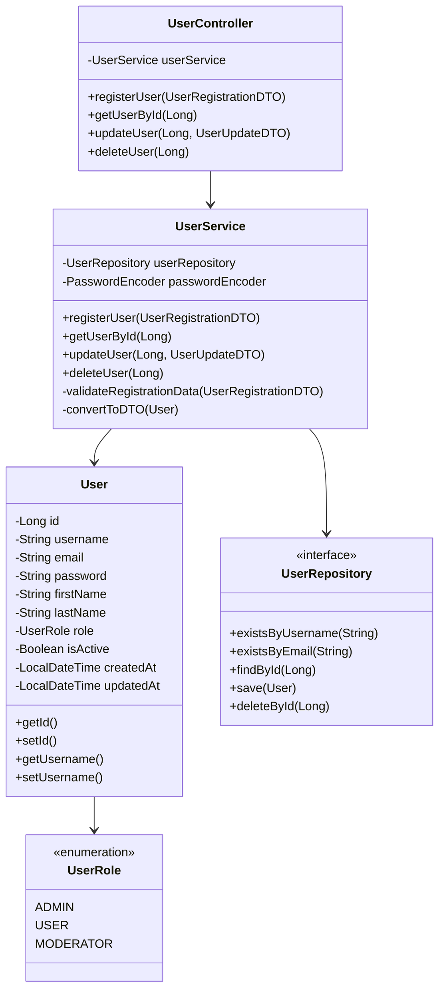
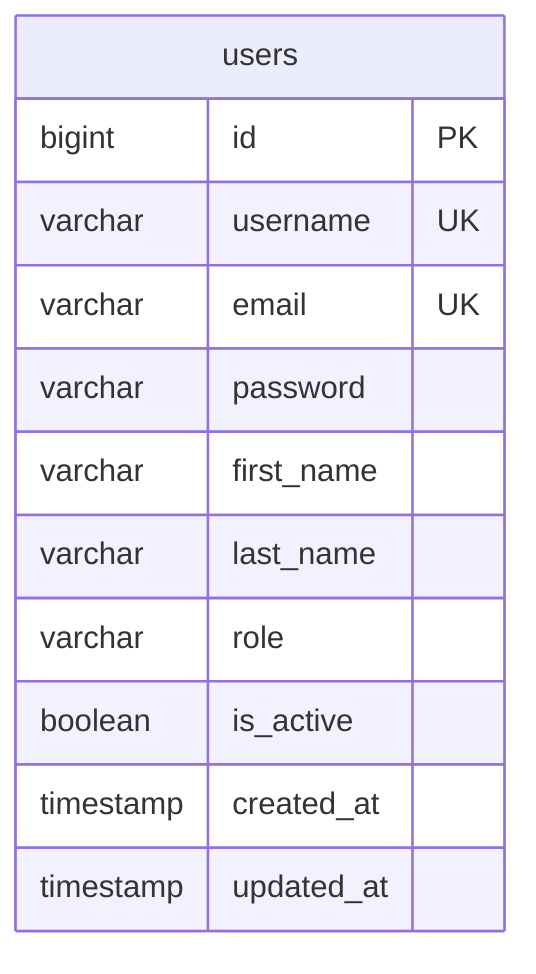
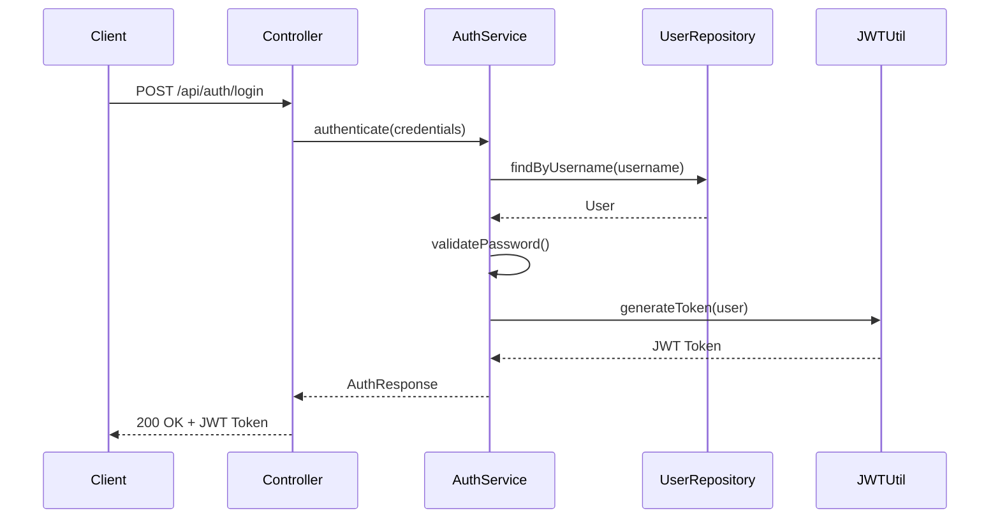
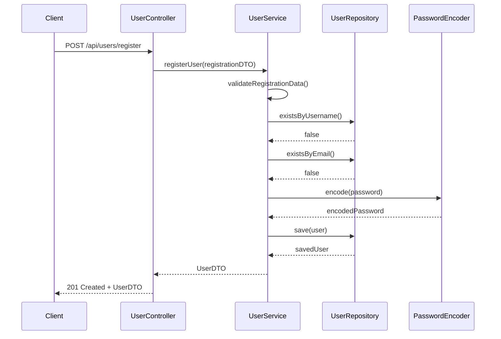
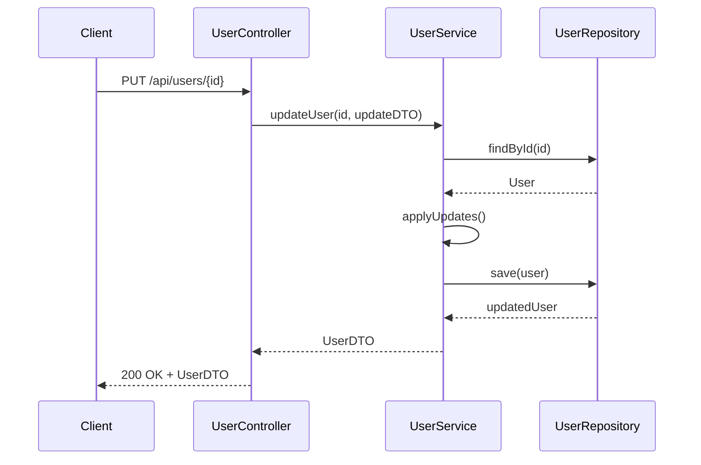

# Low-Level Design Document: User Management System

## 1. Introduction

### 1.1 Purpose
This document provides the low-level design for the User Management System, detailing the technical implementation of user registration, authentication, and profile management functionalities.

### 1.2 Scope
This LLD covers:
- User registration and authentication
- User profile management
- Security implementation
- Database design for user management
- API specifications for user operations

### 1.3 Definitions and Acronyms
- **LLD**: Low-Level Design
- **API**: Application Programming Interface
- **JWT**: JSON Web Token
- **RBAC**: Role-Based Access Control
- **DTO**: Data Transfer Object

## 2. System Architecture

### 2.1 Component Overview
The system follows a layered architecture pattern:
- **Presentation Layer**: REST API Controllers
- **Business Logic Layer**: Service classes
- **Data Access Layer**: Repository interfaces
- **Database Layer**: PostgreSQL database

### 2.2 Technology Stack
- **Backend Framework**: Spring Boot 3.x
- **Database**: PostgreSQL 15
- **Security**: Spring Security with JWT
- **ORM**: Spring Data JPA
- **Build Tool**: Maven
- **Java Version**: Java 17

## 3. User Management Module

### 3.1 Class Design

#### 3.1.1 User Entity

```java
@Entity
@Table(name = "users")
public class User {
    @Id
    @GeneratedValue(strategy = GenerationType.IDENTITY)
    private Long id;
    
    @Column(unique = true, nullable = false)
    private String username;
    
    @Column(unique = true, nullable = false)
    private String email;
    
    @Column(nullable = false)
    private String password;
    
    @Column(name = "first_name")
    private String firstName;
    
    @Column(name = "last_name")
    private String lastName;
    
    @Enumerated(EnumType.STRING)
    private UserRole role;
    
    @Column(name = "is_active")
    private Boolean isActive;
    
    @Column(name = "created_at")
    private LocalDateTime createdAt;
    
    @Column(name = "updated_at")
    private LocalDateTime updatedAt;
    
    // Getters and setters
}
```

#### 3.1.2 UserRole Enum

```java
public enum UserRole {
    ADMIN,
    USER,
    MODERATOR
}
```

#### 3.1.3 UserService

```java
@Service
public class UserService {
    
    @Autowired
    private UserRepository userRepository;
    
    @Autowired
    private PasswordEncoder passwordEncoder;
    
    public UserDTO registerUser(UserRegistrationDTO registrationDTO) {
        // Validate input
        validateRegistrationData(registrationDTO);
        
        // Check if user already exists
        if (userRepository.existsByUsername(registrationDTO.getUsername())) {
            throw new UserAlreadyExistsException("Username already taken");
        }
        
        if (userRepository.existsByEmail(registrationDTO.getEmail())) {
            throw new UserAlreadyExistsException("Email already registered");
        }
        
        // Create new user
        User user = new User();
        user.setUsername(registrationDTO.getUsername());
        user.setEmail(registrationDTO.getEmail());
        user.setPassword(passwordEncoder.encode(registrationDTO.getPassword()));
        user.setFirstName(registrationDTO.getFirstName());
        user.setLastName(registrationDTO.getLastName());
        user.setRole(UserRole.USER);
        user.setIsActive(true);
        user.setCreatedAt(LocalDateTime.now());
        
        // Save user
        User savedUser = userRepository.save(user);
        
        return convertToDTO(savedUser);
    }
    
    public UserDTO getUserById(Long id) {
        User user = userRepository.findById(id)
            .orElseThrow(() -> new UserNotFoundException("User not found"));
        return convertToDTO(user);
    }
    
    public UserDTO updateUser(Long id, UserUpdateDTO updateDTO) {
        User user = userRepository.findById(id)
            .orElseThrow(() -> new UserNotFoundException("User not found"));
        
        if (updateDTO.getFirstName() != null) {
            user.setFirstName(updateDTO.getFirstName());
        }
        if (updateDTO.getLastName() != null) {
            user.setLastName(updateDTO.getLastName());
        }
        if (updateDTO.getEmail() != null) {
            user.setEmail(updateDTO.getEmail());
        }
        
        user.setUpdatedAt(LocalDateTime.now());
        
        User updatedUser = userRepository.save(user);
        return convertToDTO(updatedUser);
    }
    
    public void deleteUser(Long id) {
        if (!userRepository.existsById(id)) {
            throw new UserNotFoundException("User not found");
        }
        userRepository.deleteById(id);
    }
    
    private void validateRegistrationData(UserRegistrationDTO dto) {
        // Validation logic
    }
    
    private UserDTO convertToDTO(User user) {
        // Conversion logic
    }
}
```

#### 3.1.4 UserController

```java
@RestController
@RequestMapping("/api/users")
public class UserController {
    
    @Autowired
    private UserService userService;
    
    @PostMapping("/register")
    public ResponseEntity<UserDTO> registerUser(@Valid @RequestBody UserRegistrationDTO registrationDTO) {
        UserDTO userDTO = userService.registerUser(registrationDTO);
        return ResponseEntity.status(HttpStatus.CREATED).body(userDTO);
    }
    
    @GetMapping("/{id}")
    public ResponseEntity<UserDTO> getUserById(@PathVariable Long id) {
        UserDTO userDTO = userService.getUserById(id);
        return ResponseEntity.ok(userDTO);
    }
    
    @PutMapping("/{id}")
    public ResponseEntity<UserDTO> updateUser(@PathVariable Long id, @Valid @RequestBody UserUpdateDTO updateDTO) {
        UserDTO userDTO = userService.updateUser(id, updateDTO);
        return ResponseEntity.ok(userDTO);
    }
    
    @DeleteMapping("/{id}")
    public ResponseEntity<Void> deleteUser(@PathVariable Long id) {
        userService.deleteUser(id);
        return ResponseEntity.noContent().build();
    }
}
```

### 3.2 Class Diagram


```mermaid
classDiagram
    class User {
        -Long id
        -String username
        -String email
        -String password
        -String firstName
        -String lastName
        -UserRole role
        -Boolean isActive
        -LocalDateTime createdAt
        -LocalDateTime updatedAt
        +getId()
        +setId()
        +getUsername()
        +setUsername()
    }
    
    class UserRole {
        <<enumeration>>
        ADMIN
        USER
        MODERATOR
    }
    
    class UserService {
        -UserRepository userRepository
        -PasswordEncoder passwordEncoder
        +registerUser(UserRegistrationDTO)
        +getUserById(Long)
        +updateUser(Long, UserUpdateDTO)
        +deleteUser(Long)
        -validateRegistrationData(UserRegistrationDTO)
        -convertToDTO(User)
    }
    
    class UserController {
        -UserService userService
        +registerUser(UserRegistrationDTO)
        +getUserById(Long)
        +updateUser(Long, UserUpdateDTO)
        +deleteUser(Long)
    }
    
    class UserRepository {
        <<interface>>
        +existsByUsername(String)
        +existsByEmail(String)
        +findById(Long)
        +save(User)
        +deleteById(Long)
    }
    
    User --> UserRole
    UserService --> UserRepository
    UserService --> User
    UserController --> UserService
```

## 4. Database Design

### 4.1 User Management Schema


```mermaid
erDiagram
    users {
        bigint id PK
        varchar username UK
        varchar email UK
        varchar password
        varchar first_name
        varchar last_name
        varchar role
        boolean is_active
        timestamp created_at
        timestamp updated_at
    }
```

### 4.2 Table Specifications

#### 4.2.1 Users Table

| Column | Type | Constraints | Description |
|--------|------|-------------|-------------|
| id | BIGINT | PRIMARY KEY, AUTO_INCREMENT | Unique identifier |
| username | VARCHAR(50) | UNIQUE, NOT NULL | User's username |
| email | VARCHAR(100) | UNIQUE, NOT NULL | User's email |
| password | VARCHAR(255) | NOT NULL | Encrypted password |
| first_name | VARCHAR(50) | | User's first name |
| last_name | VARCHAR(50) | | User's last name |
| role | VARCHAR(20) | NOT NULL | User role (ADMIN, USER, MODERATOR) |
| is_active | BOOLEAN | DEFAULT TRUE | Account status |
| created_at | TIMESTAMP | DEFAULT CURRENT_TIMESTAMP | Creation timestamp |
| updated_at | TIMESTAMP | | Last update timestamp |

## 5. API Specifications

### 5.1 User Management APIs

#### 5.1.1 Register User

**Endpoint**: `POST /api/users/register`

**Request Body**:
```json
{
  "username": "johndoe",
  "email": "john@example.com",
  "password": "SecurePass123!",
  "firstName": "John",
  "lastName": "Doe"
}
```

**Response** (201 Created):
```json
{
  "id": 1,
  "username": "johndoe",
  "email": "john@example.com",
  "firstName": "John",
  "lastName": "Doe",
  "role": "USER",
  "isActive": true,
  "createdAt": "2024-01-15T10:30:00"
}
```

#### 5.1.2 Get User by ID

**Endpoint**: `GET /api/users/{id}`

**Response** (200 OK):
```json
{
  "id": 1,
  "username": "johndoe",
  "email": "john@example.com",
  "firstName": "John",
  "lastName": "Doe",
  "role": "USER",
  "isActive": true,
  "createdAt": "2024-01-15T10:30:00"
}
```

#### 5.1.3 Update User

**Endpoint**: `PUT /api/users/{id}`

**Request Body**:
```json
{
  "firstName": "Jonathan",
  "lastName": "Doe",
  "email": "jonathan@example.com"
}
```

**Response** (200 OK):
```json
{
  "id": 1,
  "username": "johndoe",
  "email": "jonathan@example.com",
  "firstName": "Jonathan",
  "lastName": "Doe",
  "role": "USER",
  "isActive": true,
  "updatedAt": "2024-01-16T14:20:00"
}
```

#### 5.1.4 Delete User

**Endpoint**: `DELETE /api/users/{id}`

**Response** (204 No Content)

## 6. Security Implementation

### 6.1 Authentication Flow


```mermaid
sequenceDiagram
    participant Client
    participant Controller
    participant AuthService
    participant UserRepository
    participant JWTUtil
    
    Client->>Controller: POST /api/auth/login
    Controller->>AuthService: authenticate(credentials)
    AuthService->>UserRepository: findByUsername(username)
    UserRepository-->>AuthService: User
    AuthService->>AuthService: validatePassword()
    AuthService->>JWTUtil: generateToken(user)
    JWTUtil-->>AuthService: JWT Token
    AuthService-->>Controller: AuthResponse
    Controller-->>Client: 200 OK + JWT Token
```

### 6.2 Password Encryption

- **Algorithm**: BCrypt
- **Strength**: 10 rounds
- **Implementation**: Spring Security's BCryptPasswordEncoder

### 6.3 JWT Configuration

```java
@Configuration
public class JWTConfig {
    private static final String SECRET_KEY = "your-secret-key";
    private static final long EXPIRATION_TIME = 86400000; // 24 hours
    
    public String generateToken(User user) {
        return Jwts.builder()
            .setSubject(user.getUsername())
            .setIssuedAt(new Date())
            .setExpiration(new Date(System.currentTimeMillis() + EXPIRATION_TIME))
            .signWith(SignatureAlgorithm.HS512, SECRET_KEY)
            .compact();
    }
}
```

## 7. Sequence Diagrams

### 7.1 User Registration Flow


```mermaid
sequenceDiagram
    participant Client
    participant UserController
    participant UserService
    participant UserRepository
    participant PasswordEncoder
    
    Client->>UserController: POST /api/users/register
    UserController->>UserService: registerUser(registrationDTO)
    UserService->>UserService: validateRegistrationData()
    UserService->>UserRepository: existsByUsername()
    UserRepository-->>UserService: false
    UserService->>UserRepository: existsByEmail()
    UserRepository-->>UserService: false
    UserService->>PasswordEncoder: encode(password)
    PasswordEncoder-->>UserService: encodedPassword
    UserService->>UserRepository: save(user)
    UserRepository-->>UserService: savedUser
    UserService-->>UserController: UserDTO
    UserController-->>Client: 201 Created + UserDTO
```

### 7.2 User Profile Update Flow


```mermaid
sequenceDiagram
    participant Client
    participant UserController
    participant UserService
    participant UserRepository
    
    Client->>UserController: PUT /api/users/{id}
    UserController->>UserService: updateUser(id, updateDTO)
    UserService->>UserRepository: findById(id)
    UserRepository-->>UserService: User
    UserService->>UserService: applyUpdates()
    UserService->>UserRepository: save(user)
    UserRepository-->>UserService: updatedUser
    UserService-->>UserController: UserDTO
    UserController-->>Client: 200 OK + UserDTO
```
