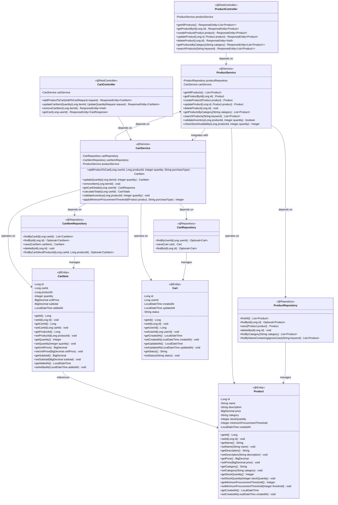
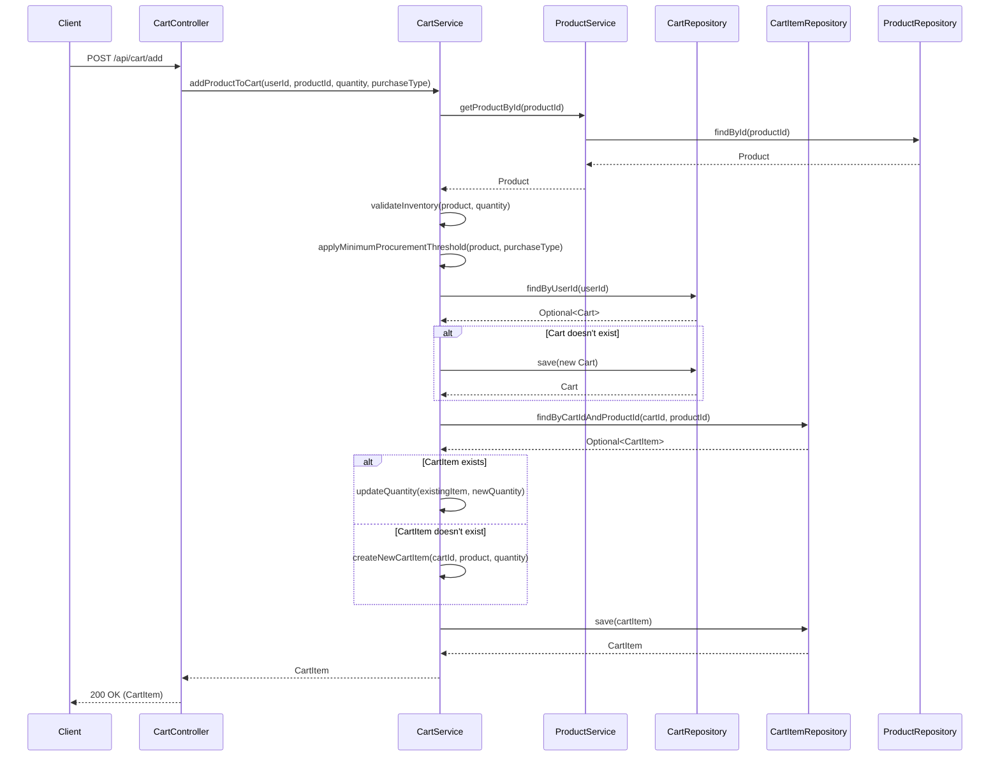
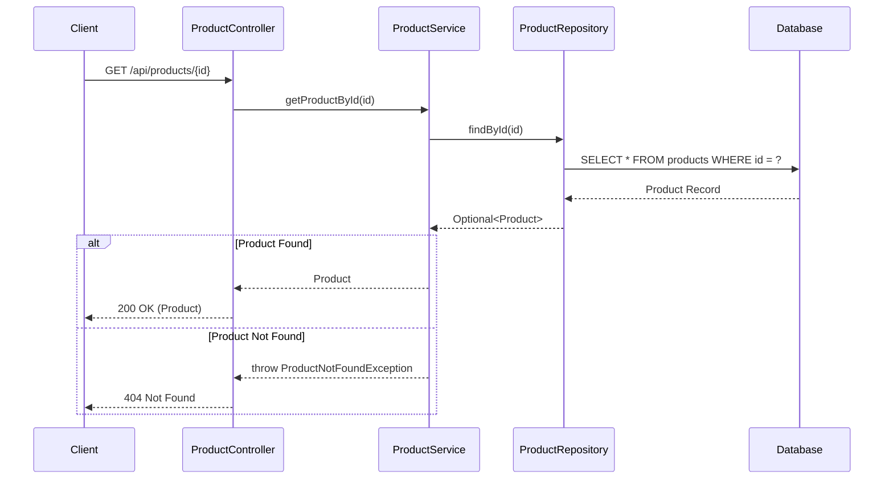
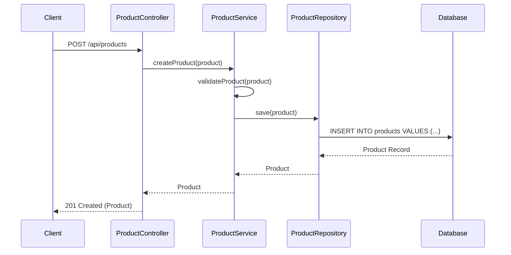
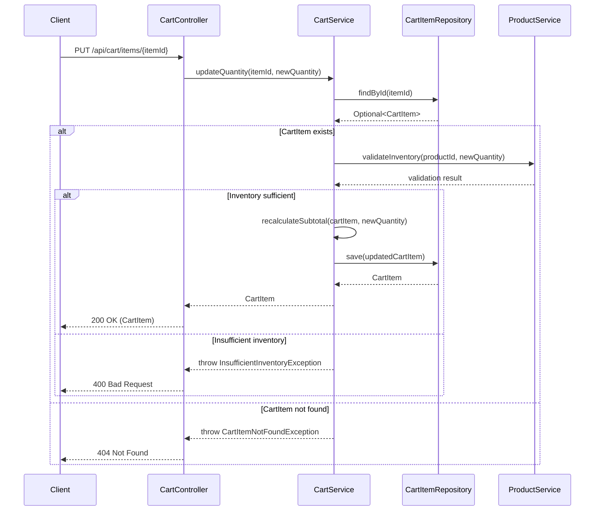

# Low-Level Design (LLD) - E-commerce Product Management System

## 1. Project Overview

**Framework:** Spring Boot  
**Language:** Java 21  
**Database:** PostgreSQL  
**Module:** ProductManagement  

## 2. System Architecture

### 2.1 Class Diagram


```mermaid
classDiagram
    class ProductController {
        <<@RestController>>
        -ProductService productService
        +getAllProducts() ResponseEntity~List~Product~~
        +getProductById(Long id) ResponseEntity~Product~
        +createProduct(Product product) ResponseEntity~Product~
        +updateProduct(Long id, Product product) ResponseEntity~Product~
        +deleteProduct(Long id) ResponseEntity~Void~
        +getProductsByCategory(String category) ResponseEntity~List~Product~~
        +searchProducts(String keyword) ResponseEntity~List~Product~~
    }
    
    class ProductService {
        <<@Service>>
        -ProductRepository productRepository
        -CartService cartService
        +getAllProducts() List~Product~
        +getProductById(Long id) Product
        +createProduct(Product product) Product
        +updateProduct(Long id, Product product) Product
        +deleteProduct(Long id) void
        +getProductsByCategory(String category) List~Product~
        +searchProducts(String keyword) List~Product~
        +validateInventory(Long productId, Integer quantity) boolean
        +checkStockAvailability(Long productId, Integer quantity) Integer
    }
    
    class ProductRepository {
        <<@Repository>>
        <<interface>>
        +findAll() List~Product~
        +findById(Long id) Optional~Product~
        +save(Product product) Product
        +deleteById(Long id) void
        +findByCategory(String category) List~Product~
        +findByNameContainingIgnoreCase(String keyword) List~Product~
    }
    
    class Product {
        <<@Entity>>
        -Long id
        -String name
        -String description
        -BigDecimal price
        -String category
        -Integer stockQuantity
        -Integer minimumProcurementThreshold
        -LocalDateTime createdAt
        +getId() Long
        +setId(Long id) void
        +getName() String
        +setName(String name) void
        +getDescription() String
        +setDescription(String description) void
        +getPrice() BigDecimal
        +setPrice(BigDecimal price) void
        +getCategory() String
        +setCategory(String category) void
        +getStockQuantity() Integer
        +setStockQuantity(Integer stockQuantity) void
        +getMinimumProcurementThreshold() Integer
        +setMinimumProcurementThreshold(Integer threshold) void
        +getCreatedAt() LocalDateTime
        +setCreatedAt(LocalDateTime createdAt) void
    }
    
    class CartController {
        <<@RestController>>
        -CartService cartService
        +addProductToCart(AddToCartRequest request) ResponseEntity~CartItem~
        +updateCartItemQuantity(Long itemId, UpdateQuantityRequest request) ResponseEntity~CartItem~
        +removeCartItem(Long itemId) ResponseEntity~Void~
        +getCart(Long userId) ResponseEntity~CartResponse~
    }
    
    class CartService {
        <<@Service>>
        -CartRepository cartRepository
        -CartItemRepository cartItemRepository
        -ProductService productService
        +addProductToCart(Long userId, Long productId, Integer quantity, String purchaseType) CartItem
        +updateQuantity(Long itemId, Integer quantity) CartItem
        +removeItem(Long itemId) void
        +getCartDetails(Long userId) CartResponse
        +calculateTotals(Long cartId) CartTotals
        +validateInventory(Long productId, Integer quantity) void
        +applyMinimumProcurementThreshold(Product product, String purchaseType) Integer
    }
    
    class CartRepository {
        <<@Repository>>
        <<interface>>
        +findByUserId(Long userId) Optional~Cart~
        +save(Cart cart) Cart
        +findById(Long id) Optional~Cart~
    }
    
    class CartItemRepository {
        <<@Repository>>
        <<interface>>
        +findByCartId(Long cartId) List~CartItem~
        +findById(Long id) Optional~CartItem~
        +save(CartItem cartItem) CartItem
        +deleteById(Long id) void
        +findByCartIdAndProductId(Long cartId, Long productId) Optional~CartItem~
    }
    
    class Cart {
        <<@Entity>>
        -Long id
        -Long userId
        -LocalDateTime createdAt
        -LocalDateTime updatedAt
        -String status
        +getId() Long
        +setId(Long id) void
        +getUserId() Long
        +setUserId(Long userId) void
        +getCreatedAt() LocalDateTime
        +setCreatedAt(LocalDateTime createdAt) void
        +getUpdatedAt() LocalDateTime
        +setUpdatedAt(LocalDateTime updatedAt) void
        +getStatus() String
        +setStatus(String status) void
    }
    
    class CartItem {
        <<@Entity>>
        -Long id
        -Long cartId
        -Long productId
        -Integer quantity
        -BigDecimal unitPrice
        -BigDecimal subtotal
        -LocalDateTime addedAt
        +getId() Long
        +setId(Long id) void
        +getCartId() Long
        +setCartId(Long cartId) void
        +getProductId() Long
        +setProductId(Long productId) void
        +getQuantity() Integer
        +setQuantity(Integer quantity) void
        +getUnitPrice() BigDecimal
        +setUnitPrice(BigDecimal unitPrice) void
        +getSubtotal() BigDecimal
        +setSubtotal(BigDecimal subtotal) void
        +getAddedAt() LocalDateTime
        +setAddedAt(LocalDateTime addedAt) void
    }
    
    ProductController --> ProductService : depends on
    ProductService --> ProductRepository : depends on
    ProductService --> CartService : integrates with
    ProductRepository --> Product : manages
    ProductService --> Product : operates on
    
    CartController --> CartService : depends on
    CartService --> CartRepository : depends on
    CartService --> CartItemRepository : depends on
    CartService --> ProductService : depends on
    CartRepository --> Cart : manages
    CartItemRepository --> CartItem : manages
    CartService --> Cart : operates on
    CartService --> CartItem : operates on
    CartItem --> Product : references
```

### 2.2 Sequence Diagrams

#### 2.2.1 Add Product to Cart Flow


```mermaid
sequenceDiagram
    participant Client
    participant CartController
    participant CartService
    participant ProductService
    participant CartRepository
    participant CartItemRepository
    participant ProductRepository

    Client->>CartController: POST /api/cart/add
    CartController->>CartService: addProductToCart(userId, productId, quantity, purchaseType)
    CartService->>ProductService: getProductById(productId)
    ProductService->>ProductRepository: findById(productId)
    ProductRepository-->>ProductService: Product
    ProductService-->>CartService: Product
    
    CartService->>CartService: validateInventory(product, quantity)
    CartService->>CartService: applyMinimumProcurementThreshold(product, purchaseType)
    
    CartService->>CartRepository: findByUserId(userId)
    CartRepository-->>CartService: Optional<Cart>
    
    alt Cart doesn't exist
        CartService->>CartRepository: save(new Cart)
        CartRepository-->>CartService: Cart
    end
    
    CartService->>CartItemRepository: findByCartIdAndProductId(cartId, productId)
    CartItemRepository-->>CartService: Optional<CartItem>
    
    alt CartItem exists
        CartService->>CartService: updateQuantity(existingItem, newQuantity)
    else CartItem doesn't exist
        CartService->>CartService: createNewCartItem(cartId, product, quantity)
    end
    
    CartService->>CartItemRepository: save(cartItem)
    CartItemRepository-->>CartService: CartItem
    CartService-->>CartController: CartItem
    CartController-->>Client: 200 OK (CartItem)
```

#### 2.2.2 Get Product by ID Flow


```mermaid
sequenceDiagram
    participant Client
    participant ProductController
    participant ProductService
    participant ProductRepository
    participant Database

    Client->>ProductController: GET /api/products/{id}
    ProductController->>ProductService: getProductById(id)
    ProductService->>ProductRepository: findById(id)
    ProductRepository->>Database: SELECT * FROM products WHERE id = ?
    Database-->>ProductRepository: Product Record
    ProductRepository-->>ProductService: Optional<Product>
    
    alt Product Found
        ProductService-->>ProductController: Product
        ProductController-->>Client: 200 OK (Product)
    else Product Not Found
        ProductService-->>ProductController: throw ProductNotFoundException
        ProductController-->>Client: 404 Not Found
    end
```

#### 2.2.3 Create Product Flow


```mermaid
sequenceDiagram
    participant Client
    participant ProductController
    participant ProductService
    participant ProductRepository
    participant Database

    Client->>ProductController: POST /api/products
    ProductController->>ProductService: createProduct(product)
    ProductService->>ProductService: validateProduct(product)
    ProductService->>ProductRepository: save(product)
    ProductRepository->>Database: INSERT INTO products VALUES (...)
    Database-->>ProductRepository: Product Record
    ProductRepository-->>ProductService: Product
    ProductService-->>ProductController: Product
    ProductController-->>Client: 201 Created (Product)
```

#### 2.2.4 Update Cart Item Quantity Flow


```mermaid
sequenceDiagram
    participant Client
    participant CartController
    participant CartService
    participant CartItemRepository
    participant ProductService

    Client->>CartController: PUT /api/cart/items/{itemId}
    CartController->>CartService: updateQuantity(itemId, newQuantity)
    CartService->>CartItemRepository: findById(itemId)
    CartItemRepository-->>CartService: Optional<CartItem>
    
    alt CartItem exists
        CartService->>ProductService: validateInventory(productId, newQuantity)
        ProductService-->>CartService: validation result
        
        alt Inventory sufficient
            CartService->>CartService: recalculateSubtotal(cartItem, newQuantity)
            CartService->>CartItemRepository: save(updatedCartItem)
            CartItemRepository-->>CartService: CartItem
            CartService-->>CartController: CartItem
            CartController-->>Client: 200 OK (CartItem)
        else Insufficient inventory
            CartService-->>CartController: throw InsufficientInventoryException
            CartController-->>Client: 400 Bad Request
        end
    else CartItem not found
        CartService-->>CartController: throw CartItemNotFoundException
        CartController-->>Client: 404 Not Found
    end
```

## 3. API Endpoints

### 3.1 Product Management Endpoints

#### 3.1.1 Get All Products
- **Endpoint:** `GET /api/products`
- **Description:** Retrieves all products
- **Response:** `200 OK` with List of Products
- **Error Responses:** `500 Internal Server Error`

#### 3.1.2 Get Product by ID
- **Endpoint:** `GET /api/products/{id}`
- **Description:** Retrieves a specific product by ID
- **Path Parameters:** `id` (Long) - Product ID
- **Response:** `200 OK` with Product
- **Error Responses:** 
  - `404 Not Found` - Product doesn't exist
  - `500 Internal Server Error`

#### 3.1.3 Create Product
- **Endpoint:** `POST /api/products`
- **Description:** Creates a new product
- **Request Body:** Product object (JSON)
- **Response:** `201 Created` with created Product
- **Error Responses:**
  - `400 Bad Request` - Invalid product data
  - `500 Internal Server Error`

#### 3.1.4 Update Product
- **Endpoint:** `PUT /api/products/{id}`
- **Description:** Updates an existing product
- **Path Parameters:** `id` (Long) - Product ID
- **Request Body:** Product object (JSON)
- **Response:** `200 OK` with updated Product
- **Error Responses:**
  - `404 Not Found` - Product doesn't exist
  - `400 Bad Request` - Invalid product data
  - `500 Internal Server Error`

#### 3.1.5 Delete Product
- **Endpoint:** `DELETE /api/products/{id}`
- **Description:** Deletes a product
- **Path Parameters:** `id` (Long) - Product ID
- **Response:** `204 No Content`
- **Error Responses:**
  - `404 Not Found` - Product doesn't exist
  - `500 Internal Server Error`

#### 3.1.6 Get Products by Category
- **Endpoint:** `GET /api/products/category/{category}`
- **Description:** Retrieves products by category
- **Path Parameters:** `category` (String) - Product category
- **Response:** `200 OK` with List of Products
- **Error Responses:** `500 Internal Server Error`

#### 3.1.7 Search Products
- **Endpoint:** `GET /api/products/search?keyword={keyword}`
- **Description:** Searches products by keyword in name
- **Query Parameters:** `keyword` (String) - Search keyword
- **Response:** `200 OK` with List of Products
- **Error Responses:** `500 Internal Server Error`

### 3.2 Cart Management Endpoints

#### 3.2.1 Add Product to Cart
- **Endpoint:** `POST /api/cart/add`
- **Description:** Adds a product to the user's cart
- **Request Body:** 
  ```json
  {
    "userId": 1,
    "productId": 10,
    "quantity": 2,
    "purchaseType": "BULK"
  }
  ```
- **Response:** `200 OK` with CartItem
- **Error Responses:**
  - `400 Bad Request` - Invalid request data or insufficient inventory
  - `404 Not Found` - Product not found
  - `500 Internal Server Error`

#### 3.2.2 Update Cart Item Quantity
- **Endpoint:** `PUT /api/cart/items/{itemId}`
- **Description:** Updates the quantity of a cart item
- **Path Parameters:** `itemId` (Long) - Cart item ID
- **Request Body:**
  ```json
  {
    "quantity": 5
  }
  ```
- **Response:** `200 OK` with updated CartItem
- **Error Responses:**
  - `400 Bad Request` - Invalid quantity or insufficient inventory
  - `404 Not Found` - Cart item not found
  - `500 Internal Server Error`

#### 3.2.3 Remove Cart Item
- **Endpoint:** `DELETE /api/cart/items/{itemId}`
- **Description:** Removes an item from the cart
- **Path Parameters:** `itemId` (Long) - Cart item ID
- **Response:** `204 No Content`
- **Error Responses:**
  - `404 Not Found` - Cart item not found
  - `500 Internal Server Error`

#### 3.2.4 Get Cart Details
- **Endpoint:** `GET /api/cart/{userId}`
- **Description:** Retrieves the user's cart with all items and totals
- **Path Parameters:** `userId` (Long) - User ID
- **Response:** `200 OK` with CartResponse
  ```json
  {
    "cartId": 1,
    "userId": 1,
    "items": [
      {
        "id": 1,
        "productId": 10,
        "productName": "Laptop",
        "quantity": 2,
        "unitPrice": 999.99,
        "subtotal": 1999.98
      }
    ],
    "totalItems": 2,
    "totalAmount": 1999.98,
    "status": "ACTIVE"
  }
  ```
- **Error Responses:**
  - `404 Not Found` - Cart not found
  - `500 Internal Server Error`
