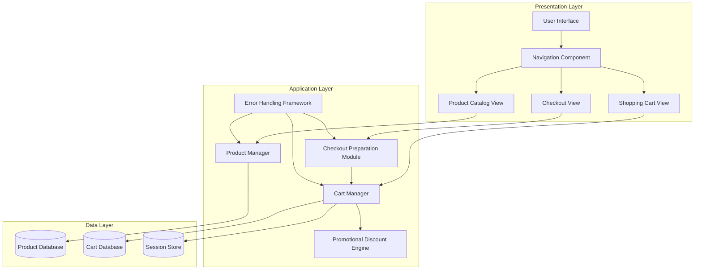
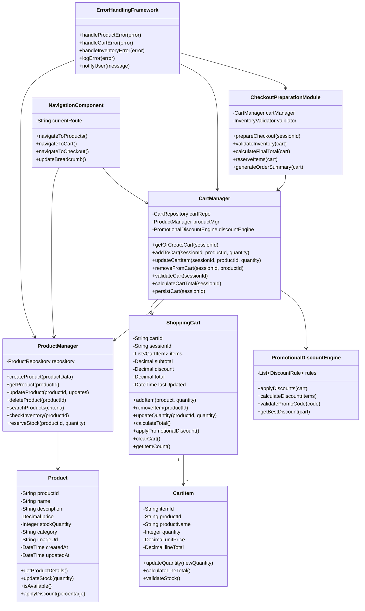
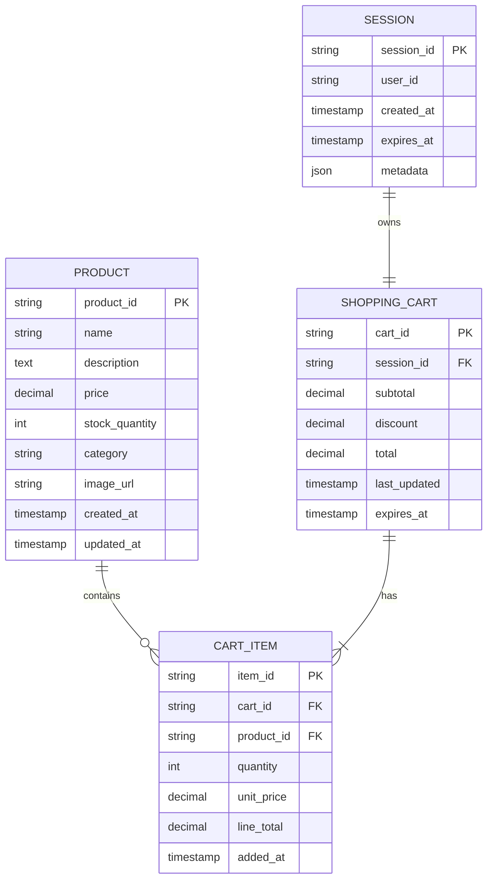

# Low-Level Design Document: E-commerce Product Management System with Shopping Cart

## 1. System Overview

This document provides a comprehensive low-level design for an E-commerce Product Management System with integrated shopping cart functionality. The system enables users to browse products, manage shopping carts, validate inventory, and prepare for checkout with real-time calculations and session persistence.

### 1.1 Key Features
- Product catalog management (CRUD operations)
- Shopping cart management (add, update, remove items)
- Real-time inventory validation
- Dynamic total calculation with promotional discounts
- Session-based cart persistence
- Checkout preparation
- Accessibility compliance
- Performance optimization

## 2. Architecture Components

### 2.1 Component Diagram


```mermaid
graph TB
    subgraph "Presentation Layer"
        UI[User Interface]
        NAV[Navigation Component]
        PC[Product Catalog View]
        SC[Shopping Cart View]
        CO[Checkout View]
    end
    
    subgraph "Application Layer"
        PM[Product Manager]
        CM[Cart Manager]
        PDE[Promotional Discount Engine]
        CPM[Checkout Preparation Module]
        EHF[Error Handling Framework]
    end
    
    subgraph "Data Layer"
        PDB[(Product Database)]
        CDB[(Cart Database)]
        SDB[(Session Store)]
    end
    
    UI --> NAV
    NAV --> PC
    NAV --> SC
    NAV --> CO
    PC --> PM
    SC --> CM
    CO --> CPM
    CM --> PDE
    PM --> PDB
    CM --> CDB
    CM --> SDB
    CPM --> CM
    EHF --> PM
    EHF --> CM
    EHF --> CPM
```

### 2.2 Class Diagram


```mermaid
classDiagram
    class Product {
        -String productId
        -String name
        -String description
        -Decimal price
        -Integer stockQuantity
        -String category
        -String imageUrl
        -DateTime createdAt
        -DateTime updatedAt
        +getProductDetails()
        +updateStock(quantity)
        +isAvailable()
        +applyDiscount(percentage)
    }
    
    class ShoppingCart {
        -String cartId
        -String sessionId
        -List~CartItem~ items
        -Decimal subtotal
        -Decimal discount
        -Decimal total
        -DateTime lastUpdated
        +addItem(product, quantity)
        +removeItem(productId)
        +updateQuantity(productId, quantity)
        +calculateTotal()
        +applyPromotionalDiscount()
        +clearCart()
        +getItemCount()
    }
    
    class CartItem {
        -String itemId
        -String productId
        -String productName
        -Integer quantity
        -Decimal unitPrice
        -Decimal lineTotal
        +updateQuantity(newQuantity)
        +calculateLineTotal()
        +validateStock()
    }
    
    class ProductManager {
        -ProductRepository repository
        +createProduct(productData)
        +getProduct(productId)
        +updateProduct(productId, updates)
        +deleteProduct(productId)
        +searchProducts(criteria)
        +checkInventory(productId)
        +reserveStock(productId, quantity)
    }
    
    class CartManager {
        -CartRepository cartRepo
        -ProductManager productMgr
        -PromotionalDiscountEngine discountEngine
        +getOrCreateCart(sessionId)
        +addToCart(sessionId, productId, quantity)
        +updateCartItem(sessionId, productId, quantity)
        +removeFromCart(sessionId, productId)
        +validateCart(sessionId)
        +calculateCartTotal(sessionId)
        +persistCart(sessionId)
    }
    
    class PromotionalDiscountEngine {
        -List~DiscountRule~ rules
        +applyDiscounts(cart)
        +calculateDiscount(items)
        +validatePromoCode(code)
        +getBestDiscount(cart)
    }
    
    class CheckoutPreparationModule {
        -CartManager cartManager
        -InventoryValidator validator
        +prepareCheckout(sessionId)
        +validateInventory(cart)
        +calculateFinalTotal(cart)
        +reserveItems(cart)
        +generateOrderSummary(cart)
    }
    
    class NavigationComponent {
        -String currentRoute
        +navigateToProducts()
        +navigateToCart()
        +navigateToCheckout()
        +updateBreadcrumb()
    }
    
    class ErrorHandlingFramework {
        +handleProductError(error)
        +handleCartError(error)
        +handleInventoryError(error)
        +logError(error)
        +notifyUser(message)
    }
    
    ShoppingCart "1" --> "*" CartItem
    CartManager --> ShoppingCart
    CartManager --> ProductManager
    CartManager --> PromotionalDiscountEngine
    ProductManager --> Product
    CheckoutPreparationModule --> CartManager
    NavigationComponent --> ProductManager
    NavigationComponent --> CartManager
    ErrorHandlingFramework --> ProductManager
    ErrorHandlingFramework --> CartManager
    ErrorHandlingFramework --> CheckoutPreparationModule
```

## 3. Data Models

### 3.1 Entity Relationship Diagram


```mermaid
erDiagram
    PRODUCT ||--o{ CART_ITEM : contains
    SHOPPING_CART ||--|{ CART_ITEM : has
    SESSION ||--|| SHOPPING_CART : owns
    
    PRODUCT {
        string product_id PK
        string name
        text description
        decimal price
        int stock_quantity
        string category
        string image_url
        timestamp created_at
        timestamp updated_at
    }
    
    SHOPPING_CART {
        string cart_id PK
        string session_id FK
        decimal subtotal
        decimal discount
        decimal total
        timestamp last_updated
        timestamp expires_at
    }
    
    CART_ITEM {
        string item_id PK
        string cart_id FK
        string product_id FK
        int quantity
        decimal unit_price
        decimal line_total
        timestamp added_at
    }
    
    SESSION {
        string session_id PK
        string user_id
        timestamp created_at
        timestamp expires_at
        json metadata
    }
```

### 3.2 Database Schema

#### Products Table
```sql
CREATE TABLE products (
    product_id VARCHAR(36) PRIMARY KEY,
    name VARCHAR(255) NOT NULL,
    description TEXT,
    price DECIMAL(10, 2) NOT NULL,
    stock_quantity INT NOT NULL DEFAULT 0,
    category VARCHAR(100),
    image_url VARCHAR(500),
    created_at TIMESTAMP DEFAULT CURRENT_TIMESTAMP,
    updated_at TIMESTAMP DEFAULT CURRENT_TIMESTAMP ON UPDATE CURRENT_TIMESTAMP,
    INDEX idx_category (category),
    INDEX idx_stock (stock_quantity)
);
```

#### Shopping Carts Table
```sql
CREATE TABLE shopping_carts (
    cart_id VARCHAR(36) PRIMARY KEY,
    session_id VARCHAR(100) UNIQUE NOT NULL,
    subtotal DECIMAL(10, 2) DEFAULT 0.00,
    discount DECIMAL(10, 2) DEFAULT 0.00,
    total DECIMAL(10, 2) DEFAULT 0.00,
    last_updated TIMESTAMP DEFAULT CURRENT_TIMESTAMP ON UPDATE CURRENT_TIMESTAMP,
    expires_at TIMESTAMP,
    INDEX idx_session (session_id),
    INDEX idx_expires (expires_at)
);
```

#### Cart Items Table
```sql
CREATE TABLE cart_items (
    item_id VARCHAR(36) PRIMARY KEY,
    cart_id VARCHAR(36) NOT NULL,
    product_id VARCHAR(36) NOT NULL,
    quantity INT NOT NULL DEFAULT 1,
    unit_price DECIMAL(10, 2) NOT NULL,
    line_total DECIMAL(10, 2) NOT NULL,
    added_at TIMESTAMP DEFAULT CURRENT_TIMESTAMP,
    FOREIGN KEY (cart_id) REFERENCES shopping_carts(cart_id) ON DELETE CASCADE,
    FOREIGN KEY (product_id) REFERENCES products(product_id),
    INDEX idx_cart (cart_id),
    INDEX idx_product (product_id)
);
```

## 4. API Endpoints

### 4.1 Product Management APIs

#### Create Product
```
POST /api/products
Content-Type: application/json

Request Body:
{
    "name": "Product Name",
    "description": "Product Description",
    "price": 99.99,
    "stock_quantity": 100,
    "category": "Electronics",
    "image_url": "https://example.com/image.jpg"
}

Response: 201 Created
{
    "product_id": "uuid",
    "name": "Product Name",
    "price": 99.99,
    "stock_quantity": 100,
    "created_at": "2024-01-01T00:00:00Z"
}
```

#### Get Product
```
GET /api/products/{product_id}

Response: 200 OK
{
    "product_id": "uuid",
    "name": "Product Name",
    "description": "Product Description",
    "price": 99.99,
    "stock_quantity": 100,
    "category": "Electronics",
    "image_url": "https://example.com/image.jpg"
}
```

#### Update Product
```
PUT /api/products/{product_id}
Content-Type: application/json

Request Body:
{
    "price": 89.99,
    "stock_quantity": 150
}

Response: 200 OK
{
    "product_id": "uuid",
    "updated_fields": ["price", "stock_quantity"],
    "updated_at": "2024-01-01T00:00:00Z"
}
```

#### Delete Product
```
DELETE /api/products/{product_id}

Response: 204 No Content
```

### 4.2 Shopping Cart APIs

#### Get or Create Cart
```
GET /api/cart
Headers: Session-ID: {session_id}

Response: 200 OK
{
    "cart_id": "uuid",
    "session_id": "session_uuid",
    "items": [],
    "subtotal": 0.00,
    "discount": 0.00,
    "total": 0.00,
    "item_count": 0
}
```

#### Add Item to Cart
```
POST /api/cart/items
Headers: Session-ID: {session_id}
Content-Type: application/json

Request Body:
{
    "product_id": "uuid",
    "quantity": 2
}

Response: 200 OK
{
    "cart_id": "uuid",
    "item_added": {
        "item_id": "uuid",
        "product_id": "uuid",
        "product_name": "Product Name",
        "quantity": 2,
        "unit_price": 99.99,
        "line_total": 199.98
    },
    "cart_total": 199.98
}
```

#### Update Cart Item Quantity
```
PUT /api/cart/items/{product_id}
Headers: Session-ID: {session_id}
Content-Type: application/json

Request Body:
{
    "quantity": 3
}

Response: 200 OK
{
    "item_id": "uuid",
    "product_id": "uuid",
    "quantity": 3,
    "line_total": 299.97,
    "cart_total": 299.97
}
```

#### Remove Item from Cart
```
DELETE /api/cart/items/{product_id}
Headers: Session-ID: {session_id}

Response: 200 OK
{
    "removed_item_id": "uuid",
    "cart_total": 0.00,
    "item_count": 0
}
```

#### Calculate Cart Total
```
GET /api/cart/total
Headers: Session-ID: {session_id}

Response: 200 OK
{
    "subtotal": 299.97,
    "discount": 29.99,
    "total": 269.98,
    "discount_details": {
        "type": "promotional",
        "percentage": 10,
        "code": "SAVE10"
    }
}
```

#### Prepare Checkout
```
POST /api/cart/checkout/prepare
Headers: Session-ID: {session_id}

Response: 200 OK
{
    "checkout_ready": true,
    "order_summary": {
        "items": [...],
        "subtotal": 299.97,
        "discount": 29.99,
        "total": 269.98,
        "items_reserved": true
    },
    "validation_status": "passed"
}
```
