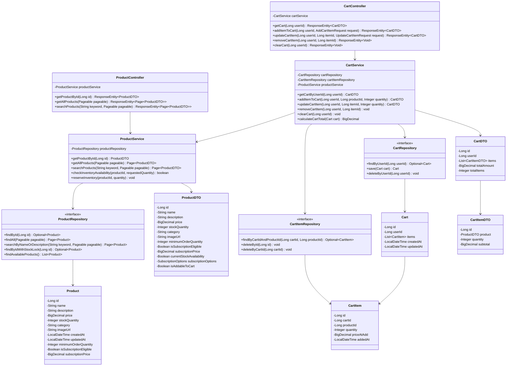
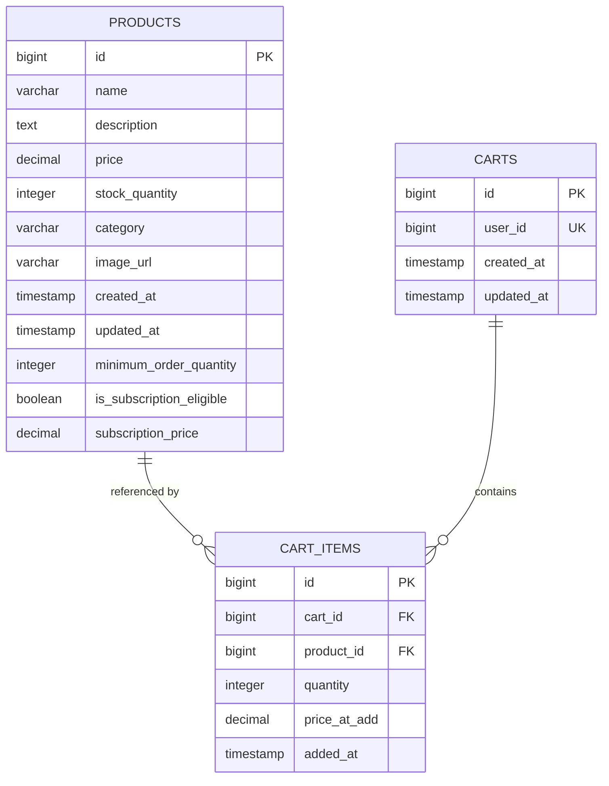

# Low Level Design Document - E-Commerce Platform

## Document Control
- **Version**: 2.0
- **Last Updated**: 2025-01-27
- **Status**: Updated per RCA-2025-001

---

## 1. Introduction

### 1.1 Purpose
This Low Level Design (LLD) document provides detailed technical specifications for the E-Commerce Platform, focusing on the Product Catalog and Shopping Cart modules. It serves as a blueprint for developers to implement the system components.

### 1.2 Scope
This document covers:
- Product Catalog Module (Read-only operations)
- Shopping Cart Module (Full CRUD operations)
- Database schema design
- API specifications
- Class structures and relationships
- Sequence diagrams for key operations

### 1.3 Definitions and Acronyms
- **API**: Application Programming Interface
- **CRUD**: Create, Read, Update, Delete
- **DTO**: Data Transfer Object
- **JPA**: Java Persistence API
- **REST**: Representational State Transfer
- **LLD**: Low Level Design

---

## 2. System Architecture

### 2.1 Class Diagram

```mermaid
classDiagram
    class ProductController {
        -ProductService productService
        +getProductById(Long id) ResponseEntity~ProductDTO~
        +getAllProducts(Pageable pageable) ResponseEntity~Page~ProductDTO~~
        +searchProducts(String keyword, Pageable pageable) ResponseEntity~Page~ProductDTO~~
    }

    class ProductService {
        -ProductRepository productRepository
        +getProductById(Long id) ProductDTO
        +getAllProducts(Pageable pageable) Page~ProductDTO~
        +searchProducts(String keyword, Pageable pageable) Page~ProductDTO~
        +checkInventoryAvailability(productId, requestedQuantity) boolean
        +reserveInventory(productId, quantity) void
    }

    class ProductRepository {
        <<interface>>
        +findById(Long id) Optional~Product~
        +findAll(Pageable pageable) Page~Product~
        +searchByNameOrDescription(String keyword, Pageable pageable) Page~Product~
        +findByIdWithStockLock(Long id) Optional~Product~
        +findAvailableProducts() List~Product~
    }

    class Product {
        -Long id
        -String name
        -String description
        -BigDecimal price
        -Integer stockQuantity
        -String category
        -String imageUrl
        -LocalDateTime createdAt
        -LocalDateTime updatedAt
        -Integer minimumOrderQuantity
        -Boolean isSubscriptionEligible
        -BigDecimal subscriptionPrice
    }

    class ProductDTO {
        -Long id
        -String name
        -String description
        -BigDecimal price
        -Integer stockQuantity
        -String category
        -String imageUrl
        -Integer minimumOrderQuantity
        -Boolean isSubscriptionEligible
        -BigDecimal subscriptionPrice
        -Boolean currentStockAvailability
        -SubscriptionOptions subscriptionOptions
        -Boolean isAddableToCart
    }

    class CartController {
        -CartService cartService
        +getCart(Long userId) ResponseEntity~CartDTO~
        +addItemToCart(Long userId, AddCartItemRequest request) ResponseEntity~CartDTO~
        +updateCartItem(Long userId, Long itemId, UpdateCartItemRequest request) ResponseEntity~CartDTO~
        +removeCartItem(Long userId, Long itemId) ResponseEntity~Void~
        +clearCart(Long userId) ResponseEntity~Void~
    }

    class CartService {
        -CartRepository cartRepository
        -CartItemRepository cartItemRepository
        -ProductService productService
        +getCartByUserId(Long userId) CartDTO
        +addItemToCart(Long userId, Long productId, Integer quantity) CartDTO
        +updateCartItem(Long userId, Long itemId, Integer quantity) CartDTO
        +removeCartItem(Long userId, Long itemId) void
        +clearCart(Long userId) void
        +calculateCartTotal(Cart cart) BigDecimal
    }

    class CartRepository {
        <<interface>>
        +findByUserId(Long userId) Optional~Cart~
        +save(Cart cart) Cart
        +deleteByUserId(Long userId) void
    }

    class CartItemRepository {
        <<interface>>
        +findByCartIdAndProductId(Long cartId, Long productId) Optional~CartItem~
        +deleteById(Long id) void
        +deleteByCartId(Long cartId) void
    }

    class Cart {
        -Long id
        -Long userId
        -List~CartItem~ items
        -LocalDateTime createdAt
        -LocalDateTime updatedAt
    }

    class CartItem {
        -Long id
        -Long cartId
        -Long productId
        -Integer quantity
        -BigDecimal priceAtAdd
        -LocalDateTime addedAt
    }

    class CartDTO {
        -Long id
        -Long userId
        -List~CartItemDTO~ items
        -BigDecimal totalAmount
        -Integer totalItems
    }

    class CartItemDTO {
        -Long id
        -ProductDTO product
        -Integer quantity
        -BigDecimal subtotal
    }

    ProductController --> ProductService
    ProductService --> ProductRepository
    ProductRepository --> Product
    ProductService --> ProductDTO
    CartController --> CartService
    CartService --> CartRepository
    CartService --> CartItemRepository
    CartService --> ProductService
    CartRepository --> Cart
    CartItemRepository --> CartItem
    Cart --> CartItem
    CartService --> CartDTO
    CartDTO --> CartItemDTO
```

### 2.2 Entity Relationship Diagram

```mermaid
erDiagram
    PRODUCTS ||--o{ CART_ITEMS : "referenced by"
    CARTS ||--o{ CART_ITEMS : contains
    
    PRODUCTS {
        bigint id PK
        varchar name
        text description
        decimal price
        integer stock_quantity
        varchar category
        varchar image_url
        timestamp created_at
        timestamp updated_at
        integer minimum_order_quantity
        boolean is_subscription_eligible
        decimal subscription_price
    }
    
    CARTS {
        bigint id PK
        bigint user_id UK
        timestamp created_at
        timestamp updated_at
    }
    
    CART_ITEMS {
        bigint id PK
        bigint cart_id FK
        bigint product_id FK
        integer quantity
        decimal price_at_add
        timestamp added_at
    }
```

---
