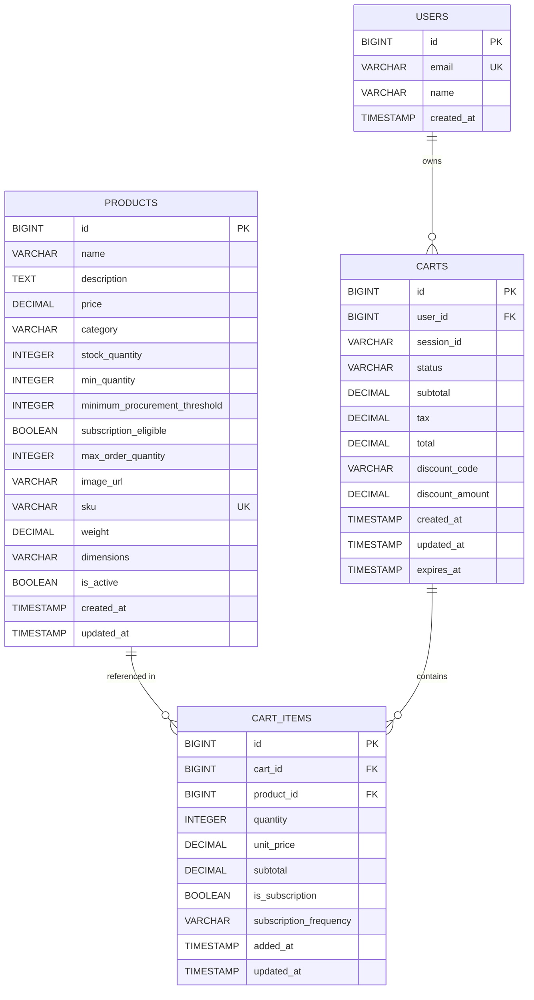

## 23. Data Models Enhancement

### 23.1 Comprehensive Data Model Definitions

**Requirement:** Define comprehensive data models for cart operations including product, cart item, and pricing schemas

```java
// Enhanced Product Entity
@Entity
@Table(name = "products")
@Data
@Builder
@NoArgsConstructor
@AllArgsConstructor
public class Product {
    
    @Id
    @GeneratedValue(strategy = GenerationType.IDENTITY)
    private Long id;
    
    @Column(nullable = false, length = 255)
    @NotBlank(message = "Product name is required")
    private String name;
    
    @Column(columnDefinition = "TEXT")
    private String description;
    
    @Column(nullable = false, precision = 10, scale = 2)
    @NotNull(message = "Price is required")
    @DecimalMin(value = "0.01", message = "Price must be greater than 0")
    private BigDecimal price;
    
    @Column(nullable = false, length = 100)
    @NotBlank(message = "Category is required")
    private String category;
    
    @Column(name = "stock_quantity", nullable = false)
    @Min(value = 0, message = "Stock quantity cannot be negative")
    private Integer stockQuantity;
    
    @Column(name = "min_quantity")
    @Min(value = 1, message = "Minimum quantity must be at least 1")
    private Integer minQuantity;
    
    @Column(name = "minimum_procurement_threshold")
    @Min(value = 1, message = "Minimum procurement threshold must be at least 1")
    private Integer minimumProcurementThreshold;
    
    @Column(name = "subscription_eligible")
    private Boolean subscriptionEligible;
    
    @Column(name = "max_order_quantity")
    @Min(value = 1, message = "Maximum order quantity must be at least 1")
    private Integer maxOrderQuantity;
    
    @Column(name = "image_url")
    private String imageUrl;
    
    @Column(name = "sku", unique = true)
    private String sku;
    
    @Column(name = "weight")
    private BigDecimal weight;
    
    @Column(name = "dimensions")
    private String dimensions;
    
    @Column(name = "is_active")
    private Boolean isActive;
    
    @Column(name = "created_at", nullable = false, updatable = false)
    private LocalDateTime createdAt;
    
    @Column(name = "updated_at")
    private LocalDateTime updatedAt;
    
    @PrePersist
    protected void onCreate() {
        createdAt = LocalDateTime.now();
        updatedAt = LocalDateTime.now();
        if (isActive == null) {
            isActive = true;
        }
    }
    
    @PreUpdate
    protected void onUpdate() {
        updatedAt = LocalDateTime.now();
    }
}

// Enhanced Cart Entity
@Entity
@Table(name = "carts")
@Data
@Builder
@NoArgsConstructor
@AllArgsConstructor
public class Cart {
    
    @Id
    @GeneratedValue(strategy = GenerationType.IDENTITY)
    private Long id;
    
    @Column(name = "user_id", nullable = false)
    @NotNull(message = "User ID is required")
    private Long userId;
    
    @Column(name = "session_id")
    private String sessionId;
    
    @Column(name = "status", nullable = false, length = 50)
    private String status;
    
    @Column(name = "subtotal", precision = 10, scale = 2)
    private BigDecimal subtotal;
    
    @Column(name = "tax", precision = 10, scale = 2)
    private BigDecimal tax;
    
    @Column(name = "total", precision = 10, scale = 2)
    private BigDecimal total;
    
    @Column(name = "discount_code")
    private String discountCode;
    
    @Column(name = "discount_amount", precision = 10, scale = 2)
    private BigDecimal discountAmount;
    
    @Column(name = "created_at", nullable = false, updatable = false)
    private LocalDateTime createdAt;
    
    @Column(name = "updated_at", nullable = false)
    private LocalDateTime updatedAt;
    
    @Column(name = "expires_at")
    private LocalDateTime expiresAt;
    
    @OneToMany(mappedBy = "cartId", cascade = CascadeType.ALL, orphanRemoval = true)
    private List<CartItem> items;
    
    @PrePersist
    protected void onCreate() {
        createdAt = LocalDateTime.now();
        updatedAt = LocalDateTime.now();
        if (status == null) {
            status = "ACTIVE";
        }
        // Set expiration to 30 days from creation
        expiresAt = LocalDateTime.now().plusDays(30);
    }
    
    @PreUpdate
    protected void onUpdate() {
        updatedAt = LocalDateTime.now();
    }
}

// Enhanced CartItem Entity
@Entity
@Table(name = "cart_items")
@Data
@Builder
@NoArgsConstructor
@AllArgsConstructor
public class CartItem {
    
    @Id
    @GeneratedValue(strategy = GenerationType.IDENTITY)
    private Long id;
    
    @Column(name = "cart_id", nullable = false)
    @NotNull(message = "Cart ID is required")
    private Long cartId;
    
    @Column(name = "product_id", nullable = false)
    @NotNull(message = "Product ID is required")
    private Long productId;
    
    @Column(name = "quantity", nullable = false)
    @NotNull(message = "Quantity is required")
    @Min(value = 1, message = "Quantity must be at least 1")
    private Integer quantity;
    
    @Column(name = "unit_price", nullable = false, precision = 10, scale = 2)
    @NotNull(message = "Unit price is required")
    private BigDecimal unitPrice;
    
    @Column(name = "subtotal", nullable = false, precision = 10, scale = 2)
    @NotNull(message = "Subtotal is required")
    private BigDecimal subtotal;
    
    @Column(name = "is_subscription")
    private Boolean isSubscription;
    
    @Column(name = "subscription_frequency")
    private String subscriptionFrequency;
    
    @Column(name = "added_at", nullable = false, updatable = false)
    private LocalDateTime addedAt;
    
    @Column(name = "updated_at")
    private LocalDateTime updatedAt;
    
    @ManyToOne(fetch = FetchType.LAZY)
    @JoinColumn(name = "product_id", insertable = false, updatable = false)
    private Product product;
    
    @PrePersist
    protected void onCreate() {
        addedAt = LocalDateTime.now();
        updatedAt = LocalDateTime.now();
        calculateSubtotal();
    }
    
    @PreUpdate
    protected void onUpdate() {
        updatedAt = LocalDateTime.now();
        calculateSubtotal();
    }
    
    private void calculateSubtotal() {
        if (unitPrice != null && quantity != null) {
            subtotal = unitPrice.multiply(new BigDecimal(quantity));
        }
    }
}

// Pricing Model
@Data
@Builder
@NoArgsConstructor
@AllArgsConstructor
public class PricingModel {
    
    private BigDecimal basePrice;
    private BigDecimal discountPercentage;
    private BigDecimal discountAmount;
    private BigDecimal finalPrice;
    private BigDecimal taxRate;
    private BigDecimal taxAmount;
    private BigDecimal totalPrice;
    private String currency;
    private LocalDateTime calculatedAt;
    
    public static PricingModel calculate(
            BigDecimal basePrice, 
            BigDecimal taxRate,
            BigDecimal discountPercentage) {
        
        BigDecimal discountAmount = basePrice
            .multiply(discountPercentage)
            .divide(new BigDecimal("100"), 2, RoundingMode.HALF_UP);
        
        BigDecimal finalPrice = basePrice.subtract(discountAmount);
        
        BigDecimal taxAmount = finalPrice
            .multiply(taxRate)
            .divide(new BigDecimal("100"), 2, RoundingMode.HALF_UP);
        
        BigDecimal totalPrice = finalPrice.add(taxAmount);
        
        return PricingModel.builder()
            .basePrice(basePrice)
            .discountPercentage(discountPercentage)
            .discountAmount(discountAmount)
            .finalPrice(finalPrice)
            .taxRate(taxRate)
            .taxAmount(taxAmount)
            .totalPrice(totalPrice)
            .currency("USD")
            .calculatedAt(LocalDateTime.now())
            .build();
    }
}
```

### 23.2 Data Model Relationships Diagram



---

## Document Version Control

**Version:** 2.0  
**Last Updated:** 2024  
**Status:** Enhanced with New Requirements  
**Changes:** Added Performance Requirements, Accessibility, Responsive Design, Component Architecture, State Management, Data Persistence, Integration, Browser Compatibility, Enhanced Error Handling, and Data Models sections