## 3. Sequence Diagrams

### 3.1 Get All Products

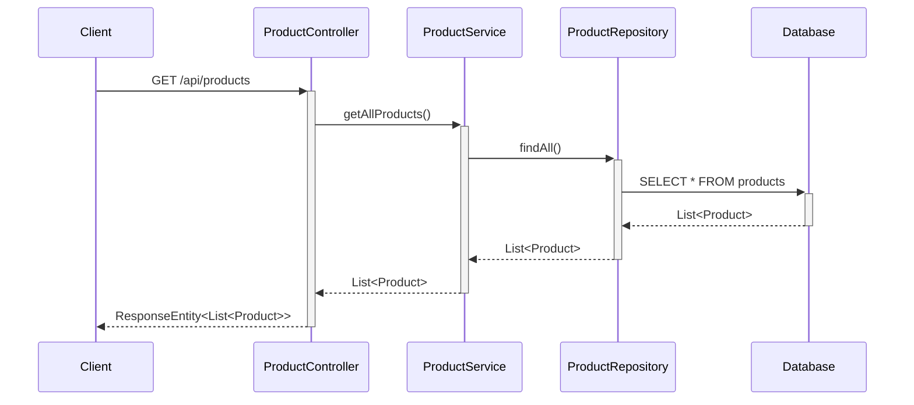

### 3.2 Get Product By ID

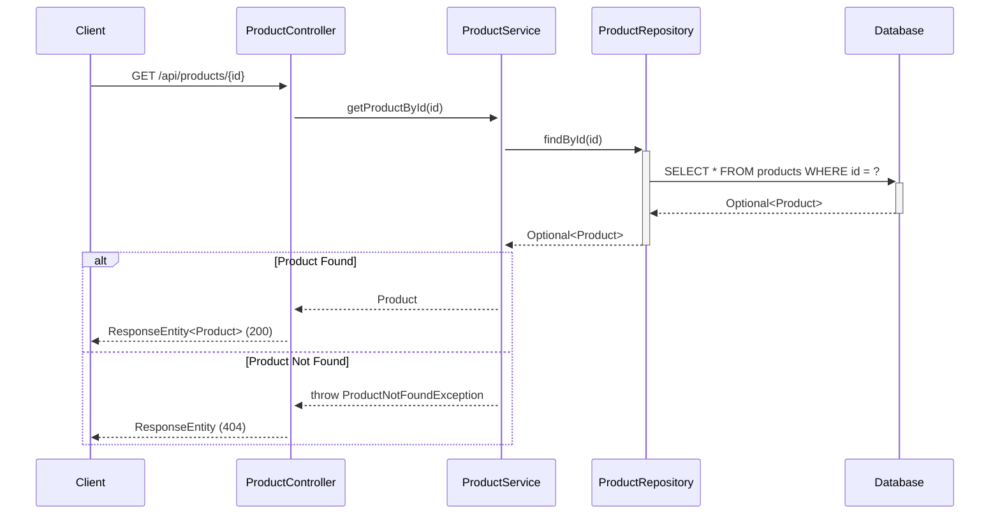

### 3.3 Create Product

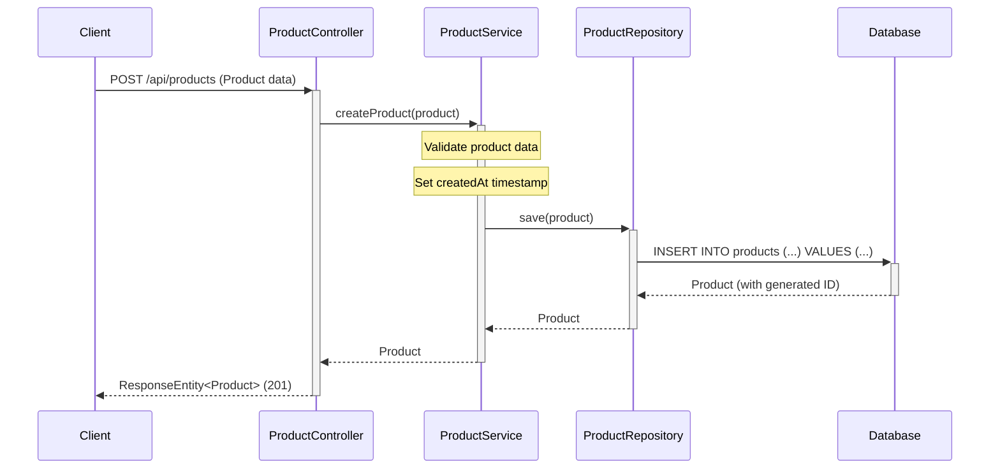

### 3.4 Update Product

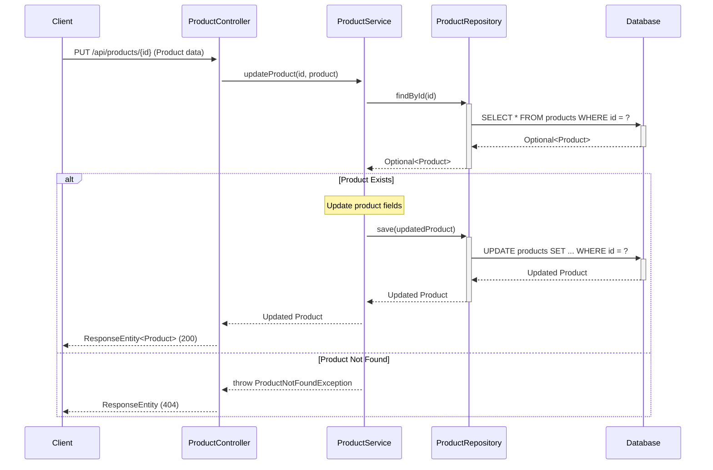

### 3.5 Delete Product

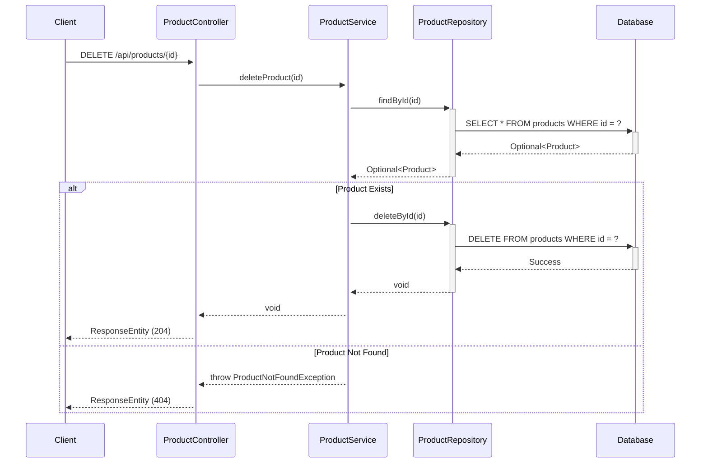

### 3.6 Get Products By Category

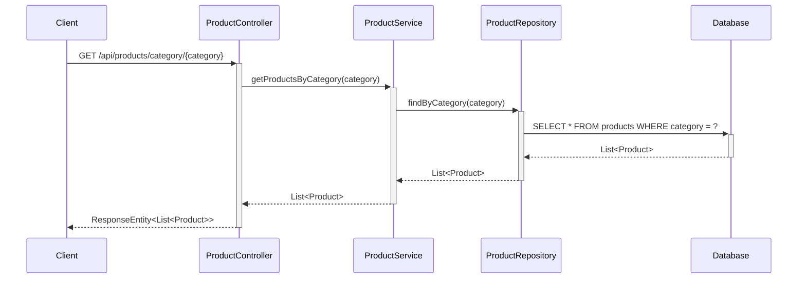

### 3.7 Search Products

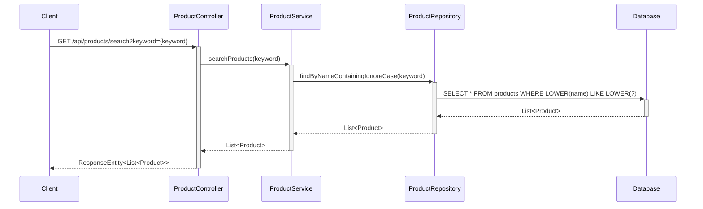

### 3.8 Add Product to Cart

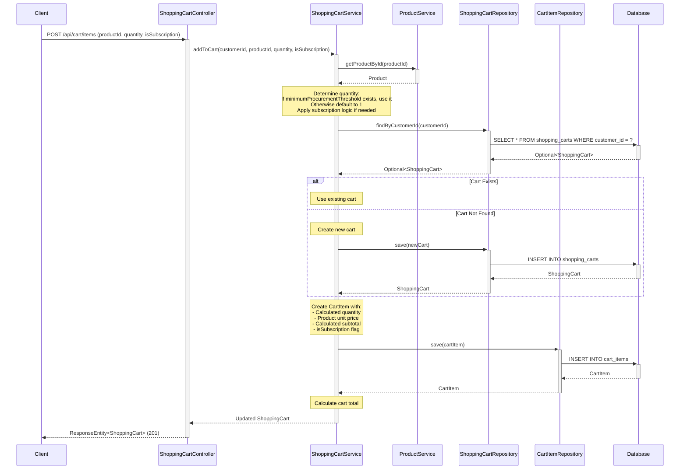

### 3.9 Get Shopping Cart

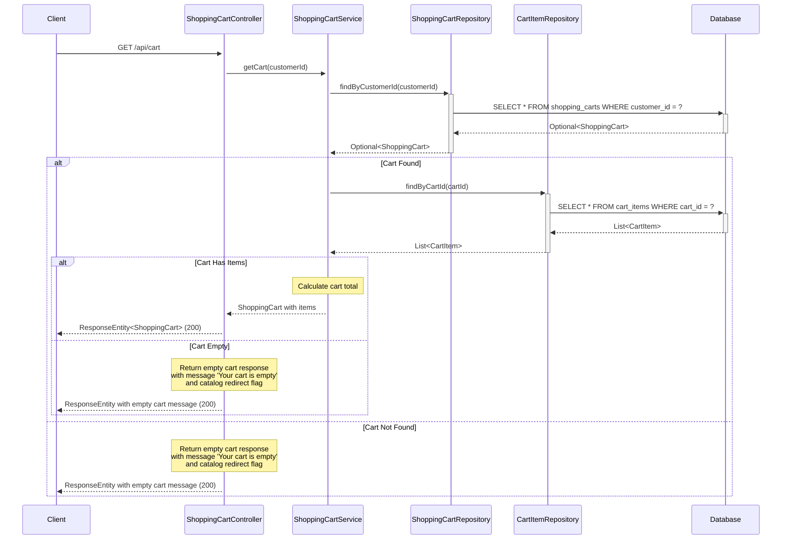

### 3.10 Update Cart Item Quantity

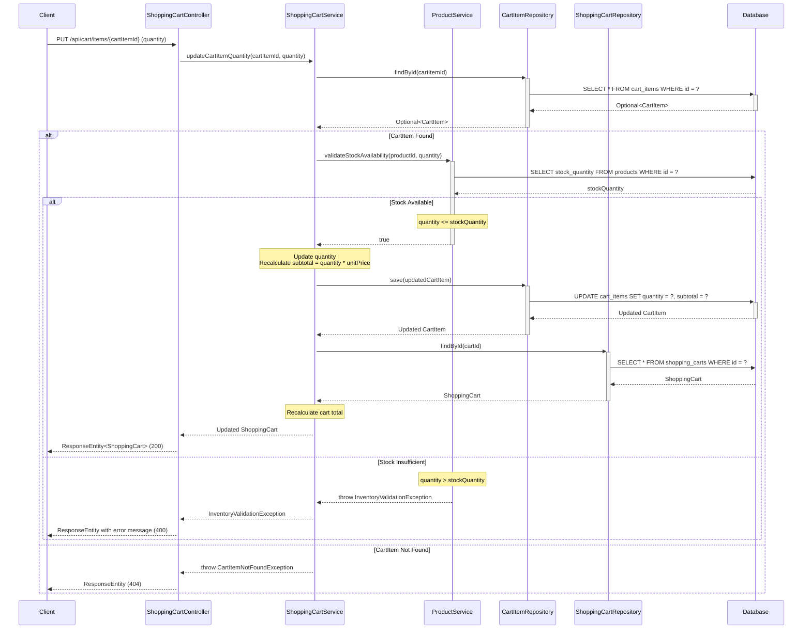

### 3.11 Remove Product from Cart

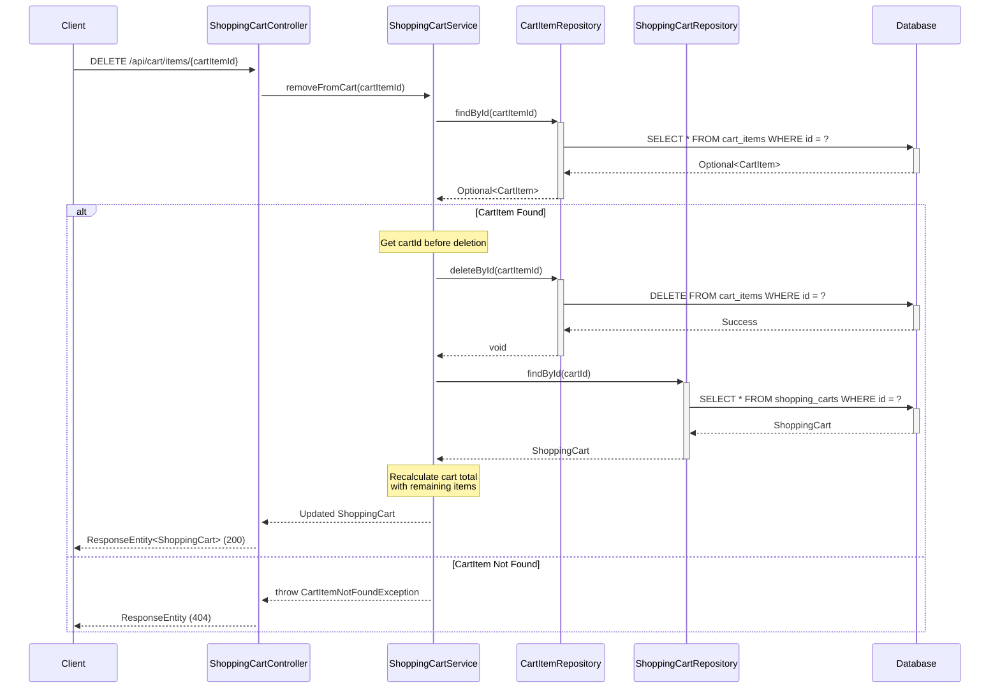

## 4. API Endpoints Summary

| Method | Endpoint | Description | Request Body | Response |
|--------|----------|-------------|--------------|----------|
| GET | `/api/products` | Get all products | None | List<Product> |
| GET | `/api/products/{id}` | Get product by ID | None | Product |
| POST | `/api/products` | Create new product | Product | Product |
| PUT | `/api/products/{id}` | Update existing product | Product | Product |
| DELETE | `/api/products/{id}` | Delete product | None | None |
| GET | `/api/products/category/{category}` | Get products by category | None | List<Product> |
| GET | `/api/products/search?keyword={keyword}` | Search products by name | None | List<Product> |
| POST | `/api/cart/items` | Add product to cart | {productId, quantity, isSubscription} | ShoppingCart |
| GET | `/api/cart` | Get shopping cart | None | ShoppingCart |
| PUT | `/api/cart/items/{cartItemId}` | Update cart item quantity | {quantity} | ShoppingCart |
| DELETE | `/api/cart/items/{cartItemId}` | Remove product from cart | None | ShoppingCart |

## 5. Database Schema

### Products Table

```sql
CREATE TABLE products (
    id BIGINT PRIMARY KEY AUTO_INCREMENT,
    name VARCHAR(255) NOT NULL,
    description TEXT,
    price DECIMAL(10,2) NOT NULL,
    category VARCHAR(100) NOT NULL,
    stock_quantity INTEGER NOT NULL DEFAULT 0,
    minimum_procurement_threshold INTEGER,
    created_at TIMESTAMP NOT NULL DEFAULT CURRENT_TIMESTAMP
);

CREATE INDEX idx_products_category ON products(category);
CREATE INDEX idx_products_name ON products(name);
```

### Shopping Carts Table

```sql
CREATE TABLE shopping_carts (
    id BIGINT PRIMARY KEY AUTO_INCREMENT,
    customer_id BIGINT NOT NULL,
    status VARCHAR(50) NOT NULL DEFAULT 'ACTIVE',
    created_at TIMESTAMP NOT NULL DEFAULT CURRENT_TIMESTAMP,
    updated_at TIMESTAMP NOT NULL DEFAULT CURRENT_TIMESTAMP ON UPDATE CURRENT_TIMESTAMP
);

CREATE INDEX idx_shopping_carts_customer_id ON shopping_carts(customer_id);
```

### Cart Items Table

```sql
CREATE TABLE cart_items (
    id BIGINT PRIMARY KEY AUTO_INCREMENT,
    cart_id BIGINT NOT NULL,
    product_id BIGINT NOT NULL,
    quantity INTEGER NOT NULL CHECK (quantity > 0),
    unit_price DECIMAL(10,2) NOT NULL,
    subtotal DECIMAL(10,2) NOT NULL,
    is_subscription BOOLEAN NOT NULL DEFAULT FALSE,
    minimum_procurement_threshold INTEGER,
    created_at TIMESTAMP NOT NULL DEFAULT CURRENT_TIMESTAMP,
    updated_at TIMESTAMP NOT NULL DEFAULT CURRENT_TIMESTAMP ON UPDATE CURRENT_TIMESTAMP,
    FOREIGN KEY (cart_id) REFERENCES shopping_carts(id) ON DELETE CASCADE,
    FOREIGN KEY (product_id) REFERENCES products(id) ON DELETE CASCADE
);

CREATE INDEX idx_cart_items_cart_id ON cart_items(cart_id);
CREATE INDEX idx_cart_items_product_id ON cart_items(product_id);
```

## 6. Business Logic

### 6.1 Automatic Quantity Setting (AC-1)

When adding a product to cart in `ShoppingCartService.addToCart()`:

1. Retrieve the product by productId
2. Check if product has `minimumProcurementThreshold`:
   - If threshold exists and is not null: Set quantity = minimumProcurementThreshold
   - If threshold is null: Set quantity = 1 (default)
3. Apply subscription-based logic:
   - If `isSubscription` is true: Apply any additional subscription quantity rules
   - If `isSubscription` is false: Use standard one-time purchase quantity
4. Calculate initial subtotal = quantity × product.price
5. Create and save CartItem with calculated values

### 6.2 Real-time Cart Calculation (AC-3)

When quantity changes in `ShoppingCartService.updateCartItemQuantity()`:

1. Validate inventory availability (see section 7.1)
2. Update CartItem quantity
3. Recalculate line item subtotal:
   ```
   subtotal = quantity × unitPrice
   ```
4. Save updated CartItem
5. Recalculate overall cart total:
   ```
   cartTotal = SUM(all cart_items.subtotal)
   ```
6. Return updated ShoppingCart with new totals immediately (no page refresh required)

The same calculation logic applies when removing items from cart.

## 7. Validation Rules

### 7.1 Inventory Validation (AC-6)

Implemented in `ShoppingCartService.updateCartItemQuantity()`:

1. Before updating quantity, call `ProductService.validateStockAvailability(productId, requestedQuantity)`
2. Retrieve product's current `stockQuantity` from database
3. Validation logic:
   ```java
   if (requestedQuantity > product.getStockQuantity()) {
       throw new InventoryValidationException(
           "Requested quantity (" + requestedQuantity + 
           ") exceeds available stock (" + product.getStockQuantity() + ")"
       );
   }
   ```
4. If validation passes, proceed with quantity update
5. If validation fails, throw exception and return HTTP 400 error to client

### 7.2 Cart Item Quantity Constraints

- Quantity must be greater than 0
- Database constraint: `CHECK (quantity > 0)`
- Application-level validation in service layer before save operations
