## 3. Sequence Diagrams

### 3.1 Get All Products

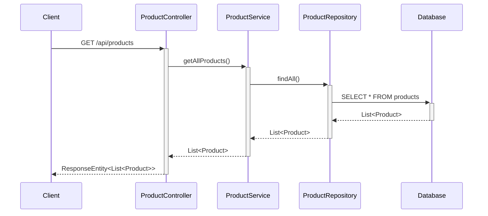

### 3.2 Get Product By ID

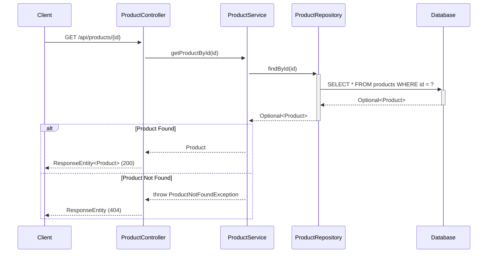

### 3.3 Create Product

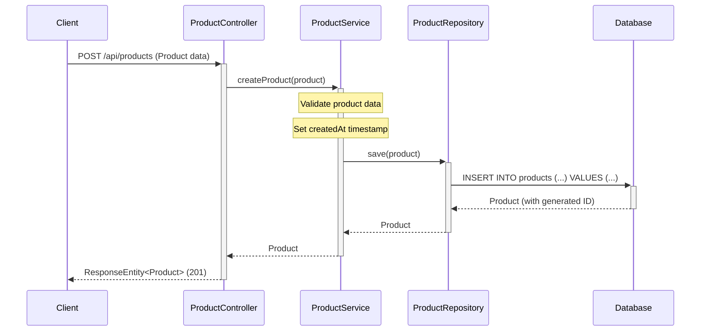

### 3.4 Update Product

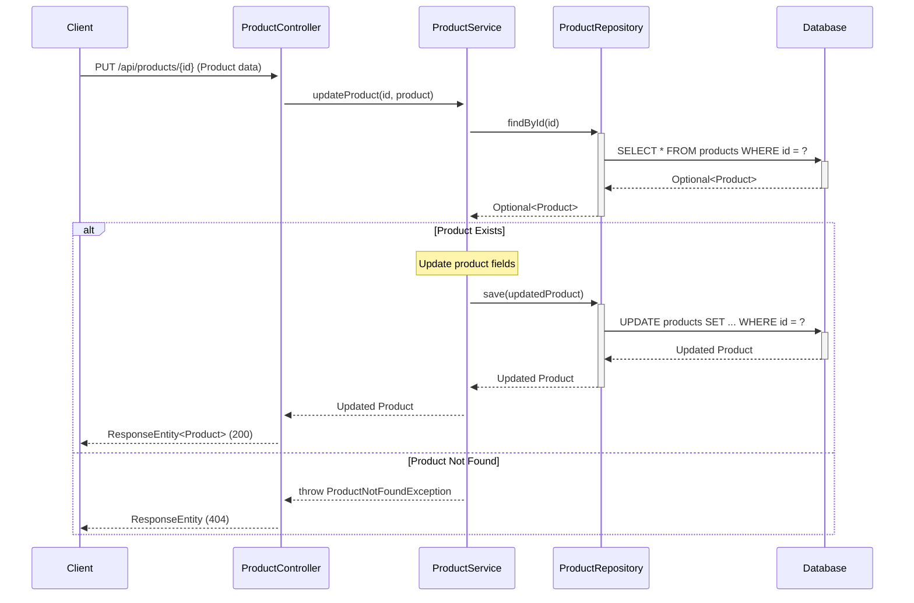

### 3.5 Delete Product

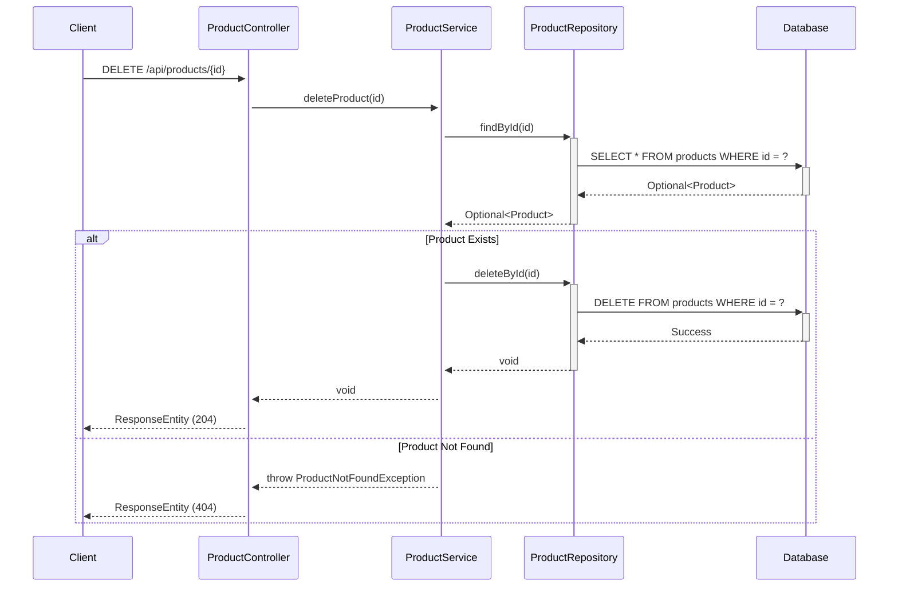

### 3.6 Get Products By Category

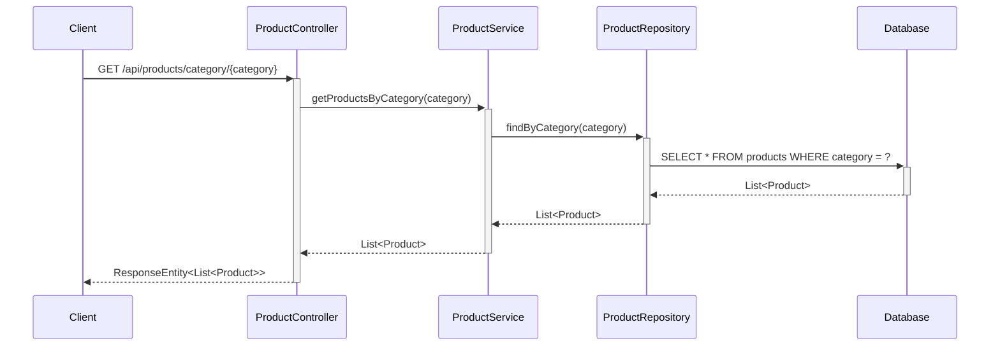

### 3.7 Search Products

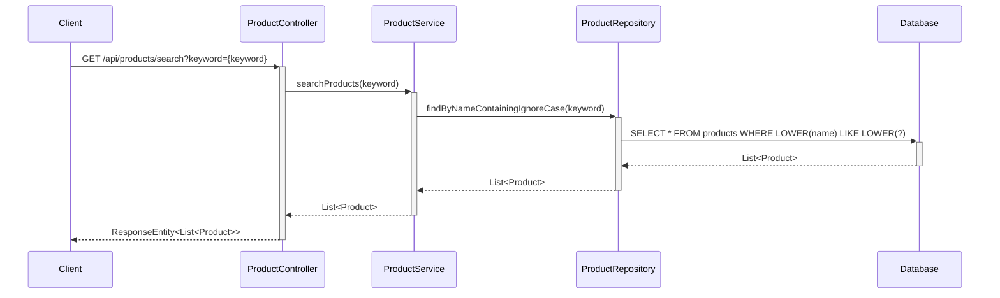

### 3.8 Add Item to Cart

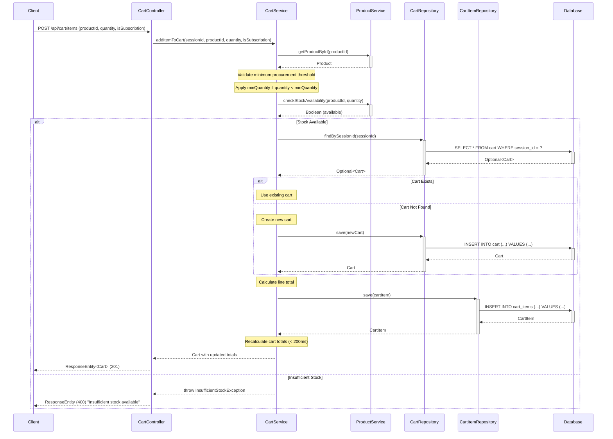

### 3.9 Get Cart

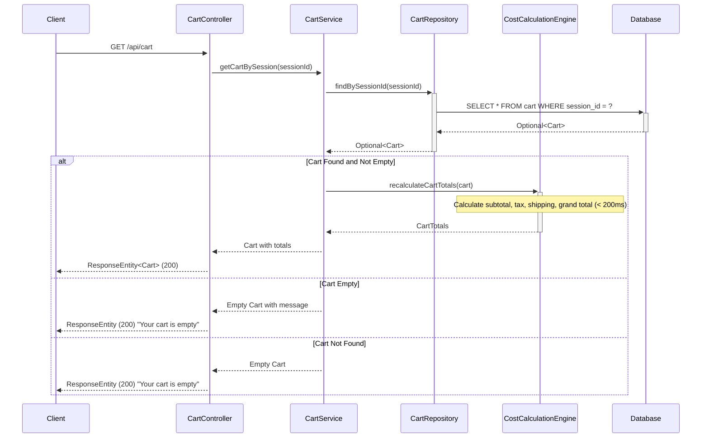

### 3.10 Update Cart Item Quantity

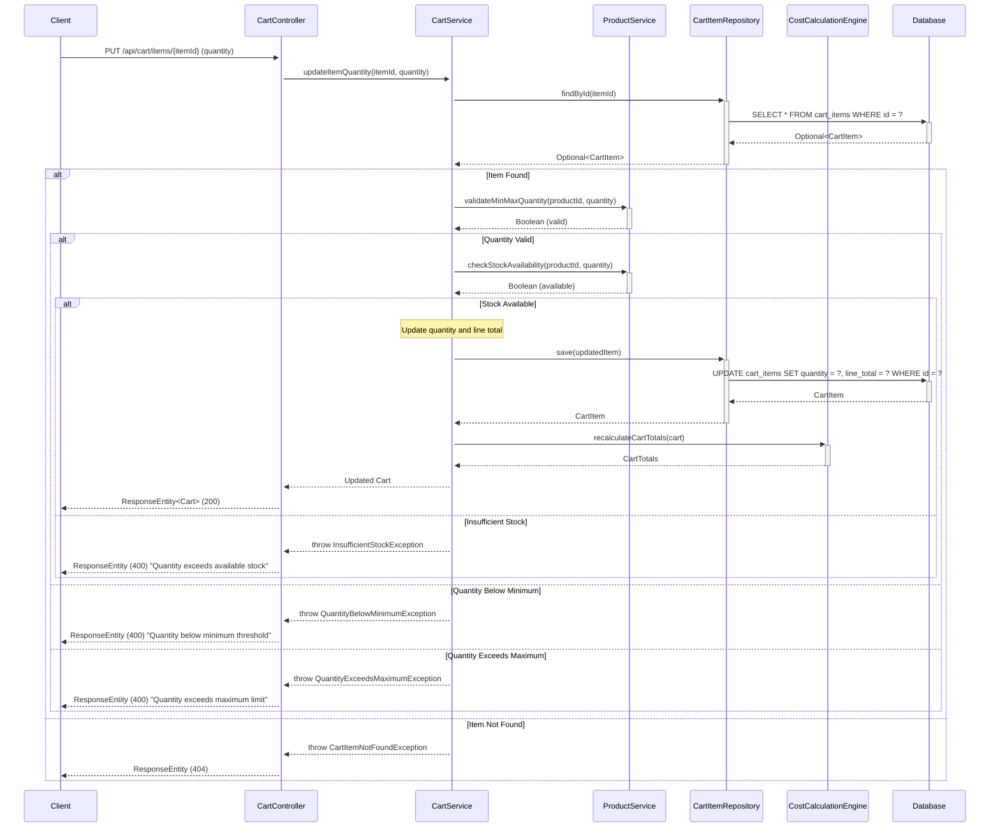

### 3.11 Remove Cart Item

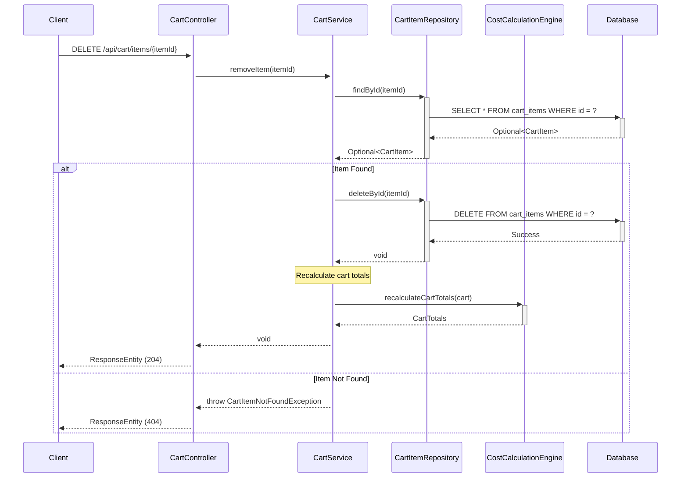

### 3.12 Clear Cart

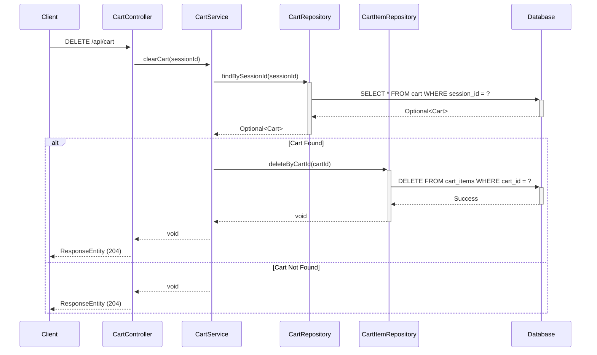

## 4. API Endpoints Summary

### 4.1 Product Management Endpoints

| Method | Endpoint | Description | Request Body | Response |
|--------|----------|-------------|--------------|----------|
| GET | `/api/products` | Get all products | None | List<Product> |
| GET | `/api/products/{id}` | Get product by ID | None | Product |
| POST | `/api/products` | Create new product | Product | Product |
| PUT | `/api/products/{id}` | Update existing product | Product | Product |
| DELETE | `/api/products/{id}` | Delete product | None | None |
| GET | `/api/products/category/{category}` | Get products by category | None | List<Product> |
| GET | `/api/products/search?keyword={keyword}` | Search products by name | None | List<Product> |

### 4.2 Shopping Cart Endpoints

| Method | Endpoint | Description | Request Body | Response |
|--------|----------|-------------|--------------|----------|
| POST | `/api/cart/items` | Add product to cart | CartItemRequest (productId, quantity, isSubscription) | Cart |
| GET | `/api/cart` | View current cart | None | Cart |
| PUT | `/api/cart/items/{id}` | Update item quantity | QuantityUpdateRequest (quantity) | Cart |
| DELETE | `/api/cart/items/{id}` | Remove item from cart | None | None |
| DELETE | `/api/cart` | Clear entire cart | None | None |

## 5. Database Schema

### 5.1 Products Table

```sql
CREATE TABLE products (
    id BIGINT PRIMARY KEY AUTO_INCREMENT,
    name VARCHAR(255) NOT NULL,
    description TEXT,
    price DECIMAL(10,2) NOT NULL,
    category VARCHAR(100) NOT NULL,
    stock_quantity INTEGER NOT NULL DEFAULT 0,
    min_quantity INTEGER DEFAULT 1,
    max_quantity INTEGER,
    is_subscription_eligible BOOLEAN NOT NULL DEFAULT FALSE,
    created_at TIMESTAMP NOT NULL DEFAULT CURRENT_TIMESTAMP
);

CREATE INDEX idx_products_category ON products(category);
CREATE INDEX idx_products_name ON products(name);
```

### 5.2 Cart Table

```sql
CREATE TABLE cart (
    id BIGINT PRIMARY KEY AUTO_INCREMENT,
    session_id VARCHAR(255) NOT NULL UNIQUE,
    user_id BIGINT,
    created_at TIMESTAMP NOT NULL DEFAULT CURRENT_TIMESTAMP,
    updated_at TIMESTAMP NOT NULL DEFAULT CURRENT_TIMESTAMP ON UPDATE CURRENT_TIMESTAMP
);

CREATE INDEX idx_cart_session_id ON cart(session_id);
CREATE INDEX idx_cart_user_id ON cart(user_id);
```

### 5.3 Cart Items Table

```sql
CREATE TABLE cart_items (
    id BIGINT PRIMARY KEY AUTO_INCREMENT,
    cart_id BIGINT NOT NULL,
    product_id BIGINT NOT NULL,
    quantity INTEGER NOT NULL DEFAULT 1,
    is_subscription BOOLEAN NOT NULL DEFAULT FALSE,
    line_total DECIMAL(10,2) NOT NULL,
    created_at TIMESTAMP NOT NULL DEFAULT CURRENT_TIMESTAMP,
    updated_at TIMESTAMP NOT NULL DEFAULT CURRENT_TIMESTAMP ON UPDATE CURRENT_TIMESTAMP,
    FOREIGN KEY (cart_id) REFERENCES cart(id) ON DELETE CASCADE,
    FOREIGN KEY (product_id) REFERENCES products(id) ON DELETE CASCADE
);

CREATE INDEX idx_cart_items_cart_id ON cart_items(cart_id);
CREATE INDEX idx_cart_items_product_id ON cart_items(product_id);
```
