## 3. Sequence Diagrams

### 3.1 Get All Products

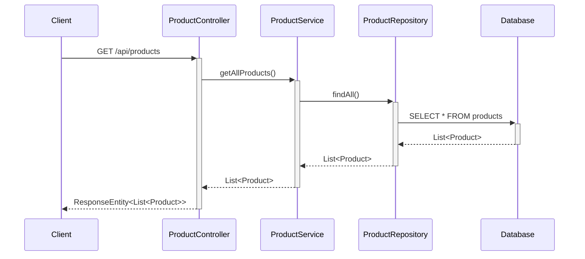

### 3.2 Get Product By ID

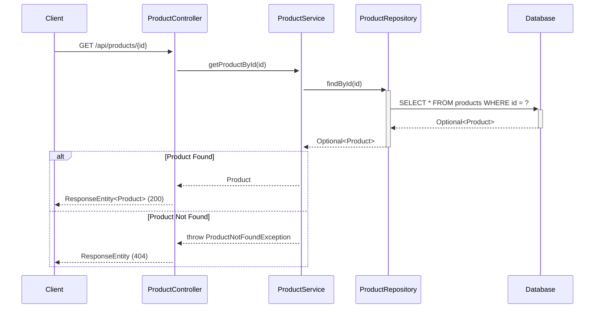

### 3.3 Create Product

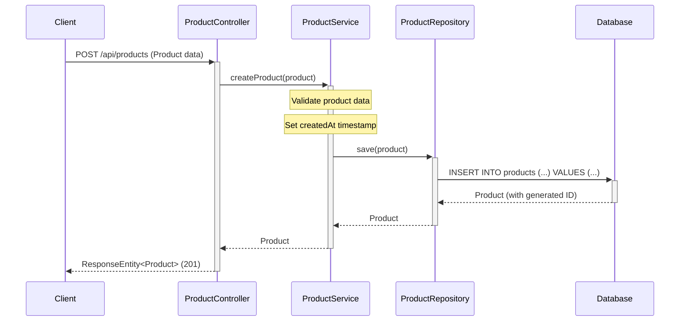

### 3.4 Update Product

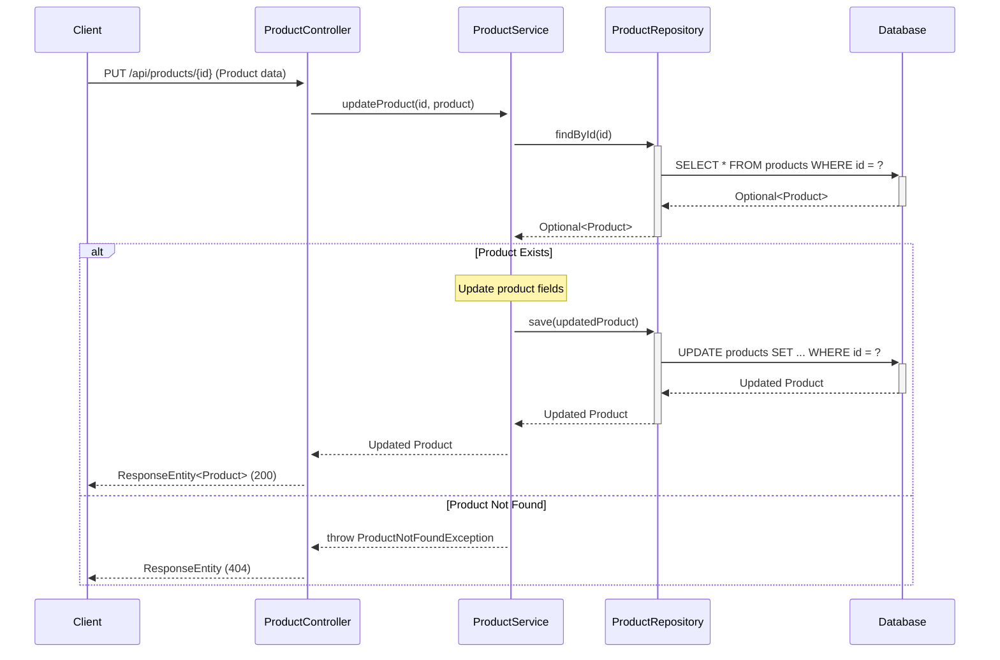

### 3.5 Delete Product

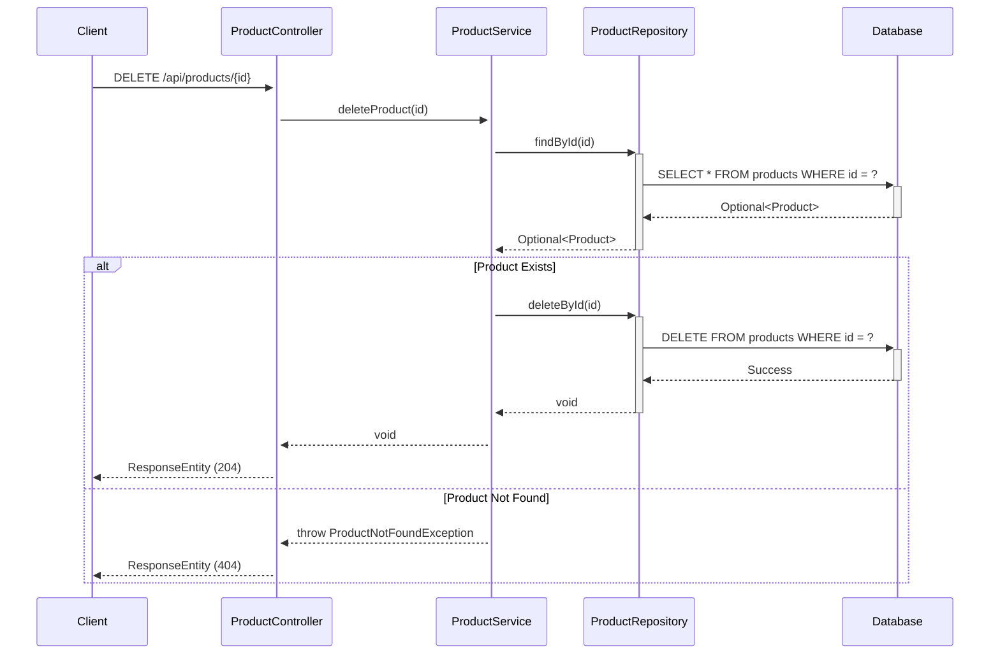

### 3.6 Get Products By Category

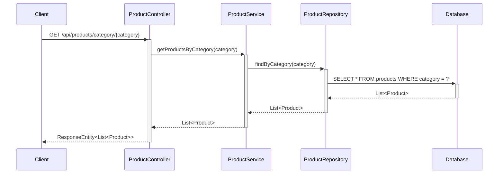

### 3.7 Search Products

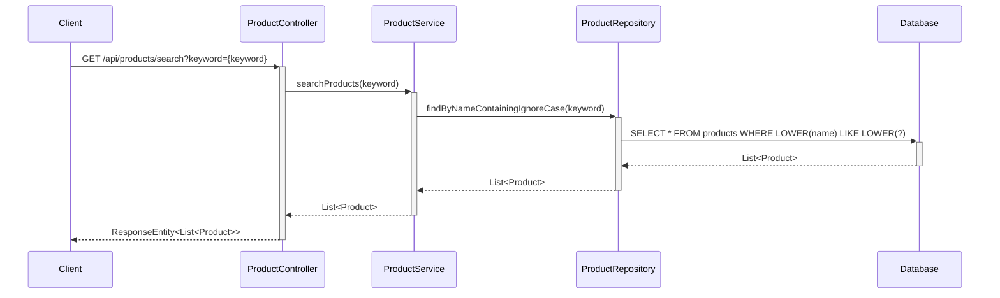

### 3.8 Add Product to Cart (NEW)

```mermaid
sequenceDiagram
    participant Client
    participant CartController
    participant CartService
    participant InventoryValidationService
    participant ProductService
    participant CartRepository
    participant CartItemRepository
    participant Database
    
    Client->>+CartController: POST /api/cart/items {customerId, productId, quantity}
    CartController->>+CartService: addProductToCart(customerId, productId, quantity)
    
    CartService->>+ProductService: getProductById(productId)
    ProductService-->>-CartService: Product
    
    Note over CartService: Check Minimum Procurement Threshold
    
    CartService->>+InventoryValidationService: validateStockAvailability(productId, quantity)
    InventoryValidationService->>+ProductService: getProductById(productId)
    ProductService-->>-InventoryValidationService: Product
    
    alt Stock Available
        InventoryValidationService-->>-CartService: true
        
        CartService->>+CartRepository: findByCustomerId(customerId)
        CartRepository->>+Database: SELECT * FROM carts WHERE customer_id = ?
        Database-->>-CartRepository: Optional<Cart>
        CartRepository-->>-CartService: Optional<Cart>
        
        alt Cart Exists
            Note over CartService: Use existing cart
        else Cart Not Exists
            Note over CartService: Create new cart
            CartService->>+CartRepository: save(newCart)
            CartRepository->>+Database: INSERT INTO carts (...) VALUES (...)
            Database-->>-CartRepository: Cart
            CartRepository-->>-CartService: Cart
        end
        
        Note over CartService: Calculate subtotal = unitPrice * quantity
        Note over CartService: Create CartItem
        
        CartService->>+CartItemRepository: save(cartItem)
        CartItemRepository->>+Database: INSERT INTO cart_items (...) VALUES (...)
        Database-->>-CartItemRepository: CartItem
        CartItemRepository-->>-CartService: CartItem
        
        CartService-->>CartController: CartItem
        CartController-->>Client: ResponseEntity<CartItem> (201)
    else Stock Unavailable
        InventoryValidationService-->>-CartService: false
        CartService-->>CartController: throw InsufficientStockException
        CartController-->>Client: ResponseEntity (400) "Insufficient stock"
    end
```

### 3.9 Get Cart (NEW)

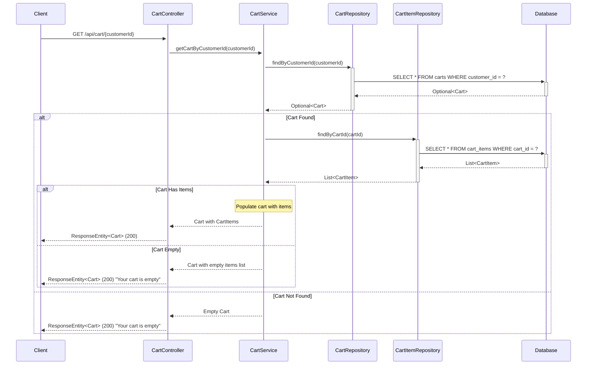

### 3.10 Update Cart Item Quantity (NEW)

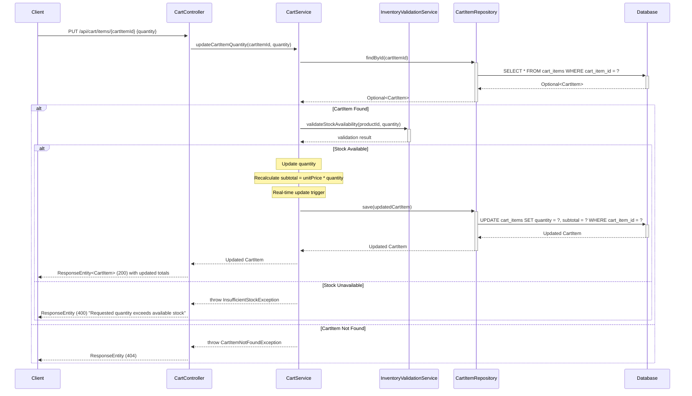

### 3.11 Remove Cart Item (NEW)

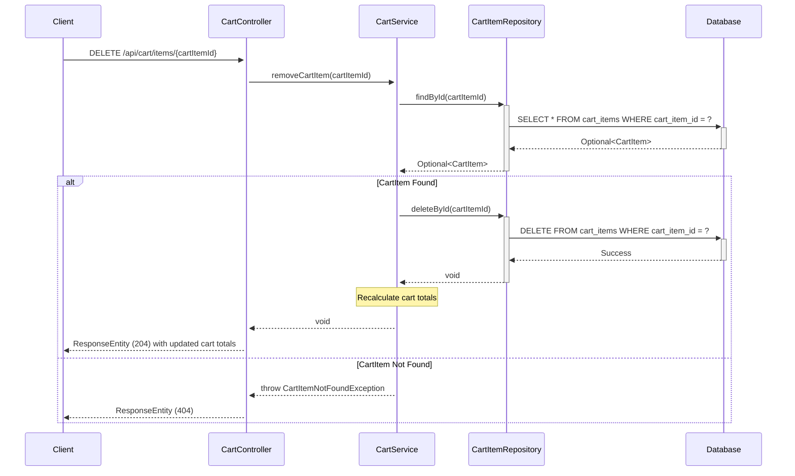

### 3.12 Get Cart Summary (NEW)

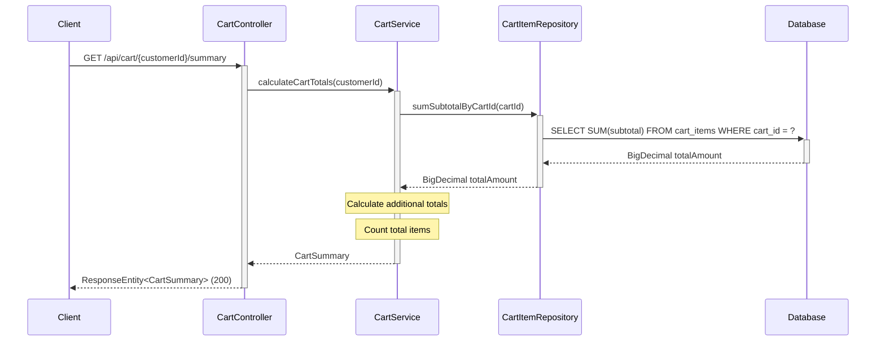

## 4. API Endpoints Summary

| Method | Endpoint | Description | Request Body | Response |
|--------|----------|-------------|--------------|----------|
| GET | `/api/products` | Get all products | None | List<Product> |
| GET | `/api/products/{id}` | Get product by ID | None | Product |
| POST | `/api/products` | Create new product | Product | Product |
| PUT | `/api/products/{id}` | Update existing product | Product | Product |
| DELETE | `/api/products/{id}` | Delete product | None | None |
| GET | `/api/products/category/{category}` | Get products by category | None | List<Product> |
| GET | `/api/products/search?keyword={keyword}` | Search products by name | None | List<Product> |

### 4.1 Shopping Cart API Endpoints (NEW)

| Method | Endpoint | Description | Request Body | Response |
|--------|----------|-------------|--------------|----------|
| POST | `/api/cart/items` | Add product to cart | {customerId, productId, quantity} | CartItem |
| GET | `/api/cart/{customerId}` | Retrieve customer's cart | None | Cart with CartItems |
| PUT | `/api/cart/items/{cartItemId}` | Update cart item quantity | {quantity} | CartItem |
| DELETE | `/api/cart/items/{cartItemId}` | Remove product from cart | None | None |
| GET | `/api/cart/{customerId}/summary` | Get cart totals and summary | None | CartSummary |

## 5. Database Schema

### Products Table

```sql
CREATE TABLE products (
    id BIGINT PRIMARY KEY AUTO_INCREMENT,
    name VARCHAR(255) NOT NULL,
    description TEXT,
    price DECIMAL(10,2) NOT NULL,
    category VARCHAR(100) NOT NULL,
    stock_quantity INTEGER NOT NULL DEFAULT 0,
    created_at TIMESTAMP NOT NULL DEFAULT CURRENT_TIMESTAMP
);

CREATE INDEX idx_products_category ON products(category);
CREATE INDEX idx_products_name ON products(name);
```

### 5.1 Shopping Cart Database Schema (NEW)

```sql
-- Carts Table
CREATE TABLE carts (
    cart_id BIGINT PRIMARY KEY AUTO_INCREMENT,
    customer_id BIGINT NOT NULL UNIQUE,
    created_at TIMESTAMP NOT NULL DEFAULT CURRENT_TIMESTAMP,
    updated_at TIMESTAMP NOT NULL DEFAULT CURRENT_TIMESTAMP ON UPDATE CURRENT_TIMESTAMP,
    status VARCHAR(20) NOT NULL DEFAULT 'ACTIVE',
    CONSTRAINT chk_cart_status CHECK (status IN ('ACTIVE', 'ABANDONED', 'CONVERTED'))
);

CREATE INDEX idx_carts_customer_id ON carts(customer_id);
CREATE INDEX idx_carts_status ON carts(status);

-- Cart Items Table
CREATE TABLE cart_items (
    cart_item_id BIGINT PRIMARY KEY AUTO_INCREMENT,
    cart_id BIGINT NOT NULL,
    product_id BIGINT NOT NULL,
    quantity INTEGER NOT NULL CHECK (quantity > 0),
    unit_price DECIMAL(10,2) NOT NULL,
    subtotal DECIMAL(10,2) NOT NULL,
    added_at TIMESTAMP NOT NULL DEFAULT CURRENT_TIMESTAMP,
    CONSTRAINT fk_cart_items_cart FOREIGN KEY (cart_id) REFERENCES carts(cart_id) ON DELETE CASCADE,
    CONSTRAINT fk_cart_items_product FOREIGN KEY (product_id) REFERENCES products(id) ON DELETE CASCADE,
    CONSTRAINT uq_cart_product UNIQUE (cart_id, product_id)
);

CREATE INDEX idx_cart_items_cart_id ON cart_items(cart_id);
CREATE INDEX idx_cart_items_product_id ON cart_items(product_id);

-- Enhanced Products Table for Cart Support
ALTER TABLE products 
ADD COLUMN minimum_procurement_threshold INTEGER DEFAULT NULL,
ADD COLUMN subscription_eligible BOOLEAN NOT NULL DEFAULT FALSE;

CREATE INDEX idx_products_stock_quantity ON products(stock_quantity);
```

## 6. Technology Stack

- **Backend Framework:** Spring Boot 3.x
- **Language:** Java 21
- **Database:** PostgreSQL
- **ORM:** Spring Data JPA / Hibernate
- **Build Tool:** Maven/Gradle
- **API Documentation:** Swagger/OpenAPI 3

### 6.1 Additional Technology Components for Shopping Cart (NEW)

- **Real-time Updates:** WebSocket / Server-Sent Events (SSE) for instant cart total updates
- **Caching:** Redis for cart session management and performance optimization
- **Validation:** Hibernate Validator for input validation
- **Transaction Management:** Spring @Transactional for cart operations consistency
- **Exception Handling:** Custom exception handlers for cart-specific errors

## 7. Design Patterns Used

1. **MVC Pattern:** Separation of Controller, Service, and Repository layers
2. **Repository Pattern:** Data access abstraction through ProductRepository
3. **Dependency Injection:** Spring's IoC container manages dependencies
4. **DTO Pattern:** Data Transfer Objects for API requests/responses
5. **Exception Handling:** Custom exceptions for business logic errors

### 7.1 Additional Design Patterns for Shopping Cart (NEW)

6. **Service Layer Pattern:** CartService encapsulates cart business logic and orchestrates operations
7. **Validation Strategy Pattern:** InventoryValidationService implements stock validation strategies
8. **Observer Pattern:** Real-time cart update mechanism notifies UI of cart changes
9. **Factory Pattern:** Cart creation and initialization logic
10. **Transaction Script Pattern:** Cart operations wrapped in database transactions for consistency
