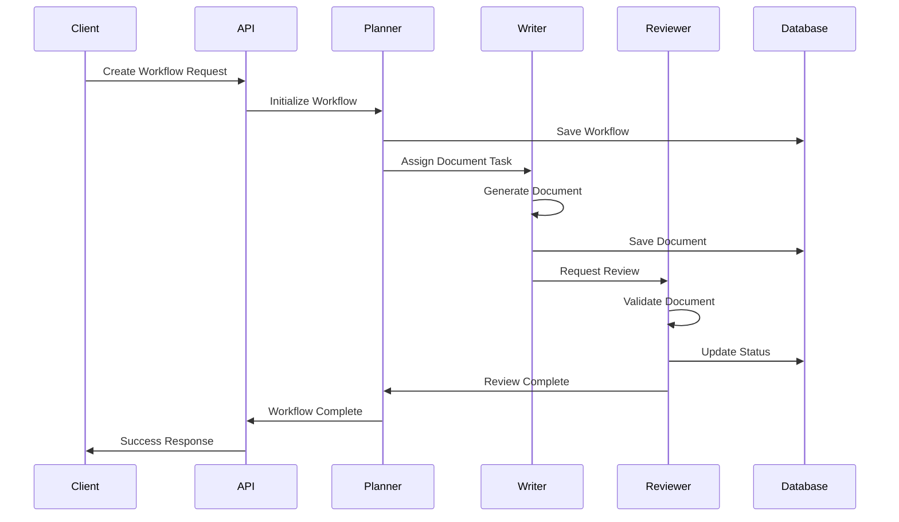
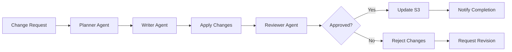

## 4. Data Flow

### 4.1 Workflow Execution Flow



### 4.2 Document Update Flow



## 5. API Specifications

### 5.1 AI Framework API Endpoints

#### 5.1.1 Workflow Management

**Create Workflow**
```
POST /api/v1/workflows
Content-Type: application/json

Request Body:
{
  "name": "Document Generation Workflow",
  "type": "document_generation",
  "configuration": {
    "template": "lld_template",
    "output_format": "markdown"
  }
}

Response: 201 Created
{
  "workflow_id": "wf-12345",
  "status": "INITIALIZED",
  "created_at": "2024-01-15T10:30:00Z"
}
```

**Get Workflow Status**
```
GET /api/v1/workflows/{workflow_id}

Response: 200 OK
{
  "workflow_id": "wf-12345",
  "name": "Document Generation Workflow",
  "status": "EXECUTING",
  "progress": 65,
  "current_task": "document_generation",
  "created_at": "2024-01-15T10:30:00Z",
  "updated_at": "2024-01-15T10:45:00Z"
}
```

**List Workflows**
```
GET /api/v1/workflows?status=EXECUTING&limit=10&offset=0

Response: 200 OK
{
  "workflows": [
    {
      "workflow_id": "wf-12345",
      "name": "Document Generation Workflow",
      "status": "EXECUTING",
      "created_at": "2024-01-15T10:30:00Z"
    }
  ],
  "total": 1,
  "limit": 10,
  "offset": 0
}
```

#### 5.1.2 Document Management

**Create Document**
```
POST /api/v1/documents
Content-Type: application/json

Request Body:
{
  "workflow_id": "wf-12345",
  "type": "lld",
  "template": "lld_template",
  "data": {
    "project_name": "AI Framework",
    "version": "1.0"
  }
}

Response: 201 Created
{
  "document_id": "doc-67890",
  "workflow_id": "wf-12345",
  "status": "GENERATING",
  "created_at": "2024-01-15T10:35:00Z"
}
```

**Get Document**
```
GET /api/v1/documents/{document_id}

Response: 200 OK
{
  "document_id": "doc-67890",
  "workflow_id": "wf-12345",
  "type": "lld",
  "status": "COMPLETED",
  "content_url": "s3://bucket/path/to/document.md",
  "version": 1,
  "created_at": "2024-01-15T10:35:00Z",
  "updated_at": "2024-01-15T10:40:00Z"
}
```

**Update Document**
```
PUT /api/v1/documents/{document_id}
Content-Type: application/json

Request Body:
{
  "changes": [
    {
      "section": "2.2",
      "operation": "MODIFY",
      "content": "Updated architecture description"
    }
  ]
}

Response: 200 OK
{
  "document_id": "doc-67890",
  "version": 2,
  "status": "UPDATED",
  "updated_at": "2024-01-15T11:00:00Z"
}
```

#### 5.1.3 Task Management

**Create Task**
```
POST /api/v1/tasks
Content-Type: application/json

Request Body:
{
  "workflow_id": "wf-12345",
  "type": "document_generation",
  "priority": "HIGH",
  "assigned_agent": "writer_agent_1",
  "parameters": {
    "template": "lld_template",
    "output_format": "markdown"
  }
}

Response: 201 Created
{
  "task_id": "task-11111",
  "workflow_id": "wf-12345",
  "status": "PENDING",
  "created_at": "2024-01-15T10:32:00Z"
}
```

**Get Task Status**
```
GET /api/v1/tasks/{task_id}

Response: 200 OK
{
  "task_id": "task-11111",
  "workflow_id": "wf-12345",
  "type": "document_generation",
  "status": "IN_PROGRESS",
  "assigned_agent": "writer_agent_1",
  "progress": 75,
  "created_at": "2024-01-15T10:32:00Z",
  "updated_at": "2024-01-15T10:38:00Z"
}
```

#### 5.1.4 Agent Management

**List Agents**
```
GET /api/v1/agents?status=ACTIVE

Response: 200 OK
{
  "agents": [
    {
      "agent_id": "planner_agent_1",
      "type": "planner",
      "status": "ACTIVE",
      "current_tasks": 2,
      "capabilities": ["workflow_orchestration", "task_assignment"]
    },
    {
      "agent_id": "writer_agent_1",
      "type": "writer",
      "status": "ACTIVE",
      "current_tasks": 1,
      "capabilities": ["document_generation", "content_update"]
    }
  ]
}
```

**Get Agent Status**
```
GET /api/v1/agents/{agent_id}

Response: 200 OK
{
  "agent_id": "writer_agent_1",
  "type": "writer",
  "status": "ACTIVE",
  "current_tasks": 1,
  "completed_tasks": 45,
  "capabilities": ["document_generation", "content_update"],
  "last_active": "2024-01-15T10:40:00Z"
}
```

#### 5.1.5 Approval Management

**Create Approval Request**
```
POST /api/v1/approvals
Content-Type: application/json

Request Body:
{
  "workflow_id": "wf-12345",
  "document_id": "doc-67890",
  "type": "document_approval",
  "required_approvers": 2,
  "timeout_hours": 24
}

Response: 201 Created
{
  "approval_id": "appr-22222",
  "status": "PENDING",
  "created_at": "2024-01-15T10:45:00Z",
  "expires_at": "2024-01-16T10:45:00Z"
}
```

**Submit Approval Decision**
```
POST /api/v1/approvals/{approval_id}/decision
Content-Type: application/json

Request Body:
{
  "decision": "APPROVED",
  "comments": "Document looks good, approved for release",
  "approver_id": "user-123"
}

Response: 200 OK
{
  "approval_id": "appr-22222",
  "status": "APPROVED",
  "approvers": [
    {
      "approver_id": "user-123",
      "decision": "APPROVED",
      "timestamp": "2024-01-15T11:00:00Z"
    }
  ]
}
```

#### 5.1.6 Integration Endpoints

**Jira Integration**
```
POST /api/v1/integrations/jira/issues
Content-Type: application/json

Request Body:
{
  "workflow_id": "wf-12345",
  "project_key": "AIFW",
  "issue_type": "Task",
  "summary": "Generate LLD Document",
  "description": "Create low-level design document for AI framework"
}

Response: 201 Created
{
  "jira_issue_id": "AIFW-123",
  "jira_url": "https://company.atlassian.net/browse/AIFW-123",
  "workflow_id": "wf-12345"
}
```

**TestRail Integration**
```
POST /api/v1/integrations/testrail/test-cases
Content-Type: application/json

Request Body:
{
  "workflow_id": "wf-12345",
  "suite_id": 10,
  "section_id": 100,
  "test_cases": [
    {
      "title": "Verify workflow creation",
      "priority": "High",
      "type": "Functional",
      "custom_steps": "1. Create workflow\n2. Verify status"
    }
  ]
}

Response: 201 Created
{
  "test_case_ids": ["C123", "C124"],
  "suite_id": 10,
  "workflow_id": "wf-12345"
}
```

### 5.2 Error Responses

All API endpoints follow a consistent error response format:

```json
{
  "error": {
    "code": "VALIDATION_ERROR",
    "message": "Invalid workflow configuration",
    "details": [
      {
        "field": "configuration.template",
        "message": "Template 'invalid_template' does not exist"
      }
    ],
    "timestamp": "2024-01-15T10:30:00Z",
    "request_id": "req-98765"
  }
}
```

**Common Error Codes:**
- `VALIDATION_ERROR` (400): Invalid request data
- `UNAUTHORIZED` (401): Authentication required
- `FORBIDDEN` (403): Insufficient permissions
- `NOT_FOUND` (404): Resource not found
- `CONFLICT` (409): Resource conflict
- `INTERNAL_ERROR` (500): Server error
- `SERVICE_UNAVAILABLE` (503): Service temporarily unavailable
