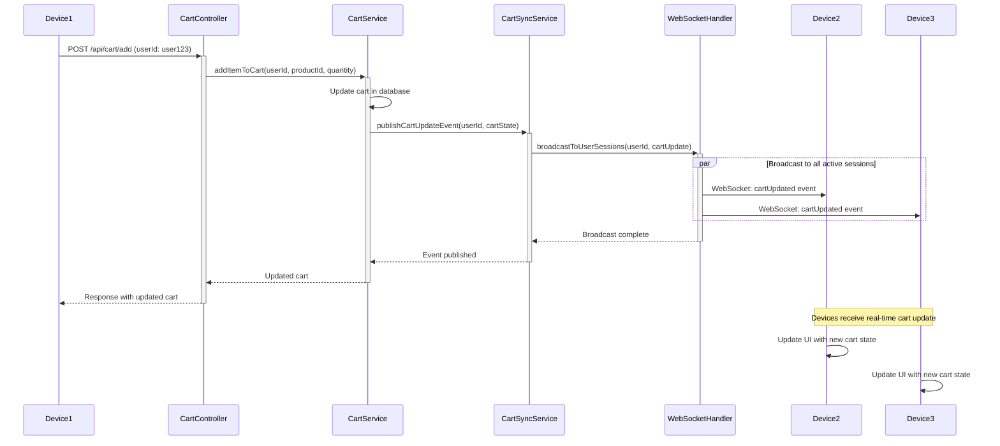
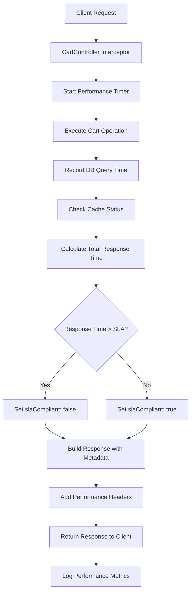

## 10. Cart Synchronization Architecture

### 10.1 Multi-Device Cart Synchronization

**Source:** Epic SCRUM-344 - Cart Synchronization Requirement

**Requirement:** Cart contents must be synchronized across multiple user sessions and devices for authenticated users.

### 10.2 Synchronization Strategy

**Implementation Approach:** Event-driven synchronization with real-time updates

**Components:**

1. **CartSyncService:**
   - Manages cart state synchronization
   - Publishes cart update events
   - Handles conflict resolution for concurrent updates

2. **WebSocket Handler:**
   - Maintains active WebSocket connections per user
   - Broadcasts cart updates to all user sessions
   - Handles connection lifecycle management

3. **Cart Event Publisher:**
   - Publishes cart modification events
   - Event types: ITEM_ADDED, ITEM_REMOVED, QUANTITY_UPDATED, CART_CLEARED

### 10.3 Cart Synchronization Sequence Diagram



### 10.4 Synchronization Implementation Details

**WebSocket Endpoint:** `/ws/cart/{userId}`

**Event Message Format:**
```json
{
  "eventType": "CART_UPDATED",
  "userId": "user123",
  "timestamp": "2025-01-17T10:30:00Z",
  "cartState": {
    "items": [...],
    "totalItems": 3,
    "subtotal": 150.00,
    "total": 150.00
  },
  "changeType": "ITEM_ADDED",
  "affectedItemId": "item456"
}
```

**Conflict Resolution Strategy:**
- Last-write-wins for quantity updates
- Timestamp-based conflict resolution
- Optimistic locking on cart entity
- Client-side reconciliation for edge cases

**Fallback Mechanism:**
- Polling endpoint for clients without WebSocket support
- GET `/api/cart/sync?lastSyncTimestamp={timestamp}`
- Returns cart changes since last sync

### 10.5 Synchronization Performance Considerations

**Synchronization SLA:** Cart updates propagated to all sessions within 1 second

**Scalability:**
- WebSocket connection pooling
- Horizontal scaling with sticky sessions
- Redis pub/sub for multi-instance synchronization

**Connection Management:**
- Automatic reconnection with exponential backoff
- Heartbeat mechanism to detect stale connections
- Connection timeout: 5 minutes of inactivity

## 11. API Response Enhancements

### 11.1 Performance Metadata in API Responses

**Source:** Epic SCRUM-344 - Performance Requirements

**Purpose:** Provide performance metadata and SLA compliance information in API responses for monitoring and client-side optimization.

### 11.2 Response Headers

**Standard Performance Headers:**

| Header Name | Description | Example Value |
|-------------|-------------|---------------|
| `X-Response-Time` | Total request processing time in milliseconds | `245` |
| `X-DB-Query-Time` | Database query execution time in milliseconds | `120` |
| `X-Cache-Status` | Cache hit/miss status | `HIT` or `MISS` |
| `X-Service-Version` | API service version | `1.0.0` |
| `X-Request-Id` | Unique request identifier for tracing | `req-abc123` |

### 11.3 Enhanced Response Body Structure

**CartDTO with Performance Metadata:**

```json
{
  "userId": "user123",
  "items": [
    {
      "id": "item1",
      "productId": "prod456",
      "productName": "Product Name",
      "quantity": 2,
      "priceSnapshot": 50.00,
      "subtotal": 100.00
    }
  ],
  "totalItems": 2,
  "subtotal": 100.00,
  "total": 100.00,
  "isEmpty": false,
  "lastModified": "2025-01-17T10:30:00Z",
  "_metadata": {
    "responseTime": 245,
    "cacheStatus": "HIT",
    "requestId": "req-abc123",
    "slaCompliant": true,
    "performanceThreshold": 500
  }
}
```

### 11.4 Performance Metadata Collection Flow



### 11.5 Client-Side Performance Tracking

**Benefits for Client Applications:**

1. **Performance Monitoring:**
   - Track API response times from client perspective
   - Identify slow operations for optimization
   - Correlate client-side and server-side metrics

2. **Adaptive Behavior:**
   - Implement client-side caching based on cache status
   - Show loading indicators based on expected response time
   - Retry logic based on performance metadata

3. **Debugging and Tracing:**
   - Use `X-Request-Id` for end-to-end request tracing
   - Correlate client logs with server logs
   - Support ticket creation with performance context

### 11.6 Observability Integration

**Metrics Export:**
- Prometheus metrics endpoint: `/actuator/prometheus`
- Grafana dashboard for real-time monitoring
- CloudWatch integration for AWS deployments

**Distributed Tracing:**
- OpenTelemetry integration
- Jaeger/Zipkin trace collection
- Request correlation across microservices

**Logging:**
- Structured JSON logging
- Performance metrics in log entries
- ELK stack integration for log aggregation