## 3. Sequence Diagrams

### 3.1 Get All Products

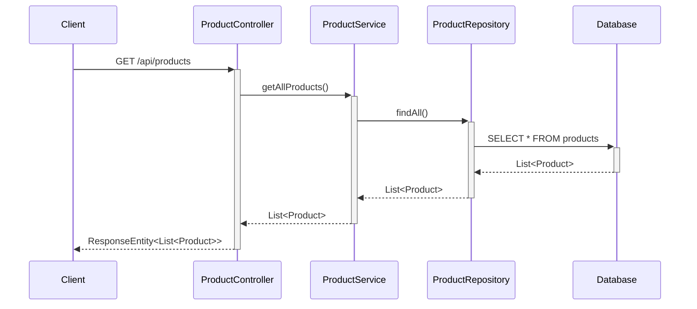

### 3.2 Get Product By ID

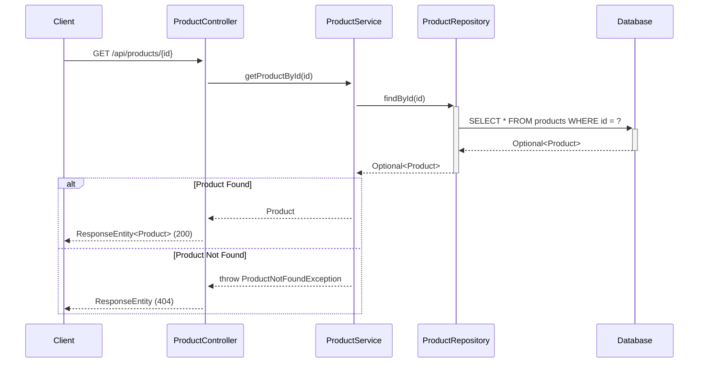

### 3.3 Create Product

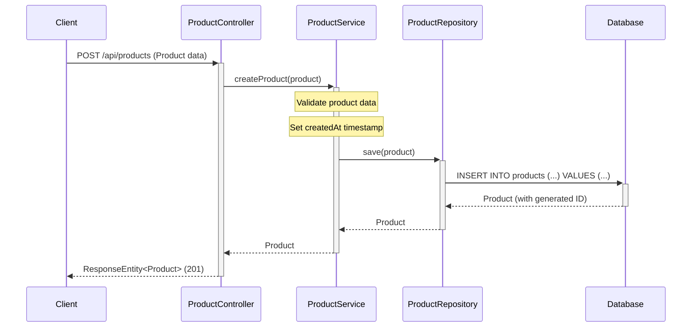

### 3.4 Update Product

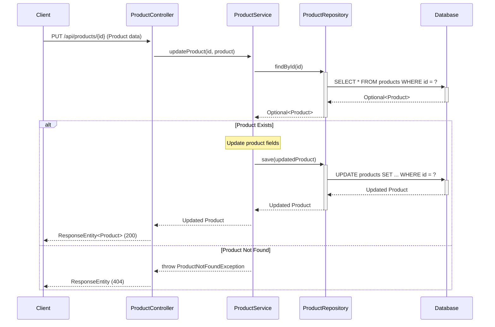

### 3.5 Delete Product

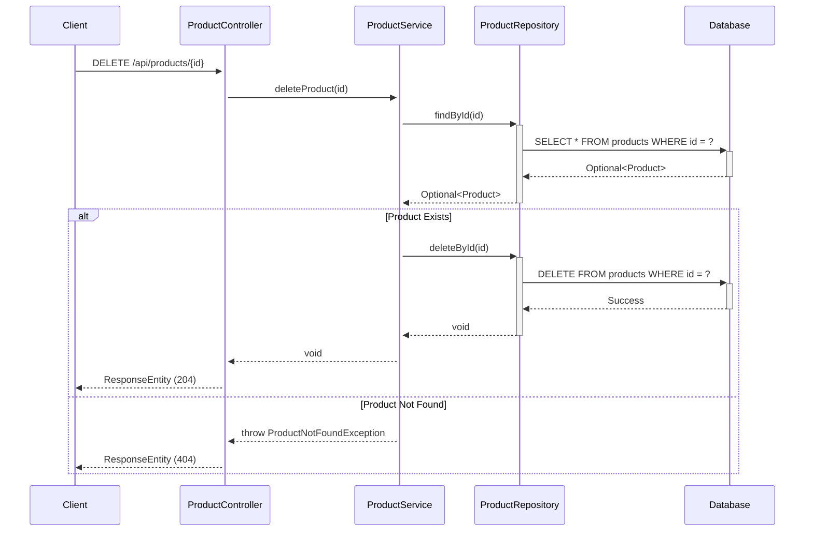

### 3.6 Get Products By Category

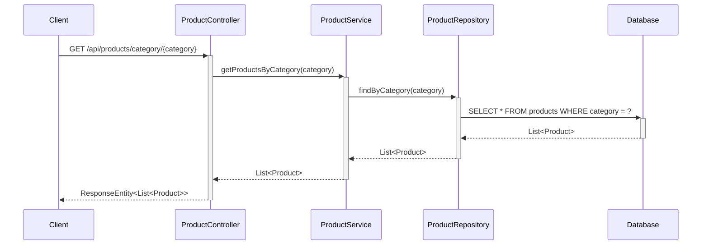

### 3.7 Search Products

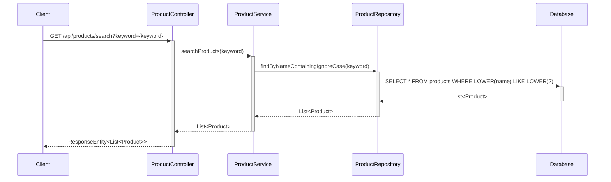

### 3.8 Add Product to Cart

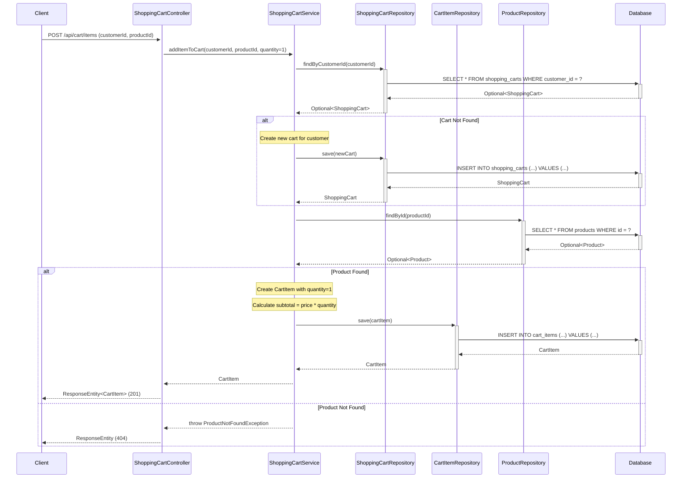

### 3.9 View Shopping Cart

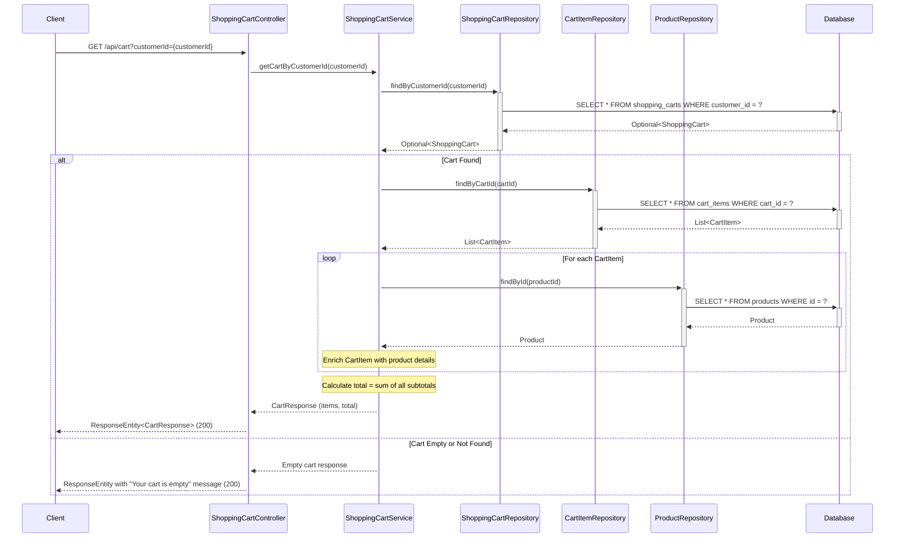

### 3.10 Update Cart Item Quantity

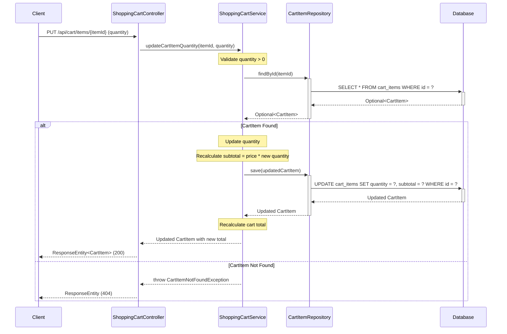

### 3.11 Remove Cart Item

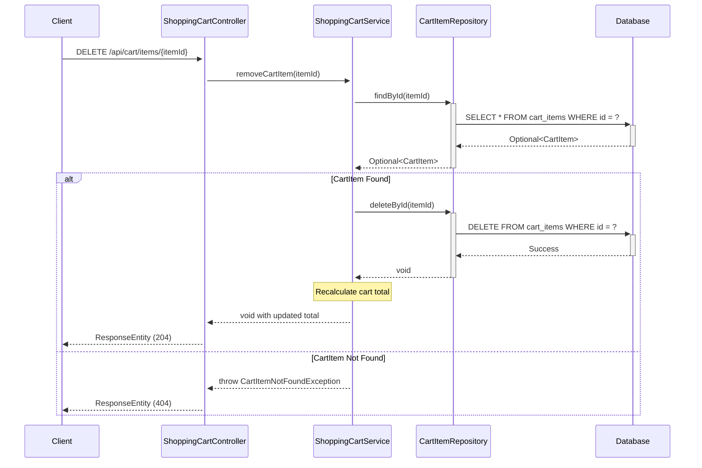

## 4. API Endpoints Summary

| Method | Endpoint | Description | Request Body | Response |
|--------|----------|-------------|--------------|----------|
| GET | `/api/products` | Get all products | None | List<Product> |
| GET | `/api/products/{id}` | Get product by ID | None | Product |
| POST | `/api/products` | Create new product | Product | Product |
| PUT | `/api/products/{id}` | Update existing product | Product | Product |
| DELETE | `/api/products/{id}` | Delete product | None | None |
| GET | `/api/products/category/{category}` | Get products by category | None | List<Product> |
| GET | `/api/products/search?keyword={keyword}` | Search products by name | None | List<Product> |
| POST | `/api/cart/items` | Add product to cart with default quantity 1 | {customerId, productId} | CartItem |
| GET | `/api/cart?customerId={customerId}` | View all items in customer's cart with totals | None | CartResponse |
| PUT | `/api/cart/items/{itemId}` | Update cart item quantity with automatic recalculation | {quantity} | CartItem |
| DELETE | `/api/cart/items/{itemId}` | Remove item from cart with total recalculation | None | None |

## 5. Database Schema

### Products Table

```sql
CREATE TABLE products (
    id BIGINT PRIMARY KEY AUTO_INCREMENT,
    name VARCHAR(255) NOT NULL,
    description TEXT,
    price DECIMAL(10,2) NOT NULL,
    category VARCHAR(100) NOT NULL,
    stock_quantity INTEGER NOT NULL DEFAULT 0,
    created_at TIMESTAMP NOT NULL DEFAULT CURRENT_TIMESTAMP
);

CREATE INDEX idx_products_category ON products(category);
CREATE INDEX idx_products_name ON products(name);
```

### Shopping Carts Table

```sql
CREATE TABLE shopping_carts (
    id BIGINT PRIMARY KEY AUTO_INCREMENT,
    customer_id BIGINT NOT NULL,
    created_at TIMESTAMP NOT NULL DEFAULT CURRENT_TIMESTAMP,
    updated_at TIMESTAMP NOT NULL DEFAULT CURRENT_TIMESTAMP ON UPDATE CURRENT_TIMESTAMP,
    status VARCHAR(50) NOT NULL DEFAULT 'ACTIVE',
    UNIQUE KEY uk_customer_active_cart (customer_id, status)
);

CREATE INDEX idx_shopping_carts_customer ON shopping_carts(customer_id);
```

### Cart Items Table

```sql
CREATE TABLE cart_items (
    id BIGINT PRIMARY KEY AUTO_INCREMENT,
    cart_id BIGINT NOT NULL,
    product_id BIGINT NOT NULL,
    quantity INTEGER NOT NULL DEFAULT 1,
    price DECIMAL(10,2) NOT NULL,
    subtotal DECIMAL(10,2) NOT NULL,
    FOREIGN KEY (cart_id) REFERENCES shopping_carts(id) ON DELETE CASCADE,
    FOREIGN KEY (product_id) REFERENCES products(id) ON DELETE CASCADE,
    UNIQUE KEY uk_cart_product (cart_id, product_id)
);

CREATE INDEX idx_cart_items_cart ON cart_items(cart_id);
CREATE INDEX idx_cart_items_product ON cart_items(product_id);
```

## 6. Technology Stack

- **Backend Framework:** Spring Boot 3.x
- **Language:** Java 21
- **Database:** PostgreSQL
- **ORM:** Spring Data JPA / Hibernate
- **Build Tool:** Maven/Gradle
- **API Documentation:** Swagger/OpenAPI 3

## 7. Design Patterns Used

1. **MVC Pattern:** Separation of Controller, Service, and Repository layers
2. **Repository Pattern:** Data access abstraction through ProductRepository
3. **Dependency Injection:** Spring's IoC container manages dependencies
4. **DTO Pattern:** Data Transfer Objects for API requests/responses
5. **Exception Handling:** Custom exceptions for business logic errors

## 8. Key Features

- RESTful API design following HTTP standards
- Proper HTTP status codes for different scenarios
- Input validation and error handling
- Database indexing for performance optimization
- Transactional operations for data consistency
- Pagination support for large datasets (can be extended)
- Search functionality with case-insensitive matching

## 9. Business Logic

### 9.1 Shopping Cart Management

#### Automatic Calculation Logic
- **Subtotal Calculation:** For each cart item, subtotal = price × quantity
- **Cart Total Calculation:** Cart total = sum of all cart item subtotals
- **Automatic Recalculation:** Whenever quantity is updated or item is removed, subtotal and total are automatically recalculated

#### Empty Cart Handling
- When a customer's cart has no items, the system displays: "Your cart is empty"
- A link to continue shopping is provided to redirect users back to the product catalog
- Empty cart state is handled gracefully without errors

## 10. Validation Rules

### Shopping Cart Validation
- **Quantity Validation:** Quantity must be a positive integer (> 0)
- **Product Existence:** Product must exist in the products table before adding to cart
- **Cart Item Ownership:** Cart item must belong to the requesting customer
- **Duplicate Prevention:** Same product cannot be added twice to the same cart (quantity is updated instead)
- **Stock Validation:** Requested quantity should not exceed available stock (optional enhancement)

## 11. Error Handling

### Product Management Errors
- **ProductNotFoundException:** Thrown when product ID does not exist (HTTP 404)
- **InvalidProductDataException:** Thrown when product data validation fails (HTTP 400)

### Shopping Cart Errors
- **CartNotFoundException:** Thrown when cart ID does not exist (HTTP 404)
- **CartItemNotFoundException:** Thrown when cart item ID does not exist (HTTP 404)
- **InvalidQuantityException:** Thrown when quantity is zero or negative (HTTP 400)
- **ProductNotAvailableException:** Thrown when product is out of stock (HTTP 400)
- **UnauthorizedCartAccessException:** Thrown when user tries to access another customer's cart (HTTP 403)