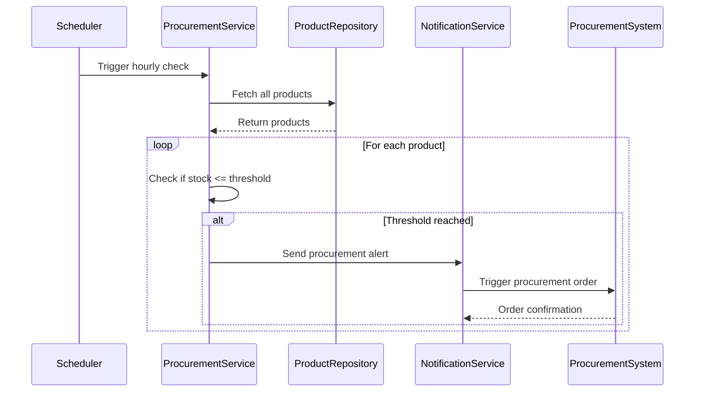

## 6. Service Layer Design

### 6.1 ProductService

```java
package com.ecommerce.productmanagement.service;

import com.ecommerce.productmanagement.entity.Product;
import com.ecommerce.productmanagement.exception.ProductNotFoundException;
import com.ecommerce.productmanagement.repository.ProductRepository;
import lombok.RequiredArgsConstructor;
import lombok.extern.slf4j.Slf4j;
import org.springframework.data.domain.Page;
import org.springframework.data.domain.Pageable;
import org.springframework.stereotype.Service;
import org.springframework.transaction.annotation.Transactional;

import java.util.List;

@Service
@RequiredArgsConstructor
@Slf4j
public class ProductService {
    
    private final ProductRepository productRepository;
    
    @Transactional(readOnly = true)
    public Page<Product> getAllProducts(Pageable pageable) {
        log.info("Fetching all products with pagination: {}", pageable);
        return productRepository.findByActiveTrue(pageable);
    }
    
    @Transactional(readOnly = true)
    public Product getProductById(Long id) {
        log.info("Fetching product by id: {}", id);
        return productRepository.findById(id)
                .orElseThrow(() -> new ProductNotFoundException("Product not found with id: " + id));
    }
    
    @Transactional(readOnly = true)
    public List<Product> getProductsByCategory(String category) {
        log.info("Fetching products by category: {}", category);
        return productRepository.findByCategoryAndActiveTrue(category);
    }
    
    @Transactional
    public Product createProduct(Product product) {
        log.info("Creating new product: {}", product.getName());
        return productRepository.save(product);
    }
    
    @Transactional
    public Product updateProduct(Long id, Product productDetails) {
        log.info("Updating product with id: {}", id);
        Product product = getProductById(id);
        
        product.setName(productDetails.getName());
        product.setDescription(productDetails.getDescription());
        product.setPrice(productDetails.getPrice());
        product.setStockQuantity(productDetails.getStockQuantity());
        product.setMinimumProcurementThreshold(productDetails.getMinimumProcurementThreshold());
        product.setProcurementQuantity(productDetails.getProcurementQuantity());
        product.setCategory(productDetails.getCategory());
        product.setActive(productDetails.getActive());
        
        return productRepository.save(product);
    }
    
    @Transactional
    public void deleteProduct(Long id) {
        log.info("Deleting product with id: {}", id);
        Product product = getProductById(id);
        product.setActive(false);
        productRepository.save(product);
    }
    
    @Transactional
    public boolean checkStockAvailability(Long productId, int quantity) {
        Product product = getProductById(productId);
        return product.canFulfillQuantity(quantity);
    }
}
```

### 6.2 CartService

```java
package com.ecommerce.productmanagement.service;

import com.ecommerce.productmanagement.dto.request.AddToCartRequest;
import com.ecommerce.productmanagement.entity.Cart;
import com.ecommerce.productmanagement.entity.CartItem;
import com.ecommerce.productmanagement.entity.Product;
import com.ecommerce.productmanagement.exception.InsufficientStockException;
import com.ecommerce.productmanagement.exception.ProductNotFoundException;
import com.ecommerce.productmanagement.repository.CartRepository;
import com.ecommerce.productmanagement.repository.CartItemRepository;
import lombok.RequiredArgsConstructor;
import lombok.extern.slf4j.Slf4j;
import org.springframework.stereotype.Service;
import org.springframework.transaction.annotation.Transactional;

import java.util.Optional;

@Service
@RequiredArgsConstructor
@Slf4j
public class CartService {
    
    private final CartRepository cartRepository;
    private final CartItemRepository cartItemRepository;
    private final ProductService productService;
    
    @Transactional
    public Cart getOrCreateCart(String sessionId) {
        log.info("Getting or creating cart for session: {}", sessionId);
        return cartRepository.findBySessionId(sessionId)
                .orElseGet(() -> {
                    Cart newCart = new Cart();
                    newCart.setSessionId(sessionId);
                    return cartRepository.save(newCart);
                });
    }
    
    @Transactional
    public Cart addToCart(String sessionId, AddToCartRequest request) {
        log.info("Adding product {} to cart for session: {}", request.getProductId(), sessionId);
        
        Cart cart = getOrCreateCart(sessionId);
        Product product = productService.getProductById(request.getProductId());
        
        // Real-time inventory validation
        if (!product.isAvailable()) {
            throw new ProductNotFoundException("Product is not available: " + product.getName());
        }
        
        // Validate stock availability in real-time
        if (!product.canFulfillQuantity(request.getQuantity())) {
            throw new InsufficientStockException(
                String.format("Insufficient stock for product %s. Available: %d, Requested: %d",
                    product.getName(), product.getStockQuantity(), request.getQuantity())
            );
        }
        
        // Check if product already exists in cart
        Optional<CartItem> existingItem = cart.getItems().stream()
                .filter(item -> item.getProduct().getId().equals(request.getProductId()))
                .findFirst();
        
        if (existingItem.isPresent()) {
            CartItem item = existingItem.get();
            int newQuantity = item.getQuantity() + request.getQuantity();
            
            // Validate total quantity against current stock
            if (!product.canFulfillQuantity(newQuantity)) {
                throw new InsufficientStockException(
                    String.format("Cannot add %d more items. Current cart quantity: %d, Available stock: %d",
                        request.getQuantity(), item.getQuantity(), product.getStockQuantity())
                );
            }
            
            item.setQuantity(newQuantity);
            cartItemRepository.save(item);
        } else {
            CartItem newItem = new CartItem();
            newItem.setProduct(product);
            newItem.setQuantity(request.getQuantity());
            cart.addItem(newItem);
            cartItemRepository.save(newItem);
        }
        
        return cartRepository.save(cart);
    }
    
    @Transactional
    public Cart updateCartItemQuantity(String sessionId, Long productId, int quantity) {
        log.info("Updating cart item quantity for session: {}, product: {}, quantity: {}", 
                 sessionId, productId, quantity);
        
        Cart cart = getOrCreateCart(sessionId);
        Product product = productService.getProductById(productId);
        
        // Real-time inventory validation
        if (!product.canFulfillQuantity(quantity)) {
            throw new InsufficientStockException(
                String.format("Insufficient stock for product %s. Available: %d, Requested: %d",
                    product.getName(), product.getStockQuantity(), quantity)
            );
        }
        
        CartItem item = cart.getItems().stream()
                .filter(ci -> ci.getProduct().getId().equals(productId))
                .findFirst()
                .orElseThrow(() -> new ProductNotFoundException("Product not found in cart"));
        
        if (quantity <= 0) {
            cart.removeItem(item);
            cartItemRepository.delete(item);
        } else {
            item.setQuantity(quantity);
            cartItemRepository.save(item);
        }
        
        return cartRepository.save(cart);
    }
    
    @Transactional
    public Cart removeFromCart(String sessionId, Long productId) {
        log.info("Removing product {} from cart for session: {}", productId, sessionId);
        
        Cart cart = getOrCreateCart(sessionId);
        CartItem item = cart.getItems().stream()
                .filter(ci -> ci.getProduct().getId().equals(productId))
                .findFirst()
                .orElseThrow(() -> new ProductNotFoundException("Product not found in cart"));
        
        cart.removeItem(item);
        cartItemRepository.delete(item);
        
        return cartRepository.save(cart);
    }
    
    @Transactional
    public void clearCart(String sessionId) {
        log.info("Clearing cart for session: {}", sessionId);
        cartRepository.findBySessionId(sessionId)
                .ifPresent(cart -> {
                    cart.getItems().clear();
                    cartRepository.save(cart);
                });
    }
    
    @Transactional(readOnly = true)
    public Cart getCart(String sessionId) {
        log.info("Fetching cart for session: {}", sessionId);
        return getOrCreateCart(sessionId);
    }
    
    @Transactional(readOnly = true)
    public boolean validateCartInventory(String sessionId) {
        log.info("Validating cart inventory for session: {}", sessionId);
        Cart cart = getOrCreateCart(sessionId);
        
        for (CartItem item : cart.getItems()) {
            Product product = item.getProduct();
            if (!product.isAvailable() || !product.canFulfillQuantity(item.getQuantity())) {
                return false;
            }
        }
        return true;
    }
}
```

### 6.3 OrderService

```java
package com.ecommerce.productmanagement.service;

import com.ecommerce.productmanagement.entity.*;
import com.ecommerce.productmanagement.exception.InsufficientStockException;
import com.ecommerce.productmanagement.repository.OrderRepository;
import com.ecommerce.productmanagement.repository.ProductRepository;
import lombok.RequiredArgsConstructor;
import lombok.extern.slf4j.Slf4j;
import org.springframework.stereotype.Service;
import org.springframework.transaction.annotation.Transactional;

import java.math.BigDecimal;
import java.util.UUID;

@Service
@RequiredArgsConstructor
@Slf4j
public class OrderService {
    
    private final OrderRepository orderRepository;
    private final CartService cartService;
    private final ProductRepository productRepository;
    
    @Transactional
    public Order createOrder(String sessionId) {
        log.info("Creating order for session: {}", sessionId);
        
        Cart cart = cartService.getCart(sessionId);
        
        if (cart.getItems().isEmpty()) {
            throw new IllegalStateException("Cannot create order from empty cart");
        }
        
        // Validate inventory and reserve stock
        for (CartItem cartItem : cart.getItems()) {
            Product product = cartItem.getProduct();
            
            if (!product.canFulfillQuantity(cartItem.getQuantity())) {
                throw new InsufficientStockException(
                    String.format("Insufficient stock for product: %s", product.getName())
                );
            }
            
            // Deduct stock
            product.setStockQuantity(product.getStockQuantity() - cartItem.getQuantity());
            productRepository.save(product);
        }
        
        // Create order
        Order order = new Order();
        order.setOrderNumber(generateOrderNumber());
        order.setSessionId(sessionId);
        order.setStatus(Order.OrderStatus.PENDING);
        
        BigDecimal totalAmount = BigDecimal.ZERO;
        
        for (CartItem cartItem : cart.getItems()) {
            OrderItem orderItem = new OrderItem();
            orderItem.setOrder(order);
            orderItem.setProduct(cartItem.getProduct());
            orderItem.setQuantity(cartItem.getQuantity());
            orderItem.setPrice(cartItem.getProduct().getPrice());
            
            order.getItems().add(orderItem);
            
            totalAmount = totalAmount.add(
                cartItem.getProduct().getPrice()
                    .multiply(BigDecimal.valueOf(cartItem.getQuantity()))
            );
        }
        
        order.setTotalAmount(totalAmount);
        Order savedOrder = orderRepository.save(order);
        
        // Clear cart after successful order
        cartService.clearCart(sessionId);
        
        log.info("Order created successfully: {}", savedOrder.getOrderNumber());
        return savedOrder;
    }
    
    private String generateOrderNumber() {
        return "ORD-" + UUID.randomUUID().toString().substring(0, 8).toUpperCase();
    }
}
```

## 7. Minimum Procurement Threshold Logic

### 7.1 Threshold Management

```java
package com.ecommerce.productmanagement.service;

import com.ecommerce.productmanagement.entity.Product;
import com.ecommerce.productmanagement.repository.ProductRepository;
import lombok.RequiredArgsConstructor;
import lombok.extern.slf4j.Slf4j;
import org.springframework.scheduling.annotation.Scheduled;
import org.springframework.stereotype.Service;
import org.springframework.transaction.annotation.Transactional;

import java.util.List;

@Service
@RequiredArgsConstructor
@Slf4j
public class ProcurementService {
    
    private final ProductRepository productRepository;
    private final NotificationService notificationService;
    
    @Transactional(readOnly = true)
    @Scheduled(cron = "0 0 * * * *") // Run every hour
    public void checkProcurementThresholds() {
        log.info("Checking procurement thresholds for all products");
        
        List<Product> products = productRepository.findAll();
        
        for (Product product : products) {
            if (product.hasReachedProcurementThreshold()) {
                log.warn("Product {} has reached procurement threshold. Current stock: {}, Threshold: {}",
                    product.getName(), product.getStockQuantity(), product.getMinimumProcurementThreshold());
                
                notificationService.sendProcurementAlert(product);
            }
        }
    }
    
    @Transactional
    public void triggerProcurement(Long productId) {
        log.info("Triggering procurement for product: {}", productId);
        
        Product product = productRepository.findById(productId)
            .orElseThrow(() -> new IllegalArgumentException("Product not found"));
        
        if (product.hasReachedProcurementThreshold()) {
            // Logic to trigger procurement order
            int procurementQuantity = product.getProcurementQuantity();
            log.info("Procurement order initiated for {} units of product: {}", 
                procurementQuantity, product.getName());
            
            notificationService.sendProcurementOrderNotification(product, procurementQuantity);
        }
    }
    
    @Transactional
    public void updateProcurementThreshold(Long productId, int newThreshold, int newProcurementQuantity) {
        log.info("Updating procurement threshold for product: {}", productId);
        
        Product product = productRepository.findById(productId)
            .orElseThrow(() -> new IllegalArgumentException("Product not found"));
        
        product.setMinimumProcurementThreshold(newThreshold);
        product.setProcurementQuantity(newProcurementQuantity);
        
        productRepository.save(product);
        log.info("Procurement threshold updated successfully");
    }
}
```

### 7.2 Threshold Monitoring Flow


