## 3. Sequence Diagrams

### 3.1 Get All Products

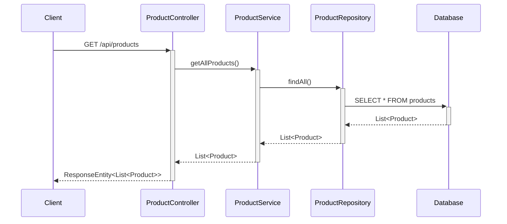

### 3.2 Get Product By ID

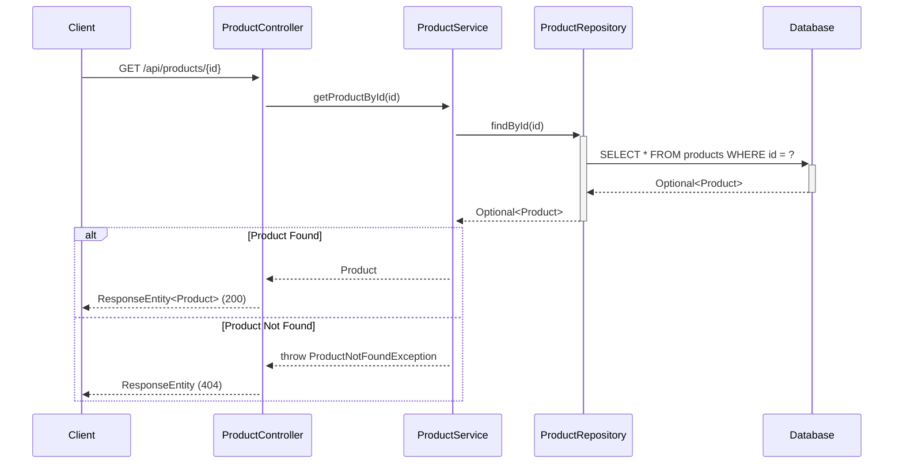

### 3.3 Create Product

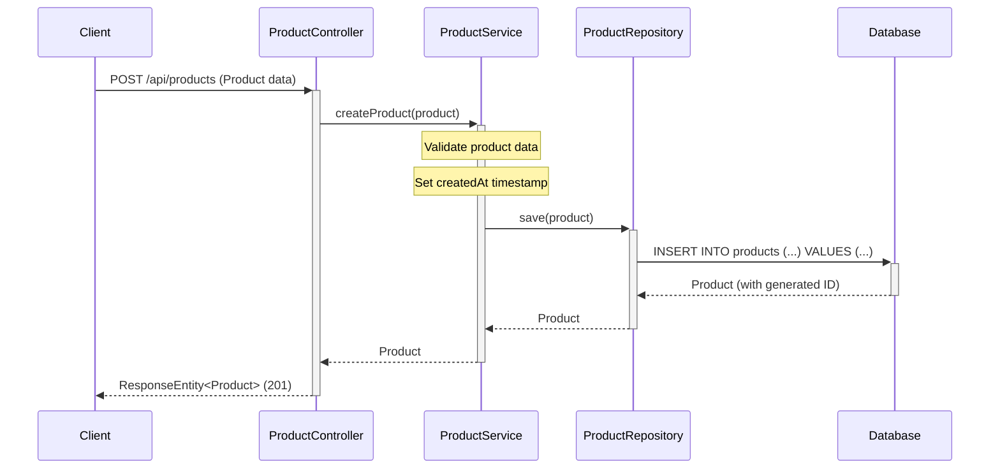

### 3.4 Update Product

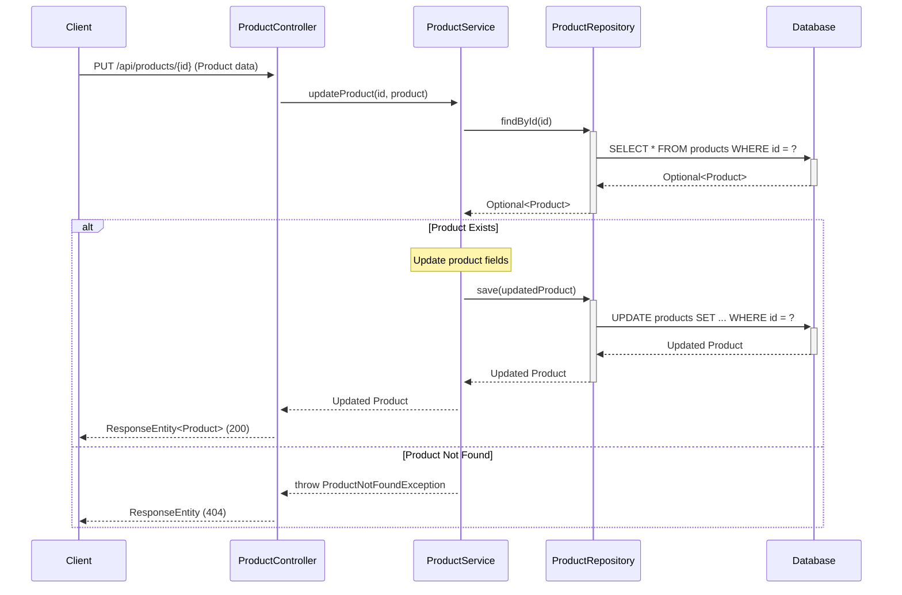

### 3.5 Delete Product

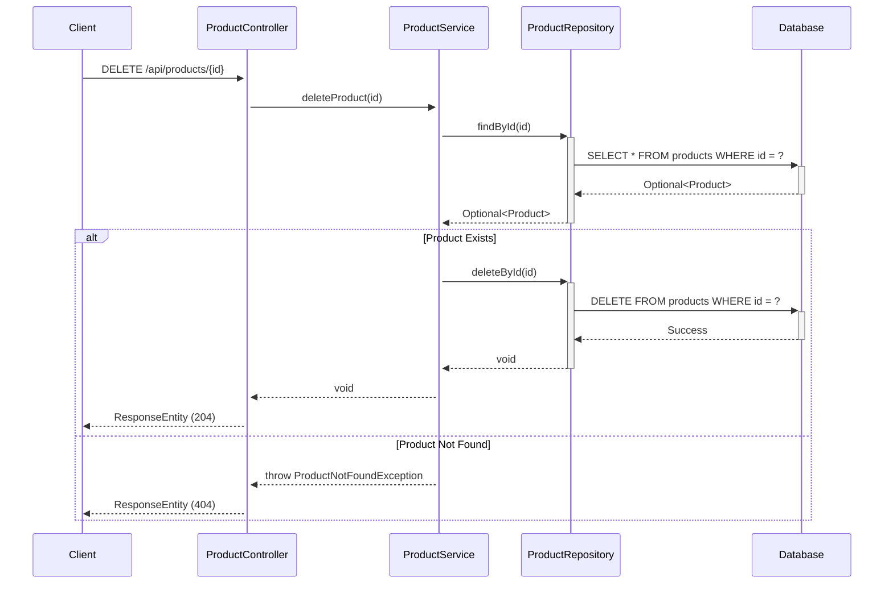

### 3.6 Get Products By Category

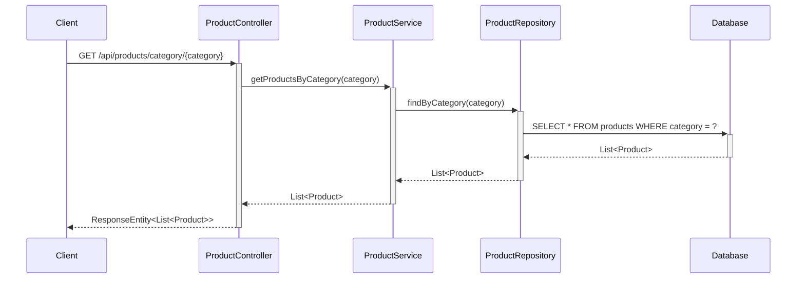

### 3.7 Search Products

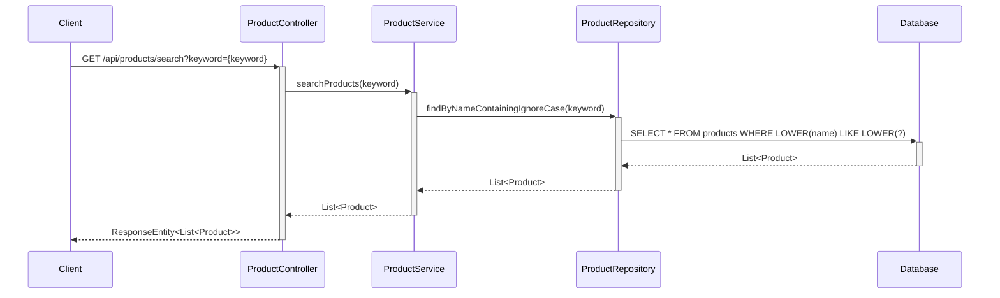

### 3.8 Add Item to Shopping Cart

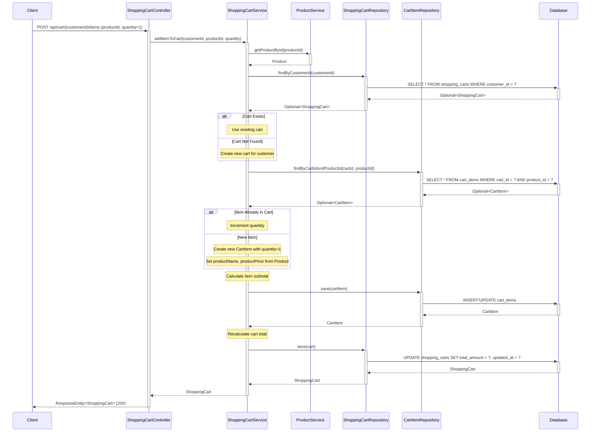

### 3.9 Update Cart Item Quantity

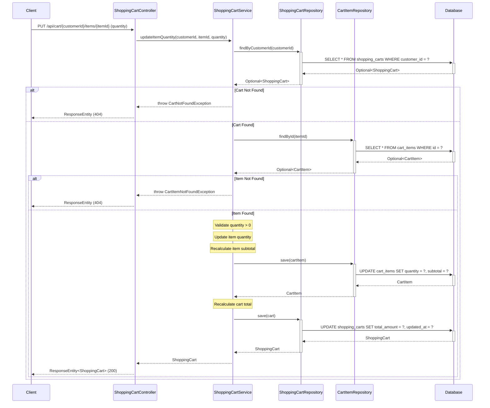

### 3.10 Remove Item from Shopping Cart

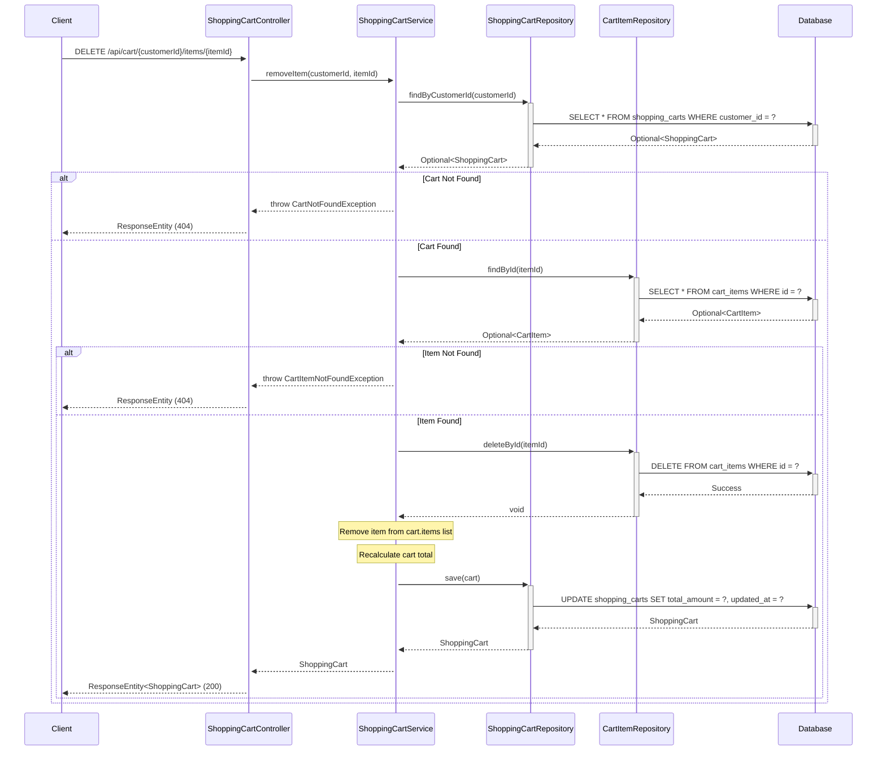

### 3.11 Get Shopping Cart with Empty State Handling

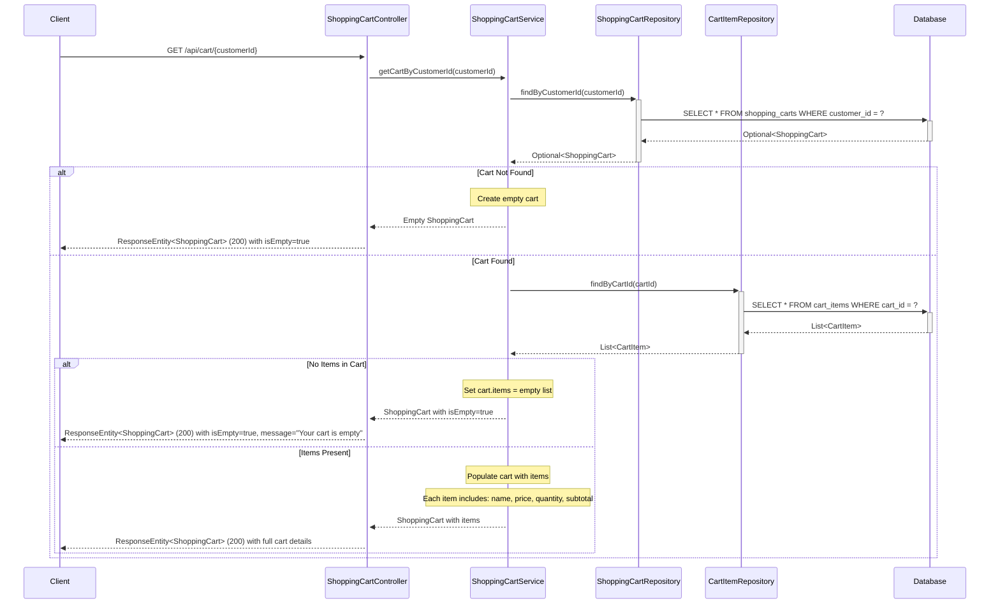

## 4. API Endpoints Summary

| Method | Endpoint | Description | Request Body | Response |
|--------|----------|-------------|--------------|----------|
| GET | `/api/products` | Get all products | None | List<Product> |
| GET | `/api/products/{id}` | Get product by ID | None | Product |
| POST | `/api/products` | Create new product | Product | Product |
| PUT | `/api/products/{id}` | Update existing product | Product | Product |
| DELETE | `/api/products/{id}` | Delete product | None | None |
| GET | `/api/products/category/{category}` | Get products by category | None | List<Product> |
| GET | `/api/products/search?keyword={keyword}` | Search products by name | None | List<Product> |

## 4.1 Shopping Cart API Endpoints

| Method | Endpoint | Description | Request Body | Response |
|--------|----------|-------------|--------------|----------|
| GET | `/api/cart/{customerId}` | Get shopping cart for customer (handles empty state) | None | ShoppingCart |
| POST | `/api/cart/{customerId}/items` | Add item to cart (quantity defaults to 1) | CartItemRequest (productId, quantity) | ShoppingCart |
| PUT | `/api/cart/{customerId}/items/{itemId}` | Update item quantity with automatic recalculation | QuantityUpdateRequest (quantity) | ShoppingCart |
| DELETE | `/api/cart/{customerId}/items/{itemId}` | Remove item from cart with total recalculation | None | ShoppingCart |
| DELETE | `/api/cart/{customerId}` | Clear entire cart | None | None |

### 4.2 Shopping Cart Request/Response Models

**CartItemRequest:**
```json
{
  "productId": 1,
  "quantity": 1
}
```

**QuantityUpdateRequest:**
```json
{
  "quantity": 3
}
```

**ShoppingCart Response:**
```json
{
  "id": 1,
  "customerId": 123,
  "items": [
    {
      "id": 1,
      "productId": 10,
      "productName": "Product Name",
      "productPrice": 29.99,
      "quantity": 2,
      "subtotal": 59.98
    }
  ],
  "totalAmount": 59.98,
  "updatedAt": "2024-01-15T10:30:00",
  "isEmpty": false
}
```

**Empty Cart Response:**
```json
{
  "id": null,
  "customerId": 123,
  "items": [],
  "totalAmount": 0.00,
  "updatedAt": null,
  "isEmpty": true,
  "message": "Your cart is empty"
}
```
