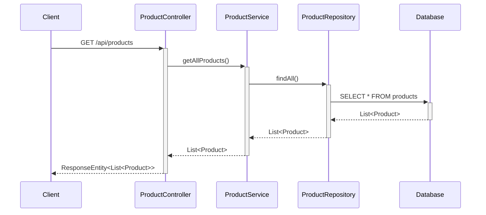
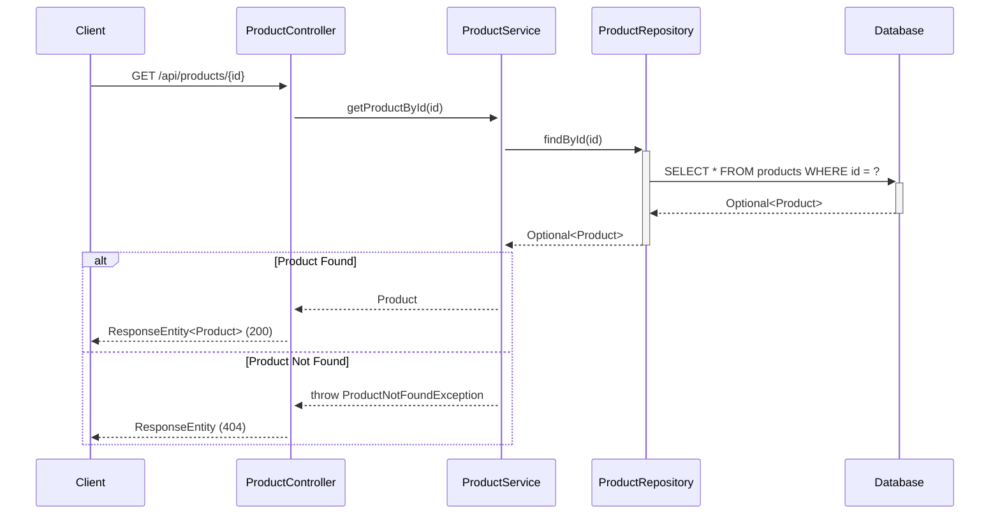
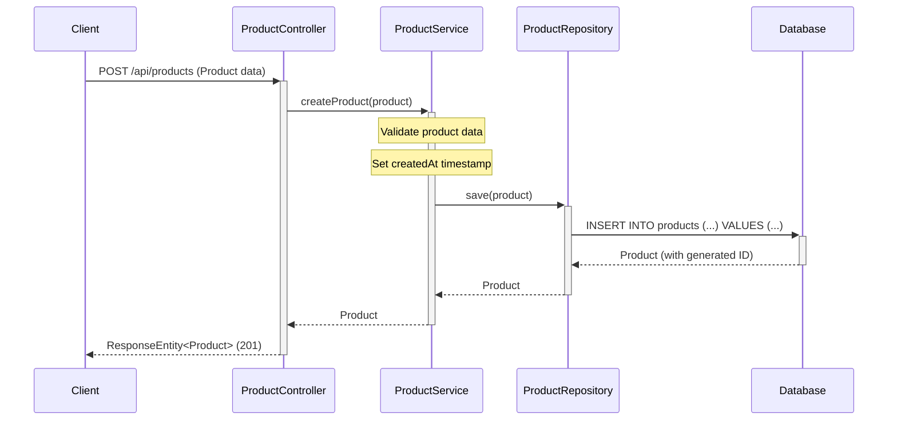
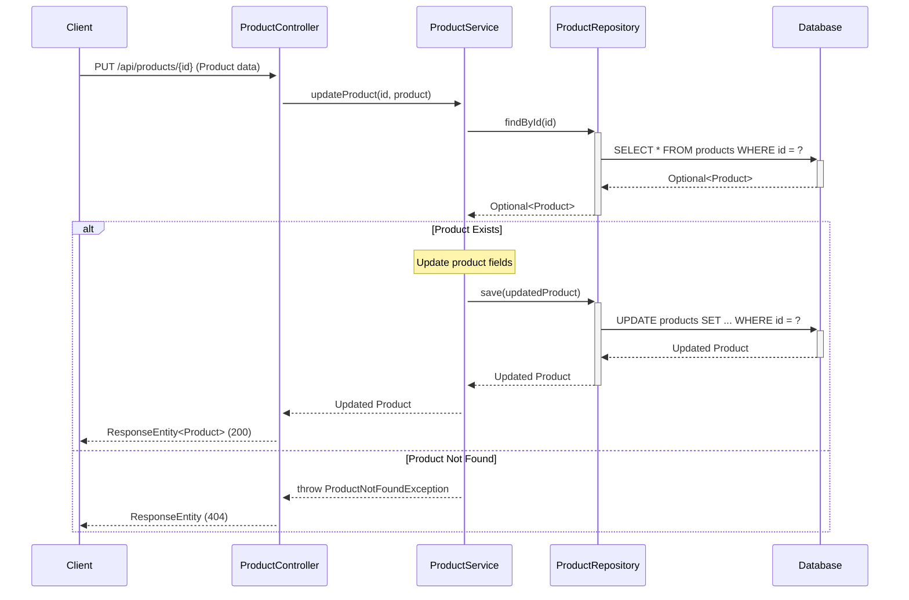
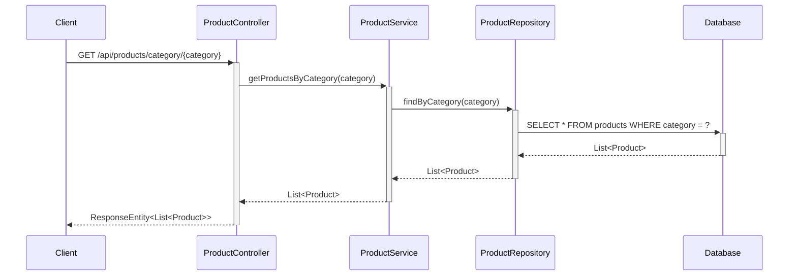
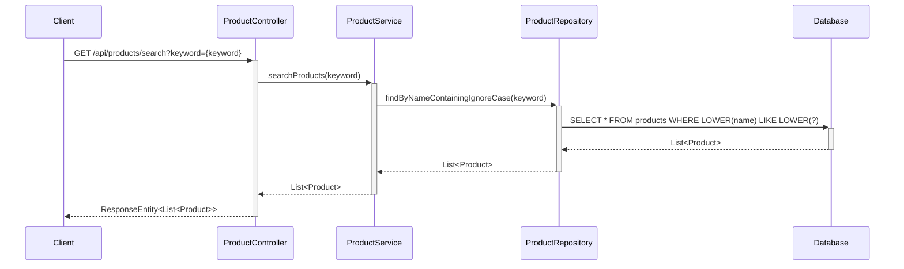
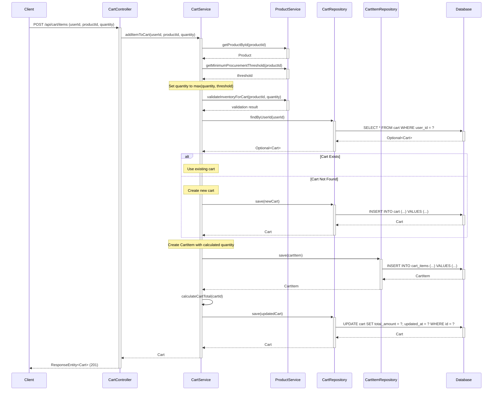
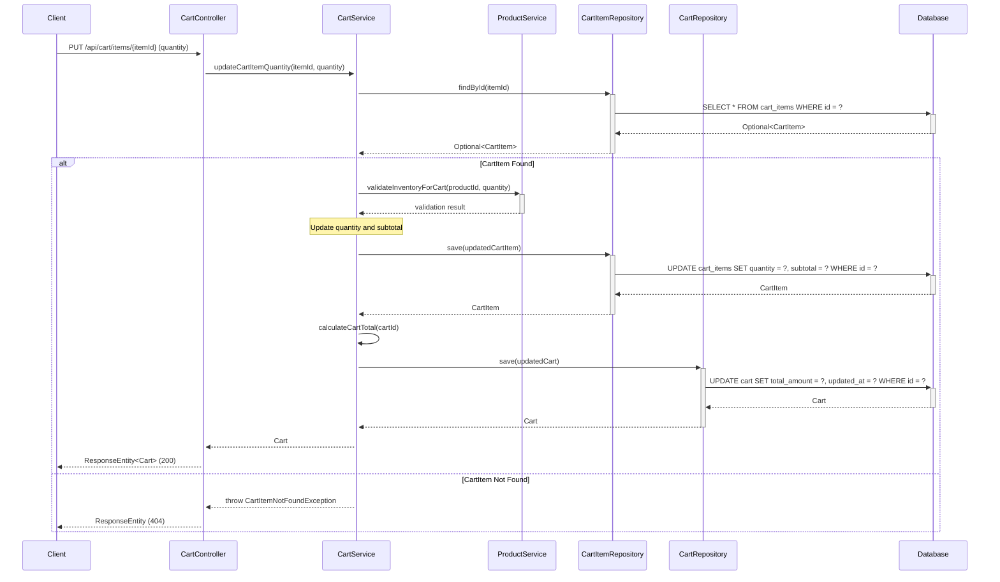
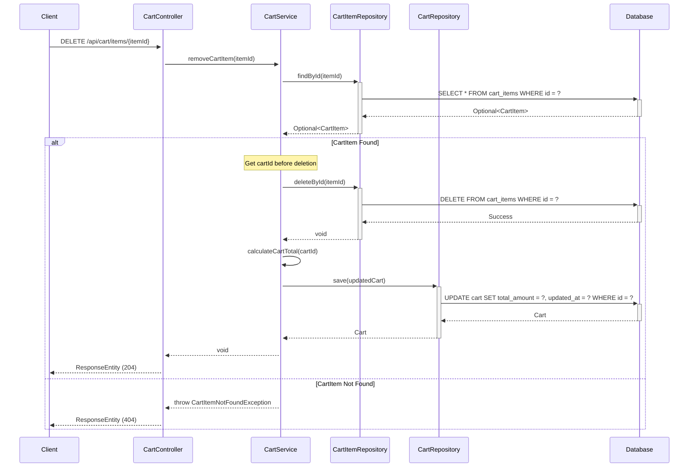
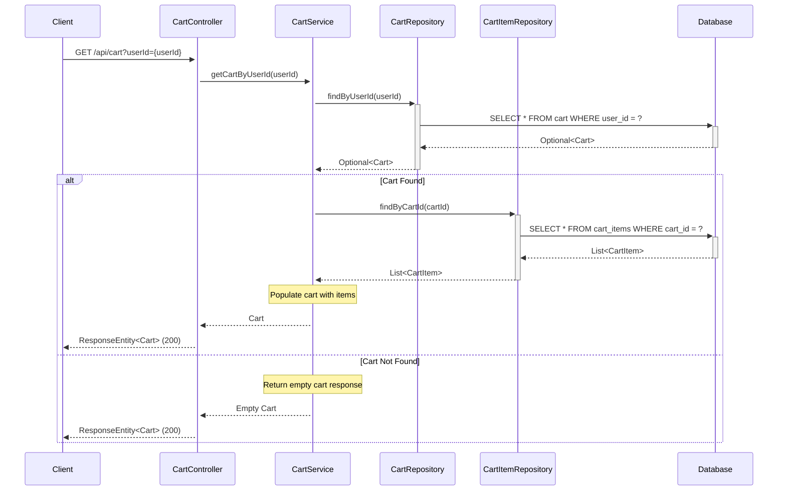

## 3. Sequence Diagrams

### 3.1 Get All Products



### 3.2 Get Product By ID



### 3.3 Create Product



### 3.4 Update Product



### 3.5 Delete Product

```mermaid
sequenceDiagram
    participant Client
    participant ProductController
    participant ProductService
    participant ProductRepository
    participant Database
    
    Client->>+ProductController: DELETE /api/products/{id}
    ProductController->>+ProductService: deleteProduct(id)
    
    ProductService->>+ProductRepository: findById(id)
    ProductRepository->>+Database: SELECT * FROM products WHERE id = ?
    Database-->>-ProductRepository: Optional<Product>
    ProductRepository-->>-ProductService: Optional<Product>
    
    alt Product Exists
        ProductService->>+ProductRepository: deleteById(id)
        ProductRepository->>+Database: DELETE FROM products WHERE id = ?
        Database-->>-ProductRepository: Success
        Repository-->>-ProductService: void
        ProductService-->>ProductController: void
        ProductController-->>Client: ResponseEntity (204)
    else Product Not Found
        ProductService-->>ProductController: throw ProductNotFoundException
        ProductController-->>Client: ResponseEntity (404)
    end
```

### 3.6 Get Products By Category



### 3.7 Search Products



### 3.8 Add Item to Cart



### 3.9 Update Cart Item Quantity



### 3.10 Remove Cart Item



### 3.11 Get Cart



## 4. API Endpoints Summary

| Method | Endpoint | Description | Request Body | Response |
|--------|----------|-------------|--------------|----------|
| GET | `/api/products` | Get all products | None | List<Product> |
| GET | `/api/products/{id}` | Get product by ID | None | Product |
| POST | `/api/products` | Create new product | Product | Product |
| PUT | `/api/products/{id}` | Update existing product | Product | Product |
| DELETE | `/api/products/{id}` | Delete product | None | None |
| GET | `/api/products/category/{category}` | Get products by category | None | List<Product> |
| GET | `/api/products/search?keyword={keyword}` | Search products by name | None | List<Product> |
| POST | `/api/cart/items` | Add item to cart | CartItemRequest | Cart |
| GET | `/api/cart?userId={userId}` | Get user's cart | None | Cart |
| PUT | `/api/cart/items/{itemId}` | Update cart item quantity | QuantityUpdateRequest | Cart |
| DELETE | `/api/cart/items/{itemId}` | Remove item from cart | None | None |

## 5. Database Schema

### Products Table

```sql
CREATE TABLE products (
    id BIGINT PRIMARY KEY AUTO_INCREMENT,
    name VARCHAR(255) NOT NULL,
    description TEXT,
    price DECIMAL(10,2) NOT NULL,
    category VARCHAR(100) NOT NULL,
    stock_quantity INTEGER NOT NULL DEFAULT 0,
    minimum_procurement_threshold INTEGER,
    is_subscription_eligible BOOLEAN NOT NULL DEFAULT FALSE,
    created_at TIMESTAMP NOT NULL DEFAULT CURRENT_TIMESTAMP
);

CREATE INDEX idx_products_category ON products(category);
CREATE INDEX idx_products_name ON products(name);
```

### Cart Table

```sql
CREATE TABLE cart (
    id BIGINT PRIMARY KEY AUTO_INCREMENT,
    user_id BIGINT NOT NULL UNIQUE,
    total_amount DECIMAL(10,2) NOT NULL DEFAULT 0.00,
    created_at TIMESTAMP NOT NULL DEFAULT CURRENT_TIMESTAMP,
    updated_at TIMESTAMP NOT NULL DEFAULT CURRENT_TIMESTAMP ON UPDATE CURRENT_TIMESTAMP
);

CREATE INDEX idx_cart_user_id ON cart(user_id);
```

### Cart Items Table

```sql
CREATE TABLE cart_items (
    id BIGINT PRIMARY KEY AUTO_INCREMENT,
    cart_id BIGINT NOT NULL,
    product_id BIGINT NOT NULL,
    quantity INTEGER NOT NULL DEFAULT 1,
    unit_price DECIMAL(10,2) NOT NULL,
    subtotal DECIMAL(10,2) NOT NULL,
    is_subscription BOOLEAN NOT NULL DEFAULT FALSE,
    FOREIGN KEY (cart_id) REFERENCES cart(id) ON DELETE CASCADE,
    FOREIGN KEY (product_id) REFERENCES products(id) ON DELETE CASCADE
);

CREATE INDEX idx_cart_items_cart_id ON cart_items(cart_id);
CREATE INDEX idx_cart_items_product_id ON cart_items(product_id);
```

## 6. Business Logic

### 6.1 Minimum Procurement Threshold Logic

When adding a product to the cart, the system applies the following business rules:

1. **Threshold Application:**
   - If a product has a `minimum_procurement_threshold` defined, the system automatically sets the cart item quantity to this threshold value when the user adds the product
   - If the user manually specifies a quantity greater than the threshold, the user-specified quantity is used
   - If the user specifies a quantity less than the threshold, the system overrides it with the threshold value

2. **Subscription vs One-Time Purchase:**
   - Products marked as `is_subscription_eligible = true` can be added as subscription items
   - Subscription items may have different minimum procurement thresholds
   - The `is_subscription` flag in `cart_items` tracks whether the item is for subscription or one-time purchase

3. **Implementation:**
```java
public Integer determineCartQuantity(Product product, Integer requestedQuantity) {
    Integer threshold = product.getMinimumProcurementThreshold();
    if (threshold == null) {
        return requestedQuantity != null ? requestedQuantity : 1;
    }
    return requestedQuantity != null ? Math.max(requestedQuantity, threshold) : threshold;
}
```

## 7. Validation Rules

### 7.1 Inventory Validation

The system enforces strict inventory validation to prevent overselling:

1. **Add to Cart Validation:**
   - Before adding an item to cart, verify that `product.stock_quantity >= requested_quantity`
   - If insufficient stock, throw `InsufficientStockException` with message: "Insufficient stock. Available: {available}, Requested: {requested}"

2. **Update Quantity Validation:**
   - When updating cart item quantity, validate against current stock
   - Check if `product.stock_quantity >= new_quantity`
   - If validation fails, return error response with current available stock

3. **Real-time Stock Check:**
   - Always fetch latest stock quantity from database before validation
   - Use database-level locking for concurrent cart operations to prevent race conditions

4. **Implementation:**
```java
public void validateInventoryForCart(Long productId, Integer quantity) {
    Product product = productRepository.findById(productId)
        .orElseThrow(() -> new ProductNotFoundException("Product not found"));
    
    if (product.getStockQuantity() < quantity) {
        throw new InsufficientStockException(
            String.format("Insufficient stock. Available: %d, Requested: %d",
                product.getStockQuantity(), quantity)
        );
    }
}
```
