## 3. Sequence Diagrams

### 3.1 Get All Products

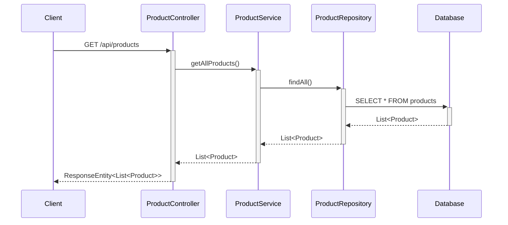

### 3.2 Get Product By ID

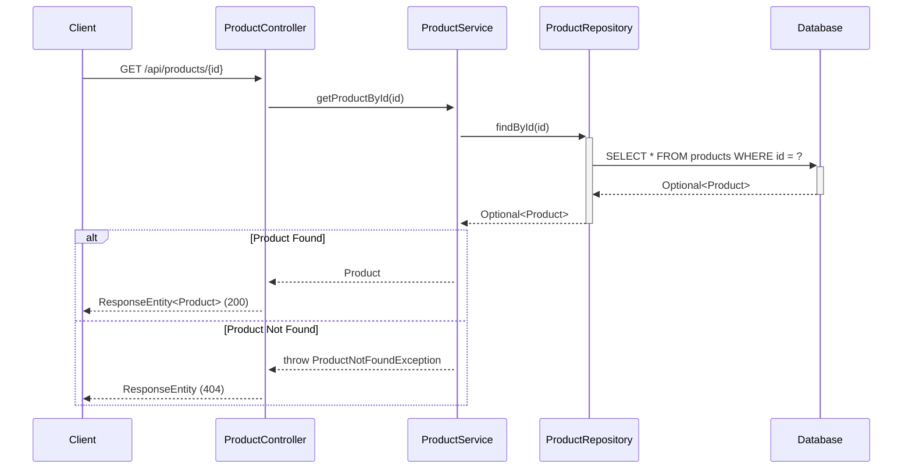

### 3.3 Create Product

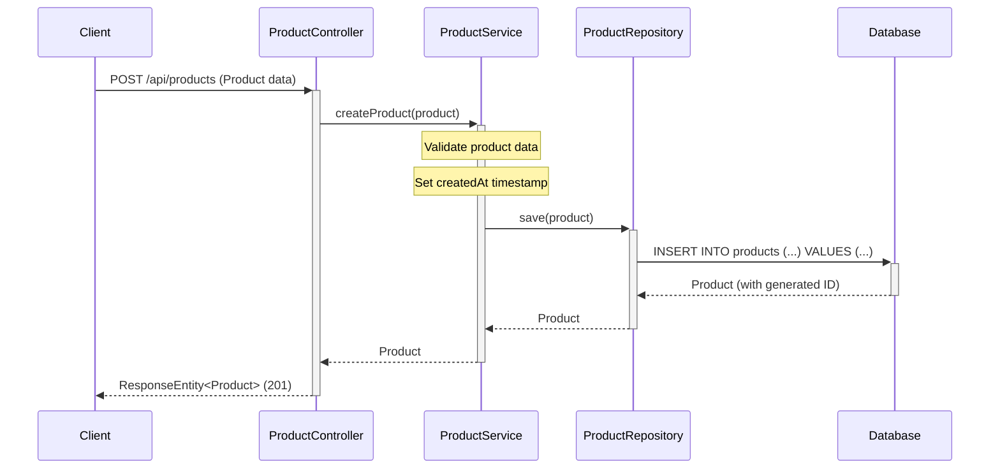

### 3.4 Update Product

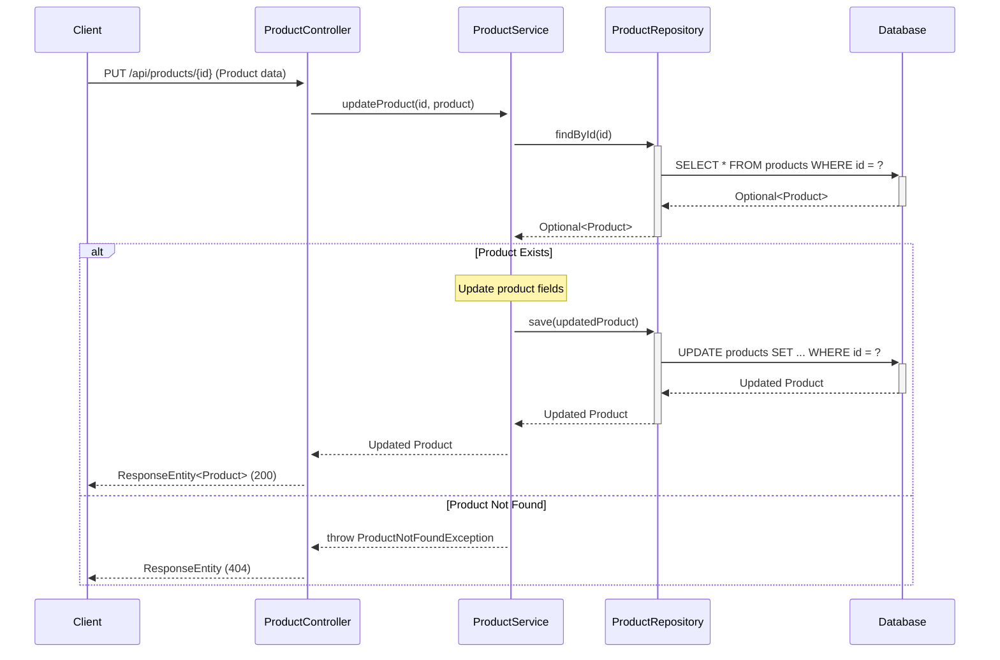

### 3.5 Delete Product

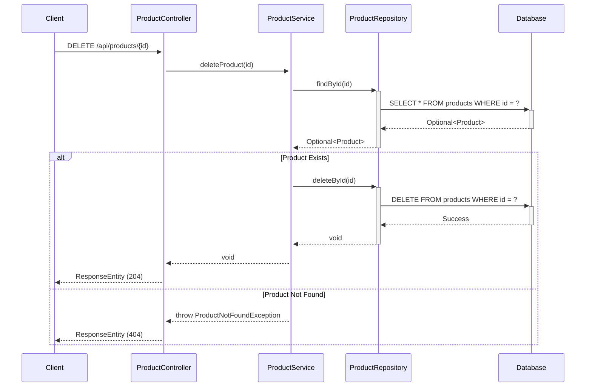

### 3.6 Get Products By Category

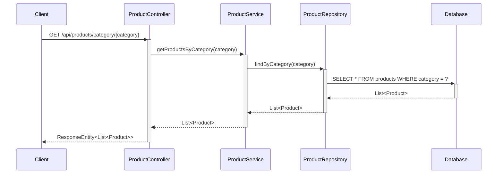

### 3.7 Search Products

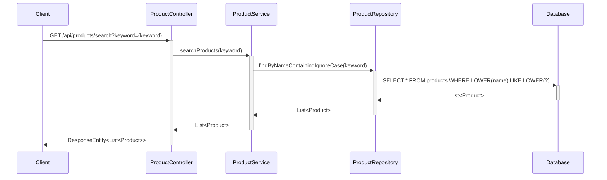

### 3.8 Add Item to Cart

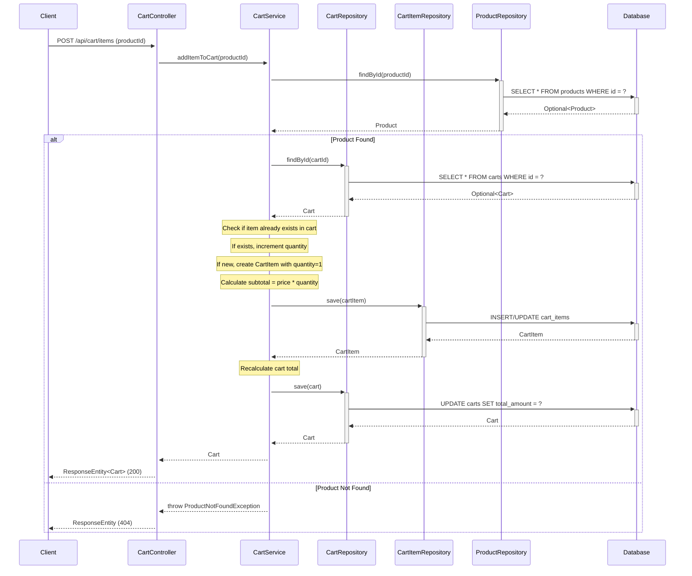

### 3.9 View Cart

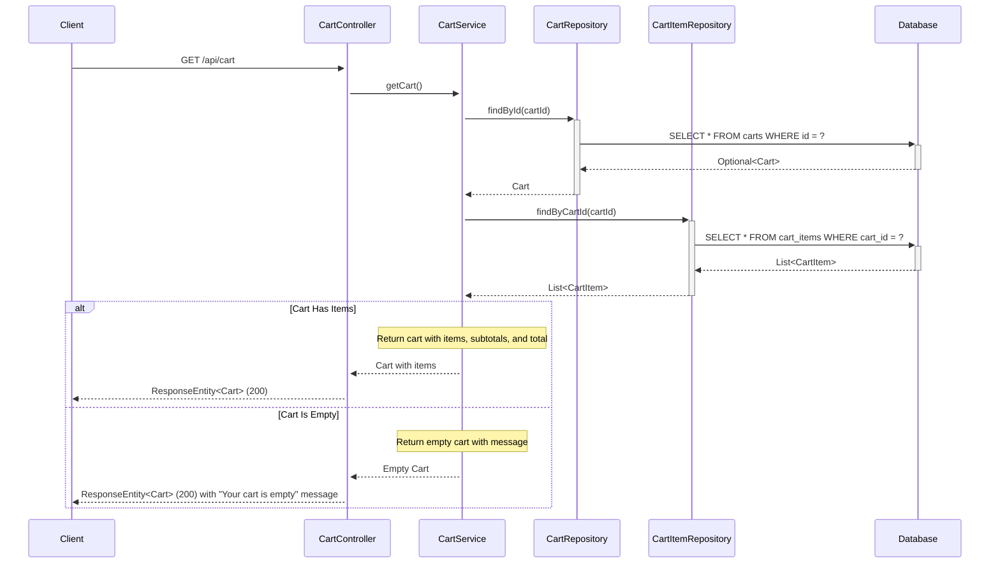

### 3.10 Update Cart Item Quantity

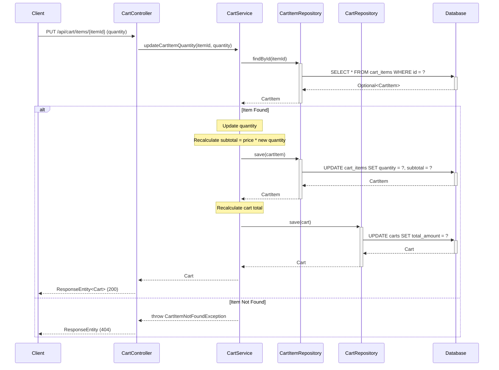

### 3.11 Remove Cart Item

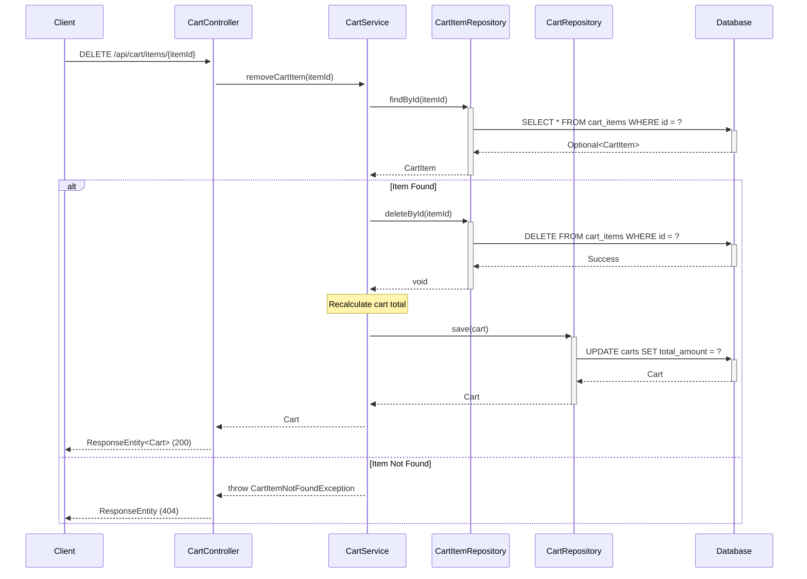

## 4. API Endpoints Summary

### Product Management Endpoints

| Method | Endpoint | Description | Request Body | Response |
|--------|----------|-------------|--------------|----------|
| GET | `/api/products` | Get all products | None | List<Product> |
| GET | `/api/products/{id}` | Get product by ID | None | Product |
| POST | `/api/products` | Create new product | Product | Product |
| PUT | `/api/products/{id}` | Update existing product | Product | Product |
| DELETE | `/api/products/{id}` | Delete product | None | None |
| GET | `/api/products/category/{category}` | Get products by category | None | List<Product> |
| GET | `/api/products/search?keyword={keyword}` | Search products by name | None | List<Product> |

### Shopping Cart Endpoints

| Method | Endpoint | Description | Request Body | Response |
|--------|----------|-------------|--------------|----------|
| GET | `/api/cart` | View cart contents | None | Cart |
| POST | `/api/cart/items` | Add product to cart | {"productId": Long} | Cart |
| PUT | `/api/cart/items/{itemId}` | Update item quantity | {"quantity": Integer} | Cart |
| DELETE | `/api/cart/items/{itemId}` | Remove item from cart | None | Cart |
| DELETE | `/api/cart` | Clear entire cart | None | None |

## 5. Database Schema

### Products Table

```sql
CREATE TABLE products (
    id BIGINT PRIMARY KEY AUTO_INCREMENT,
    name VARCHAR(255) NOT NULL,
    description TEXT,
    price DECIMAL(10,2) NOT NULL,
    category VARCHAR(100) NOT NULL,
    stock_quantity INTEGER NOT NULL DEFAULT 0,
    created_at TIMESTAMP NOT NULL DEFAULT CURRENT_TIMESTAMP
);

CREATE INDEX idx_products_category ON products(category);
CREATE INDEX idx_products_name ON products(name);
```

### Shopping Cart Tables

```sql
CREATE TABLE carts (
    id BIGINT PRIMARY KEY AUTO_INCREMENT,
    total_amount DECIMAL(10,2) NOT NULL DEFAULT 0.00,
    created_at TIMESTAMP NOT NULL DEFAULT CURRENT_TIMESTAMP,
    updated_at TIMESTAMP NOT NULL DEFAULT CURRENT_TIMESTAMP ON UPDATE CURRENT_TIMESTAMP
);

CREATE TABLE cart_items (
    id BIGINT PRIMARY KEY AUTO_INCREMENT,
    cart_id BIGINT NOT NULL,
    product_id BIGINT NOT NULL,
    quantity INTEGER NOT NULL DEFAULT 1,
    subtotal DECIMAL(10,2) NOT NULL,
    FOREIGN KEY (cart_id) REFERENCES carts(id) ON DELETE CASCADE,
    FOREIGN KEY (product_id) REFERENCES products(id) ON DELETE CASCADE,
    UNIQUE KEY unique_cart_product (cart_id, product_id)
);

CREATE INDEX idx_cart_items_cart_id ON cart_items(cart_id);
CREATE INDEX idx_cart_items_product_id ON cart_items(product_id);
```

## 6. Technology Stack

- **Backend Framework:** Spring Boot 3.x
- **Language:** Java 21
- **Database:** PostgreSQL
- **ORM:** Spring Data JPA / Hibernate
- **Build Tool:** Maven/Gradle
- **API Documentation:** Swagger/OpenAPI 3

## 7. Design Patterns Used

1. **MVC Pattern:** Separation of Controller, Service, and Repository layers
2. **Repository Pattern:** Data access abstraction through ProductRepository
3. **Dependency Injection:** Spring's IoC container manages dependencies
4. **DTO Pattern:** Data Transfer Objects for API requests/responses
5. **Exception Handling:** Custom exceptions for business logic errors

## 8. Key Features

- RESTful API design following HTTP standards
- Proper HTTP status codes for different scenarios
- Input validation and error handling
- Database indexing for performance optimization
- Transactional operations for data consistency
- Pagination support for large datasets (can be extended)
- Search functionality with case-insensitive matching

## 9. Shopping Cart Business Logic

### 9.1 Cart Total Calculation

The cart total is automatically calculated whenever the cart is modified:

- **Add Item:** When a product is added, subtotal = product.price * quantity (default 1)
- **Update Quantity:** When quantity changes, subtotal = product.price * new quantity
- **Remove Item:** When an item is removed, its subtotal is deducted from total
- **Cart Total:** Sum of all cart item subtotals

### 9.2 Empty Cart Handling

When the cart is empty:
- API returns Cart object with empty items list
- Response includes message: "Your cart is empty"
- Frontend should display "Continue Shopping" link
- Total amount is 0.00

### 9.3 Cart Item Management Rules

- Each product can appear only once in a cart (enforced by unique constraint)
- If adding an existing product, quantity is incremented instead of creating duplicate
- Minimum quantity is 1
- Quantity updates trigger automatic subtotal and total recalculation
- Removing last item results in empty cart state

### 9.4 Data Consistency

- All cart operations are transactional
- Cart totals are recalculated on every modification
- Foreign key constraints ensure referential integrity
- Cascade delete removes cart items when cart is deleted
- Cascade delete removes cart items when product is deleted