## 3. Sequence Diagrams

### 3.1 Get All Products

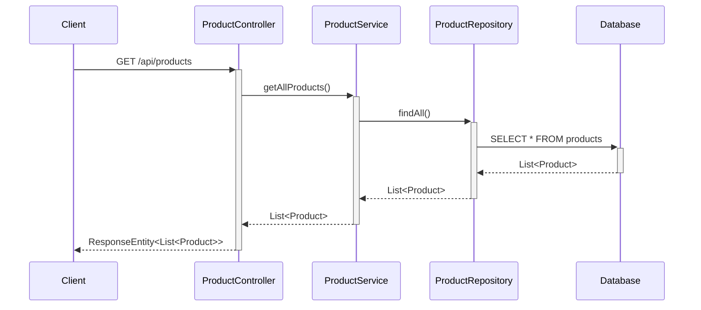

### 3.2 Get Product By ID

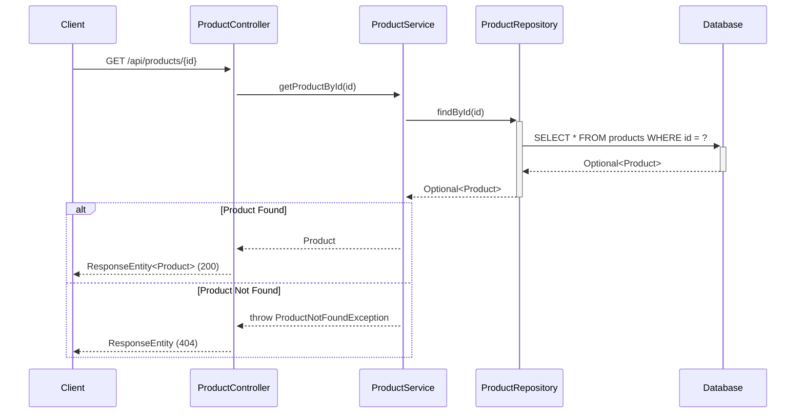

### 3.3 Create Product

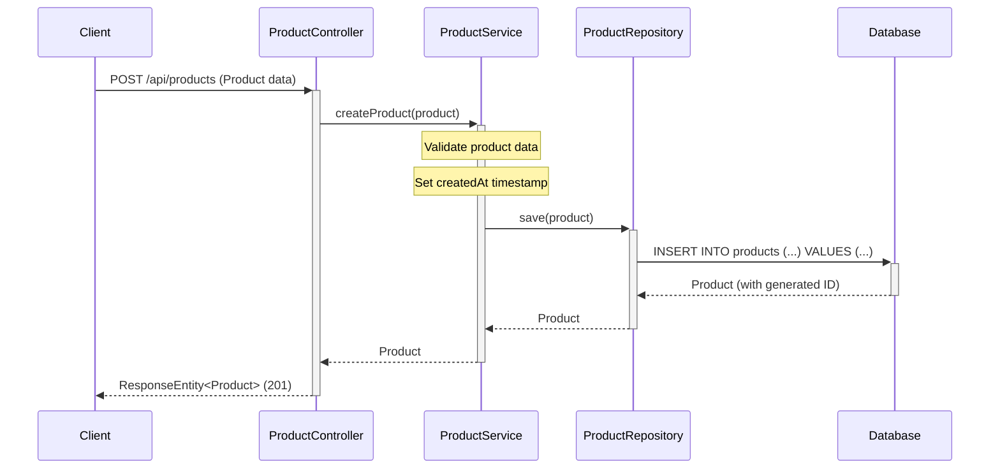

### 3.4 Update Product

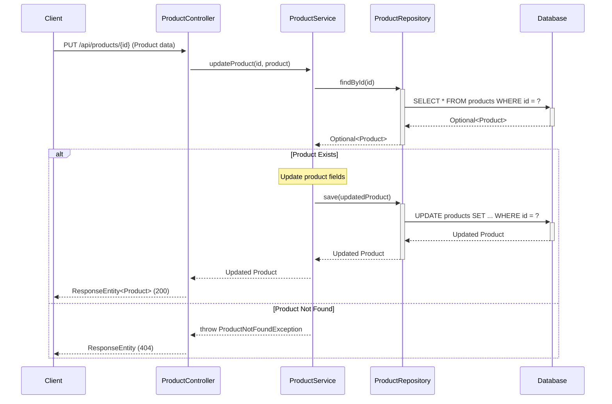

### 3.5 Delete Product

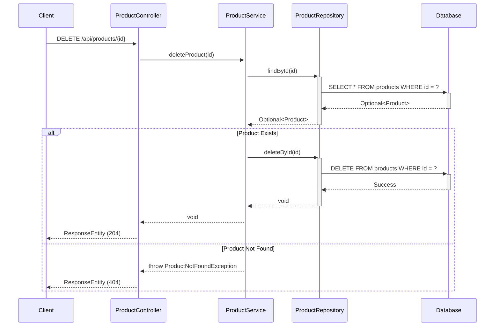

### 3.6 Get Products By Category

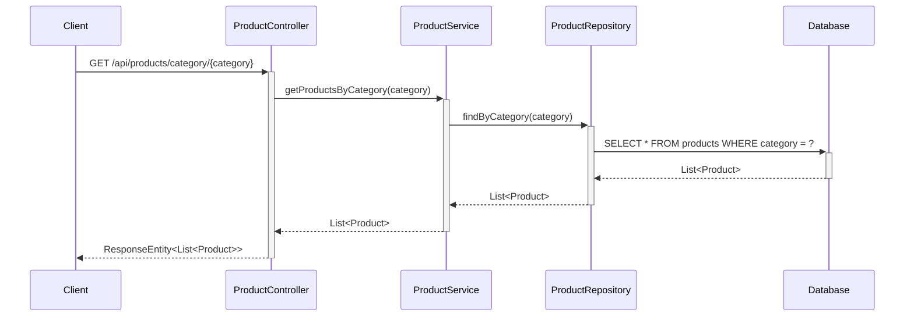

### 3.7 Search Products

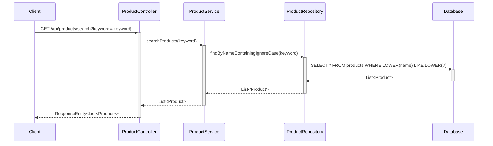

### 3.8 Shopping Cart Module - Add Item to Cart

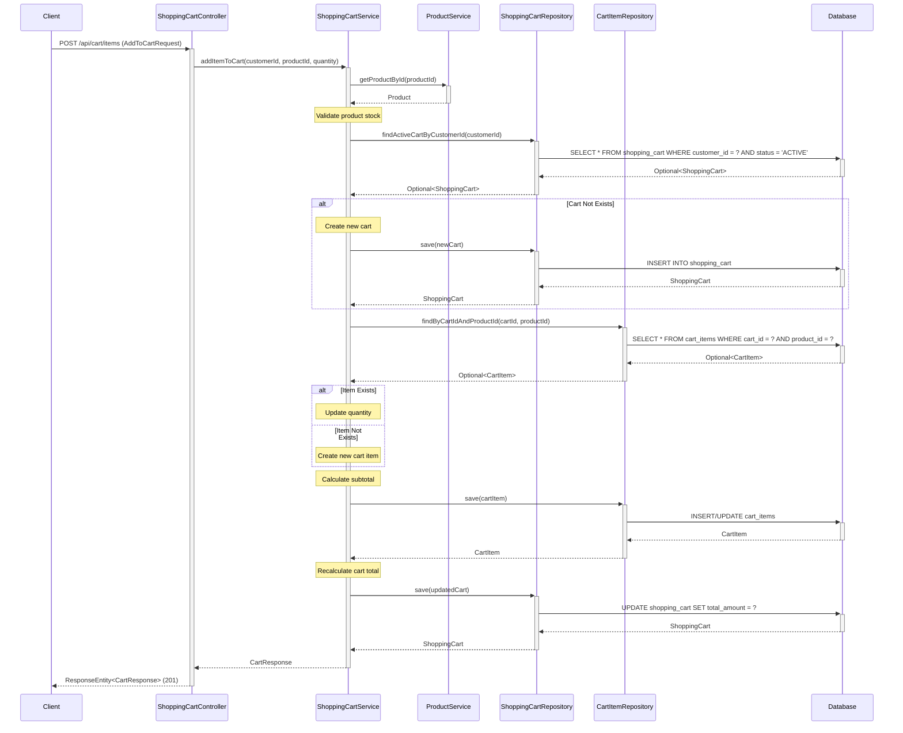

### 3.9 Shopping Cart Module - Get Cart Details

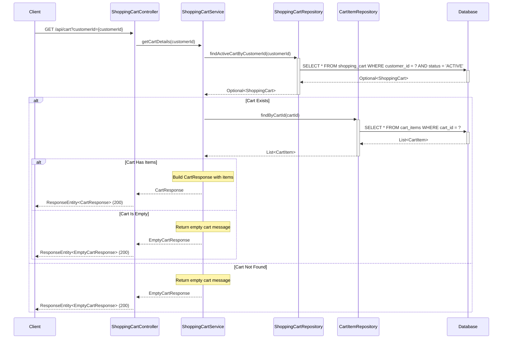

### 3.10 Shopping Cart Module - Update Cart Item Quantity

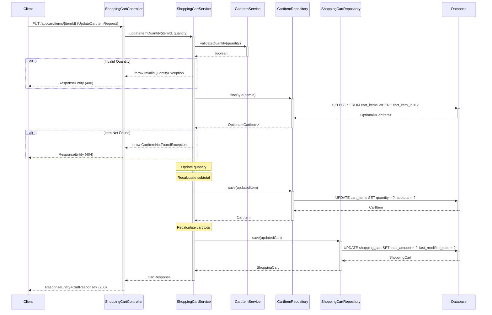

### 3.11 Shopping Cart Module - Remove Cart Item

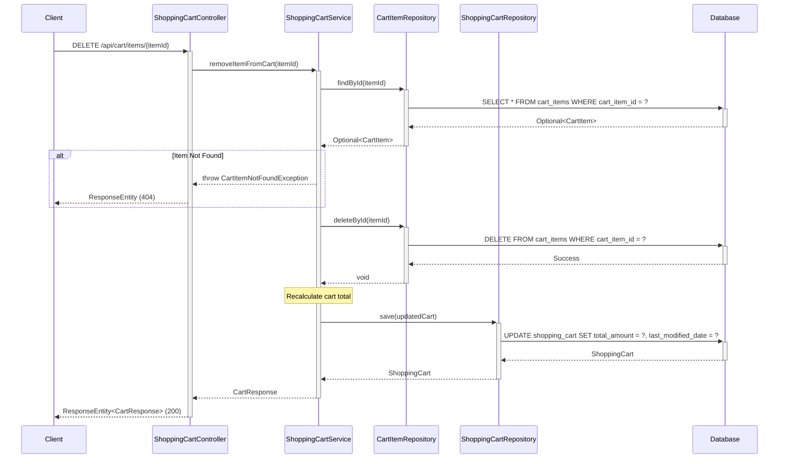

### 3.12 Shopping Cart Module - Clear Cart

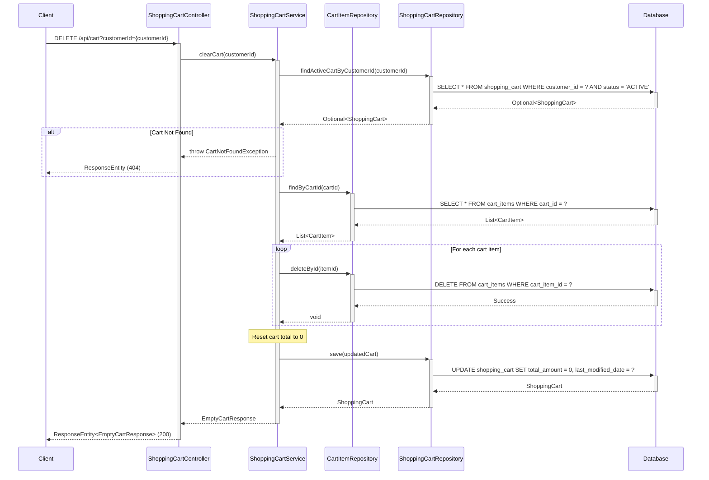

## 4. API Endpoints Summary

| Method | Endpoint | Description | Request Body | Response |
|--------|----------|-------------|--------------|----------|
| GET | `/api/products` | Get all products | None | List<Product> |
| GET | `/api/products/{id}` | Get product by ID | None | Product |
| POST | `/api/products` | Create new product | Product | Product |
| PUT | `/api/products/{id}` | Update existing product | Product | Product |
| DELETE | `/api/products/{id}` | Delete product | None | None |
| GET | `/api/products/category/{category}` | Get products by category | None | List<Product> |
| GET | `/api/products/search?keyword={keyword}` | Search products by name | None | List<Product> |

### 4.1 Shopping Cart Module - API Endpoints

| Method | Endpoint | Description | Request Body | Response |
|--------|----------|-------------|--------------|----------|
| POST | `/api/cart/items` | Add item to cart | AddToCartRequest | CartResponse |
| GET | `/api/cart?customerId={customerId}` | Get cart details | None | CartResponse / EmptyCartResponse |
| PUT | `/api/cart/items/{itemId}` | Update cart item quantity | UpdateCartItemRequest | CartResponse |
| DELETE | `/api/cart/items/{itemId}` | Remove item from cart | None | CartResponse |
| DELETE | `/api/cart?customerId={customerId}` | Clear entire cart | None | EmptyCartResponse |

### 4.2 Shopping Cart Module - DTO Definitions

**AddToCartRequest**
```json
{
  "customerId": 1,
  "productId": 101,
  "quantity": 2
}
```

**UpdateCartItemRequest**
```json
{
  "quantity": 5
}
```

**CartItemResponse**
```json
{
  "cartItemId": 1,
  "productId": 101,
  "productName": "Product Name",
  "quantity": 2,
  "unitPrice": 29.99,
  "subtotal": 59.98,
  "addedDate": "2024-01-15T10:30:00"
}
```

**CartResponse**
```json
{
  "cartId": 1,
  "customerId": 1,
  "items": [
    {
      "cartItemId": 1,
      "productId": 101,
      "productName": "Product Name",
      "quantity": 2,
      "unitPrice": 29.99,
      "subtotal": 59.98,
      "addedDate": "2024-01-15T10:30:00"
    }
  ],
  "totalAmount": 59.98,
  "itemCount": 1,
  "lastModifiedDate": "2024-01-15T10:30:00"
}
```

**EmptyCartResponse**
```json
{
  "message": "Your cart is empty",
  "continueShoppingLink": "/products"
}
```
