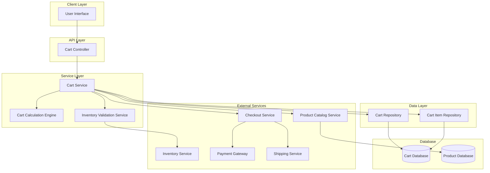
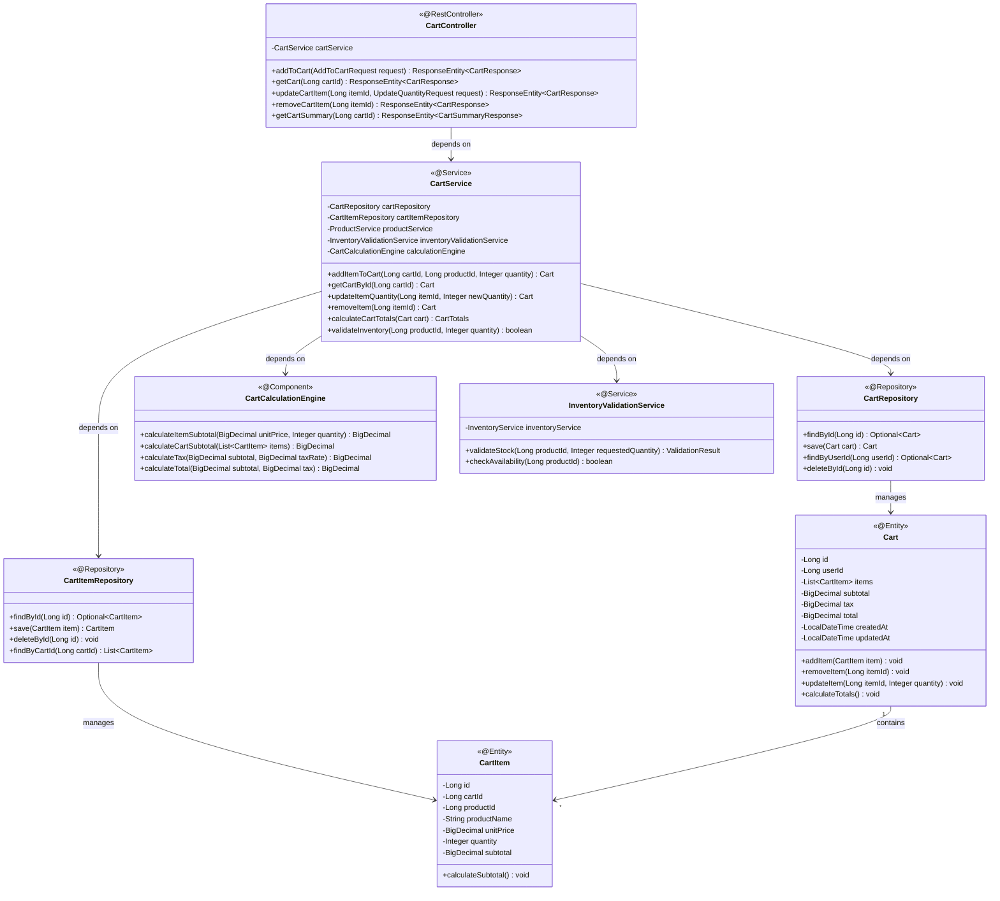
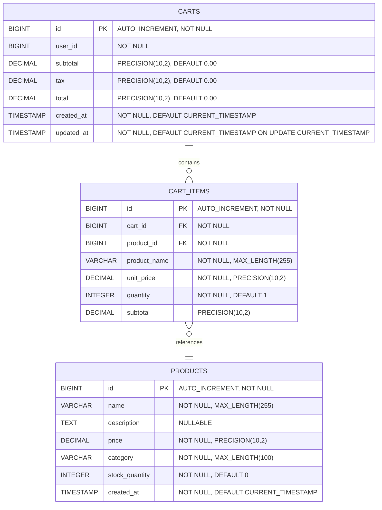

## 10. Shopping Cart System Architecture

**Requirement Reference:** Epic SCRUM-344 - Cart Management module integration

### 10.1 Shopping Cart Architecture Overview



### 10.2 Shopping Cart Class Diagram



## 11. Shopping Cart Functional Requirements

**Requirement Reference:** Story Description Acceptance Criteria 1-5

### 11.1 Add to Cart (AC1)

**Technical Specification:**
- User selects a product from the product catalog
- System validates product availability through Inventory Service
- System creates or retrieves existing cart for the user session
- System adds CartItem with product details, quantity, and unit price
- System calculates item subtotal (price × quantity)
- System recalculates cart totals
- System persists cart state to database
- System returns updated cart with success confirmation

**Validation Rules:**
- Product must exist in catalog
- Product must be in stock
- Quantity must be positive integer
- Quantity must not exceed available stock
- User must have valid session

### 11.2 Display Cart Contents (AC2)

**Technical Specification:**
- System retrieves cart by cartId or userId
- System fetches all associated CartItems
- System enriches items with current product information
- System displays:
  - Product name
  - Unit price
  - Quantity
  - Item subtotal
  - Cart subtotal
  - Tax amount
  - Cart total
- System handles empty cart state with appropriate message

**Display Requirements:**
- Real-time price updates from product catalog
- Formatted currency display
- Item count badge
- Visual separation between items
- Clear total breakdown

### 11.3 Update Quantity with Recalculation (AC3)

**Technical Specification:**
- User modifies quantity for a cart item
- System validates new quantity against inventory
- System updates CartItem quantity
- System recalculates item subtotal
- System recalculates cart subtotal, tax, and total
- System persists updated cart state
- System returns updated cart with new totals

**Automatic Recalculation Logic:**
```
Item Subtotal = Unit Price × New Quantity
Cart Subtotal = Sum of all Item Subtotals
Tax = Cart Subtotal × Tax Rate
Cart Total = Cart Subtotal + Tax
```

### 11.4 Remove Item (AC4)

**Technical Specification:**
- User initiates item removal
- System validates item exists in cart
- System deletes CartItem from database
- System recalculates cart totals
- System persists updated cart state
- System returns updated cart
- If cart becomes empty, system displays empty cart state

**Post-Removal Actions:**
- Update cart item count
- Recalculate all totals
- Release inventory reservation (if applicable)
- Update UI to reflect removal

### 11.5 Empty Cart Display (AC5)

**Technical Specification:**
- System detects cart has zero items
- System displays empty cart message:
  - "Your cart is empty"
  - Call-to-action to browse products
  - Link to product catalog
- System maintains cart session for future additions
- System does not display total calculations

## 12. Shopping Cart Data Models

**Requirement Reference:** Story Summary REQ-CART-001 to REQ-CART-015

### 12.1 Cart Entity

```java
@Entity
@Table(name = "carts")
public class Cart {
    @Id
    @GeneratedValue(strategy = GenerationType.IDENTITY)
    private Long id;
    
    @Column(name = "user_id", nullable = false)
    private Long userId;
    
    @OneToMany(mappedBy = "cart", cascade = CascadeType.ALL, orphanRemoval = true)
    private List<CartItem> items = new ArrayList<>();
    
    @Column(name = "subtotal", precision = 10, scale = 2)
    private BigDecimal subtotal = BigDecimal.ZERO;
    
    @Column(name = "tax", precision = 10, scale = 2)
    private BigDecimal tax = BigDecimal.ZERO;
    
    @Column(name = "total", precision = 10, scale = 2)
    private BigDecimal total = BigDecimal.ZERO;
    
    @Column(name = "created_at", nullable = false, updatable = false)
    private LocalDateTime createdAt;
    
    @Column(name = "updated_at")
    private LocalDateTime updatedAt;
    
    @PrePersist
    protected void onCreate() {
        createdAt = LocalDateTime.now();
        updatedAt = LocalDateTime.now();
    }
    
    @PreUpdate
    protected void onUpdate() {
        updatedAt = LocalDateTime.now();
    }
    
    // Getters, setters, and business methods
}
```

### 12.2 CartItem Entity

```java
@Entity
@Table(name = "cart_items")
public class CartItem {
    @Id
    @GeneratedValue(strategy = GenerationType.IDENTITY)
    private Long id;
    
    @ManyToOne(fetch = FetchType.LAZY)
    @JoinColumn(name = "cart_id", nullable = false)
    private Cart cart;
    
    @Column(name = "product_id", nullable = false)
    private Long productId;
    
    @Column(name = "product_name", nullable = false)
    private String productName;
    
    @Column(name = "unit_price", nullable = false, precision = 10, scale = 2)
    private BigDecimal unitPrice;
    
    @Column(name = "quantity", nullable = false)
    private Integer quantity;
    
    @Column(name = "subtotal", precision = 10, scale = 2)
    private BigDecimal subtotal;
    
    public void calculateSubtotal() {
        this.subtotal = this.unitPrice.multiply(new BigDecimal(this.quantity));
    }
    
    // Getters, setters
}
```

### 12.3 Entity Relationship Diagram - Shopping Cart


