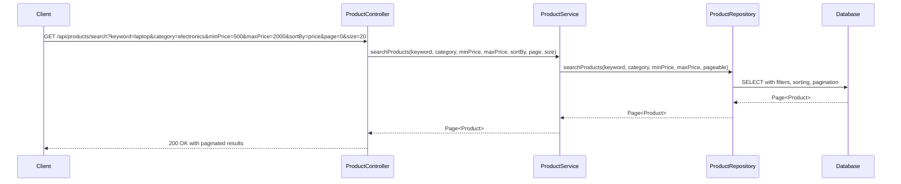
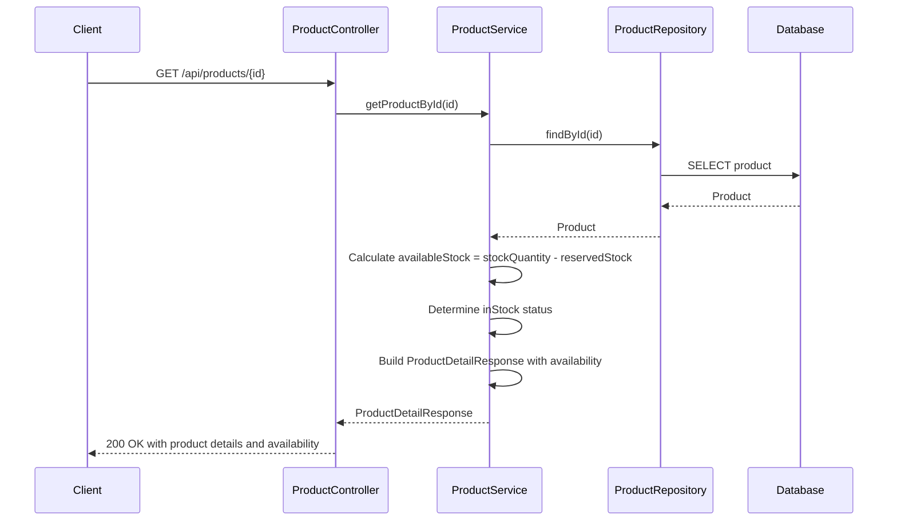
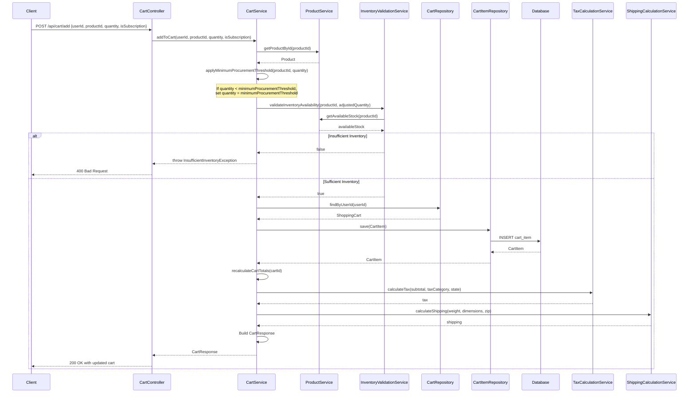
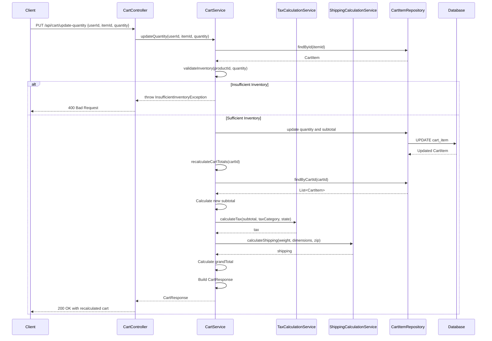
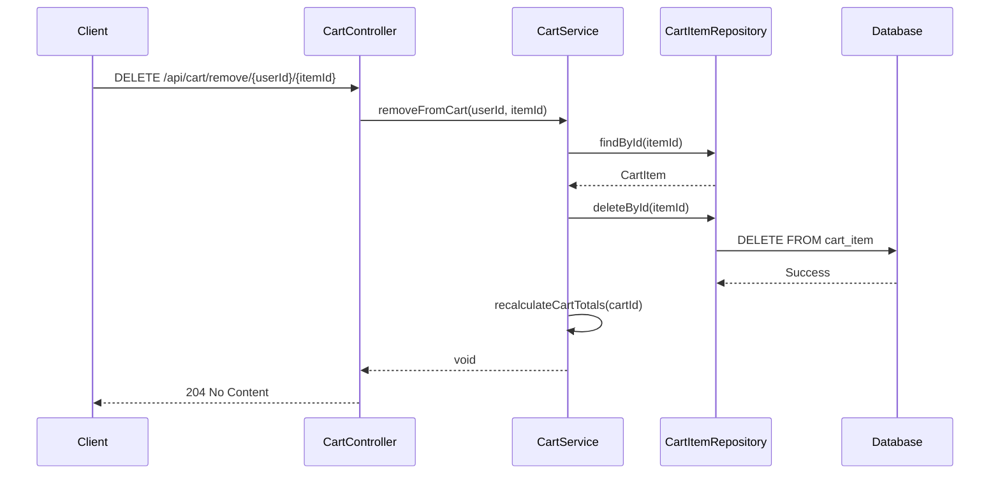
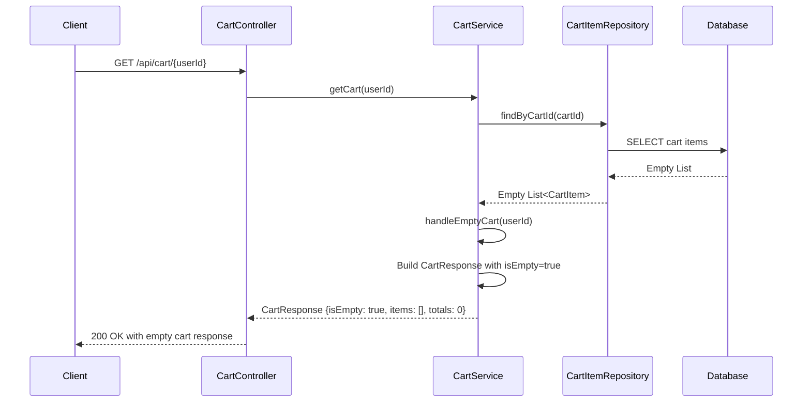
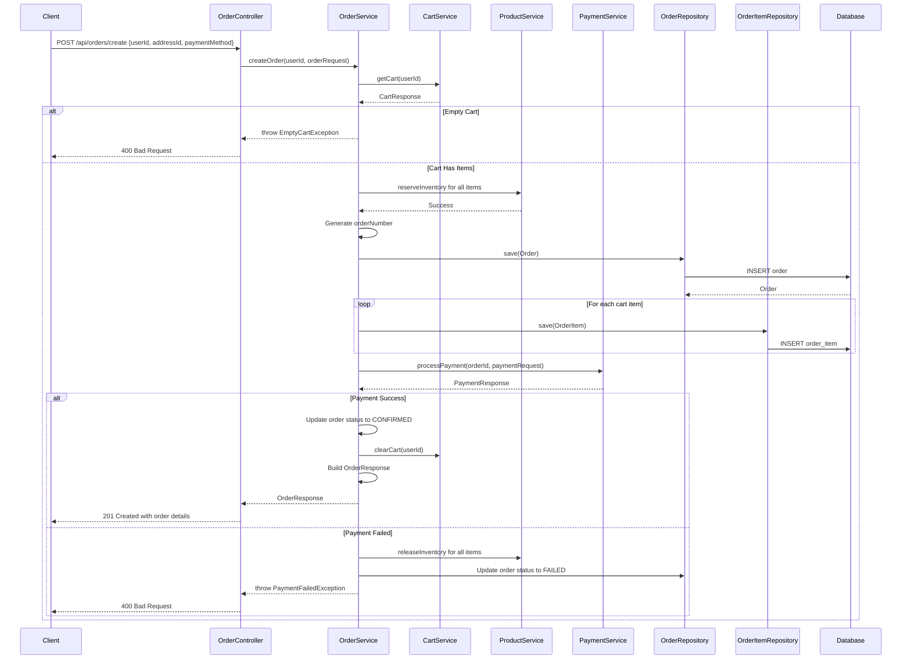
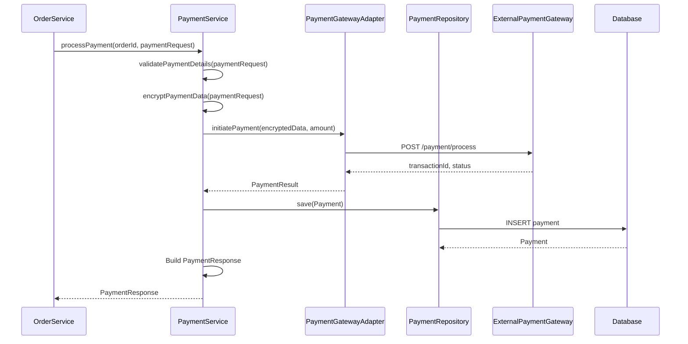
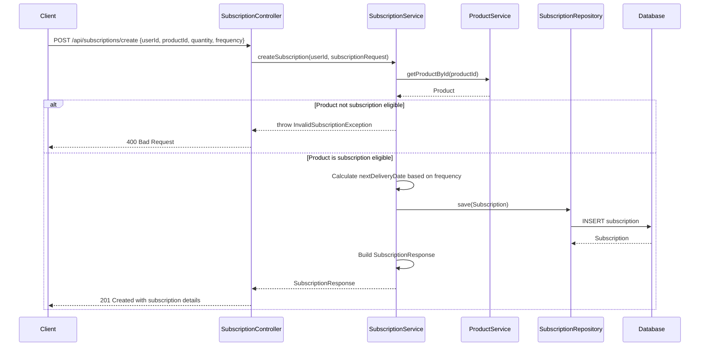
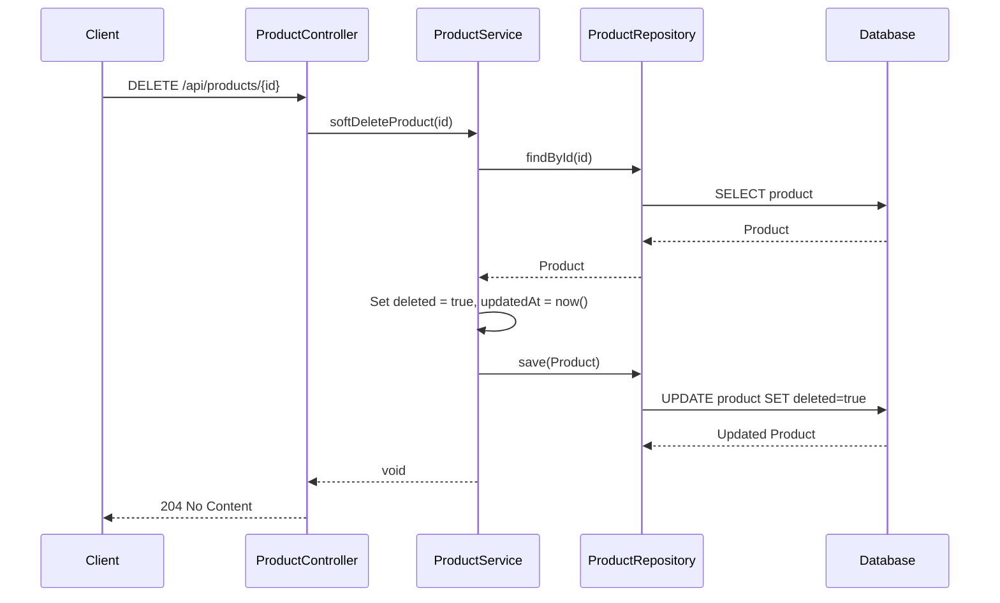

## 2. System Architecture

### 2.1 Class Diagram

```mermaid
classDiagram
    class ProductController {
        <<@RestController>>
        -ProductService productService
        +getAllProducts(String category, String sortBy, Integer page, Integer size) ResponseEntity~Page~Product~~
        +getProductById(Long id) ResponseEntity~ProductDetailResponse~
        +createProduct(Product product) ResponseEntity~Product~
        +updateProduct(Long id, Product product) ResponseEntity~Product~
        +softDeleteProduct(Long id) ResponseEntity~Void~
        +getProductsByCategory(String category) ResponseEntity~List~Product~~
        +searchProducts(String keyword, String category, BigDecimal minPrice, BigDecimal maxPrice, String sortBy, Integer page, Integer size) ResponseEntity~Page~Product~~
    }
    
    class CartController {
        <<@RestController>>
        -CartService cartService
        +addToCart(Long userId, CartItemRequest request) ResponseEntity~CartResponse~
        +viewCart(Long userId) ResponseEntity~CartResponse~
        +updateQuantity(Long userId, Long itemId, Integer quantity) ResponseEntity~CartResponse~
        +removeItem(Long userId, Long itemId) ResponseEntity~Void~
        +clearCart(Long userId) ResponseEntity~Void~
    }
    
    class OrderController {
        <<@RestController>>
        -OrderService orderService
        +createOrder(Long userId, OrderRequest request) ResponseEntity~OrderResponse~
        +getOrderById(Long orderId) ResponseEntity~OrderResponse~
        +getUserOrders(Long userId) ResponseEntity~List~OrderResponse~~
        +updateOrderStatus(Long orderId, OrderStatus status) ResponseEntity~OrderResponse~
        +cancelOrder(Long orderId) ResponseEntity~Void~
    }
    
    class PaymentController {
        <<@RestController>>
        -PaymentService paymentService
        +processPayment(Long orderId, PaymentRequest request) ResponseEntity~PaymentResponse~
        +getPaymentStatus(Long paymentId) ResponseEntity~PaymentResponse~
        +refundPayment(Long paymentId) ResponseEntity~RefundResponse~
    }
    
    class UserController {
        <<@RestController>>
        -UserService userService
        +registerUser(UserRegistrationRequest request) ResponseEntity~UserResponse~
        +getUserProfile(Long userId) ResponseEntity~UserResponse~
        +updateUserProfile(Long userId, UserUpdateRequest request) ResponseEntity~UserResponse~
        +getUserAddresses(Long userId) ResponseEntity~List~Address~~
        +addAddress(Long userId, Address address) ResponseEntity~Address~
    }
    
    class SubscriptionController {
        <<@RestController>>
        -SubscriptionService subscriptionService
        +createSubscription(Long userId, SubscriptionRequest request) ResponseEntity~SubscriptionResponse~
        +getUserSubscriptions(Long userId) ResponseEntity~List~SubscriptionResponse~~
        +updateSubscription(Long subscriptionId, SubscriptionUpdateRequest request) ResponseEntity~SubscriptionResponse~
        +cancelSubscription(Long subscriptionId) ResponseEntity~Void~
    }
    
    class ProductService {
        <<@Service>>
        -ProductRepository productRepository
        +getAllProducts(String category, String sortBy, Integer page, Integer size) Page~Product~
        +getProductById(Long id) ProductDetailResponse
        +createProduct(Product product) Product
        +updateProduct(Long id, Product product) Product
        +softDeleteProduct(Long id) void
        +getProductsByCategory(String category) List~Product~
        +searchProducts(String keyword, String category, BigDecimal minPrice, BigDecimal maxPrice, String sortBy, Integer page, Integer size) Page~Product~
        +checkInventoryAvailability(Long productId, Integer requestedQuantity) boolean
        +reserveInventory(Long productId, Integer quantity) void
        +releaseInventory(Long productId, Integer quantity) void
        +updateStock(Long productId, Integer quantity) void
        +getAvailableStock(Long productId) Integer
    }
    
    class CartService {
        <<@Service>>
        -CartRepository cartRepository
        -CartItemRepository cartItemRepository
        -ProductService productService
        -TaxCalculationService taxCalculationService
        -ShippingCalculationService shippingCalculationService
        +addToCart(Long userId, Long productId, Integer quantity, Boolean isSubscription) CartResponse
        +updateQuantity(Long userId, Long itemId, Integer quantity) CartResponse
        +removeFromCart(Long userId, Long itemId) void
        +clearCart(Long userId) void
        +calculateTotals(Long cartId) CartResponse
        +validateInventory(Long productId, Integer quantity) boolean
        +getCart(Long userId) CartResponse
        +applyMinimumProcurementThreshold(Long productId, Integer requestedQuantity) Integer
        +handleEmptyCart(Long userId) CartResponse
        +recalculateCartTotals(Long cartId) CartResponse
    }
    
    class OrderService {
        <<@Service>>
        -OrderRepository orderRepository
        -OrderItemRepository orderItemRepository
        -CartService cartService
        -ProductService productService
        -PaymentService paymentService
        +createOrder(Long userId, OrderRequest request) OrderResponse
        +getOrderById(Long orderId) OrderResponse
        +getUserOrders(Long userId) List~OrderResponse~
        +updateOrderStatus(Long orderId, OrderStatus status) OrderResponse
        +cancelOrder(Long orderId) void
        +processOrderFromCart(Long userId, Long addressId, PaymentMethod paymentMethod) OrderResponse
    }
    
    class PaymentService {
        <<@Service>>
        -PaymentRepository paymentRepository
        -PaymentGatewayAdapter paymentGatewayAdapter
        +processPayment(Long orderId, PaymentRequest request) PaymentResponse
        +getPaymentStatus(Long paymentId) PaymentResponse
        +refundPayment(Long paymentId) RefundResponse
        +validatePaymentDetails(PaymentRequest request) boolean
        +encryptPaymentData(PaymentRequest request) String
    }
    
    class UserService {
        <<@Service>>
        -UserRepository userRepository
        -AddressRepository addressRepository
        +registerUser(UserRegistrationRequest request) UserResponse
        +getUserProfile(Long userId) UserResponse
        +updateUserProfile(Long userId, UserUpdateRequest request) UserResponse
        +getUserAddresses(Long userId) List~Address~
        +addAddress(Long userId, Address address) Address
        +validateUser(Long userId) boolean
    }
    
    class SubscriptionService {
        <<@Service>>
        -SubscriptionRepository subscriptionRepository
        -ProductService productService
        -OrderService orderService
        +createSubscription(Long userId, SubscriptionRequest request) SubscriptionResponse
        +getUserSubscriptions(Long userId) List~SubscriptionResponse~
        +updateSubscription(Long subscriptionId, SubscriptionUpdateRequest request) SubscriptionResponse
        +cancelSubscription(Long subscriptionId) void
        +processSubscriptionRenewal(Long subscriptionId) OrderResponse
    }
    
    class TaxCalculationService {
        <<@Service>>
        -TaxRateRepository taxRateRepository
        +calculateTax(BigDecimal subtotal, String taxCategory, String state) BigDecimal
        +getTaxRate(String taxCategory, String state) BigDecimal
    }
    
    class ShippingCalculationService {
        <<@Service>>
        -ShippingRateRepository shippingRateRepository
        +calculateShipping(BigDecimal weight, String dimensions, String destinationZip) BigDecimal
        +getShippingRate(String zone, BigDecimal weight) BigDecimal
    }
    
    class InventoryValidationService {
        <<@Service>>
        -ProductService productService
        +validateInventoryAvailability(Long productId, Integer quantity) boolean
        +checkStockLevel(Long productId) Integer
        +validateBulkInventory(List~CartItem~ items) Map~Long, Boolean~
    }
    
    class ProductRepository {
        <<@Repository>>
        <<interface>>
        +findAll(Pageable pageable) Page~Product~
        +findById(Long id) Optional~Product~
        +save(Product product) Product
        +findByCategory(String category, Pageable pageable) Page~Product~
        +findByNameContainingIgnoreCase(String keyword, Pageable pageable) Page~Product~
        +searchProducts(String keyword, String category, BigDecimal minPrice, BigDecimal maxPrice, Pageable pageable) Page~Product~
        +findByDeletedFalse() List~Product~
    }
    
    class CartRepository {
        <<@Repository>>
        <<interface>>
        +findByUserId(Long userId) Optional~ShoppingCart~
        +save(ShoppingCart cart) ShoppingCart
        +deleteById(Long id) void
    }
    
    class CartItemRepository {
        <<@Repository>>
        <<interface>>
        +findByCartId(Long cartId) List~CartItem~
        +findById(Long id) Optional~CartItem~
        +save(CartItem item) CartItem
        +deleteById(Long id) void
        +deleteByCartId(Long cartId) void
    }
    
    class OrderRepository {
        <<@Repository>>
        <<interface>>
        +findById(Long id) Optional~Order~
        +findByUserId(Long userId) List~Order~
        +save(Order order) Order
    }
    
    class OrderItemRepository {
        <<@Repository>>
        <<interface>>
        +findByOrderId(Long orderId) List~OrderItem~
        +save(OrderItem item) OrderItem
    }
    
    class PaymentRepository {
        <<@Repository>>
        <<interface>>
        +findById(Long id) Optional~Payment~
        +findByOrderId(Long orderId) Optional~Payment~
        +save(Payment payment) Payment
    }
    
    class UserRepository {
        <<@Repository>>
        <<interface>>
        +findById(Long id) Optional~User~
        +findByEmail(String email) Optional~User~
        +save(User user) User
    }
    
    class AddressRepository {
        <<@Repository>>
        <<interface>>
        +findByUserId(Long userId) List~Address~
        +save(Address address) Address
    }
    
    class SubscriptionRepository {
        <<@Repository>>
        <<interface>>
        +findById(Long id) Optional~Subscription~
        +findByUserId(Long userId) List~Subscription~
        +findByStatus(SubscriptionStatus status) List~Subscription~
        +save(Subscription subscription) Subscription
    }
    
    class Product {
        <<@Entity>>
        -Long id
        -String name
        -String description
        -BigDecimal price
        -String category
        -Integer stockQuantity
        -Integer availableStock
        -Integer reservedStock
        -Integer minimumProcurementThreshold
        -BigDecimal weight
        -String dimensions
        -String taxCategory
        -Boolean isSubscriptionEligible
        -List~String~ imageUrls
        -String sku
        -String brand
        -LocalDateTime createdAt
        -LocalDateTime updatedAt
        -Boolean deleted
        +getId() Long
        +setId(Long id) void
        +getName() String
        +setName(String name) void
        +getDescription() String
        +setDescription(String description) void
        +getPrice() BigDecimal
        +setPrice(BigDecimal price) void
        +getCategory() String
        +setCategory(String category) void
        +getStockQuantity() Integer
        +setStockQuantity(Integer stockQuantity) void
        +getAvailableStock() Integer
        +setAvailableStock(Integer availableStock) void
        +getReservedStock() Integer
        +setReservedStock(Integer reservedStock) void
        +getMinimumProcurementThreshold() Integer
        +setMinimumProcurementThreshold(Integer threshold) void
        +getWeight() BigDecimal
        +setWeight(BigDecimal weight) void
        +getDimensions() String
        +setDimensions(String dimensions) void
        +getTaxCategory() String
        +setTaxCategory(String taxCategory) void
        +getIsSubscriptionEligible() Boolean
        +setIsSubscriptionEligible(Boolean isSubscriptionEligible) void
        +getImageUrls() List~String~
        +setImageUrls(List~String~ imageUrls) void
        +getSku() String
        +setSku(String sku) void
        +getBrand() String
        +setBrand(String brand) void
        +getCreatedAt() LocalDateTime
        +setCreatedAt(LocalDateTime createdAt) void
        +getUpdatedAt() LocalDateTime
        +setUpdatedAt(LocalDateTime updatedAt) void
        +getDeleted() Boolean
        +setDeleted(Boolean deleted) void
    }
    
    class ShoppingCart {
        <<@Entity>>
        -Long id
        -Long userId
        -LocalDateTime createdAt
        -LocalDateTime updatedAt
        +getId() Long
        +setId(Long id) void
        +getUserId() Long
        +setUserId(Long userId) void
        +getCreatedAt() LocalDateTime
        +setCreatedAt(LocalDateTime createdAt) void
        +getUpdatedAt() LocalDateTime
        +setUpdatedAt(LocalDateTime updatedAt) void
    }
    
    class CartItem {
        <<@Entity>>
        -Long id
        -Long cartId
        -Long productId
        -Integer quantity
        -BigDecimal unitPrice
        -BigDecimal subtotal
        -Boolean isSubscription
        +getId() Long
        +setId(Long id) void
        +getCartId() Long
        +setCartId(Long cartId) void
        +getProductId() Long
        +setProductId(Long productId) void
        +getQuantity() Integer
        +setQuantity(Integer quantity) void
        +getUnitPrice() BigDecimal
        +setUnitPrice(BigDecimal unitPrice) void
        +getSubtotal() BigDecimal
        +setSubtotal(BigDecimal subtotal) void
        +getIsSubscription() Boolean
        +setIsSubscription(Boolean isSubscription) void
    }
    
    class Order {
        <<@Entity>>
        -Long id
        -Long userId
        -String orderNumber
        -OrderStatus status
        -BigDecimal subtotal
        -BigDecimal tax
        -BigDecimal shipping
        -BigDecimal grandTotal
        -Long shippingAddressId
        -PaymentMethod paymentMethod
        -LocalDateTime createdAt
        -LocalDateTime updatedAt
        +getId() Long
        +getUserId() Long
        +getOrderNumber() String
        +getStatus() OrderStatus
        +getSubtotal() BigDecimal
        +getTax() BigDecimal
        +getShipping() BigDecimal
        +getGrandTotal() BigDecimal
        +getShippingAddressId() Long
        +getPaymentMethod() PaymentMethod
        +getCreatedAt() LocalDateTime
        +getUpdatedAt() LocalDateTime
    }
    
    class OrderItem {
        <<@Entity>>
        -Long id
        -Long orderId
        -Long productId
        -String productName
        -Integer quantity
        -BigDecimal unitPrice
        -BigDecimal subtotal
        -Boolean isSubscription
        +getId() Long
        +getOrderId() Long
        +getProductId() Long
        +getProductName() String
        +getQuantity() Integer
        +getUnitPrice() BigDecimal
        +getSubtotal() BigDecimal
        +getIsSubscription() Boolean
    }
    
    class Payment {
        <<@Entity>>
        -Long id
        -Long orderId
        -PaymentMethod paymentMethod
        -BigDecimal amount
        -PaymentStatus status
        -String transactionId
        -String encryptedPaymentData
        -LocalDateTime processedAt
        +getId() Long
        +getOrderId() Long
        +getPaymentMethod() PaymentMethod
        +getAmount() BigDecimal
        +getStatus() PaymentStatus
        +getTransactionId() String
        +getEncryptedPaymentData() String
        +getProcessedAt() LocalDateTime
    }
    
    class User {
        <<@Entity>>
        -Long id
        -String email
        -String firstName
        -String lastName
        -String phoneNumber
        -LocalDateTime createdAt
        -LocalDateTime updatedAt
        +getId() Long
        +getEmail() String
        +getFirstName() String
        +getLastName() String
        +getPhoneNumber() String
        +getCreatedAt() LocalDateTime
        +getUpdatedAt() LocalDateTime
    }
    
    class Address {
        <<@Entity>>
        -Long id
        -Long userId
        -String street
        -String city
        -String state
        -String zipCode
        -String country
        -Boolean isDefault
        +getId() Long
        +getUserId() Long
        +getStreet() String
        +getCity() String
        +getState() String
        +getZipCode() String
        +getCountry() String
        +getIsDefault() Boolean
    }
    
    class Subscription {
        <<@Entity>>
        -Long id
        -Long userId
        -Long productId
        -Integer quantity
        -SubscriptionFrequency frequency
        -SubscriptionStatus status
        -LocalDateTime nextDeliveryDate
        -LocalDateTime createdAt
        -LocalDateTime updatedAt
        +getId() Long
        +getUserId() Long
        +getProductId() Long
        +getQuantity() Integer
        +getFrequency() SubscriptionFrequency
        +getStatus() SubscriptionStatus
        +getNextDeliveryDate() LocalDateTime
        +getCreatedAt() LocalDateTime
        +getUpdatedAt() LocalDateTime
    }
    
    class CartResponse {
        <<DTO>>
        -List~CartItemResponse~ items
        -BigDecimal subtotal
        -BigDecimal tax
        -BigDecimal shipping
        -BigDecimal grandTotal
        -Boolean isEmpty
    }
    
    class CartItemResponse {
        <<DTO>>
        -Long itemId
        -String productName
        -BigDecimal unitPrice
        -Integer quantity
        -BigDecimal subtotal
        -Boolean isSubscription
        -Integer availableStock
    }
    
    class ProductDetailResponse {
        <<DTO>>
        -Long id
        -String name
        -String description
        -BigDecimal price
        -String category
        -Integer availableStock
        -Boolean inStock
        -Integer minimumProcurementThreshold
        -Boolean isSubscriptionEligible
        -List~String~ imageUrls
        -String sku
        -String brand
    }
    
    class OrderResponse {
        <<DTO>>
        -Long orderId
        -String orderNumber
        -OrderStatus status
        -List~OrderItemResponse~ items
        -BigDecimal subtotal
        -BigDecimal tax
        -BigDecimal shipping
        -BigDecimal grandTotal
        -Address shippingAddress
        -LocalDateTime createdAt
    }
    
    class OrderItemResponse {
        <<DTO>>
        -Long itemId
        -String productName
        -Integer quantity
        -BigDecimal unitPrice
        -BigDecimal subtotal
        -Boolean isSubscription
    }
    
    class PaymentResponse {
        <<DTO>>
        -Long paymentId
        -PaymentStatus status
        -String transactionId
        -BigDecimal amount
        -LocalDateTime processedAt
    }
    
    class SubscriptionResponse {
        <<DTO>>
        -Long subscriptionId
        -String productName
        -Integer quantity
        -SubscriptionFrequency frequency
        -SubscriptionStatus status
        -LocalDateTime nextDeliveryDate
    }
    
    class EmptyCartException {
        <<Exception>>
        +EmptyCartException(String message)
    }
    
    class InsufficientInventoryException {
        <<Exception>>
        +InsufficientInventoryException(String message)
    }
    
    class OrderNotFoundException {
        <<Exception>>
        +OrderNotFoundException(String message)
    }
    
    class PaymentFailedException {
        <<Exception>>
        +PaymentFailedException(String message)
    }
    
    class UserNotFoundException {
        <<Exception>>
        +UserNotFoundException(String message)
    }
    
    ProductController --> ProductService : depends on
    CartController --> CartService : depends on
    OrderController --> OrderService : depends on
    PaymentController --> PaymentService : depends on
    UserController --> UserService : depends on
    SubscriptionController --> SubscriptionService : depends on
    ProductService --> ProductRepository : depends on
    CartService --> CartRepository : depends on
    CartService --> CartItemRepository : depends on
    CartService --> ProductService : depends on
    CartService --> TaxCalculationService : depends on
    CartService --> ShippingCalculationService : depends on
    OrderService --> OrderRepository : depends on
    OrderService --> OrderItemRepository : depends on
    OrderService --> CartService : depends on
    OrderService --> ProductService : depends on
    OrderService --> PaymentService : depends on
    PaymentService --> PaymentRepository : depends on
    UserService --> UserRepository : depends on
    UserService --> AddressRepository : depends on
    SubscriptionService --> SubscriptionRepository : depends on
    SubscriptionService --> ProductService : depends on
    SubscriptionService --> OrderService : depends on
    ProductRepository --> Product : manages
    CartRepository --> ShoppingCart : manages
    CartItemRepository --> CartItem : manages
    OrderRepository --> Order : manages
    OrderItemRepository --> OrderItem : manages
    PaymentRepository --> Payment : manages
    UserRepository --> User : manages
    AddressRepository --> Address : manages
    SubscriptionRepository --> Subscription : manages
    ProductService --> Product : operates on
    CartService --> ShoppingCart : operates on
    CartService --> CartItem : operates on
    CartService --> CartResponse : returns
    CartService --> EmptyCartException : throws
    CartService --> InsufficientInventoryException : throws
    OrderService --> Order : operates on
    OrderService --> OrderResponse : returns
    PaymentService --> Payment : operates on
    PaymentService --> PaymentResponse : returns
    UserService --> User : operates on
    SubscriptionService --> Subscription : operates on
```

### 2.2 Sequence Diagrams

#### 2.2.1 Enhanced Product Search with Filtering and Pagination



#### 2.2.2 Get Product By ID with Real-time Availability



#### 2.2.3 Add to Cart with Inventory Validation and Minimum Procurement Threshold



#### 2.2.4 Real-time Cart Updates and Recalculation



#### 2.2.5 Cart Item Removal



#### 2.2.6 Empty Cart Handling



#### 2.2.7 Order Creation from Cart



#### 2.2.8 Payment Processing



#### 2.2.9 Subscription Management



#### 2.2.10 Soft Delete Product


