## 3. Sequence Diagrams

### 3.1 Get All Products

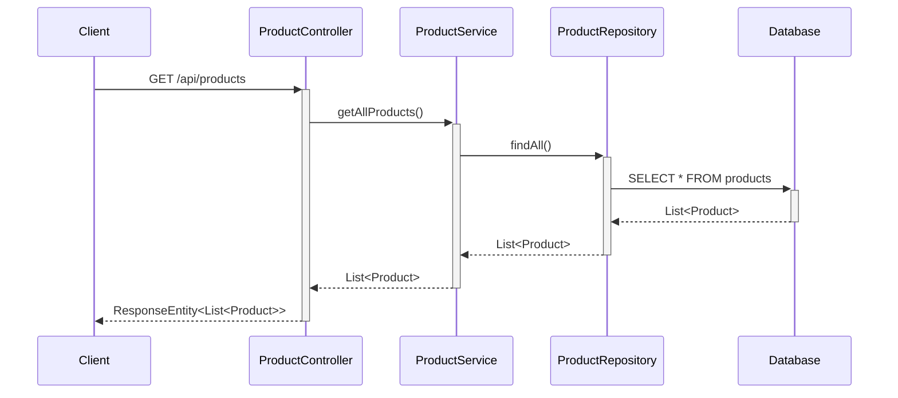

### 3.2 Get Product By ID

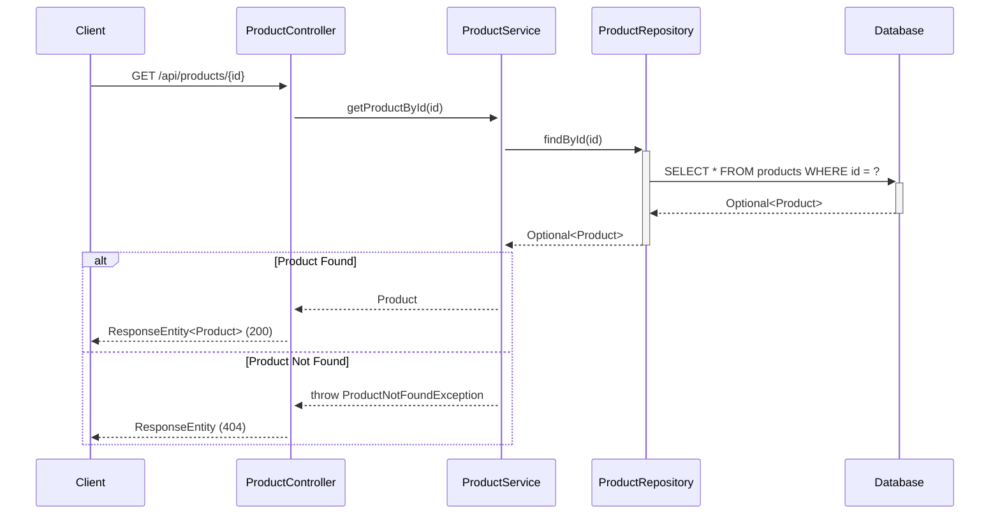

### 3.3 Create Product

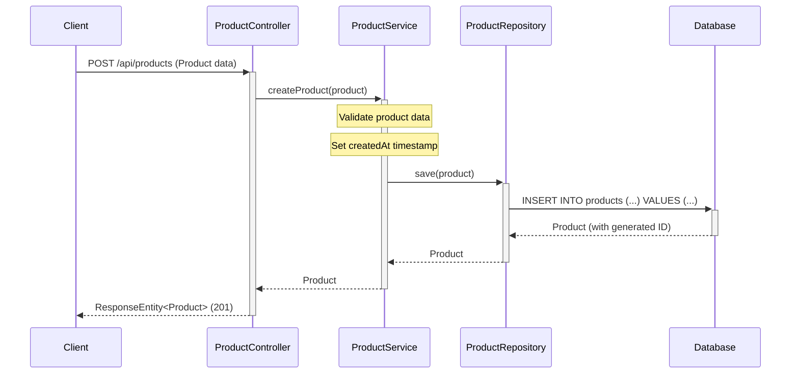

### 3.4 Update Product

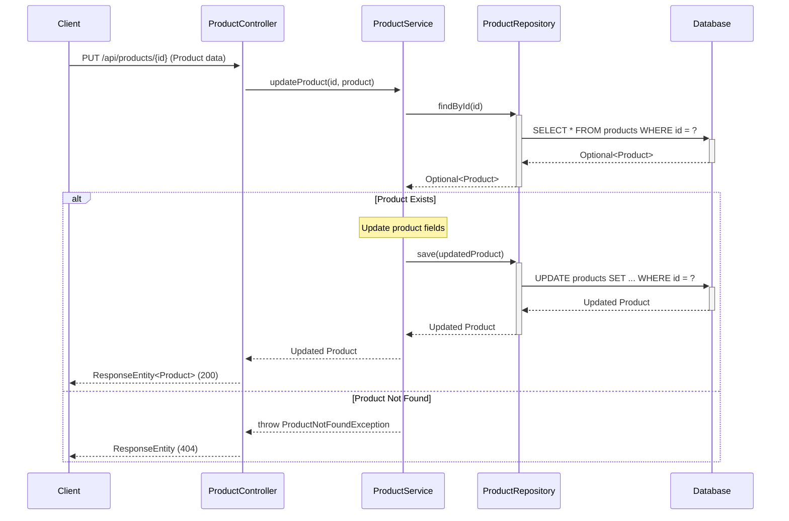

### 3.5 Delete Product

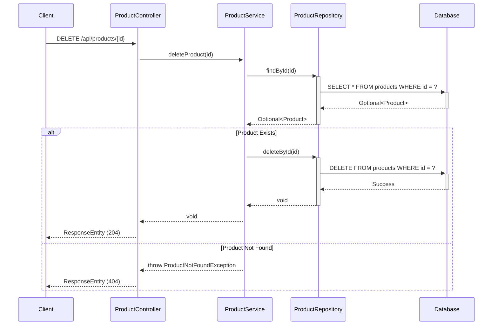

### 3.6 Get Products By Category

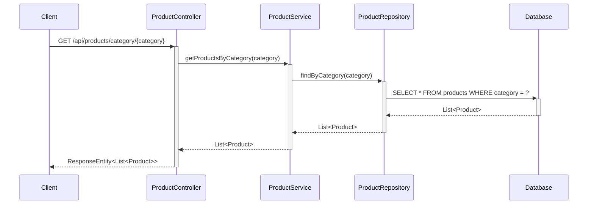

### 3.7 Search Products

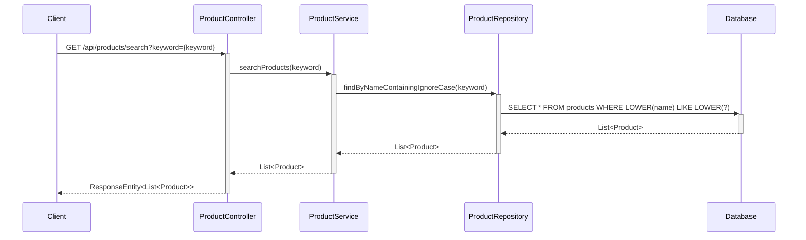

### 3.8 Add Item to Cart

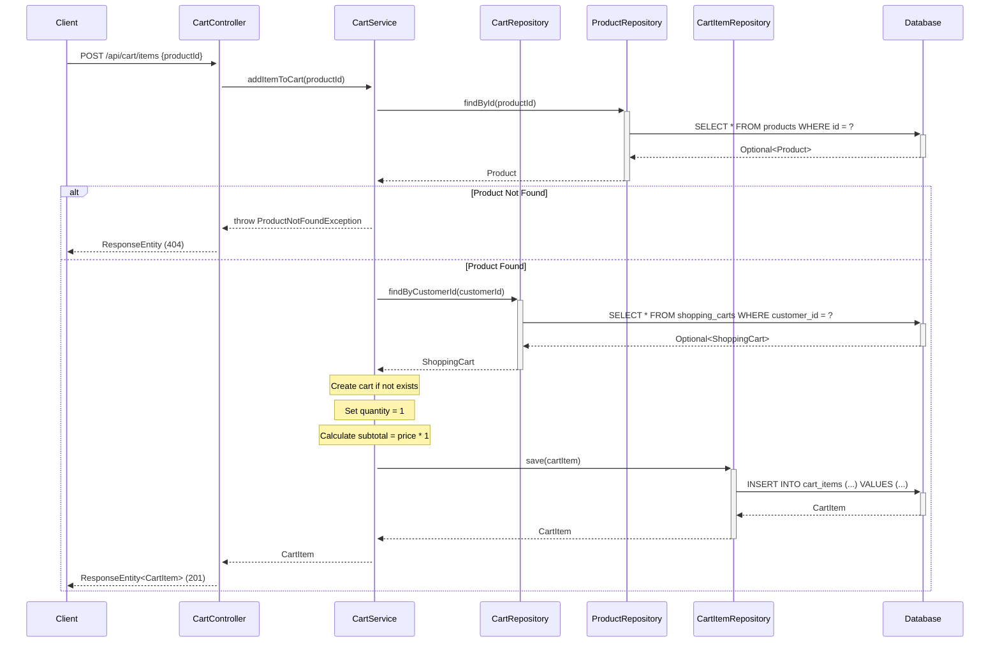

### 3.9 View Cart

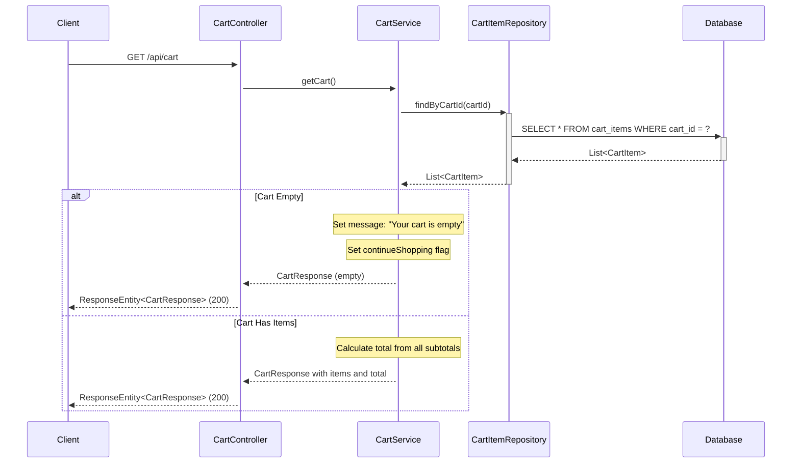

### 3.10 Update Item Quantity

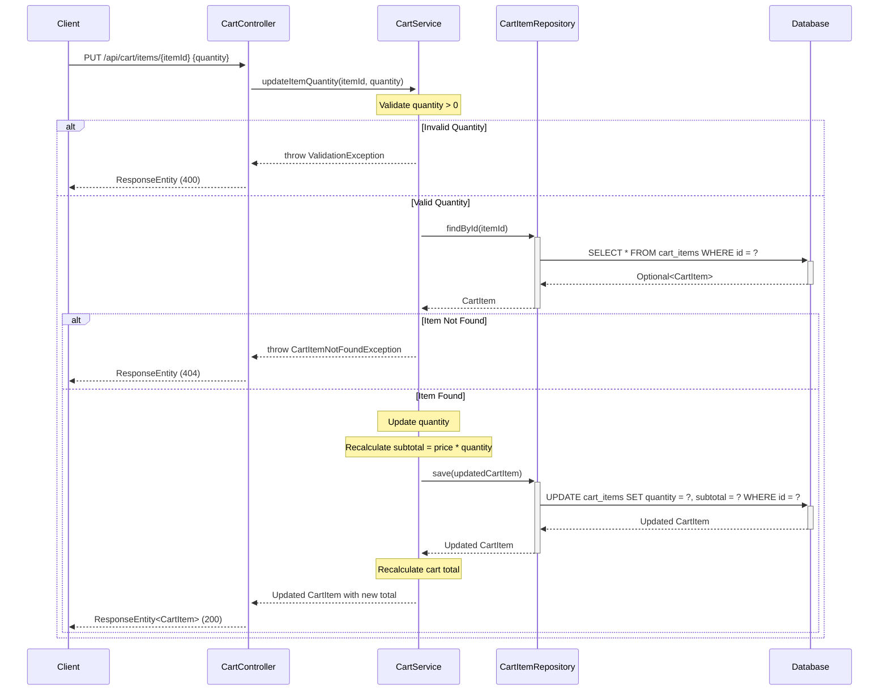

### 3.11 Remove Item from Cart

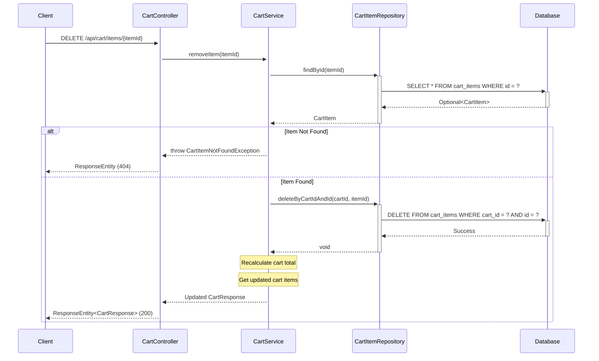

## 4. API Endpoints Summary

| Method | Endpoint | Description | Request Body | Response |
|--------|----------|-------------|--------------|----------|
| GET | `/api/products` | Get all products | None | List<Product> |
| GET | `/api/products/{id}` | Get product by ID | None | Product |
| POST | `/api/products` | Create new product | Product | Product |
| PUT | `/api/products/{id}` | Update existing product | Product | Product |
| DELETE | `/api/products/{id}` | Delete product | None | None |
| GET | `/api/products/category/{category}` | Get products by category | None | List<Product> |
| GET | `/api/products/search?keyword={keyword}` | Search products by name | None | List<Product> |
| POST | `/api/cart/items` | Add product to cart | {productId: Long} | CartItem |
| GET | `/api/cart` | View all cart items | None | CartResponse |
| PUT | `/api/cart/items/{itemId}` | Update item quantity | {quantity: Integer} | CartItem |
| DELETE | `/api/cart/items/{itemId}` | Remove item from cart | None | CartResponse |

## 5. Database Schema

### Products Table

```sql
CREATE TABLE products (
    id BIGINT PRIMARY KEY AUTO_INCREMENT,
    name VARCHAR(255) NOT NULL,
    description TEXT,
    price DECIMAL(10,2) NOT NULL,
    category VARCHAR(100) NOT NULL,
    stock_quantity INTEGER NOT NULL DEFAULT 0,
    created_at TIMESTAMP NOT NULL DEFAULT CURRENT_TIMESTAMP
);

CREATE INDEX idx_products_category ON products(category);
CREATE INDEX idx_products_name ON products(name);
```

### Shopping Carts Table

```sql
CREATE TABLE shopping_carts (
    id BIGINT PRIMARY KEY AUTO_INCREMENT,
    customer_id BIGINT NOT NULL,
    created_at TIMESTAMP NOT NULL DEFAULT CURRENT_TIMESTAMP,
    updated_at TIMESTAMP NOT NULL DEFAULT CURRENT_TIMESTAMP ON UPDATE CURRENT_TIMESTAMP,
    status VARCHAR(50) NOT NULL DEFAULT 'ACTIVE'
);

CREATE INDEX idx_shopping_carts_customer_id ON shopping_carts(customer_id);
```

### Cart Items Table

```sql
CREATE TABLE cart_items (
    id BIGINT PRIMARY KEY AUTO_INCREMENT,
    cart_id BIGINT NOT NULL,
    product_id BIGINT NOT NULL,
    product_name VARCHAR(255) NOT NULL,
    product_price DECIMAL(10,2) NOT NULL,
    quantity INTEGER NOT NULL DEFAULT 1,
    subtotal DECIMAL(10,2) NOT NULL,
    FOREIGN KEY (cart_id) REFERENCES shopping_carts(id) ON DELETE CASCADE,
    FOREIGN KEY (product_id) REFERENCES products(id)
);

CREATE INDEX idx_cart_items_cart_id ON cart_items(cart_id);
CREATE INDEX idx_cart_items_product_id ON cart_items(product_id);
```

## 6. Technology Stack

- **Backend Framework:** Spring Boot 3.x
- **Language:** Java 21
- **Database:** PostgreSQL
- **ORM:** Spring Data JPA / Hibernate
- **Build Tool:** Maven/Gradle
- **API Documentation:** Swagger/OpenAPI 3

## 7. Design Patterns Used

1. **MVC Pattern:** Separation of Controller, Service, and Repository layers
2. **Repository Pattern:** Data access abstraction through ProductRepository
3. **Dependency Injection:** Spring's IoC container manages dependencies
4. **DTO Pattern:** Data Transfer Objects for API requests/responses
5. **Exception Handling:** Custom exceptions for business logic errors

## 8. Key Features

- RESTful API design following HTTP standards
- Proper HTTP status codes for different scenarios
- Input validation and error handling
- Database indexing for performance optimization
- Transactional operations for data consistency
- Pagination support for large datasets (can be extended)
- Search functionality with case-insensitive matching

## 9. Business Logic

### 9.1 Cart Calculation Logic

**Automatic Recalculation:**
- When item quantity is updated, the system automatically recalculates:
  - Item subtotal = product price × quantity
  - Cart total = sum of all item subtotals
- All calculations are performed in the CartService layer
- Subtotals and totals are persisted to ensure consistency

**Empty Cart Handling:**
- When cart has no items, the system returns:
  - Message: "Your cart is empty"
  - Flag: continueShopping = true
  - Empty items list
  - Total = 0.00

## 10. Validation Rules

### 10.1 Cart Item Quantity Validation

**Rule:** Quantity must be a positive integer (>= 1)

**Validation Logic:**
```java
if (quantity == null || quantity < 1) {
    throw new ValidationException("Quantity must be a positive integer (>= 1)");
}
```

**Error Response:**
- HTTP Status: 400 Bad Request
- Error Message: "Quantity must be a positive integer (>= 1)"

**Special Cases:**
- If quantity is 0 or negative: Return validation error
- If quantity is null: Return validation error
- To remove an item: Use DELETE endpoint instead of setting quantity to 0
