## 3. Sequence Diagrams

### 3.1 Get All Products

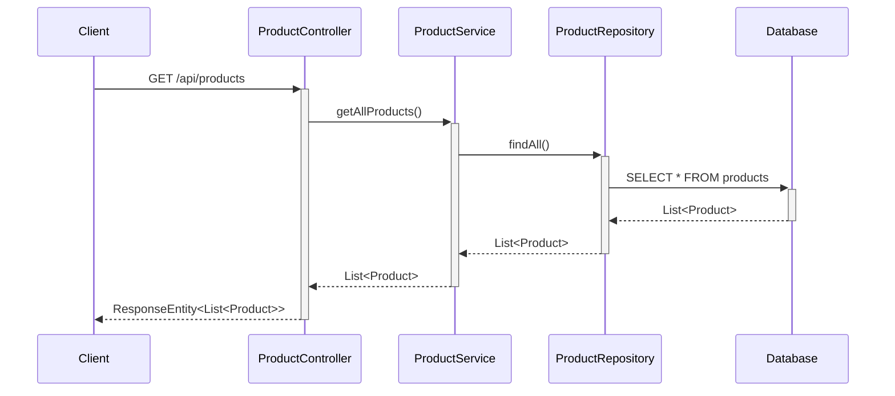

### 3.2 Get Product By ID

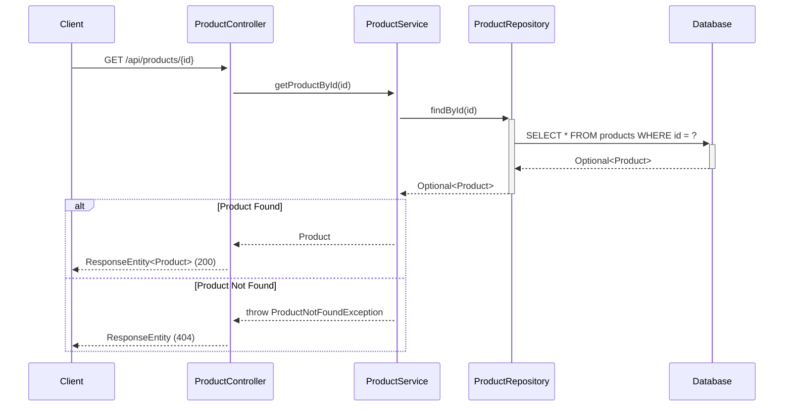

### 3.3 Create Product

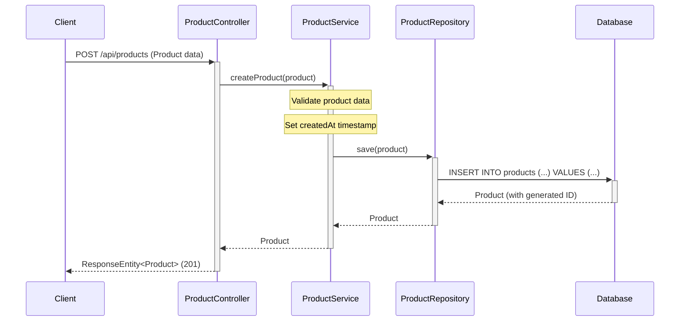

### 3.4 Update Product

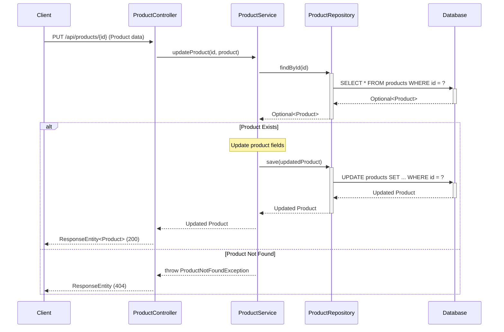

### 3.5 Delete Product

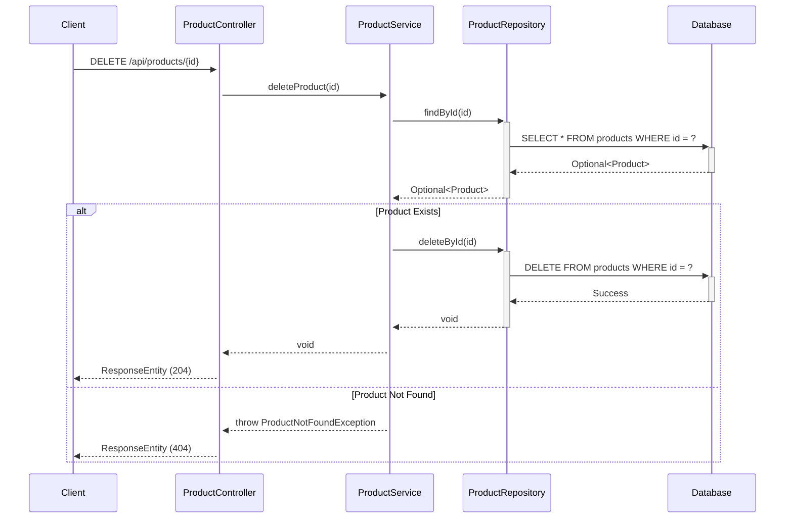

### 3.6 Get Products By Category

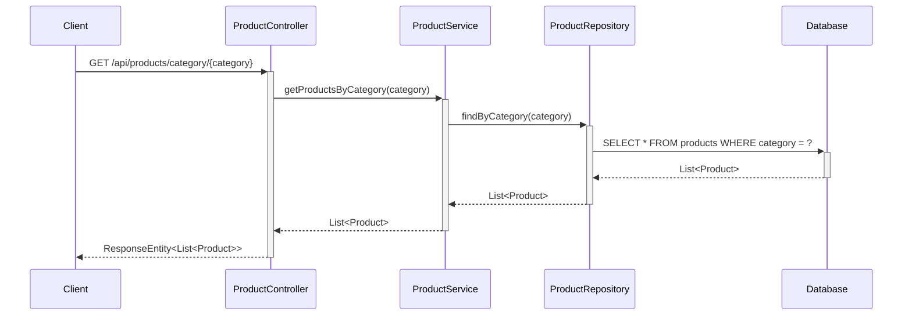

### 3.7 Search Products

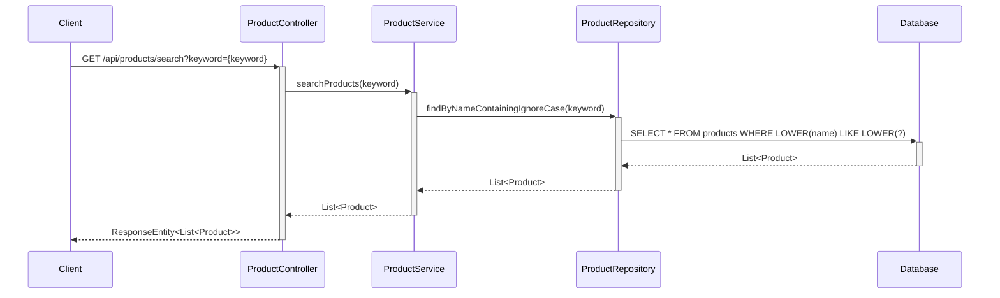

### 3.8 Add Product to Cart

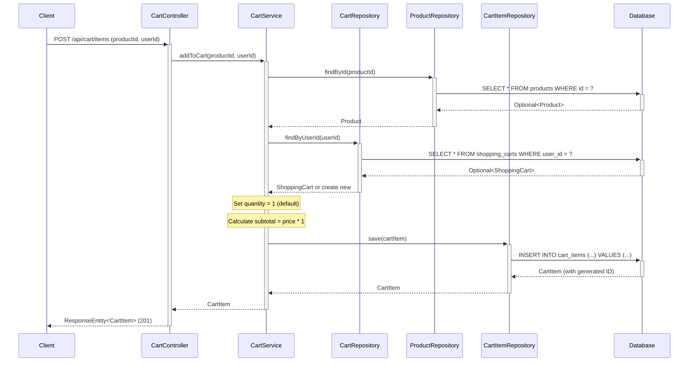

### 3.9 View Shopping Cart

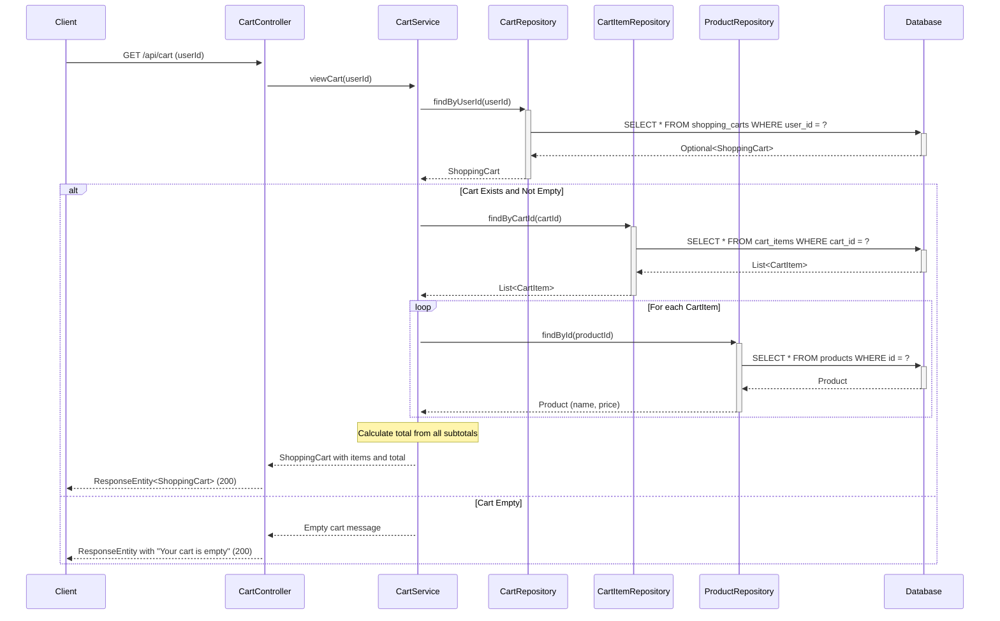

### 3.10 Update Cart Item Quantity

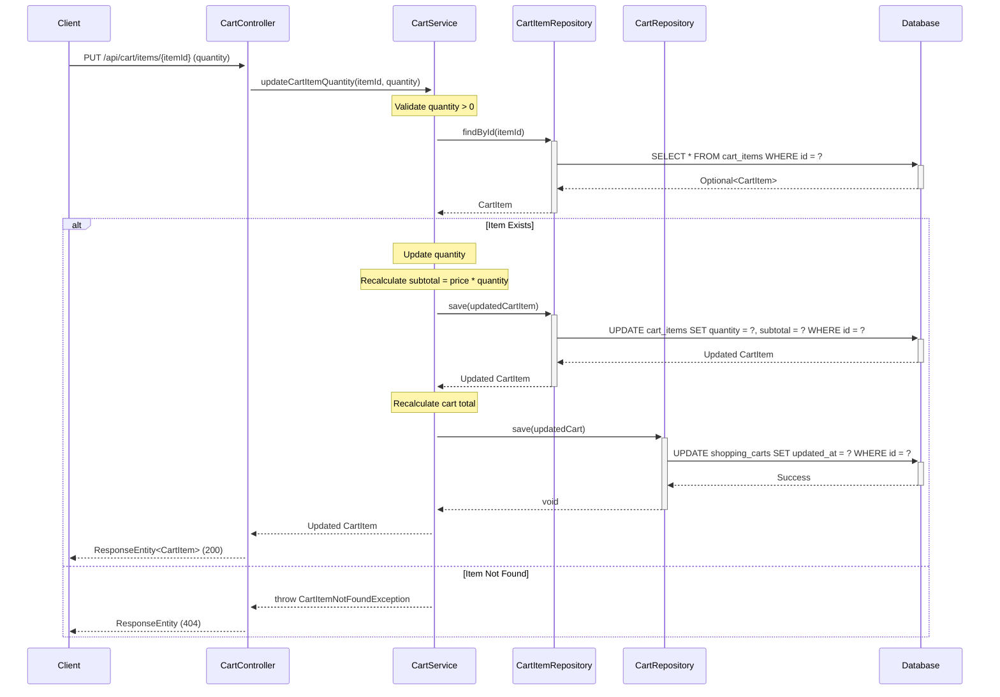

### 3.11 Remove Cart Item

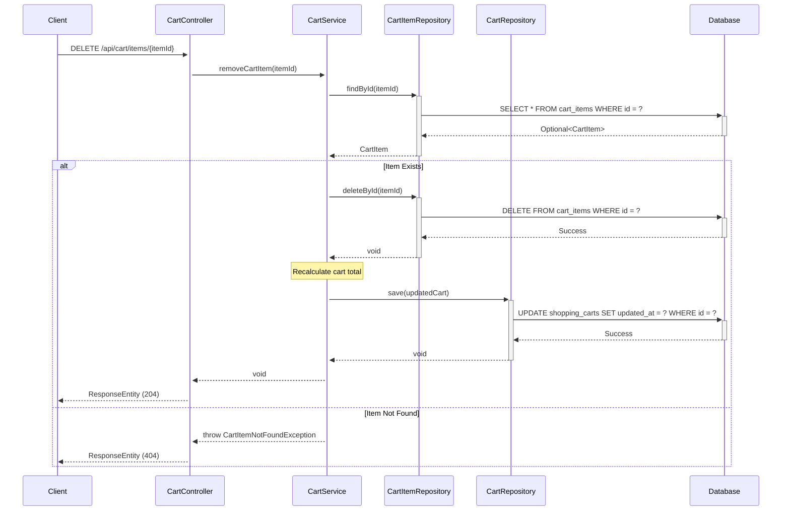

## 4. API Endpoints Summary

### Product Management Endpoints

| Method | Endpoint | Description | Request Body | Response |
|--------|----------|-------------|--------------|----------|
| GET | `/api/products` | Get all products | None | List<Product> |
| GET | `/api/products/{id}` | Get product by ID | None | Product |
| POST | `/api/products` | Create new product | Product | Product |
| PUT | `/api/products/{id}` | Update existing product | Product | Product |
| DELETE | `/api/products/{id}` | Delete product | None | None |
| GET | `/api/products/category/{category}` | Get products by category | None | List<Product> |
| GET | `/api/products/search?keyword={keyword}` | Search products by name | None | List<Product> |

### Shopping Cart Endpoints

| Method | Endpoint | Description | Request Body | Response |
|--------|----------|-------------|--------------|----------|
| POST | `/api/cart/items` | Add product to cart with quantity 1 | {"productId": Long, "userId": Long} | CartItem |
| GET | `/api/cart` | View cart with all items, names, prices, quantities, subtotals | Query param: userId | ShoppingCart |
| PUT | `/api/cart/items/{itemId}` | Update cart item quantity with automatic recalculation | {"quantity": Integer} | CartItem |
| DELETE | `/api/cart/items/{itemId}` | Remove item from cart and update totals | None | None |

## 5. Database Schema

### Products Table

```sql
CREATE TABLE products (
    id BIGINT PRIMARY KEY AUTO_INCREMENT,
    name VARCHAR(255) NOT NULL,
    description TEXT,
    price DECIMAL(10,2) NOT NULL,
    category VARCHAR(100) NOT NULL,
    stock_quantity INTEGER NOT NULL DEFAULT 0,
    created_at TIMESTAMP NOT NULL DEFAULT CURRENT_TIMESTAMP
);

CREATE INDEX idx_products_category ON products(category);
CREATE INDEX idx_products_name ON products(name);
```

### Shopping Carts Table

```sql
CREATE TABLE shopping_carts (
    id BIGINT PRIMARY KEY AUTO_INCREMENT,
    user_id BIGINT NOT NULL,
    created_at TIMESTAMP NOT NULL DEFAULT CURRENT_TIMESTAMP,
    updated_at TIMESTAMP NOT NULL DEFAULT CURRENT_TIMESTAMP ON UPDATE CURRENT_TIMESTAMP,
    status VARCHAR(50) NOT NULL DEFAULT 'ACTIVE'
);

CREATE INDEX idx_shopping_carts_user_id ON shopping_carts(user_id);
CREATE INDEX idx_shopping_carts_status ON shopping_carts(status);
```

### Cart Items Table

```sql
CREATE TABLE cart_items (
    id BIGINT PRIMARY KEY AUTO_INCREMENT,
    cart_id BIGINT NOT NULL,
    product_id BIGINT NOT NULL,
    quantity INTEGER NOT NULL DEFAULT 1,
    price DECIMAL(10,2) NOT NULL,
    subtotal DECIMAL(10,2) NOT NULL,
    added_at TIMESTAMP NOT NULL DEFAULT CURRENT_TIMESTAMP,
    FOREIGN KEY (cart_id) REFERENCES shopping_carts(id) ON DELETE CASCADE,
    FOREIGN KEY (product_id) REFERENCES products(id) ON DELETE CASCADE
);

CREATE INDEX idx_cart_items_cart_id ON cart_items(cart_id);
CREATE INDEX idx_cart_items_product_id ON cart_items(product_id);
```

## 6. Technology Stack

- **Backend Framework:** Spring Boot 3.x
- **Language:** Java 21
- **Database:** PostgreSQL
- **ORM:** Spring Data JPA / Hibernate
- **Build Tool:** Maven/Gradle
- **API Documentation:** Swagger/OpenAPI 3

## 7. Design Patterns Used

1. **MVC Pattern:** Separation of Controller, Service, and Repository layers
2. **Repository Pattern:** Data access abstraction through ProductRepository
3. **Dependency Injection:** Spring's IoC container manages dependencies
4. **DTO Pattern:** Data Transfer Objects for API requests/responses
5. **Exception Handling:** Custom exceptions for business logic errors

## 8. Key Features

- RESTful API design following HTTP standards
- Proper HTTP status codes for different scenarios
- Input validation and error handling
- Database indexing for performance optimization
- Transactional operations for data consistency
- Pagination support for large datasets (can be extended)
- Search functionality with case-insensitive matching

## 9. Business Logic Rules

### Product Management
- Product prices must be positive decimal values
- Stock quantity cannot be negative
- Product names are required and must be unique within a category
- Category is mandatory for all products

### Shopping Cart Management

#### Add to Cart
- When adding a product to cart, default quantity is set to 1
- Product must exist in the products table before adding to cart
- If cart doesn't exist for user, create new cart automatically
- Cart item price is captured from product price at time of addition

#### View Cart
- Display all cart items with product name, price, quantity, and subtotal
- Calculate and display cart total (sum of all subtotals)
- If cart is empty, return message: "Your cart is empty" with link to continue shopping
- Include product details by joining with products table

#### Update Quantity
- Quantity must be a positive integer (> 0)
- Automatically recalculate subtotal when quantity changes: subtotal = price × quantity
- Automatically recalculate cart total after quantity update
- Update cart's updated_at timestamp
- Validate that cart item exists before updating

#### Remove Item
- Validate that cart item exists before deletion
- Automatically recalculate cart total after item removal
- Update cart's updated_at timestamp
- If last item is removed, cart remains but becomes empty

#### Calculation Rules
- Subtotal = Item Price × Quantity
- Cart Total = Sum of all item subtotals in the cart
- All monetary calculations use DECIMAL(10,2) precision
- Recalculation is triggered automatically on any quantity change or item removal

## 10. Validation Rules

### Product Validation
- Name: Required, max length 255 characters
- Price: Required, must be positive, max 2 decimal places
- Category: Required, max length 100 characters
- Stock Quantity: Required, must be non-negative integer

### Cart Validation
- User ID: Required for all cart operations
- Product ID: Must reference existing product
- Quantity: Must be positive integer (≥ 1)
- When adding product to cart, default quantity must be set to 1
- Quantity updates must trigger automatic recalculation of subtotal and total
- Cart item must exist before update or delete operations
