## 3. Sequence Diagrams

### 3.1 Get All Products

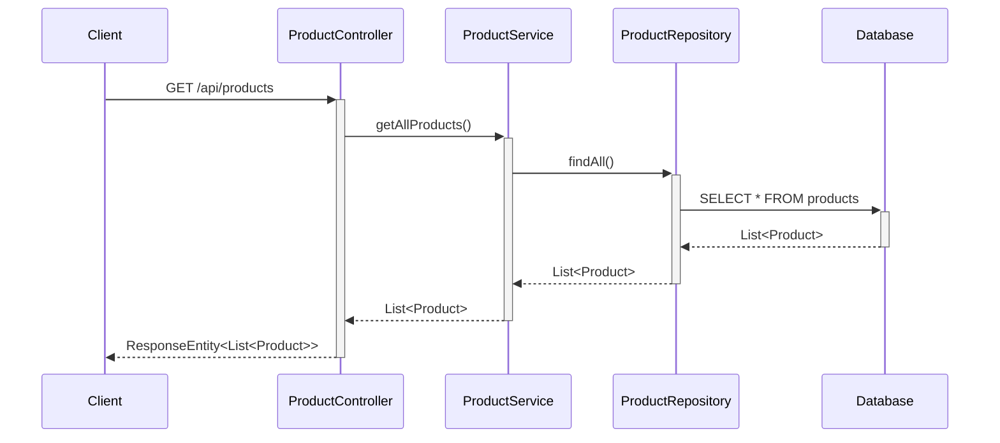

### 3.2 Get Product By ID

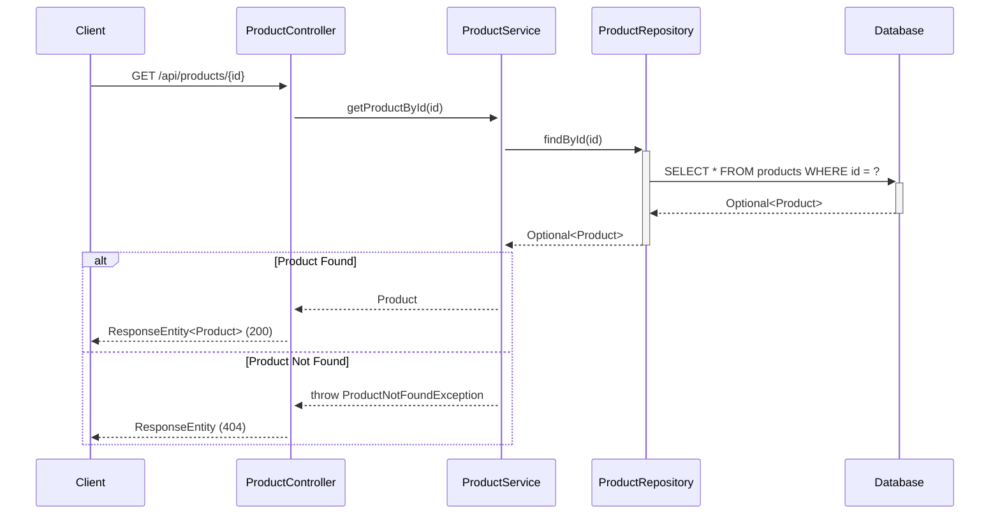

### 3.3 Create Product

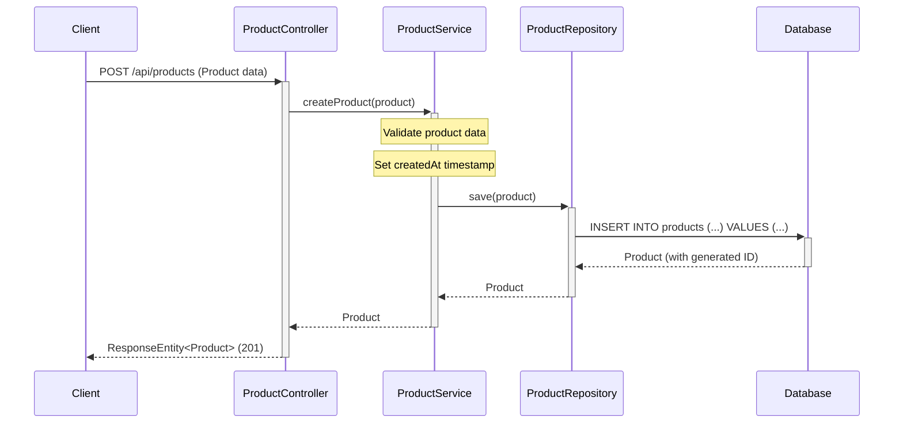

### 3.4 Update Product

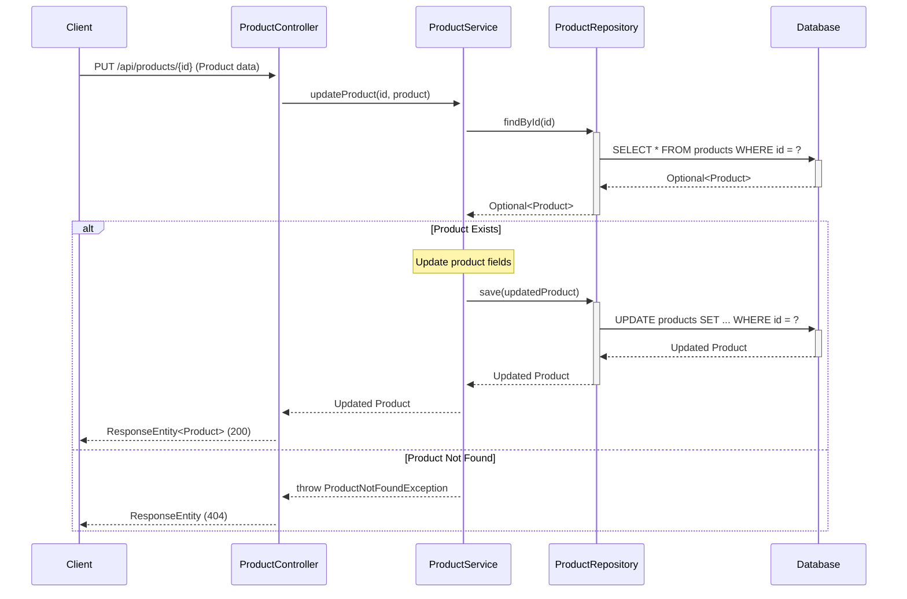

### 3.5 Delete Product

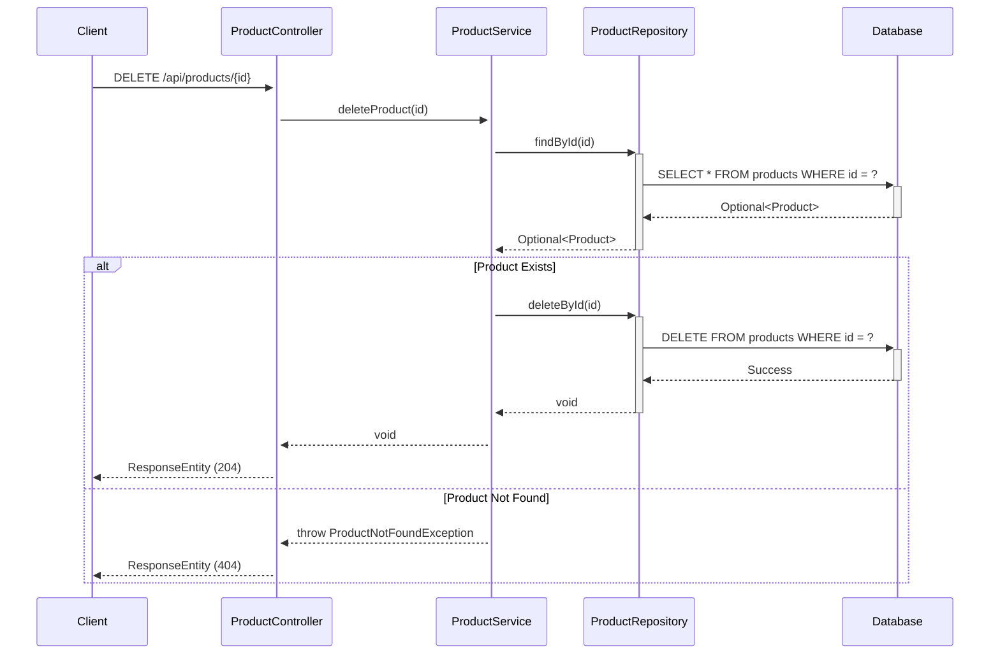

### 3.6 Get Products By Category

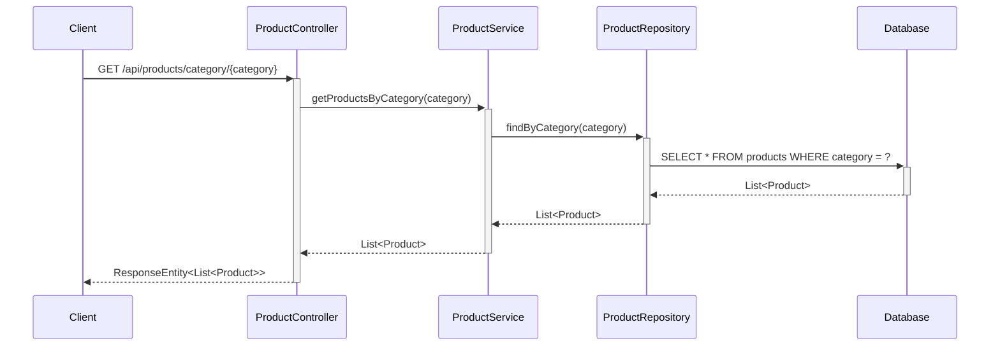

### 3.7 Search Products

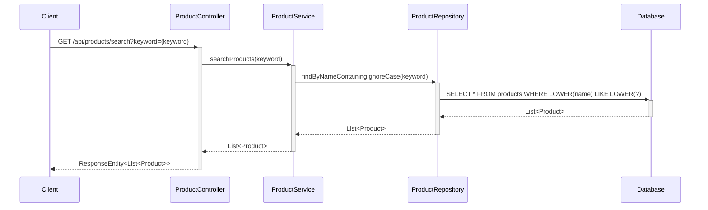

### 3.8 Add Product to Cart

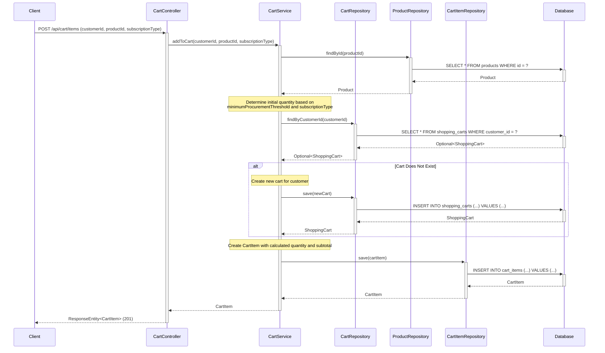

### 3.9 Update Cart Item Quantity

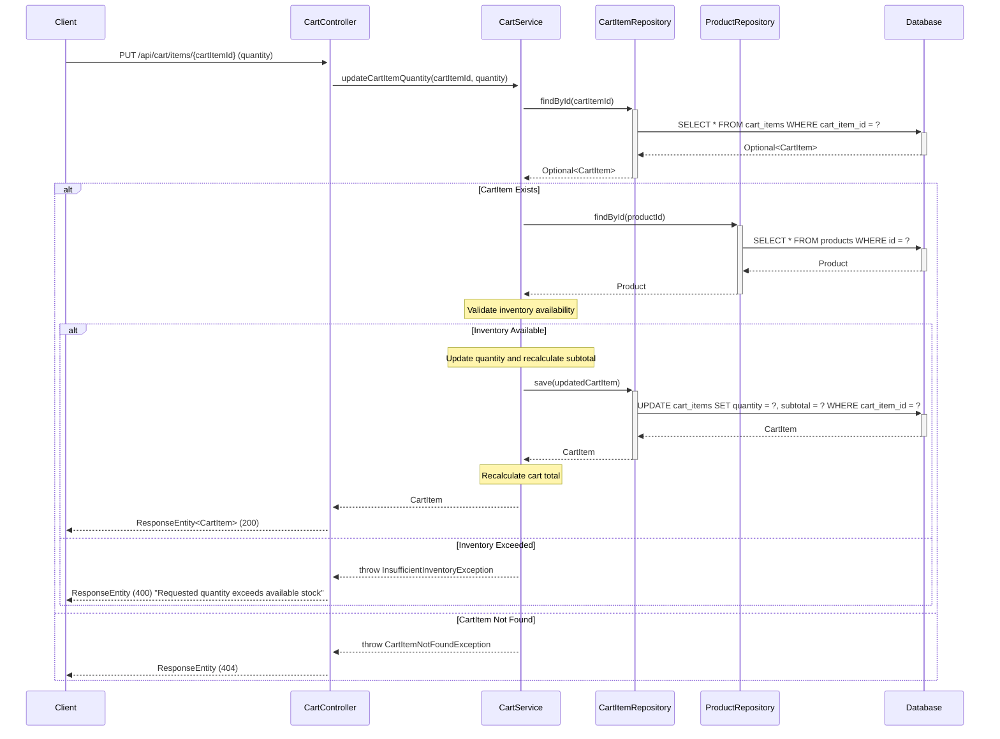

### 3.10 Remove Cart Item

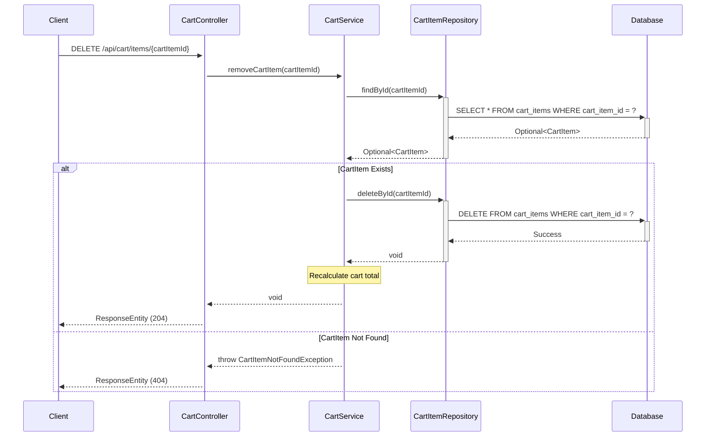

### 3.11 Get Shopping Cart

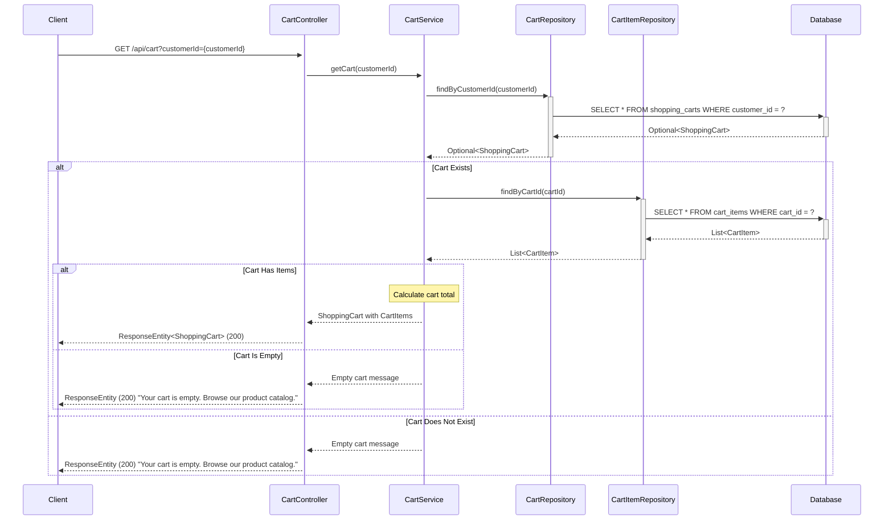

## 4. API Endpoints Summary

| Method | Endpoint | Description | Request Body | Response |
|--------|----------|-------------|--------------|----------|
| GET | `/api/products` | Get all products | None | List<Product> |
| GET | `/api/products/{id}` | Get product by ID | None | Product |
| POST | `/api/products` | Create new product | Product | Product |
| PUT | `/api/products/{id}` | Update existing product | Product | Product |
| DELETE | `/api/products/{id}` | Delete product | None | None |
| GET | `/api/products/category/{category}` | Get products by category | None | List<Product> |
| GET | `/api/products/search?keyword={keyword}` | Search products by name | None | List<Product> |
| POST | `/api/cart/items` | Add product to cart | {customerId, productId, subscriptionType} | CartItem |
| GET | `/api/cart?customerId={customerId}` | Get shopping cart with all items | None | ShoppingCart |
| PUT | `/api/cart/items/{cartItemId}` | Update cart item quantity | {quantity} | CartItem |
| DELETE | `/api/cart/items/{cartItemId}` | Remove item from cart | None | None |

## 5. Database Schema

### Products Table

```sql
CREATE TABLE products (
    id BIGINT PRIMARY KEY AUTO_INCREMENT,
    name VARCHAR(255) NOT NULL,
    description TEXT,
    price DECIMAL(10,2) NOT NULL,
    category VARCHAR(100) NOT NULL,
    stock_quantity INTEGER NOT NULL DEFAULT 0,
    minimum_procurement_threshold INTEGER,
    created_at TIMESTAMP NOT NULL DEFAULT CURRENT_TIMESTAMP
);

CREATE INDEX idx_products_category ON products(category);
CREATE INDEX idx_products_name ON products(name);
```

### Shopping Carts Table

```sql
CREATE TABLE shopping_carts (
    cart_id BIGINT PRIMARY KEY AUTO_INCREMENT,
    customer_id BIGINT NOT NULL,
    created_at TIMESTAMP NOT NULL DEFAULT CURRENT_TIMESTAMP,
    updated_at TIMESTAMP NOT NULL DEFAULT CURRENT_TIMESTAMP ON UPDATE CURRENT_TIMESTAMP,
    status VARCHAR(50) NOT NULL DEFAULT 'ACTIVE',
    UNIQUE KEY uk_customer_cart (customer_id)
);

CREATE INDEX idx_shopping_carts_customer ON shopping_carts(customer_id);
```

### Cart Items Table

```sql
CREATE TABLE cart_items (
    cart_item_id BIGINT PRIMARY KEY AUTO_INCREMENT,
    cart_id BIGINT NOT NULL,
    product_id BIGINT NOT NULL,
    quantity INTEGER NOT NULL DEFAULT 1,
    unit_price DECIMAL(10,2) NOT NULL,
    subtotal DECIMAL(10,2) NOT NULL,
    minimum_procurement_threshold INTEGER,
    subscription_type VARCHAR(50) NOT NULL,
    created_at TIMESTAMP NOT NULL DEFAULT CURRENT_TIMESTAMP,
    updated_at TIMESTAMP NOT NULL DEFAULT CURRENT_TIMESTAMP ON UPDATE CURRENT_TIMESTAMP,
    FOREIGN KEY (cart_id) REFERENCES shopping_carts(cart_id) ON DELETE CASCADE,
    FOREIGN KEY (product_id) REFERENCES products(id) ON DELETE CASCADE
);

CREATE INDEX idx_cart_items_cart ON cart_items(cart_id);
CREATE INDEX idx_cart_items_product ON cart_items(product_id);
```

## 6. Technology Stack

- **Backend Framework:** Spring Boot 3.x
- **Language:** Java 21
- **Database:** PostgreSQL
- **ORM:** Spring Data JPA / Hibernate
- **Build Tool:** Maven/Gradle
- **API Documentation:** Swagger/OpenAPI 3

## 7. Design Patterns Used

1. **MVC Pattern:** Separation of Controller, Service, and Repository layers
2. **Repository Pattern:** Data access abstraction through ProductRepository
3. **Dependency Injection:** Spring's IoC container manages dependencies
4. **DTO Pattern:** Data Transfer Objects for API requests/responses
5. **Exception Handling:** Custom exceptions for business logic errors

## 8. Key Features

- RESTful API design following HTTP standards
- Proper HTTP status codes for different scenarios
- Input validation and error handling
- Database indexing for performance optimization
- Transactional operations for data consistency
- Pagination support for large datasets (can be extended)
- Search functionality with case-insensitive matching

## 9. Shopping Cart Business Logic

### 9.1 Add to Cart Logic

When a product is added to the cart:

1. **Quantity Determination:**
   - If product has `minimumProcurementThreshold` set, use that value as initial quantity
   - Otherwise, default quantity is 1
   - For subscription-type purchases, quantity may be adjusted based on subscription rules

2. **Cart Creation:**
   - If customer doesn't have an active cart, create a new cart
   - Set cart status to 'ACTIVE'

3. **Cart Item Creation:**
   - Create cart item with determined quantity
   - Set unit price from product price
   - Calculate subtotal = quantity × unit price
   - Store subscription type (one-time or subscription)

### 9.2 Inventory Validation

Before adding or updating cart items:

1. Check if requested quantity ≤ product stock_quantity
2. If validation fails, return error: "Requested quantity exceeds available stock"
3. Prevent cart operations that would exceed inventory

### 9.3 Empty Cart Handling

When retrieving a cart:

1. If cart doesn't exist or has no items
2. Return message: "Your cart is empty. Browse our product catalog."
3. Provide navigation option to product listing

### 9.4 Real-time Total Calculation

On quantity update or item removal:

1. Recalculate subtotal for affected item: subtotal = quantity × unit_price
2. Recalculate cart total: sum of all cart item subtotals
3. Return updated values without page refresh
