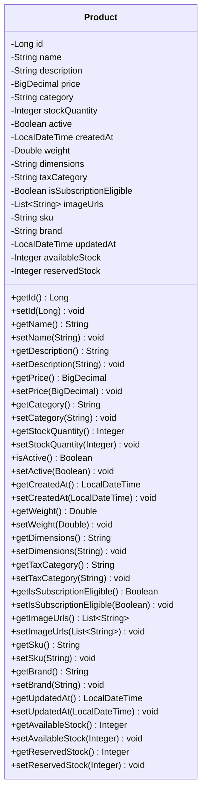

## 3. Core Components

### 3.1 Product Entity

#### 3.1.1 Product Class Diagram



#### 3.1.2 Product Entity Implementation

```java
package com.ecommerce.product.entity;

import jakarta.persistence.*;
import lombok.AllArgsConstructor;
import lombok.Builder;
import lombok.Data;
import lombok.NoArgsConstructor;
import java.math.BigDecimal;
import java.time.LocalDateTime;
import java.util.List;

@Entity
@Table(name = "products", indexes = {
    @Index(name = "idx_product_category", columnList = "category"),
    @Index(name = "idx_product_active", columnList = "active"),
    @Index(name = "idx_product_sku", columnList = "sku", unique = true)
})
@Data
@Builder
@NoArgsConstructor
@AllArgsConstructor
public class Product {
    
    @Id
    @GeneratedValue(strategy = GenerationType.IDENTITY)
    private Long id;
    
    @Column(nullable = false, length = 255)
    private String name;
    
    @Column(columnDefinition = "TEXT")
    private String description;
    
    @Column(nullable = false, precision = 10, scale = 2)
    private BigDecimal price;
    
    @Column(nullable = false, length = 100)
    private String category;
    
    @Column(name = "stock_quantity", nullable = false)
    private Integer stockQuantity;
    
    @Column(nullable = false)
    private Boolean active = true;
    
    @Column(name = "created_at", nullable = false, updatable = false)
    private LocalDateTime createdAt;
    
    @Column(name = "updated_at")
    private LocalDateTime updatedAt;
    
    @Column(precision = 10, scale = 2)
    private Double weight;
    
    @Column(length = 100)
    private String dimensions;
    
    @Column(name = "tax_category", length = 50)
    private String taxCategory;
    
    @Column(name = "is_subscription_eligible")
    private Boolean isSubscriptionEligible = false;
    
    @ElementCollection
    @CollectionTable(name = "product_images", joinColumns = @JoinColumn(name = "product_id"))
    @Column(name = "image_url")
    private List<String> imageUrls;
    
    @Column(unique = true, nullable = false, length = 100)
    private String sku;
    
    @Column(length = 100)
    private String brand;
    
    @Column(name = "available_stock")
    private Integer availableStock;
    
    @Column(name = "reserved_stock")
    private Integer reservedStock = 0;
    
    @PrePersist
    protected void onCreate() {
        createdAt = LocalDateTime.now();
        updatedAt = LocalDateTime.now();
        if (availableStock == null) {
            availableStock = stockQuantity;
        }
    }
    
    @PreUpdate
    protected void onUpdate() {
        updatedAt = LocalDateTime.now();
    }
}
```

### 3.2 Product Controller

#### 3.2.1 REST API Endpoints

```java
package com.ecommerce.product.controller;

import com.ecommerce.product.dto.ProductDTO;
import com.ecommerce.product.dto.ProductSearchRequest;
import com.ecommerce.product.dto.ProductResponse;
import com.ecommerce.product.service.ProductService;
import io.swagger.v3.oas.annotations.Operation;
import io.swagger.v3.oas.annotations.tags.Tag;
import jakarta.validation.Valid;
import lombok.RequiredArgsConstructor;
import org.springframework.data.domain.Page;
import org.springframework.data.domain.Pageable;
import org.springframework.http.HttpStatus;
import org.springframework.http.ResponseEntity;
import org.springframework.web.bind.annotation.*;

@RestController
@RequestMapping("/api/v1/products")
@RequiredArgsConstructor
@Tag(name = "Product Management", description = "APIs for managing products")
public class ProductController {
    
    private final ProductService productService;
    
    @PostMapping
    @Operation(summary = "Create a new product")
    public ResponseEntity<ProductResponse> createProduct(@Valid @RequestBody ProductDTO productDTO) {
        ProductResponse response = productService.createProduct(productDTO);
        return ResponseEntity.status(HttpStatus.CREATED).body(response);
    }
    
    @GetMapping("/{id}")
    @Operation(summary = "Get product by ID with real-time availability")
    public ResponseEntity<ProductResponse> getProductById(@PathVariable Long id) {
        ProductResponse response = productService.getProductById(id);
        return ResponseEntity.ok(response);
    }
    
    @GetMapping
    @Operation(summary = "Get all products with pagination")
    public ResponseEntity<Page<ProductResponse>> getAllProducts(Pageable pageable) {
        Page<ProductResponse> products = productService.getAllProducts(pageable);
        return ResponseEntity.ok(products);
    }
    
    @PostMapping("/search")
    @Operation(summary = "Search products with filtering, sorting, and pagination")
    public ResponseEntity<Page<ProductResponse>> searchProducts(
            @Valid @RequestBody ProductSearchRequest searchRequest,
            Pageable pageable) {
        Page<ProductResponse> products = productService.searchProducts(searchRequest, pageable);
        return ResponseEntity.ok(products);
    }
    
    @PutMapping("/{id}")
    @Operation(summary = "Update an existing product")
    public ResponseEntity<ProductResponse> updateProduct(
            @PathVariable Long id,
            @Valid @RequestBody ProductDTO productDTO) {
        ProductResponse response = productService.updateProduct(id, productDTO);
        return ResponseEntity.ok(response);
    }
    
    @PatchMapping("/{id}/deactivate")
    @Operation(summary = "Deactivate a product (soft delete)")
    public ResponseEntity<Void> deactivateProduct(@PathVariable Long id) {
        productService.deactivateProduct(id);
        return ResponseEntity.noContent().build();
    }
    
    @PatchMapping("/{id}/activate")
    @Operation(summary = "Activate a previously deactivated product")
    public ResponseEntity<Void> activateProduct(@PathVariable Long id) {
        productService.activateProduct(id);
        return ResponseEntity.noContent().build();
    }
}
```

### 3.3 Product Service

#### 3.3.1 Service Interface

```java
package com.ecommerce.product.service;

import com.ecommerce.product.dto.ProductDTO;
import com.ecommerce.product.dto.ProductSearchRequest;
import com.ecommerce.product.dto.ProductResponse;
import org.springframework.data.domain.Page;
import org.springframework.data.domain.Pageable;

public interface ProductService {
    ProductResponse createProduct(ProductDTO productDTO);
    ProductResponse getProductById(Long id);
    Page<ProductResponse> getAllProducts(Pageable pageable);
    Page<ProductResponse> searchProducts(ProductSearchRequest searchRequest, Pageable pageable);
    ProductResponse updateProduct(Long id, ProductDTO productDTO);
    void deactivateProduct(Long id);
    void activateProduct(Long id);
    boolean isProductAvailable(Long productId, Integer quantity);
}
```

#### 3.3.2 Service Implementation

```java
package com.ecommerce.product.service.impl;

import com.ecommerce.product.dto.ProductDTO;
import com.ecommerce.product.dto.ProductSearchRequest;
import com.ecommerce.product.dto.ProductResponse;
import com.ecommerce.product.entity.Product;
import com.ecommerce.product.exception.ProductNotFoundException;
import com.ecommerce.product.mapper.ProductMapper;
import com.ecommerce.product.repository.ProductRepository;
import com.ecommerce.product.service.ProductService;
import com.ecommerce.product.specification.ProductSpecification;
import lombok.RequiredArgsConstructor;
import lombok.extern.slf4j.Slf4j;
import org.springframework.cache.annotation.CacheEvict;
import org.springframework.cache.annotation.Cacheable;
import org.springframework.data.domain.Page;
import org.springframework.data.domain.Pageable;
import org.springframework.data.jpa.domain.Specification;
import org.springframework.stereotype.Service;
import org.springframework.transaction.annotation.Transactional;

@Service
@RequiredArgsConstructor
@Slf4j
public class ProductServiceImpl implements ProductService {
    
    private final ProductRepository productRepository;
    private final ProductMapper productMapper;
    
    @Override
    @Transactional
    @CacheEvict(value = "products", allEntries = true)
    public ProductResponse createProduct(ProductDTO productDTO) {
        log.info("Creating new product: {}", productDTO.getName());
        Product product = productMapper.toEntity(productDTO);
        Product savedProduct = productRepository.save(product);
        log.info("Product created successfully with ID: {}", savedProduct.getId());
        return productMapper.toResponse(savedProduct);
    }
    
    @Override
    @Cacheable(value = "products", key = "#id")
    public ProductResponse getProductById(Long id) {
        log.info("Fetching product with ID: {}", id);
        Product product = productRepository.findById(id)
                .orElseThrow(() -> new ProductNotFoundException("Product not found with ID: " + id));
        
        // Calculate real-time availability
        Integer realTimeAvailableStock = product.getStockQuantity() - product.getReservedStock();
        product.setAvailableStock(realTimeAvailableStock);
        
        ProductResponse response = productMapper.toResponse(product);
        response.setAvailabilityStatus(determineAvailabilityStatus(realTimeAvailableStock));
        
        return response;
    }
    
    @Override
    @Cacheable(value = "products")
    public Page<ProductResponse> getAllProducts(Pageable pageable) {
        log.info("Fetching all products with pagination");
        return productRepository.findAll(pageable)
                .map(productMapper::toResponse);
    }
    
    @Override
    public Page<ProductResponse> searchProducts(ProductSearchRequest searchRequest, Pageable pageable) {
        log.info("Searching products with filters: {}", searchRequest);
        
        Specification<Product> spec = Specification.where(null);
        
        if (searchRequest.getName() != null && !searchRequest.getName().isEmpty()) {
            spec = spec.and(ProductSpecification.hasNameContaining(searchRequest.getName()));
        }
        
        if (searchRequest.getCategory() != null && !searchRequest.getCategory().isEmpty()) {
            spec = spec.and(ProductSpecification.hasCategory(searchRequest.getCategory()));
        }
        
        if (searchRequest.getMinPrice() != null) {
            spec = spec.and(ProductSpecification.hasPriceGreaterThanOrEqual(searchRequest.getMinPrice()));
        }
        
        if (searchRequest.getMaxPrice() != null) {
            spec = spec.and(ProductSpecification.hasPriceLessThanOrEqual(searchRequest.getMaxPrice()));
        }
        
        if (searchRequest.getBrand() != null && !searchRequest.getBrand().isEmpty()) {
            spec = spec.and(ProductSpecification.hasBrand(searchRequest.getBrand()));
        }
        
        if (searchRequest.getIsActive() != null) {
            spec = spec.and(ProductSpecification.isActive(searchRequest.getIsActive()));
        }
        
        if (searchRequest.getInStock() != null && searchRequest.getInStock()) {
            spec = spec.and(ProductSpecification.isInStock());
        }
        
        return productRepository.findAll(spec, pageable)
                .map(productMapper::toResponse);
    }
    
    @Override
    @Transactional
    @CacheEvict(value = "products", key = "#id")
    public ProductResponse updateProduct(Long id, ProductDTO productDTO) {
        log.info("Updating product with ID: {}", id);
        Product existingProduct = productRepository.findById(id)
                .orElseThrow(() -> new ProductNotFoundException("Product not found with ID: " + id));
        
        productMapper.updateEntityFromDTO(productDTO, existingProduct);
        Product updatedProduct = productRepository.save(existingProduct);
        log.info("Product updated successfully with ID: {}", id);
        return productMapper.toResponse(updatedProduct);
    }
    
    @Override
    @Transactional
    @CacheEvict(value = "products", key = "#id")
    public void deactivateProduct(Long id) {
        log.info("Deactivating product with ID: {}", id);
        Product product = productRepository.findById(id)
                .orElseThrow(() -> new ProductNotFoundException("Product not found with ID: " + id));
        
        product.setActive(false);
        productRepository.save(product);
        log.info("Product deactivated successfully with ID: {}", id);
    }
    
    @Override
    @Transactional
    @CacheEvict(value = "products", key = "#id")
    public void activateProduct(Long id) {
        log.info("Activating product with ID: {}", id);
        Product product = productRepository.findById(id)
                .orElseThrow(() -> new ProductNotFoundException("Product not found with ID: " + id));
        
        product.setActive(true);
        productRepository.save(product);
        log.info("Product activated successfully with ID: {}", id);
    }
    
    @Override
    public boolean isProductAvailable(Long productId, Integer quantity) {
        Product product = productRepository.findById(productId)
                .orElseThrow(() -> new ProductNotFoundException("Product not found with ID: " + productId));
        
        Integer availableStock = product.getStockQuantity() - product.getReservedStock();
        return product.getActive() && availableStock >= quantity;
    }
    
    private String determineAvailabilityStatus(Integer availableStock) {
        if (availableStock == null || availableStock <= 0) {
            return "OUT_OF_STOCK";
        } else if (availableStock <= 10) {
            return "LOW_STOCK";
        } else {
            return "IN_STOCK";
        }
    }
}
```

### 3.4 Product Repository

```java
package com.ecommerce.product.repository;

import com.ecommerce.product.entity.Product;
import org.springframework.data.jpa.repository.JpaRepository;
import org.springframework.data.jpa.repository.JpaSpecificationExecutor;
import org.springframework.data.jpa.repository.Query;
import org.springframework.stereotype.Repository;
import java.util.List;
import java.util.Optional;

@Repository
public interface ProductRepository extends JpaRepository<Product, Long>, JpaSpecificationExecutor<Product> {
    
    List<Product> findByCategory(String category);
    
    List<Product> findByActiveTrue();
    
    Optional<Product> findBySku(String sku);
    
    @Query("SELECT p FROM Product p WHERE p.active = true AND p.stockQuantity > 0")
    List<Product> findAvailableProducts();
    
    @Query("SELECT p FROM Product p WHERE p.stockQuantity <= :threshold AND p.active = true")
    List<Product> findLowStockProducts(Integer threshold);
}
```

### 3.5 Product Specifications

```java
package com.ecommerce.product.specification;

import com.ecommerce.product.entity.Product;
import org.springframework.data.jpa.domain.Specification;
import java.math.BigDecimal;

public class ProductSpecification {
    
    public static Specification<Product> hasNameContaining(String name) {
        return (root, query, criteriaBuilder) ->
                criteriaBuilder.like(criteriaBuilder.lower(root.get("name")), 
                        "%" + name.toLowerCase() + "%");
    }
    
    public static Specification<Product> hasCategory(String category) {
        return (root, query, criteriaBuilder) ->
                criteriaBuilder.equal(root.get("category"), category);
    }
    
    public static Specification<Product> hasPriceGreaterThanOrEqual(BigDecimal minPrice) {
        return (root, query, criteriaBuilder) ->
                criteriaBuilder.greaterThanOrEqualTo(root.get("price"), minPrice);
    }
    
    public static Specification<Product> hasPriceLessThanOrEqual(BigDecimal maxPrice) {
        return (root, query, criteriaBuilder) ->
                criteriaBuilder.lessThanOrEqualTo(root.get("price"), maxPrice);
    }
    
    public static Specification<Product> hasBrand(String brand) {
        return (root, query, criteriaBuilder) ->
                criteriaBuilder.equal(root.get("brand"), brand);
    }
    
    public static Specification<Product> isActive(Boolean active) {
        return (root, query, criteriaBuilder) ->
                criteriaBuilder.equal(root.get("active"), active);
    }
    
    public static Specification<Product> isInStock() {
        return (root, query, criteriaBuilder) ->
                criteriaBuilder.greaterThan(root.get("stockQuantity"), 0);
    }
}
```
