## 3. Sequence Diagrams

### 3.1 Get All Products

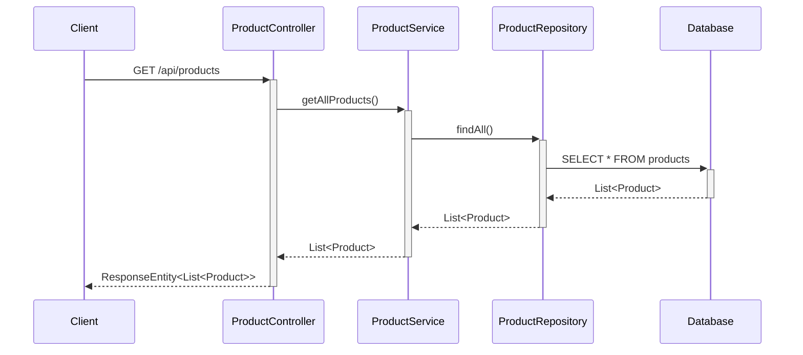

### 3.2 Get Product By ID

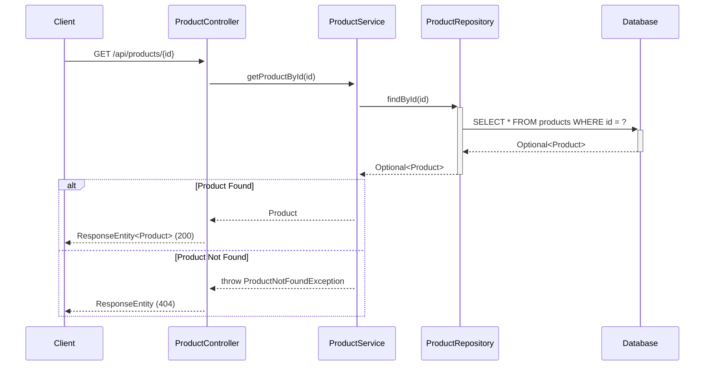

### 3.3 Create Product

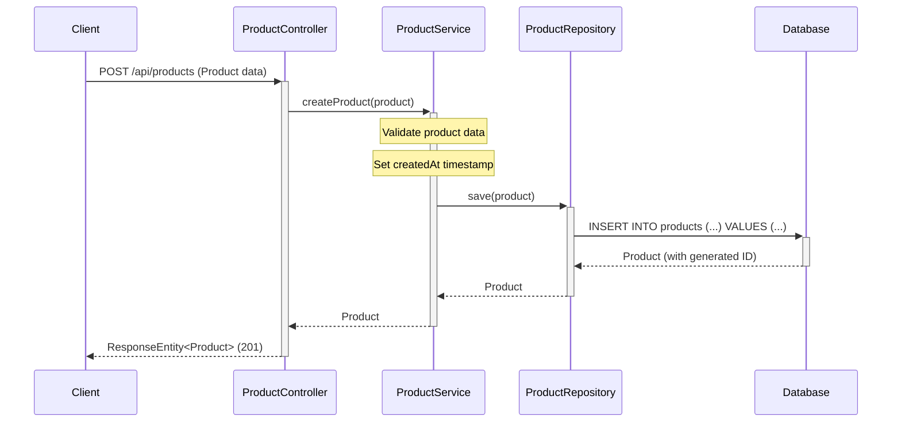

### 3.4 Update Product

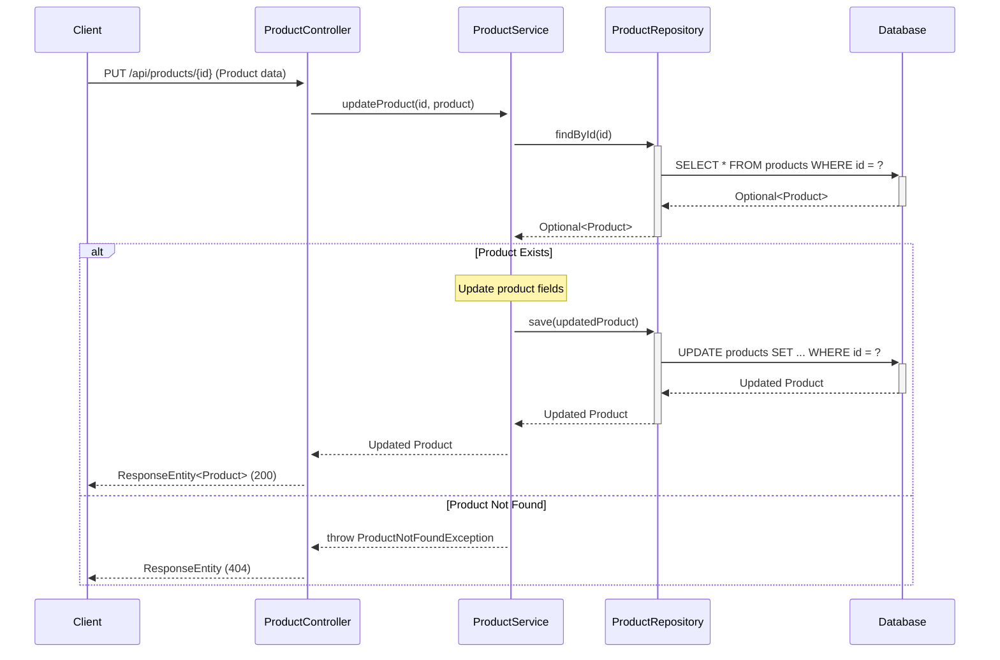

### 3.5 Delete Product

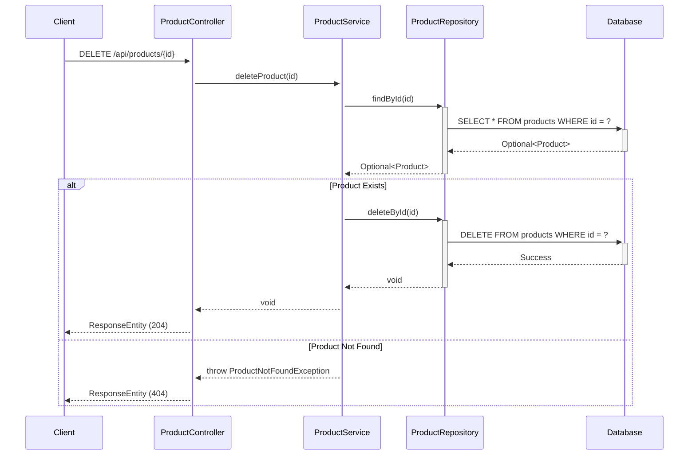

### 3.6 Get Products By Category

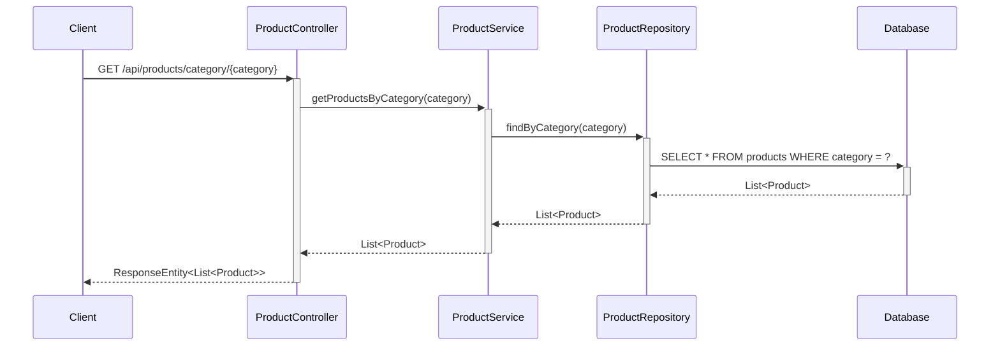

### 3.7 Search Products

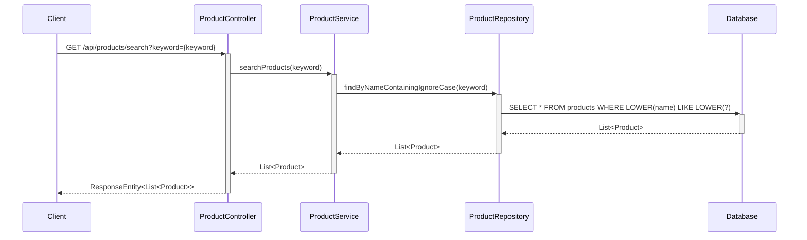

### 3.8 Add Product to Cart

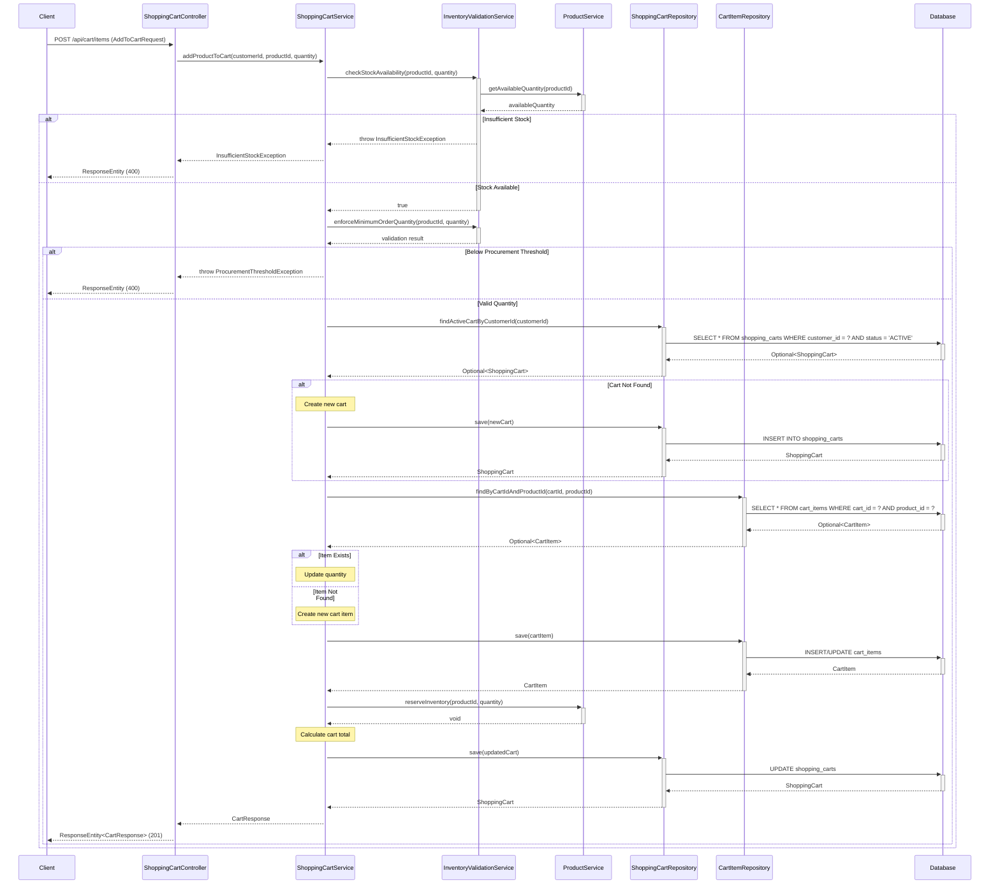

### 3.9 View Shopping Cart

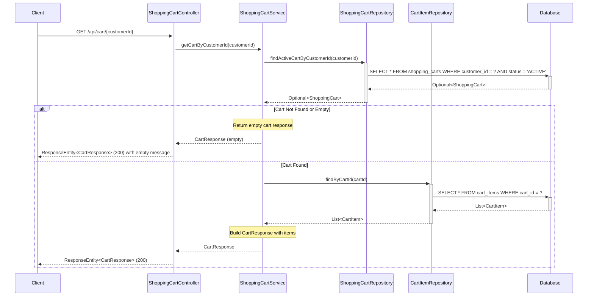

### 3.10 Update Cart Item Quantity

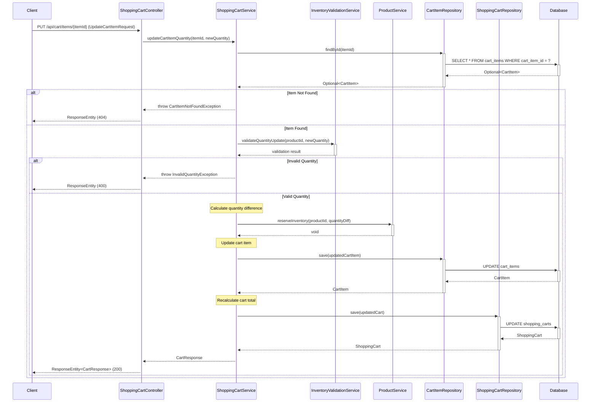

### 3.11 Remove Item from Cart

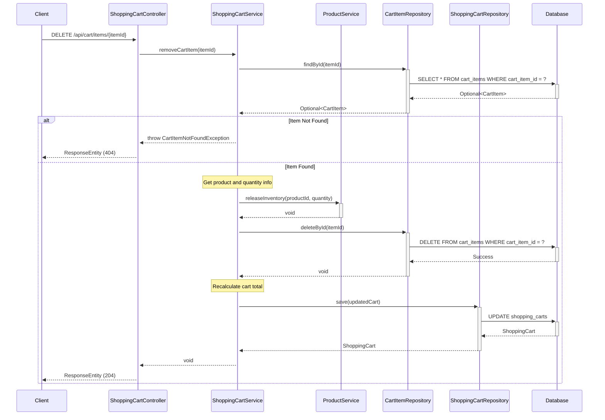

### 3.12 Add to Cart Flow (SCRUM-343 AC-1)

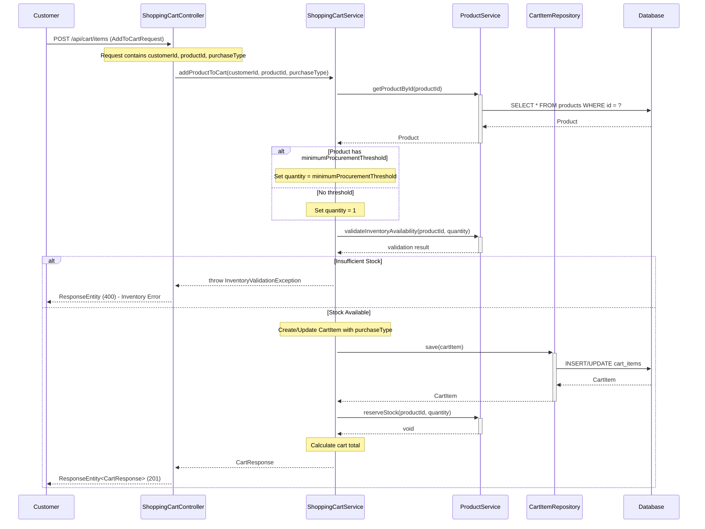

### 3.13 View Cart Flow (SCRUM-343 AC-2, AC-5)

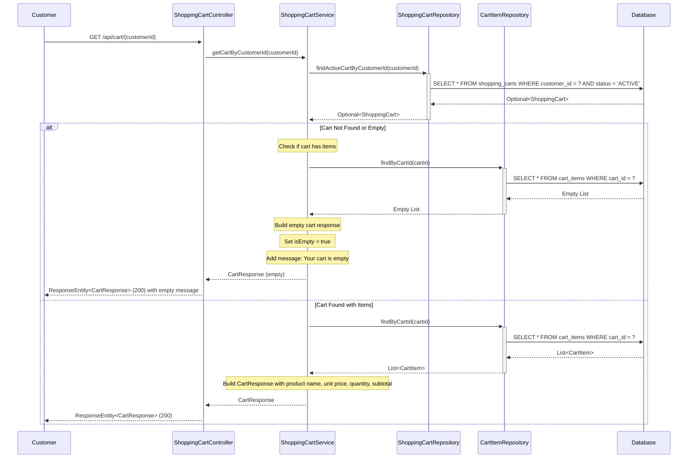

### 3.14 Update Quantity Flow (SCRUM-343 AC-3, AC-6)

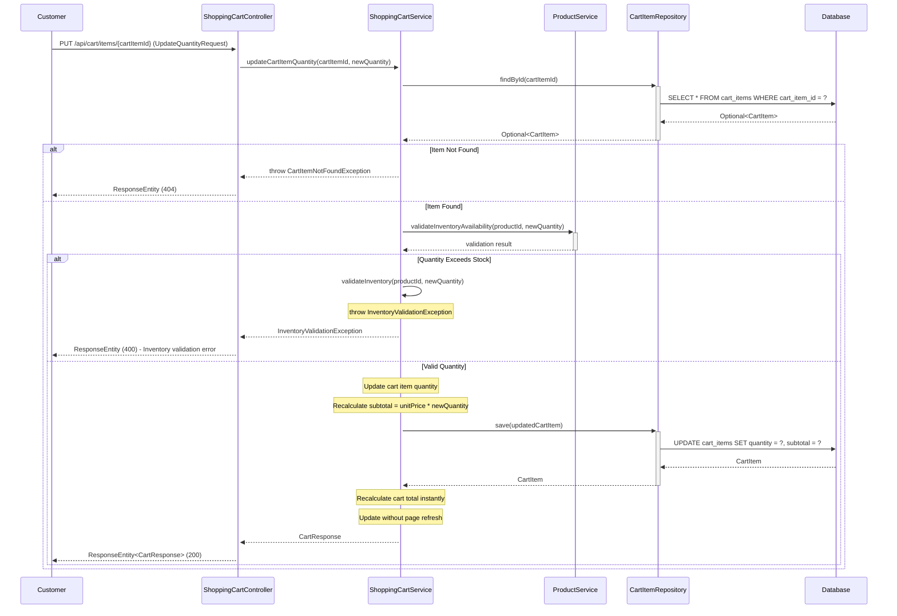

### 3.15 Remove Item Flow (SCRUM-343 AC-4)

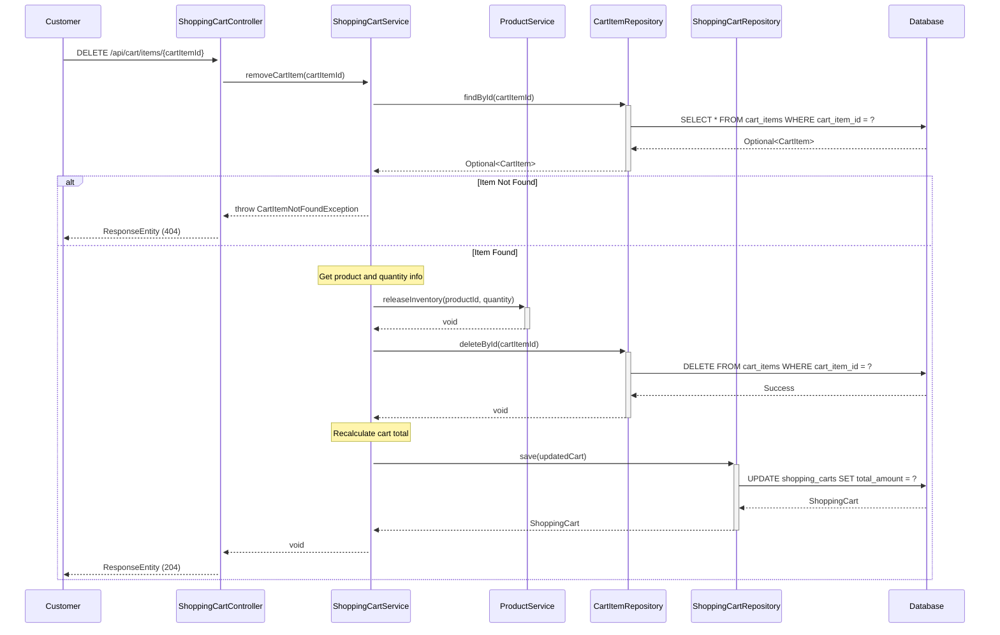
