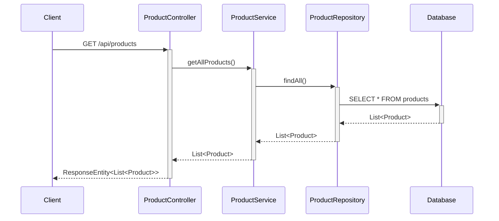
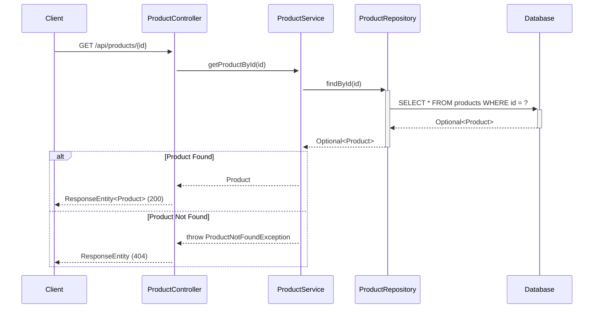
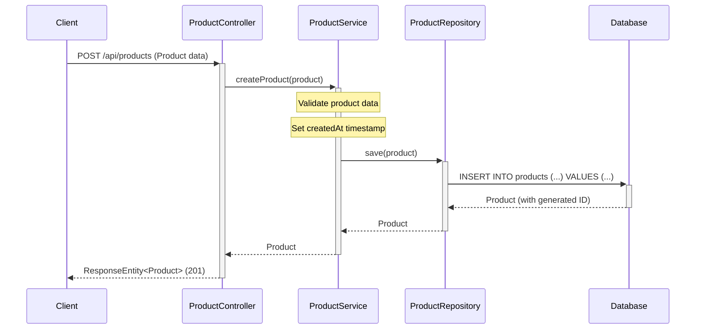
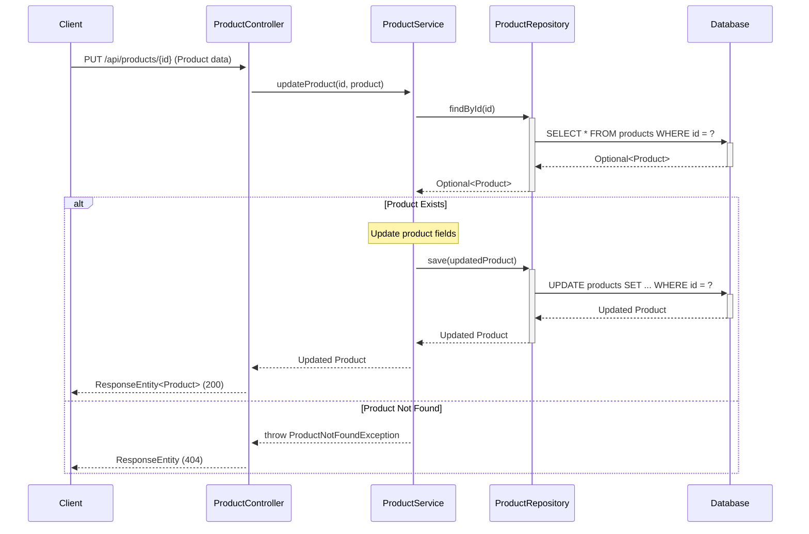
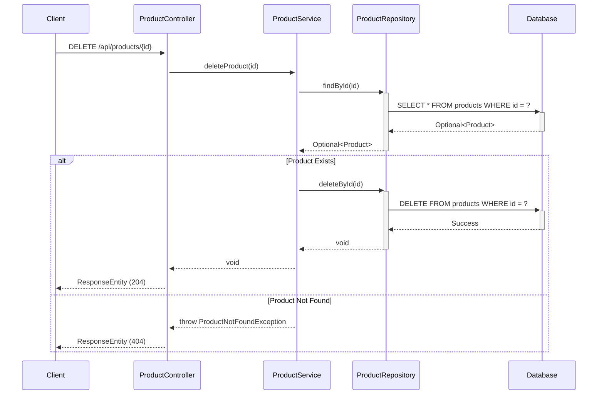
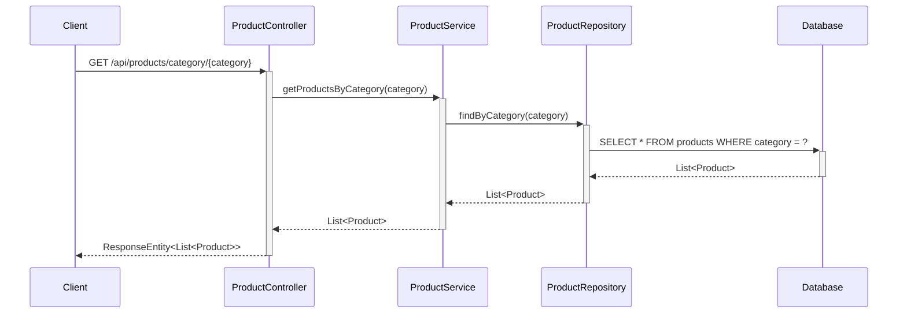
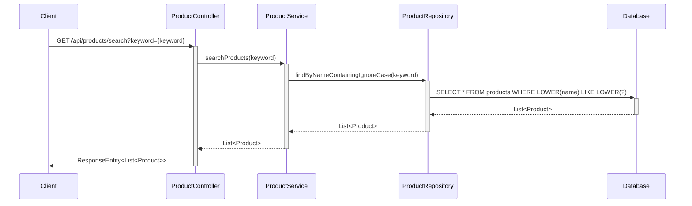
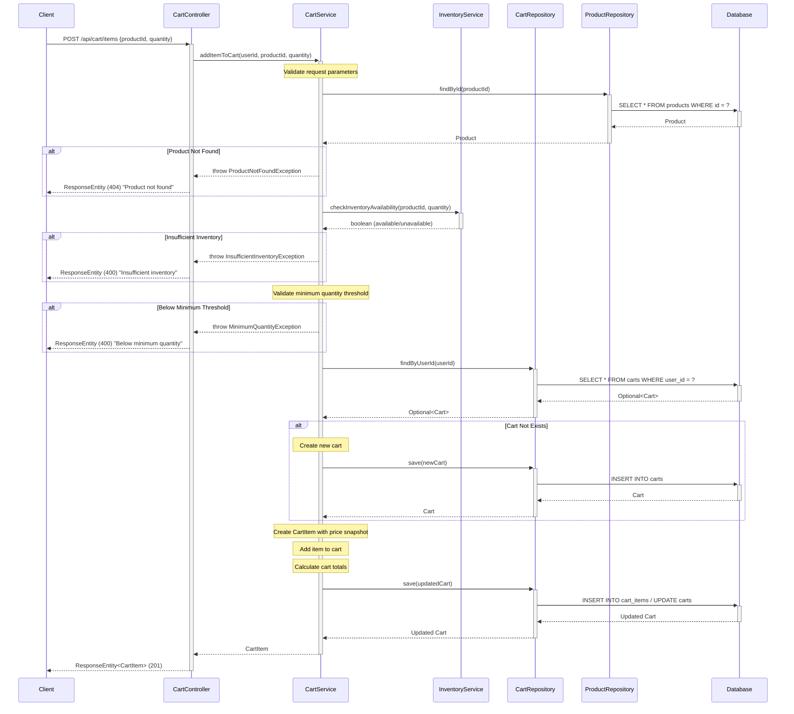
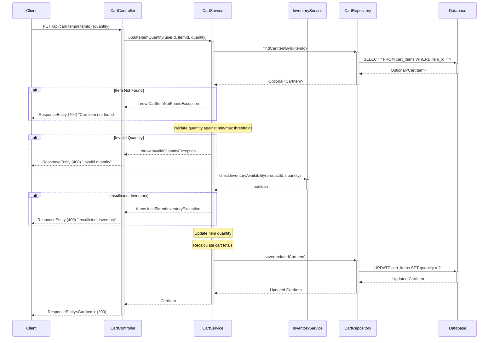
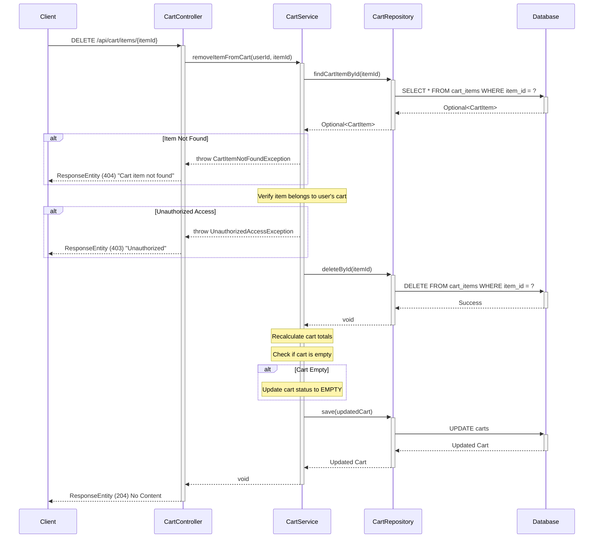

## 3. Sequence Diagrams

### 3.1 Get All Products



### 3.2 Get Product By ID



### 3.3 Create Product



### 3.4 Update Product



### 3.5 Delete Product



### 3.6 Get Products By Category



### 3.7 Search Products



### 3.8 Add Product to Cart

**Requirement Reference:** Epic: Shopping cart management, Story: Add products to cart, AC-1



### 3.9 Update Cart Item Quantity

**Requirement Reference:** Story: Manage quantities, AC-3



### 3.10 Remove Item from Cart

**Requirement Reference:** Story: Cart operations, AC-4



## 4. API Endpoints Summary

| Method | Endpoint | Description | Request Body | Response |
|--------|----------|-------------|--------------|----------|
| GET | `/api/products` | Get all products | None | List<Product> |
| GET | `/api/products/{id}` | Get product by ID | None | Product |
| POST | `/api/products` | Create new product | Product | Product |
| PUT | `/api/products/{id}` | Update existing product | Product | Product |
| DELETE | `/api/products/{id}` | Delete product | None | None |
| GET | `/api/products/category/{category}` | Get products by category | None | List<Product> |
| GET | `/api/products/search?keyword={keyword}` | Search products by name | None | List<Product> |

### 4.1 Shopping Cart API Endpoints

**Requirement Reference:** Epic: Shopping cart management, Story: Add products to cart, AC-1; Story: Manage quantities, AC-3; Story: Cart operations, AC-4

| Method | Endpoint | Description | Request Body | Response | Status Codes |
|--------|----------|-------------|--------------|----------|--------------||
| POST | `/api/cart/items` | Add product to cart | `{"productId": Long, "quantity": Integer}` | CartItem | 201 Created, 400 Bad Request, 404 Not Found |
| PUT | `/api/cart/items/{itemId}` | Update item quantity | `{"quantity": Integer}` | CartItem | 200 OK, 400 Bad Request, 404 Not Found |
| DELETE | `/api/cart/items/{itemId}` | Remove item from cart | None | None | 204 No Content, 404 Not Found, 403 Forbidden |
| GET | `/api/cart` | Get user's cart | None | ShoppingCart | 200 OK, 404 Not Found |
| DELETE | `/api/cart` | Clear entire cart | None | None | 204 No Content |

#### 4.1.1 POST /api/cart/items - Add Product to Cart

**Request Schema:**
```json
{
  "productId": 123,
  "quantity": 5
}
```

**Validation Rules:**
- `productId`: Required, must be valid existing product ID
- `quantity`: Required, must be positive integer, must meet minimum threshold, must not exceed maximum limit, must not exceed available inventory

**Response Schema (201 Created):**
```json
{
  "itemId": 456,
  "cartId": 789,
  "productId": 123,
  "productName": "Product Name",
  "quantity": 5,
  "priceSnapshot": 29.99,
  "minQuantity": 1,
  "maxQuantity": 100,
  "addedAt": "2024-01-15T10:30:00Z"
}
```

**Error Responses:**
- `400 Bad Request`: Invalid quantity, below minimum threshold, exceeds maximum limit, insufficient inventory
- `404 Not Found`: Product not found

#### 4.1.2 PUT /api/cart/items/{itemId} - Update Item Quantity

**Request Schema:**
```json
{
  "quantity": 10
}
```

**Validation Rules:**
- `quantity`: Required, must be positive integer, must meet minimum threshold, must not exceed maximum limit, must not exceed available inventory

**Response Schema (200 OK):**
```json
{
  "itemId": 456,
  "cartId": 789,
  "productId": 123,
  "productName": "Product Name",
  "quantity": 10,
  "priceSnapshot": 29.99,
  "minQuantity": 1,
  "maxQuantity": 100,
  "updatedAt": "2024-01-15T11:00:00Z"
}
```

**Error Responses:**
- `400 Bad Request`: Invalid quantity, below minimum threshold, exceeds maximum limit, insufficient inventory
- `404 Not Found`: Cart item not found

#### 4.1.3 DELETE /api/cart/items/{itemId} - Remove Item from Cart

**Response:** 204 No Content

**Error Responses:**
- `404 Not Found`: Cart item not found
- `403 Forbidden`: Unauthorized access to cart item

**Reason for Addition:** Missing API contracts for cart operations as specified in acceptance criteria
