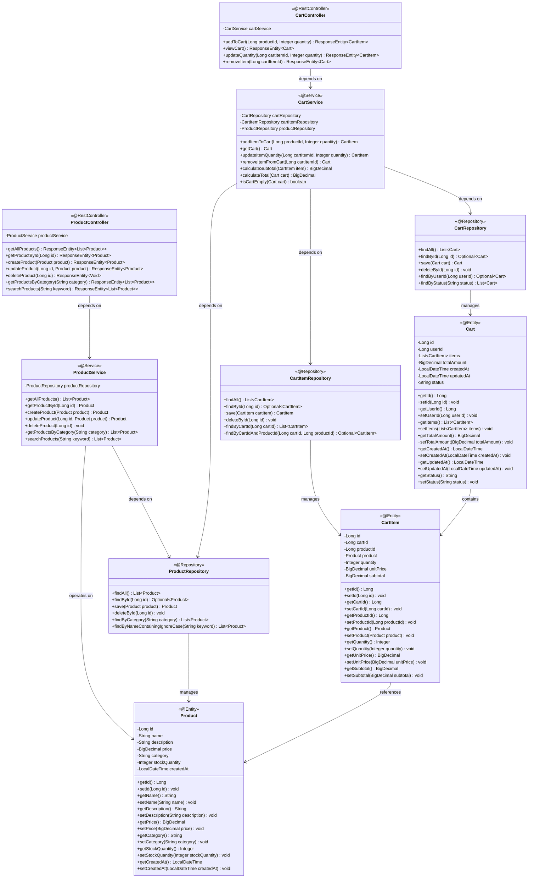
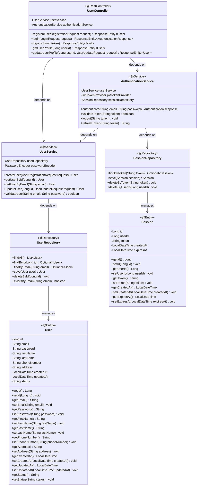
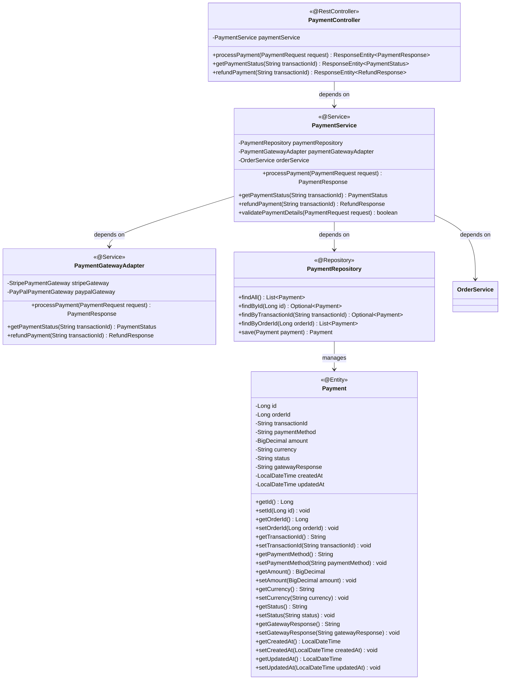
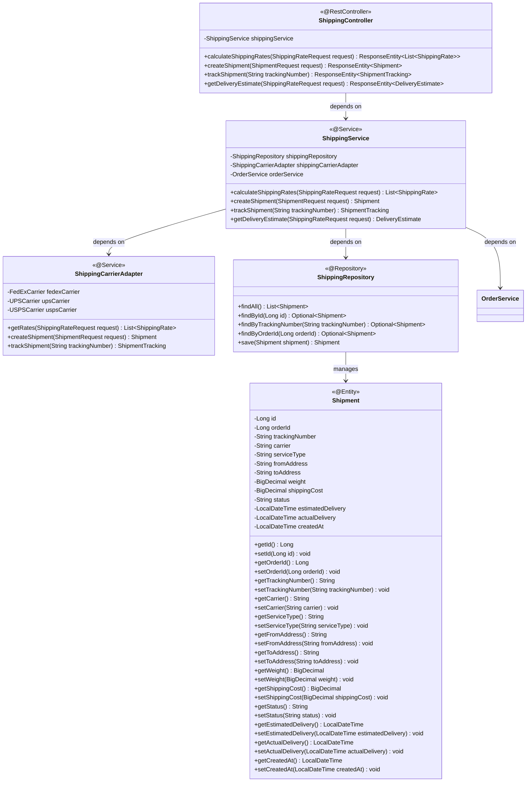
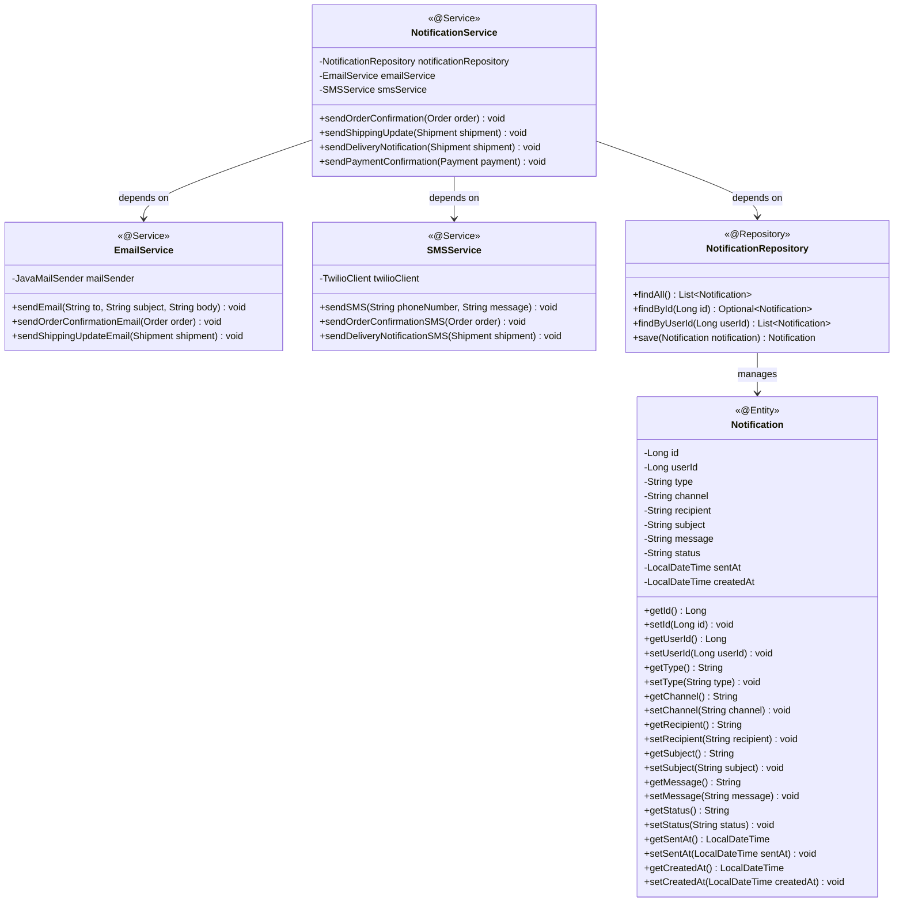
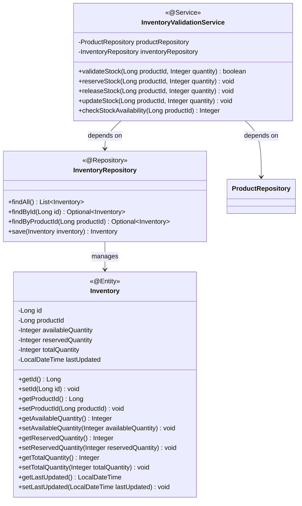
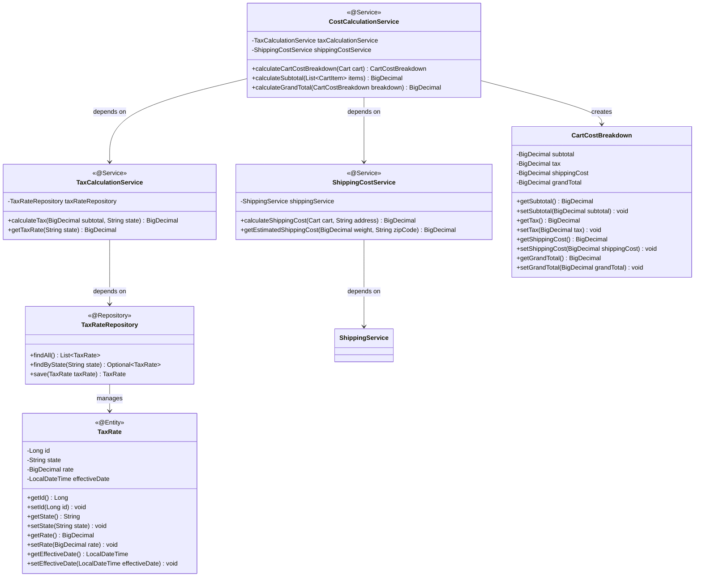
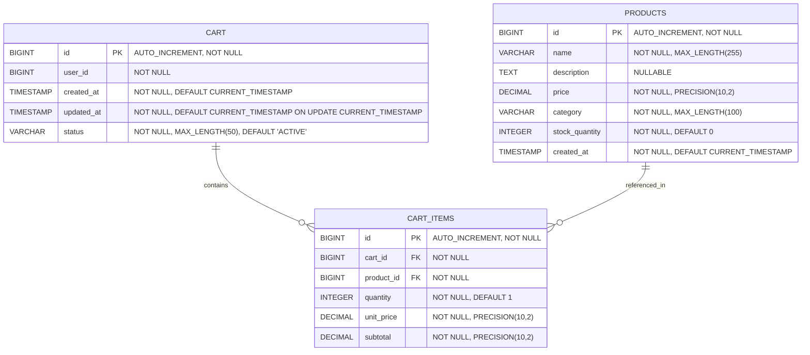
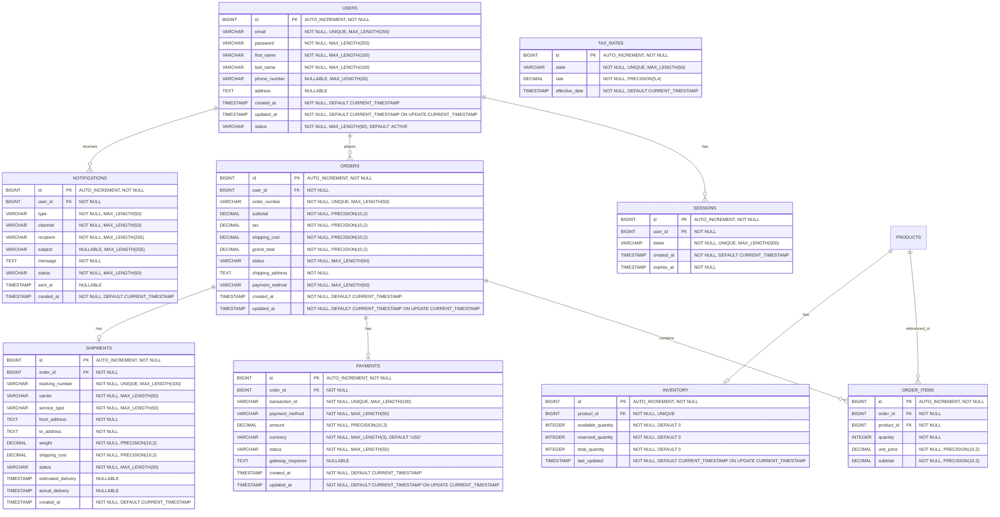

## 2. System Architecture

### 2.1 Class Diagram

### 2.1.1 User Authentication Module Class Diagram

### 2.1.2 Order Management Module Class Diagram

```mermaid
classDiagram
    class OrderController {
        <<@RestController>>
        -OrderService orderService
        +createOrder(OrderRequest request) ResponseEntity~Order~
        +getOrderById(Long orderId) ResponseEntity~Order~
        +getUserOrders(Long userId) ResponseEntity~List~Order~~
        +updateOrderStatus(Long orderId, String status) ResponseEntity~Order~
        +cancelOrder(Long orderId) ResponseEntity~Order~
    }
    
    class OrderService {
        <<@Service>>
        -OrderRepository orderRepository
        -OrderItemRepository orderItemRepository
        -CartService cartService
        -InventoryValidationService inventoryValidationService
        -PaymentService paymentService
        +createOrderFromCart(Long userId, OrderRequest request) Order
        +getOrderById(Long orderId) Order
        +getUserOrders(Long userId) List~Order~
        +updateOrderStatus(Long orderId, String status) Order
        +cancelOrder(Long orderId) Order
        +calculateOrderTotal(Order order) BigDecimal
    }
    
    class OrderRepository {
        <<@Repository>>
        <<interface>>
        +findAll() List~Order~
        +findById(Long id) Optional~Order~
        +findByUserId(Long userId) List~Order~
        +save(Order order) Order
        +deleteById(Long id) void
        +findByStatus(String status) List~Order~
    }
    
    class OrderItemRepository {
        <<@Repository>>
        <<interface>>
        +findAll() List~OrderItem~
        +findById(Long id) Optional~OrderItem~
        +findByOrderId(Long orderId) List~OrderItem~
        +save(OrderItem orderItem) OrderItem
        +deleteById(Long id) void
    }
    
    class Order {
        <<@Entity>>
        -Long id
        -Long userId
        -String orderNumber
        -List~OrderItem~ items
        -BigDecimal subtotal
        -BigDecimal tax
        -BigDecimal shippingCost
        -BigDecimal grandTotal
        -String status
        -String shippingAddress
        -String paymentMethod
        -LocalDateTime createdAt
        -LocalDateTime updatedAt
        +getId() Long
        +setId(Long id) void
        +getUserId() Long
        +setUserId(Long userId) void
        +getOrderNumber() String
        +setOrderNumber(String orderNumber) void
        +getItems() List~OrderItem~
        +setItems(List~OrderItem~ items) void
        +getSubtotal() BigDecimal
        +setSubtotal(BigDecimal subtotal) void
        +getTax() BigDecimal
        +setTax(BigDecimal tax) void
        +getShippingCost() BigDecimal
        +setShippingCost(BigDecimal shippingCost) void
        +getGrandTotal() BigDecimal
        +setGrandTotal(BigDecimal grandTotal) void
        +getStatus() String
        +setStatus(String status) void
        +getShippingAddress() String
        +setShippingAddress(String shippingAddress) void
        +getPaymentMethod() String
        +setPaymentMethod(String paymentMethod) void
        +getCreatedAt() LocalDateTime
        +setCreatedAt(LocalDateTime createdAt) void
        +getUpdatedAt() LocalDateTime
        +setUpdatedAt(LocalDateTime updatedAt) void
    }
    
    class OrderItem {
        <<@Entity>>
        -Long id
        -Long orderId
        -Long productId
        -Product product
        -Integer quantity
        -BigDecimal unitPrice
        -BigDecimal subtotal
        +getId() Long
        +setId(Long id) void
        +getOrderId() Long
        +setOrderId(Long orderId) void
        +getProductId() Long
        +setProductId(Long productId) void
        +getProduct() Product
        +setProduct(Product product) void
        +getQuantity() Integer
        +setQuantity(Integer quantity) void
        +getUnitPrice() BigDecimal
        +setUnitPrice(BigDecimal unitPrice) void
        +getSubtotal() BigDecimal
        +setSubtotal(BigDecimal subtotal) void
    }
    
    OrderController --> OrderService : depends on
    OrderService --> OrderRepository : depends on
    OrderService --> OrderItemRepository : depends on
    OrderService --> CartService : depends on
    OrderRepository --> Order : manages
    OrderItemRepository --> OrderItem : manages
    Order --> OrderItem : contains
    OrderItem --> Product : references
```

### 2.1.3 Payment Processing Module Class Diagram

### 2.1.4 Shipping Integration Module Class Diagram

### 2.1.5 Customer Notification System Class Diagram

### 2.1.6 Inventory Validation Service Class Diagram

### 2.1.7 Cart Cost Breakdown Calculation Class Diagram

### 2.2 Entity Relationship Diagram

### 2.2.1 Extended Entity Relationship Diagram with New Modules

