## 3. Sequence Diagrams

### 3.1 Get All Products

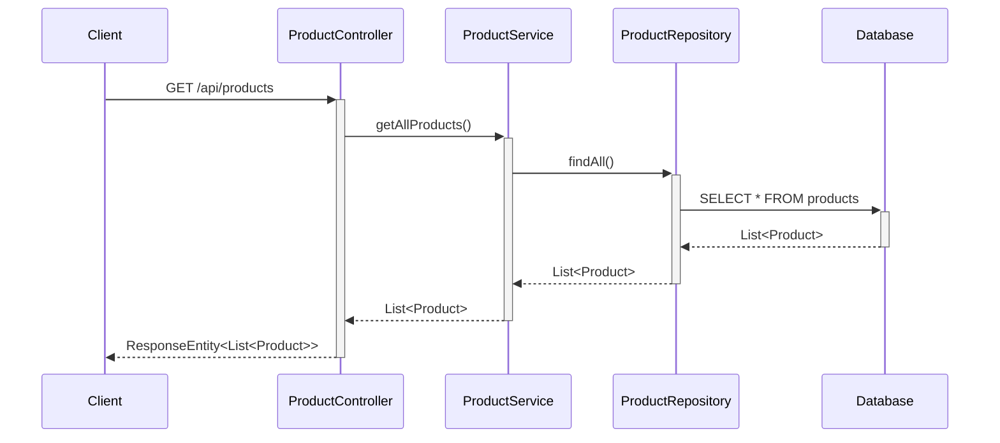

### 3.2 Get Product By ID

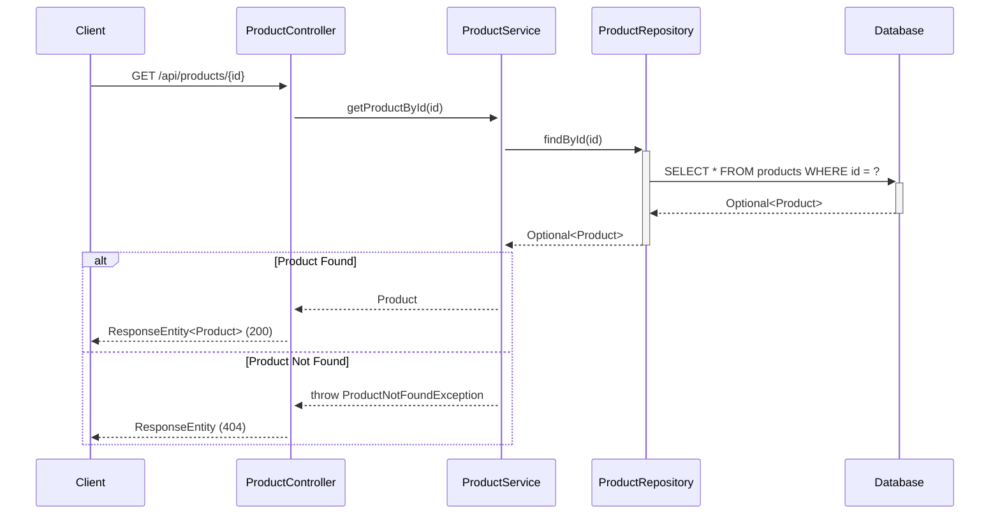

### 3.3 Create Product

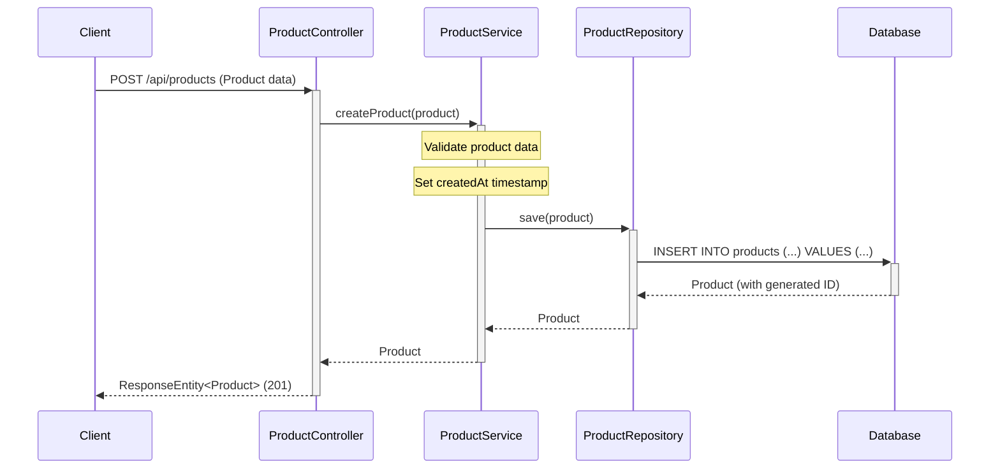

### 3.4 Update Product

```mermaid
sequenceDiagram
    participant Client
    participant ProductController
    participant ProductService
    participant ProductRepository
    participant Database
    
    Client->>+ProductController: PUT /api/products/{id} (Product data)
    ProductController->>+ProductService: updateProduct(id, product)
    
    ProductService->>+ProductRepository: findById(id)
    ProductRepository->>+Database: SELECT * FROM products WHERE id = ?
    Database-->>-ProductRepository: Optional<Product>
    ProductRepository-->>-ProductService: Optional<Product>
    
    alt Product Exists
        Note over ProductService: Update product fields
        ProductService->>+ProductRepository: save(updatedProduct)
        ProductRepository->>+Database: UPDATE products SET ... WHERE id = ?
        Database-->>-ProductRepository: Updated Product
        ProductRepository-->>-ProductService: Updated Product
        ProductService-->>ProductController: Updated Product
        ProductController-->>Client: ResponseEntity<Product> (200)
    else Product Not Found
        ProductService-->>ProductController: throw ProductNotFoundException
        ProductController-->>Client: ResponseEntity (404)
    end
```

### 3.5 Delete Product

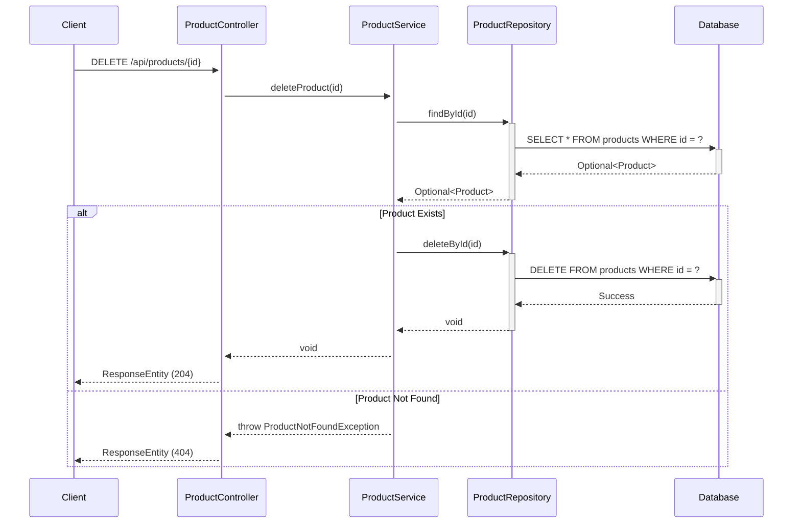

### 3.6 Get Products By Category

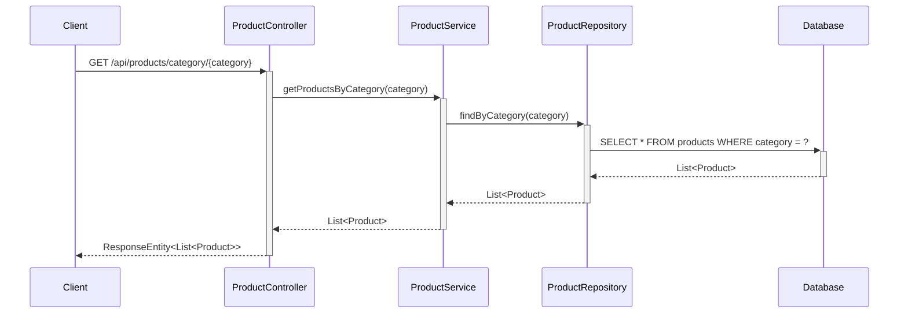

### 3.7 Search Products

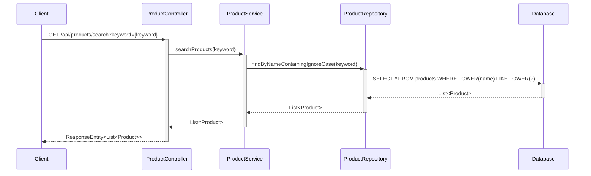

### 3.8 Add to Cart Flow

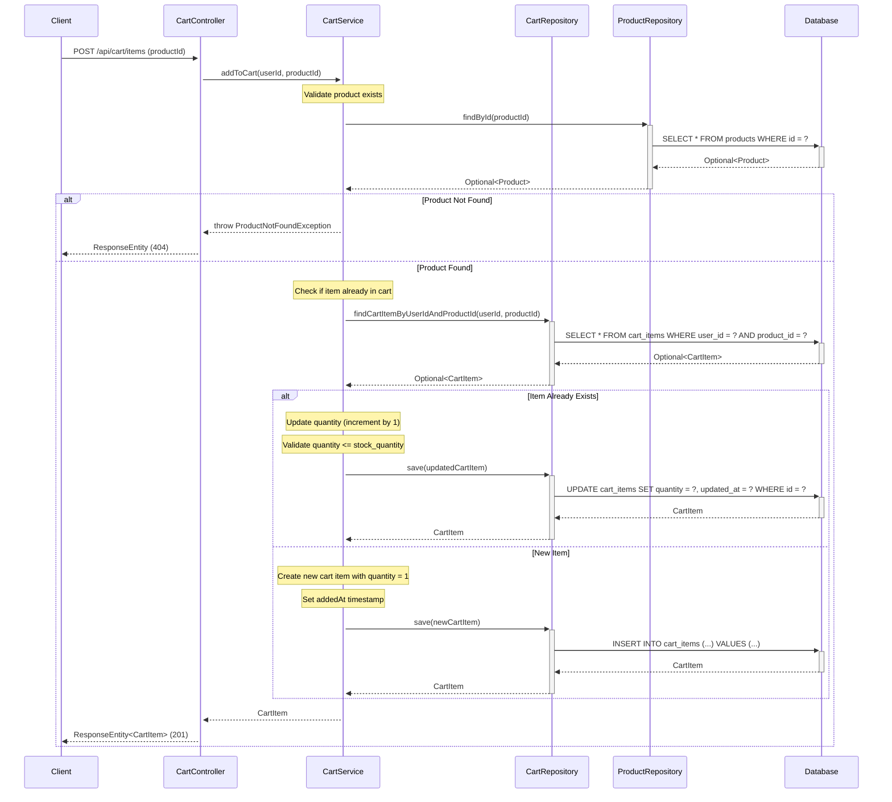

### 3.9 View Cart Flow

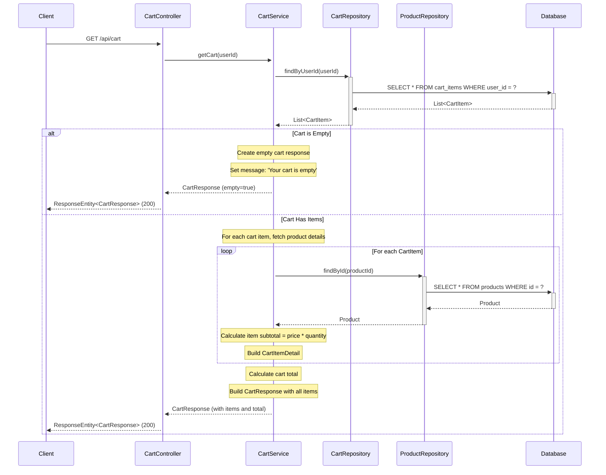

### 3.10 Update Cart Item Quantity Flow

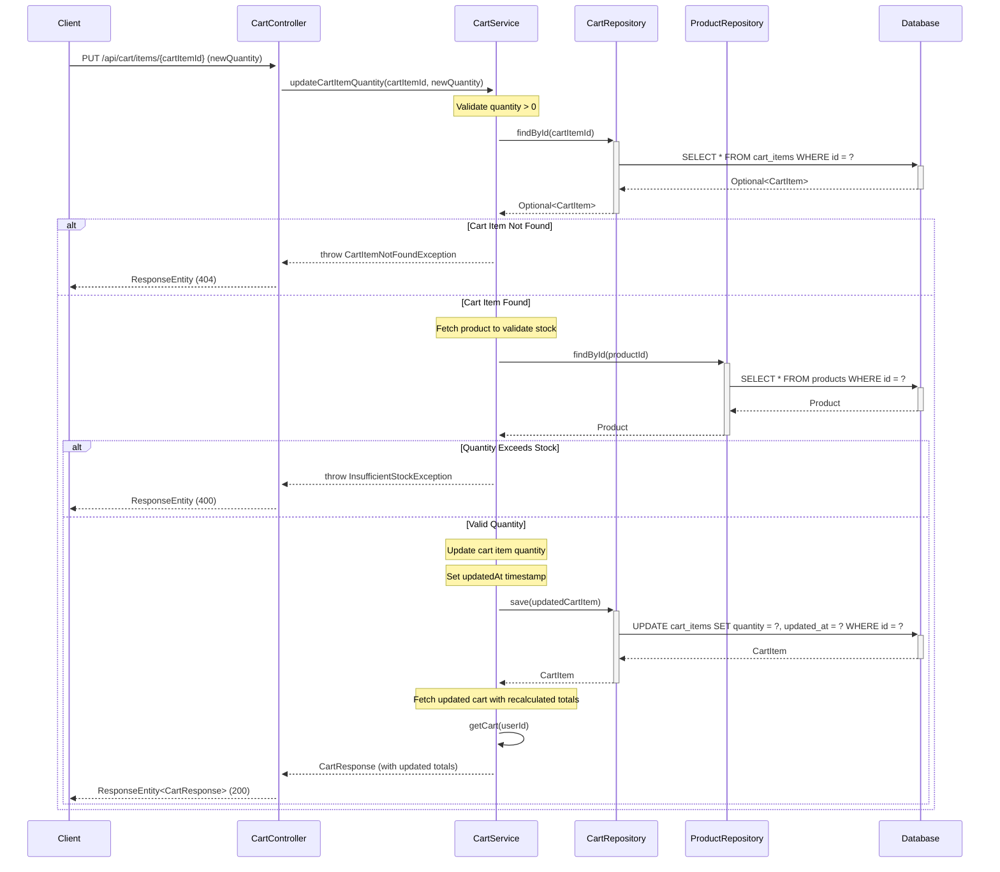

### 3.11 Remove Cart Item Flow

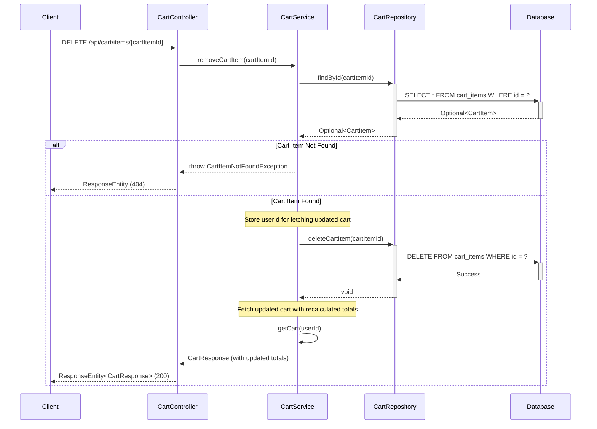

### 3.12 Empty Cart Handling Flow

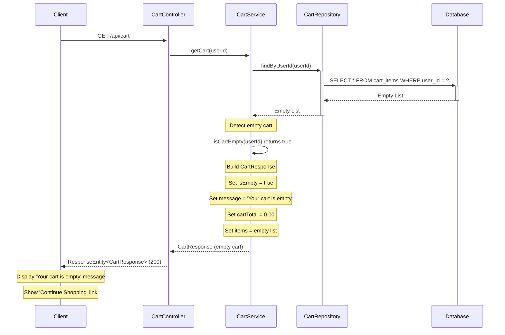

## 4. API Endpoints Summary

| Method | Endpoint | Description | Request Body | Response |
|--------|----------|-------------|--------------|----------|
| GET | `/api/products` | Get all products | None | List<Product> |
| GET | `/api/products/{id}` | Get product by ID | None | Product |
| POST | `/api/products` | Create new product | Product | Product |
| PUT | `/api/products/{id}` | Update existing product | Product | Product |
| DELETE | `/api/products/{id}` | Delete product | None | None |
| GET | `/api/products/category/{category}` | Get products by category | None | List<Product> |
| GET | `/api/products/search?keyword={keyword}` | Search products by name | None | List<Product> |

## 5. Shopping Cart API Endpoints

| Method | Endpoint | Description | Request Body | Response |
|--------|----------|-------------|--------------|----------|
| POST | `/api/cart/items` | Add product to cart | {"productId": Long} | CartItem |
| GET | `/api/cart` | View cart contents | None | CartResponse |
| PUT | `/api/cart/items/{cartItemId}` | Update item quantity | {"quantity": Integer} | CartResponse |
| DELETE | `/api/cart/items/{cartItemId}` | Remove item from cart | None | CartResponse |

### 5.1 Cart API Request/Response Models

**Add to Cart Request:**
```json
{
  "productId": 123
}
```

**Update Quantity Request:**
```json
{
  "quantity": 3
}
```

**Cart Response (with items):**
```json
{
  "items": [
    {
      "cartItemId": 1,
      "productName": "Product A",
      "productPrice": 29.99,
      "quantity": 2,
      "subtotal": 59.98
    },
    {
      "cartItemId": 2,
      "productName": "Product B",
      "productPrice": 15.50,
      "quantity": 1,
      "subtotal": 15.50
    }
  ],
  "cartTotal": 75.48,
  "isEmpty": false,
  "message": null
}
```

**Cart Response (empty):**
```json
{
  "items": [],
  "cartTotal": 0.00,
  "isEmpty": true,
  "message": "Your cart is empty"
}
```

## 6. Database Schema

### Products Table

```sql
CREATE TABLE products (
    id BIGINT PRIMARY KEY AUTO_INCREMENT,
    name VARCHAR(255) NOT NULL,
    description TEXT,
    price DECIMAL(10,2) NOT NULL,
    category VARCHAR(100) NOT NULL,
    stock_quantity INTEGER NOT NULL DEFAULT 0,
    created_at TIMESTAMP NOT NULL DEFAULT CURRENT_TIMESTAMP
);

CREATE INDEX idx_products_category ON products(category);
CREATE INDEX idx_products_name ON products(name);
```

### Cart Items Table

```sql
CREATE TABLE cart_items (
    id BIGINT PRIMARY KEY AUTO_INCREMENT,
    user_id BIGINT NOT NULL,
    product_id BIGINT NOT NULL,
    quantity INTEGER NOT NULL DEFAULT 1,
    added_at TIMESTAMP NOT NULL DEFAULT CURRENT_TIMESTAMP,
    updated_at TIMESTAMP NOT NULL DEFAULT CURRENT_TIMESTAMP ON UPDATE CURRENT_TIMESTAMP,
    CONSTRAINT fk_cart_product FOREIGN KEY (product_id) REFERENCES products(id) ON DELETE CASCADE,
    CONSTRAINT uq_user_product UNIQUE (user_id, product_id),
    CONSTRAINT chk_quantity_positive CHECK (quantity > 0)
);

CREATE INDEX idx_cart_user_id ON cart_items(user_id);
CREATE INDEX idx_cart_product_id ON cart_items(product_id);
```
