## 3. Sequence Diagrams

### 3.1 Get All Products

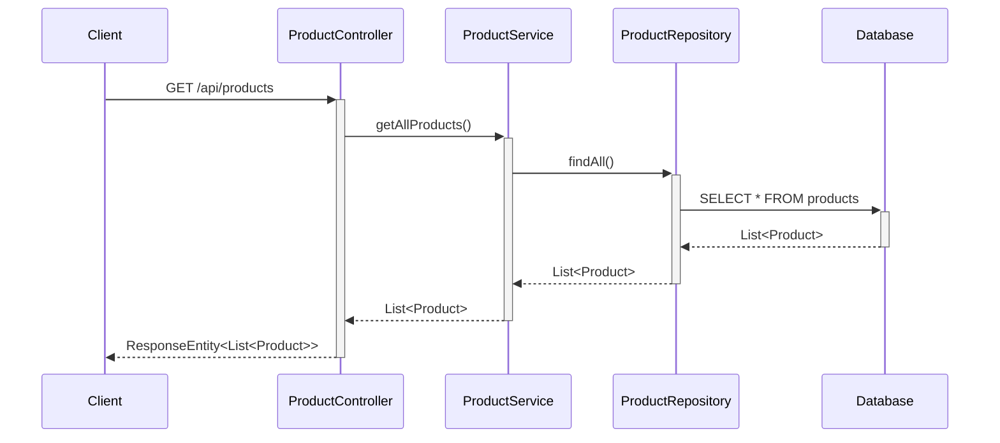

### 3.2 Get Product By ID

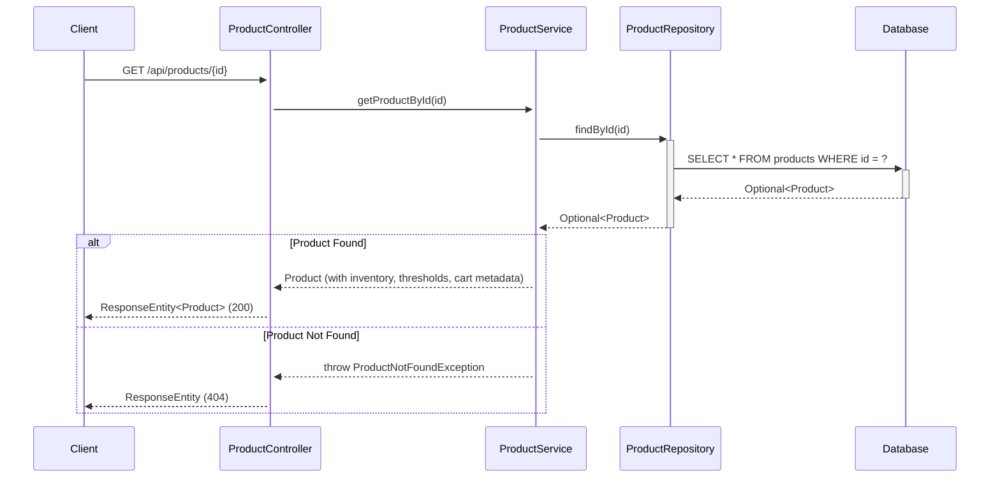

### 3.3 Create Product

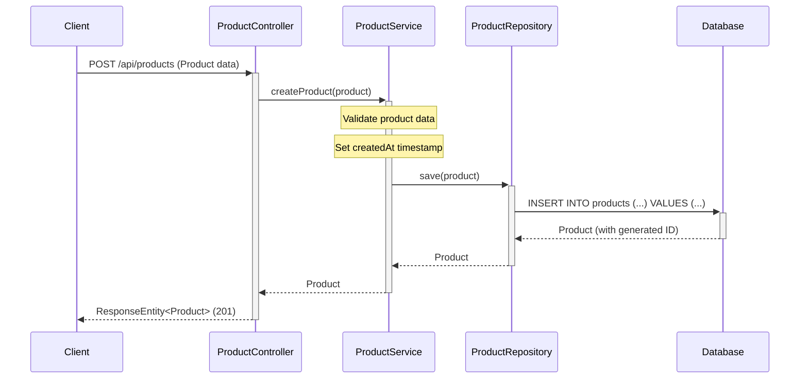

### 3.4 Update Product

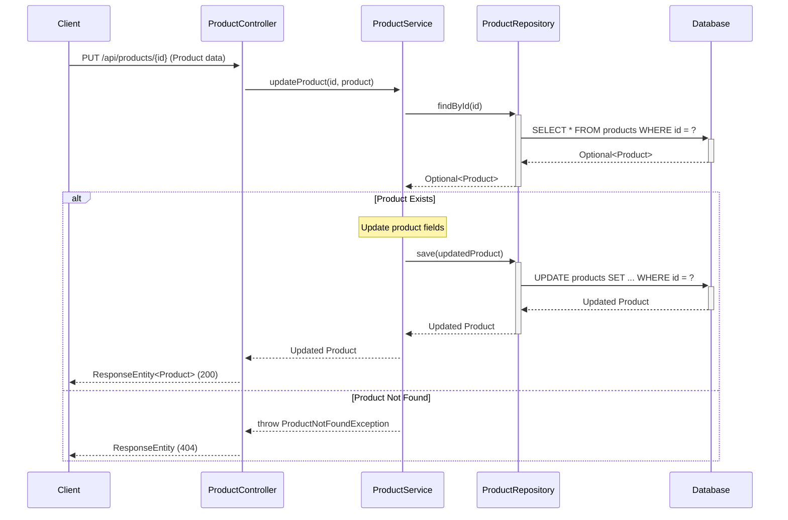

### 3.5 Delete Product

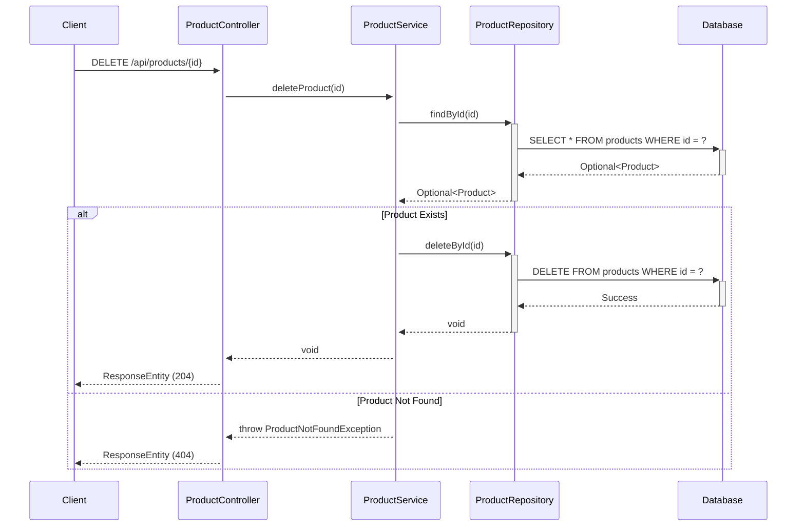

### 3.6 Get Products By Category

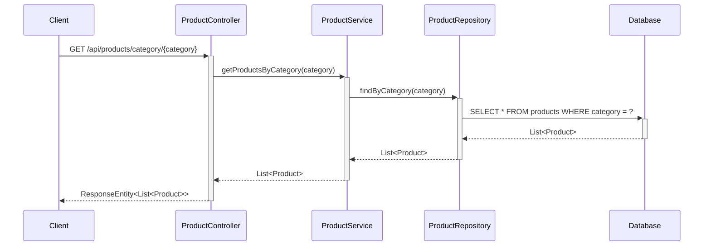

### 3.7 Search Products

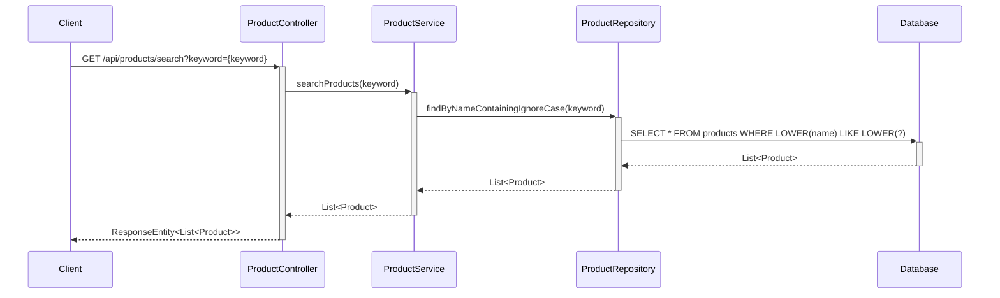

### 3.8 Add Product to Cart

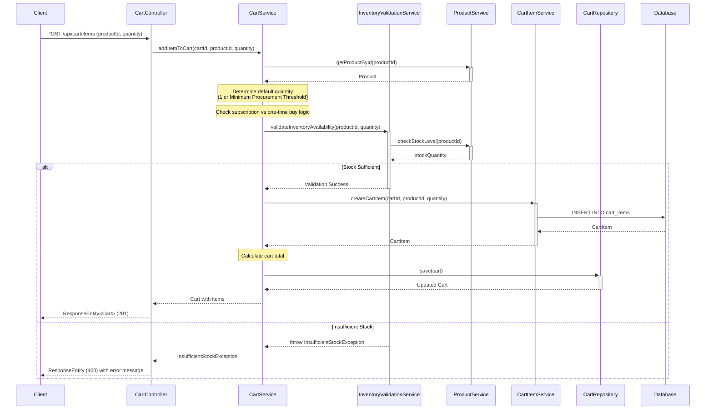

### 3.9 Get Cart with All Items

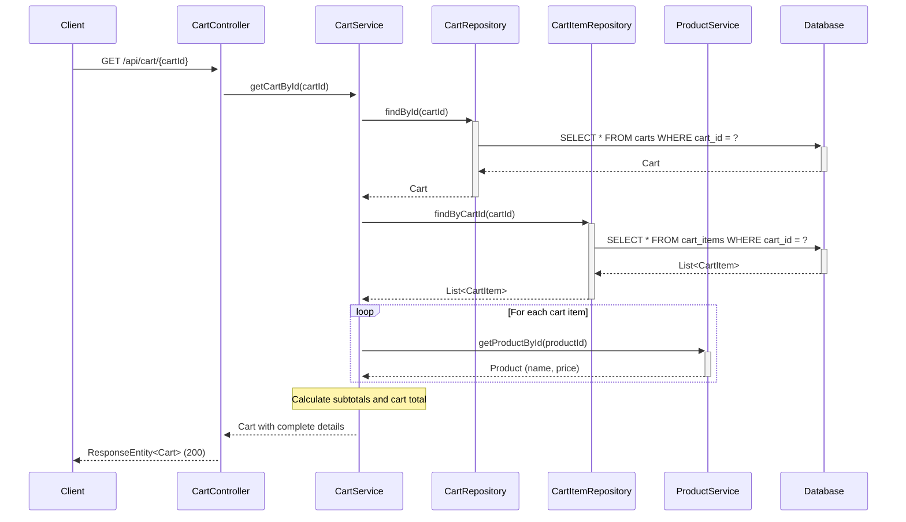

### 3.10 Update Cart Item Quantity

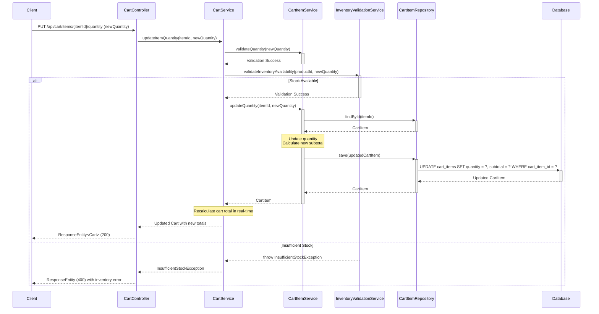

### 3.11 Remove Product from Cart

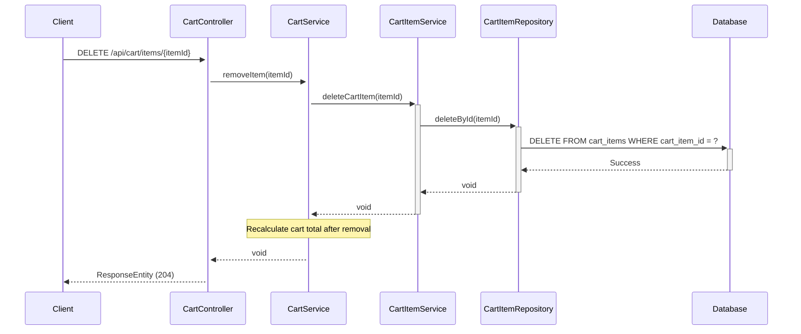

### 3.12 Handle Empty Cart State

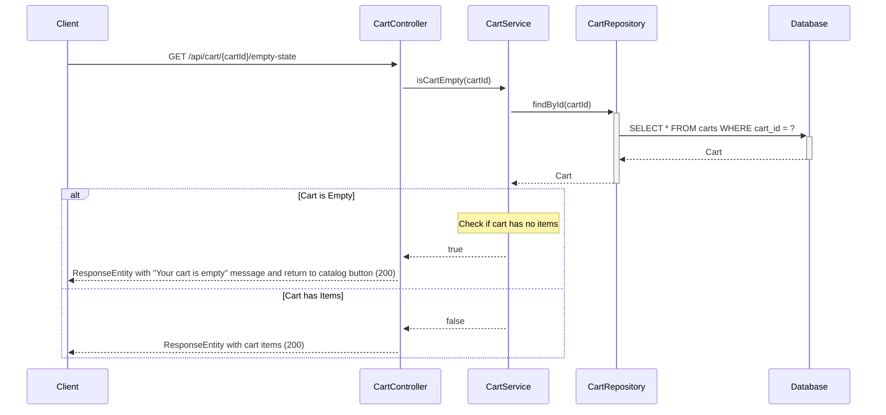

## 4. API Endpoints Summary

### Product Management Endpoints

| Method | Endpoint | Description | Request Body | Response |
|--------|----------|-------------|--------------|----------|
| GET | `/api/products` | Get all products | None | List<Product> |
| GET | `/api/products/{id}` | Get product by ID with inventory and cart metadata | None | Product |
| POST | `/api/products` | Create new product | Product | Product |
| PUT | `/api/products/{id}` | Update existing product | Product | Product |
| DELETE | `/api/products/{id}` | Delete product | None | None |
| GET | `/api/products/category/{category}` | Get products by category | None | List<Product> |
| GET | `/api/products/search?keyword={keyword}` | Search products by name | None | List<Product> |

### Cart Management Endpoints

| Method | Endpoint | Description | Request Body | Response |
|--------|----------|-------------|--------------|----------|
| POST | `/api/cart/items` | Add product to cart with default quantity logic (1 or Minimum Procurement Threshold) | CartItemRequest (productId, quantity, subscriptionType) | Cart |
| GET | `/api/cart/{cartId}` | Retrieve cart with all items, product names, prices, quantities, subtotals, and cart total | None | Cart with complete details |
| PUT | `/api/cart/items/{itemId}/quantity` | Update item quantity with real-time subtotal and cart total calculation, includes inventory validation | QuantityUpdateRequest (quantity) | Cart with updated totals |
| DELETE | `/api/cart/items/{itemId}` | Remove product from cart and recalculate totals | None | None |
| GET | `/api/cart/{cartId}/empty-state` | Handle empty cart state with appropriate messaging | None | EmptyCartResponse |

## 5. Database Schema

### Products Table

```sql
CREATE TABLE products (
    id BIGINT PRIMARY KEY AUTO_INCREMENT,
    name VARCHAR(255) NOT NULL,
    description TEXT,
    price DECIMAL(10,2) NOT NULL,
    category VARCHAR(100) NOT NULL,
    stock_quantity INTEGER NOT NULL DEFAULT 0,
    minimum_procurement_threshold INTEGER,
    subscription_eligible BOOLEAN DEFAULT FALSE,
    inventory_tracking_enabled BOOLEAN DEFAULT TRUE,
    created_at TIMESTAMP NOT NULL DEFAULT CURRENT_TIMESTAMP
);

CREATE INDEX idx_products_category ON products(category);
CREATE INDEX idx_products_name ON products(name);
```

### Carts Table

```sql
CREATE TABLE carts (
    cart_id BIGINT PRIMARY KEY AUTO_INCREMENT,
    user_id BIGINT,
    session_id VARCHAR(255),
    created_at TIMESTAMP NOT NULL DEFAULT CURRENT_TIMESTAMP,
    updated_at TIMESTAMP NOT NULL DEFAULT CURRENT_TIMESTAMP ON UPDATE CURRENT_TIMESTAMP,
    status VARCHAR(50) NOT NULL DEFAULT 'ACTIVE',
    CONSTRAINT chk_cart_identifier CHECK (user_id IS NOT NULL OR session_id IS NOT NULL)
);

CREATE INDEX idx_carts_user_id ON carts(user_id);
CREATE INDEX idx_carts_session_id ON carts(session_id);
CREATE INDEX idx_carts_status ON carts(status);
```

### Cart Items Table

```sql
CREATE TABLE cart_items (
    cart_item_id BIGINT PRIMARY KEY AUTO_INCREMENT,
    cart_id BIGINT NOT NULL,
    product_id BIGINT NOT NULL,
    quantity INTEGER NOT NULL DEFAULT 1,
    unit_price DECIMAL(10,2) NOT NULL,
    subtotal DECIMAL(10,2) NOT NULL,
    added_at TIMESTAMP NOT NULL DEFAULT CURRENT_TIMESTAMP,
    CONSTRAINT fk_cart_items_cart FOREIGN KEY (cart_id) REFERENCES carts(cart_id) ON DELETE CASCADE,
    CONSTRAINT fk_cart_items_product FOREIGN KEY (product_id) REFERENCES products(id) ON DELETE CASCADE,
    CONSTRAINT chk_quantity_positive CHECK (quantity > 0)
);

CREATE INDEX idx_cart_items_cart_id ON cart_items(cart_id);
CREATE INDEX idx_cart_items_product_id ON cart_items(product_id);
```

## 6. Technology Stack

- **Backend Framework:** Spring Boot 3.x
- **Language:** Java 21
- **Database:** PostgreSQL
- **ORM:** Spring Data JPA / Hibernate
- **Build Tool:** Maven/Gradle
- **API Documentation:** Swagger/OpenAPI 3

## 7. Design Patterns Used

1. **MVC Pattern:** Separation of Controller, Service, and Repository layers
2. **Repository Pattern:** Data access abstraction through ProductRepository, CartRepository, CartItemRepository
3. **Dependency Injection:** Spring's IoC container manages dependencies
4. **DTO Pattern:** Data Transfer Objects for API requests/responses
5. **Exception Handling:** Custom exceptions for business logic errors
6. **Service Layer Pattern:** Business logic encapsulation in service classes
7. **Strategy Pattern:** Different quantity calculation strategies for subscription vs one-time purchases

## 8. Key Features

### Product Management Features
- RESTful API design following HTTP standards
- Proper HTTP status codes for different scenarios
- Input validation and error handling
- Database indexing for performance optimization
- Transactional operations for data consistency
- Pagination support for large datasets (can be extended)
- Search functionality with case-insensitive matching
- Real-time inventory checking and validation
- Cart-integration support with procurement thresholds

### Cart Management Features
- Add products to cart with intelligent default quantity logic
- Support for Minimum Procurement Threshold
- Subscription vs one-time purchase handling
- Real-time price calculations for subtotals and cart totals
- Instant updates on quantity changes
- Inventory validation before adding/updating items
- Remove products with automatic total recalculation
- Empty cart state handling with user-friendly messaging
- Session-based and user-based cart support
- Cart persistence across sessions
