## 3. Sequence Diagrams

### 3.1 Get All Products

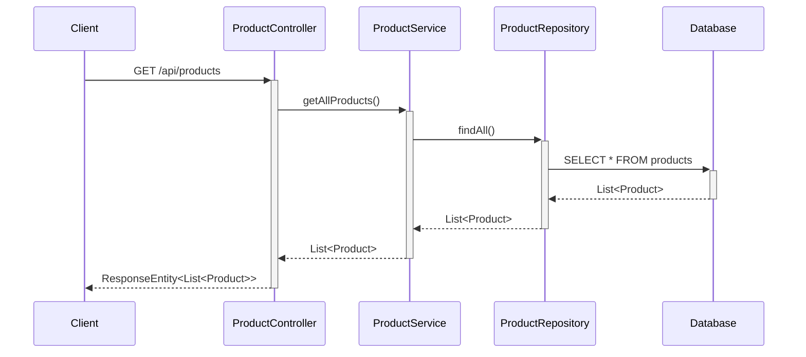

### 3.2 Get Product By ID

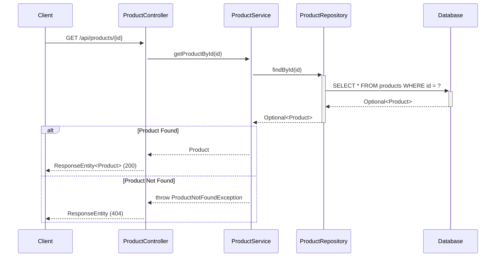

### 3.3 Create Product

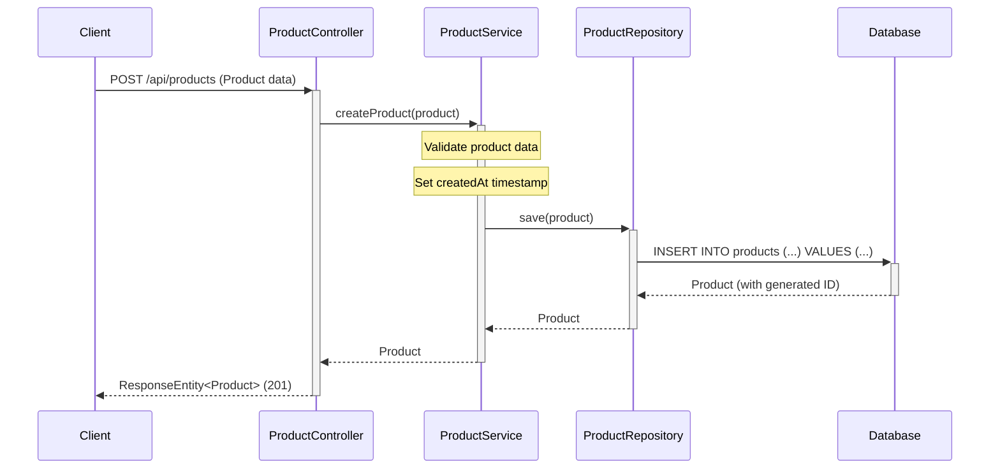

### 3.4 Update Product

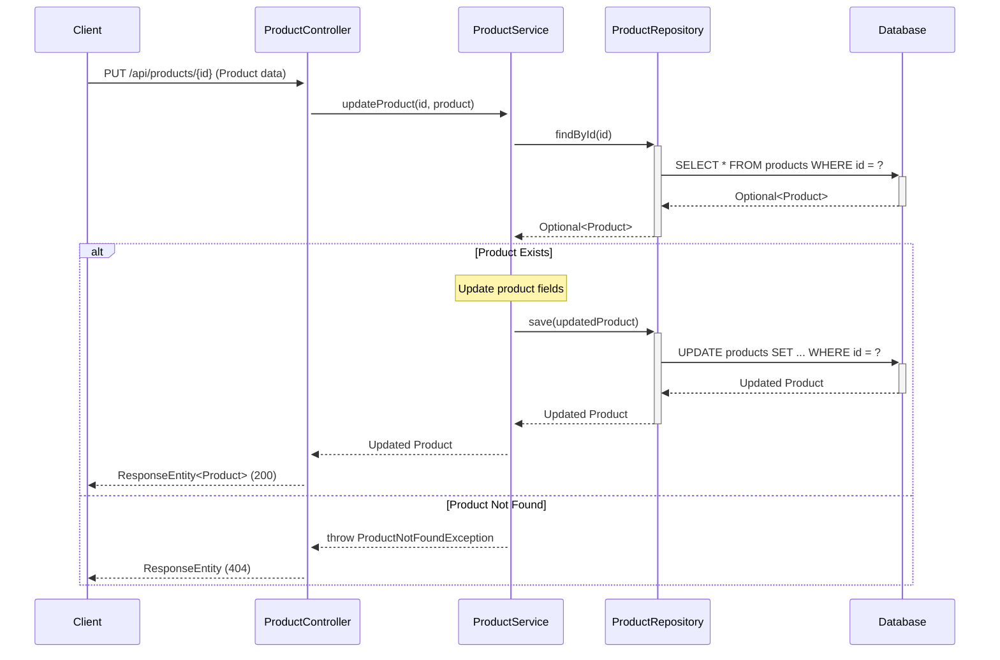

### 3.5 Delete Product

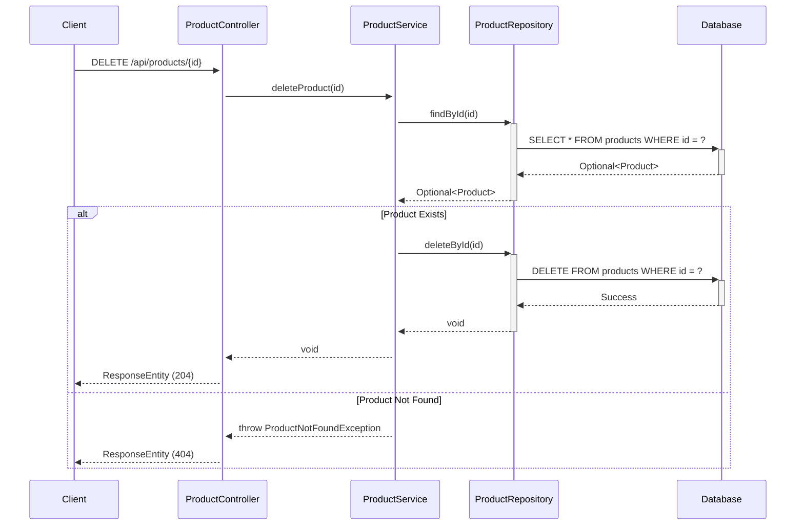

### 3.6 Get Products By Category

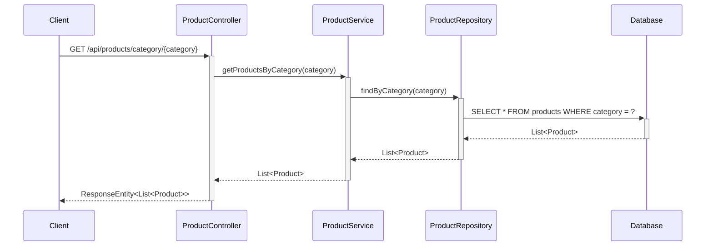

### 3.7 Search Products

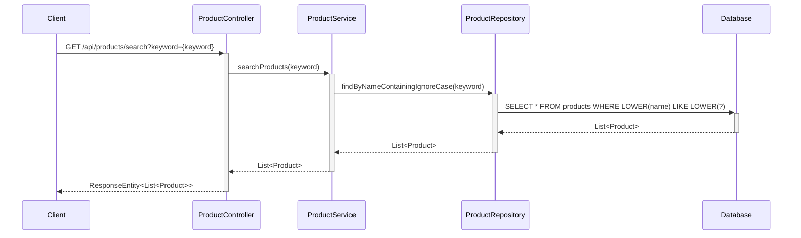

### 3.8 Add Product to Shopping Cart

**Requirement Reference:** Story SCRUM-343 AC1: When they click Add to Cart, Then the product is added to their shopping cart with quantity 1

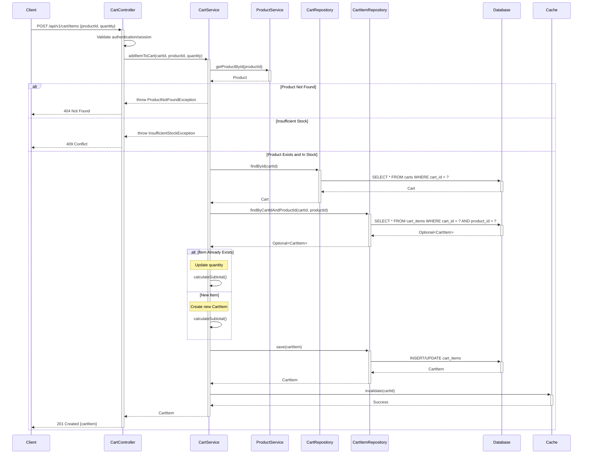

### 3.9 View Shopping Cart

**Requirement Reference:** Story SCRUM-343 AC2: all added products are displayed with name, price, quantity, and subtotal, AC5: message Your cart is empty is displayed

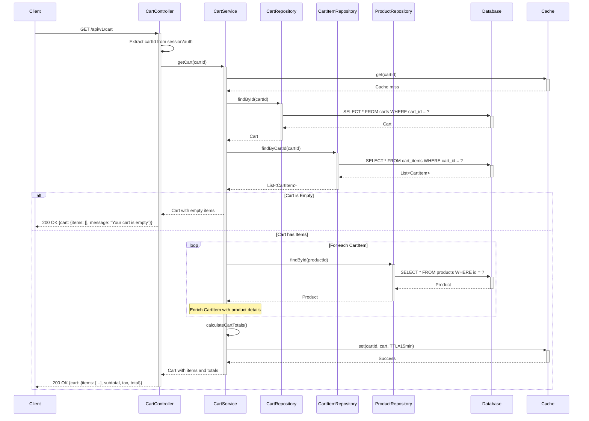

### 3.10 Update Cart Item Quantity

**Requirement Reference:** Story SCRUM-343 AC3: update the quantity of an item, Then the subtotal and total are recalculated automatically

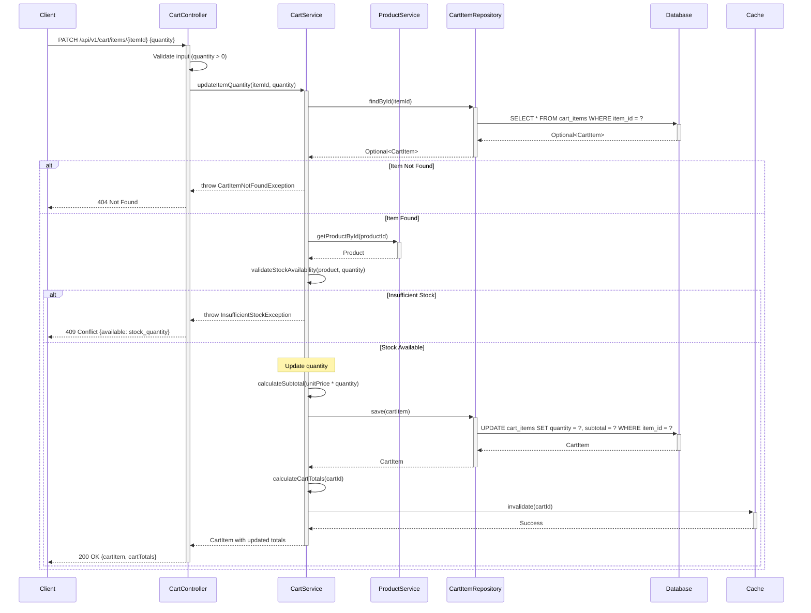

### 3.11 Remove Item from Cart

**Requirement Reference:** Story SCRUM-343 AC4: When they click Remove, Then the item is deleted from the cart and totals are updated

```mermaid
sequenceDiagram
    participant Client
    participant CartController
    participant CartService
    participant CartItemRepository
    participant Database
    participant Cache
    
    Client->>+CartController: DELETE /api/v1/cart/items/{itemId}
    CartController->>+CartService: removeItemFromCart(itemId)
    
    CartService->>+CartItemRepository: findById(itemId)
    CartItemRepository->>+Database: SELECT * FROM cart_items WHERE item_id = ?
    Database-->>-CartItemRepository: Optional<CartItem>
    CartItemRepository-->>-CartService: Optional<CartItem>
    
    alt Item Not Found
        CartService-->>CartController: throw CartItemNotFoundException
        CartController-->>Client: 404 Not Found
    else Item Found
        Note over CartService: Extract cartId for total recalculation
        
        CartService->>+CartItemRepository: deleteById(itemId)
        CartItemRepository->>+Database: DELETE FROM cart_items WHERE item_id = ?
        Database-->>-CartItemRepository: Success
        CartItemRepository-->>-CartService: void
        
        CartService->>CartService: calculateCartTotals(cartId)
        CartService->>+Cache: invalidate(cartId)
        Cache-->>-CartService: Success
        
        CartService-->>-CartController: CartTotals
        CartController-->>-Client: 204 No Content {cartTotals}
    end
```
