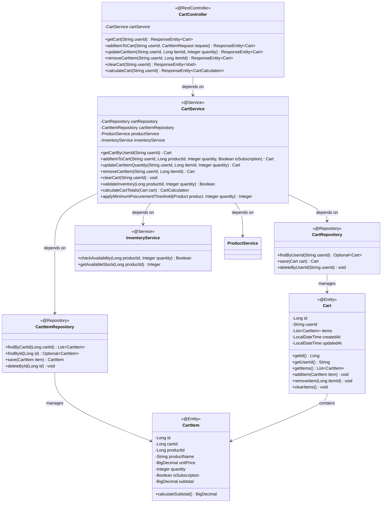
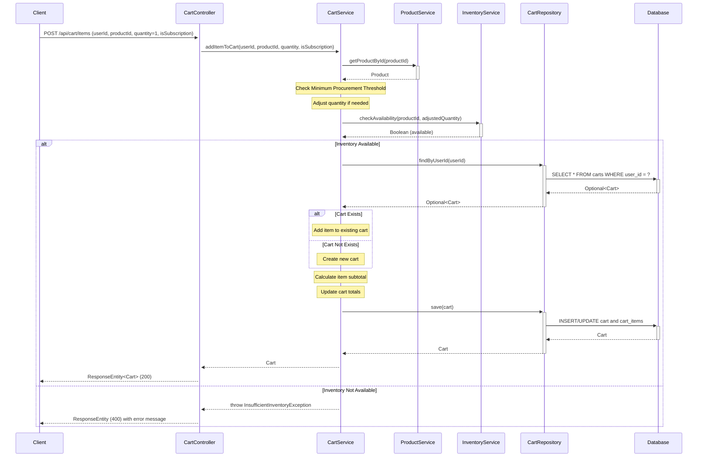
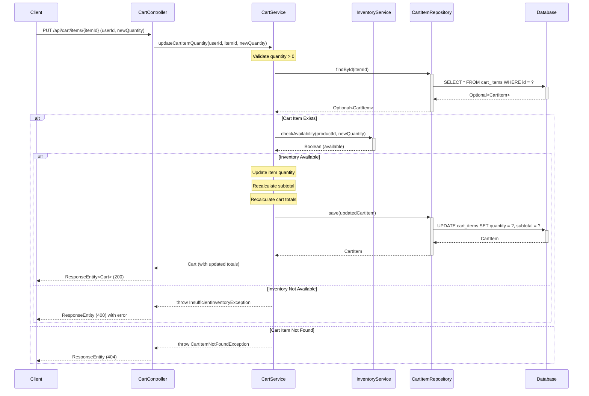
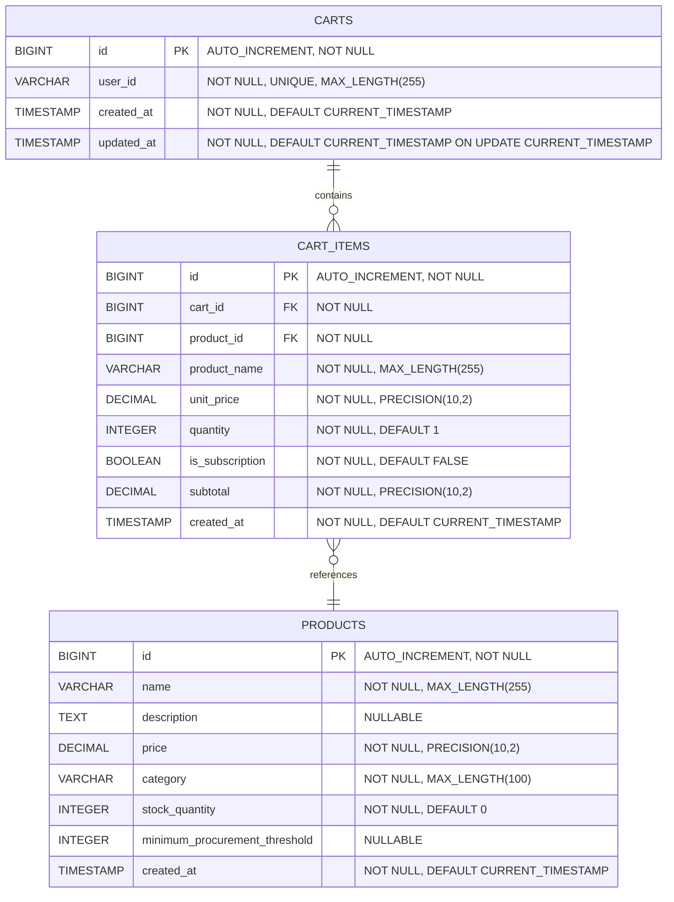
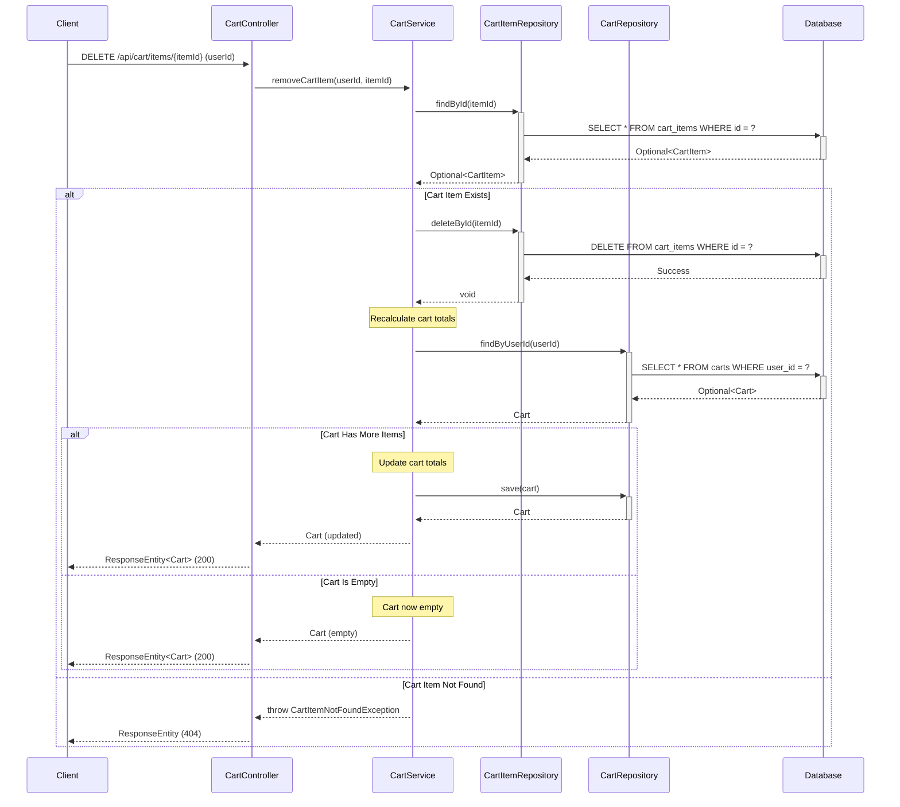
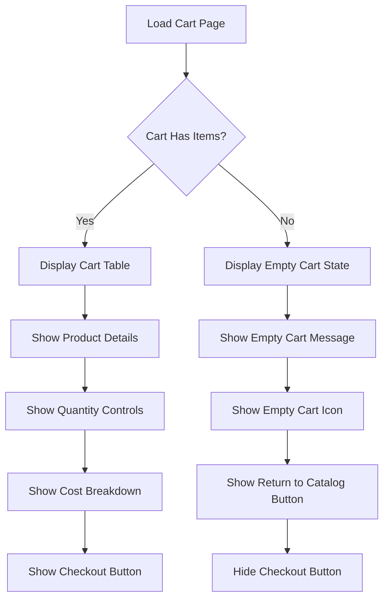
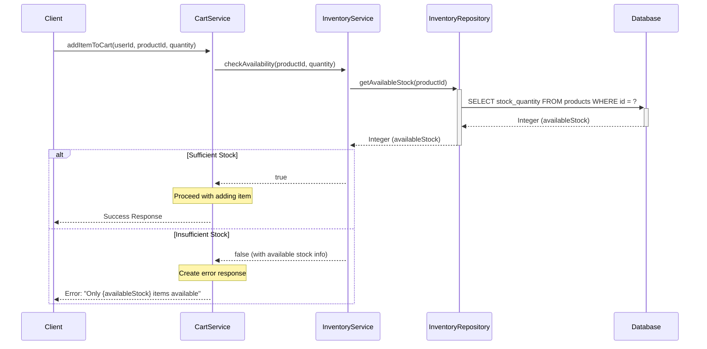
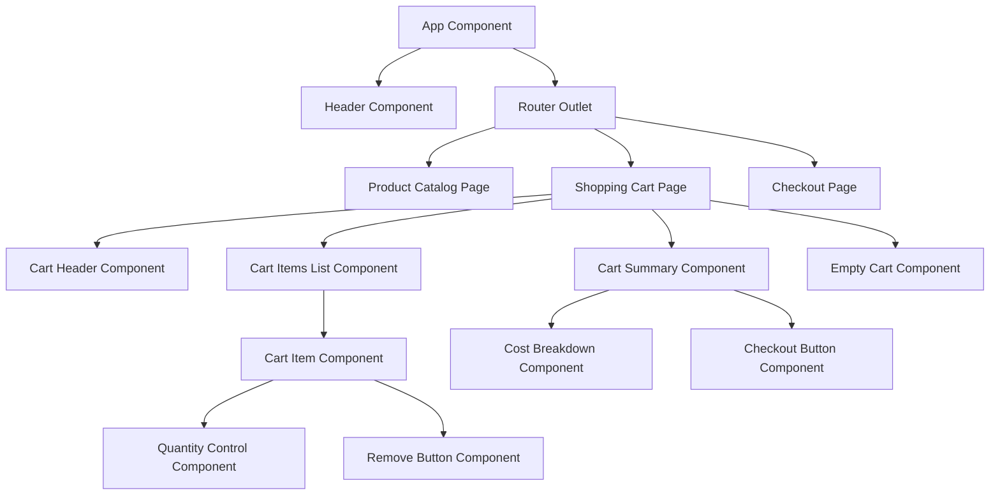

## 9. Shopping Cart Module - Core Features

### 9.1 Add Products to Cart

**Requirement Reference:** AC-1: Add product to cart with default quantity of 1, handle Minimum Procurement Threshold, subscription vs one-time buy logic

**Description:** Implement Add to Cart functionality with default quantity of 1, automatic quantity adjustment for Minimum Procurement Threshold, and different quantity logic for subscription vs one-time purchases.

**Implementation Details:**
- Default quantity set to 1 when adding product to cart
- Automatic quantity adjustment based on Minimum Procurement Threshold (MPT)
- Separate logic for subscription products vs one-time purchase products
- Validation of product availability before adding to cart
- Cart item creation with product reference and quantity

**Class Diagram - Shopping Cart Components:**

```mermaid
classDiagram
    class CartController {
        <<@RestController>>
        -CartService cartService
        +getCart(String userId) ResponseEntity~Cart~
        +addItemToCart(String userId, CartItemRequest request) ResponseEntity~Cart~
        +updateCartItem(String userId, Long itemId, Integer quantity) ResponseEntity~Cart~
        +removeCartItem(String userId, Long itemId) ResponseEntity~Cart~
        +clearCart(String userId) ResponseEntity~Void~
        +calculateCart(String userId) ResponseEntity~CartCalculation~
    }
    
    class CartService {
        <<@Service>>
        -CartRepository cartRepository
        -CartItemRepository cartItemRepository
        -ProductService productService
        -InventoryService inventoryService
        +getCartByUserId(String userId) Cart
        +addItemToCart(String userId, Long productId, Integer quantity, Boolean isSubscription) Cart
        +updateCartItemQuantity(String userId, Long itemId, Integer quantity) Cart
        +removeCartItem(String userId, Long itemId) Cart
        +clearCart(String userId) void
        +validateInventory(Long productId, Integer quantity) Boolean
        +calculateCartTotals(Cart cart) CartCalculation
        +applyMinimumProcurementThreshold(Product product, Integer quantity) Integer
    }
    
    class CartRepository {
        <<@Repository>>
        <<interface>>
        +findByUserId(String userId) Optional~Cart~
        +save(Cart cart) Cart
        +deleteByUserId(String userId) void
    }
    
    class CartItemRepository {
        <<@Repository>>
        <<interface>>
        +findByCartId(Long cartId) List~CartItem~
        +findById(Long id) Optional~CartItem~
        +save(CartItem item) CartItem
        +deleteById(Long id) void
    }
    
    class Cart {
        <<@Entity>>
        -Long id
        -String userId
        -List~CartItem~ items
        -LocalDateTime createdAt
        -LocalDateTime updatedAt
        +getId() Long
        +getUserId() String
        +getItems() List~CartItem~
        +addItem(CartItem item) void
        +removeItem(Long itemId) void
        +clearItems() void
    }
    
    class CartItem {
        <<@Entity>>
        -Long id
        -Long cartId
        -Long productId
        -String productName
        -BigDecimal unitPrice
        -Integer quantity
        -Boolean isSubscription
        -BigDecimal subtotal
        +calculateSubtotal() BigDecimal
    }
    
    class InventoryService {
        <<@Service>>
        +checkAvailability(Long productId, Integer quantity) Boolean
        +getAvailableStock(Long productId) Integer
    }
    
    CartController --> CartService : depends on
    CartService --> CartRepository : depends on
    CartService --> CartItemRepository : depends on
    CartService --> ProductService : depends on
    CartService --> InventoryService : depends on
    CartRepository --> Cart : manages
    CartItemRepository --> CartItem : manages
    Cart --> CartItem : contains
```

**Sequence Diagram - Add Product to Cart:**

```mermaid
sequenceDiagram
    participant Client
    participant CartController
    participant CartService
    participant ProductService
    participant InventoryService
    participant CartRepository
    participant Database
    
    Client->>+CartController: POST /api/cart/items (userId, productId, quantity=1, isSubscription)
    CartController->>+CartService: addItemToCart(userId, productId, quantity, isSubscription)
    
    CartService->>+ProductService: getProductById(productId)
    ProductService-->>-CartService: Product
    
    Note over CartService: Check Minimum Procurement Threshold
    Note over CartService: Adjust quantity if needed
    
    CartService->>+InventoryService: checkAvailability(productId, adjustedQuantity)
    InventoryService-->>-CartService: Boolean (available)
    
    alt Inventory Available
        CartService->>+CartRepository: findByUserId(userId)
        CartRepository->>+Database: SELECT * FROM carts WHERE user_id = ?
        Database-->>-CartRepository: Optional<Cart>
        CartRepository-->>-CartService: Optional<Cart>
        
        alt Cart Exists
            Note over CartService: Add item to existing cart
        else Cart Not Exists
            Note over CartService: Create new cart
        end
        
        Note over CartService: Calculate item subtotal
        Note over CartService: Update cart totals
        
        CartService->>+CartRepository: save(cart)
        CartRepository->>+Database: INSERT/UPDATE cart and cart_items
        Database-->>-CartRepository: Cart
        CartRepository-->>-CartService: Cart
        
        CartService-->>CartController: Cart
        CartController-->>Client: ResponseEntity<Cart> (200)
    else Inventory Not Available
        CartService-->>CartController: throw InsufficientInventoryException
        CartController-->>Client: ResponseEntity (400) with error message
    end
```

### 9.2 Quantity Management

**Requirement Reference:** AC-3: Quantity updates with instant recalculation without page refresh

**Description:** Implement increment/decrement buttons, direct quantity input, instant subtotal and total recalculation, debounced API calls, and optimistic UI updates.

**Implementation Details:**
- Increment/decrement buttons for quantity adjustment
- Direct quantity input field with validation
- Real-time subtotal calculation on quantity change
- Debounced API calls (300ms delay) to reduce server load
- Optimistic UI updates with rollback on error
- Minimum quantity validation (cannot be less than 1)
- Maximum quantity validation based on available inventory

**Sequence Diagram - Update Cart Item Quantity:**

```mermaid
sequenceDiagram
    participant Client
    participant CartController
    participant CartService
    participant InventoryService
    participant CartItemRepository
    participant Database
    
    Client->>+CartController: PUT /api/cart/items/{itemId} (userId, newQuantity)
    CartController->>+CartService: updateCartItemQuantity(userId, itemId, newQuantity)
    
    Note over CartService: Validate quantity > 0
    
    CartService->>+CartItemRepository: findById(itemId)
    CartItemRepository->>+Database: SELECT * FROM cart_items WHERE id = ?
    Database-->>-CartItemRepository: Optional<CartItem>
    CartItemRepository-->>-CartService: Optional<CartItem>
    
    alt Cart Item Exists
        CartService->>+InventoryService: checkAvailability(productId, newQuantity)
        InventoryService-->>-CartService: Boolean (available)
        
        alt Inventory Available
            Note over CartService: Update item quantity
            Note over CartService: Recalculate subtotal
            Note over CartService: Recalculate cart totals
            
            CartService->>+CartItemRepository: save(updatedCartItem)
            CartItemRepository->>+Database: UPDATE cart_items SET quantity = ?, subtotal = ?
            Database-->>-CartItemRepository: CartItem
            CartItemRepository-->>-CartService: CartItem
            
            CartService-->>CartController: Cart (with updated totals)
            CartController-->>Client: ResponseEntity<Cart> (200)
        else Inventory Not Available
            CartService-->>CartController: throw InsufficientInventoryException
            CartController-->>Client: ResponseEntity (400) with error
        end
    else Cart Item Not Found
        CartService-->>CartController: throw CartItemNotFoundException
        CartController-->>Client: ResponseEntity (404)
    end
```

### 9.3 Cart Display

**Requirement Reference:** AC-2: Display all added products with product name, unit price, quantity, and subtotal

**Description:** Implement data table with Product|Qty|Price|Total columns, cost breakdown panel showing subtotal, tax, shipping, grand total, and cart persistence across sessions.

**Implementation Details:**
- Data table displaying: Product Name, Unit Price, Quantity, Subtotal
- Cost breakdown panel with:
  - Subtotal (sum of all item subtotals)
  - Tax (calculated based on tax rate)
  - Shipping cost (based on shipping method)
  - Grand Total (subtotal + tax + shipping)
- Cart persistence using database storage
- Session-based cart retrieval
- Real-time updates on any cart modification

**Entity Relationship Diagram - Shopping Cart Schema:**

```mermaid
erDiagram
    CARTS {
        BIGINT id PK "AUTO_INCREMENT, NOT NULL"
        VARCHAR user_id "NOT NULL, UNIQUE, MAX_LENGTH(255)"
        TIMESTAMP created_at "NOT NULL, DEFAULT CURRENT_TIMESTAMP"
        TIMESTAMP updated_at "NOT NULL, DEFAULT CURRENT_TIMESTAMP ON UPDATE CURRENT_TIMESTAMP"
    }
    
    CART_ITEMS {
        BIGINT id PK "AUTO_INCREMENT, NOT NULL"
        BIGINT cart_id FK "NOT NULL"
        BIGINT product_id FK "NOT NULL"
        VARCHAR product_name "NOT NULL, MAX_LENGTH(255)"
        DECIMAL unit_price "NOT NULL, PRECISION(10,2)"
        INTEGER quantity "NOT NULL, DEFAULT 1"
        BOOLEAN is_subscription "NOT NULL, DEFAULT FALSE"
        DECIMAL subtotal "NOT NULL, PRECISION(10,2)"
        TIMESTAMP created_at "NOT NULL, DEFAULT CURRENT_TIMESTAMP"
    }
    
    PRODUCTS {
        BIGINT id PK "AUTO_INCREMENT, NOT NULL"
        VARCHAR name "NOT NULL, MAX_LENGTH(255)"
        TEXT description "NULLABLE"
        DECIMAL price "NOT NULL, PRECISION(10,2)"
        VARCHAR category "NOT NULL, MAX_LENGTH(100)"
        INTEGER stock_quantity "NOT NULL, DEFAULT 0"
        INTEGER minimum_procurement_threshold "NULLABLE"
        TIMESTAMP created_at "NOT NULL, DEFAULT CURRENT_TIMESTAMP"
    }
    
    CARTS ||--o{ CART_ITEMS : contains
    CART_ITEMS }o--|| PRODUCTS : references
```

### 9.4 Product Removal

**Requirement Reference:** AC-4: Remove product from cart with totals recalculation

**Description:** Implement delete/remove buttons for each cart item, confirmation dialog, automatic total recalculation, and smooth removal animations.

**Implementation Details:**
- Remove/delete button for each cart item
- Optional confirmation dialog before removal
- Automatic recalculation of cart totals after removal
- Smooth UI animations for item removal
- Update cart state immediately
- Handle empty cart state after last item removal

**Sequence Diagram - Remove Cart Item:**

```mermaid
sequenceDiagram
    participant Client
    participant CartController
    participant CartService
    participant CartItemRepository
    participant CartRepository
    participant Database
    
    Client->>+CartController: DELETE /api/cart/items/{itemId} (userId)
    CartController->>+CartService: removeCartItem(userId, itemId)
    
    CartService->>+CartItemRepository: findById(itemId)
    CartItemRepository->>+Database: SELECT * FROM cart_items WHERE id = ?
    Database-->>-CartItemRepository: Optional<CartItem>
    CartItemRepository-->>-CartService: Optional<CartItem>
    
    alt Cart Item Exists
        CartService->>+CartItemRepository: deleteById(itemId)
        CartItemRepository->>+Database: DELETE FROM cart_items WHERE id = ?
        Database-->>-CartItemRepository: Success
        CartItemRepository-->>-CartService: void
        
        Note over CartService: Recalculate cart totals
        
        CartService->>+CartRepository: findByUserId(userId)
        CartRepository->>+Database: SELECT * FROM carts WHERE user_id = ?
        Database-->>-CartRepository: Optional<Cart>
        CartRepository-->>-CartService: Cart
        
        alt Cart Has More Items
            Note over CartService: Update cart totals
            CartService->>+CartRepository: save(cart)
            CartRepository-->>-CartService: Cart
            CartService-->>CartController: Cart (updated)
            CartController-->>Client: ResponseEntity<Cart> (200)
        else Cart Is Empty
            Note over CartService: Cart now empty
            CartService-->>CartController: Cart (empty)
            CartController-->>Client: ResponseEntity<Cart> (200)
        end
    else Cart Item Not Found
        CartService-->>CartController: throw CartItemNotFoundException
        CartController-->>Client: ResponseEntity (404)
    end
```

### 9.5 Empty Cart Handling

**Requirement Reference:** AC-5: Empty cart message with return to catalog button

**Description:** Implement empty cart state with 'Your cart is empty' message, return to product catalog button, and proper navigation flow.

**Implementation Details:**
- Empty cart state detection
- Display "Your cart is empty" message
- "Return to Product Catalog" or "Continue Shopping" button
- Proper navigation to product catalog page
- Hide cart summary and checkout button when empty
- Show empty cart icon/illustration

**Flowchart - Cart Display Logic:**

```mermaid
flowchart TD
    A[Load Cart Page] --> B{Cart Has Items?}
    B -->|Yes| C[Display Cart Table]
    C --> D[Show Product Details]
    D --> E[Show Quantity Controls]
    E --> F[Show Cost Breakdown]
    F --> G[Show Checkout Button]
    
    B -->|No| H[Display Empty Cart State]
    H --> I[Show Empty Cart Message]
    I --> J[Show Empty Cart Icon]
    J --> K[Show Return to Catalog Button]
    K --> L[Hide Checkout Button]
```

### 9.6 Inventory Validation

**Requirement Reference:** AC-6: Inventory validation error when quantity exceeds available stock

**Description:** Implement real-time stock availability checks, inventory validation error messages, quantity limits based on available stock, and integration with inventory management system.

**Implementation Details:**
- Real-time inventory availability checks before adding/updating cart items
- Display clear error messages when requested quantity exceeds available stock
- Show available stock quantity in error message
- Prevent cart operations that would exceed inventory
- Integration with inventory management system
- Automatic quantity adjustment suggestions
- Stock level indicators in cart (e.g., "Only 3 left in stock")

**Sequence Diagram - Inventory Validation:**

```mermaid
sequenceDiagram
    participant Client
    participant CartService
    participant InventoryService
    participant InventoryRepository
    participant Database
    
    Client->>+CartService: addItemToCart(userId, productId, quantity)
    CartService->>+InventoryService: checkAvailability(productId, quantity)
    
    InventoryService->>+InventoryRepository: getAvailableStock(productId)
    InventoryRepository->>+Database: SELECT stock_quantity FROM products WHERE id = ?
    Database-->>-InventoryRepository: Integer (availableStock)
    InventoryRepository-->>-InventoryService: Integer (availableStock)
    
    alt Sufficient Stock
        InventoryService-->>CartService: true
        Note over CartService: Proceed with adding item
        CartService-->>Client: Success Response
    else Insufficient Stock
        InventoryService-->>CartService: false (with available stock info)
        Note over CartService: Create error response
        CartService-->>Client: Error: "Only {availableStock} items available"
    end
```

## 10. Technical Architecture - SPA Implementation

**Requirement Reference:** Story Summary: Single-Page Application (SPA) architecture with microservices backend

**Description:** Implement SPA architecture using React/Angular/Vue.js with client-side routing, state management, and component-based architecture.

**Implementation Details:**

### 10.1 Frontend Architecture

- **Framework:** React.js / Angular / Vue.js
- **State Management:** Redux / NgRx / Vuex
- **Routing:** React Router / Angular Router / Vue Router
- **HTTP Client:** Axios / Angular HttpClient / Vue Axios
- **UI Components:** Material-UI / Angular Material / Vuetify

### 10.2 Component Structure

```mermaid
flowchart TD
    A[App Component] --> B[Header Component]
    A --> C[Router Outlet]
    C --> D[Product Catalog Page]
    C --> E[Shopping Cart Page]
    C --> F[Checkout Page]
    
    E --> G[Cart Header Component]
    E --> H[Cart Items List Component]
    H --> I[Cart Item Component]
    E --> J[Cart Summary Component]
    E --> K[Empty Cart Component]
    
    I --> L[Quantity Control Component]
    I --> M[Remove Button Component]
    
    J --> N[Cost Breakdown Component]
    J --> O[Checkout Button Component]
```

### 10.3 State Management Architecture

- **Cart State:** Centralized cart state in Redux/NgRx/Vuex store
- **Actions:** ADD_TO_CART, UPDATE_QUANTITY, REMOVE_ITEM, CLEAR_CART, LOAD_CART
- **Reducers:** Pure functions to update cart state
- **Selectors:** Memoized selectors for cart totals, item count, etc.
- **Side Effects:** API calls handled by middleware (Redux Thunk/Saga, NgRx Effects)

### 10.4 Client-Side Routing

| Route | Component | Description |
|-------|-----------|-------------|
| `/products` | ProductCatalogPage | Product listing and search |
| `/products/:id` | ProductDetailPage | Individual product details |
| `/cart` | ShoppingCartPage | Shopping cart management |
| `/checkout` | CheckoutPage | Checkout process |
| `/orders` | OrderHistoryPage | Order history |
