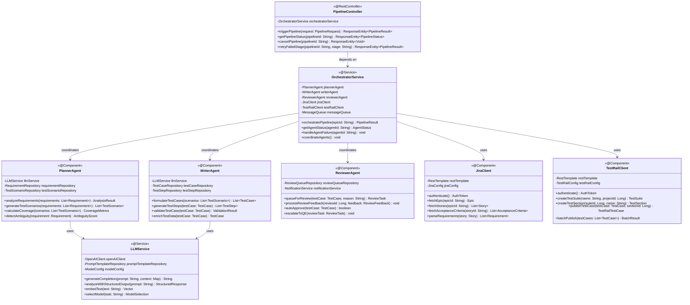
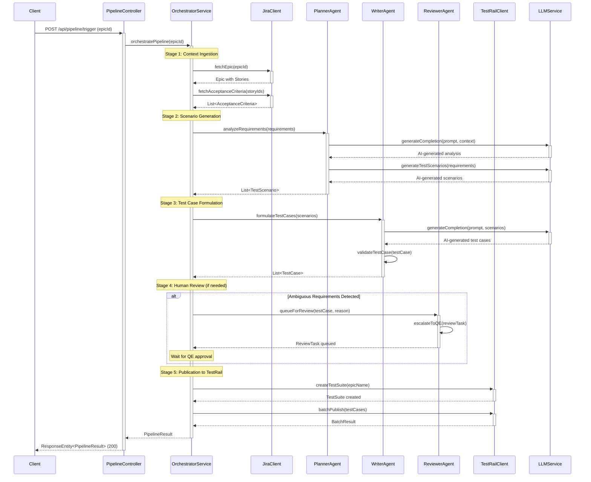
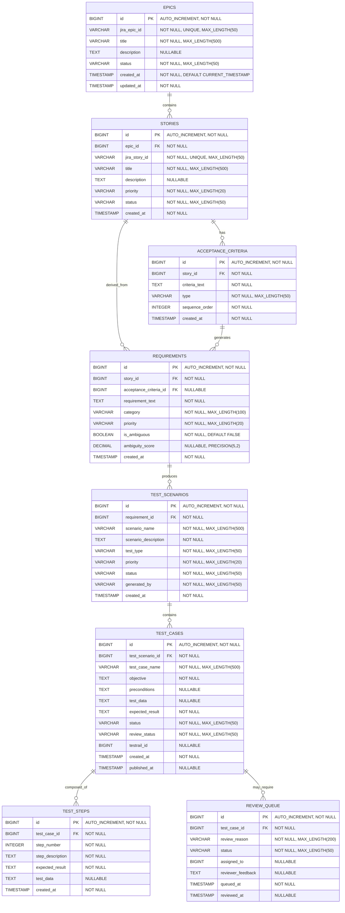
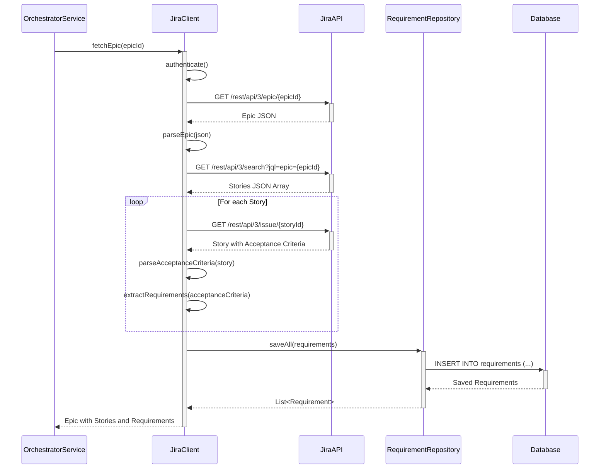
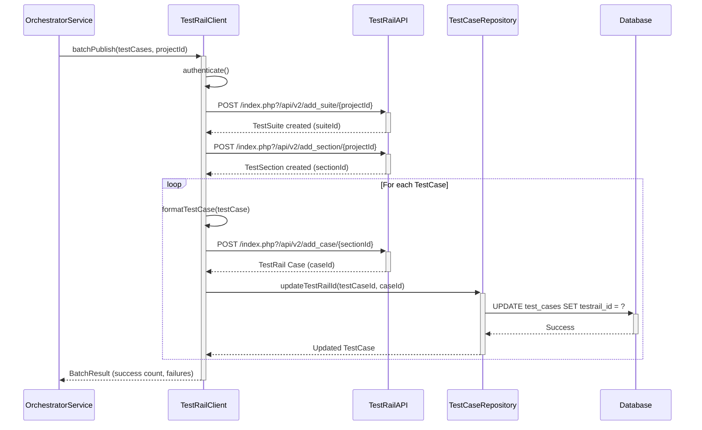
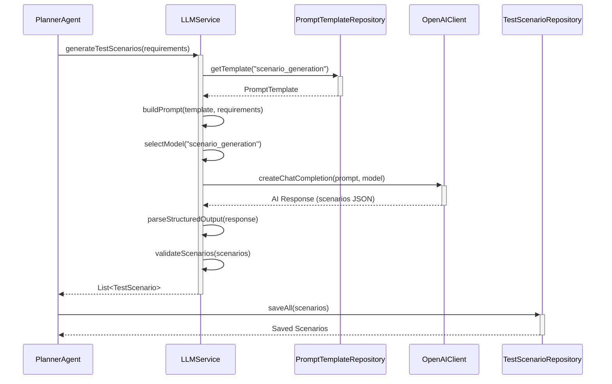
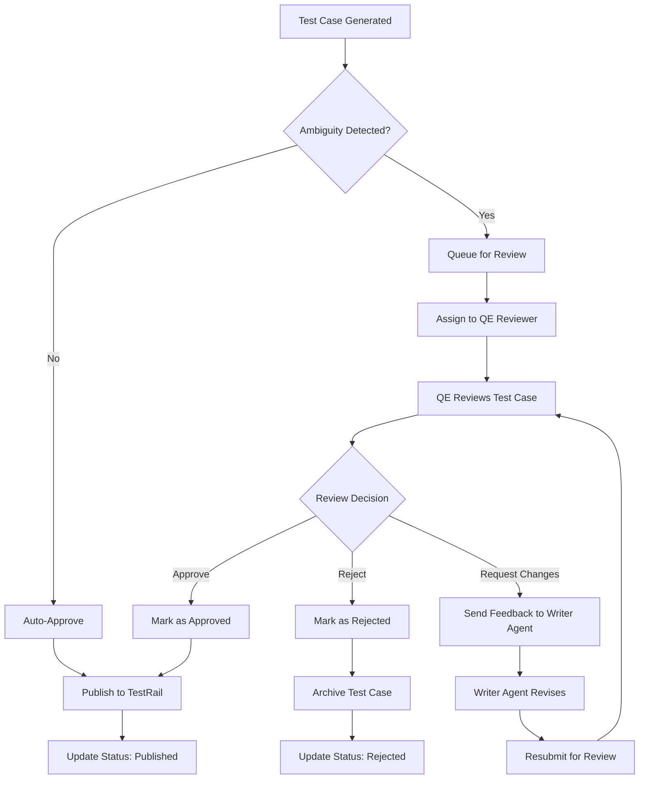
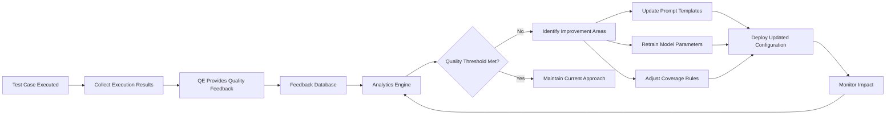

## 10. ADDITIONAL REQUIREMENTS - QE AUTOMATION SYSTEM EXTENSIONS

### 10.1 Requirements Analysis and Gap Assessment

**Epic Reference:** SCRUM-339 - Multi-agent AI framework for automated test case generation  
**Story Reference:** SCRUM-338 - Agentic AI-driven QE pipeline with Jira and TestRail integration

**Analysis Summary:**
- **Overall Alignment Score:** 0.05 (5%)
- **Scope Alignment:** COMPLETE_MISMATCH
- **Total Gaps Identified:** 47
- **Critical Gaps:** 15
- **High Priority Gaps:** 20
- **Medium Priority Gaps:** 12
- **Recommendation:** REJECT_AND_REWRITE_LLD

**Impact Assessment:**  
The current LLD implements an e-commerce product management system, while requirements specify a multi-agent AI framework for test case generation. This represents a fundamental misalignment requiring complete LLD rewrite or significant architectural additions.

### 10.2 Multi-Agent AI Framework Architecture (NEW)

**Component ID:** ADD-001  
**Priority:** CRITICAL  
**Epic Reference:** SCRUM-339: Multi-agent AI framework implementation  
**Story Reference:** SCRUM-338: Multi-agent framework architecture

#### 10.2.1 Multi-Agent System Class Diagram


```mermaid
classDiagram
    class OrchestratorService {
        <<@Service>>
        -PlannerAgent plannerAgent
        -WriterAgent writerAgent
        -ReviewerAgent reviewerAgent
        -JiraClient jiraClient
        -TestRailClient testRailClient
        -MessageQueue messageQueue
        +orchestratePipeline(epicId: String) PipelineResult
        +getAgentStatus(agentId: String) AgentStatus
        +handleAgentFailure(agentId: String) void
        +coordinateAgents() void
    }
    
    class PlannerAgent {
        <<@Component>>
        -LLMService llmService
        -RequirementRepository requirementRepository
        -TestScenarioRepository testScenarioRepository
        +analyzeRequirements(requirements: List~Requirement~) AnalysisResult
        +generateTestScenarios(requirements: List~Requirement~) List~TestScenario~
        +calculateCoverage(scenarios: List~TestScenario~) CoverageMetrics
        +detectAmbiguity(requirement: Requirement) AmbiguityScore
    }
    
    class WriterAgent {
        <<@Component>>
        -LLMService llmService
        -TestCaseRepository testCaseRepository
        -TestStepRepository testStepRepository
        +formulateTestCases(scenarios: List~TestScenario~) List~TestCase~
        +generateTestSteps(testCase: TestCase) List~TestStep~
        +validateTestCase(testCase: TestCase) ValidationResult
        +enrichTestData(testCase: TestCase) TestCase
    }
    
    class ReviewerAgent {
        <<@Component>>
        -ReviewQueueRepository reviewQueueRepository
        -NotificationService notificationService
        +queueForReview(testCase: TestCase, reason: String) ReviewTask
        +processReviewFeedback(reviewId: Long, feedback: ReviewFeedback) void
        +autoApprove(testCase: TestCase) boolean
        +escalateToQE(reviewTask: ReviewTask) void
    }
    
    class JiraClient {
        <<@Component>>
        -RestTemplate restTemplate
        -JiraConfig jiraConfig
        +authenticate() AuthToken
        +fetchEpic(epicId: String) Epic
        +fetchStories(epicId: String) List~Story~
        +fetchAcceptanceCriteria(storyId: String) List~AcceptanceCriteria~
        +parseRequirements(story: Story) List~Requirement~
    }
    
    class TestRailClient {
        <<@Component>>
        -RestTemplate restTemplate
        -TestRailConfig testRailConfig
        +authenticate() AuthToken
        +createTestSuite(name: String, projectId: Long) TestSuite
        +createTestSection(suiteId: Long, name: String) TestSection
        +publishTestCase(testCase: TestCase, sectionId: Long) TestRailTestCase
        +batchPublish(testCases: List~TestCase~) BatchResult
    }
    
    class LLMService {
        <<@Service>>
        -OpenAIClient openAIClient
        -PromptTemplateRepository promptTemplateRepository
        -ModelConfig modelConfig
        +generateCompletion(prompt: String, context: Map) String
        +analyzeWithStructuredOutput(prompt: String) StructuredResponse
        +embedText(text: String) Vector
        +selectModel(task: String) ModelSelection
    }
    
    class PipelineController {
        <<@RestController>>
        -OrchestratorService orchestratorService
        +triggerPipeline(request: PipelineRequest) ResponseEntity~PipelineResult~
        +getPipelineStatus(pipelineId: String) ResponseEntity~PipelineStatus~
        +cancelPipeline(pipelineId: String) ResponseEntity~Void~
        +retryFailedStage(pipelineId: String, stage: String) ResponseEntity~PipelineResult~
    }
    
    OrchestratorService --> PlannerAgent : coordinates
    OrchestratorService --> WriterAgent : coordinates
    OrchestratorService --> ReviewerAgent : coordinates
    OrchestratorService --> JiraClient : uses
    OrchestratorService --> TestRailClient : uses
    PlannerAgent --> LLMService : uses
    WriterAgent --> LLMService : uses
    PipelineController --> OrchestratorService : depends on
```

#### 10.2.2 Multi-Agent Communication Flow


```mermaid
sequenceDiagram
    participant Client
    participant PipelineController
    participant OrchestratorService
    participant JiraClient
    participant PlannerAgent
    participant WriterAgent
    participant ReviewerAgent
    participant TestRailClient
    participant LLMService
    
    Client->>+PipelineController: POST /api/pipeline/trigger (epicId)
    PipelineController->>+OrchestratorService: orchestratePipeline(epicId)
    
    Note over OrchestratorService: Stage 1: Context Ingestion
    OrchestratorService->>+JiraClient: fetchEpic(epicId)
    JiraClient-->>-OrchestratorService: Epic with Stories
    OrchestratorService->>+JiraClient: fetchAcceptanceCriteria(storyIds)
    JiraClient-->>-OrchestratorService: List<AcceptanceCriteria>
    
    Note over OrchestratorService: Stage 2: Scenario Generation
    OrchestratorService->>+PlannerAgent: analyzeRequirements(requirements)
    PlannerAgent->>+LLMService: generateCompletion(prompt, context)
    LLMService-->>-PlannerAgent: AI-generated analysis
    PlannerAgent->>+LLMService: generateTestScenarios(requirements)
    LLMService-->>-PlannerAgent: AI-generated scenarios
    PlannerAgent-->>-OrchestratorService: List<TestScenario>
    
    Note over OrchestratorService: Stage 3: Test Case Formulation
    OrchestratorService->>+WriterAgent: formulateTestCases(scenarios)
    WriterAgent->>+LLMService: generateCompletion(prompt, scenarios)
    LLMService-->>-WriterAgent: AI-generated test cases
    WriterAgent->>WriterAgent: validateTestCase(testCase)
    WriterAgent-->>-OrchestratorService: List<TestCase>
    
    Note over OrchestratorService: Stage 4: Human Review (if needed)
    alt Ambiguous Requirements Detected
        OrchestratorService->>+ReviewerAgent: queueForReview(testCase, reason)
        ReviewerAgent->>ReviewerAgent: escalateToQE(reviewTask)
        ReviewerAgent-->>-OrchestratorService: ReviewTask queued
        Note over OrchestratorService: Wait for QE approval
    end
    
    Note over OrchestratorService: Stage 5: Publication to TestRail
    OrchestratorService->>+TestRailClient: createTestSuite(epicName)
    TestRailClient-->>-OrchestratorService: TestSuite created
    OrchestratorService->>+TestRailClient: batchPublish(testCases)
    TestRailClient-->>-OrchestratorService: BatchResult
    
    OrchestratorService-->>-PipelineController: PipelineResult
    PipelineController-->>-Client: ResponseEntity<PipelineResult> (200)
```

### 10.3 QE Domain Data Models (NEW)

**Component ID:** ADD-010, ADD-011  
**Priority:** HIGH

#### 10.3.1 QE Domain Entity Relationship Diagram


```mermaid
erDiagram
    EPICS {
        BIGINT id PK "AUTO_INCREMENT, NOT NULL"
        VARCHAR jira_epic_id "NOT NULL, UNIQUE, MAX_LENGTH(50)"
        VARCHAR title "NOT NULL, MAX_LENGTH(500)"
        TEXT description "NULLABLE"
        VARCHAR status "NOT NULL, MAX_LENGTH(50)"
        TIMESTAMP created_at "NOT NULL, DEFAULT CURRENT_TIMESTAMP"
        TIMESTAMP updated_at "NOT NULL"
    }
    
    STORIES {
        BIGINT id PK "AUTO_INCREMENT, NOT NULL"
        BIGINT epic_id FK "NOT NULL"
        VARCHAR jira_story_id "NOT NULL, UNIQUE, MAX_LENGTH(50)"
        VARCHAR title "NOT NULL, MAX_LENGTH(500)"
        TEXT description "NULLABLE"
        VARCHAR priority "NOT NULL, MAX_LENGTH(20)"
        VARCHAR status "NOT NULL, MAX_LENGTH(50)"
        TIMESTAMP created_at "NOT NULL"
    }
    
    ACCEPTANCE_CRITERIA {
        BIGINT id PK "AUTO_INCREMENT, NOT NULL"
        BIGINT story_id FK "NOT NULL"
        TEXT criteria_text "NOT NULL"
        VARCHAR type "NOT NULL, MAX_LENGTH(50)"
        INTEGER sequence_order "NOT NULL"
        TIMESTAMP created_at "NOT NULL"
    }
    
    REQUIREMENTS {
        BIGINT id PK "AUTO_INCREMENT, NOT NULL"
        BIGINT story_id FK "NOT NULL"
        BIGINT acceptance_criteria_id FK "NULLABLE"
        TEXT requirement_text "NOT NULL"
        VARCHAR category "NOT NULL, MAX_LENGTH(100)"
        VARCHAR priority "NOT NULL, MAX_LENGTH(20)"
        BOOLEAN is_ambiguous "NOT NULL, DEFAULT FALSE"
        DECIMAL ambiguity_score "NULLABLE, PRECISION(5,2)"
        TIMESTAMP created_at "NOT NULL"
    }
    
    TEST_SCENARIOS {
        BIGINT id PK "AUTO_INCREMENT, NOT NULL"
        BIGINT requirement_id FK "NOT NULL"
        VARCHAR scenario_name "NOT NULL, MAX_LENGTH(500)"
        TEXT scenario_description "NOT NULL"
        VARCHAR test_type "NOT NULL, MAX_LENGTH(50)"
        VARCHAR priority "NOT NULL, MAX_LENGTH(20)"
        VARCHAR status "NOT NULL, MAX_LENGTH(50)"
        VARCHAR generated_by "NOT NULL, MAX_LENGTH(50)"
        TIMESTAMP created_at "NOT NULL"
    }
    
    TEST_CASES {
        BIGINT id PK "AUTO_INCREMENT, NOT NULL"
        BIGINT test_scenario_id FK "NOT NULL"
        VARCHAR test_case_name "NOT NULL, MAX_LENGTH(500)"
        TEXT objective "NOT NULL"
        TEXT preconditions "NULLABLE"
        TEXT test_data "NULLABLE"
        TEXT expected_result "NOT NULL"
        VARCHAR status "NOT NULL, MAX_LENGTH(50)"
        VARCHAR review_status "NOT NULL, MAX_LENGTH(50)"
        BIGINT testrail_id "NULLABLE"
        TIMESTAMP created_at "NOT NULL"
        TIMESTAMP published_at "NULLABLE"
    }
    
    TEST_STEPS {
        BIGINT id PK "AUTO_INCREMENT, NOT NULL"
        BIGINT test_case_id FK "NOT NULL"
        INTEGER step_number "NOT NULL"
        TEXT step_description "NOT NULL"
        TEXT expected_result "NOT NULL"
        TEXT test_data "NULLABLE"
        TIMESTAMP created_at "NOT NULL"
    }
    
    REVIEW_QUEUE {
        BIGINT id PK "AUTO_INCREMENT, NOT NULL"
        BIGINT test_case_id FK "NOT NULL"
        VARCHAR review_reason "NOT NULL, MAX_LENGTH(200)"
        VARCHAR status "NOT NULL, MAX_LENGTH(50)"
        BIGINT assigned_to "NULLABLE"
        TEXT reviewer_feedback "NULLABLE"
        TIMESTAMP queued_at "NOT NULL"
        TIMESTAMP reviewed_at "NULLABLE"
    }
    
    EPICS ||--o{ STORIES : contains
    STORIES ||--o{ ACCEPTANCE_CRITERIA : has
    STORIES ||--o{ REQUIREMENTS : derived_from
    ACCEPTANCE_CRITERIA ||--o{ REQUIREMENTS : generates
    REQUIREMENTS ||--o{ TEST_SCENARIOS : produces
    TEST_SCENARIOS ||--o{ TEST_CASES : contains
    TEST_CASES ||--o{ TEST_STEPS : composed_of
    TEST_CASES ||--o{ REVIEW_QUEUE : may_require
```

#### 10.3.2 QE Domain Database Schema

```sql
-- Epics Table
CREATE TABLE epics (
    id BIGINT PRIMARY KEY AUTO_INCREMENT,
    jira_epic_id VARCHAR(50) NOT NULL UNIQUE,
    title VARCHAR(500) NOT NULL,
    description TEXT,
    status VARCHAR(50) NOT NULL,
    created_at TIMESTAMP NOT NULL DEFAULT CURRENT_TIMESTAMP,
    updated_at TIMESTAMP NOT NULL DEFAULT CURRENT_TIMESTAMP ON UPDATE CURRENT_TIMESTAMP
);

CREATE INDEX idx_epics_jira_id ON epics(jira_epic_id);
CREATE INDEX idx_epics_status ON epics(status);

-- Stories Table
CREATE TABLE stories (
    id BIGINT PRIMARY KEY AUTO_INCREMENT,
    epic_id BIGINT NOT NULL,
    jira_story_id VARCHAR(50) NOT NULL UNIQUE,
    title VARCHAR(500) NOT NULL,
    description TEXT,
    priority VARCHAR(20) NOT NULL,
    status VARCHAR(50) NOT NULL,
    created_at TIMESTAMP NOT NULL DEFAULT CURRENT_TIMESTAMP,
    CONSTRAINT fk_stories_epic FOREIGN KEY (epic_id) REFERENCES epics(id) ON DELETE CASCADE
);

CREATE INDEX idx_stories_epic_id ON stories(epic_id);
CREATE INDEX idx_stories_jira_id ON stories(jira_story_id);
CREATE INDEX idx_stories_priority ON stories(priority);

-- Acceptance Criteria Table
CREATE TABLE acceptance_criteria (
    id BIGINT PRIMARY KEY AUTO_INCREMENT,
    story_id BIGINT NOT NULL,
    criteria_text TEXT NOT NULL,
    type VARCHAR(50) NOT NULL,
    sequence_order INTEGER NOT NULL,
    created_at TIMESTAMP NOT NULL DEFAULT CURRENT_TIMESTAMP,
    CONSTRAINT fk_acceptance_criteria_story FOREIGN KEY (story_id) REFERENCES stories(id) ON DELETE CASCADE
);

CREATE INDEX idx_acceptance_criteria_story_id ON acceptance_criteria(story_id);

-- Requirements Table
CREATE TABLE requirements (
    id BIGINT PRIMARY KEY AUTO_INCREMENT,
    story_id BIGINT NOT NULL,
    acceptance_criteria_id BIGINT,
    requirement_text TEXT NOT NULL,
    category VARCHAR(100) NOT NULL,
    priority VARCHAR(20) NOT NULL,
    is_ambiguous BOOLEAN NOT NULL DEFAULT FALSE,
    ambiguity_score DECIMAL(5,2),
    created_at TIMESTAMP NOT NULL DEFAULT CURRENT_TIMESTAMP,
    CONSTRAINT fk_requirements_story FOREIGN KEY (story_id) REFERENCES stories(id) ON DELETE CASCADE,
    CONSTRAINT fk_requirements_criteria FOREIGN KEY (acceptance_criteria_id) REFERENCES acceptance_criteria(id) ON DELETE SET NULL
);

CREATE INDEX idx_requirements_story_id ON requirements(story_id);
CREATE INDEX idx_requirements_ambiguous ON requirements(is_ambiguous);

-- Test Scenarios Table
CREATE TABLE test_scenarios (
    id BIGINT PRIMARY KEY AUTO_INCREMENT,
    requirement_id BIGINT NOT NULL,
    scenario_name VARCHAR(500) NOT NULL,
    scenario_description TEXT NOT NULL,
    test_type VARCHAR(50) NOT NULL,
    priority VARCHAR(20) NOT NULL,
    status VARCHAR(50) NOT NULL,
    generated_by VARCHAR(50) NOT NULL,
    created_at TIMESTAMP NOT NULL DEFAULT CURRENT_TIMESTAMP,
    CONSTRAINT fk_test_scenarios_requirement FOREIGN KEY (requirement_id) REFERENCES requirements(id) ON DELETE CASCADE
);

CREATE INDEX idx_test_scenarios_requirement_id ON test_scenarios(requirement_id);
CREATE INDEX idx_test_scenarios_status ON test_scenarios(status);

-- Test Cases Table
CREATE TABLE test_cases (
    id BIGINT PRIMARY KEY AUTO_INCREMENT,
    test_scenario_id BIGINT NOT NULL,
    test_case_name VARCHAR(500) NOT NULL,
    objective TEXT NOT NULL,
    preconditions TEXT,
    test_data TEXT,
    expected_result TEXT NOT NULL,
    status VARCHAR(50) NOT NULL,
    review_status VARCHAR(50) NOT NULL,
    testrail_id BIGINT,
    created_at TIMESTAMP NOT NULL DEFAULT CURRENT_TIMESTAMP,
    published_at TIMESTAMP,
    CONSTRAINT fk_test_cases_scenario FOREIGN KEY (test_scenario_id) REFERENCES test_scenarios(id) ON DELETE CASCADE
);

CREATE INDEX idx_test_cases_scenario_id ON test_cases(test_scenario_id);
CREATE INDEX idx_test_cases_review_status ON test_cases(review_status);
CREATE INDEX idx_test_cases_testrail_id ON test_cases(testrail_id);

-- Test Steps Table
CREATE TABLE test_steps (
    id BIGINT PRIMARY KEY AUTO_INCREMENT,
    test_case_id BIGINT NOT NULL,
    step_number INTEGER NOT NULL,
    step_description TEXT NOT NULL,
    expected_result TEXT NOT NULL,
    test_data TEXT,
    created_at TIMESTAMP NOT NULL DEFAULT CURRENT_TIMESTAMP,
    CONSTRAINT fk_test_steps_test_case FOREIGN KEY (test_case_id) REFERENCES test_cases(id) ON DELETE CASCADE
);

CREATE INDEX idx_test_steps_test_case_id ON test_steps(test_case_id);

-- Review Queue Table
CREATE TABLE review_queue (
    id BIGINT PRIMARY KEY AUTO_INCREMENT,
    test_case_id BIGINT NOT NULL,
    review_reason VARCHAR(200) NOT NULL,
    status VARCHAR(50) NOT NULL,
    assigned_to BIGINT,
    reviewer_feedback TEXT,
    queued_at TIMESTAMP NOT NULL DEFAULT CURRENT_TIMESTAMP,
    reviewed_at TIMESTAMP,
    CONSTRAINT fk_review_queue_test_case FOREIGN KEY (test_case_id) REFERENCES test_cases(id) ON DELETE CASCADE
);

CREATE INDEX idx_review_queue_status ON review_queue(status);
CREATE INDEX idx_review_queue_assigned_to ON review_queue(assigned_to);
```

### 10.4 External API Integration Modules (NEW)

**Component IDs:** ADD-002, ADD-005  
**Priority:** CRITICAL

#### 10.4.1 Jira API Integration Sequence


```mermaid
sequenceDiagram
    participant OrchestratorService
    participant JiraClient
    participant JiraAPI
    participant RequirementRepository
    participant Database
    
    OrchestratorService->>+JiraClient: fetchEpic(epicId)
    JiraClient->>JiraClient: authenticate()
    JiraClient->>+JiraAPI: GET /rest/api/3/epic/{epicId}
    JiraAPI-->>-JiraClient: Epic JSON
    JiraClient->>JiraClient: parseEpic(json)
    
    JiraClient->>+JiraAPI: GET /rest/api/3/search?jql=epic={epicId}
    JiraAPI-->>-JiraClient: Stories JSON Array
    
    loop For each Story
        JiraClient->>+JiraAPI: GET /rest/api/3/issue/{storyId}
        JiraAPI-->>-JiraClient: Story with Acceptance Criteria
        JiraClient->>JiraClient: parseAcceptanceCriteria(story)
        JiraClient->>JiraClient: extractRequirements(acceptanceCriteria)
    end
    
    JiraClient->>+RequirementRepository: saveAll(requirements)
    RequirementRepository->>+Database: INSERT INTO requirements (...)
    Database-->>-RequirementRepository: Saved Requirements
    RequirementRepository-->>-JiraClient: List<Requirement>
    
    JiraClient-->>-OrchestratorService: Epic with Stories and Requirements
```

#### 10.4.2 TestRail API Integration Sequence


```mermaid
sequenceDiagram
    participant OrchestratorService
    participant TestRailClient
    participant TestRailAPI
    participant TestCaseRepository
    participant Database
    
    OrchestratorService->>+TestRailClient: batchPublish(testCases, projectId)
    TestRailClient->>TestRailClient: authenticate()
    
    TestRailClient->>+TestRailAPI: POST /index.php?/api/v2/add_suite/{projectId}
    TestRailAPI-->>-TestRailClient: TestSuite created (suiteId)
    
    TestRailClient->>+TestRailAPI: POST /index.php?/api/v2/add_section/{projectId}
    TestRailAPI-->>-TestRailClient: TestSection created (sectionId)
    
    loop For each TestCase
        TestRailClient->>TestRailClient: formatTestCase(testCase)
        TestRailClient->>+TestRailAPI: POST /index.php?/api/v2/add_case/{sectionId}
        TestRailAPI-->>-TestRailClient: TestRail Case (caseId)
        
        TestRailClient->>+TestCaseRepository: updateTestRailId(testCaseId, caseId)
        TestCaseRepository->>+Database: UPDATE test_cases SET testrail_id = ?
        Database-->>-TestCaseRepository: Success
        TestCaseRepository-->>-TestRailClient: Updated TestCase
    end
    
    TestRailClient-->>-OrchestratorService: BatchResult (success count, failures)
```

### 10.5 AI/ML Integration and LLM Service (NEW)

**Component IDs:** ADD-003, ADD-004, ADD-012  
**Priority:** CRITICAL

#### 10.5.1 LLM Service Configuration

**Technical Details:**
- **LLM Provider:** OpenAI GPT-4 / Anthropic Claude / Azure OpenAI
- **Prompt Engineering:** Template-based with context injection
- **Model Selection:** Task-specific model routing
- **Fallback Strategy:** Secondary model on primary failure
- **Rate Limiting:** Token bucket algorithm with retry logic
- **Caching:** Redis-based response caching for similar prompts

#### 10.5.2 Test Scenario Generation Flow


```mermaid
sequenceDiagram
    participant PlannerAgent
    participant LLMService
    participant PromptTemplateRepository
    participant OpenAIClient
    participant TestScenarioRepository
    
    PlannerAgent->>+LLMService: generateTestScenarios(requirements)
    LLMService->>+PromptTemplateRepository: getTemplate("scenario_generation")
    PromptTemplateRepository-->>-LLMService: PromptTemplate
    
    LLMService->>LLMService: buildPrompt(template, requirements)
    LLMService->>LLMService: selectModel("scenario_generation")
    
    LLMService->>+OpenAIClient: createChatCompletion(prompt, model)
    OpenAIClient-->>-LLMService: AI Response (scenarios JSON)
    
    LLMService->>LLMService: parseStructuredOutput(response)
    LLMService->>LLMService: validateScenarios(scenarios)
    
    LLMService-->>-PlannerAgent: List<TestScenario>
    
    PlannerAgent->>+TestScenarioRepository: saveAll(scenarios)
    TestScenarioRepository-->>-PlannerAgent: Saved Scenarios
```

### 10.6 Human-in-the-Loop Review Workflow (NEW)

**Component ID:** ADD-006  
**Priority:** CRITICAL  
**Story Reference:** SCRUM-338: Human-in-the-Loop, QE sign-off for ambiguous requirements

#### 10.6.1 Review Workflow State Machine


```mermaid
flowchart TD
    A[Test Case Generated] --> B{Ambiguity Detected?}
    B -->|No| C[Auto-Approve]
    B -->|Yes| D[Queue for Review]
    
    C --> E[Publish to TestRail]
    
    D --> F[Assign to QE Reviewer]
    F --> G[QE Reviews Test Case]
    
    G --> H{Review Decision}
    H -->|Approve| I[Mark as Approved]
    H -->|Reject| J[Mark as Rejected]
    H -->|Request Changes| K[Send Feedback to Writer Agent]
    
    I --> E
    J --> L[Archive Test Case]
    K --> M[Writer Agent Revises]
    M --> N[Resubmit for Review]
    N --> G
    
    E --> O[Update Status: Published]
    L --> P[Update Status: Rejected]
```

#### 10.6.2 Review API Endpoints

**New API Endpoints for Review Workflow:**

| Method | Endpoint | Description | Request Body | Response |
|--------|----------|-------------|--------------|----------|
| GET | `/api/review/queue` | Get pending review tasks | Query: assignedTo, status | List<ReviewTask> |
| GET | `/api/review/{reviewId}` | Get review task details | None | ReviewTask |
| POST | `/api/review/{reviewId}/approve` | Approve test case | ApprovalRequest | ReviewResult |
| POST | `/api/review/{reviewId}/reject` | Reject test case | RejectionRequest (reason) | ReviewResult |
| POST | `/api/review/{reviewId}/feedback` | Provide feedback for revision | FeedbackRequest | ReviewResult |
| GET | `/api/review/metrics` | Get review metrics | Query: dateRange | ReviewMetrics |

### 10.7 Dashboard and Monitoring (NEW)

**Component IDs:** ADD-007, ADD-014  
**Priority:** HIGH/MEDIUM

#### 10.7.1 Dashboard Metrics

**Real-time Metrics:**
- Pipeline execution status (running, completed, failed)
- Test scenarios generated count
- Test cases formulated count
- Test cases published to TestRail count
- Review queue size and average review time
- Ambiguity detection rate
- Test coverage percentage by epic/story
- AI model performance metrics (latency, token usage)

**Quality Indicators:**
- Test case quality score (AI-generated)
- Requirement coverage completeness
- Review approval rate
- Test case revision rate
- Integration success rate (Jira/TestRail)

### 10.8 Continuous Improvement Feedback Loop (NEW)

**Component ID:** ADD-008  
**Priority:** HIGH

#### 10.8.1 Feedback Collection Flow


```mermaid
flowchart LR
    A[Test Case Executed] --> B[Collect Execution Results]
    B --> C[QE Provides Quality Feedback]
    C --> D[Feedback Database]
    
    D --> E[Analytics Engine]
    E --> F{Quality Threshold Met?}
    
    F -->|No| G[Identify Improvement Areas]
    F -->|Yes| H[Maintain Current Approach]
    
    G --> I[Update Prompt Templates]
    G --> J[Retrain Model Parameters]
    G --> K[Adjust Coverage Rules]
    
    I --> L[Deploy Updated Configuration]
    J --> L
    K --> L
    
    L --> M[Monitor Impact]
    M --> E
```

### 10.9 Enhanced Technology Stack for QE Automation

**Additional Technologies Required:**

- **AI/ML Libraries:**
  - OpenAI Java SDK / LangChain4j
  - Spring AI (for LLM integration)
  - Vector database (Pinecone/Weaviate) for embeddings

- **Message Queue:**
  - Apache Kafka / RabbitMQ for agent communication
  - Redis for caching and session management

- **Monitoring & Observability:**
  - ELK Stack (Elasticsearch, Logstash, Kibana)
  - Prometheus + Grafana for metrics
  - OpenTelemetry for distributed tracing

- **API Clients:**
  - Jira REST API Client
  - TestRail API Client
  - Custom retry and circuit breaker (Resilience4j)

- **Frontend (Dashboard):**
  - React.js / Angular
  - WebSocket for real-time updates
  - Chart.js / D3.js for visualizations

### 10.10 Security and Authentication (NEW)

**Component ID:** ADD-013  
**Priority:** HIGH

**Security Requirements:**
- OAuth2 / JWT-based authentication
- Role-based access control (RBAC)
  - Admin: Full pipeline control
  - QE Reviewer: Review and approval rights
  - Viewer: Read-only dashboard access
- API key management for external services (Jira, TestRail, OpenAI)
- Audit logging for all critical operations
- Secrets management (AWS Secrets Manager / HashiCorp Vault)

### 10.11 API Endpoints Summary for QE Automation

**New Pipeline Control Endpoints:**

| Method | Endpoint | Description | Request Body | Response |
|--------|----------|-------------|--------------|----------|
| POST | `/api/pipeline/trigger` | Trigger test generation pipeline | PipelineRequest (epicId) | PipelineResult |
| GET | `/api/pipeline/status/{pipelineId}` | Get pipeline execution status | None | PipelineStatus |
| POST | `/api/pipeline/cancel/{pipelineId}` | Cancel running pipeline | None | CancellationResult |
| POST | `/api/pipeline/retry/{pipelineId}` | Retry failed pipeline stage | RetryRequest (stage) | PipelineResult |
| GET | `/api/testcases` | Get generated test cases | Query: scenarioId, status | List<TestCase> |
| GET | `/api/testcases/{testCaseId}` | Get test case details | None | TestCase |
| GET | `/api/scenarios` | Get test scenarios | Query: requirementId, status | List<TestScenario> |
| GET | `/api/requirements` | Get parsed requirements | Query: storyId, epicId | List<Requirement> |
| GET | `/api/metrics/coverage` | Get test coverage metrics | Query: epicId | CoverageMetrics |
| GET | `/api/metrics/pipeline` | Get pipeline performance metrics | Query: dateRange | PipelineMetrics |

### 10.12 Risk Assessment and Mitigation

**Overall Risk Level:** CRITICAL  
**Project Impact:** PROJECT_BLOCKING

**Key Risks:**

1. **RISK-001: Complete Scope Mismatch**
   - **Severity:** CRITICAL
   - **Probability:** 100%
   - **Impact:** Project cannot proceed with current LLD
   - **Mitigation:** Immediate LLD rewrite with correct scope

2. **RISK-002: Timeline Delays**
   - **Severity:** HIGH
   - **Probability:** 100%
   - **Impact:** Project timeline extension of 4-6 weeks minimum
   - **Mitigation:** Fast-track LLD rewrite with dedicated resources

3. **RISK-003: AI/ML Integration Complexity**
   - **Severity:** HIGH
   - **Probability:** 90%
   - **Impact:** Technical challenges in LLM integration, agent orchestration
   - **Mitigation:** Engage AI/ML experts, prototype critical components early

4. **RISK-004: External API Dependencies**
   - **Severity:** HIGH
   - **Probability:** 85%
   - **Impact:** Integration failures, data sync issues, API rate limiting
   - **Mitigation:** Design robust API clients with retry logic and error handling

### 10.13 Recommendations

**Immediate Actions:**
1. REJECT current LLD as it implements wrong system entirely
2. Initiate complete LLD rewrite focused on QE automation domain
3. Engage AI/ML architects to design multi-agent framework
4. Design Jira and TestRail integration architecture
5. Create proof-of-concept for LLM-based test generation

**Short-term Actions:**
1. Define detailed agent architecture and communication protocols
2. Design data models for Requirement, TestScenario, TestCase entities
3. Specify LLM integration approach and prompt engineering strategy
4. Design human-in-the-loop review workflow
5. Create API specifications for pipeline control

**Long-term Actions:**
1. Implement continuous improvement feedback loop
2. Build comprehensive monitoring and observability
3. Develop dashboard for pipeline visualization
4. Create automated quality validation framework
5. Establish model retraining and improvement process

### 10.14 Traceability Matrix

**Epic to LLD Mapping:**
- **SCRUM-339:** Multi-agent AI framework for automated test case generation
  - **Current Coverage:** 0% (Not implemented in original LLD)
  - **Required Coverage:** Sections 10.2 - 10.13 (Added in this document)
  - **Status:** NEWLY ADDED

**Story to LLD Mapping:**
- **SCRUM-338:** Agentic AI-driven QE pipeline with Jira and TestRail integration
  - **Current Coverage:** 0% (Not implemented in original LLD)
  - **Required Coverage:** Sections 10.2 - 10.13 (Added in this document)
  - **Status:** NEWLY ADDED

**Acceptance Criteria Coverage:**
- Context Ingestion (Jira API): Section 10.4.1
- Scenario Generation (Planner Agent): Sections 10.2.1, 10.5.2
- Test Case Formulation (Writer Agent): Sections 10.2.1, 10.5
- Test Management Integration (TestRail API): Section 10.4.2
- Human-in-the-Loop (QE sign-off): Section 10.6

---
