## 3. Sequence Diagrams

### 3.1 Get All Products

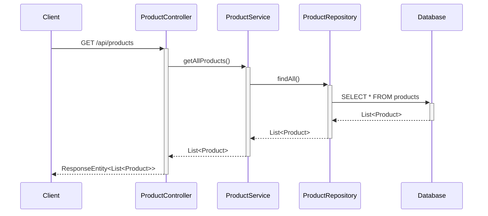
```mermaid
sequenceDiagram
    participant Client
    participant ProductController
    participant ProductService
    participant ProductRepository
    participant Database
    
    Client->>+ProductController: GET /api/products
    ProductController->>+ProductService: getAllProducts()
    ProductService->>+ProductRepository: findAll()
    ProductRepository->>+Database: SELECT * FROM products
    Database-->>-ProductRepository: List<Product>
    ProductRepository-->>-ProductService: List<Product>
    ProductService-->>-ProductController: List<Product>
    ProductController-->>-Client: ResponseEntity<List<Product>>
```

### 3.2 Get Product By ID

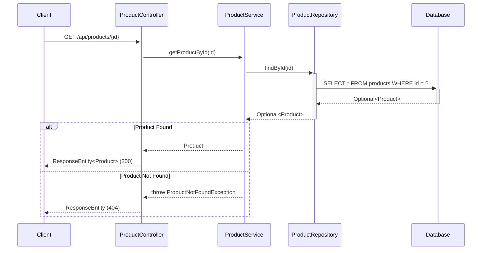
```mermaid
sequenceDiagram
    participant Client
    participant ProductController
    participant ProductService
    participant ProductRepository
    participant Database
    
    Client->>+ProductController: GET /api/products/{id}
    ProductController->>+ProductService: getProductById(id)
    ProductService->>+ProductRepository: findById(id)
    ProductRepository->>+Database: SELECT * FROM products WHERE id = ?
    Database-->>-ProductRepository: Optional<Product>
    ProductRepository-->>-ProductService: Optional<Product>
    
    alt Product Found
        ProductService-->>ProductController: Product
        ProductController-->>Client: ResponseEntity<Product> (200)
    else Product Not Found
        ProductService-->>ProductController: throw ProductNotFoundException
        ProductController-->>Client: ResponseEntity (404)
    end
```

### 3.3 Create Product

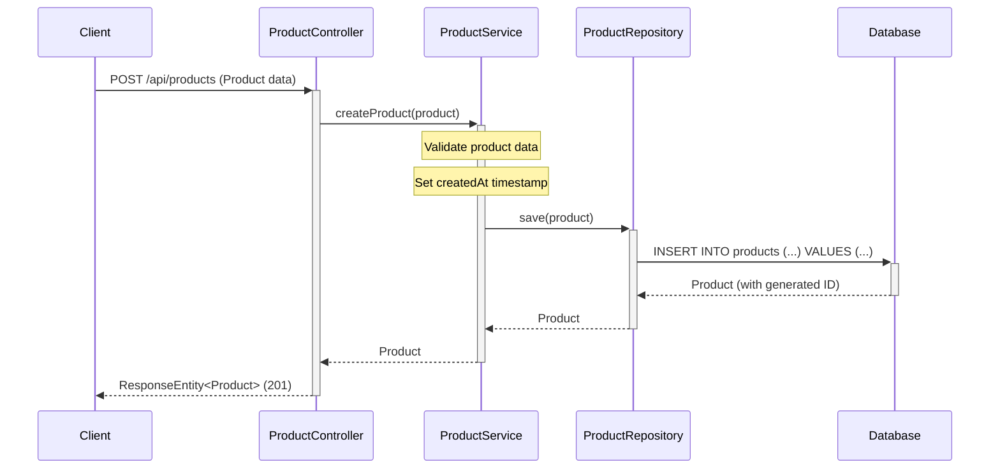
```mermaid
sequenceDiagram
    participant Client
    participant ProductController
    participant ProductService
    participant ProductRepository
    participant Database
    
    Client->>+ProductController: POST /api/products (Product data)
    ProductController->>+ProductService: createProduct(product)
    
    Note over ProductService: Validate product data
    Note over ProductService: Set createdAt timestamp
    
    ProductService->>+ProductRepository: save(product)
    ProductRepository->>+Database: INSERT INTO products (...) VALUES (...)
    Database-->>-ProductRepository: Product (with generated ID)
    ProductRepository-->>-ProductService: Product
    ProductService-->>-ProductController: Product
    ProductController-->>-Client: ResponseEntity<Product> (201)
```

### 3.4 Update Product

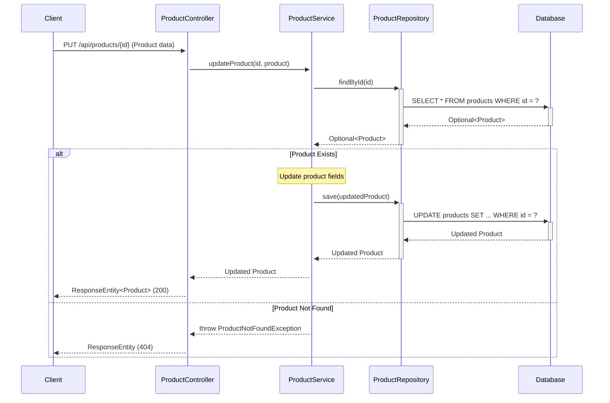
```mermaid
sequenceDiagram
    participant Client
    participant ProductController
    participant ProductService
    participant ProductRepository
    participant Database
    
    Client->>+ProductController: PUT /api/products/{id} (Product data)
    ProductController->>+ProductService: updateProduct(id, product)
    
    ProductService->>+ProductRepository: findById(id)
    ProductRepository->>+Database: SELECT * FROM products WHERE id = ?
    Database-->>-ProductRepository: Optional<Product>
    ProductRepository-->>-ProductService: Optional<Product>
    
    alt Product Exists
        Note over ProductService: Update product fields
        ProductService->>+ProductRepository: save(updatedProduct)
        ProductRepository->>+Database: UPDATE products SET ... WHERE id = ?
        Database-->>-ProductRepository: Updated Product
        ProductRepository-->>-ProductService: Updated Product
        ProductService-->>ProductController: Updated Product
        ProductController-->>Client: ResponseEntity<Product> (200)
    else Product Not Found
        ProductService-->>ProductController: throw ProductNotFoundException
        ProductController-->>Client: ResponseEntity (404)
    end
```

### 3.5 Delete Product

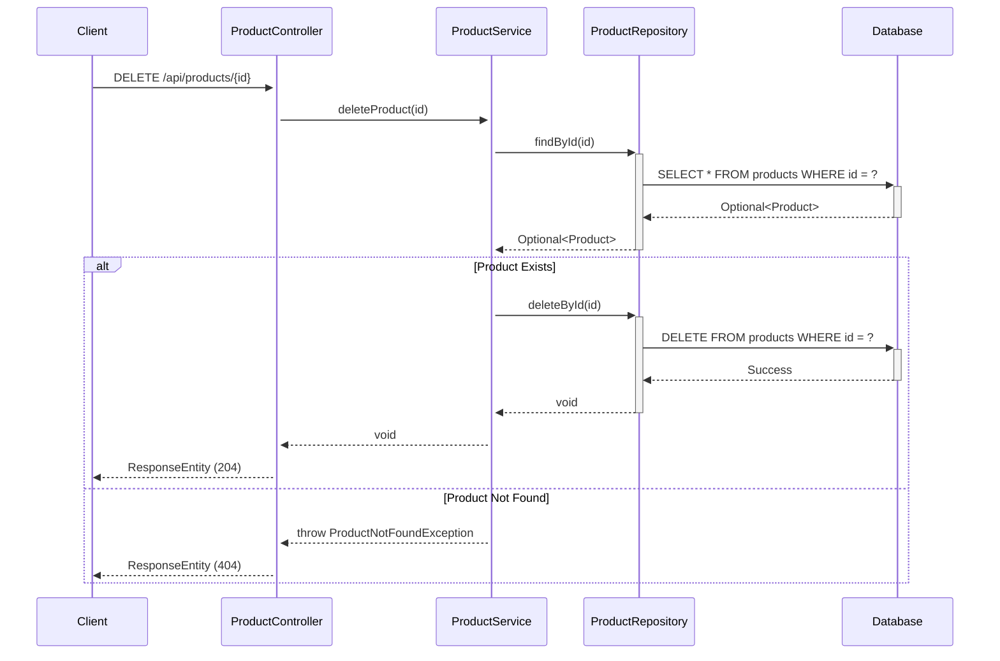
```mermaid
sequenceDiagram
    participant Client
    participant ProductController
    participant ProductService
    participant ProductRepository
    participant Database
    
    Client->>+ProductController: DELETE /api/products/{id}
    ProductController->>+ProductService: deleteProduct(id)
    
    ProductService->>+ProductRepository: findById(id)
    ProductRepository->>+Database: SELECT * FROM products WHERE id = ?
    Database-->>-ProductRepository: Optional<Product>
    ProductRepository-->>-ProductService: Optional<Product>
    
    alt Product Exists
        ProductService->>+ProductRepository: deleteById(id)
        ProductRepository->>+Database: DELETE FROM products WHERE id = ?
        Database-->>-ProductRepository: Success
        ProductRepository-->>-ProductService: void
        ProductService-->>ProductController: void
        ProductController-->>Client: ResponseEntity (204)
    else Product Not Found
        ProductService-->>ProductController: throw ProductNotFoundException
        ProductController-->>Client: ResponseEntity (404)
    end
```

### 3.6 Get Products By Category

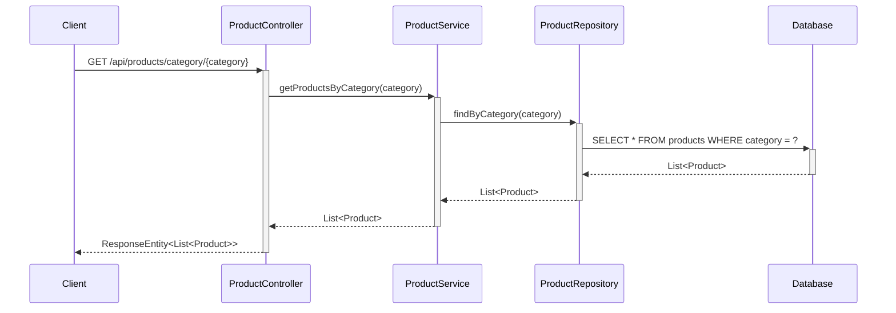
```mermaid
sequenceDiagram
    participant Client
    participant ProductController
    participant ProductService
    participant ProductRepository
    participant Database
    
    Client->>+ProductController: GET /api/products/category/{category}
    ProductController->>+ProductService: getProductsByCategory(category)
    ProductService->>+ProductRepository: findByCategory(category)
    ProductRepository->>+Database: SELECT * FROM products WHERE category = ?
    Database-->>-ProductRepository: List<Product>
    ProductRepository-->>-ProductService: List<Product>
    ProductService-->>-ProductController: List<Product>
    ProductController-->>-Client: ResponseEntity<List<Product>>
```

### 3.7 Search Products

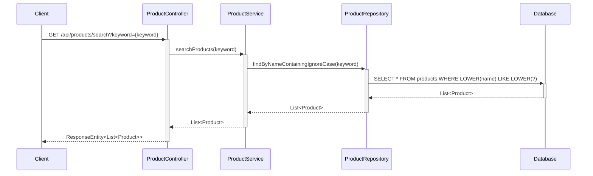
```mermaid
sequenceDiagram
    participant Client
    participant ProductController
    participant ProductService
    participant ProductRepository
    participant Database
    
    Client->>+ProductController: GET /api/products/search?keyword={keyword}
    ProductController->>+ProductService: searchProducts(keyword)
    ProductService->>+ProductRepository: findByNameContainingIgnoreCase(keyword)
    ProductRepository->>+Database: SELECT * FROM products WHERE LOWER(name) LIKE LOWER(?)
    Database-->>-ProductRepository: List<Product>
    ProductRepository-->>-ProductService: List<Product>
    ProductService-->>-ProductController: List<Product>
    ProductController-->>-Client: ResponseEntity<List<Product>>
```

### 3.8 Add Product to Cart

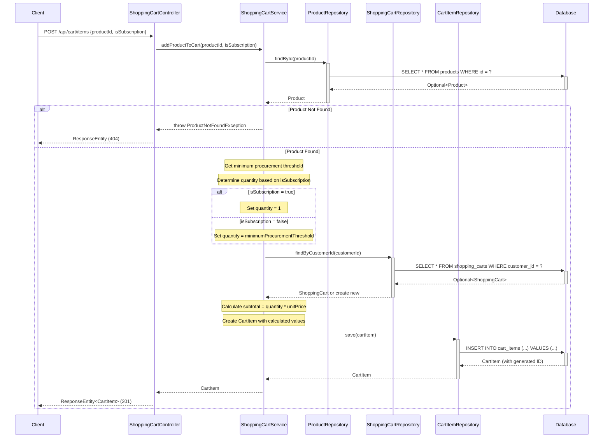
```mermaid
sequenceDiagram
    participant Client
    participant ShoppingCartController
    participant ShoppingCartService
    participant ProductRepository
    participant ShoppingCartRepository
    participant CartItemRepository
    participant Database
    
    Client->>+ShoppingCartController: POST /api/cart/items {productId, isSubscription}
    ShoppingCartController->>+ShoppingCartService: addProductToCart(productId, isSubscription)
    
    ShoppingCartService->>+ProductRepository: findById(productId)
    ProductRepository->>+Database: SELECT * FROM products WHERE id = ?
    Database-->>-ProductRepository: Optional<Product>
    ProductRepository-->>-ShoppingCartService: Product
    
    alt Product Not Found
        ShoppingCartService-->>ShoppingCartController: throw ProductNotFoundException
        ShoppingCartController-->>Client: ResponseEntity (404)
    else Product Found
        Note over ShoppingCartService: Get minimum procurement threshold
        Note over ShoppingCartService: Determine quantity based on isSubscription
        
        alt isSubscription = true
            Note over ShoppingCartService: Set quantity = 1
        else isSubscription = false
            Note over ShoppingCartService: Set quantity = minimumProcurementThreshold
        end
        
        ShoppingCartService->>+ShoppingCartRepository: findByCustomerId(customerId)
        ShoppingCartRepository->>+Database: SELECT * FROM shopping_carts WHERE customer_id = ?
        Database-->>-ShoppingCartRepository: Optional<ShoppingCart>
        ShoppingCartRepository-->>-ShoppingCartService: ShoppingCart or create new
        
        Note over ShoppingCartService: Calculate subtotal = quantity * unitPrice
        Note over ShoppingCartService: Create CartItem with calculated values
        
        ShoppingCartService->>+CartItemRepository: save(cartItem)
        CartItemRepository->>+Database: INSERT INTO cart_items (...) VALUES (...)
        Database-->>-CartItemRepository: CartItem (with generated ID)
        CartItemRepository-->>-ShoppingCartService: CartItem
        
        ShoppingCartService-->>ShoppingCartController: CartItem
        ShoppingCartController-->>Client: ResponseEntity<CartItem> (201)
    end
```

### 3.9 View Shopping Cart

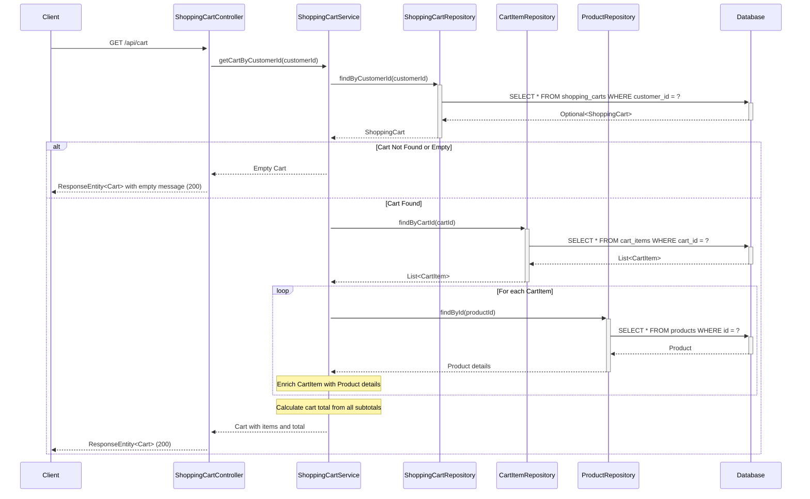
```mermaid
sequenceDiagram
    participant Client
    participant ShoppingCartController
    participant ShoppingCartService
    participant ShoppingCartRepository
    participant CartItemRepository
    participant ProductRepository
    participant Database
    
    Client->>+ShoppingCartController: GET /api/cart
    ShoppingCartController->>+ShoppingCartService: getCartByCustomerId(customerId)
    
    ShoppingCartService->>+ShoppingCartRepository: findByCustomerId(customerId)
    ShoppingCartRepository->>+Database: SELECT * FROM shopping_carts WHERE customer_id = ?
    Database-->>-ShoppingCartRepository: Optional<ShoppingCart>
    ShoppingCartRepository-->>-ShoppingCartService: ShoppingCart
    
    alt Cart Not Found or Empty
        ShoppingCartService-->>ShoppingCartController: Empty Cart
        ShoppingCartController-->>Client: ResponseEntity<Cart> with empty message (200)
    else Cart Found
        ShoppingCartService->>+CartItemRepository: findByCartId(cartId)
        CartItemRepository->>+Database: SELECT * FROM cart_items WHERE cart_id = ?
        Database-->>-CartItemRepository: List<CartItem>
        CartItemRepository-->>-ShoppingCartService: List<CartItem>
        
        loop For each CartItem
            ShoppingCartService->>+ProductRepository: findById(productId)
            ProductRepository->>+Database: SELECT * FROM products WHERE id = ?
            Database-->>-ProductRepository: Product
            ProductRepository-->>-ShoppingCartService: Product details
            Note over ShoppingCartService: Enrich CartItem with Product details
        end
        
        Note over ShoppingCartService: Calculate cart total from all subtotals
        
        ShoppingCartService-->>ShoppingCartController: Cart with items and total
        ShoppingCartController-->>Client: ResponseEntity<Cart> (200)
    end
```

### 3.10 Update Cart Item Quantity

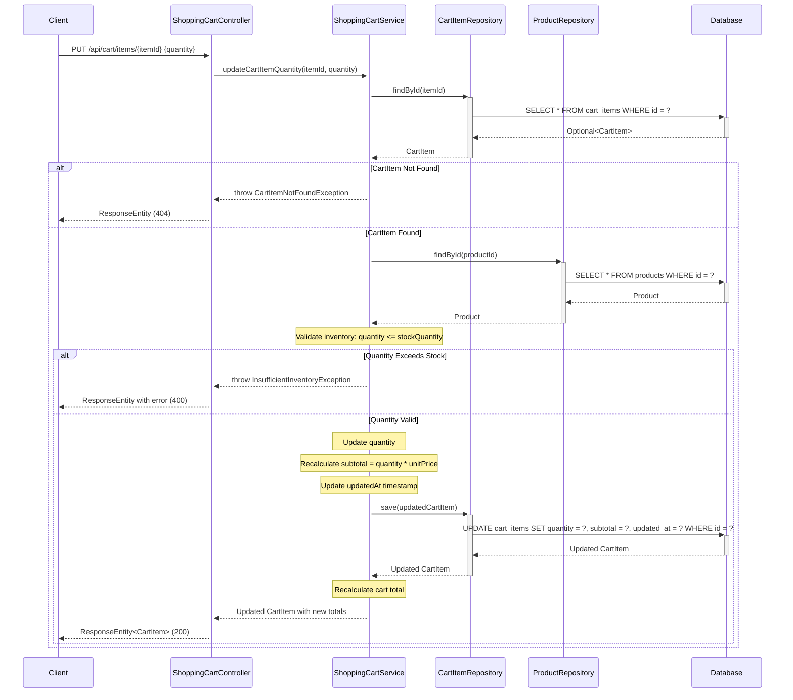
```mermaid
sequenceDiagram
    participant Client
    participant ShoppingCartController
    participant ShoppingCartService
    participant CartItemRepository
    participant ProductRepository
    participant Database
    
    Client->>+ShoppingCartController: PUT /api/cart/items/{itemId} {quantity}
    ShoppingCartController->>+ShoppingCartService: updateCartItemQuantity(itemId, quantity)
    
    ShoppingCartService->>+CartItemRepository: findById(itemId)
    CartItemRepository->>+Database: SELECT * FROM cart_items WHERE id = ?
    Database-->>-CartItemRepository: Optional<CartItem>
    CartItemRepository-->>-ShoppingCartService: CartItem
    
    alt CartItem Not Found
        ShoppingCartService-->>ShoppingCartController: throw CartItemNotFoundException
        ShoppingCartController-->>Client: ResponseEntity (404)
    else CartItem Found
        ShoppingCartService->>+ProductRepository: findById(productId)
        ProductRepository->>+Database: SELECT * FROM products WHERE id = ?
        Database-->>-ProductRepository: Product
        ProductRepository-->>-ShoppingCartService: Product
        
        Note over ShoppingCartService: Validate inventory: quantity <= stockQuantity
        
        alt Quantity Exceeds Stock
            ShoppingCartService-->>ShoppingCartController: throw InsufficientInventoryException
            ShoppingCartController-->>Client: ResponseEntity with error (400)
        else Quantity Valid
            Note over ShoppingCartService: Update quantity
            Note over ShoppingCartService: Recalculate subtotal = quantity * unitPrice
            Note over ShoppingCartService: Update updatedAt timestamp
            
            ShoppingCartService->>+CartItemRepository: save(updatedCartItem)
            CartItemRepository->>+Database: UPDATE cart_items SET quantity = ?, subtotal = ?, updated_at = ? WHERE id = ?
            Database-->>-CartItemRepository: Updated CartItem
            CartItemRepository-->>-ShoppingCartService: Updated CartItem
            
            Note over ShoppingCartService: Recalculate cart total
            
            ShoppingCartService-->>ShoppingCartController: Updated CartItem with new totals
            ShoppingCartController-->>Client: ResponseEntity<CartItem> (200)
        end
    end
```

### 3.11 Remove Product from Cart

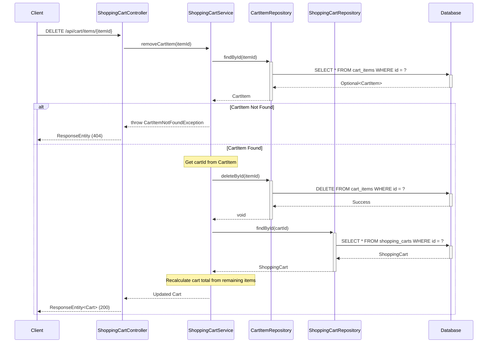
```mermaid
sequenceDiagram
    participant Client
    participant ShoppingCartController
    participant ShoppingCartService
    participant CartItemRepository
    participant ShoppingCartRepository
    participant Database
    
    Client->>+ShoppingCartController: DELETE /api/cart/items/{itemId}
    ShoppingCartController->>+ShoppingCartService: removeCartItem(itemId)
    
    ShoppingCartService->>+CartItemRepository: findById(itemId)
    CartItemRepository->>+Database: SELECT * FROM cart_items WHERE id = ?
    Database-->>-CartItemRepository: Optional<CartItem>
    CartItemRepository-->>-ShoppingCartService: CartItem
    
    alt CartItem Not Found
        ShoppingCartService-->>ShoppingCartController: throw CartItemNotFoundException
        ShoppingCartController-->>Client: ResponseEntity (404)
    else CartItem Found
        Note over ShoppingCartService: Get cartId from CartItem
        
        ShoppingCartService->>+CartItemRepository: deleteById(itemId)
        CartItemRepository->>+Database: DELETE FROM cart_items WHERE id = ?
        Database-->>-CartItemRepository: Success
        CartItemRepository-->>-ShoppingCartService: void
        
        ShoppingCartService->>+ShoppingCartRepository: findById(cartId)
        ShoppingCartRepository->>+Database: SELECT * FROM shopping_carts WHERE id = ?
        Database-->>-ShoppingCartRepository: ShoppingCart
        ShoppingCartRepository-->>-ShoppingCartService: ShoppingCart
        
        Note over ShoppingCartService: Recalculate cart total from remaining items
        
        ShoppingCartService-->>ShoppingCartController: Updated Cart
        ShoppingCartController-->>Client: ResponseEntity<Cart> (200)
    end
```

### 3.12 View Empty Cart

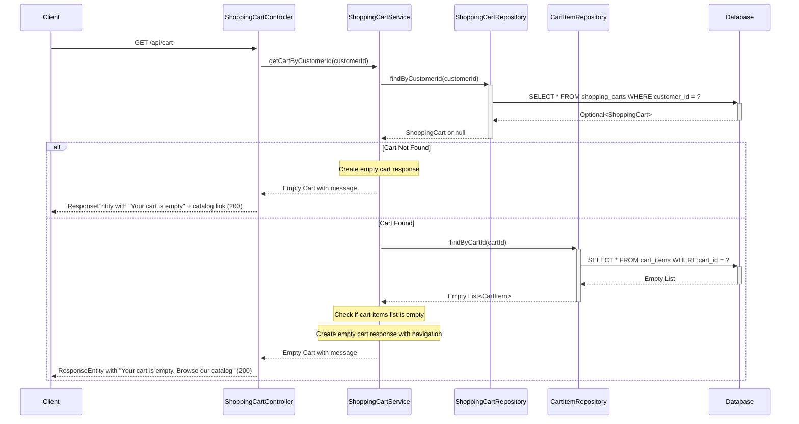
```mermaid
sequenceDiagram
    participant Client
    participant ShoppingCartController
    participant ShoppingCartService
    participant ShoppingCartRepository
    participant CartItemRepository
    participant Database
    
    Client->>+ShoppingCartController: GET /api/cart
    ShoppingCartController->>+ShoppingCartService: getCartByCustomerId(customerId)
    
    ShoppingCartService->>+ShoppingCartRepository: findByCustomerId(customerId)
    ShoppingCartRepository->>+Database: SELECT * FROM shopping_carts WHERE customer_id = ?
    Database-->>-ShoppingCartRepository: Optional<ShoppingCart>
    ShoppingCartRepository-->>-ShoppingCartService: ShoppingCart or null
    
    alt Cart Not Found
        Note over ShoppingCartService: Create empty cart response
        ShoppingCartService-->>ShoppingCartController: Empty Cart with message
        ShoppingCartController-->>Client: ResponseEntity with "Your cart is empty" + catalog link (200)
    else Cart Found
        ShoppingCartService->>+CartItemRepository: findByCartId(cartId)
        CartItemRepository->>+Database: SELECT * FROM cart_items WHERE cart_id = ?
        Database-->>-CartItemRepository: Empty List
        CartItemRepository-->>-ShoppingCartService: Empty List<CartItem>
        
        Note over ShoppingCartService: Check if cart items list is empty
        Note over ShoppingCartService: Create empty cart response with navigation
        
        ShoppingCartService-->>ShoppingCartController: Empty Cart with message
        ShoppingCartController-->>Client: ResponseEntity with "Your cart is empty. Browse our catalog" (200)
    end
```

### 3.13 Validate Inventory on Quantity Update

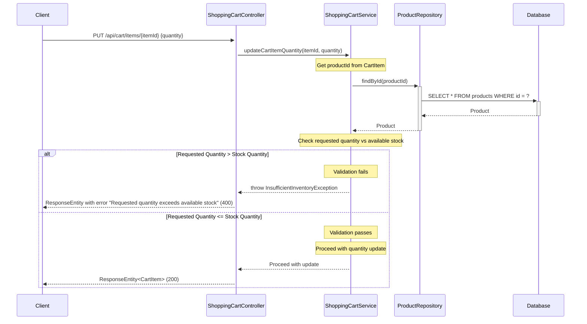
```mermaid
sequenceDiagram
    participant Client
    participant ShoppingCartController
    participant ShoppingCartService
    participant ProductRepository
    participant Database
    
    Client->>+ShoppingCartController: PUT /api/cart/items/{itemId} {quantity}
    ShoppingCartController->>+ShoppingCartService: updateCartItemQuantity(itemId, quantity)
    
    Note over ShoppingCartService: Get productId from CartItem
    
    ShoppingCartService->>+ProductRepository: findById(productId)
    ProductRepository->>+Database: SELECT * FROM products WHERE id = ?
    Database-->>-ProductRepository: Product
    ProductRepository-->>-ShoppingCartService: Product
    
    Note over ShoppingCartService: Check requested quantity vs available stock
    
    alt Requested Quantity > Stock Quantity
        Note over ShoppingCartService: Validation fails
        ShoppingCartService-->>ShoppingCartController: throw InsufficientInventoryException
        ShoppingCartController-->>Client: ResponseEntity with error "Requested quantity exceeds available stock" (400)
    else Requested Quantity <= Stock Quantity
        Note over ShoppingCartService: Validation passes
        Note over ShoppingCartService: Proceed with quantity update
        ShoppingCartService-->>ShoppingCartController: Proceed with update
        ShoppingCartController-->>Client: ResponseEntity<CartItem> (200)
    end
```

## 4. API Endpoints Summary

| Method | Endpoint | Description | Request Body | Response |
|--------|----------|-------------|--------------|----------|
| GET | `/api/products` | Get all products | None | List<Product> |
| GET | `/api/products/{id}` | Get product by ID | None | Product |
| POST | `/api/products` | Create new product | Product | Product |
| PUT | `/api/products/{id}` | Update existing product | Product | Product |
| DELETE | `/api/products/{id}` | Delete product | None | None |
| GET | `/api/products/category/{category}` | Get products by category | None | List<Product> |
| GET | `/api/products/search?keyword={keyword}` | Search products by name | None | List<Product> |
| POST | `/api/cart/items` | Add product to cart | {productId: Long, isSubscription: Boolean} | CartItem |
| GET | `/api/cart` | View shopping cart | None | Cart (with items, quantities, prices, totals) |
| PUT | `/api/cart/items/{itemId}` | Update cart item quantity | {quantity: Integer} | CartItem (with recalculated totals) |
| DELETE | `/api/cart/items/{itemId}` | Remove item from cart | None | Cart (with recalculated totals) |
