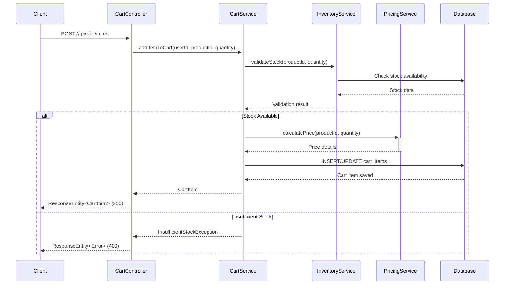
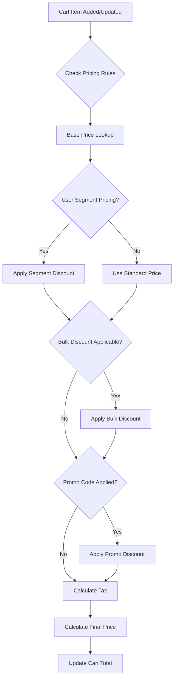
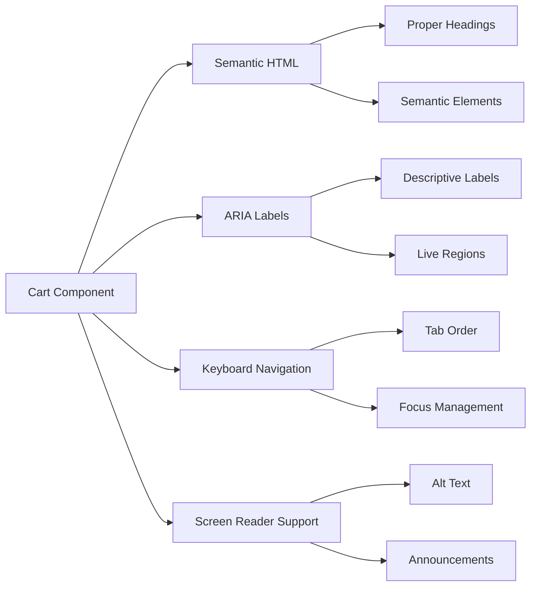
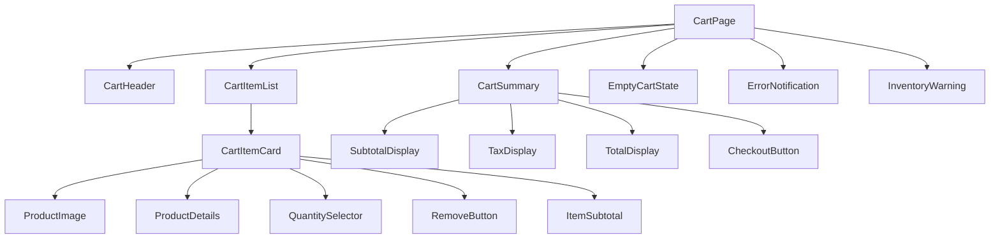
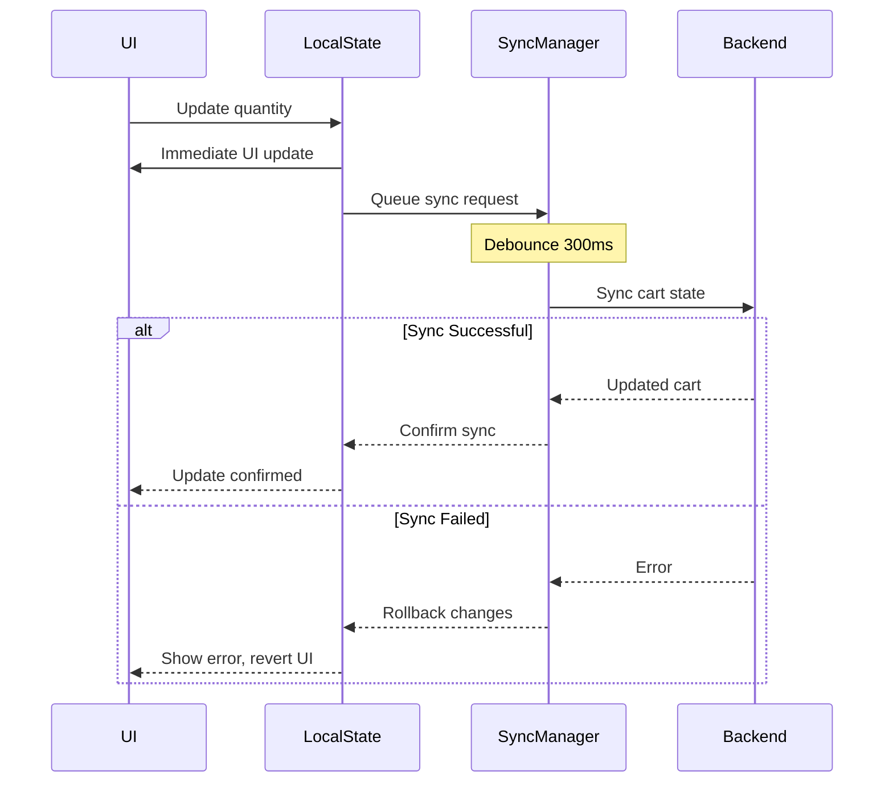

## 10. API Integration Requirements

### 10.1 Cart Operations API

**Requirement Reference:** Knowledge Base: Backend API integration requirements

**Description:**
Integrate with backend APIs for all cart operations:

**Endpoints:**

| Method | Endpoint | Description | Request Body | Response |
|--------|----------|-------------|--------------|----------|
| GET | `/api/cart` | Get current user's cart | None | Cart |
| POST | `/api/cart/items` | Add item to cart | CartItemRequest | CartItem |
| PUT | `/api/cart/items/{itemId}` | Update cart item quantity | QuantityUpdate | CartItem |
| DELETE | `/api/cart/items/{itemId}` | Remove item from cart | None | Success |
| DELETE | `/api/cart` | Clear entire cart | None | Success |
| GET | `/api/cart/total` | Get cart total | None | CartTotal |

**Error Handling:**
- Handle network failures gracefully
- Implement retry logic for transient failures
- Provide meaningful error messages to users
- Log errors for debugging and monitoring


```mermaid
sequenceDiagram
    participant Client
    participant CartController
    participant CartService
    participant InventoryService
    participant PricingService
    participant Database
    
    Client->>+CartController: POST /api/cart/items
    CartController->>+CartService: addItemToCart(userId, productId, quantity)
    
    CartService->>+InventoryService: validateStock(productId, quantity)
    InventoryService->>Database: Check stock availability
    Database-->>InventoryService: Stock data
    InventoryService-->>CartService: Validation result
    
    alt Stock Available
        CartService->>+PricingService: calculatePrice(productId, quantity)
        PricingService-->>-CartService: Price details
        
        CartService->>Database: INSERT/UPDATE cart_items
        Database-->>CartService: Cart item saved
        
        CartService-->>CartController: CartItem
        CartController-->>Client: ResponseEntity<CartItem> (200)
    else Insufficient Stock
        CartService-->>CartController: InsufficientStockException
        CartController-->>Client: ResponseEntity<Error> (400)
    end
```

### 10.2 Inventory Management Integration

**Requirement Reference:** Knowledge Base: Real-time stock validation service integration

**Description:**
Integrate with real-time inventory management system:
- Real-time stock level checking
- Stock reservation during checkout process
- Automatic stock updates after purchase
- Low stock warnings and notifications

**Integration Points:**
- Stock availability API
- Stock reservation API
- Stock release API (for abandoned carts)
- Inventory update webhooks

**Technical Requirements:**
- Implement circuit breaker pattern for resilience
- Cache stock data with appropriate TTL
- Handle inventory service downtime gracefully
- Provide fallback mechanisms

### 10.3 Price Calculation Service

**Requirement Reference:** Knowledge Base: Dynamic pricing and discount calculations

**Description:**
Integrate with pricing service for:
- Dynamic pricing based on user segments
- Discount and promotion calculations
- Tax calculations
- Shipping cost estimation
- Currency conversion (if applicable)

**Pricing Rules:**
- Apply user-specific discounts
- Calculate bulk purchase discounts
- Apply promotional codes
- Calculate taxes based on location
- Handle multi-currency scenarios


```mermaid
flowchart TD
    A[Cart Item Added/Updated] --> B{Check Pricing Rules}
    B --> C[Base Price Lookup]
    C --> D{User Segment Pricing?}
    D -->|Yes| E[Apply Segment Discount]
    D -->|No| F[Use Standard Price]
    E --> G{Bulk Discount Applicable?}
    F --> G
    G -->|Yes| H[Apply Bulk Discount]
    G -->|No| I{Promo Code Applied?}
    H --> I
    I -->|Yes| J[Apply Promo Discount]
    I -->|No| K[Calculate Tax]
    J --> K
    K --> L[Calculate Final Price]
    L --> M[Update Cart Total]
```

## 11. Performance Requirements

### 11.1 Page Load Performance

**Requirement Reference:** Story Summary: <3 seconds load time requirement

**Performance Specifications:**
- Initial page load: < 3 seconds
- Time to Interactive (TTI): < 2 seconds
- First Contentful Paint (FCP): < 1.5 seconds
- Largest Contentful Paint (LCP): < 2.5 seconds

**Optimization Strategies:**
- Implement code splitting for cart module
- Lazy load product images
- Use CDN for static assets
- Implement browser caching strategies
- Minimize JavaScript bundle size
- Use compression (gzip/brotli)

### 11.2 Runtime Performance

**Performance Targets:**
- Quantity update response: < 200ms
- Cart total recalculation: < 100ms
- Item removal animation: < 300ms
- API response time: < 500ms (p95)

**Monitoring:**
- Implement performance monitoring
- Track Core Web Vitals
- Monitor API response times
- Set up alerting for performance degradation

### 11.3 Performance Optimization Strategies

**Requirement Reference:** Knowledge Base: Code splitting and state management

**Client-Side Optimizations:**
- Implement efficient state management (Redux/Context API)
- Use React.memo for component optimization
- Implement virtual scrolling for large cart lists
- Debounce quantity update API calls
- Use optimistic UI updates

**Caching Strategies:**
- Cache product details in browser storage
- Implement service worker for offline support
- Use HTTP caching headers appropriately
- Cache pricing calculations when possible

**Code Splitting:**
- Split cart module from main bundle
- Lazy load cart components
- Dynamic imports for heavy dependencies
- Route-based code splitting

## 12. Accessibility Standards

### 12.1 WCAG 2.1 Level AA Compliance

**Requirement Reference:** Story Summary: WCAG 2.1 AA compliance

**Accessibility Requirements:**

**Semantic HTML:**
- Use proper heading hierarchy (h1-h6)
- Implement semantic HTML5 elements
- Use appropriate ARIA roles and attributes
- Ensure proper form labeling

**Keyboard Navigation:**
- All interactive elements keyboard accessible
- Logical tab order throughout cart interface
- Visible focus indicators
- Keyboard shortcuts for common actions
- Escape key to close modals/dialogs

**Screen Reader Compatibility:**
- Descriptive ARIA labels for all controls
- Live regions for dynamic content updates
- Proper announcement of cart changes
- Alternative text for all images
- Clear error message announcements

**Color Contrast:**
- Minimum contrast ratio of 4.5:1 for normal text
- Minimum contrast ratio of 3:1 for large text
- Minimum contrast ratio of 3:1 for UI components
- Do not rely solely on color to convey information

**Accessibility Testing:**
- Automated testing with axe-core
- Manual keyboard navigation testing
- Screen reader testing (NVDA, JAWS, VoiceOver)
- Color contrast validation
- Focus management verification


```mermaid
flowchart LR
    A[Cart Component] --> B[Semantic HTML]
    A --> C[ARIA Labels]
    A --> D[Keyboard Navigation]
    A --> E[Screen Reader Support]
    
    B --> F[Proper Headings]
    B --> G[Semantic Elements]
    
    C --> H[Descriptive Labels]
    C --> I[Live Regions]
    
    D --> J[Tab Order]
    D --> K[Focus Management]
    
    E --> L[Alt Text]
    E --> M[Announcements]
```

## 13. Responsive Design

### 13.1 Responsive Breakpoints

**Requirement Reference:** Story Summary: Mobile-responsive design requirements

**Breakpoint Specifications:**

**Mobile (< 768px):**
- Single column layout
- Stacked cart items
- Full-width buttons
- Collapsible cart summary
- Touch-optimized controls (minimum 44px touch targets)
- Simplified quantity controls

**Tablet (768px - 1024px):**
- Two-column layout option
- Side-by-side cart items and summary
- Optimized spacing for touch
- Adaptive image sizes

**Desktop (> 1024px):**
- Multi-column layout
- Cart items list with fixed summary sidebar
- Hover states for interactive elements
- Larger product images
- Enhanced visual hierarchy

**Responsive Design Patterns:**
- Fluid typography using clamp()
- Flexible grid layouts with CSS Grid/Flexbox
- Responsive images with srcset
- Mobile-first CSS approach
- Progressive enhancement strategy

### 13.2 Touch Optimization

**Mobile-Specific Features:**
- Swipe to delete cart items
- Pull to refresh cart data
- Touch-friendly quantity controls
- Optimized button sizes (minimum 44x44px)
- Adequate spacing between interactive elements

## 14. Browser Compatibility

### 14.1 Supported Browsers

**Requirement Reference:** Story Summary: Cross-browser compatibility

**Browser Support Matrix:**
- Chrome (latest 2 versions)
- Firefox (latest 2 versions)
- Safari (latest 2 versions)
- Edge (latest 2 versions)

**Compatibility Testing:**
- Automated cross-browser testing
- Manual testing on target browsers
- Polyfills for missing features
- Graceful degradation for older browsers

**Browser-Specific Considerations:**
- CSS vendor prefixes where needed
- JavaScript polyfills for modern features
- Fallbacks for unsupported CSS features
- Testing on different operating systems

## 15. Component Architecture

### 15.1 Cart Component Structure

**Requirement Reference:** Knowledge Base: Required cart-specific components

**Component Hierarchy:**


```mermaid
flowchart TD
    A[CartPage] --> B[CartHeader]
    A --> C[CartItemList]
    A --> D[CartSummary]
    A --> E[EmptyCartState]
    
    C --> F[CartItemCard]
    F --> G[ProductImage]
    F --> H[ProductDetails]
    F --> I[QuantitySelector]
    F --> J[RemoveButton]
    F --> K[ItemSubtotal]
    
    D --> L[SubtotalDisplay]
    D --> M[TaxDisplay]
    D --> N[TotalDisplay]
    D --> O[CheckoutButton]
    
    A --> P[ErrorNotification]
    A --> Q[InventoryWarning]
```

**Component Specifications:**

**CartItemCard:**
- Display product thumbnail
- Show product name and description
- Display unit price
- Quantity selector with +/- controls
- Line item subtotal
- Remove button
- Stock availability indicator

**QuantitySelector:**
- Increment button
- Decrement button
- Direct input field
- Min/max quantity validation
- Disabled state for out-of-stock
- Loading state during updates

**RemoveButton:**
- Clear remove icon
- Confirmation dialog
- Loading state
- Accessible label

**CartSummary:**
- Subtotal calculation
- Tax calculation
- Discount display (if applicable)
- Total amount
- Checkout button
- Sticky positioning on scroll

**EmptyCartState:**
- Empty cart icon/illustration
- "Your cart is empty" message
- "Continue Shopping" button
- Optional product recommendations

**ErrorNotification:**
- Error message display
- Dismissible notification
- Auto-dismiss after timeout
- Different severity levels

**InventoryWarning:**
- Low stock warning
- Out of stock notification
- Stock availability display
- Alternative product suggestions

## 16. State Management

### 16.1 Client-Side State Management

**Requirement Reference:** Knowledge Base: Cross-session persistence and client-side state management

**State Structure:**

```javascript
{
  cart: {
    items: [
      {
        id: string,
        productId: string,
        productName: string,
        unitPrice: number,
        quantity: number,
        subtotal: number,
        imageUrl: string,
        stockAvailable: number,
        minProcurementThreshold: number
      }
    ],
    subtotal: number,
    tax: number,
    total: number,
    itemCount: number,
    lastUpdated: timestamp
  },
  ui: {
    isLoading: boolean,
    error: string | null,
    pendingUpdates: Map<itemId, boolean>
  }
}
```

**State Management Strategy:**
- Use Redux or Context API for global cart state
- Implement optimistic updates for better UX
- Persist cart state to localStorage
- Sync cart state with backend on changes
- Handle concurrent update conflicts

**Cross-Session Persistence:**
- Store cart data in localStorage
- Sync with backend on user login
- Merge guest cart with user cart on authentication
- Implement cart expiration policy
- Handle cart migration between devices

### 16.2 State Synchronization

**Synchronization Strategy:**
- Debounce quantity updates (300ms)
- Batch multiple updates when possible
- Implement conflict resolution for concurrent updates
- Use optimistic locking for cart updates
- Handle offline scenarios gracefully


```mermaid
sequenceDiagram
    participant UI
    participant LocalState
    participant SyncManager
    participant Backend
    
    UI->>LocalState: Update quantity
    LocalState->>UI: Immediate UI update
    LocalState->>SyncManager: Queue sync request
    
    Note over SyncManager: Debounce 300ms
    
    SyncManager->>Backend: Sync cart state
    
    alt Sync Successful
        Backend-->>SyncManager: Updated cart
        SyncManager-->>LocalState: Confirm sync
        LocalState-->>UI: Update confirmed
    else Sync Failed
        Backend-->>SyncManager: Error
        SyncManager-->>LocalState: Rollback changes
        LocalState-->>UI: Show error, revert UI
    end
```
