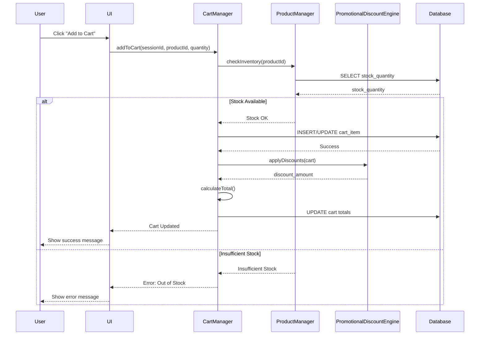
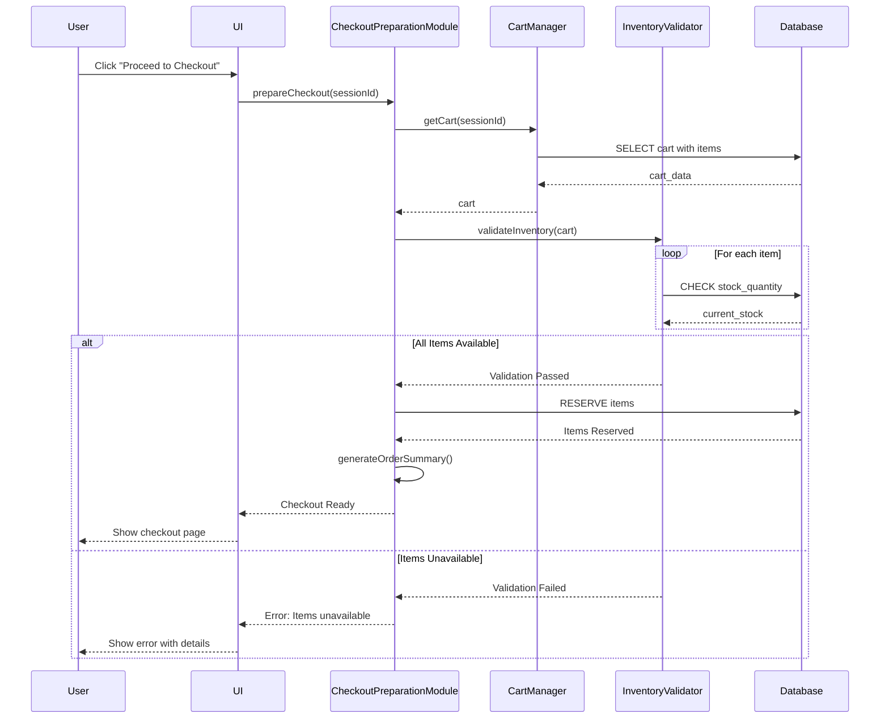
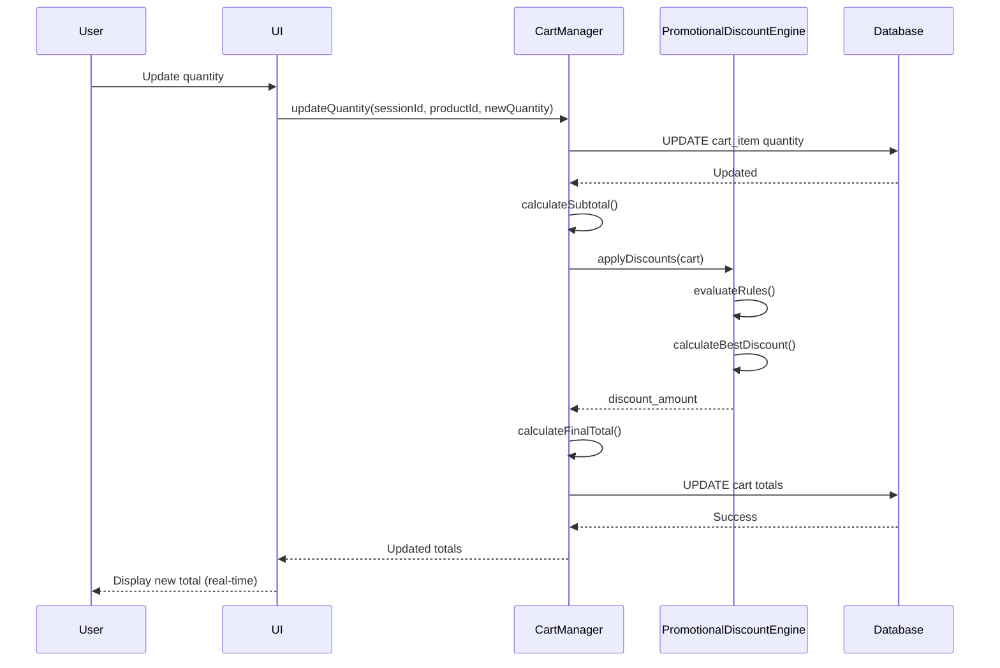

## 5. Sequence Diagrams

### 5.1 Add Product to Cart Flow

```mermaid
sequenceDiagram
    participant User
    participant UI
    participant CartManager
    participant ProductManager
    participant PromotionalDiscountEngine
    participant Database
    
    User->>UI: Click "Add to Cart"
    UI->>CartManager: addToCart(sessionId, productId, quantity)
    CartManager->>ProductManager: checkInventory(productId)
    ProductManager->>Database: SELECT stock_quantity
    Database-->>ProductManager: stock_quantity
    
    alt Stock Available
        ProductManager-->>CartManager: Stock OK
        CartManager->>Database: INSERT/UPDATE cart_item
        Database-->>CartManager: Success
        CartManager->>PromotionalDiscountEngine: applyDiscounts(cart)
        PromotionalDiscountEngine-->>CartManager: discount_amount
        CartManager->>CartManager: calculateTotal()
        CartManager->>Database: UPDATE cart totals
        CartManager-->>UI: Cart Updated
        UI-->>User: Show success message
    else Insufficient Stock
        ProductManager-->>CartManager: Insufficient Stock
        CartManager-->>UI: Error: Out of Stock
        UI-->>User: Show error message
    end
```

### 5.2 Checkout Preparation Flow

```mermaid
sequenceDiagram
    participant User
    participant UI
    participant CheckoutPreparationModule
    participant CartManager
    participant InventoryValidator
    participant Database
    
    User->>UI: Click "Proceed to Checkout"
    UI->>CheckoutPreparationModule: prepareCheckout(sessionId)
    CheckoutPreparationModule->>CartManager: getCart(sessionId)
    CartManager->>Database: SELECT cart with items
    Database-->>CartManager: cart_data
    CartManager-->>CheckoutPreparationModule: cart
    
    CheckoutPreparationModule->>InventoryValidator: validateInventory(cart)
    
    loop For each item
        InventoryValidator->>Database: CHECK stock_quantity
        Database-->>InventoryValidator: current_stock
    end
    
    alt All Items Available
        InventoryValidator-->>CheckoutPreparationModule: Validation Passed
        CheckoutPreparationModule->>Database: RESERVE items
        Database-->>CheckoutPreparationModule: Items Reserved
        CheckoutPreparationModule->>CheckoutPreparationModule: generateOrderSummary()
        CheckoutPreparationModule-->>UI: Checkout Ready
        UI-->>User: Show checkout page
    else Items Unavailable
        InventoryValidator-->>CheckoutPreparationModule: Validation Failed
        CheckoutPreparationModule-->>UI: Error: Items unavailable
        UI-->>User: Show error with details
    end
```

### 5.3 Real-time Total Calculation Flow

```mermaid
sequenceDiagram
    participant User
    participant UI
    participant CartManager
    participant PromotionalDiscountEngine
    participant Database
    
    User->>UI: Update quantity
    UI->>CartManager: updateQuantity(sessionId, productId, newQuantity)
    CartManager->>Database: UPDATE cart_item quantity
    Database-->>CartManager: Updated
    
    CartManager->>CartManager: calculateSubtotal()
    CartManager->>PromotionalDiscountEngine: applyDiscounts(cart)
    
    PromotionalDiscountEngine->>PromotionalDiscountEngine: evaluateRules()
    PromotionalDiscountEngine->>PromotionalDiscountEngine: calculateBestDiscount()
    PromotionalDiscountEngine-->>CartManager: discount_amount
    
    CartManager->>CartManager: calculateFinalTotal()
    CartManager->>Database: UPDATE cart totals
    Database-->>CartManager: Success
    
    CartManager-->>UI: Updated totals
    UI-->>User: Display new total (real-time)
```
