## 3. Sequence Diagrams

### 3.1 Get All Products

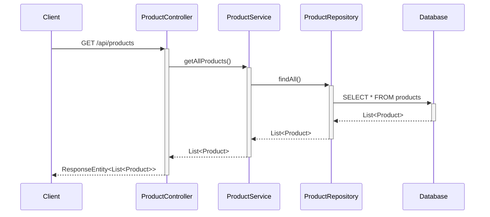
```mermaid
sequenceDiagram
    participant Client
    participant ProductController
    participant ProductService
    participant ProductRepository
    participant Database
    
    Client->>+ProductController: GET /api/products
    ProductController->>+ProductService: getAllProducts()
    ProductService->>+ProductRepository: findAll()
    ProductRepository->>+Database: SELECT * FROM products
    Database-->>-ProductRepository: List<Product>
    ProductRepository-->>-ProductService: List<Product>
    ProductService-->>-ProductController: List<Product>
    ProductController-->>-Client: ResponseEntity<List<Product>>
```

### 3.2 Get Product By ID

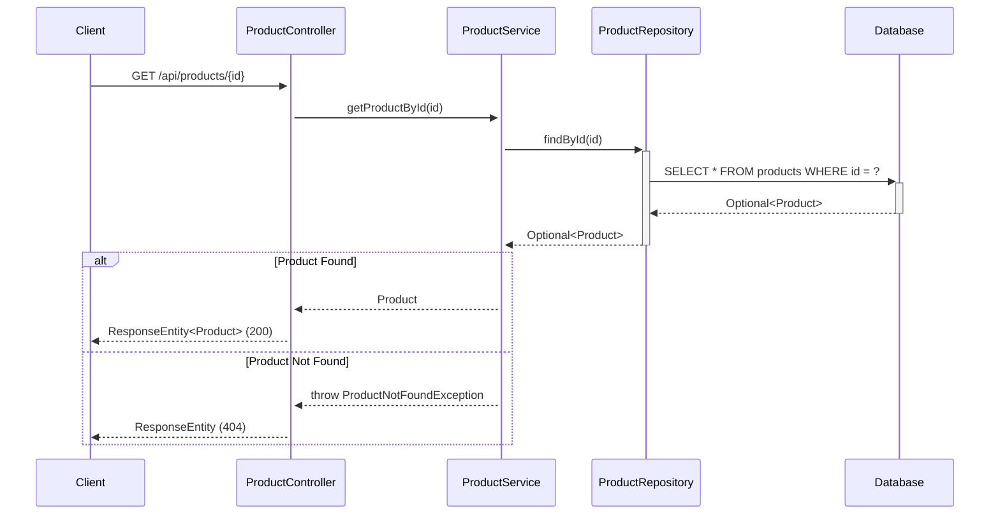
```mermaid
sequenceDiagram
    participant Client
    participant ProductController
    participant ProductService
    participant ProductRepository
    participant Database
    
    Client->>+ProductController: GET /api/products/{id}
    ProductController->>+ProductService: getProductById(id)
    ProductService->>+ProductRepository: findById(id)
    ProductRepository->>+Database: SELECT * FROM products WHERE id = ?
    Database-->>-ProductRepository: Optional<Product>
    ProductRepository-->>-ProductService: Optional<Product>
    
    alt Product Found
        ProductService-->>ProductController: Product
        ProductController-->>Client: ResponseEntity<Product> (200)
    else Product Not Found
        ProductService-->>ProductController: throw ProductNotFoundException
        ProductController-->>Client: ResponseEntity (404)
    end
```

### 3.3 Create Product

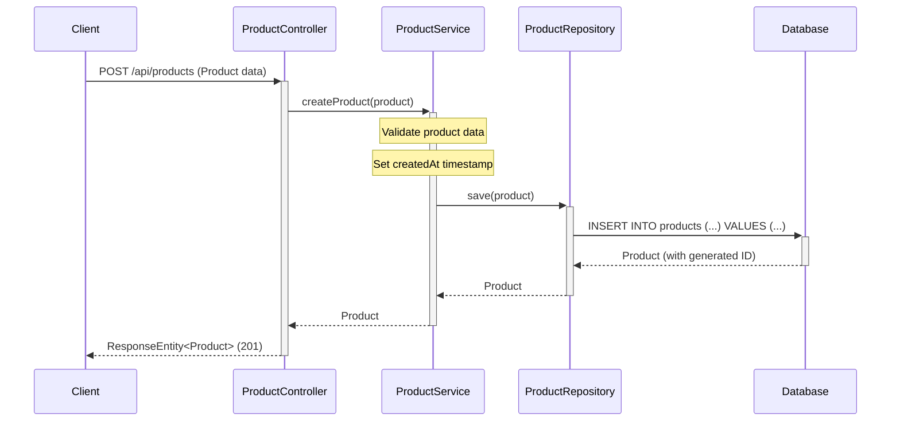
```mermaid
sequenceDiagram
    participant Client
    participant ProductController
    participant ProductService
    participant ProductRepository
    participant Database
    
    Client->>+ProductController: POST /api/products (Product data)
    ProductController->>+ProductService: createProduct(product)
    
    Note over ProductService: Validate product data
    Note over ProductService: Set createdAt timestamp
    
    ProductService->>+ProductRepository: save(product)
    ProductRepository->>+Database: INSERT INTO products (...) VALUES (...)
    Database-->>-ProductRepository: Product (with generated ID)
    ProductRepository-->>-ProductService: Product
    ProductService-->>-ProductController: Product
    ProductController-->>-Client: ResponseEntity<Product> (201)
```

### 3.4 Update Product

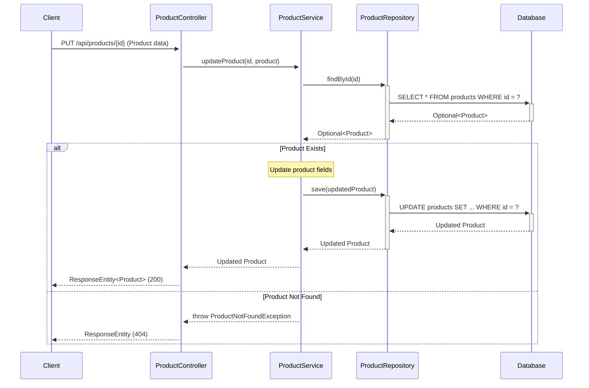
```mermaid
sequenceDiagram
    participant Client
    participant ProductController
    participant ProductService
    participant ProductRepository
    participant Database
    
    Client->>+ProductController: PUT /api/products/{id} (Product data)
    ProductController->>+ProductService: updateProduct(id, product)
    
    ProductService->>+ProductRepository: findById(id)
    ProductRepository->>+Database: SELECT * FROM products WHERE id = ?
    Database-->>-ProductRepository: Optional<Product>
    ProductRepository-->>-ProductService: Optional<Product>
    
    alt Product Exists
        Note over ProductService: Update product fields
        ProductService->>+ProductRepository: save(updatedProduct)
        ProductRepository->>+Database: UPDATE products SET ... WHERE id = ?
        Database-->>-ProductRepository: Updated Product
        ProductRepository-->>-ProductService: Updated Product
        ProductService-->>ProductController: Updated Product
        ProductController-->>Client: ResponseEntity<Product> (200)
    else Product Not Found
        ProductService-->>ProductController: throw ProductNotFoundException
        ProductController-->>Client: ResponseEntity (404)
    end
```

### 3.5 Delete Product

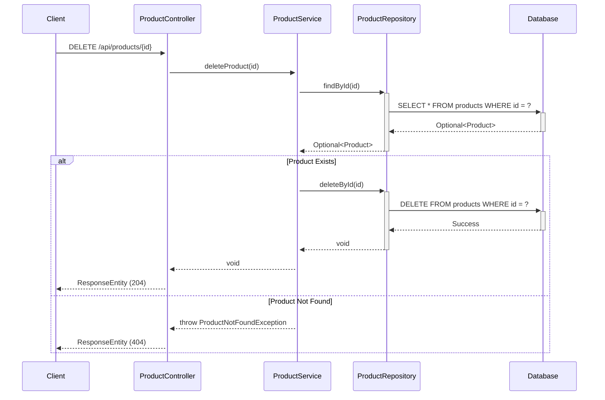
```mermaid
sequenceDiagram
    participant Client
    participant ProductController
    participant ProductService
    participant ProductRepository
    participant Database
    
    Client->>+ProductController: DELETE /api/products/{id}
    ProductController->>+ProductService: deleteProduct(id)
    
    ProductService->>+ProductRepository: findById(id)
    ProductRepository->>+Database: SELECT * FROM products WHERE id = ?
    Database-->>-ProductRepository: Optional<Product>
    ProductRepository-->>-ProductService: Optional<Product>
    
    alt Product Exists
        ProductService->>+ProductRepository: deleteById(id)
        ProductRepository->>+Database: DELETE FROM products WHERE id = ?
        Database-->>-ProductRepository: Success
        ProductRepository-->>-ProductService: void
        ProductService-->>ProductController: void
        ProductController-->>Client: ResponseEntity (204)
    else Product Not Found
        ProductService-->>ProductController: throw ProductNotFoundException
        ProductController-->>Client: ResponseEntity (404)
    end
```

### 3.6 Get Products By Category

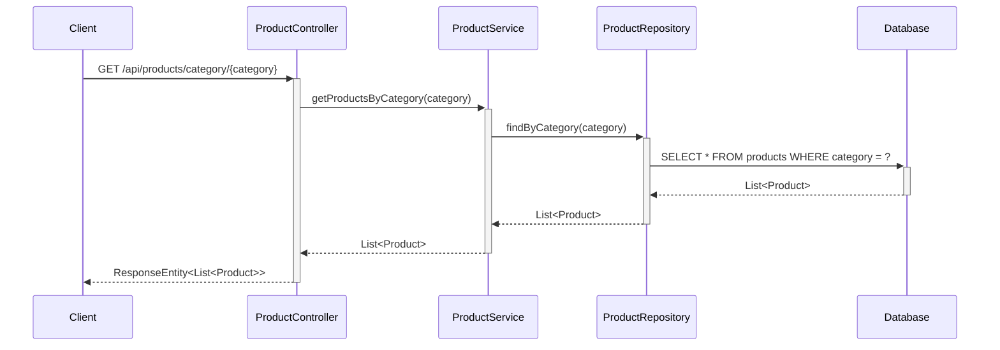
```mermaid
sequenceDiagram
    participant Client
    participant ProductController
    participant ProductService
    participant ProductRepository
    participant Database
    
    Client->>+ProductController: GET /api/products/category/{category}
    ProductController->>+ProductService: getProductsByCategory(category)
    ProductService->>+ProductRepository: findByCategory(category)
    ProductRepository->>+Database: SELECT * FROM products WHERE category = ?
    Database-->>-ProductRepository: List<Product>
    ProductRepository-->>-ProductService: List<Product>
    ProductService-->>-ProductController: List<Product>
    ProductController-->>-Client: ResponseEntity<List<Product>>
```

### 3.7 Search Products

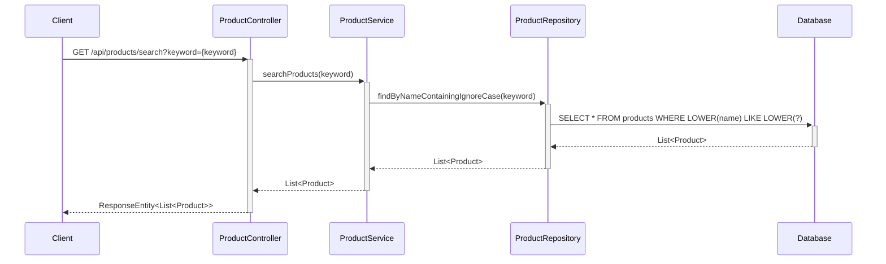
```mermaid
sequenceDiagram
    participant Client
    participant ProductController
    participant ProductService
    participant ProductRepository
    participant Database
    
    Client->>+ProductController: GET /api/products/search?keyword={keyword}
    ProductController->>+ProductService: searchProducts(keyword)
    ProductService->>+ProductRepository: findByNameContainingIgnoreCase(keyword)
    ProductRepository->>+Database: SELECT * FROM products WHERE LOWER(name) LIKE LOWER(?)
    Database-->>-ProductRepository: List<Product>
    ProductRepository-->>-ProductService: List<Product>
    ProductService-->>-ProductController: List<Product>
    ProductController-->>-Client: ResponseEntity<List<Product>>
```

### 3.8 Add Product to Cart

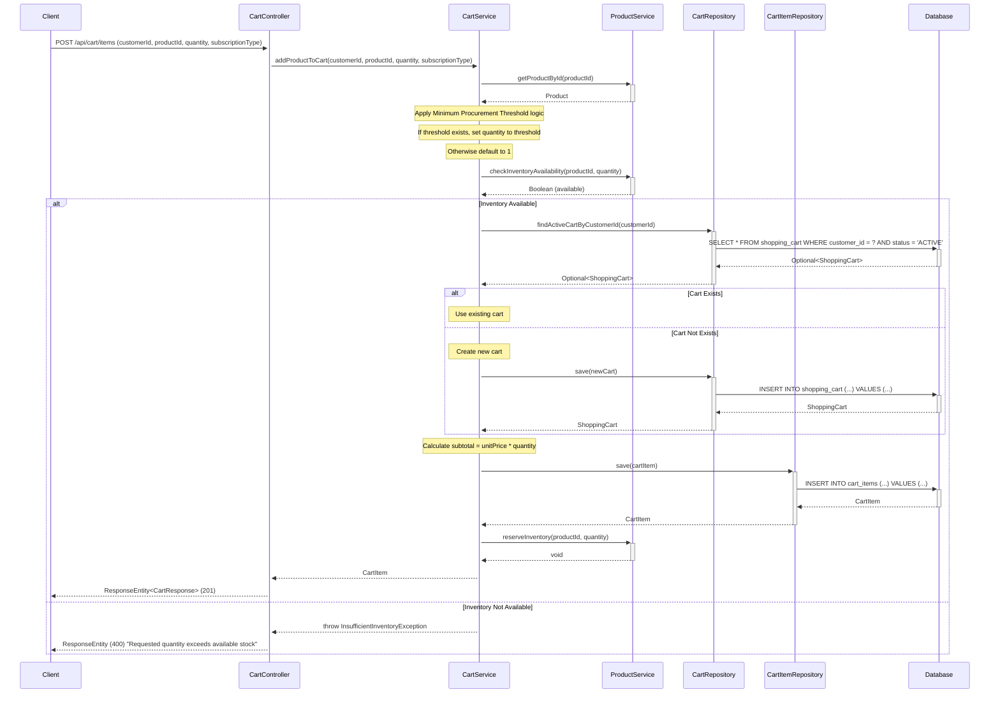
```mermaid
sequenceDiagram
    participant Client
    participant CartController
    participant CartService
    participant ProductService
    participant CartRepository
    participant CartItemRepository
    participant Database
    
    Client->>+CartController: POST /api/cart/items (customerId, productId, quantity, subscriptionType)
    CartController->>+CartService: addProductToCart(customerId, productId, quantity, subscriptionType)
    
    CartService->>+ProductService: getProductById(productId)
    ProductService-->>-CartService: Product
    
    Note over CartService: Apply Minimum Procurement Threshold logic
    Note over CartService: If threshold exists, set quantity to threshold
    Note over CartService: Otherwise default to 1
    
    CartService->>+ProductService: checkInventoryAvailability(productId, quantity)
    ProductService-->>-CartService: Boolean (available)
    
    alt Inventory Available
        CartService->>+CartRepository: findActiveCartByCustomerId(customerId)
        CartRepository->>+Database: SELECT * FROM shopping_cart WHERE customer_id = ? AND status = 'ACTIVE'
        Database-->>-CartRepository: Optional<ShoppingCart>
        CartRepository-->>-CartService: Optional<ShoppingCart>
        
        alt Cart Exists
            Note over CartService: Use existing cart
        else Cart Not Exists
            Note over CartService: Create new cart
            CartService->>+CartRepository: save(newCart)
            CartRepository->>+Database: INSERT INTO shopping_cart (...) VALUES (...)
            Database-->>-CartRepository: ShoppingCart
            CartRepository-->>-CartService: ShoppingCart
        end
        
        Note over CartService: Calculate subtotal = unitPrice * quantity
        CartService->>+CartItemRepository: save(cartItem)
        CartItemRepository->>+Database: INSERT INTO cart_items (...) VALUES (...)
        Database-->>-CartItemRepository: CartItem
        CartItemRepository-->>-CartService: CartItem
        
        CartService->>+ProductService: reserveInventory(productId, quantity)
        ProductService-->>-CartService: void
        
        CartService-->>CartController: CartItem
        CartController-->>Client: ResponseEntity<CartResponse> (201)
    else Inventory Not Available
        CartService-->>CartController: throw InsufficientInventoryException
        CartController-->>Client: ResponseEntity (400) "Requested quantity exceeds available stock"
    end
```

### 3.9 View Cart

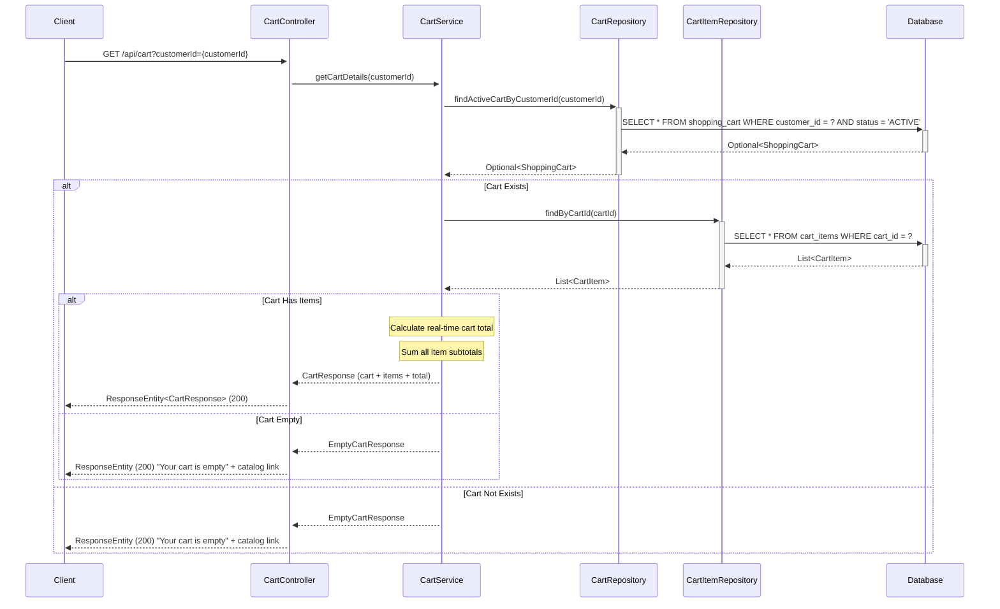
```mermaid
sequenceDiagram
    participant Client
    participant CartController
    participant CartService
    participant CartRepository
    participant CartItemRepository
    participant Database
    
    Client->>+CartController: GET /api/cart?customerId={customerId}
    CartController->>+CartService: getCartDetails(customerId)
    
    CartService->>+CartRepository: findActiveCartByCustomerId(customerId)
    CartRepository->>+Database: SELECT * FROM shopping_cart WHERE customer_id = ? AND status = 'ACTIVE'
    Database-->>-CartRepository: Optional<ShoppingCart>
    CartRepository-->>-CartService: Optional<ShoppingCart>
    
    alt Cart Exists
        CartService->>+CartItemRepository: findByCartId(cartId)
        CartItemRepository->>+Database: SELECT * FROM cart_items WHERE cart_id = ?
        Database-->>-CartItemRepository: List<CartItem>
        CartItemRepository-->>-CartService: List<CartItem>
        
        alt Cart Has Items
            Note over CartService: Calculate real-time cart total
            Note over CartService: Sum all item subtotals
            CartService-->>CartController: CartResponse (cart + items + total)
            CartController-->>Client: ResponseEntity<CartResponse> (200)
        else Cart Empty
            CartService-->>CartController: EmptyCartResponse
            CartController-->>Client: ResponseEntity (200) "Your cart is empty" + catalog link
        end
    else Cart Not Exists
        CartService-->>CartController: EmptyCartResponse
        CartController-->>Client: ResponseEntity (200) "Your cart is empty" + catalog link
    end
```

### 3.10 Update Cart Item Quantity

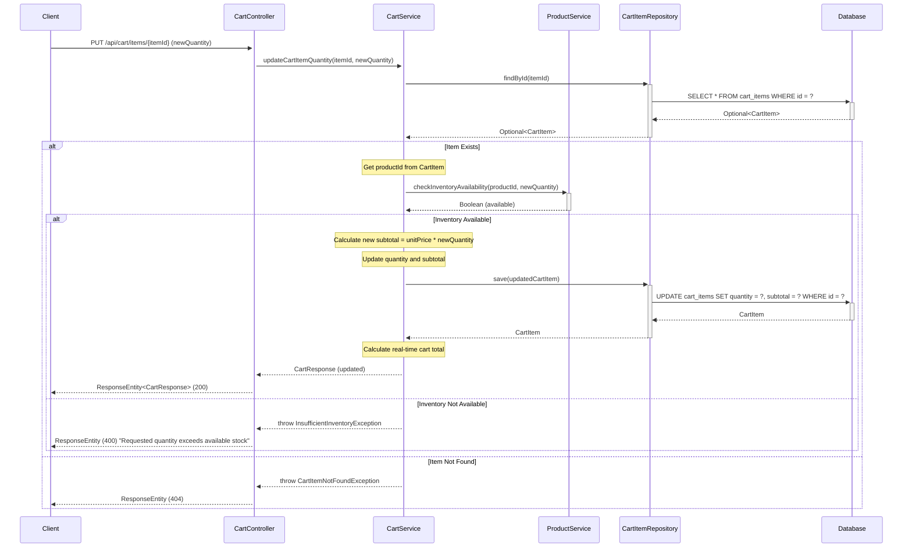
```mermaid
sequenceDiagram
    participant Client
    participant CartController
    participant CartService
    participant ProductService
    participant CartItemRepository
    participant Database
    
    Client->>+CartController: PUT /api/cart/items/{itemId} (newQuantity)
    CartController->>+CartService: updateCartItemQuantity(itemId, newQuantity)
    
    CartService->>+CartItemRepository: findById(itemId)
    CartItemRepository->>+Database: SELECT * FROM cart_items WHERE id = ?
    Database-->>-CartItemRepository: Optional<CartItem>
    CartItemRepository-->>-CartService: Optional<CartItem>
    
    alt Item Exists
        Note over CartService: Get productId from CartItem
        CartService->>+ProductService: checkInventoryAvailability(productId, newQuantity)
        ProductService-->>-CartService: Boolean (available)
        
        alt Inventory Available
            Note over CartService: Calculate new subtotal = unitPrice * newQuantity
            Note over CartService: Update quantity and subtotal
            CartService->>+CartItemRepository: save(updatedCartItem)
            CartItemRepository->>+Database: UPDATE cart_items SET quantity = ?, subtotal = ? WHERE id = ?
            Database-->>-CartItemRepository: CartItem
            CartItemRepository-->>-CartService: CartItem
            
            Note over CartService: Calculate real-time cart total
            CartService-->>CartController: CartResponse (updated)
            CartController-->>Client: ResponseEntity<CartResponse> (200)
        else Inventory Not Available
            CartService-->>CartController: throw InsufficientInventoryException
            CartController-->>Client: ResponseEntity (400) "Requested quantity exceeds available stock"
        end
    else Item Not Found
        CartService-->>CartController: throw CartItemNotFoundException
        CartController-->>Client: ResponseEntity (404)
    end
```

### 3.11 Remove Cart Item

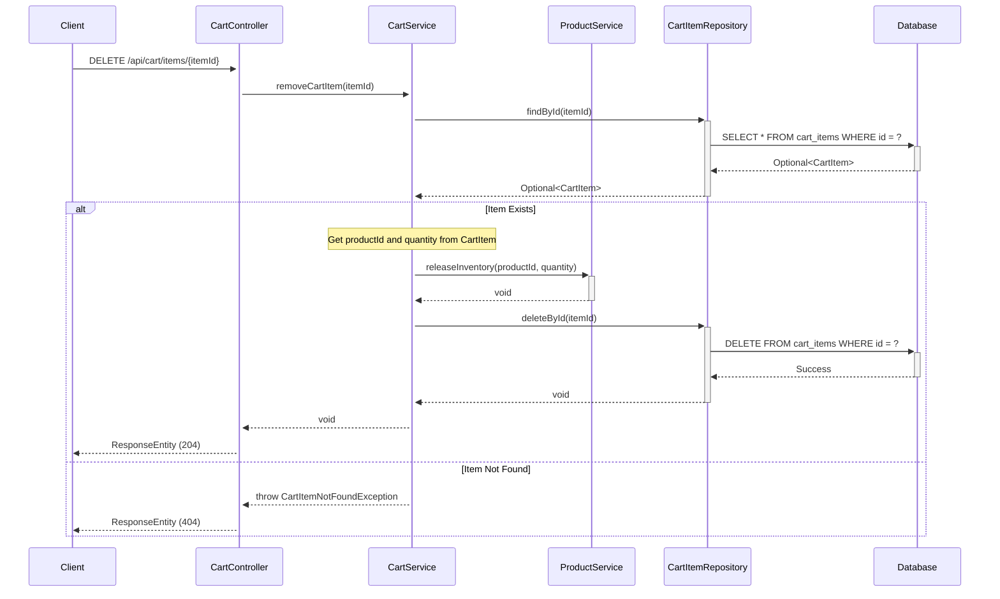
```mermaid
sequenceDiagram
    participant Client
    participant CartController
    participant CartService
    participant ProductService
    participant CartItemRepository
    participant Database
    
    Client->>+CartController: DELETE /api/cart/items/{itemId}
    CartController->>+CartService: removeCartItem(itemId)
    
    CartService->>+CartItemRepository: findById(itemId)
    CartItemRepository->>+Database: SELECT * FROM cart_items WHERE id = ?
    Database-->>-CartItemRepository: Optional<CartItem>
    CartItemRepository-->>-CartService: Optional<CartItem>
    
    alt Item Exists
        Note over CartService: Get productId and quantity from CartItem
        CartService->>+ProductService: releaseInventory(productId, quantity)
        ProductService-->>-CartService: void
        
        CartService->>+CartItemRepository: deleteById(itemId)
        CartItemRepository->>+Database: DELETE FROM cart_items WHERE id = ?
        Database-->>-CartItemRepository: Success
        CartItemRepository-->>-CartService: void
        
        CartService-->>CartController: void
        CartController-->>Client: ResponseEntity (204)
    else Item Not Found
        CartService-->>CartController: throw CartItemNotFoundException
        CartController-->>Client: ResponseEntity (404)
    end
```

### 3.12 Check Product Inventory

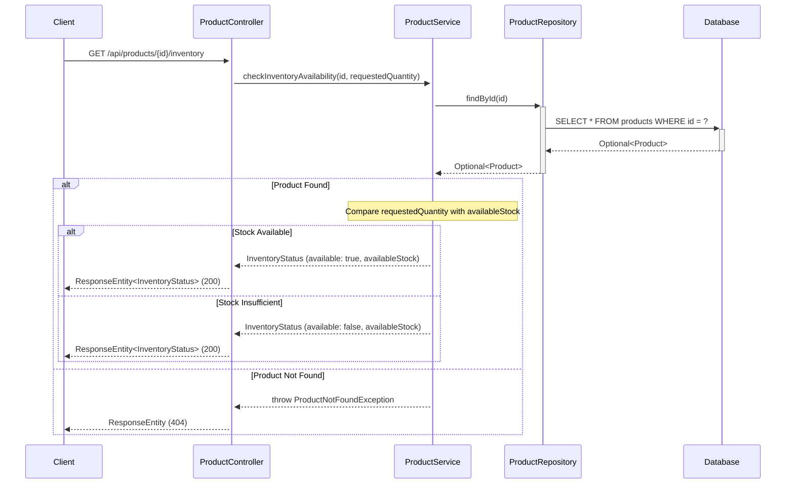
```mermaid
sequenceDiagram
    participant Client
    participant ProductController
    participant ProductService
    participant ProductRepository
    participant Database
    
    Client->>+ProductController: GET /api/products/{id}/inventory
    ProductController->>+ProductService: checkInventoryAvailability(id, requestedQuantity)
    
    ProductService->>+ProductRepository: findById(id)
    ProductRepository->>+Database: SELECT * FROM products WHERE id = ?
    Database-->>-ProductRepository: Optional<Product>
    ProductRepository-->>-ProductService: Optional<Product>
    
    alt Product Found
        Note over ProductService: Compare requestedQuantity with availableStock
        alt Stock Available
            ProductService-->>ProductController: InventoryStatus (available: true, availableStock)
            ProductController-->>Client: ResponseEntity<InventoryStatus> (200)
        else Stock Insufficient
            ProductService-->>ProductController: InventoryStatus (available: false, availableStock)
            ProductController-->>Client: ResponseEntity<InventoryStatus> (200)
        end
    else Product Not Found
        ProductService-->>ProductController: throw ProductNotFoundException
        ProductController-->>Client: ResponseEntity (404)
    end
```

## 4. API Endpoints Summary

### 4.1 Product Management Endpoints

| Method | Endpoint | Description | Request Body | Response |
|--------|----------|-------------|--------------|----------|
| GET | `/api/products` | Get all products | None | List<Product> |
| GET | `/api/products/{id}` | Get product by ID | None | Product |
| POST | `/api/products` | Create new product | Product | Product |
| PUT | `/api/products/{id}` | Update existing product | Product | Product |
| DELETE | `/api/products/{id}` | Delete product | None | None |
| GET | `/api/products/category/{category}` | Get products by category | None | List<Product> |
| GET | `/api/products/search?keyword={keyword}` | Search products by name | None | List<Product> |
| GET | `/api/products/{id}/inventory` | Check inventory availability | None | InventoryStatus |

### 4.2 Shopping Cart Endpoints

| Method | Endpoint | Description | Request Body | Response |
|--------|----------|-------------|--------------|----------|
| POST | `/api/cart/items` | Add product to cart | AddToCartRequest | CartResponse |
| GET | `/api/cart?customerId={customerId}` | View cart details | None | CartResponse |
| PUT | `/api/cart/items/{itemId}` | Update cart item quantity | UpdateQuantityRequest | CartResponse |
| DELETE | `/api/cart/items/{itemId}` | Remove item from cart | None | None |
