## 3. Sequence Diagrams

### 3.1 Get All Products

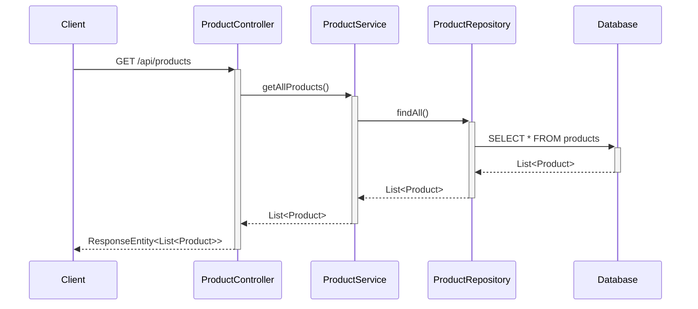
```mermaid
sequenceDiagram
    participant Client
    participant ProductController
    participant ProductService
    participant ProductRepository
    participant Database
    
    Client->>+ProductController: GET /api/products
    ProductController->>+ProductService: getAllProducts()
    ProductService->>+ProductRepository: findAll()
    ProductRepository->>+Database: SELECT * FROM products
    Database-->>-ProductRepository: List<Product>
    ProductRepository-->>-ProductService: List<Product>
    ProductService-->>-ProductController: List<Product>
    ProductController-->>-Client: ResponseEntity<List<Product>>
```

### 3.2 Get Product By ID

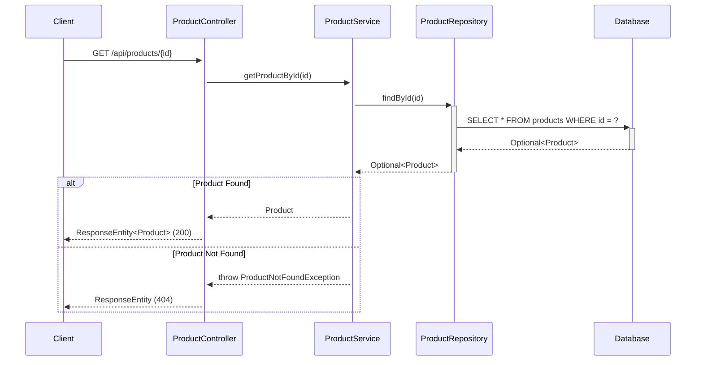
```mermaid
sequenceDiagram
    participant Client
    participant ProductController
    participant ProductService
    participant ProductRepository
    participant Database
    
    Client->>+ProductController: GET /api/products/{id}
    ProductController->>+ProductService: getProductById(id)
    ProductService->>+ProductRepository: findById(id)
    ProductRepository->>+Database: SELECT * FROM products WHERE id = ?
    Database-->>-ProductRepository: Optional<Product>
    ProductRepository-->>-ProductService: Optional<Product>
    
    alt Product Found
        ProductService-->>ProductController: Product
        ProductController-->>Client: ResponseEntity<Product> (200)
    else Product Not Found
        ProductService-->>ProductController: throw ProductNotFoundException
        ProductController-->>Client: ResponseEntity (404)
    end
```

### 3.3 Create Product

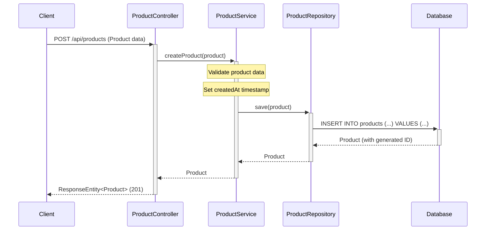
```mermaid
sequenceDiagram
    participant Client
    participant ProductController
    participant ProductService
    participant ProductRepository
    participant Database
    
    Client->>+ProductController: POST /api/products (Product data)
    ProductController->>+ProductService: createProduct(product)
    
    Note over ProductService: Validate product data
    Note over ProductService: Set createdAt timestamp
    
    ProductService->>+ProductRepository: save(product)
    ProductRepository->>+Database: INSERT INTO products (...) VALUES (...)
    Database-->>-ProductRepository: Product (with generated ID)
    ProductRepository-->>-ProductService: Product
    ProductService-->>-ProductController: Product
    ProductController-->>-Client: ResponseEntity<Product> (201)
```

### 3.4 Update Product

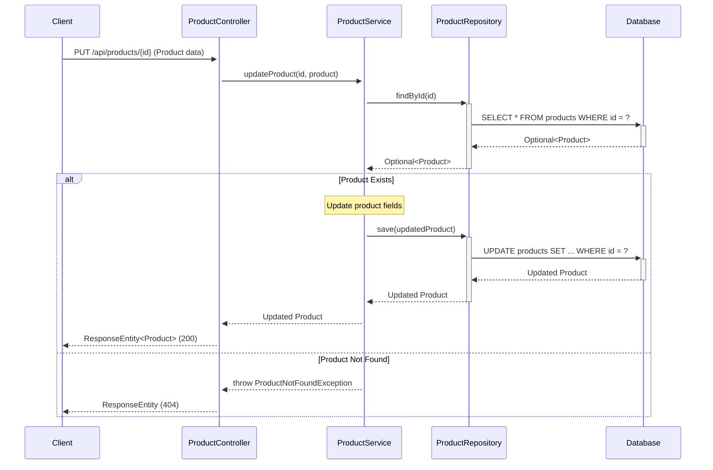
```mermaid
sequenceDiagram
    participant Client
    participant ProductController
    participant ProductService
    participant ProductRepository
    participant Database
    
    Client->>+ProductController: PUT /api/products/{id} (Product data)
    ProductController->>+ProductService: updateProduct(id, product)
    
    ProductService->>+ProductRepository: findById(id)
    ProductRepository->>+Database: SELECT * FROM products WHERE id = ?
    Database-->>-ProductRepository: Optional<Product>
    ProductRepository-->>-ProductService: Optional<Product>
    
    alt Product Exists
        Note over ProductService: Update product fields
        ProductService->>+ProductRepository: save(updatedProduct)
        ProductRepository->>+Database: UPDATE products SET ... WHERE id = ?
        Database-->>-ProductRepository: Updated Product
        ProductRepository-->>-ProductService: Updated Product
        ProductService-->>ProductController: Updated Product
        ProductController-->>Client: ResponseEntity<Product> (200)
    else Product Not Found
        ProductService-->>ProductController: throw ProductNotFoundException
        ProductController-->>Client: ResponseEntity (404)
    end
```

### 3.5 Delete Product

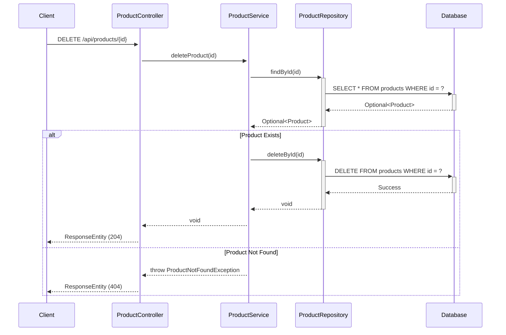
```mermaid
sequenceDiagram
    participant Client
    participant ProductController
    participant ProductService
    participant ProductRepository
    participant Database
    
    Client->>+ProductController: DELETE /api/products/{id}
    ProductController->>+ProductService: deleteProduct(id)
    
    ProductService->>+ProductRepository: findById(id)
    ProductRepository->>+Database: SELECT * FROM products WHERE id = ?
    Database-->>-ProductRepository: Optional<Product>
    ProductRepository-->>-ProductService: Optional<Product>
    
    alt Product Exists
        ProductService->>+ProductRepository: deleteById(id)
        ProductRepository->>+Database: DELETE FROM products WHERE id = ?
        Database-->>-ProductRepository: Success
        ProductRepository-->>-ProductService: void
        ProductService-->>ProductController: void
        ProductController-->>Client: ResponseEntity (204)
    else Product Not Found
        ProductService-->>ProductController: throw ProductNotFoundException
        ProductController-->>Client: ResponseEntity (404)
    end
```

### 3.6 Get Products By Category

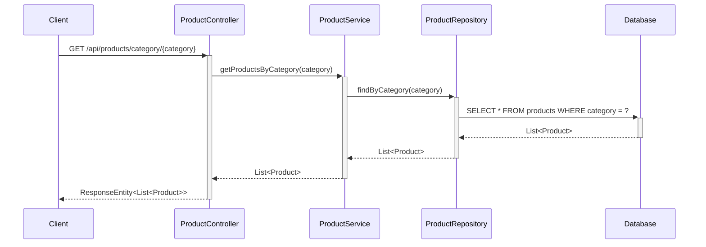
```mermaid
sequenceDiagram
    participant Client
    participant ProductController
    participant ProductService
    participant ProductRepository
    participant Database
    
    Client->>+ProductController: GET /api/products/category/{category}
    ProductController->>+ProductService: getProductsByCategory(category)
    ProductService->>+ProductRepository: findByCategory(category)
    ProductRepository->>+Database: SELECT * FROM products WHERE category = ?
    Database-->>-ProductRepository: List<Product>
    ProductRepository-->>-ProductService: List<Product>
    ProductService-->>-ProductController: List<Product>
    ProductController-->>-Client: ResponseEntity<List<Product>>
```

### 3.7 Search Products

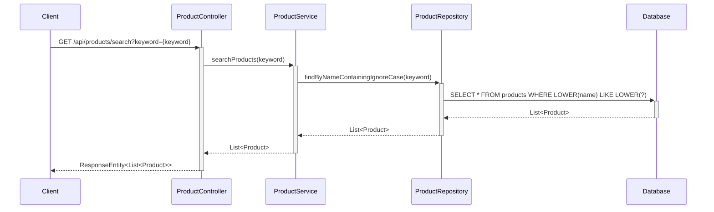
```mermaid
sequenceDiagram
    participant Client
    participant ProductController
    participant ProductService
    participant ProductRepository
    participant Database
    
    Client->>+ProductController: GET /api/products/search?keyword={keyword}
    ProductController->>+ProductService: searchProducts(keyword)
    ProductService->>+ProductRepository: findByNameContainingIgnoreCase(keyword)
    ProductRepository->>+Database: SELECT * FROM products WHERE LOWER(name) LIKE LOWER(?)
    Database-->>-ProductRepository: List<Product>
    ProductRepository-->>-ProductService: List<Product>
    ProductService-->>-ProductController: List<Product>
    ProductController-->>-Client: ResponseEntity<List<Product>>
```

### 3.8 Add Item to Cart

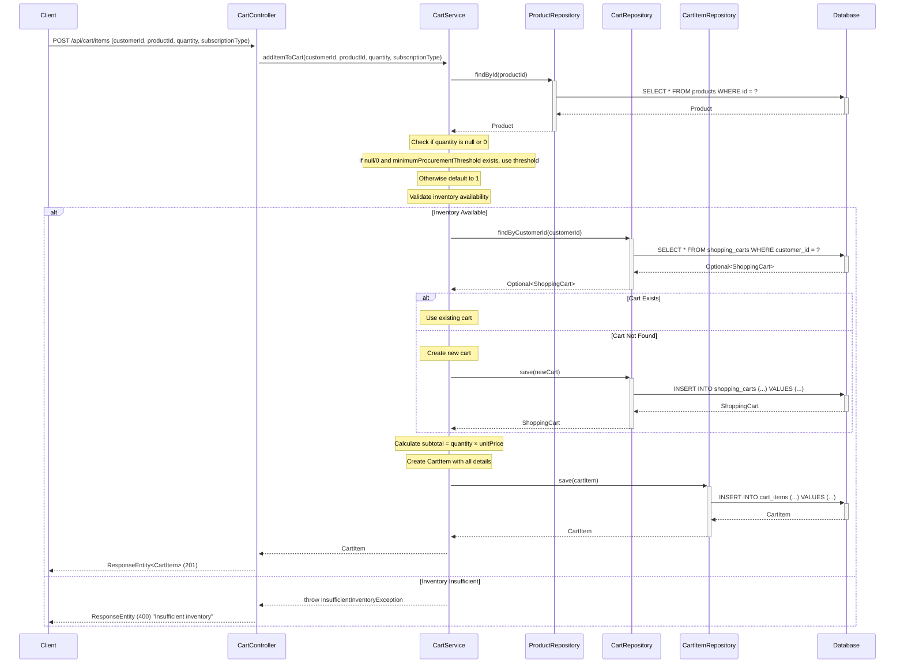
```mermaid
sequenceDiagram
    participant Client
    participant CartController
    participant CartService
    participant ProductRepository
    participant CartRepository
    participant CartItemRepository
    participant Database
    
    Client->>+CartController: POST /api/cart/items (customerId, productId, quantity, subscriptionType)
    CartController->>+CartService: addItemToCart(customerId, productId, quantity, subscriptionType)
    
    CartService->>+ProductRepository: findById(productId)
    ProductRepository->>+Database: SELECT * FROM products WHERE id = ?
    Database-->>-ProductRepository: Product
    ProductRepository-->>-CartService: Product
    
    Note over CartService: Check if quantity is null or 0
    Note over CartService: If null/0 and minimumProcurementThreshold exists, use threshold
    Note over CartService: Otherwise default to 1
    Note over CartService: Validate inventory availability
    
    alt Inventory Available
        CartService->>+CartRepository: findByCustomerId(customerId)
        CartRepository->>+Database: SELECT * FROM shopping_carts WHERE customer_id = ?
        Database-->>-CartRepository: Optional<ShoppingCart>
        CartRepository-->>-CartService: Optional<ShoppingCart>
        
        alt Cart Exists
            Note over CartService: Use existing cart
        else Cart Not Found
            Note over CartService: Create new cart
            CartService->>+CartRepository: save(newCart)
            CartRepository->>+Database: INSERT INTO shopping_carts (...) VALUES (...)
            Database-->>-CartRepository: ShoppingCart
            CartRepository-->>-CartService: ShoppingCart
        end
        
        Note over CartService: Calculate subtotal = quantity × unitPrice
        Note over CartService: Create CartItem with all details
        
        CartService->>+CartItemRepository: save(cartItem)
        CartItemRepository->>+Database: INSERT INTO cart_items (...) VALUES (...)
        Database-->>-CartItemRepository: CartItem
        CartItemRepository-->>-CartService: CartItem
        
        CartService-->>CartController: CartItem
        CartController-->>Client: ResponseEntity<CartItem> (201)
    else Inventory Insufficient
        CartService-->>CartController: throw InsufficientInventoryException
        CartController-->>Client: ResponseEntity (400) "Insufficient inventory"
    end
```

### 3.9 View Shopping Cart

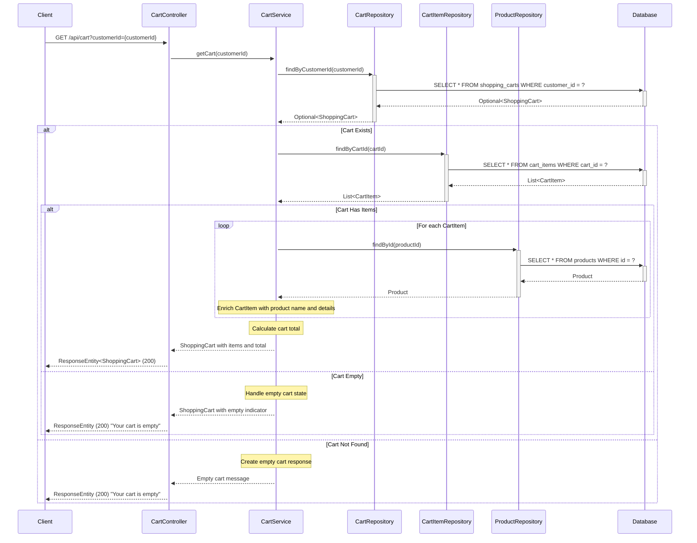
```mermaid
sequenceDiagram
    participant Client
    participant CartController
    participant CartService
    participant CartRepository
    participant CartItemRepository
    participant ProductRepository
    participant Database
    
    Client->>+CartController: GET /api/cart?customerId={customerId}
    CartController->>+CartService: getCart(customerId)
    
    CartService->>+CartRepository: findByCustomerId(customerId)
    CartRepository->>+Database: SELECT * FROM shopping_carts WHERE customer_id = ?
    Database-->>-CartRepository: Optional<ShoppingCart>
    CartRepository-->>-CartService: Optional<ShoppingCart>
    
    alt Cart Exists
        CartService->>+CartItemRepository: findByCartId(cartId)
        CartItemRepository->>+Database: SELECT * FROM cart_items WHERE cart_id = ?
        Database-->>-CartItemRepository: List<CartItem>
        CartItemRepository-->>-CartService: List<CartItem>
        
        alt Cart Has Items
            loop For each CartItem
                CartService->>+ProductRepository: findById(productId)
                ProductRepository->>+Database: SELECT * FROM products WHERE id = ?
                Database-->>-ProductRepository: Product
                ProductRepository-->>-CartService: Product
                Note over CartService: Enrich CartItem with product name and details
            end
            
            Note over CartService: Calculate cart total
            CartService-->>CartController: ShoppingCart with items and total
            CartController-->>Client: ResponseEntity<ShoppingCart> (200)
        else Cart Empty
            Note over CartService: Handle empty cart state
            CartService-->>CartController: ShoppingCart with empty indicator
            CartController-->>Client: ResponseEntity (200) "Your cart is empty"
        end
    else Cart Not Found
        Note over CartService: Create empty cart response
        CartService-->>CartController: Empty cart message
        CartController-->>Client: ResponseEntity (200) "Your cart is empty"
    end
```

### 3.10 Update Cart Item Quantity with Real-time Calculation

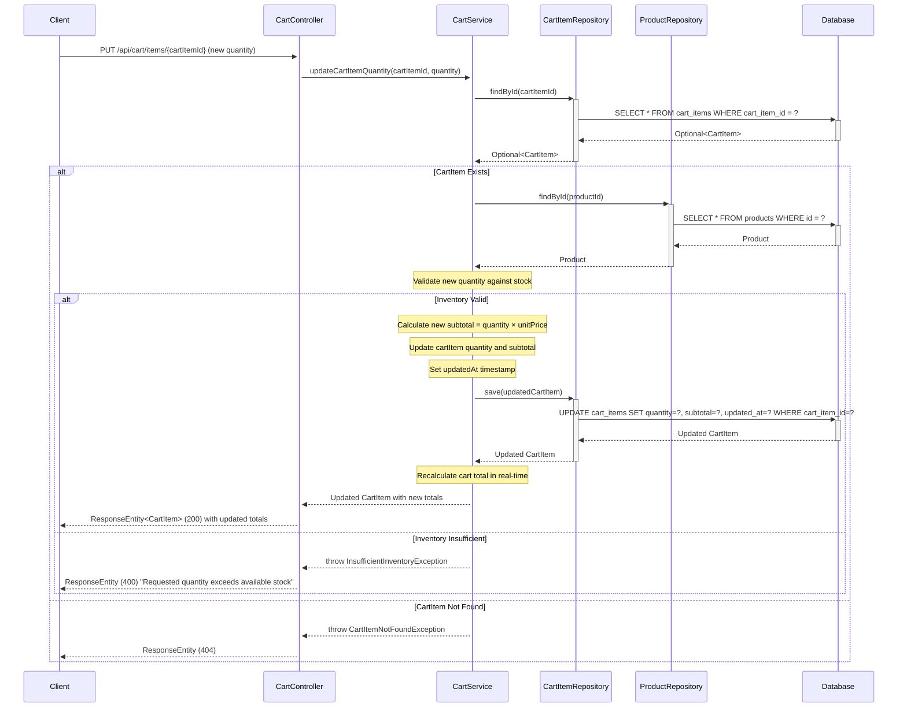
```mermaid
sequenceDiagram
    participant Client
    participant CartController
    participant CartService
    participant CartItemRepository
    participant ProductRepository
    participant Database
    
    Client->>+CartController: PUT /api/cart/items/{cartItemId} (new quantity)
    CartController->>+CartService: updateCartItemQuantity(cartItemId, quantity)
    
    CartService->>+CartItemRepository: findById(cartItemId)
    CartItemRepository->>+Database: SELECT * FROM cart_items WHERE cart_item_id = ?
    Database-->>-CartItemRepository: Optional<CartItem>
    CartItemRepository-->>-CartService: Optional<CartItem>
    
    alt CartItem Exists
        CartService->>+ProductRepository: findById(productId)
        ProductRepository->>+Database: SELECT * FROM products WHERE id = ?
        Database-->>-ProductRepository: Product
        ProductRepository-->>-CartService: Product
        
        Note over CartService: Validate new quantity against stock
        
        alt Inventory Valid
            Note over CartService: Calculate new subtotal = quantity × unitPrice
            Note over CartService: Update cartItem quantity and subtotal
            Note over CartService: Set updatedAt timestamp
            
            CartService->>+CartItemRepository: save(updatedCartItem)
            CartItemRepository->>+Database: UPDATE cart_items SET quantity=?, subtotal=?, updated_at=? WHERE cart_item_id=?
            Database-->>-CartItemRepository: Updated CartItem
            CartItemRepository-->>-CartService: Updated CartItem
            
            Note over CartService: Recalculate cart total in real-time
            
            CartService-->>CartController: Updated CartItem with new totals
            CartController-->>Client: ResponseEntity<CartItem> (200) with updated totals
        else Inventory Insufficient
            CartService-->>CartController: throw InsufficientInventoryException
            CartController-->>Client: ResponseEntity (400) "Requested quantity exceeds available stock"
        end
    else CartItem Not Found
        CartService-->>CartController: throw CartItemNotFoundException
        CartController-->>Client: ResponseEntity (404)
    end
```

### 3.11 Remove Item from Cart

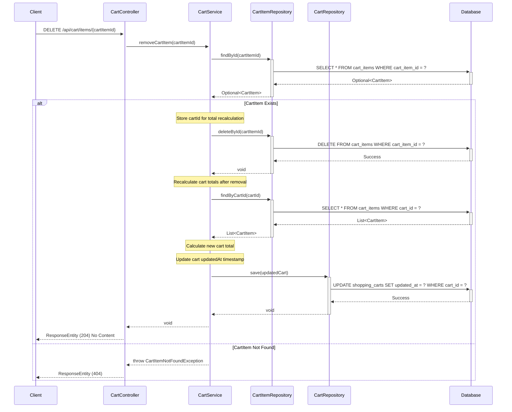
```mermaid
sequenceDiagram
    participant Client
    participant CartController
    participant CartService
    participant CartItemRepository
    participant CartRepository
    participant Database
    
    Client->>+CartController: DELETE /api/cart/items/{cartItemId}
    CartController->>+CartService: removeCartItem(cartItemId)
    
    CartService->>+CartItemRepository: findById(cartItemId)
    CartItemRepository->>+Database: SELECT * FROM cart_items WHERE cart_item_id = ?
    Database-->>-CartItemRepository: Optional<CartItem>
    CartItemRepository-->>-CartService: Optional<CartItem>
    
    alt CartItem Exists
        Note over CartService: Store cartId for total recalculation
        
        CartService->>+CartItemRepository: deleteById(cartItemId)
        CartItemRepository->>+Database: DELETE FROM cart_items WHERE cart_item_id = ?
        Database-->>-CartItemRepository: Success
        CartItemRepository-->>-CartService: void
        
        Note over CartService: Recalculate cart totals after removal
        CartService->>+CartItemRepository: findByCartId(cartId)
        CartItemRepository->>+Database: SELECT * FROM cart_items WHERE cart_id = ?
        Database-->>-CartItemRepository: List<CartItem>
        CartItemRepository-->>-CartService: List<CartItem>
        
        Note over CartService: Calculate new cart total
        Note over CartService: Update cart updatedAt timestamp
        
        CartService->>+CartRepository: save(updatedCart)
        CartRepository->>+Database: UPDATE shopping_carts SET updated_at = ? WHERE cart_id = ?
        Database-->>-CartRepository: Success
        CartRepository-->>-CartService: void
        
        CartService-->>CartController: void
        CartController-->>Client: ResponseEntity (204) No Content
    else CartItem Not Found
        CartService-->>CartController: throw CartItemNotFoundException
        CartController-->>Client: ResponseEntity (404)
    end
```

### 3.12 Inventory Validation Flow

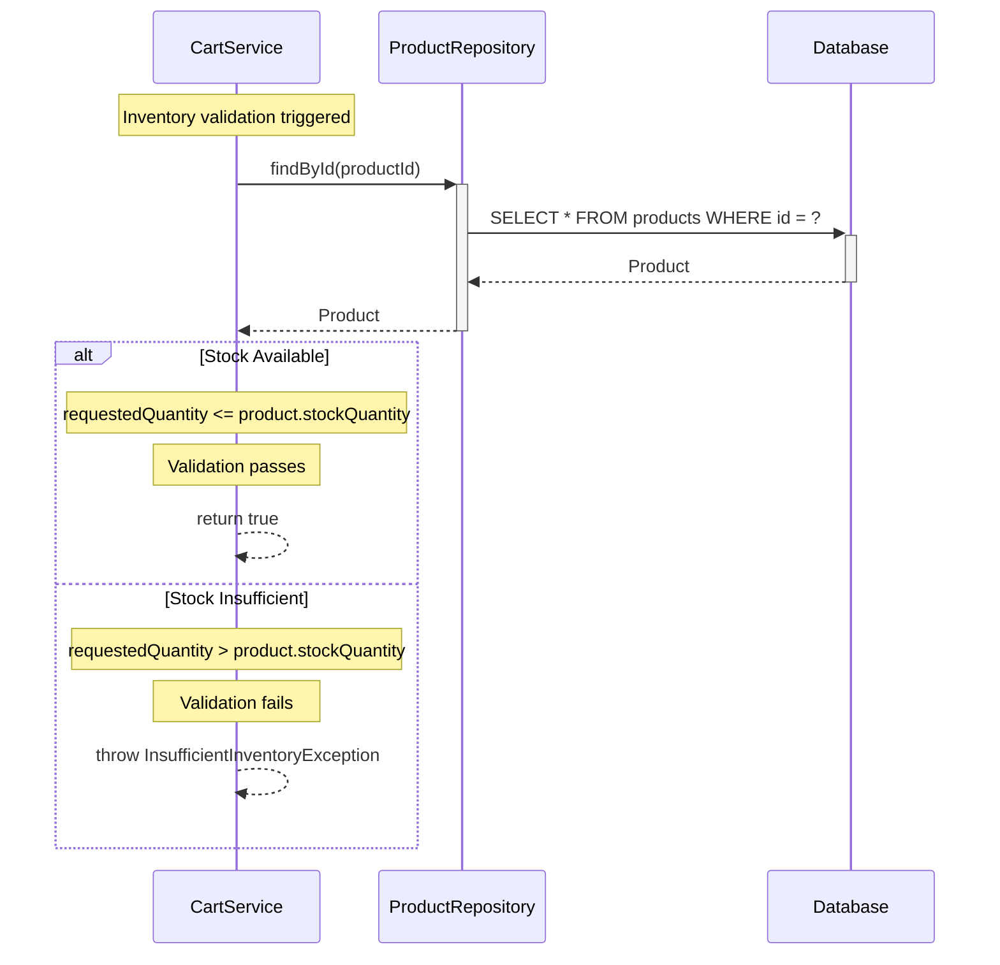
```mermaid
sequenceDiagram
    participant CartService
    participant ProductRepository
    participant Database
    
    Note over CartService: Inventory validation triggered
    CartService->>+ProductRepository: findById(productId)
    ProductRepository->>+Database: SELECT * FROM products WHERE id = ?
    Database-->>-ProductRepository: Product
    ProductRepository-->>-CartService: Product
    
    alt Stock Available
        Note over CartService: requestedQuantity <= product.stockQuantity
        Note over CartService: Validation passes
        CartService-->>CartService: return true
    else Stock Insufficient
        Note over CartService: requestedQuantity > product.stockQuantity
        Note over CartService: Validation fails
        CartService-->>CartService: throw InsufficientInventoryException
    end
```

## 4. API Endpoints Summary

| Method | Endpoint | Description | Request Body | Response |
|--------|----------|-------------|--------------|----------|
| GET | `/api/products` | Get all products | None | List<Product> |
| GET | `/api/products/{id}` | Get product by ID | None | Product |
| POST | `/api/products` | Create new product | Product | Product |
| PUT | `/api/products/{id}` | Update existing product | Product | Product |
| DELETE | `/api/products/{id}` | Delete product | None | None |
| GET | `/api/products/category/{category}` | Get products by category | None | List<Product> |
| GET | `/api/products/search?keyword={keyword}` | Search products by name | None | List<Product> |
| POST | `/api/cart/items` | Add product to cart | CartItemRequest | CartItem |
| GET | `/api/cart?customerId={customerId}` | View shopping cart | None | ShoppingCart |
| PUT | `/api/cart/items/{cartItemId}` | Update cart item quantity | QuantityUpdateRequest | CartItem |
| DELETE | `/api/cart/items/{cartItemId}` | Remove item from cart | None | None |

## 5. Database Schema

### Products Table

```sql
CREATE TABLE products (
    id BIGINT PRIMARY KEY AUTO_INCREMENT,
    name VARCHAR(255) NOT NULL,
    description TEXT,
    price DECIMAL(10,2) NOT NULL,
    category VARCHAR(100) NOT NULL,
    stock_quantity INTEGER NOT NULL DEFAULT 0,
    created_at TIMESTAMP NOT NULL DEFAULT CURRENT_TIMESTAMP,
    minimum_procurement_threshold INTEGER NULL
);

CREATE INDEX idx_products_category ON products(category);
CREATE INDEX idx_products_name ON products(name);
```

### Shopping Carts Table

```sql
CREATE TABLE shopping_carts (
    cart_id BIGINT PRIMARY KEY AUTO_INCREMENT,
    customer_id BIGINT NOT NULL,
    created_at TIMESTAMP NOT NULL DEFAULT CURRENT_TIMESTAMP,
    updated_at TIMESTAMP NOT NULL DEFAULT CURRENT_TIMESTAMP ON UPDATE CURRENT_TIMESTAMP,
    UNIQUE KEY uk_customer_cart (customer_id)
);

CREATE INDEX idx_shopping_carts_customer ON shopping_carts(customer_id);
```

### Cart Items Table

```sql
CREATE TABLE cart_items (
    cart_item_id BIGINT PRIMARY KEY AUTO_INCREMENT,
    cart_id BIGINT NOT NULL,
    product_id BIGINT NOT NULL,
    quantity INTEGER NOT NULL DEFAULT 1,
    unit_price DECIMAL(10,2) NOT NULL,
    subtotal DECIMAL(10,2) NOT NULL,
    minimum_procurement_threshold INTEGER NULL,
    subscription_type VARCHAR(50) NOT NULL,
    created_at TIMESTAMP NOT NULL DEFAULT CURRENT_TIMESTAMP,
    updated_at TIMESTAMP NOT NULL DEFAULT CURRENT_TIMESTAMP ON UPDATE CURRENT_TIMESTAMP,
    FOREIGN KEY (cart_id) REFERENCES shopping_carts(cart_id) ON DELETE CASCADE,
    FOREIGN KEY (product_id) REFERENCES products(id) ON DELETE CASCADE
);

CREATE INDEX idx_cart_items_cart ON cart_items(cart_id);
CREATE INDEX idx_cart_items_product ON cart_items(product_id);
```

## 6. Technology Stack

- **Backend Framework:** Spring Boot 3.x
- **Language:** Java 21
- **Database:** PostgreSQL
- **ORM:** Spring Data JPA / Hibernate
- **Build Tool:** Maven/Gradle
- **API Documentation:** Swagger/OpenAPI 3

## 7. Design Patterns Used

1. **MVC Pattern:** Separation of Controller, Service, and Repository layers
2. **Repository Pattern:** Data access abstraction through ProductRepository
3. **Dependency Injection:** Spring's IoC container manages dependencies
4. **DTO Pattern:** Data Transfer Objects for API requests/responses
5. **Exception Handling:** Custom exceptions for business logic errors
