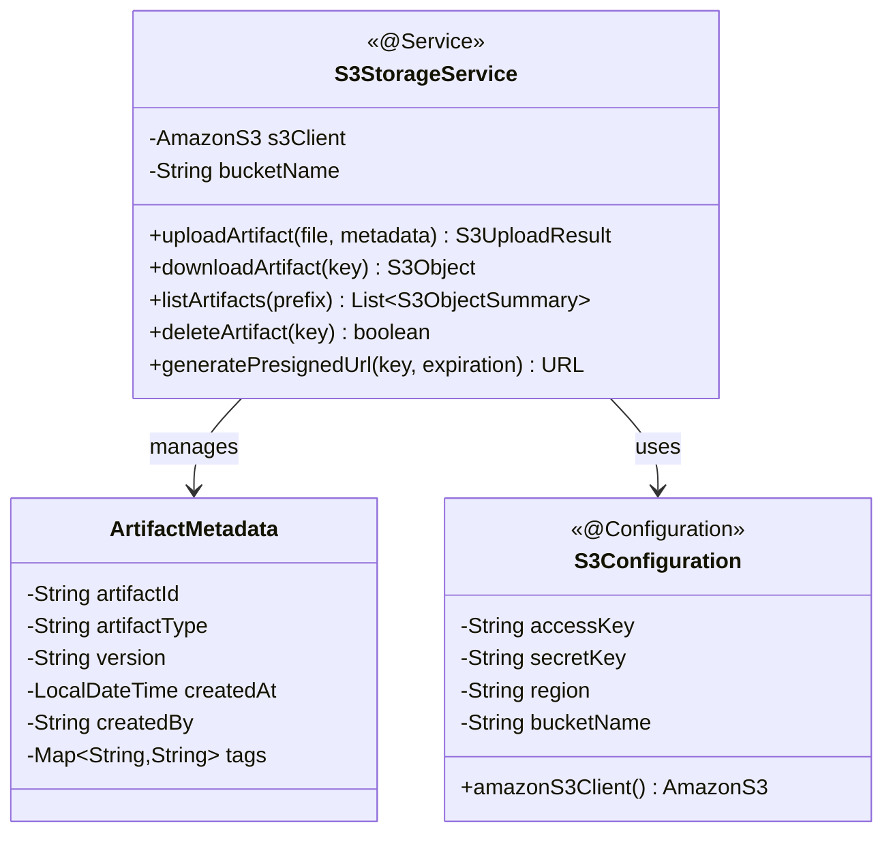
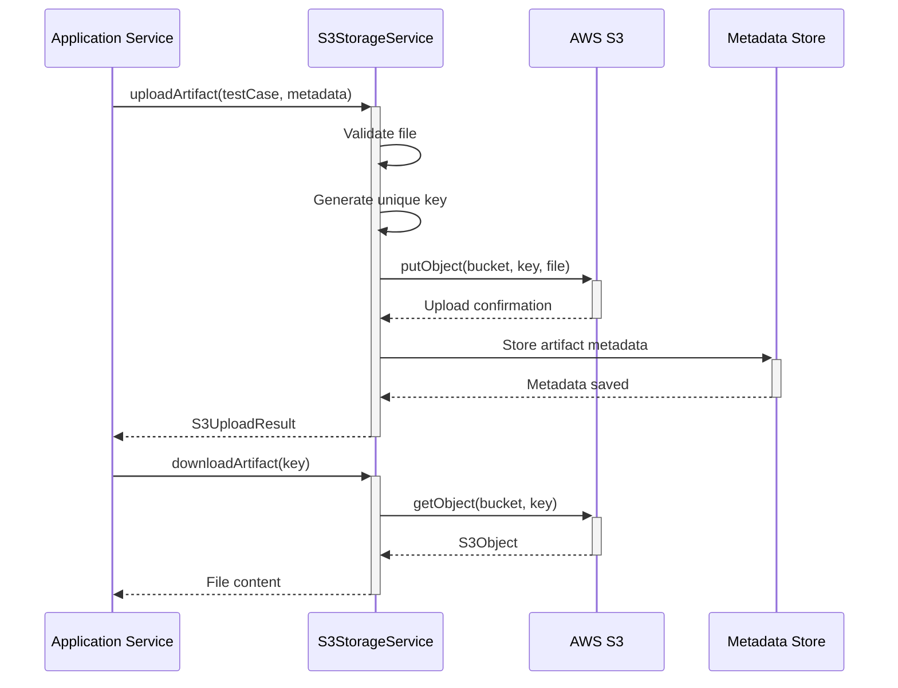
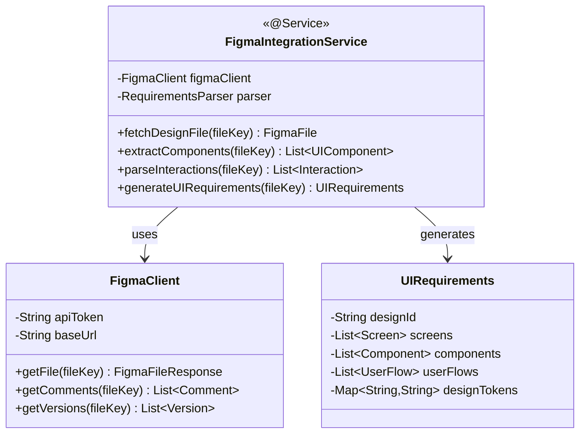
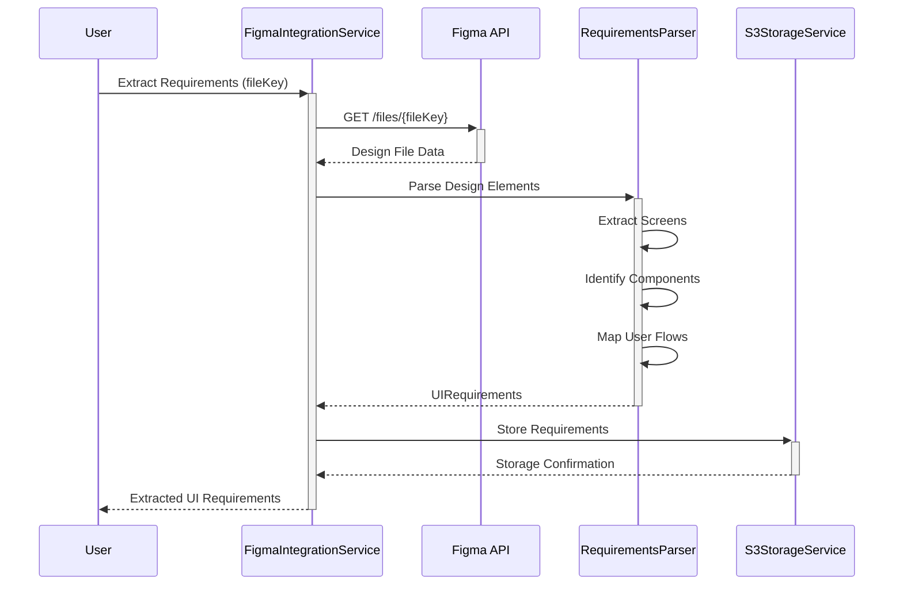
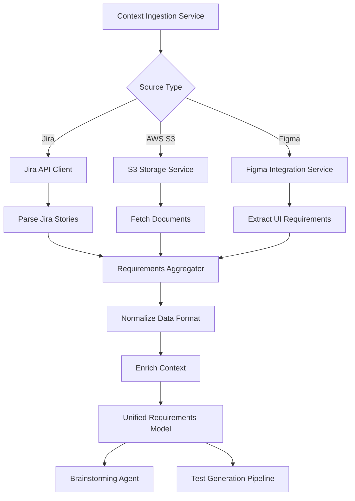
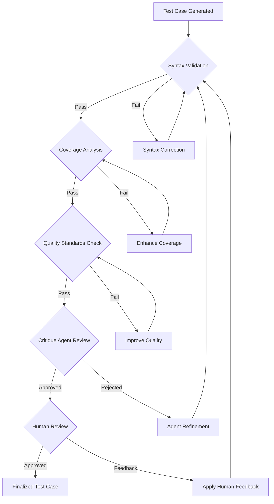
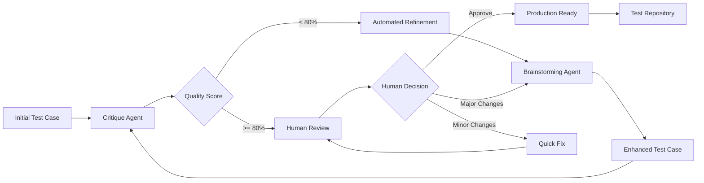
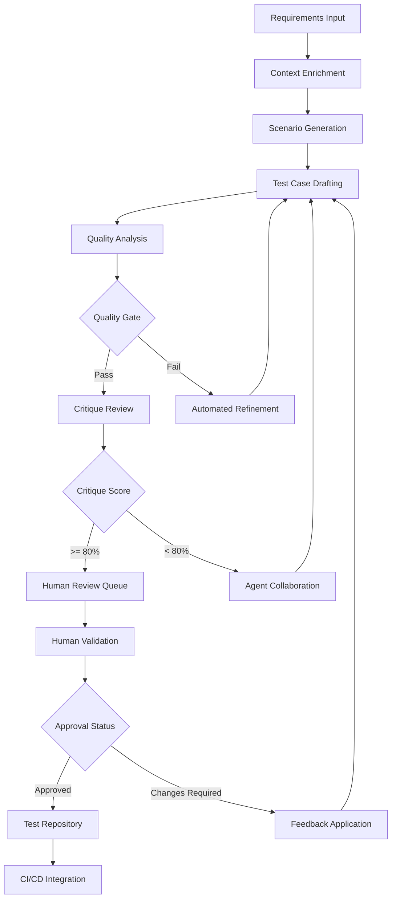
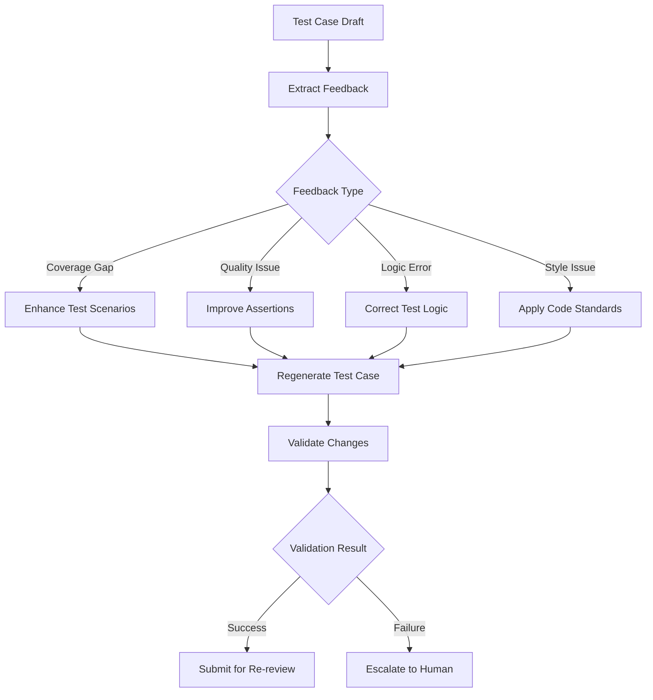

## 9. Integration Specifications

### 9.1 AWS S3 Integration for Artifact Storage

**Added Section: Data persistence and artifact management strategy**

This section details the AWS S3 integration for storing test artifacts, requirements documents, and generated test cases.

#### S3 Service Architecture


```mermaid
classDiagram
    class S3StorageService {
        <<@Service>>
        -AmazonS3 s3Client
        -String bucketName
        +uploadArtifact(file, metadata) S3UploadResult
        +downloadArtifact(key) S3Object
        +listArtifacts(prefix) List~S3ObjectSummary~
        +deleteArtifact(key) boolean
        +generatePresignedUrl(key, expiration) URL
    }
    
    class ArtifactMetadata {
        -String artifactId
        -String artifactType
        -String version
        -LocalDateTime createdAt
        -String createdBy
        -Map~String,String~ tags
    }
    
    class S3Configuration {
        <<@Configuration>>
        -String accessKey
        -String secretKey
        -String region
        -String bucketName
        +amazonS3Client() AmazonS3
    }
    
    S3StorageService --> ArtifactMetadata : manages
    S3StorageService --> S3Configuration : uses
```

#### S3 Storage Workflow


```mermaid
sequenceDiagram
    participant Service as Application Service
    participant S3Service as S3StorageService
    participant S3 as AWS S3
    participant Metadata as Metadata Store
    
    Service->>+S3Service: uploadArtifact(testCase, metadata)
    S3Service->>S3Service: Validate file
    S3Service->>S3Service: Generate unique key
    S3Service->>+S3: putObject(bucket, key, file)
    S3-->>-S3Service: Upload confirmation
    S3Service->>+Metadata: Store artifact metadata
    Metadata-->>-S3Service: Metadata saved
    S3Service-->>-Service: S3UploadResult
    
    Service->>+S3Service: downloadArtifact(key)
    S3Service->>+S3: getObject(bucket, key)
    S3-->>-S3Service: S3Object
    S3Service-->>-Service: File content
```

#### S3 Bucket Structure

```
aava-qe-studio/
├── test-cases/
│   ├── automated/
│   │   ├── {project-id}/
│   │   │   ├── {version}/
│   │   │   │   └── test-suite-{timestamp}.json
│   └── manual/
├── requirements/
│   ├── jira/
│   │   └── {story-id}.json
│   ├── figma/
│   │   └── {design-id}.json
│   └── documents/
├── artifacts/
│   ├── lld/
│   └── reports/
└── metadata/
    └── index.json
```

### 9.2 Figma Integration for UI/UX Requirements

**Added Section: UI/UX requirements extraction capability**

This section details the Figma integration for extracting design specifications and UI requirements.

#### Figma Service Architecture


```mermaid
classDiagram
    class FigmaIntegrationService {
        <<@Service>>
        -FigmaClient figmaClient
        -RequirementsParser parser
        +fetchDesignFile(fileKey) FigmaFile
        +extractComponents(fileKey) List~UIComponent~
        +parseInteractions(fileKey) List~Interaction~
        +generateUIRequirements(fileKey) UIRequirements
    }
    
    class FigmaClient {
        -String apiToken
        -String baseUrl
        +getFile(fileKey) FigmaFileResponse
        +getComments(fileKey) List~Comment~
        +getVersions(fileKey) List~Version~
    }
    
    class UIRequirements {
        -String designId
        -List~Screen~ screens
        -List~Component~ components
        -List~UserFlow~ userFlows
        -Map~String,String~ designTokens
    }
    
    FigmaIntegrationService --> FigmaClient : uses
    FigmaIntegrationService --> UIRequirements : generates
```

#### Figma Data Extraction Flow


```mermaid
sequenceDiagram
    participant User
    participant FigmaService as FigmaIntegrationService
    participant FigmaAPI as Figma API
    participant Parser as RequirementsParser
    participant Storage as S3StorageService
    
    User->>+FigmaService: Extract Requirements (fileKey)
    FigmaService->>+FigmaAPI: GET /files/{fileKey}
    FigmaAPI-->>-FigmaService: Design File Data
    
    FigmaService->>+Parser: Parse Design Elements
    Parser->>Parser: Extract Screens
    Parser->>Parser: Identify Components
    Parser->>Parser: Map User Flows
    Parser-->>-FigmaService: UIRequirements
    
    FigmaService->>+Storage: Store Requirements
    Storage-->>-FigmaService: Storage Confirmation
    
    FigmaService-->>-User: Extracted UI Requirements
```

### 9.3 Multi-Source Context Ingestion

**Added Section: Enhanced acceptance criteria for comprehensive requirements gathering**


```mermaid
flowchart TD
    A[Context Ingestion Service] --> B{Source Type}
    B -->|Jira| C[Jira API Client]
    B -->|AWS S3| D[S3 Storage Service]
    B -->|Figma| E[Figma Integration Service]
    
    C --> F[Parse Jira Stories]
    D --> G[Fetch Documents]
    E --> H[Extract UI Requirements]
    
    F --> I[Requirements Aggregator]
    G --> I
    H --> I
    
    I --> J[Normalize Data Format]
    J --> K[Enrich Context]
    K --> L[Unified Requirements Model]
    
    L --> M[Brainstorming Agent]
    L --> N[Test Generation Pipeline]
```

## 10. Validation and Quality Assurance

### 10.1 Detailed Validation Workflow

**Added Section: Comprehensive workflow specification for quality assurance**

#### Validation Checkpoints


```mermaid
flowchart TD
    Start[Test Case Generated] --> V1{Syntax Validation}
    V1 -->|Pass| V2{Coverage Analysis}
    V1 -->|Fail| R1[Syntax Correction]
    R1 --> V1
    
    V2 -->|Pass| V3{Quality Standards Check}
    V2 -->|Fail| R2[Enhance Coverage]
    R2 --> V2
    
    V3 -->|Pass| V4{Critique Agent Review}
    V3 -->|Fail| R3[Improve Quality]
    R3 --> V3
    
    V4 -->|Approved| V5{Human Review}
    V4 -->|Rejected| R4[Agent Refinement]
    R4 --> V1
    
    V5 -->|Approved| End[Finalized Test Case]
    V5 -->|Feedback| R5[Apply Human Feedback]
    R5 --> V1
```

#### Approval Mechanisms

```mermaid
sequenceDiagram
    participant TC as Test Case
    participant CA as Critique Agent
    participant QA as Quality Analyzer
    participant Human as Human Reviewer
    participant Repo as Test Repository
    
    TC->>+CA: Submit for Validation
    CA->>+QA: Analyze Quality Metrics
    QA-->>-CA: Quality Report
    
    alt Quality Threshold Met
        CA->>+Human: Request Approval
        Human->>Human: Review Test Case
        
        alt Approved
            Human-->>CA: Approve
            CA->>+Repo: Store Test Case
            Repo-->>-CA: Confirmation
            CA-->>-TC: Validation Success
        else Requires Changes
            Human-->>CA: Provide Feedback
            CA-->>TC: Refinement Required
        end
    else Quality Below Threshold
        CA-->>-TC: Rejection with Feedback
    end
```

#### Feedback Loop Mechanism


```mermaid
flowchart LR
    A[Initial Test Case] --> B[Critique Agent]
    B --> C{Quality Score}
    C -->|>= 80%| D[Human Review]
    C -->|< 80%| E[Automated Refinement]
    
    E --> F[Brainstorming Agent]
    F --> G[Enhanced Test Case]
    G --> B
    
    D --> H{Human Decision}
    H -->|Approve| I[Production Ready]
    H -->|Minor Changes| J[Quick Fix]
    H -->|Major Changes| F
    
    J --> D
    
    I --> K[Test Repository]
```

### 10.2 Quality Metrics and Standards

**Added Section: Quality assurance standards for test case validation**

#### Quality Criteria

| Metric | Threshold | Description |
|--------|-----------|-------------|
| Code Coverage | >= 80% | Percentage of code paths tested |
| Requirement Coverage | 100% | All acceptance criteria addressed |
| Edge Case Coverage | >= 70% | Boundary and error conditions tested |
| Assertion Quality | >= 90% | Meaningful and specific assertions |
| Test Independence | 100% | No inter-test dependencies |
| Execution Time | < 5s per test | Performance benchmark |
| Readability Score | >= 85% | Code clarity and documentation |

#### Validation Rules

1. **Syntax Validation**
   - Valid test framework syntax
   - Proper annotation usage
   - Correct assertion methods

2. **Semantic Validation**
   - Test logic aligns with requirements
   - Appropriate test data
   - Realistic scenarios

3. **Coverage Validation**
   - All user stories covered
   - Positive and negative cases
   - Edge cases identified

4. **Quality Validation**
   - Clear test names
   - Proper setup and teardown
   - Isolated test execution
   - Comprehensive assertions

## 11. Enhanced Acceptance Criteria

### 11.1 Context Ingestion Enhancement

**Added Section: Multi-source ingestion capability specification**

#### Acceptance Criteria for Multi-Source Ingestion

1. **Jira Integration**
   - Successfully authenticate with Jira API
   - Fetch user stories with all fields
   - Parse acceptance criteria
   - Extract linked issues and dependencies
   - Handle pagination for large projects

2. **AWS S3 Integration**
   - Connect to S3 bucket with proper credentials
   - List and retrieve requirement documents
   - Support multiple file formats (PDF, DOCX, MD, JSON)
   - Parse document content accurately
   - Maintain version history

3. **Figma Integration**
   - Authenticate with Figma API token
   - Fetch design files and components
   - Extract UI specifications
   - Parse interaction flows
   - Map design elements to requirements

4. **Unified Context Model**
   - Normalize data from all sources
   - Create comprehensive requirement model
   - Maintain traceability to source
   - Enrich context with cross-references
   - Validate completeness

### 11.2 Agent Specification Enhancement

**Added Section: Detailed agent responsibilities and naming alignment**

#### Brainstorming Agent Responsibilities

1. **Scenario Generation**
   - Analyze unified requirements
   - Generate comprehensive test scenarios
   - Identify edge cases
   - Propose test data sets
   - Create test case templates

2. **Creative Exploration**
   - Explore alternative test approaches
   - Suggest additional coverage areas
   - Identify potential gaps
   - Propose optimization strategies

#### Critique Agent Responsibilities

1. **Validation Functions**
   - Review test case quality
   - Assess requirement coverage
   - Validate test logic
   - Check for redundancy
   - Ensure best practices

2. **Feedback Provision**
   - Provide constructive critique
   - Suggest improvements
   - Identify weaknesses
   - Recommend enhancements
   - Score quality metrics

### 11.3 Human-in-the-Loop Validation Enhancement

**Added Section: Comprehensive validation workflow with approval mechanisms**

#### Validation Workflow Components

1. **Review Interface**
   - Present test cases for human review
   - Display quality metrics
   - Show requirement traceability
   - Provide comparison with previous versions
   - Enable inline commenting

2. **Approval Mechanisms**
   - Multi-level approval workflow
   - Role-based access control
   - Approval delegation
   - Batch approval capability
   - Audit trail maintenance

3. **Feedback Loops**
   - Structured feedback collection
   - Priority-based feedback routing
   - Automated feedback application
   - Feedback impact tracking
   - Continuous improvement metrics

4. **Quality Gates**
   - Automated quality checks before human review
   - Configurable quality thresholds
   - Mandatory review checkpoints
   - Escalation procedures
   - Final approval requirements

## 12. Technical Specifications for Automated Test Case Authoring

### 12.1 Test Generation Pipeline

**Added Section: Detailed implementation approach for core functionality**


```mermaid
flowchart TD
    A[Requirements Input] --> B[Context Enrichment]
    B --> C[Scenario Generation]
    C --> D[Test Case Drafting]
    D --> E[Quality Analysis]
    E --> F{Quality Gate}
    
    F -->|Pass| G[Critique Review]
    F -->|Fail| H[Automated Refinement]
    H --> D
    
    G --> I{Critique Score}
    I -->|>= 80%| J[Human Review Queue]
    I -->|< 80%| K[Agent Collaboration]
    K --> D
    
    J --> L[Human Validation]
    L --> M{Approval Status}
    M -->|Approved| N[Test Repository]
    M -->|Changes Required| O[Feedback Application]
    O --> D
    
    N --> P[CI/CD Integration]
```

### 12.2 Test Case Template Structure

```java
/**
 * Auto-generated test case
 * Generated by: Brainstorming Agent
 * Reviewed by: Critique Agent
 * Approved by: {Human Reviewer}
 * Requirement: {Jira Story ID}
 * Coverage: {Coverage Percentage}
 */
@Test
@DisplayName("{Human Readable Test Description}")
public void testScenario_{ScenarioID}() {
    // Arrange - Test Setup
    // {Context from requirements}
    
    // Act - Execute Test
    // {Action based on user story}
    
    // Assert - Verify Results
    // {Assertions mapped to acceptance criteria}
}
```

### 12.3 Automated Refinement Logic


```mermaid
flowchart TD
    A[Test Case Draft] --> B[Extract Feedback]
    B --> C{Feedback Type}
    
    C -->|Coverage Gap| D[Enhance Test Scenarios]
    C -->|Quality Issue| E[Improve Assertions]
    C -->|Logic Error| F[Correct Test Logic]
    C -->|Style Issue| G[Apply Code Standards]
    
    D --> H[Regenerate Test Case]
    E --> H
    F --> H
    G --> H
    
    H --> I[Validate Changes]
    I --> J{Validation Result}
    J -->|Success| K[Submit for Re-review]
    J -->|Failure| L[Escalate to Human]
```
