## 3. Sequence Diagrams

### 3.1 Get All Products

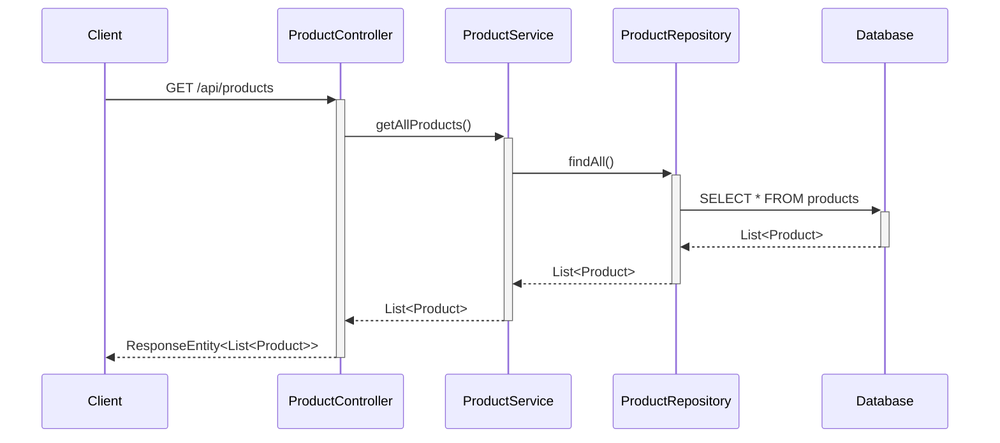
```mermaid
sequenceDiagram
    participant Client
    participant ProductController
    participant ProductService
    participant ProductRepository
    participant Database
    
    Client->>+ProductController: GET /api/products
    ProductController->>+ProductService: getAllProducts()
    ProductService->>+ProductRepository: findAll()
    ProductRepository->>+Database: SELECT * FROM products
    Database-->>-ProductRepository: List<Product>
    ProductRepository-->>-ProductService: List<Product>
    ProductService-->>-ProductController: List<Product>
    ProductController-->>-Client: ResponseEntity<List<Product>>
```

### 3.2 Get Product By ID

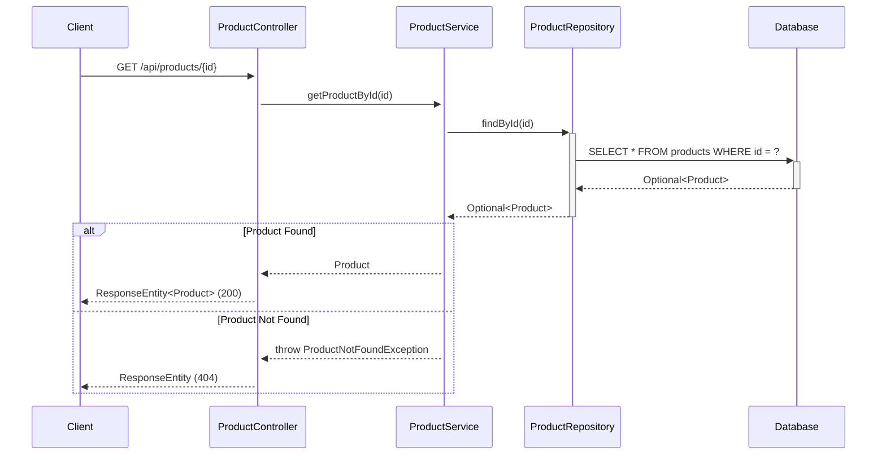
```mermaid
sequenceDiagram
    participant Client
    participant ProductController
    participant ProductService
    participant ProductRepository
    participant Database
    
    Client->>+ProductController: GET /api/products/{id}
    ProductController->>+ProductService: getProductById(id)
    ProductService->>+ProductRepository: findById(id)
    ProductRepository->>+Database: SELECT * FROM products WHERE id = ?
    Database-->>-ProductRepository: Optional<Product>
    ProductRepository-->>-ProductService: Optional<Product>
    
    alt Product Found
        ProductService-->>ProductController: Product
        ProductController-->>Client: ResponseEntity<Product> (200)
    else Product Not Found
        ProductService-->>ProductController: throw ProductNotFoundException
        ProductController-->>Client: ResponseEntity (404)
    end
```

### 3.3 Create Product

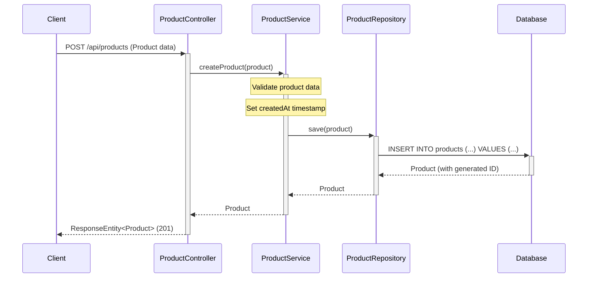
```mermaid
sequenceDiagram
    participant Client
    participant ProductController
    participant ProductService
    participant ProductRepository
    participant Database
    
    Client->>+ProductController: POST /api/products (Product data)
    ProductController->>+ProductService: createProduct(product)
    
    Note over ProductService: Validate product data
    Note over ProductService: Set createdAt timestamp
    
    ProductService->>+ProductRepository: save(product)
    ProductRepository->>+Database: INSERT INTO products (...) VALUES (...)
    Database-->>-ProductRepository: Product (with generated ID)
    ProductRepository-->>-ProductService: Product
    ProductService-->>-ProductController: Product
    ProductController-->>-Client: ResponseEntity<Product> (201)
```

### 3.4 Update Product

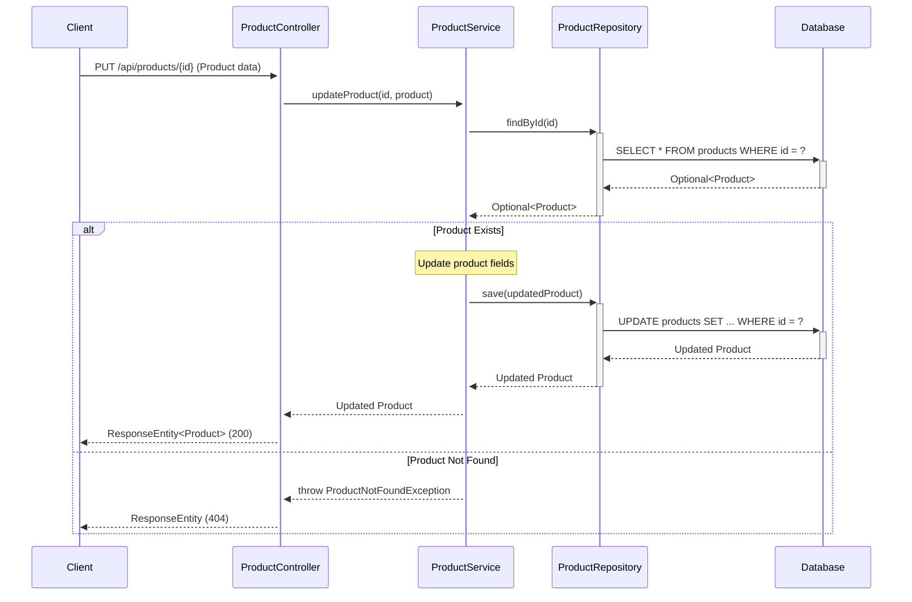
```mermaid
sequenceDiagram
    participant Client
    participant ProductController
    participant ProductService
    participant ProductRepository
    participant Database
    
    Client->>+ProductController: PUT /api/products/{id} (Product data)
    ProductController->>+ProductService: updateProduct(id, product)
    
    ProductService->>+ProductRepository: findById(id)
    ProductRepository->>+Database: SELECT * FROM products WHERE id = ?
    Database-->>-ProductRepository: Optional<Product>
    ProductRepository-->>-ProductService: Optional<Product>
    
    alt Product Exists
        Note over ProductService: Update product fields
        ProductService->>+ProductRepository: save(updatedProduct)
        ProductRepository->>+Database: UPDATE products SET ... WHERE id = ?
        Database-->>-ProductRepository: Updated Product
        ProductRepository-->>-ProductService: Updated Product
        ProductService-->>ProductController: Updated Product
        ProductController-->>Client: ResponseEntity<Product> (200)
    else Product Not Found
        ProductService-->>ProductController: throw ProductNotFoundException
        ProductController-->>Client: ResponseEntity (404)
    end
```

### 3.5 Delete Product

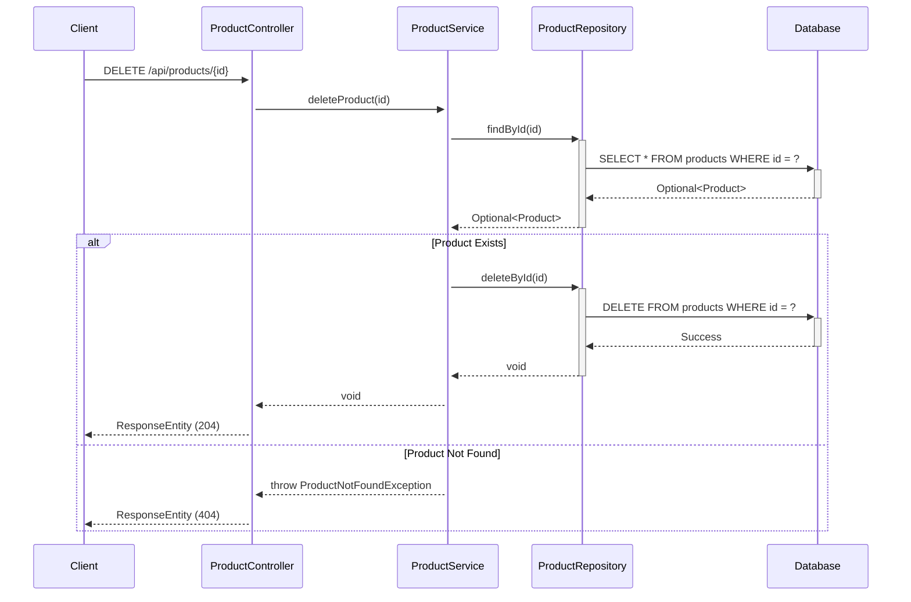
```mermaid
sequenceDiagram
    participant Client
    participant ProductController
    participant ProductService
    participant ProductRepository
    participant Database
    
    Client->>+ProductController: DELETE /api/products/{id}
    ProductController->>+ProductService: deleteProduct(id)
    
    ProductService->>+ProductRepository: findById(id)
    ProductRepository->>+Database: SELECT * FROM products WHERE id = ?
    Database-->>-ProductRepository: Optional<Product>
    ProductRepository-->>-ProductService: Optional<Product>
    
    alt Product Exists
        ProductService->>+ProductRepository: deleteById(id)
        ProductRepository->>+Database: DELETE FROM products WHERE id = ?
        Database-->>-ProductRepository: Success
        ProductRepository-->>-ProductService: void
        ProductService-->>ProductController: void
        ProductController-->>Client: ResponseEntity (204)
    else Product Not Found
        ProductService-->>ProductController: throw ProductNotFoundException
        ProductController-->>Client: ResponseEntity (404)
    end
```

### 3.6 Get Products By Category

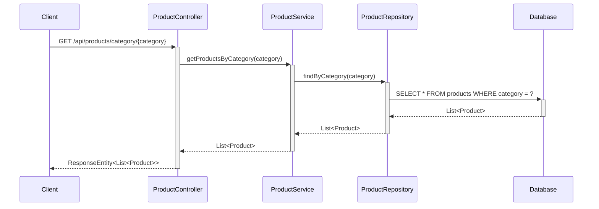
```mermaid
sequenceDiagram
    participant Client
    participant ProductController
    participant ProductService
    participant ProductRepository
    participant Database
    
    Client->>+ProductController: GET /api/products/category/{category}
    ProductController->>+ProductService: getProductsByCategory(category)
    ProductService->>+ProductRepository: findByCategory(category)
    ProductRepository->>+Database: SELECT * FROM products WHERE category = ?
    Database-->>-ProductRepository: List<Product>
    ProductRepository-->>-ProductService: List<Product>
    ProductService-->>-ProductController: List<Product>
    ProductController-->>-Client: ResponseEntity<List<Product>>
```

### 3.7 Search Products

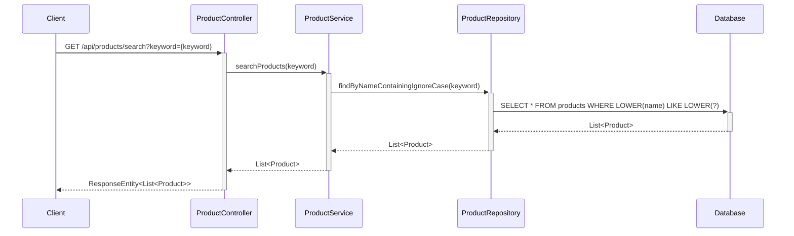
```mermaid
sequenceDiagram
    participant Client
    participant ProductController
    participant ProductService
    participant ProductRepository
    participant Database
    
    Client->>+ProductController: GET /api/products/search?keyword={keyword}
    ProductController->>+ProductService: searchProducts(keyword)
    ProductService->>+ProductRepository: findByNameContainingIgnoreCase(keyword)
    ProductRepository->>+Database: SELECT * FROM products WHERE LOWER(name) LIKE LOWER(?)
    Database-->>-ProductRepository: List<Product>
    ProductRepository-->>-ProductService: List<Product>
    ProductService-->>-ProductController: List<Product>
    ProductController-->>-Client: ResponseEntity<List<Product>>
```

### 3.8 Add Product to Cart

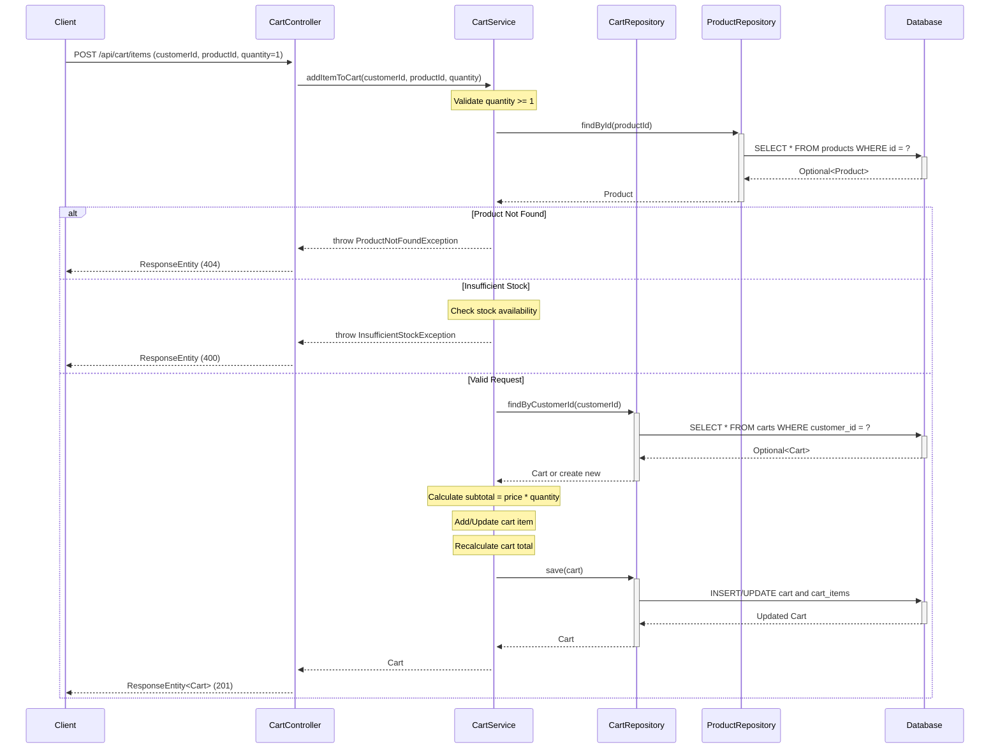
```mermaid
sequenceDiagram
    participant Client
    participant CartController
    participant CartService
    participant CartRepository
    participant ProductRepository
    participant Database
    
    Client->>+CartController: POST /api/cart/items (customerId, productId, quantity=1)
    CartController->>+CartService: addItemToCart(customerId, productId, quantity)
    
    Note over CartService: Validate quantity >= 1
    
    CartService->>+ProductRepository: findById(productId)
    ProductRepository->>+Database: SELECT * FROM products WHERE id = ?
    Database-->>-ProductRepository: Optional<Product>
    ProductRepository-->>-CartService: Product
    
    alt Product Not Found
        CartService-->>CartController: throw ProductNotFoundException
        CartController-->>Client: ResponseEntity (404)
    else Insufficient Stock
        Note over CartService: Check stock availability
        CartService-->>CartController: throw InsufficientStockException
        CartController-->>Client: ResponseEntity (400)
    else Valid Request
        CartService->>+CartRepository: findByCustomerId(customerId)
        CartRepository->>+Database: SELECT * FROM carts WHERE customer_id = ?
        Database-->>-CartRepository: Optional<Cart>
        CartRepository-->>-CartService: Cart or create new
        
        Note over CartService: Calculate subtotal = price * quantity
        Note over CartService: Add/Update cart item
        Note over CartService: Recalculate cart total
        
        CartService->>+CartRepository: save(cart)
        CartRepository->>+Database: INSERT/UPDATE cart and cart_items
        Database-->>-CartRepository: Updated Cart
        CartRepository-->>-CartService: Cart
        CartService-->>CartController: Cart
        CartController-->>Client: ResponseEntity<Cart> (201)
    end
```

### 3.9 View Shopping Cart

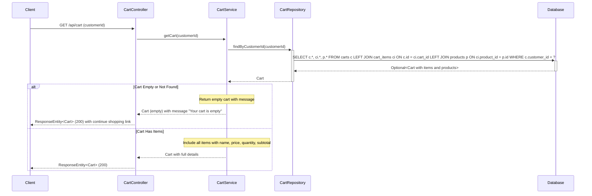
```mermaid
sequenceDiagram
    participant Client
    participant CartController
    participant CartService
    participant CartRepository
    participant Database
    
    Client->>+CartController: GET /api/cart (customerId)
    CartController->>+CartService: getCart(customerId)
    
    CartService->>+CartRepository: findByCustomerId(customerId)
    CartRepository->>+Database: SELECT c.*, ci.*, p.* FROM carts c LEFT JOIN cart_items ci ON c.id = ci.cart_id LEFT JOIN products p ON ci.product_id = p.id WHERE c.customer_id = ?
    Database-->>-CartRepository: Optional<Cart with items and products>
    CartRepository-->>-CartService: Cart
    
    alt Cart Empty or Not Found
        Note over CartService: Return empty cart with message
        CartService-->>CartController: Cart (empty) with message "Your cart is empty"
        CartController-->>Client: ResponseEntity<Cart> (200) with continue shopping link
    else Cart Has Items
        Note over CartService: Include all items with name, price, quantity, subtotal
        CartService-->>CartController: Cart with full details
        CartController-->>Client: ResponseEntity<Cart> (200)
    end
```

### 3.10 Update Cart Item Quantity

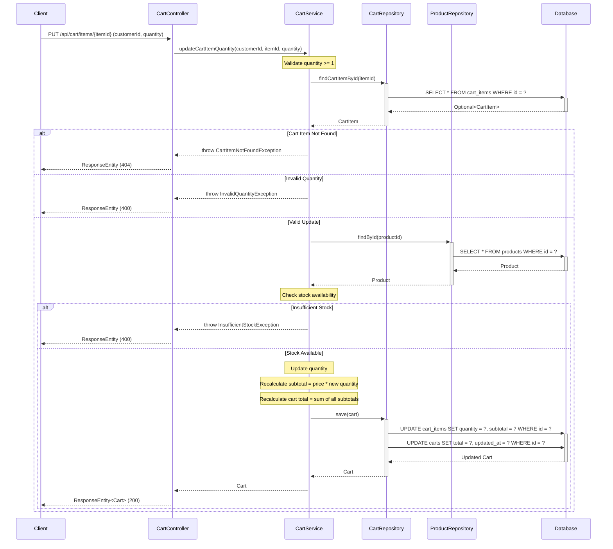
```mermaid
sequenceDiagram
    participant Client
    participant CartController
    participant CartService
    participant CartRepository
    participant ProductRepository
    participant Database
    
    Client->>+CartController: PUT /api/cart/items/{itemId} (customerId, quantity)
    CartController->>+CartService: updateCartItemQuantity(customerId, itemId, quantity)
    
    Note over CartService: Validate quantity >= 1
    
    CartService->>+CartRepository: findCartItemById(itemId)
    CartRepository->>+Database: SELECT * FROM cart_items WHERE id = ?
    Database-->>-CartRepository: Optional<CartItem>
    CartRepository-->>-CartService: CartItem
    
    alt Cart Item Not Found
        CartService-->>CartController: throw CartItemNotFoundException
        CartController-->>Client: ResponseEntity (404)
    else Invalid Quantity
        CartService-->>CartController: throw InvalidQuantityException
        CartController-->>Client: ResponseEntity (400)
    else Valid Update
        CartService->>+ProductRepository: findById(productId)
        ProductRepository->>+Database: SELECT * FROM products WHERE id = ?
        Database-->>-ProductRepository: Product
        ProductRepository-->>-CartService: Product
        
        Note over CartService: Check stock availability
        
        alt Insufficient Stock
            CartService-->>CartController: throw InsufficientStockException
            CartController-->>Client: ResponseEntity (400)
        else Stock Available
            Note over CartService: Update quantity
            Note over CartService: Recalculate subtotal = price * new quantity
            Note over CartService: Recalculate cart total = sum of all subtotals
            
            CartService->>+CartRepository: save(cart)
            CartRepository->>+Database: UPDATE cart_items SET quantity = ?, subtotal = ? WHERE id = ?
            CartRepository->>Database: UPDATE carts SET total = ?, updated_at = ? WHERE id = ?
            Database-->>-CartRepository: Updated Cart
            CartRepository-->>-CartService: Cart
            CartService-->>CartController: Cart
            CartController-->>Client: ResponseEntity<Cart> (200)
        end
    end
```

### 3.11 Remove Cart Item

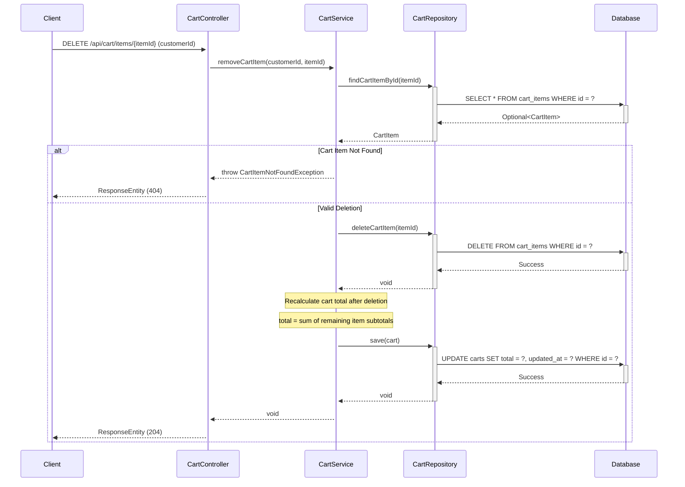
```mermaid
sequenceDiagram
    participant Client
    participant CartController
    participant CartService
    participant CartRepository
    participant Database
    
    Client->>+CartController: DELETE /api/cart/items/{itemId} (customerId)
    CartController->>+CartService: removeCartItem(customerId, itemId)
    
    CartService->>+CartRepository: findCartItemById(itemId)
    CartRepository->>+Database: SELECT * FROM cart_items WHERE id = ?
    Database-->>-CartRepository: Optional<CartItem>
    CartRepository-->>-CartService: CartItem
    
    alt Cart Item Not Found
        CartService-->>CartController: throw CartItemNotFoundException
        CartController-->>Client: ResponseEntity (404)
    else Valid Deletion
        CartService->>+CartRepository: deleteCartItem(itemId)
        CartRepository->>+Database: DELETE FROM cart_items WHERE id = ?
        Database-->>-CartRepository: Success
        CartRepository-->>-CartService: void
        
        Note over CartService: Recalculate cart total after deletion
        Note over CartService: total = sum of remaining item subtotals
        
        CartService->>+CartRepository: save(cart)
        CartRepository->>+Database: UPDATE carts SET total = ?, updated_at = ? WHERE id = ?
        Database-->>-CartRepository: Success
        CartRepository-->>-CartService: void
        
        CartService-->>CartController: void
        CartController-->>Client: ResponseEntity (204)
    end
```

## 4. API Endpoints Summary

### Product Management Endpoints

| Method | Endpoint | Description | Request Body | Response |
|--------|----------|-------------|--------------|----------|
| GET | `/api/products` | Get all products | None | List<Product> |
| GET | `/api/products/{id}` | Get product by ID | None | Product |
| POST | `/api/products` | Create new product | Product | Product |
| PUT | `/api/products/{id}` | Update existing product | Product | Product |
| DELETE | `/api/products/{id}` | Delete product | None | None |
| GET | `/api/products/category/{category}` | Get products by category | None | List<Product> |
| GET | `/api/products/search?keyword={keyword}` | Search products by name | None | List<Product> |

### Shopping Cart Endpoints

| Method | Endpoint | Description | Request Body | Response |
|--------|----------|-------------|--------------|----------|
| POST | `/api/cart/items` | Add product to cart with quantity 1 (default) | {"customerId": Long, "productId": Long, "quantity": Integer} | Cart |
| GET | `/api/cart` | Get cart with all items (name, price, quantity, subtotal) | Query param: customerId | Cart |
| PUT | `/api/cart/items/{itemId}` | Update cart item quantity with automatic recalculation | {"customerId": Long, "quantity": Integer} | Cart |
| DELETE | `/api/cart/items/{itemId}` | Remove item from cart with total update | Query param: customerId | None |

**Note:** GET /api/cart returns empty cart message "Your cart is empty" with continue shopping link when cart has no items.

## 5. Database Schema

### Products Table

```sql
CREATE TABLE products (
    id BIGINT PRIMARY KEY AUTO_INCREMENT,
    name VARCHAR(255) NOT NULL,
    description TEXT,
    price DECIMAL(10,2) NOT NULL,
    category VARCHAR(100) NOT NULL,
    stock_quantity INTEGER NOT NULL DEFAULT 0,
    created_at TIMESTAMP NOT NULL DEFAULT CURRENT_TIMESTAMP
);

CREATE INDEX idx_products_category ON products(category);
CREATE INDEX idx_products_name ON products(name);
```

### Carts Table

```sql
CREATE TABLE carts (
    id BIGINT PRIMARY KEY AUTO_INCREMENT,
    customer_id BIGINT NOT NULL UNIQUE,
    total DECIMAL(10,2) NOT NULL DEFAULT 0.00,
    created_at TIMESTAMP NOT NULL DEFAULT CURRENT_TIMESTAMP,
    updated_at TIMESTAMP NOT NULL DEFAULT CURRENT_TIMESTAMP ON UPDATE CURRENT_TIMESTAMP,
    status VARCHAR(20) NOT NULL DEFAULT 'ACTIVE',
    CONSTRAINT chk_total_positive CHECK (total >= 0)
);

CREATE INDEX idx_carts_customer_id ON carts(customer_id);
CREATE INDEX idx_carts_status ON carts(status);
```

### Cart Items Table

```sql
CREATE TABLE cart_items (
    id BIGINT PRIMARY KEY AUTO_INCREMENT,
    cart_id BIGINT NOT NULL,
    product_id BIGINT NOT NULL,
    quantity INTEGER NOT NULL DEFAULT 1,
    subtotal DECIMAL(10,2) NOT NULL,
    created_at TIMESTAMP NOT NULL DEFAULT CURRENT_TIMESTAMP,
    updated_at TIMESTAMP NOT NULL DEFAULT CURRENT_TIMESTAMP ON UPDATE CURRENT_TIMESTAMP,
    CONSTRAINT fk_cart_items_cart FOREIGN KEY (cart_id) REFERENCES carts(id) ON DELETE CASCADE,
    CONSTRAINT fk_cart_items_product FOREIGN KEY (product_id) REFERENCES products(id) ON DELETE CASCADE,
    CONSTRAINT chk_quantity_positive CHECK (quantity > 0),
    CONSTRAINT chk_subtotal_positive CHECK (subtotal >= 0),
    CONSTRAINT uk_cart_product UNIQUE (cart_id, product_id)
);

CREATE INDEX idx_cart_items_cart_id ON cart_items(cart_id);
CREATE INDEX idx_cart_items_product_id ON cart_items(product_id);
```

## 6. Technology Stack

- **Backend Framework:** Spring Boot 3.x
- **Language:** Java 21
- **Database:** PostgreSQL
- **ORM:** Spring Data JPA / Hibernate
- **Build Tool:** Maven/Gradle
- **API Documentation:** Swagger/OpenAPI 3

## 7. Design Patterns Used

1. **MVC Pattern:** Separation of Controller, Service, and Repository layers
2. **Repository Pattern:** Data access abstraction through ProductRepository
3. **Dependency Injection:** Spring's IoC container manages dependencies
4. **DTO Pattern:** Data Transfer Objects for API requests/responses
5. **Exception Handling:** Custom exceptions for business logic errors

## 8. Key Features

- RESTful API design following HTTP standards
- Proper HTTP status codes for different scenarios
- Input validation and error handling
- Database indexing for performance optimization
- Transactional operations for data consistency
- Pagination support for large datasets (can be extended)
- Search functionality with case-insensitive matching

## 9. Business Logic

### 9.1 Shopping Cart Calculation Rules

**Subtotal Calculation:**
```
subtotal = product.price × quantity
```

**Cart Total Calculation:**
```
total = Σ(subtotal of all cart items)
```

**Automatic Recalculation Triggers:**
- When item quantity is updated
- When new item is added to cart
- When item is removed from cart

**Calculation Flow:**
1. Retrieve product price from database
2. Multiply price by quantity to get item subtotal
3. Sum all item subtotals to get cart total
4. Update cart total in database
5. Return updated cart with all calculations
