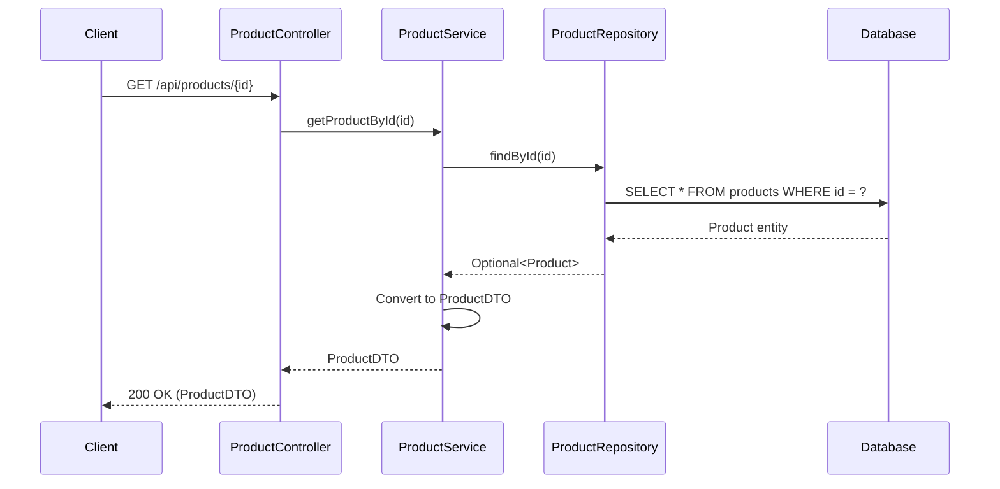
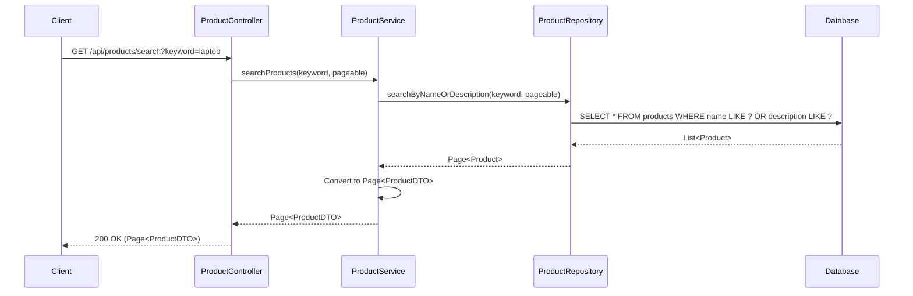
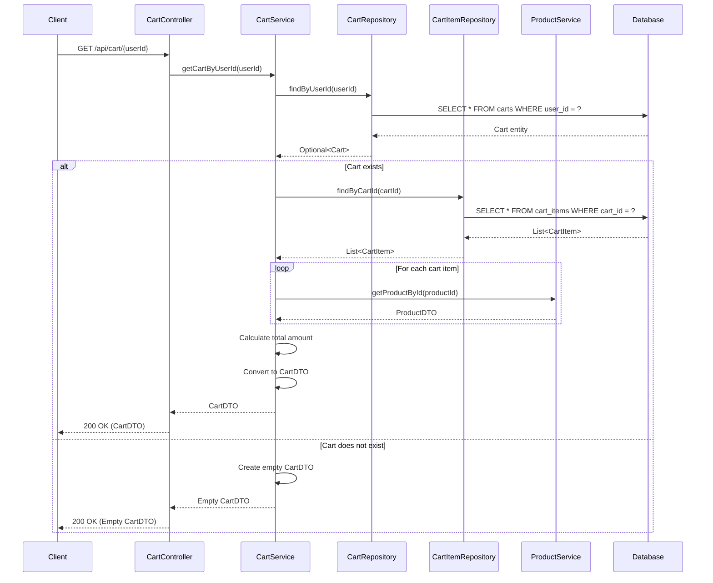
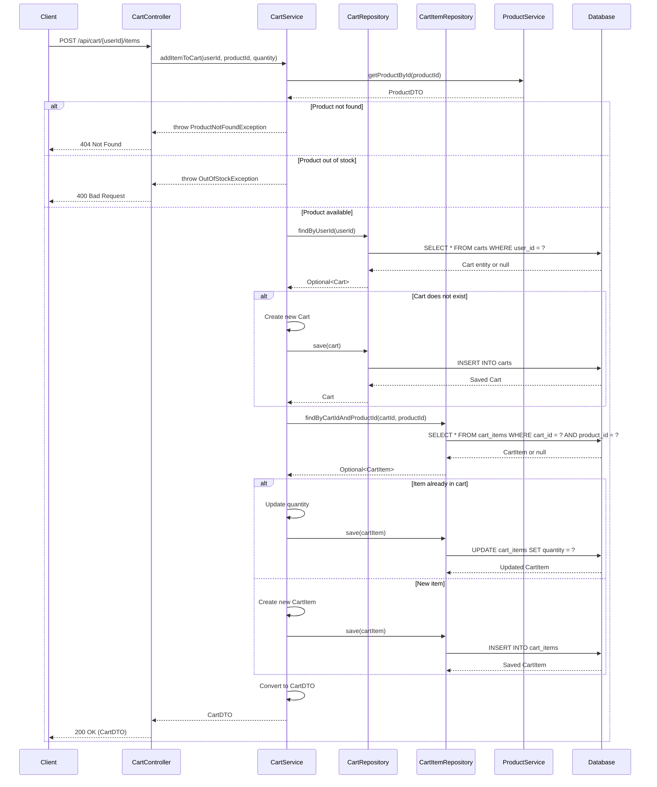
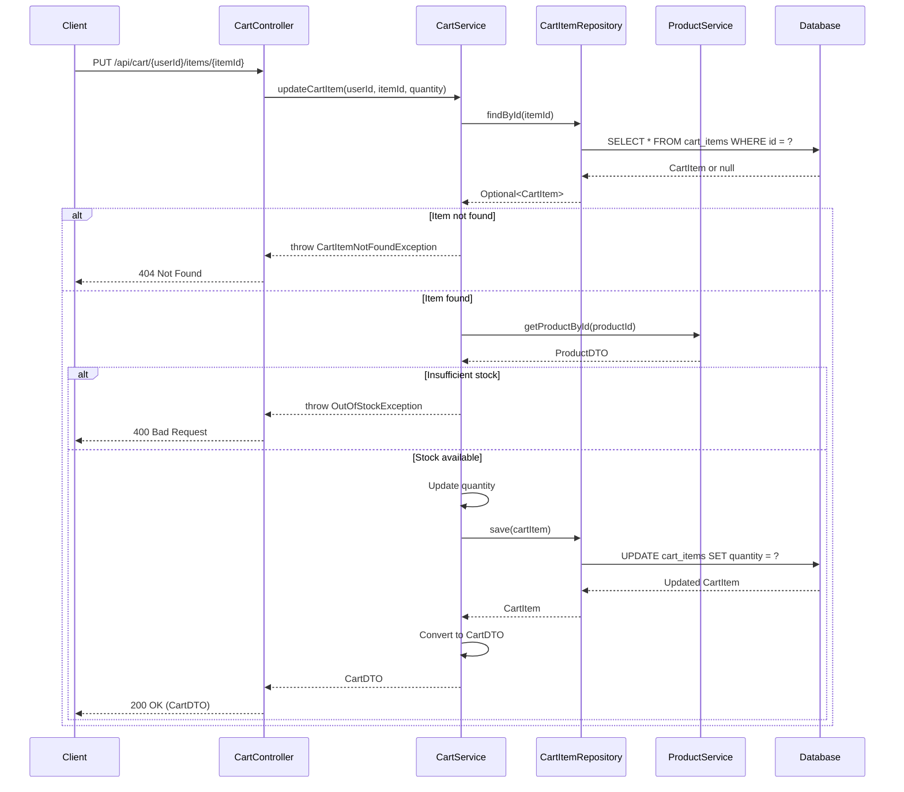
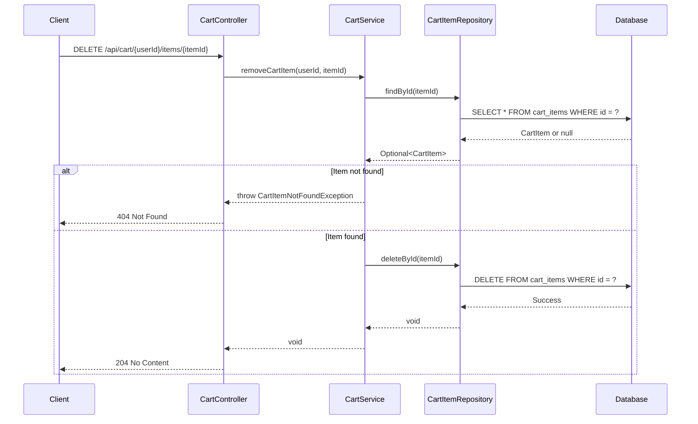
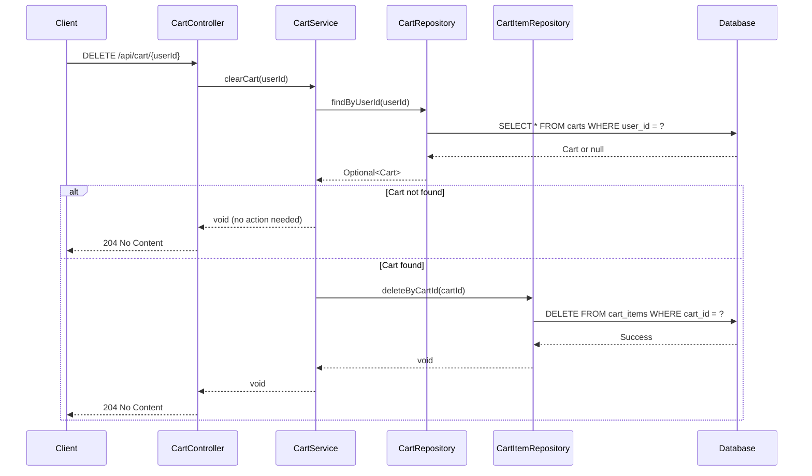
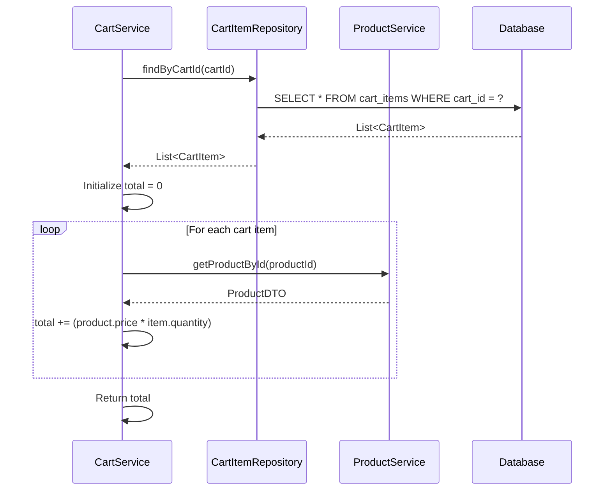
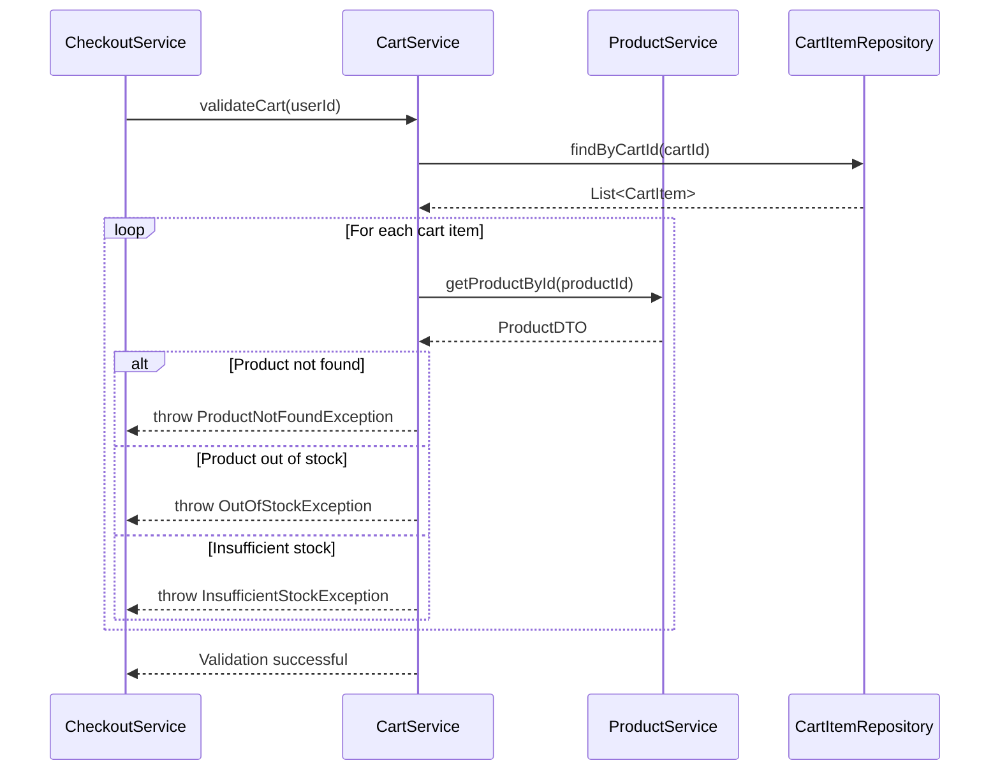

## 3. Sequence Diagrams

### 3.1 Get Product by ID


```mermaid
sequenceDiagram
    participant Client
    participant ProductController
    participant ProductService
    participant ProductRepository
    participant Database

    Client->>ProductController: GET /api/products/{id}
    ProductController->>ProductService: getProductById(id)
    ProductService->>ProductRepository: findById(id)
    ProductRepository->>Database: SELECT * FROM products WHERE id = ?
    Database-->>ProductRepository: Product entity
    ProductRepository-->>ProductService: Optional<Product>
    ProductService->>ProductService: Convert to ProductDTO
    ProductService-->>ProductController: ProductDTO
    ProductController-->>Client: 200 OK (ProductDTO)
```

### 3.2 Search Products


```mermaid
sequenceDiagram
    participant Client
    participant ProductController
    participant ProductService
    participant ProductRepository
    participant Database

    Client->>ProductController: GET /api/products/search?keyword=laptop
    ProductController->>ProductService: searchProducts(keyword, pageable)
    ProductService->>ProductRepository: searchByNameOrDescription(keyword, pageable)
    ProductRepository->>Database: SELECT * FROM products WHERE name LIKE ? OR description LIKE ?
    Database-->>ProductRepository: List<Product>
    ProductRepository-->>ProductService: Page<Product>
    ProductService->>ProductService: Convert to Page<ProductDTO>
    ProductService-->>ProductController: Page<ProductDTO>
    ProductController-->>Client: 200 OK (Page<ProductDTO>)
```

### 3.6 Get Shopping Cart


```mermaid
sequenceDiagram
    participant Client
    participant CartController
    participant CartService
    participant CartRepository
    participant CartItemRepository
    participant ProductService
    participant Database

    Client->>CartController: GET /api/cart/{userId}
    CartController->>CartService: getCartByUserId(userId)
    CartService->>CartRepository: findByUserId(userId)
    CartRepository->>Database: SELECT * FROM carts WHERE user_id = ?
    Database-->>CartRepository: Cart entity
    CartRepository-->>CartService: Optional<Cart>
    
    alt Cart exists
        CartService->>CartItemRepository: findByCartId(cartId)
        CartItemRepository->>Database: SELECT * FROM cart_items WHERE cart_id = ?
        Database-->>CartItemRepository: List<CartItem>
        CartItemRepository-->>CartService: List<CartItem>
        
        loop For each cart item
            CartService->>ProductService: getProductById(productId)
            ProductService-->>CartService: ProductDTO
        end
        
        CartService->>CartService: Calculate total amount
        CartService->>CartService: Convert to CartDTO
        CartService-->>CartController: CartDTO
        CartController-->>Client: 200 OK (CartDTO)
    else Cart does not exist
        CartService->>CartService: Create empty CartDTO
        CartService-->>CartController: Empty CartDTO
        CartController-->>Client: 200 OK (Empty CartDTO)
    end
```

### 3.7 Add Item to Cart


```mermaid
sequenceDiagram
    participant Client
    participant CartController
    participant CartService
    participant CartRepository
    participant CartItemRepository
    participant ProductService
    participant Database

    Client->>CartController: POST /api/cart/{userId}/items
    CartController->>CartService: addItemToCart(userId, productId, quantity)
    
    CartService->>ProductService: getProductById(productId)
    ProductService-->>CartService: ProductDTO
    
    alt Product not found
        CartService-->>CartController: throw ProductNotFoundException
        CartController-->>Client: 404 Not Found
    else Product out of stock
        CartService-->>CartController: throw OutOfStockException
        CartController-->>Client: 400 Bad Request
    else Product available
        CartService->>CartRepository: findByUserId(userId)
        CartRepository->>Database: SELECT * FROM carts WHERE user_id = ?
        Database-->>CartRepository: Cart entity or null
        CartRepository-->>CartService: Optional<Cart>
        
        alt Cart does not exist
            CartService->>CartService: Create new Cart
            CartService->>CartRepository: save(cart)
            CartRepository->>Database: INSERT INTO carts
            Database-->>CartRepository: Saved Cart
            CartRepository-->>CartService: Cart
        end
        
        CartService->>CartItemRepository: findByCartIdAndProductId(cartId, productId)
        CartItemRepository->>Database: SELECT * FROM cart_items WHERE cart_id = ? AND product_id = ?
        Database-->>CartItemRepository: CartItem or null
        CartItemRepository-->>CartService: Optional<CartItem>
        
        alt Item already in cart
            CartService->>CartService: Update quantity
            CartService->>CartItemRepository: save(cartItem)
            CartItemRepository->>Database: UPDATE cart_items SET quantity = ?
            Database-->>CartItemRepository: Updated CartItem
        else New item
            CartService->>CartService: Create new CartItem
            CartService->>CartItemRepository: save(cartItem)
            CartItemRepository->>Database: INSERT INTO cart_items
            Database-->>CartItemRepository: Saved CartItem
        end
        
        CartService->>CartService: Convert to CartDTO
        CartService-->>CartController: CartDTO
        CartController-->>Client: 200 OK (CartDTO)
    end
```

### 3.8 Update Cart Item


```mermaid
sequenceDiagram
    participant Client
    participant CartController
    participant CartService
    participant CartItemRepository
    participant ProductService
    participant Database

    Client->>CartController: PUT /api/cart/{userId}/items/{itemId}
    CartController->>CartService: updateCartItem(userId, itemId, quantity)
    
    CartService->>CartItemRepository: findById(itemId)
    CartItemRepository->>Database: SELECT * FROM cart_items WHERE id = ?
    Database-->>CartItemRepository: CartItem or null
    CartItemRepository-->>CartService: Optional<CartItem>
    
    alt Item not found
        CartService-->>CartController: throw CartItemNotFoundException
        CartController-->>Client: 404 Not Found
    else Item found
        CartService->>ProductService: getProductById(productId)
        ProductService-->>CartService: ProductDTO
        
        alt Insufficient stock
            CartService-->>CartController: throw OutOfStockException
            CartController-->>Client: 400 Bad Request
        else Stock available
            CartService->>CartService: Update quantity
            CartService->>CartItemRepository: save(cartItem)
            CartItemRepository->>Database: UPDATE cart_items SET quantity = ?
            Database-->>CartItemRepository: Updated CartItem
            CartItemRepository-->>CartService: CartItem
            
            CartService->>CartService: Convert to CartDTO
            CartService-->>CartController: CartDTO
            CartController-->>Client: 200 OK (CartDTO)
        end
    end
```

### 3.9 Remove Cart Item


```mermaid
sequenceDiagram
    participant Client
    participant CartController
    participant CartService
    participant CartItemRepository
    participant Database

    Client->>CartController: DELETE /api/cart/{userId}/items/{itemId}
    CartController->>CartService: removeCartItem(userId, itemId)
    
    CartService->>CartItemRepository: findById(itemId)
    CartItemRepository->>Database: SELECT * FROM cart_items WHERE id = ?
    Database-->>CartItemRepository: CartItem or null
    CartItemRepository-->>CartService: Optional<CartItem>
    
    alt Item not found
        CartService-->>CartController: throw CartItemNotFoundException
        CartController-->>Client: 404 Not Found
    else Item found
        CartService->>CartItemRepository: deleteById(itemId)
        CartItemRepository->>Database: DELETE FROM cart_items WHERE id = ?
        Database-->>CartItemRepository: Success
        CartItemRepository-->>CartService: void
        CartService-->>CartController: void
        CartController-->>Client: 204 No Content
    end
```

### 3.10 Clear Cart


```mermaid
sequenceDiagram
    participant Client
    participant CartController
    participant CartService
    participant CartRepository
    participant CartItemRepository
    participant Database

    Client->>CartController: DELETE /api/cart/{userId}
    CartController->>CartService: clearCart(userId)
    
    CartService->>CartRepository: findByUserId(userId)
    CartRepository->>Database: SELECT * FROM carts WHERE user_id = ?
    Database-->>CartRepository: Cart or null
    CartRepository-->>CartService: Optional<Cart>
    
    alt Cart not found
        CartService-->>CartController: void (no action needed)
        CartController-->>Client: 204 No Content
    else Cart found
        CartService->>CartItemRepository: deleteByCartId(cartId)
        CartItemRepository->>Database: DELETE FROM cart_items WHERE cart_id = ?
        Database-->>CartItemRepository: Success
        CartItemRepository-->>CartService: void
        CartService-->>CartController: void
        CartController-->>Client: 204 No Content
    end
```

### 3.11 Calculate Cart Total


```mermaid
sequenceDiagram
    participant CartService
    participant CartItemRepository
    participant ProductService
    participant Database

    CartService->>CartItemRepository: findByCartId(cartId)
    CartItemRepository->>Database: SELECT * FROM cart_items WHERE cart_id = ?
    Database-->>CartItemRepository: List<CartItem>
    CartItemRepository-->>CartService: List<CartItem>
    
    CartService->>CartService: Initialize total = 0
    
    loop For each cart item
        CartService->>ProductService: getProductById(productId)
        ProductService-->>CartService: ProductDTO
        CartService->>CartService: total += (product.price * item.quantity)
    end
    
    CartService->>CartService: Return total
```

### 3.12 Validate Cart Before Checkout


```mermaid
sequenceDiagram
    participant CheckoutService
    participant CartService
    participant ProductService
    participant CartItemRepository

    CheckoutService->>CartService: validateCart(userId)
    CartService->>CartItemRepository: findByCartId(cartId)
    CartItemRepository-->>CartService: List<CartItem>
    
    loop For each cart item
        CartService->>ProductService: getProductById(productId)
        ProductService-->>CartService: ProductDTO
        
        alt Product not found
            CartService-->>CheckoutService: throw ProductNotFoundException
        else Product out of stock
            CartService-->>CheckoutService: throw OutOfStockException
        else Insufficient stock
            CartService-->>CheckoutService: throw InsufficientStockException
        end
    end
    
    CartService-->>CheckoutService: Validation successful
```

---

## 4. API Endpoints Summary

### Product Catalog APIs (Read-Only)

| Method | Endpoint | Description | Request | Response |
|--------|----------|-------------|---------|----------|
| GET | /api/products/{id} | Get product by ID | Path: id | ProductDTO with currentStockAvailability, minimumOrderQuantity, subscriptionOptions, isAddableToCart |
| GET | /api/products | Get all products (paginated) | Query: page, size, sort | Page<ProductDTO> |
| GET | /api/products/search | Search products | Query: keyword, page, size | Page<ProductDTO> |

### Shopping Cart APIs (Full CRUD)

| Method | Endpoint | Description | Request | Response |
|--------|----------|-------------|---------|----------|
| GET | /api/cart/{userId} | Get user's cart | Path: userId | CartDTO |
| POST | /api/cart/{userId}/items | Add item to cart | Path: userId, Body: AddCartItemRequest | CartDTO |
| PUT | /api/cart/{userId}/items/{itemId} | Update cart item quantity | Path: userId, itemId, Body: UpdateCartItemRequest | CartDTO |
| DELETE | /api/cart/{userId}/items/{itemId} | Remove item from cart | Path: userId, itemId | 204 No Content |
| DELETE | /api/cart/{userId} | Clear entire cart | Path: userId | 204 No Content |

---

## 5. Database Schema

### Products Table
```sql
CREATE TABLE products (
    id BIGSERIAL PRIMARY KEY,
    name VARCHAR(255) NOT NULL,
    description TEXT,
    price DECIMAL(10, 2) NOT NULL,
    stock_quantity INTEGER NOT NULL DEFAULT 0,
    category VARCHAR(100),
    image_url VARCHAR(500),
    minimum_order_quantity INTEGER DEFAULT 1,
    is_subscription_eligible BOOLEAN DEFAULT false,
    subscription_price DECIMAL(10,2),
    created_at TIMESTAMP DEFAULT CURRENT_TIMESTAMP,
    updated_at TIMESTAMP DEFAULT CURRENT_TIMESTAMP
);

CREATE INDEX idx_products_category ON products(category);
CREATE INDEX idx_products_name ON products(name);
```

### Carts Table
```sql
CREATE TABLE carts (
    id BIGSERIAL PRIMARY KEY,
    user_id BIGINT NOT NULL UNIQUE,
    created_at TIMESTAMP DEFAULT CURRENT_TIMESTAMP,
    updated_at TIMESTAMP DEFAULT CURRENT_TIMESTAMP
);

CREATE INDEX idx_carts_user_id ON carts(user_id);
```

### Cart Items Table
```sql
CREATE TABLE cart_items (
    id BIGSERIAL PRIMARY KEY,
    cart_id BIGINT NOT NULL,
    product_id BIGINT NOT NULL,
    quantity INTEGER NOT NULL DEFAULT 1,
    price_at_add DECIMAL(10, 2) NOT NULL,
    added_at TIMESTAMP DEFAULT CURRENT_TIMESTAMP,
    FOREIGN KEY (cart_id) REFERENCES carts(id) ON DELETE CASCADE,
    FOREIGN KEY (product_id) REFERENCES products(id),
    UNIQUE(cart_id, product_id)
);

CREATE INDEX idx_cart_items_cart_id ON cart_items(cart_id);
CREATE INDEX idx_cart_items_product_id ON cart_items(product_id);
```

---

## 6. Data Transfer Objects (DTOs)

### ProductDTO
```java
public class ProductDTO {
    private Long id;
    private String name;
    private String description;
    private BigDecimal price;
    private Integer stockQuantity;
    private String category;
    private String imageUrl;
    private Integer minimumOrderQuantity;
    private Boolean isSubscriptionEligible;
    private BigDecimal subscriptionPrice;
    private Boolean currentStockAvailability;
    private SubscriptionOptions subscriptionOptions;
    private Boolean isAddableToCart;
    
    // Getters and setters
}
```

### CartDTO
```java
public class CartDTO {
    private Long id;
    private Long userId;
    private List<CartItemDTO> items;
    private BigDecimal totalAmount;
    private Integer totalItems;
    
    // Getters and setters
}
```

### CartItemDTO
```java
public class CartItemDTO {
    private Long id;
    private ProductDTO product;
    private Integer quantity;
    private BigDecimal subtotal;
    
    // Getters and setters
}
```

### AddCartItemRequest
```java
public class AddCartItemRequest {
    private Long productId;
    private Integer quantity;
    
    // Getters, setters, and validation annotations
}
```

### UpdateCartItemRequest
```java
public class UpdateCartItemRequest {
    private Integer quantity;
    
    // Getters, setters, and validation annotations
}
```

---
