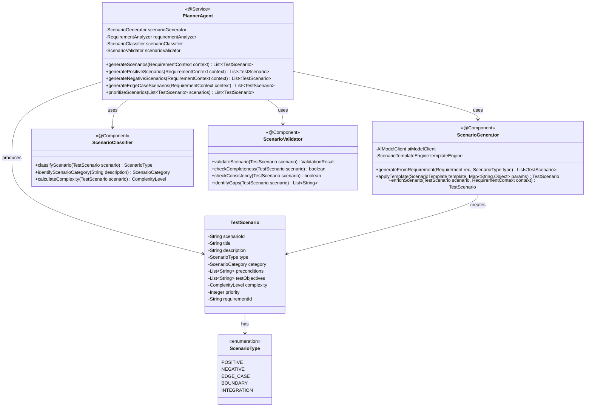
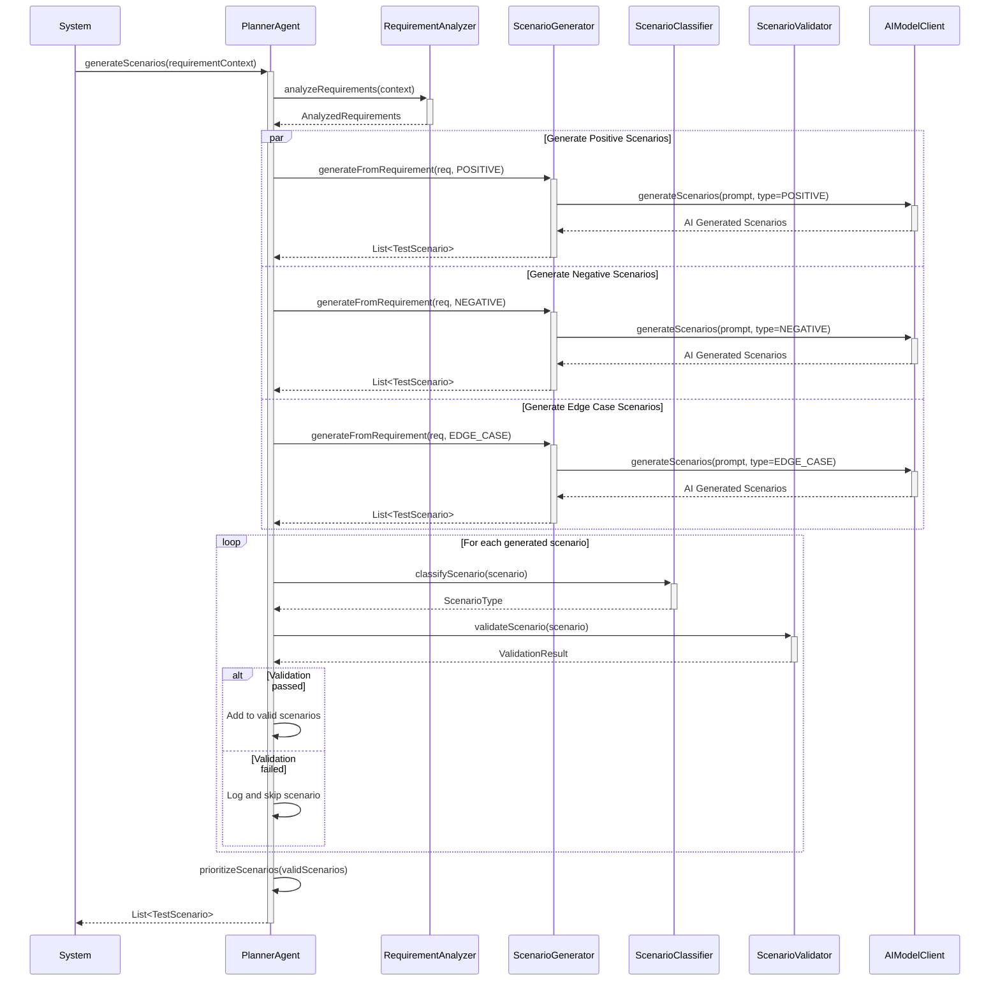
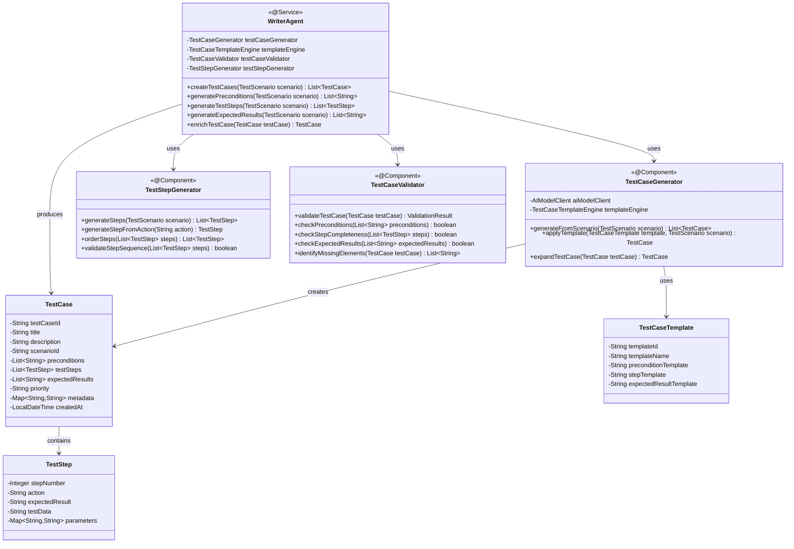
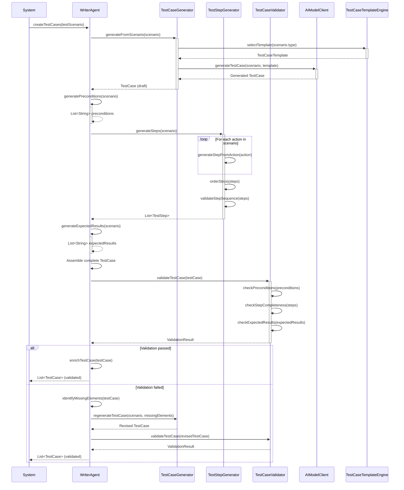
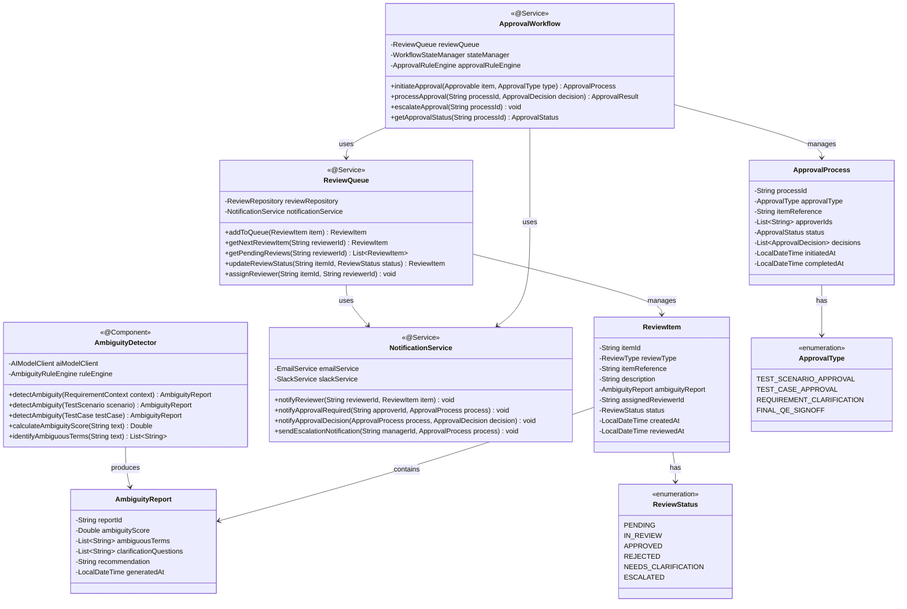
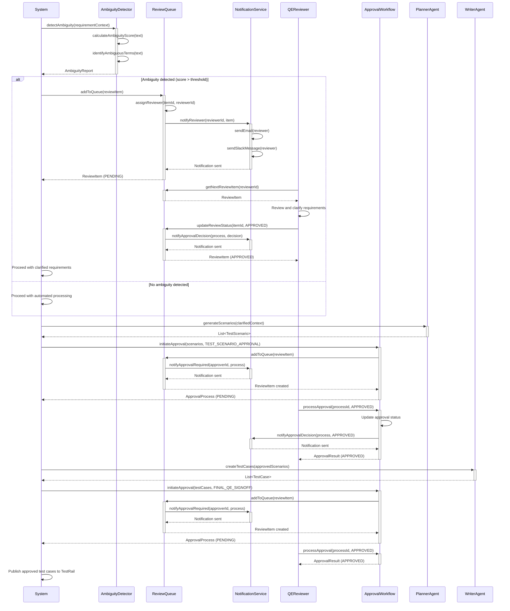
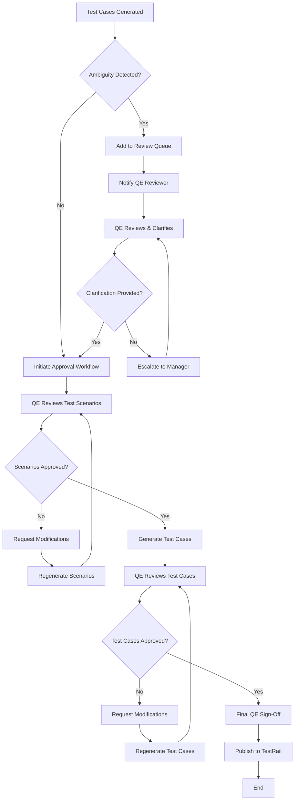

## 6. AI Agent Layer

### 6.1 Planner Agent - Test Scenario Generation

**Requirement Reference:** Epic SCRUM-338 - Scenario Generation

This section describes the Planner Agent responsible for generating positive, negative, and edge-case test scenarios.

#### 6.1.1 Planner Agent Architecture

```mermaid
classDiagram
    class PlannerAgent {
        <<@Service>>
        -ScenarioGenerator scenarioGenerator
        -RequirementAnalyzer requirementAnalyzer
        -ScenarioClassifier scenarioClassifier
        -ScenarioValidator scenarioValidator
        +generateScenarios(RequirementContext context) List~TestScenario~
        +generatePositiveScenarios(RequirementContext context) List~TestScenario~
        +generateNegativeScenarios(RequirementContext context) List~TestScenario~
        +generateEdgeCaseScenarios(RequirementContext context) List~TestScenario~
        +prioritizeScenarios(List~TestScenario~ scenarios) List~TestScenario~
    }
    
    class ScenarioGenerator {
        <<@Component>>
        -AIModelClient aiModelClient
        -ScenarioTemplateEngine templateEngine
        +generateFromRequirement(Requirement req, ScenarioType type) List~TestScenario~
        +applyTemplate(ScenarioTemplate template, Map~String,Object~ params) TestScenario
        +enrichScenario(TestScenario scenario, RequirementContext context) TestScenario
    }
    
    class ScenarioClassifier {
        <<@Component>>
        +classifyScenario(TestScenario scenario) ScenarioType
        +identifyScenarioCategory(String description) ScenarioCategory
        +calculateComplexity(TestScenario scenario) ComplexityLevel
    }
    
    class ScenarioValidator {
        <<@Component>>
        +validateScenario(TestScenario scenario) ValidationResult
        +checkCompleteness(TestScenario scenario) boolean
        +checkConsistency(TestScenario scenario) boolean
        +identifyGaps(TestScenario scenario) List~String~
    }
    
    class TestScenario {
        -String scenarioId
        -String title
        -String description
        -ScenarioType type
        -ScenarioCategory category
        -List~String~ preconditions
        -List~String~ testObjectives
        -ComplexityLevel complexity
        -Integer priority
        -String requirementId
    }
    
    class ScenarioType {
        <<enumeration>>
        POSITIVE
        NEGATIVE
        EDGE_CASE
        BOUNDARY
        INTEGRATION
    }
    
    PlannerAgent --> ScenarioGenerator : uses
    PlannerAgent --> ScenarioClassifier : uses
    PlannerAgent --> ScenarioValidator : uses
    PlannerAgent --> TestScenario : produces
    ScenarioGenerator --> TestScenario : creates
    TestScenario --> ScenarioType : has
```

#### 6.1.2 Scenario Generation Flow

```mermaid
sequenceDiagram
    participant System
    participant PlannerAgent
    participant RequirementAnalyzer
    participant ScenarioGenerator
    participant ScenarioClassifier
    participant ScenarioValidator
    participant AIModelClient
    
    System->>+PlannerAgent: generateScenarios(requirementContext)
    
    PlannerAgent->>+RequirementAnalyzer: analyzeRequirements(context)
    RequirementAnalyzer-->>-PlannerAgent: AnalyzedRequirements
    
    par Generate Positive Scenarios
        PlannerAgent->>+ScenarioGenerator: generateFromRequirement(req, POSITIVE)
        ScenarioGenerator->>+AIModelClient: generateScenarios(prompt, type=POSITIVE)
        AIModelClient-->>-ScenarioGenerator: AI Generated Scenarios
        ScenarioGenerator-->>-PlannerAgent: List<TestScenario>
    and Generate Negative Scenarios
        PlannerAgent->>+ScenarioGenerator: generateFromRequirement(req, NEGATIVE)
        ScenarioGenerator->>+AIModelClient: generateScenarios(prompt, type=NEGATIVE)
        AIModelClient-->>-ScenarioGenerator: AI Generated Scenarios
        ScenarioGenerator-->>-PlannerAgent: List<TestScenario>
    and Generate Edge Case Scenarios
        PlannerAgent->>+ScenarioGenerator: generateFromRequirement(req, EDGE_CASE)
        ScenarioGenerator->>+AIModelClient: generateScenarios(prompt, type=EDGE_CASE)
        AIModelClient-->>-ScenarioGenerator: AI Generated Scenarios
        ScenarioGenerator-->>-PlannerAgent: List<TestScenario>
    end
    
    loop For each generated scenario
        PlannerAgent->>+ScenarioClassifier: classifyScenario(scenario)
        ScenarioClassifier-->>-PlannerAgent: ScenarioType
        
        PlannerAgent->>+ScenarioValidator: validateScenario(scenario)
        ScenarioValidator-->>-PlannerAgent: ValidationResult
        
        alt Validation passed
            PlannerAgent->>PlannerAgent: Add to valid scenarios
        else Validation failed
            PlannerAgent->>PlannerAgent: Log and skip scenario
        end
    end
    
    PlannerAgent->>PlannerAgent: prioritizeScenarios(validScenarios)
    PlannerAgent-->>-System: List<TestScenario>
```

### 6.2 Writer Agent - Test Case Formulation

**Requirement Reference:** Epic SCRUM-338 - Test Case Formulation

This section describes the Writer Agent responsible for creating granular test cases with pre-conditions, steps, and expected results.

#### 6.2.1 Writer Agent Architecture

```mermaid
classDiagram
    class WriterAgent {
        <<@Service>>
        -TestCaseGenerator testCaseGenerator
        -TestCaseTemplateEngine templateEngine
        -TestCaseValidator testCaseValidator
        -TestStepGenerator testStepGenerator
        +createTestCases(TestScenario scenario) List~TestCase~
        +generatePreconditions(TestScenario scenario) List~String~
        +generateTestSteps(TestScenario scenario) List~TestStep~
        +generateExpectedResults(TestScenario scenario) List~String~
        +enrichTestCase(TestCase testCase) TestCase
    }
    
    class TestCaseGenerator {
        <<@Component>>
        -AIModelClient aiModelClient
        -TestCaseTemplateEngine templateEngine
        +generateFromScenario(TestScenario scenario) List~TestCase~
        +applyTemplate(TestCaseTemplate template, TestScenario scenario) TestCase
        +expandTestCase(TestCase testCase) TestCase
    }
    
    class TestStepGenerator {
        <<@Component>>
        +generateSteps(TestScenario scenario) List~TestStep~
        +generateStepFromAction(String action) TestStep
        +orderSteps(List~TestStep~ steps) List~TestStep~
        +validateStepSequence(List~TestStep~ steps) boolean
    }
    
    class TestCaseValidator {
        <<@Component>>
        +validateTestCase(TestCase testCase) ValidationResult
        +checkPreconditions(List~String~ preconditions) boolean
        +checkStepCompleteness(List~TestStep~ steps) boolean
        +checkExpectedResults(List~String~ expectedResults) boolean
        +identifyMissingElements(TestCase testCase) List~String~
    }
    
    class TestCase {
        -String testCaseId
        -String title
        -String description
        -String scenarioId
        -List~String~ preconditions
        -List~TestStep~ testSteps
        -List~String~ expectedResults
        -String priority
        -Map~String,String~ metadata
        -LocalDateTime createdAt
    }
    
    class TestStep {
        -Integer stepNumber
        -String action
        -String expectedResult
        -String testData
        -Map~String,String~ parameters
    }
    
    class TestCaseTemplate {
        -String templateId
        -String templateName
        -String preconditionTemplate
        -String stepTemplate
        -String expectedResultTemplate
    }
    
    WriterAgent --> TestCaseGenerator : uses
    WriterAgent --> TestStepGenerator : uses
    WriterAgent --> TestCaseValidator : uses
    WriterAgent --> TestCase : produces
    TestCaseGenerator --> TestCase : creates
    TestCase --> TestStep : contains
    TestCaseGenerator --> TestCaseTemplate : uses
```

#### 6.2.2 Test Case Generation Flow

```mermaid
sequenceDiagram
    participant System
    participant WriterAgent
    participant TestCaseGenerator
    participant TestStepGenerator
    participant TestCaseValidator
    participant AIModelClient
    participant TestCaseTemplateEngine
    
    System->>+WriterAgent: createTestCases(testScenario)
    
    WriterAgent->>+TestCaseGenerator: generateFromScenario(scenario)
    TestCaseGenerator->>+TestCaseTemplateEngine: selectTemplate(scenario.type)
    TestCaseTemplateEngine-->>-TestCaseGenerator: TestCaseTemplate
    
    TestCaseGenerator->>+AIModelClient: generateTestCase(scenario, template)
    AIModelClient-->>-TestCaseGenerator: Generated TestCase
    TestCaseGenerator-->>-WriterAgent: TestCase (draft)
    
    WriterAgent->>+WriterAgent: generatePreconditions(scenario)
    WriterAgent-->>-WriterAgent: List<String> preconditions
    
    WriterAgent->>+TestStepGenerator: generateSteps(scenario)
    loop For each action in scenario
        TestStepGenerator->>TestStepGenerator: generateStepFromAction(action)
    end
    TestStepGenerator->>TestStepGenerator: orderSteps(steps)
    TestStepGenerator->>TestStepGenerator: validateStepSequence(steps)
    TestStepGenerator-->>-WriterAgent: List<TestStep>
    
    WriterAgent->>+WriterAgent: generateExpectedResults(scenario)
    WriterAgent-->>-WriterAgent: List<String> expectedResults
    
    WriterAgent->>WriterAgent: Assemble complete TestCase
    
    WriterAgent->>+TestCaseValidator: validateTestCase(testCase)
    TestCaseValidator->>TestCaseValidator: checkPreconditions(preconditions)
    TestCaseValidator->>TestCaseValidator: checkStepCompleteness(steps)
    TestCaseValidator->>TestCaseValidator: checkExpectedResults(expectedResults)
    TestCaseValidator-->>-WriterAgent: ValidationResult
    
    alt Validation passed
        WriterAgent->>WriterAgent: enrichTestCase(testCase)
        WriterAgent-->>System: List<TestCase> (validated)
    else Validation failed
        WriterAgent->>WriterAgent: identifyMissingElements(testCase)
        WriterAgent->>TestCaseGenerator: regenerateTestCase(scenario, missingElements)
        TestCaseGenerator-->>WriterAgent: Revised TestCase
        WriterAgent->>TestCaseValidator: validateTestCase(revisedTestCase)
        TestCaseValidator-->>WriterAgent: ValidationResult
        WriterAgent-->>System: List<TestCase> (validated)
    end
```

## 7. Workflow Engine - Human-in-the-Loop

**Requirement Reference:** Epic SCRUM-338 - Human-in-the-Loop

This section describes the human-in-the-loop workflow for handling ambiguous requirements and QE sign-off processes.

### 7.1 Human Review Workflow Architecture

```mermaid
classDiagram
    class ReviewQueue {
        <<@Service>>
        -ReviewRepository reviewRepository
        -NotificationService notificationService
        +addToQueue(ReviewItem item) ReviewItem
        +getNextReviewItem(String reviewerId) ReviewItem
        +getPendingReviews(String reviewerId) List~ReviewItem~
        +updateReviewStatus(String itemId, ReviewStatus status) ReviewItem
        +assignReviewer(String itemId, String reviewerId) void
    }
    
    class AmbiguityDetector {
        <<@Component>>
        -AIModelClient aiModelClient
        -AmbiguityRuleEngine ruleEngine
        +detectAmbiguity(RequirementContext context) AmbiguityReport
        +detectAmbiguity(TestScenario scenario) AmbiguityReport
        +detectAmbiguity(TestCase testCase) AmbiguityReport
        +calculateAmbiguityScore(String text) Double
        +identifyAmbiguousTerms(String text) List~String~
    }
    
    class ApprovalWorkflow {
        <<@Service>>
        -ReviewQueue reviewQueue
        -WorkflowStateManager stateManager
        -ApprovalRuleEngine approvalRuleEngine
        +initiateApproval(Approvable item, ApprovalType type) ApprovalProcess
        +processApproval(String processId, ApprovalDecision decision) ApprovalResult
        +escalateApproval(String processId) void
        +getApprovalStatus(String processId) ApprovalStatus
    }
    
    class NotificationService {
        <<@Service>>
        -EmailService emailService
        -SlackService slackService
        +notifyReviewer(String reviewerId, ReviewItem item) void
        +notifyApprovalRequired(String approverId, ApprovalProcess process) void
        +notifyApprovalDecision(ApprovalProcess process, ApprovalDecision decision) void
        +sendEscalationNotification(String managerId, ApprovalProcess process) void
    }
    
    class ReviewItem {
        -String itemId
        -ReviewType reviewType
        -String itemReference
        -String description
        -AmbiguityReport ambiguityReport
        -String assignedReviewerId
        -ReviewStatus status
        -LocalDateTime createdAt
        -LocalDateTime reviewedAt
    }
    
    class AmbiguityReport {
        -String reportId
        -Double ambiguityScore
        -List~String~ ambiguousTerms
        -List~String~ clarificationQuestions
        -String recommendation
        -LocalDateTime generatedAt
    }
    
    class ApprovalProcess {
        -String processId
        -ApprovalType approvalType
        -String itemReference
        -List~String~ approverIds
        -ApprovalStatus status
        -List~ApprovalDecision~ decisions
        -LocalDateTime initiatedAt
        -LocalDateTime completedAt
    }
    
    class ReviewStatus {
        <<enumeration>>
        PENDING
        IN_REVIEW
        APPROVED
        REJECTED
        NEEDS_CLARIFICATION
        ESCALATED
    }
    
    class ApprovalType {
        <<enumeration>>
        TEST_SCENARIO_APPROVAL
        TEST_CASE_APPROVAL
        REQUIREMENT_CLARIFICATION
        FINAL_QE_SIGNOFF
    }
    
    ReviewQueue --> ReviewItem : manages
    ReviewQueue --> NotificationService : uses
    AmbiguityDetector --> AmbiguityReport : produces
    ApprovalWorkflow --> ReviewQueue : uses
    ApprovalWorkflow --> ApprovalProcess : manages
    ApprovalWorkflow --> NotificationService : uses
    ReviewItem --> AmbiguityReport : contains
    ReviewItem --> ReviewStatus : has
    ApprovalProcess --> ApprovalType : has
```

### 7.2 Human-in-the-Loop Workflow Sequence

```mermaid
sequenceDiagram
    participant System
    participant AmbiguityDetector
    participant ReviewQueue
    participant NotificationService
    participant QEReviewer
    participant ApprovalWorkflow
    participant PlannerAgent
    participant WriterAgent
    
    System->>+AmbiguityDetector: detectAmbiguity(requirementContext)
    AmbiguityDetector->>AmbiguityDetector: calculateAmbiguityScore(text)
    AmbiguityDetector->>AmbiguityDetector: identifyAmbiguousTerms(text)
    AmbiguityDetector-->>-System: AmbiguityReport
    
    alt Ambiguity detected (score > threshold)
        System->>+ReviewQueue: addToQueue(reviewItem)
        ReviewQueue->>ReviewQueue: assignReviewer(itemId, reviewerId)
        ReviewQueue->>+NotificationService: notifyReviewer(reviewerId, item)
        NotificationService->>NotificationService: sendEmail(reviewer)
        NotificationService->>NotificationService: sendSlackMessage(reviewer)
        NotificationService-->>-ReviewQueue: Notification sent
        ReviewQueue-->>-System: ReviewItem (PENDING)
        
        QEReviewer->>+ReviewQueue: getNextReviewItem(reviewerId)
        ReviewQueue-->>-QEReviewer: ReviewItem
        
        QEReviewer->>QEReviewer: Review and clarify requirements
        
        QEReviewer->>+ReviewQueue: updateReviewStatus(itemId, APPROVED)
        ReviewQueue->>+NotificationService: notifyApprovalDecision(process, decision)
        NotificationService-->>-ReviewQueue: Notification sent
        ReviewQueue-->>-QEReviewer: ReviewItem (APPROVED)
        
        System->>System: Proceed with clarified requirements
    else No ambiguity detected
        System->>System: Proceed with automated processing
    end
    
    System->>+PlannerAgent: generateScenarios(clarifiedContext)
    PlannerAgent-->>-System: List<TestScenario>
    
    System->>+ApprovalWorkflow: initiateApproval(scenarios, TEST_SCENARIO_APPROVAL)
    ApprovalWorkflow->>+ReviewQueue: addToQueue(reviewItem)
    ReviewQueue->>+NotificationService: notifyApprovalRequired(approverId, process)
    NotificationService-->>-ReviewQueue: Notification sent
    ReviewQueue-->>-ApprovalWorkflow: ReviewItem created
    ApprovalWorkflow-->>-System: ApprovalProcess (PENDING)
    
    QEReviewer->>+ApprovalWorkflow: processApproval(processId, APPROVED)
    ApprovalWorkflow->>ApprovalWorkflow: Update approval status
    ApprovalWorkflow->>+NotificationService: notifyApprovalDecision(process, APPROVED)
    NotificationService-->>-ApprovalWorkflow: Notification sent
    ApprovalWorkflow-->>-QEReviewer: ApprovalResult (APPROVED)
    
    System->>+WriterAgent: createTestCases(approvedScenarios)
    WriterAgent-->>-System: List<TestCase>
    
    System->>+ApprovalWorkflow: initiateApproval(testCases, FINAL_QE_SIGNOFF)
    ApprovalWorkflow->>+ReviewQueue: addToQueue(reviewItem)
    ReviewQueue->>+NotificationService: notifyApprovalRequired(approverId, process)
    NotificationService-->>-ReviewQueue: Notification sent
    ReviewQueue-->>-ApprovalWorkflow: ReviewItem created
    ApprovalWorkflow-->>-System: ApprovalProcess (PENDING)
    
    QEReviewer->>+ApprovalWorkflow: processApproval(processId, APPROVED)
    ApprovalWorkflow-->>-QEReviewer: ApprovalResult (APPROVED)
    
    System->>System: Publish approved test cases to TestRail
```

### 7.3 QE Sign-Off Process

```mermaid
flowchart TD
    A[Test Cases Generated] --> B{Ambiguity Detected?}
    B -->|Yes| C[Add to Review Queue]
    B -->|No| D[Initiate Approval Workflow]
    
    C --> E[Notify QE Reviewer]
    E --> F[QE Reviews & Clarifies]
    F --> G{Clarification Provided?}
    G -->|Yes| D
    G -->|No| H[Escalate to Manager]
    H --> F
    
    D --> I[QE Reviews Test Scenarios]
    I --> J{Scenarios Approved?}
    J -->|Yes| K[Generate Test Cases]
    J -->|No| L[Request Modifications]
    L --> M[Regenerate Scenarios]
    M --> I
    
    K --> N[QE Reviews Test Cases]
    N --> O{Test Cases Approved?}
    O -->|Yes| P[Final QE Sign-Off]
    O -->|No| Q[Request Modifications]
    Q --> R[Regenerate Test Cases]
    R --> N
    
    P --> S[Publish to TestRail]
    S --> T[End]
```