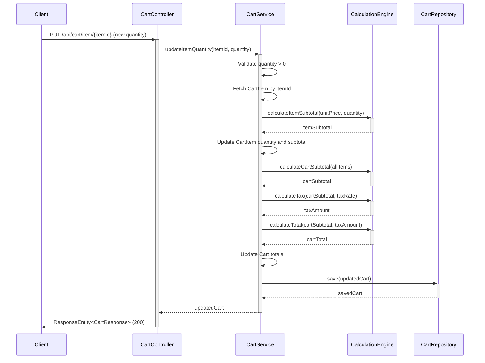

## 13. Shopping Cart API Specifications

**Requirement Reference:** Story Description - cart operations

### 13.1 Add to Cart API

**Endpoint:** `POST /api/cart/add`

**Request Body:**
```json
{
  "cartId": 123,
  "productId": 456,
  "quantity": 2
}
```

**Response (201 Created):**
```json
{
  "cartId": 123,
  "userId": 789,
  "items": [
    {
      "itemId": 1,
      "productId": 456,
      "productName": "Wireless Mouse",
      "unitPrice": 29.99,
      "quantity": 2,
      "subtotal": 59.98
    }
  ],
  "subtotal": 59.98,
  "tax": 5.40,
  "total": 65.38,
  "updatedAt": "2024-01-15T10:30:00Z"
}
```

**Error Responses:**
- 400 Bad Request: Invalid product ID or quantity
- 404 Not Found: Product not found
- 409 Conflict: Insufficient stock

### 13.2 Get Cart API

**Endpoint:** `GET /api/cart/{cartId}`

**Response (200 OK):**
```json
{
  "cartId": 123,
  "userId": 789,
  "items": [
    {
      "itemId": 1,
      "productId": 456,
      "productName": "Wireless Mouse",
      "unitPrice": 29.99,
      "quantity": 2,
      "subtotal": 59.98
    },
    {
      "itemId": 2,
      "productId": 457,
      "productName": "USB Keyboard",
      "unitPrice": 49.99,
      "quantity": 1,
      "subtotal": 49.99
    }
  ],
  "subtotal": 109.97,
  "tax": 9.90,
  "total": 119.87,
  "itemCount": 2,
  "isEmpty": false,
  "updatedAt": "2024-01-15T10:30:00Z"
}
```

**Empty Cart Response (200 OK):**
```json
{
  "cartId": 123,
  "userId": 789,
  "items": [],
  "subtotal": 0.00,
  "tax": 0.00,
  "total": 0.00,
  "itemCount": 0,
  "isEmpty": true,
  "message": "Your cart is empty"
}
```

### 13.3 Update Cart Item Quantity API

**Endpoint:** `PUT /api/cart/item/{itemId}`

**Request Body:**
```json
{
  "quantity": 5
}
```

**Response (200 OK):**
```json
{
  "cartId": 123,
  "userId": 789,
  "items": [
    {
      "itemId": 1,
      "productId": 456,
      "productName": "Wireless Mouse",
      "unitPrice": 29.99,
      "quantity": 5,
      "subtotal": 149.95
    }
  ],
  "subtotal": 149.95,
  "tax": 13.50,
  "total": 163.45,
  "updatedAt": "2024-01-15T10:35:00Z"
}
```

### 13.4 Remove Cart Item API

**Endpoint:** `DELETE /api/cart/item/{itemId}`

**Response (200 OK):**
```json
{
  "cartId": 123,
  "userId": 789,
  "items": [],
  "subtotal": 0.00,
  "tax": 0.00,
  "total": 0.00,
  "itemCount": 0,
  "isEmpty": true,
  "message": "Item removed successfully"
}
```

### 13.5 Get Cart Summary API

**Endpoint:** `GET /api/cart/{cartId}/summary`

**Response (200 OK):**
```json
{
  "cartId": 123,
  "itemCount": 3,
  "subtotal": 199.97,
  "tax": 18.00,
  "total": 217.97,
  "estimatedShipping": 5.99,
  "grandTotal": 223.96
}
```

## 14. Shopping Cart Business Logic

**Requirement Reference:** Story Description AC3 - automatic recalculation

### 14.1 Cart Calculation Engine

**Item Subtotal Calculation:**
```java
public BigDecimal calculateItemSubtotal(BigDecimal unitPrice, Integer quantity) {
    return unitPrice.multiply(new BigDecimal(quantity))
                   .setScale(2, RoundingMode.HALF_UP);
}
```

**Cart Subtotal Calculation:**
```java
public BigDecimal calculateCartSubtotal(List<CartItem> items) {
    return items.stream()
                .map(CartItem::getSubtotal)
                .reduce(BigDecimal.ZERO, BigDecimal::add)
                .setScale(2, RoundingMode.HALF_UP);
}
```

**Tax Calculation:**
```java
public BigDecimal calculateTax(BigDecimal subtotal, BigDecimal taxRate) {
    return subtotal.multiply(taxRate)
                   .setScale(2, RoundingMode.HALF_UP);
}
```

**Total Calculation:**
```java
public BigDecimal calculateTotal(BigDecimal subtotal, BigDecimal tax) {
    return subtotal.add(tax)
                   .setScale(2, RoundingMode.HALF_UP);
}
```

### 14.2 Inventory Validation Logic

**Stock Validation:**
```java
public ValidationResult validateStock(Long productId, Integer requestedQuantity) {
    Product product = productService.getProductById(productId);
    
    if (product == null) {
        return ValidationResult.failure("Product not found");
    }
    
    if (product.getStockQuantity() < requestedQuantity) {
        return ValidationResult.failure(
            String.format("Insufficient stock. Available: %d, Requested: %d",
                         product.getStockQuantity(), requestedQuantity)
        );
    }
    
    return ValidationResult.success();
}
```

**Availability Check:**
```java
public boolean checkAvailability(Long productId) {
    Product product = productService.getProductById(productId);
    return product != null && product.getStockQuantity() > 0;
}
```

### 14.3 Session Management for Cart Persistence

**Cart Session Strategy:**
- For authenticated users: Cart persisted to database with userId
- For guest users: Cart stored in session with sessionId
- Session timeout: 24 hours of inactivity
- Cart migration: Guest cart merged with user cart upon login

**Cart Retrieval Logic:**
```java
public Cart getOrCreateCart(Long userId, String sessionId) {
    if (userId != null) {
        return cartRepository.findByUserId(userId)
                            .orElseGet(() -> createNewCart(userId));
    } else {
        return cartRepository.findBySessionId(sessionId)
                            .orElseGet(() -> createNewCart(sessionId));
    }
}
```

### 14.4 Cart Calculation Sequence Diagram



## 15. Shopping Cart Database Design

**Requirement Reference:** Story Summary - cart state management

### 15.1 Carts Table Schema

```sql
CREATE TABLE carts (
    id BIGINT PRIMARY KEY AUTO_INCREMENT,
    user_id BIGINT NOT NULL,
    subtotal DECIMAL(10,2) NOT NULL DEFAULT 0.00,
    tax DECIMAL(10,2) NOT NULL DEFAULT 0.00,
    total DECIMAL(10,2) NOT NULL DEFAULT 0.00,
    created_at TIMESTAMP NOT NULL DEFAULT CURRENT_TIMESTAMP,
    updated_at TIMESTAMP NOT NULL DEFAULT CURRENT_TIMESTAMP ON UPDATE CURRENT_TIMESTAMP,
    CONSTRAINT fk_cart_user FOREIGN KEY (user_id) REFERENCES users(id) ON DELETE CASCADE
);

CREATE INDEX idx_carts_user_id ON carts(user_id);
CREATE INDEX idx_carts_updated_at ON carts(updated_at);
```

### 15.2 Cart Items Table Schema

```sql
CREATE TABLE cart_items (
    id BIGINT PRIMARY KEY AUTO_INCREMENT,
    cart_id BIGINT NOT NULL,
    product_id BIGINT NOT NULL,
    product_name VARCHAR(255) NOT NULL,
    unit_price DECIMAL(10,2) NOT NULL,
    quantity INTEGER NOT NULL DEFAULT 1,
    subtotal DECIMAL(10,2) NOT NULL,
    CONSTRAINT fk_cart_item_cart FOREIGN KEY (cart_id) REFERENCES carts(id) ON DELETE CASCADE,
    CONSTRAINT fk_cart_item_product FOREIGN KEY (product_id) REFERENCES products(id) ON DELETE CASCADE,
    CONSTRAINT chk_quantity_positive CHECK (quantity > 0)
);

CREATE INDEX idx_cart_items_cart_id ON cart_items(cart_id);
CREATE INDEX idx_cart_items_product_id ON cart_items(product_id);
CREATE UNIQUE INDEX idx_cart_items_cart_product ON cart_items(cart_id, product_id);
```

### 15.3 Database Constraints and Indexes

**Primary Keys:**
- `carts.id`: Auto-increment primary key
- `cart_items.id`: Auto-increment primary key

**Foreign Keys:**
- `cart_items.cart_id` → `carts.id` (CASCADE DELETE)
- `cart_items.product_id` → `products.id` (CASCADE DELETE)
- `carts.user_id` → `users.id` (CASCADE DELETE)

**Indexes:**
- `idx_carts_user_id`: Fast cart lookup by user
- `idx_carts_updated_at`: Cart cleanup and maintenance queries
- `idx_cart_items_cart_id`: Fast item retrieval for a cart
- `idx_cart_items_product_id`: Product-based queries
- `idx_cart_items_cart_product`: Unique constraint preventing duplicate products in same cart

**Check Constraints:**
- `chk_quantity_positive`: Ensures quantity is always greater than 0
