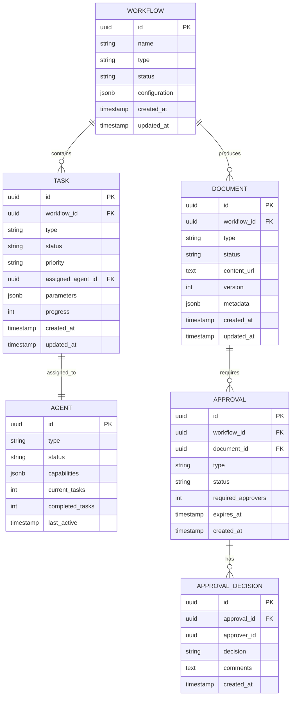
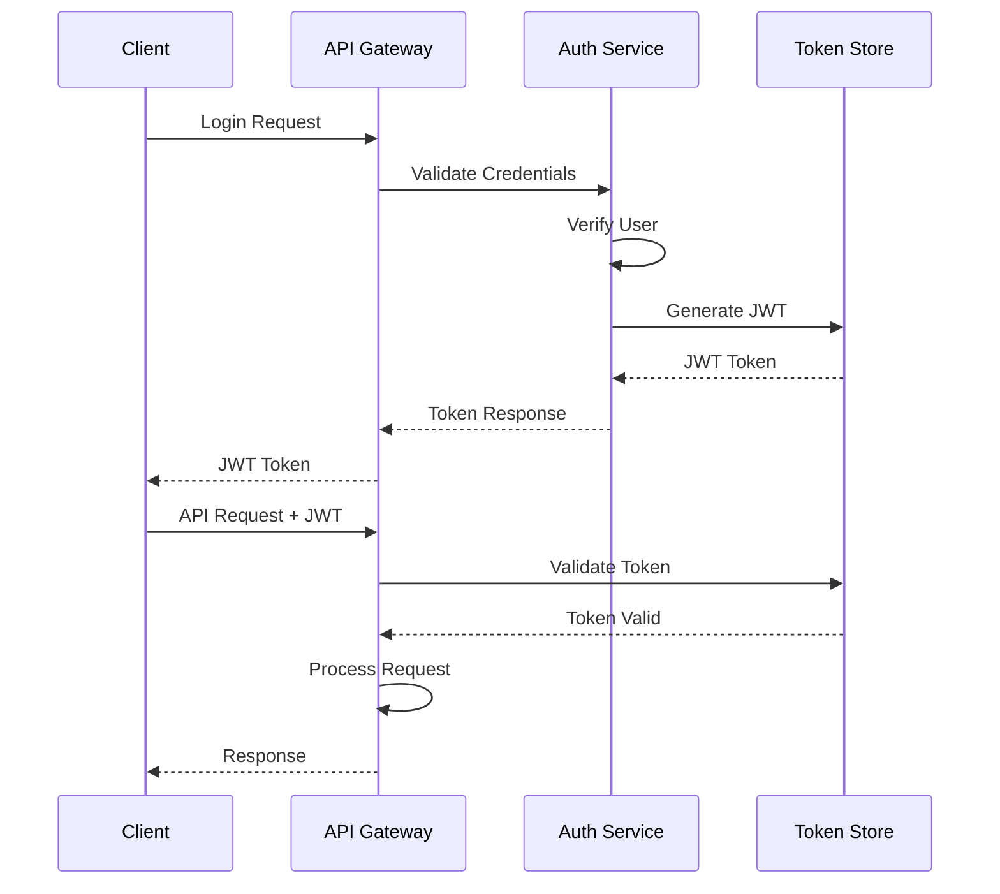

## 6. Database Design

### 6.1 Entity Relationship Diagram



### 6.2 Table Specifications

#### 6.2.1 workflows Table
```sql
CREATE TABLE workflows (
    id UUID PRIMARY KEY DEFAULT gen_random_uuid(),
    name VARCHAR(255) NOT NULL,
    type VARCHAR(50) NOT NULL,
    status VARCHAR(50) NOT NULL,
    configuration JSONB,
    created_at TIMESTAMP DEFAULT CURRENT_TIMESTAMP,
    updated_at TIMESTAMP DEFAULT CURRENT_TIMESTAMP,
    INDEX idx_status (status),
    INDEX idx_created_at (created_at)
);
```

#### 6.2.2 tasks Table
```sql
CREATE TABLE tasks (
    id UUID PRIMARY KEY DEFAULT gen_random_uuid(),
    workflow_id UUID NOT NULL REFERENCES workflows(id),
    type VARCHAR(50) NOT NULL,
    status VARCHAR(50) NOT NULL,
    priority VARCHAR(20) NOT NULL,
    assigned_agent_id UUID REFERENCES agents(id),
    parameters JSONB,
    progress INT DEFAULT 0,
    created_at TIMESTAMP DEFAULT CURRENT_TIMESTAMP,
    updated_at TIMESTAMP DEFAULT CURRENT_TIMESTAMP,
    INDEX idx_workflow_id (workflow_id),
    INDEX idx_status (status),
    INDEX idx_assigned_agent (assigned_agent_id)
);
```

#### 6.2.3 documents Table
```sql
CREATE TABLE documents (
    id UUID PRIMARY KEY DEFAULT gen_random_uuid(),
    workflow_id UUID NOT NULL REFERENCES workflows(id),
    type VARCHAR(50) NOT NULL,
    status VARCHAR(50) NOT NULL,
    content_url TEXT,
    version INT DEFAULT 1,
    metadata JSONB,
    created_at TIMESTAMP DEFAULT CURRENT_TIMESTAMP,
    updated_at TIMESTAMP DEFAULT CURRENT_TIMESTAMP,
    INDEX idx_workflow_id (workflow_id),
    INDEX idx_status (status)
);
```

#### 6.2.4 agents Table
```sql
CREATE TABLE agents (
    id UUID PRIMARY KEY DEFAULT gen_random_uuid(),
    type VARCHAR(50) NOT NULL,
    status VARCHAR(50) NOT NULL,
    capabilities JSONB,
    current_tasks INT DEFAULT 0,
    completed_tasks INT DEFAULT 0,
    last_active TIMESTAMP,
    INDEX idx_type (type),
    INDEX idx_status (status)
);
```

#### 6.2.5 approvals Table
```sql
CREATE TABLE approvals (
    id UUID PRIMARY KEY DEFAULT gen_random_uuid(),
    workflow_id UUID NOT NULL REFERENCES workflows(id),
    document_id UUID REFERENCES documents(id),
    type VARCHAR(50) NOT NULL,
    status VARCHAR(50) NOT NULL,
    required_approvers INT NOT NULL,
    expires_at TIMESTAMP,
    created_at TIMESTAMP DEFAULT CURRENT_TIMESTAMP,
    INDEX idx_workflow_id (workflow_id),
    INDEX idx_status (status),
    INDEX idx_expires_at (expires_at)
);
```

#### 6.2.6 approval_decisions Table
```sql
CREATE TABLE approval_decisions (
    id UUID PRIMARY KEY DEFAULT gen_random_uuid(),
    approval_id UUID NOT NULL REFERENCES approvals(id),
    approver_id UUID NOT NULL,
    decision VARCHAR(20) NOT NULL,
    comments TEXT,
    created_at TIMESTAMP DEFAULT CURRENT_TIMESTAMP,
    INDEX idx_approval_id (approval_id)
);
```

## 7. AI Framework Data Models

### 7.1 Core Domain Models

#### 7.1.1 Workflow Model
```python
from enum import Enum
from datetime import datetime
from typing import Optional, Dict, Any
from pydantic import BaseModel, Field

class WorkflowStatus(str, Enum):
    INITIALIZED = "INITIALIZED"
    PLANNING = "PLANNING"
    EXECUTING = "EXECUTING"
    REVIEWING = "REVIEWING"
    PENDING_APPROVAL = "PENDING_APPROVAL"
    COMPLETED = "COMPLETED"
    FAILED = "FAILED"

class WorkflowType(str, Enum):
    DOCUMENT_GENERATION = "document_generation"
    CODE_REVIEW = "code_review"
    TEST_AUTOMATION = "test_automation"

class Workflow(BaseModel):
    id: str = Field(default_factory=lambda: str(uuid.uuid4()))
    name: str
    type: WorkflowType
    status: WorkflowStatus = WorkflowStatus.INITIALIZED
    configuration: Dict[str, Any] = {}
    created_at: datetime = Field(default_factory=datetime.utcnow)
    updated_at: datetime = Field(default_factory=datetime.utcnow)
    
    class Config:
        use_enum_values = True
```

#### 7.1.2 Task Model
```python
class TaskStatus(str, Enum):
    PENDING = "PENDING"
    IN_PROGRESS = "IN_PROGRESS"
    COMPLETED = "COMPLETED"
    FAILED = "FAILED"

class TaskPriority(str, Enum):
    LOW = "LOW"
    MEDIUM = "MEDIUM"
    HIGH = "HIGH"
    CRITICAL = "CRITICAL"

class Task(BaseModel):
    id: str = Field(default_factory=lambda: str(uuid.uuid4()))
    workflow_id: str
    type: str
    status: TaskStatus = TaskStatus.PENDING
    priority: TaskPriority = TaskPriority.MEDIUM
    assigned_agent_id: Optional[str] = None
    parameters: Dict[str, Any] = {}
    progress: int = Field(default=0, ge=0, le=100)
    created_at: datetime = Field(default_factory=datetime.utcnow)
    updated_at: datetime = Field(default_factory=datetime.utcnow)
    
    class Config:
        use_enum_values = True
```

#### 7.1.3 Document Model
```python
class DocumentStatus(str, Enum):
    GENERATING = "GENERATING"
    GENERATED = "GENERATED"
    REVIEWING = "REVIEWING"
    APPROVED = "APPROVED"
    REJECTED = "REJECTED"

class DocumentType(str, Enum):
    LLD = "lld"
    HLD = "hld"
    TEST_PLAN = "test_plan"
    API_SPEC = "api_spec"

class Document(BaseModel):
    id: str = Field(default_factory=lambda: str(uuid.uuid4()))
    workflow_id: str
    type: DocumentType
    status: DocumentStatus = DocumentStatus.GENERATING
    content_url: Optional[str] = None
    version: int = 1
    metadata: Dict[str, Any] = {}
    created_at: datetime = Field(default_factory=datetime.utcnow)
    updated_at: datetime = Field(default_factory=datetime.utcnow)
    
    class Config:
        use_enum_values = True
```

#### 7.1.4 Agent Model
```python
class AgentStatus(str, Enum):
    ACTIVE = "ACTIVE"
    IDLE = "IDLE"
    BUSY = "BUSY"
    OFFLINE = "OFFLINE"

class AgentType(str, Enum):
    PLANNER = "planner"
    WRITER = "writer"
    REVIEWER = "reviewer"
    INTEGRATION = "integration"

class Agent(BaseModel):
    id: str = Field(default_factory=lambda: str(uuid.uuid4()))
    type: AgentType
    status: AgentStatus = AgentStatus.IDLE
    capabilities: list[str] = []
    current_tasks: int = 0
    completed_tasks: int = 0
    last_active: Optional[datetime] = None
    
    class Config:
        use_enum_values = True
```

#### 7.1.5 Approval Model
```python
class ApprovalStatus(str, Enum):
    PENDING = "PENDING"
    APPROVED = "APPROVED"
    REJECTED = "REJECTED"
    EXPIRED = "EXPIRED"

class ApprovalType(str, Enum):
    DOCUMENT_APPROVAL = "document_approval"
    WORKFLOW_APPROVAL = "workflow_approval"
    INTEGRATION_APPROVAL = "integration_approval"

class Approval(BaseModel):
    id: str = Field(default_factory=lambda: str(uuid.uuid4()))
    workflow_id: str
    document_id: Optional[str] = None
    type: ApprovalType
    status: ApprovalStatus = ApprovalStatus.PENDING
    required_approvers: int
    expires_at: Optional[datetime] = None
    created_at: datetime = Field(default_factory=datetime.utcnow)
    
    class Config:
        use_enum_values = True

class ApprovalDecision(BaseModel):
    id: str = Field(default_factory=lambda: str(uuid.uuid4()))
    approval_id: str
    approver_id: str
    decision: str  # "APPROVED" or "REJECTED"
    comments: Optional[str] = None
    created_at: datetime = Field(default_factory=datetime.utcnow)
```

### 7.2 Integration Models

#### 7.2.1 Jira Integration Models
```python
class JiraIssue(BaseModel):
    issue_id: str
    issue_key: str
    project_key: str
    issue_type: str
    summary: str
    description: Optional[str] = None
    status: str
    workflow_id: Optional[str] = None
    created_at: datetime
    updated_at: datetime

class JiraComment(BaseModel):
    comment_id: str
    issue_key: str
    author: str
    body: str
    created_at: datetime
```

#### 7.2.2 TestRail Integration Models
```python
class TestCase(BaseModel):
    case_id: str
    suite_id: str
    section_id: str
    title: str
    priority: str
    type: str
    custom_steps: Optional[str] = None
    workflow_id: Optional[str] = None
    created_at: datetime

class TestRun(BaseModel):
    run_id: str
    suite_id: str
    name: str
    description: Optional[str] = None
    workflow_id: Optional[str] = None
    created_at: datetime

class TestResult(BaseModel):
    result_id: str
    test_id: str
    run_id: str
    status: str  # "passed", "failed", "blocked", "retest"
    comment: Optional[str] = None
    created_at: datetime
```

### 7.3 Request/Response Models

#### 7.3.1 Workflow Request Models
```python
class CreateWorkflowRequest(BaseModel):
    name: str
    type: WorkflowType
    configuration: Dict[str, Any] = {}

class UpdateWorkflowRequest(BaseModel):
    status: Optional[WorkflowStatus] = None
    configuration: Optional[Dict[str, Any]] = None
```

#### 7.3.2 Document Request Models
```python
class CreateDocumentRequest(BaseModel):
    workflow_id: str
    type: DocumentType
    template: str
    data: Dict[str, Any] = {}

class UpdateDocumentRequest(BaseModel):
    changes: list[Dict[str, Any]]
    
class DocumentChange(BaseModel):
    section: str
    operation: str  # "ADD", "MODIFY", "DELETE"
    content: Optional[str] = None
```

#### 7.3.3 Task Request Models
```python
class CreateTaskRequest(BaseModel):
    workflow_id: str
    type: str
    priority: TaskPriority = TaskPriority.MEDIUM
    assigned_agent: Optional[str] = None
    parameters: Dict[str, Any] = {}
```

## 8. Security Design

### 8.1 Authentication Flow



### 8.2 Authorization Matrix

| Role | Workflow | Document | Task | Agent | Approval |
|------|----------|----------|------|-------|----------|
| Admin | CRUD | CRUD | CRUD | CRUD | CRUD |
| User | CRU | CRU | CR | R | CRU |
| Viewer | R | R | R | R | R |

### 8.3 Data Encryption
- **At Rest**: AES-256 encryption for database
- **In Transit**: TLS 1.3 for all API communications
- **Secrets**: AWS Secrets Manager for credentials

## 9. Performance Considerations

### 9.1 Caching Strategy
- Redis cache for frequently accessed workflows
- Document metadata caching (TTL: 1 hour)
- Agent status caching (TTL: 5 minutes)

### 9.2 Database Optimization
- Indexed columns: status, created_at, workflow_id
- Connection pooling: Max 50 connections
- Query timeout: 30 seconds

### 9.3 Scalability
- Horizontal scaling for API servers
- Agent worker pool auto-scaling
- Database read replicas for reporting
