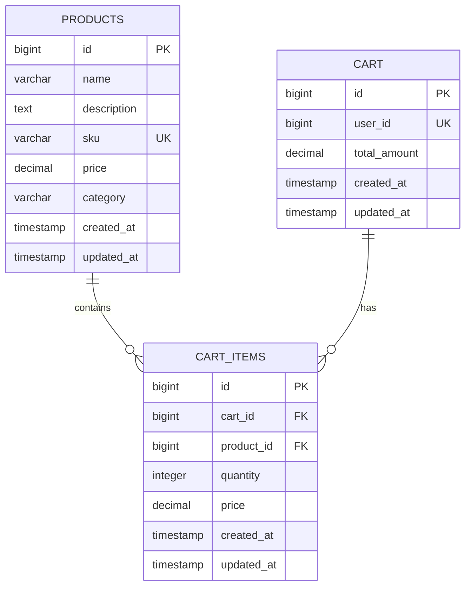
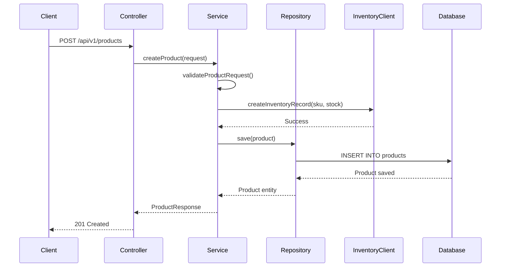
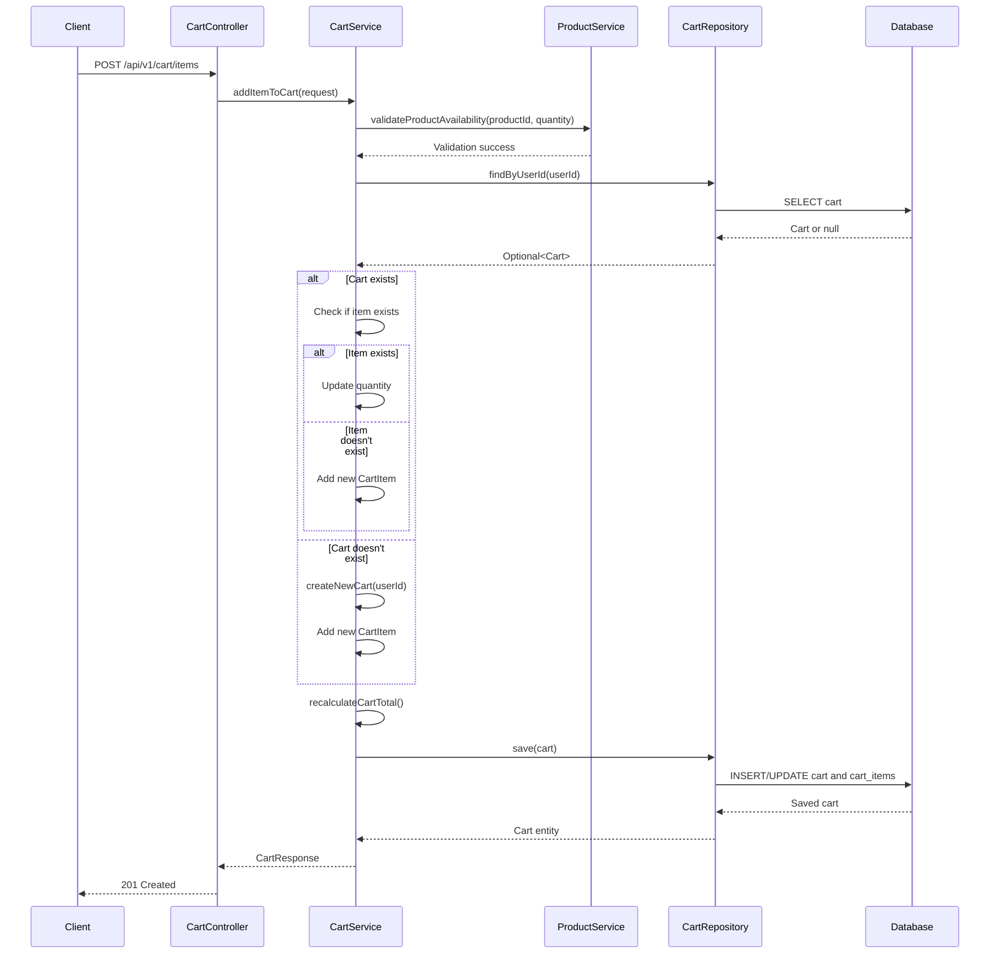
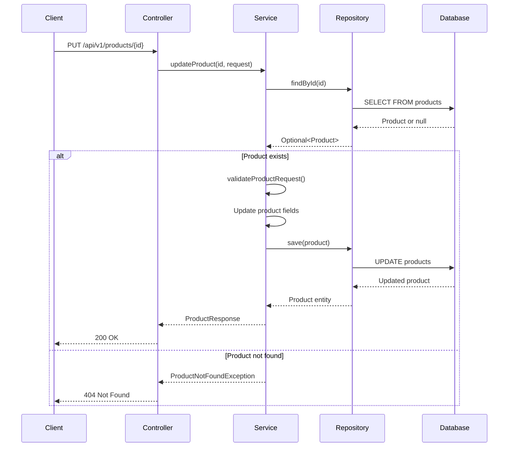
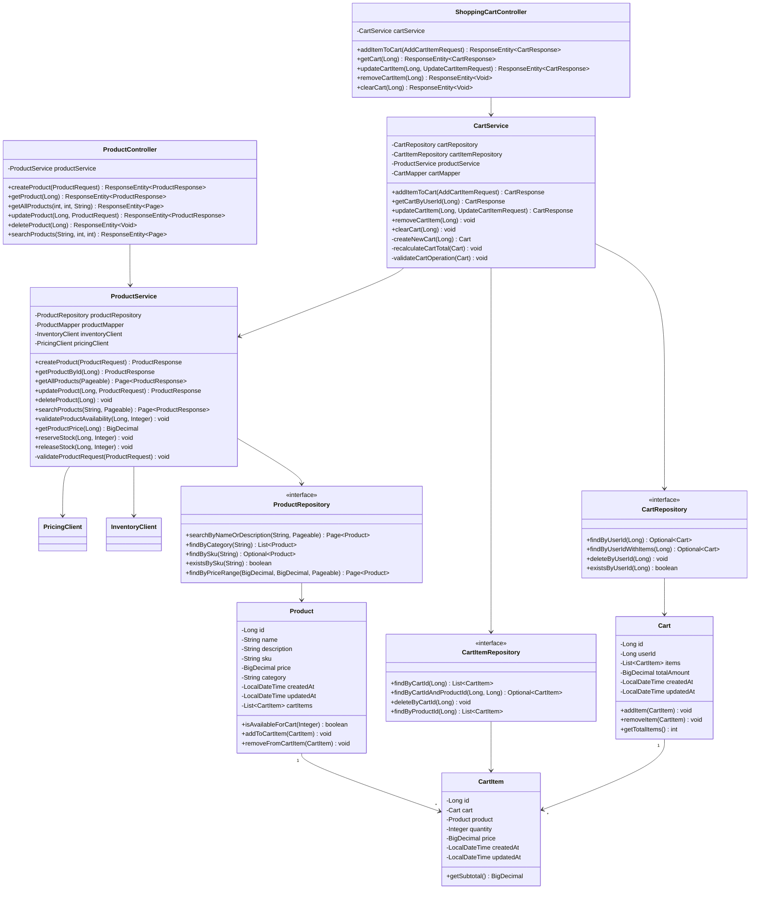

## 3. Database Design

### 3.1 Entity Relationship Diagram



### 3.2 Table Schemas

#### 3.2.1 products Table

```sql
CREATE TABLE products (
    id BIGSERIAL PRIMARY KEY,
    name VARCHAR(255) NOT NULL,
    description TEXT,
    sku VARCHAR(100) NOT NULL UNIQUE,
    price DECIMAL(10, 2) NOT NULL CHECK (price > 0),
    category VARCHAR(100),
    created_at TIMESTAMP NOT NULL DEFAULT CURRENT_TIMESTAMP,
    updated_at TIMESTAMP NOT NULL DEFAULT CURRENT_TIMESTAMP
);

CREATE INDEX idx_product_sku ON products(sku);
CREATE INDEX idx_product_category ON products(category);
```

#### 3.2.2 cart Table

```sql
CREATE TABLE cart (
    id BIGSERIAL PRIMARY KEY,
    user_id BIGINT NOT NULL UNIQUE,
    total_amount DECIMAL(12, 2) NOT NULL DEFAULT 0.00,
    created_at TIMESTAMP NOT NULL DEFAULT CURRENT_TIMESTAMP,
    updated_at TIMESTAMP NOT NULL DEFAULT CURRENT_TIMESTAMP
);

CREATE INDEX idx_cart_user ON cart(user_id);
```

#### 3.2.3 cart_items Table

```sql
CREATE TABLE cart_items (
    id BIGSERIAL PRIMARY KEY,
    cart_id BIGINT NOT NULL,
    product_id BIGINT NOT NULL,
    quantity INTEGER NOT NULL CHECK (quantity > 0),
    price DECIMAL(10, 2) NOT NULL CHECK (price >= 0),
    created_at TIMESTAMP NOT NULL DEFAULT CURRENT_TIMESTAMP,
    updated_at TIMESTAMP NOT NULL DEFAULT CURRENT_TIMESTAMP,
    FOREIGN KEY (cart_id) REFERENCES cart(id) ON DELETE CASCADE,
    FOREIGN KEY (product_id) REFERENCES products(id) ON DELETE CASCADE,
    UNIQUE (cart_id, product_id)
);

CREATE INDEX idx_cart_item_cart ON cart_items(cart_id);
CREATE INDEX idx_cart_item_product ON cart_items(product_id);
```

## 4. API Specifications

### 4.1 Product Endpoints

| Method | Endpoint | Description | Request Body | Response |
|--------|----------|-------------|--------------|----------|
| POST | `/api/v1/products` | Create a new product | ProductRequest | ProductResponse (201) |
| GET | `/api/v1/products/{id}` | Get product by ID | - | ProductResponse (200) |
| GET | `/api/v1/products` | Get all products (paginated) | - | Page<ProductResponse> (200) |
| PUT | `/api/v1/products/{id}` | Update product | ProductRequest | ProductResponse (200) |
| DELETE | `/api/v1/products/{id}` | Delete product | - | 204 No Content |
| GET | `/api/v1/products/search` | Search products | keyword (query param) | Page<ProductResponse> (200) |

### 4.2 Shopping Cart Endpoints

| Method | Endpoint | Description | Request Body | Response |
|--------|----------|-------------|--------------|----------|
| POST | `/api/v1/cart/items` | Add item to cart | AddCartItemRequest | CartResponse (201) |
| GET | `/api/v1/cart/{userId}` | Get user's cart | - | CartResponse (200) |
| PUT | `/api/v1/cart/items/{itemId}` | Update cart item quantity | UpdateCartItemRequest | CartResponse (200) |
| DELETE | `/api/v1/cart/items/{itemId}` | Remove item from cart | - | 204 No Content |
| DELETE | `/api/v1/cart/{userId}` | Clear entire cart | - | 204 No Content |

## 5. Sequence Diagrams

### 5.1 Create Product Flow



### 5.2 Add Item to Cart Flow



### 5.3 Update Product Flow



## 6. Class Diagram



## 7. Configuration

### 7.1 Application Properties

```yaml
spring:
  application:
    name: ecommerce-product-service
  
  datasource:
    url: jdbc:postgresql://localhost:5432/ecommerce_db
    username: ${DB_USERNAME:postgres}
    password: ${DB_PASSWORD:postgres}
    driver-class-name: org.postgresql.Driver
    hikari:
      maximum-pool-size: 10
      minimum-idle: 5
      connection-timeout: 30000
  
  jpa:
    hibernate:
      ddl-auto: validate
    show-sql: false
    properties:
      hibernate:
        dialect: org.hibernate.dialect.PostgreSQLDialect
        format_sql: true
        use_sql_comments: true
  
  flyway:
    enabled: true
    locations: classpath:db/migration
    baseline-on-migrate: true

server:
  port: 8080
  servlet:
    context-path: /

logging:
  level:
    root: INFO
    com.ecommerce: DEBUG
    org.hibernate.SQL: DEBUG
    org.hibernate.type.descriptor.sql.BasicBinder: TRACE

management:
  endpoints:
    web:
      exposure:
        include: health,info,metrics,prometheus
  endpoint:
    health:
      show-details: always

springdoc:
  api-docs:
    path: /api-docs
  swagger-ui:
    path: /swagger-ui.html
```

### 7.2 Maven Dependencies

```xml
<dependencies>
    <!-- Spring Boot Starters -->
    <dependency>
        <groupId>org.springframework.boot</groupId>
        <artifactId>spring-boot-starter-web</artifactId>
    </dependency>
    
    <dependency>
        <groupId>org.springframework.boot</groupId>
        <artifactId>spring-boot-starter-data-jpa</artifactId>
    </dependency>
    
    <dependency>
        <groupId>org.springframework.boot</groupId>
        <artifactId>spring-boot-starter-validation</artifactId>
    </dependency>
    
    <!-- Database -->
    <dependency>
        <groupId>org.postgresql</groupId>
        <artifactId>postgresql</artifactId>
        <scope>runtime</scope>
    </dependency>
    
    <dependency>
        <groupId>org.flywaydb</groupId>
        <artifactId>flyway-core</artifactId>
    </dependency>
    
    <!-- Lombok -->
    <dependency>
        <groupId>org.projectlombok</groupId>
        <artifactId>lombok</artifactId>
        <optional>true</optional>
    </dependency>
    
    <!-- OpenAPI Documentation -->
    <dependency>
        <groupId>org.springdoc</groupId>
        <artifactId>springdoc-openapi-starter-webmvc-ui</artifactId>
        <version>2.2.0</version>
    </dependency>
    
    <!-- Testing -->
    <dependency>
        <groupId>org.springframework.boot</groupId>
        <artifactId>spring-boot-starter-test</artifactId>
        <scope>test</scope>
    </dependency>
    
    <dependency>
        <groupId>org.testcontainers</groupId>
        <artifactId>postgresql</artifactId>
        <scope>test</scope>
    </dependency>
    
    <dependency>
        <groupId>org.testcontainers</groupId>
        <artifactId>junit-jupiter</artifactId>
        <scope>test</scope>
    </dependency>
</dependencies>
```
