## 3. Sequence Diagrams

### 3.1 Get All Products

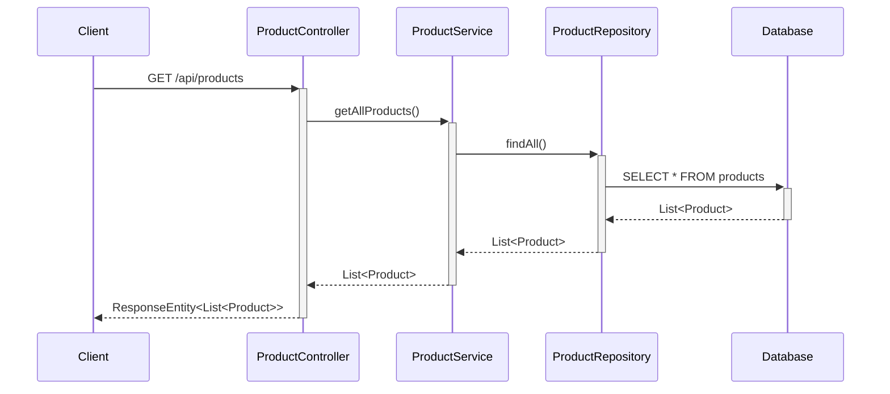
```mermaid
sequenceDiagram
    participant Client
    participant ProductController
    participant ProductService
    participant ProductRepository
    participant Database
    
    Client->>+ProductController: GET /api/products
    ProductController->>+ProductService: getAllProducts()
    ProductService->>+ProductRepository: findAll()
    ProductRepository->>+Database: SELECT * FROM products
    Database-->>-ProductRepository: List<Product>
    ProductRepository-->>-ProductService: List<Product>
    ProductService-->>-ProductController: List<Product>
    ProductController-->>-Client: ResponseEntity<List<Product>>
```

### 3.2 Get Product By ID

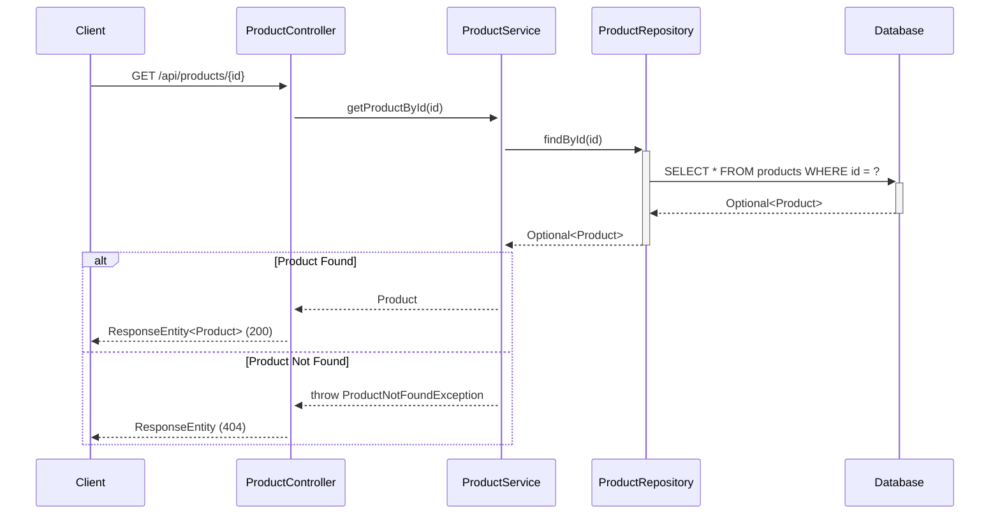
```mermaid
sequenceDiagram
    participant Client
    participant ProductController
    participant ProductService
    participant ProductRepository
    participant Database
    
    Client->>+ProductController: GET /api/products/{id}
    ProductController->>+ProductService: getProductById(id)
    ProductService->>+ProductRepository: findById(id)
    ProductRepository->>+Database: SELECT * FROM products WHERE id = ?
    Database-->>-ProductRepository: Optional<Product>
    ProductRepository-->>-ProductService: Optional<Product>
    
    alt Product Found
        ProductService-->>ProductController: Product
        ProductController-->>Client: ResponseEntity<Product> (200)
    else Product Not Found
        ProductService-->>ProductController: throw ProductNotFoundException
        ProductController-->>Client: ResponseEntity (404)
    end
```

### 3.3 Create Product

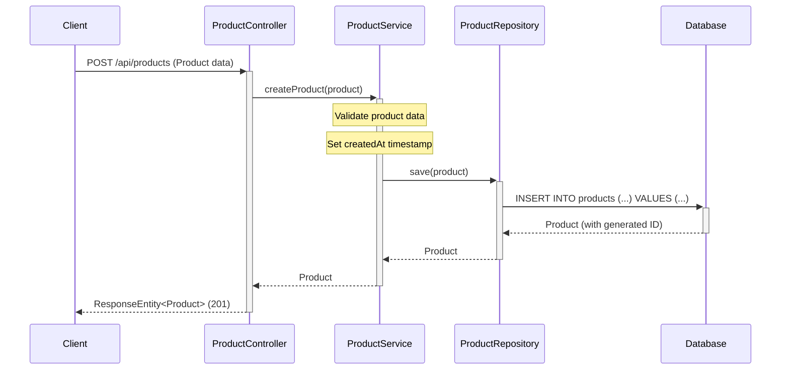
```mermaid
sequenceDiagram
    participant Client
    participant ProductController
    participant ProductService
    participant ProductRepository
    participant Database
    
    Client->>+ProductController: POST /api/products (Product data)
    ProductController->>+ProductService: createProduct(product)
    
    Note over ProductService: Validate product data
    Note over ProductService: Set createdAt timestamp
    
    ProductService->>+ProductRepository: save(product)
    ProductRepository->>+Database: INSERT INTO products (...) VALUES (...)
    Database-->>-ProductRepository: Product (with generated ID)
    ProductRepository-->>-ProductService: Product
    ProductService-->>-ProductController: Product
    ProductController-->>-Client: ResponseEntity<Product> (201)
```

### 3.4 Update Product

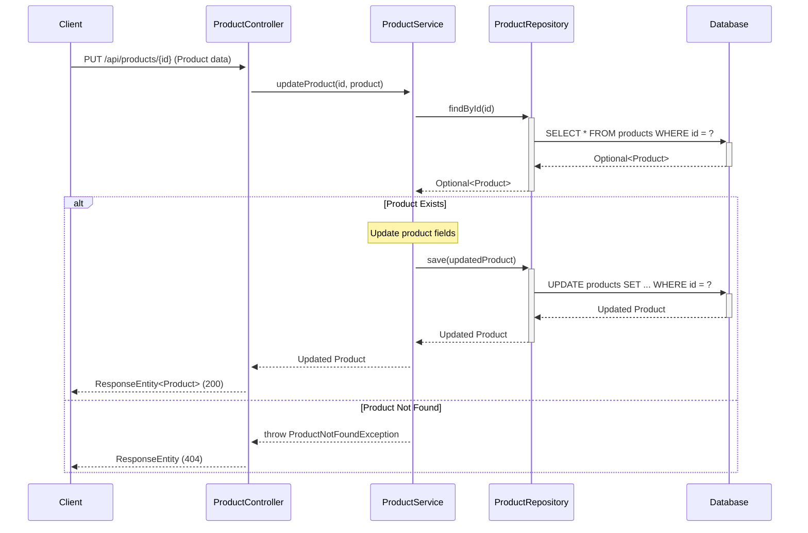
```mermaid
sequenceDiagram
    participant Client
    participant ProductController
    participant ProductService
    participant ProductRepository
    participant Database
    
    Client->>+ProductController: PUT /api/products/{id} (Product data)
    ProductController->>+ProductService: updateProduct(id, product)
    
    ProductService->>+ProductRepository: findById(id)
    ProductRepository->>+Database: SELECT * FROM products WHERE id = ?
    Database-->>-ProductRepository: Optional<Product>
    ProductRepository-->>-ProductService: Optional<Product>
    
    alt Product Exists
        Note over ProductService: Update product fields
        ProductService->>+ProductRepository: save(updatedProduct)
        ProductRepository->>+Database: UPDATE products SET ... WHERE id = ?
        Database-->>-ProductRepository: Updated Product
        ProductRepository-->>-ProductService: Updated Product
        ProductService-->>ProductController: Updated Product
        ProductController-->>Client: ResponseEntity<Product> (200)
    else Product Not Found
        ProductService-->>ProductController: throw ProductNotFoundException
        ProductController-->>Client: ResponseEntity (404)
    end
```

### 3.5 Delete Product

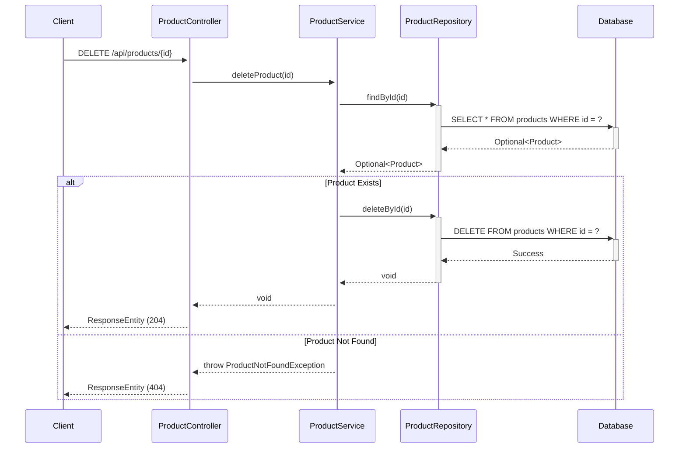
```mermaid
sequenceDiagram
    participant Client
    participant ProductController
    participant ProductService
    participant ProductRepository
    participant Database
    
    Client->>+ProductController: DELETE /api/products/{id}
    ProductController->>+ProductService: deleteProduct(id)
    
    ProductService->>+ProductRepository: findById(id)
    ProductRepository->>+Database: SELECT * FROM products WHERE id = ?
    Database-->>-ProductRepository: Optional<Product>
    ProductRepository-->>-ProductService: Optional<Product>
    
    alt Product Exists
        ProductService->>+ProductRepository: deleteById(id)
        ProductRepository->>+Database: DELETE FROM products WHERE id = ?
        Database-->>-ProductRepository: Success
        ProductRepository-->>-ProductService: void
        ProductService-->>ProductController: void
        ProductController-->>Client: ResponseEntity (204)
    else Product Not Found
        ProductService-->>ProductController: throw ProductNotFoundException
        ProductController-->>Client: ResponseEntity (404)
    end
```

### 3.6 Get Products By Category

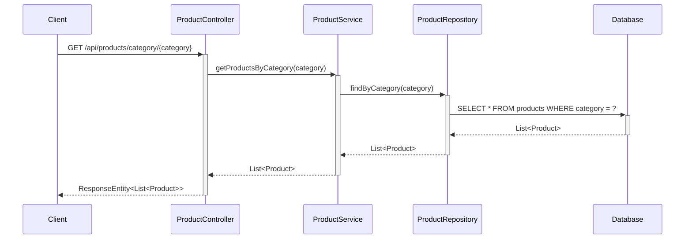
```mermaid
sequenceDiagram
    participant Client
    participant ProductController
    participant ProductService
    participant ProductRepository
    participant Database
    
    Client->>+ProductController: GET /api/products/category/{category}
    ProductController->>+ProductService: getProductsByCategory(category)
    ProductService->>+ProductRepository: findByCategory(category)
    ProductRepository->>+Database: SELECT * FROM products WHERE category = ?
    Database-->>-ProductRepository: List<Product>
    ProductRepository-->>-ProductService: List<Product>
    ProductService-->>-ProductController: List<Product>
    ProductController-->>-Client: ResponseEntity<List<Product>>
```

### 3.7 Search Products

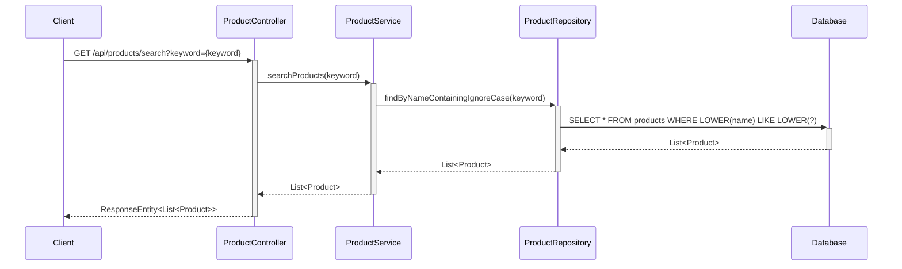
```mermaid
sequenceDiagram
    participant Client
    participant ProductController
    participant ProductService
    participant ProductRepository
    participant Database
    
    Client->>+ProductController: GET /api/products/search?keyword={keyword}
    ProductController->>+ProductService: searchProducts(keyword)
    ProductService->>+ProductRepository: findByNameContainingIgnoreCase(keyword)
    ProductRepository->>+Database: SELECT * FROM products WHERE LOWER(name) LIKE LOWER(?)
    Database-->>-ProductRepository: List<Product>
    ProductRepository-->>-ProductService: List<Product>
    ProductService-->>-ProductController: List<Product>
    ProductController-->>-Client: ResponseEntity<List<Product>>
```

### 3.8 Add Product to Cart

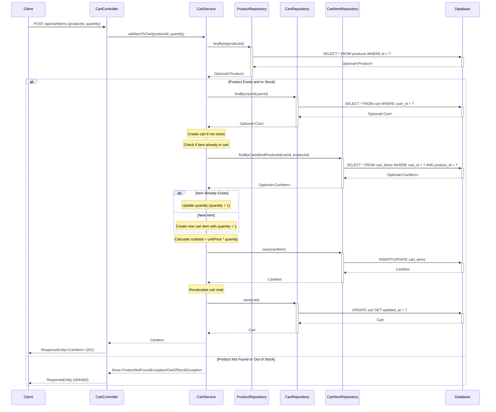
```mermaid
sequenceDiagram
    participant Client
    participant CartController
    participant CartService
    participant ProductRepository
    participant CartRepository
    participant CartItemRepository
    participant Database
    
    Client->>+CartController: POST /api/cart/items {productId, quantity}
    CartController->>+CartService: addItemToCart(productId, quantity)
    
    CartService->>+ProductRepository: findById(productId)
    ProductRepository->>+Database: SELECT * FROM products WHERE id = ?
    Database-->>-ProductRepository: Optional<Product>
    ProductRepository-->>-CartService: Optional<Product>
    
    alt Product Exists and In Stock
        CartService->>+CartRepository: findByUserId(userId)
        CartRepository->>+Database: SELECT * FROM cart WHERE user_id = ?
        Database-->>-CartRepository: Optional<Cart>
        CartRepository-->>-CartService: Optional<Cart>
        
        Note over CartService: Create cart if not exists
        Note over CartService: Check if item already in cart
        
        CartService->>+CartItemRepository: findByCartIdAndProductId(cartId, productId)
        CartItemRepository->>+Database: SELECT * FROM cart_items WHERE cart_id = ? AND product_id = ?
        Database-->>-CartItemRepository: Optional<CartItem>
        CartItemRepository-->>-CartService: Optional<CartItem>
        
        alt Item Already Exists
            Note over CartService: Update quantity (quantity + 1)
        else New Item
            Note over CartService: Create new cart item with quantity = 1
        end
        
        Note over CartService: Calculate subtotal = unitPrice * quantity
        
        CartService->>+CartItemRepository: save(cartItem)
        CartItemRepository->>+Database: INSERT/UPDATE cart_items
        Database-->>-CartItemRepository: CartItem
        CartItemRepository-->>-CartService: CartItem
        
        Note over CartService: Recalculate cart total
        
        CartService->>+CartRepository: save(cart)
        CartRepository->>+Database: UPDATE cart SET updated_at = ?
        Database-->>-CartRepository: Cart
        CartRepository-->>-CartService: Cart
        
        CartService-->>CartController: CartItem
        CartController-->>Client: ResponseEntity<CartItem> (201)
    else Product Not Found or Out of Stock
        CartService-->>CartController: throw ProductNotFoundException/OutOfStockException
        CartController-->>Client: ResponseEntity (404/400)
    end
```

### 3.9 View Cart

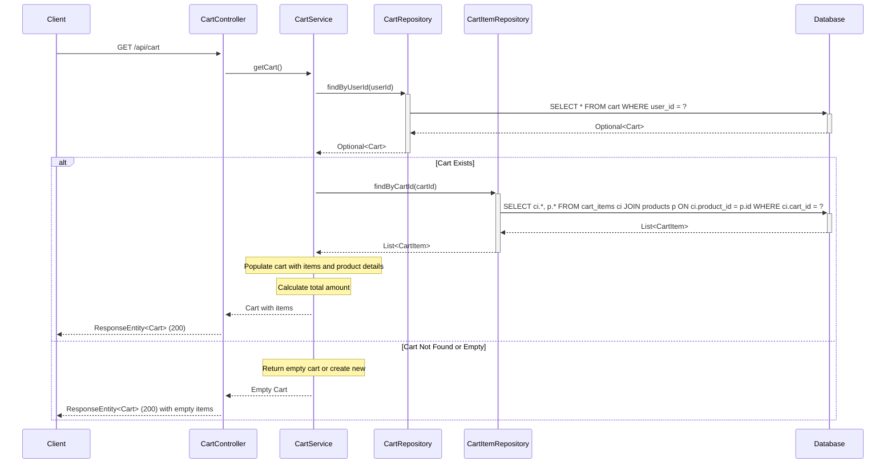
```mermaid
sequenceDiagram
    participant Client
    participant CartController
    participant CartService
    participant CartRepository
    participant CartItemRepository
    participant Database
    
    Client->>+CartController: GET /api/cart
    CartController->>+CartService: getCart()
    
    CartService->>+CartRepository: findByUserId(userId)
    CartRepository->>+Database: SELECT * FROM cart WHERE user_id = ?
    Database-->>-CartRepository: Optional<Cart>
    CartRepository-->>-CartService: Optional<Cart>
    
    alt Cart Exists
        CartService->>+CartItemRepository: findByCartId(cartId)
        CartItemRepository->>+Database: SELECT ci.*, p.* FROM cart_items ci JOIN products p ON ci.product_id = p.id WHERE ci.cart_id = ?
        Database-->>-CartItemRepository: List<CartItem>
        CartItemRepository-->>-CartService: List<CartItem>
        
        Note over CartService: Populate cart with items and product details
        Note over CartService: Calculate total amount
        
        CartService-->>CartController: Cart with items
        CartController-->>Client: ResponseEntity<Cart> (200)
    else Cart Not Found or Empty
        Note over CartService: Return empty cart or create new
        CartService-->>CartController: Empty Cart
        CartController-->>Client: ResponseEntity<Cart> (200) with empty items
    end
```

### 3.10 Update Cart Item Quantity

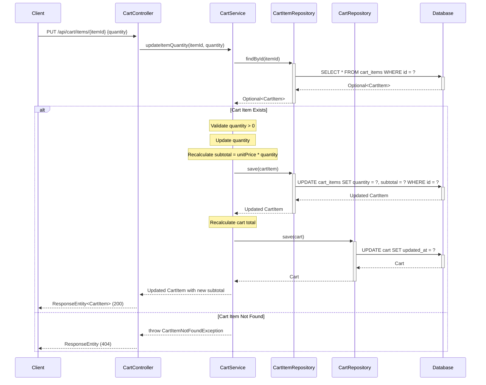
```mermaid
sequenceDiagram
    participant Client
    participant CartController
    participant CartService
    participant CartItemRepository
    participant CartRepository
    participant Database
    
    Client->>+CartController: PUT /api/cart/items/{itemId} {quantity}
    CartController->>+CartService: updateItemQuantity(itemId, quantity)
    
    CartService->>+CartItemRepository: findById(itemId)
    CartItemRepository->>+Database: SELECT * FROM cart_items WHERE id = ?
    Database-->>-CartItemRepository: Optional<CartItem>
    CartItemRepository-->>-CartService: Optional<CartItem>
    
    alt Cart Item Exists
        Note over CartService: Validate quantity > 0
        Note over CartService: Update quantity
        Note over CartService: Recalculate subtotal = unitPrice * quantity
        
        CartService->>+CartItemRepository: save(cartItem)
        CartItemRepository->>+Database: UPDATE cart_items SET quantity = ?, subtotal = ? WHERE id = ?
        Database-->>-CartItemRepository: Updated CartItem
        CartItemRepository-->>-CartService: Updated CartItem
        
        Note over CartService: Recalculate cart total
        
        CartService->>+CartRepository: save(cart)
        CartRepository->>+Database: UPDATE cart SET updated_at = ?
        Database-->>-CartRepository: Cart
        CartRepository-->>-CartService: Cart
        
        CartService-->>CartController: Updated CartItem with new subtotal
        CartController-->>Client: ResponseEntity<CartItem> (200)
    else Cart Item Not Found
        CartService-->>CartController: throw CartItemNotFoundException
        CartController-->>Client: ResponseEntity (404)
    end
```

### 3.11 Remove Cart Item

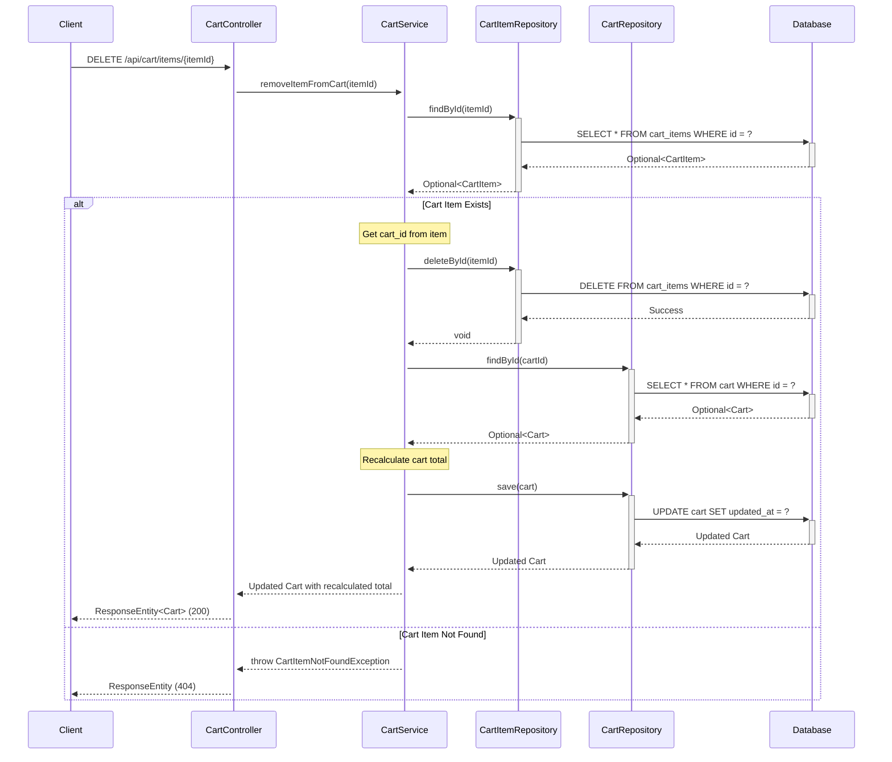
```mermaid
sequenceDiagram
    participant Client
    participant CartController
    participant CartService
    participant CartItemRepository
    participant CartRepository
    participant Database
    
    Client->>+CartController: DELETE /api/cart/items/{itemId}
    CartController->>+CartService: removeItemFromCart(itemId)
    
    CartService->>+CartItemRepository: findById(itemId)
    CartItemRepository->>+Database: SELECT * FROM cart_items WHERE id = ?
    Database-->>-CartItemRepository: Optional<CartItem>
    CartItemRepository-->>-CartService: Optional<CartItem>
    
    alt Cart Item Exists
        Note over CartService: Get cart_id from item
        
        CartService->>+CartItemRepository: deleteById(itemId)
        CartItemRepository->>+Database: DELETE FROM cart_items WHERE id = ?
        Database-->>-CartItemRepository: Success
        CartItemRepository-->>-CartService: void
        
        CartService->>+CartRepository: findById(cartId)
        CartRepository->>+Database: SELECT * FROM cart WHERE id = ?
        Database-->>-CartRepository: Optional<Cart>
        CartRepository-->>-CartService: Optional<Cart>
        
        Note over CartService: Recalculate cart total
        
        CartService->>+CartRepository: save(cart)
        CartRepository->>+Database: UPDATE cart SET updated_at = ?
        Database-->>-CartRepository: Updated Cart
        CartRepository-->>-CartService: Updated Cart
        
        CartService-->>CartController: Updated Cart with recalculated total
        CartController-->>Client: ResponseEntity<Cart> (200)
    else Cart Item Not Found
        CartService-->>CartController: throw CartItemNotFoundException
        CartController-->>Client: ResponseEntity (404)
    end
```

### 3.12 View Empty Cart

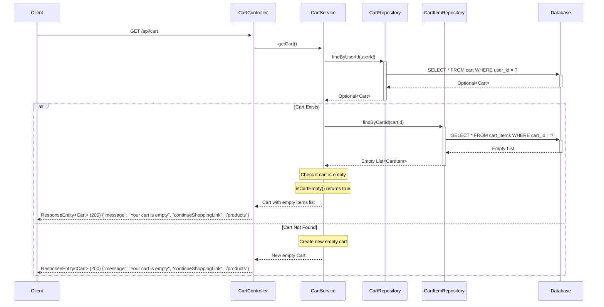
```mermaid
sequenceDiagram
    participant Client
    participant CartController
    participant CartService
    participant CartRepository
    participant CartItemRepository
    participant Database
    
    Client->>+CartController: GET /api/cart
    CartController->>+CartService: getCart()
    
    CartService->>+CartRepository: findByUserId(userId)
    CartRepository->>+Database: SELECT * FROM cart WHERE user_id = ?
    Database-->>-CartRepository: Optional<Cart>
    CartRepository-->>-CartService: Optional<Cart>
    
    alt Cart Exists
        CartService->>+CartItemRepository: findByCartId(cartId)
        CartItemRepository->>+Database: SELECT * FROM cart_items WHERE cart_id = ?
        Database-->>-CartItemRepository: Empty List
        CartItemRepository-->>-CartService: Empty List<CartItem>
        
        Note over CartService: Check if cart is empty
        Note over CartService: isCartEmpty() returns true
        
        CartService-->>CartController: Cart with empty items list
        CartController-->>Client: ResponseEntity<Cart> (200) {"message": "Your cart is empty", "continueShoppingLink": "/products"}
    else Cart Not Found
        Note over CartService: Create new empty cart
        CartService-->>CartController: New empty Cart
        CartController-->>Client: ResponseEntity<Cart> (200) {"message": "Your cart is empty", "continueShoppingLink": "/products"}
    end
```

### 3.13 User Registration and Authentication

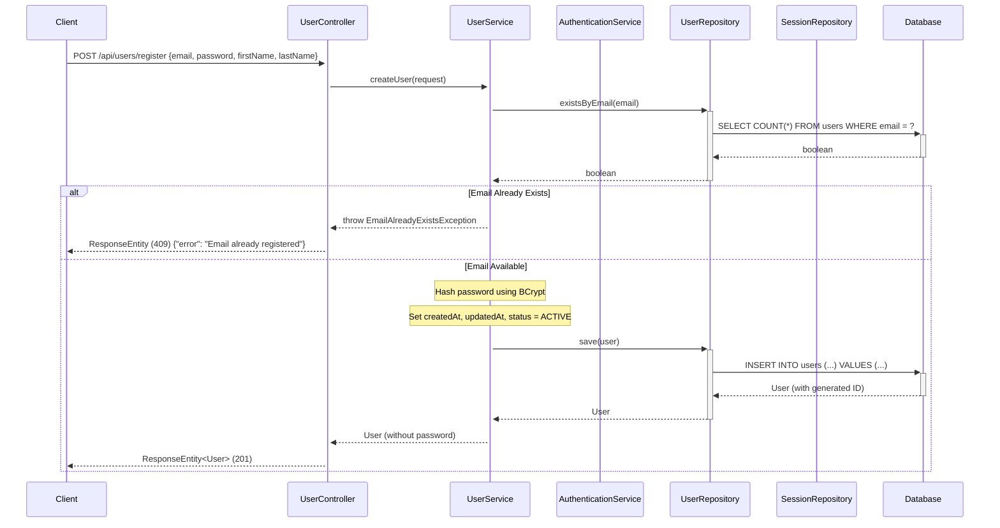
```mermaid
sequenceDiagram
    participant Client
    participant UserController
    participant UserService
    participant AuthenticationService
    participant UserRepository
    participant SessionRepository
    participant Database
    
    Client->>+UserController: POST /api/users/register {email, password, firstName, lastName}
    UserController->>+UserService: createUser(request)
    
    UserService->>+UserRepository: existsByEmail(email)
    UserRepository->>+Database: SELECT COUNT(*) FROM users WHERE email = ?
    Database-->>-UserRepository: boolean
    UserRepository-->>-UserService: boolean
    
    alt Email Already Exists
        UserService-->>UserController: throw EmailAlreadyExistsException
        UserController-->>Client: ResponseEntity (409) {"error": "Email already registered"}
    else Email Available
        Note over UserService: Hash password using BCrypt
        Note over UserService: Set createdAt, updatedAt, status = ACTIVE
        
        UserService->>+UserRepository: save(user)
        UserRepository->>+Database: INSERT INTO users (...) VALUES (...)
        Database-->>-UserRepository: User (with generated ID)
        UserRepository-->>-UserService: User
        
        UserService-->>UserController: User (without password)
        UserController-->>Client: ResponseEntity<User> (201)
    end
```

### 3.14 User Login

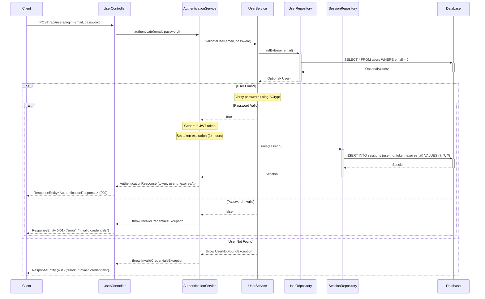
```mermaid
sequenceDiagram
    participant Client
    participant UserController
    participant AuthenticationService
    participant UserService
    participant UserRepository
    participant SessionRepository
    participant Database
    
    Client->>+UserController: POST /api/users/login {email, password}
    UserController->>+AuthenticationService: authenticate(email, password)
    
    AuthenticationService->>+UserService: validateUser(email, password)
    UserService->>+UserRepository: findByEmail(email)
    UserRepository->>+Database: SELECT * FROM users WHERE email = ?
    Database-->>-UserRepository: Optional<User>
    UserRepository-->>-UserService: Optional<User>
    
    alt User Found
        Note over UserService: Verify password using BCrypt
        
        alt Password Valid
            UserService-->>AuthenticationService: true
            
            Note over AuthenticationService: Generate JWT token
            Note over AuthenticationService: Set token expiration (24 hours)
            
            AuthenticationService->>+SessionRepository: save(session)
            SessionRepository->>+Database: INSERT INTO sessions (user_id, token, expires_at) VALUES (?, ?, ?)
            Database-->>-SessionRepository: Session
            SessionRepository-->>-AuthenticationService: Session
            
            AuthenticationService-->>UserController: AuthenticationResponse {token, userId, expiresAt}
            UserController-->>Client: ResponseEntity<AuthenticationResponse> (200)
        else Password Invalid
            UserService-->>AuthenticationService: false
            AuthenticationService-->>UserController: throw InvalidCredentialsException
            UserController-->>Client: ResponseEntity (401) {"error": "Invalid credentials"}
        end
    else User Not Found
        UserService-->>AuthenticationService: throw UserNotFoundException
        AuthenticationService-->>UserController: throw InvalidCredentialsException
        UserController-->>Client: ResponseEntity (401) {"error": "Invalid credentials"}
    end
```

### 3.15 Create Order from Cart

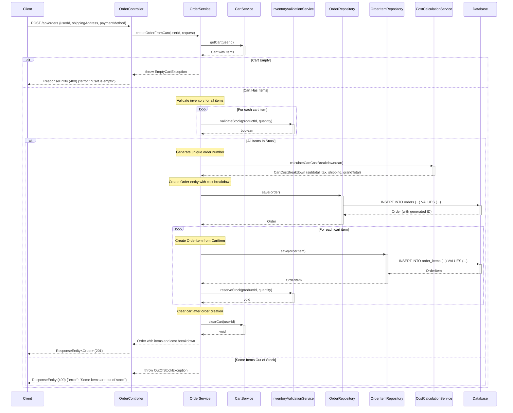
```mermaid
sequenceDiagram
    participant Client
    participant OrderController
    participant OrderService
    participant CartService
    participant InventoryValidationService
    participant OrderRepository
    participant OrderItemRepository
    participant CostCalculationService
    participant Database
    
    Client->>+OrderController: POST /api/orders {userId, shippingAddress, paymentMethod}
    OrderController->>+OrderService: createOrderFromCart(userId, request)
    
    OrderService->>+CartService: getCart(userId)
    CartService-->>-OrderService: Cart with items
    
    alt Cart Empty
        OrderService-->>OrderController: throw EmptyCartException
        OrderController-->>Client: ResponseEntity (400) {"error": "Cart is empty"}
    else Cart Has Items
        Note over OrderService: Validate inventory for all items
        
        loop For each cart item
            OrderService->>+InventoryValidationService: validateStock(productId, quantity)
            InventoryValidationService-->>-OrderService: boolean
        end
        
        alt All Items In Stock
            Note over OrderService: Generate unique order number
            
            OrderService->>+CostCalculationService: calculateCartCostBreakdown(cart)
            CostCalculationService-->>-OrderService: CartCostBreakdown {subtotal, tax, shipping, grandTotal}
            
            Note over OrderService: Create Order entity with cost breakdown
            
            OrderService->>+OrderRepository: save(order)
            OrderRepository->>+Database: INSERT INTO orders (...) VALUES (...)
            Database-->>-OrderRepository: Order (with generated ID)
            OrderRepository-->>-OrderService: Order
            
            loop For each cart item
                Note over OrderService: Create OrderItem from CartItem
                OrderService->>+OrderItemRepository: save(orderItem)
                OrderItemRepository->>+Database: INSERT INTO order_items (...) VALUES (...)
                Database-->>-OrderItemRepository: OrderItem
                OrderItemRepository-->>-OrderService: OrderItem
                
                OrderService->>+InventoryValidationService: reserveStock(productId, quantity)
                InventoryValidationService-->>-OrderService: void
            end
            
            Note over OrderService: Clear cart after order creation
            OrderService->>+CartService: clearCart(userId)
            CartService-->>-OrderService: void
            
            OrderService-->>OrderController: Order with items and cost breakdown
            OrderController-->>Client: ResponseEntity<Order> (201)
        else Some Items Out of Stock
            OrderService-->>OrderController: throw OutOfStockException
            OrderController-->>Client: ResponseEntity (400) {"error": "Some items are out of stock"}
        end
    end
```

### 3.16 Process Payment

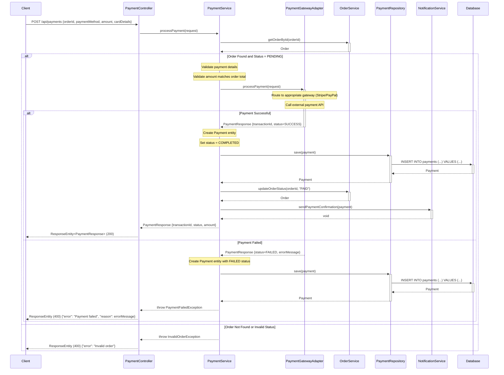
```mermaid
sequenceDiagram
    participant Client
    participant PaymentController
    participant PaymentService
    participant PaymentGatewayAdapter
    participant OrderService
    participant PaymentRepository
    participant NotificationService
    participant Database
    
    Client->>+PaymentController: POST /api/payments {orderId, paymentMethod, amount, cardDetails}
    PaymentController->>+PaymentService: processPayment(request)
    
    PaymentService->>+OrderService: getOrderById(orderId)
    OrderService-->>-PaymentService: Order
    
    alt Order Found and Status = PENDING
        Note over PaymentService: Validate payment details
        Note over PaymentService: Validate amount matches order total
        
        PaymentService->>+PaymentGatewayAdapter: processPayment(request)
        
        Note over PaymentGatewayAdapter: Route to appropriate gateway (Stripe/PayPal)
        Note over PaymentGatewayAdapter: Call external payment API
        
        alt Payment Successful
            PaymentGatewayAdapter-->>-PaymentService: PaymentResponse {transactionId, status=SUCCESS}
            
            Note over PaymentService: Create Payment entity
            Note over PaymentService: Set status = COMPLETED
            
            PaymentService->>+PaymentRepository: save(payment)
            PaymentRepository->>+Database: INSERT INTO payments (...) VALUES (...)
            Database-->>-PaymentRepository: Payment
            PaymentRepository-->>-PaymentService: Payment
            
            PaymentService->>+OrderService: updateOrderStatus(orderId, "PAID")
            OrderService-->>-PaymentService: Order
            
            PaymentService->>+NotificationService: sendPaymentConfirmation(payment)
            NotificationService-->>-PaymentService: void
            
            PaymentService-->>PaymentController: PaymentResponse {transactionId, status, amount}
            PaymentController-->>Client: ResponseEntity<PaymentResponse> (200)
        else Payment Failed
            PaymentGatewayAdapter-->>PaymentService: PaymentResponse {status=FAILED, errorMessage}
            
            Note over PaymentService: Create Payment entity with FAILED status
            
            PaymentService->>+PaymentRepository: save(payment)
            PaymentRepository->>+Database: INSERT INTO payments (...) VALUES (...)
            Database-->>-PaymentRepository: Payment
            PaymentRepository-->>-PaymentService: Payment
            
            PaymentService-->>PaymentController: throw PaymentFailedException
            PaymentController-->>Client: ResponseEntity (400) {"error": "Payment failed", "reason": errorMessage}
        end
    else Order Not Found or Invalid Status
        PaymentService-->>PaymentController: throw InvalidOrderException
        PaymentController-->>Client: ResponseEntity (400) {"error": "Invalid order"}
    end
```

### 3.17 Create Shipment and Track Delivery

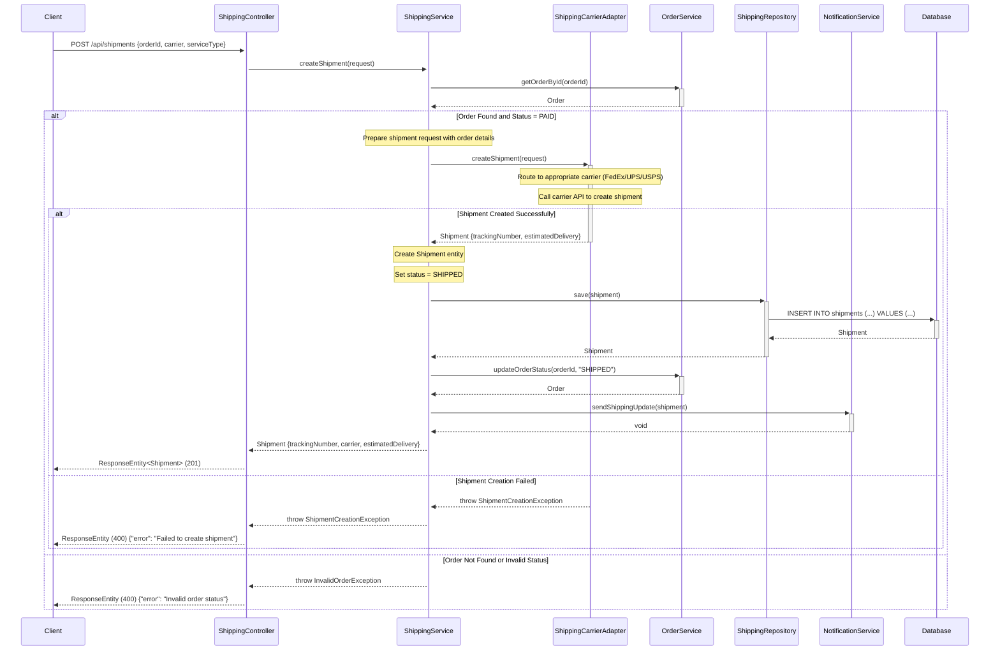
```mermaid
sequenceDiagram
    participant Client
    participant ShippingController
    participant ShippingService
    participant ShippingCarrierAdapter
    participant OrderService
    participant ShippingRepository
    participant NotificationService
    participant Database
    
    Client->>+ShippingController: POST /api/shipments {orderId, carrier, serviceType}
    ShippingController->>+ShippingService: createShipment(request)
    
    ShippingService->>+OrderService: getOrderById(orderId)
    OrderService-->>-ShippingService: Order
    
    alt Order Found and Status = PAID
        Note over ShippingService: Prepare shipment request with order details
        
        ShippingService->>+ShippingCarrierAdapter: createShipment(request)
        
        Note over ShippingCarrierAdapter: Route to appropriate carrier (FedEx/UPS/USPS)
        Note over ShippingCarrierAdapter: Call carrier API to create shipment
        
        alt Shipment Created Successfully
            ShippingCarrierAdapter-->>-ShippingService: Shipment {trackingNumber, estimatedDelivery}
            
            Note over ShippingService: Create Shipment entity
            Note over ShippingService: Set status = SHIPPED
            
            ShippingService->>+ShippingRepository: save(shipment)
            ShippingRepository->>+Database: INSERT INTO shipments (...) VALUES (...)
            Database-->>-ShippingRepository: Shipment
            ShippingRepository-->>-ShippingService: Shipment
            
            ShippingService->>+OrderService: updateOrderStatus(orderId, "SHIPPED")
            OrderService-->>-ShippingService: Order
            
            ShippingService->>+NotificationService: sendShippingUpdate(shipment)
            NotificationService-->>-ShippingService: void
            
            ShippingService-->>ShippingController: Shipment {trackingNumber, carrier, estimatedDelivery}
            ShippingController-->>Client: ResponseEntity<Shipment> (201)
        else Shipment Creation Failed
            ShippingCarrierAdapter-->>ShippingService: throw ShipmentCreationException
            ShippingService-->>ShippingController: throw ShipmentCreationException
            ShippingController-->>Client: ResponseEntity (400) {"error": "Failed to create shipment"}
        end
    else Order Not Found or Invalid Status
        ShippingService-->>ShippingController: throw InvalidOrderException
        ShippingController-->>Client: ResponseEntity (400) {"error": "Invalid order status"}
    end
```

### 3.18 Track Shipment

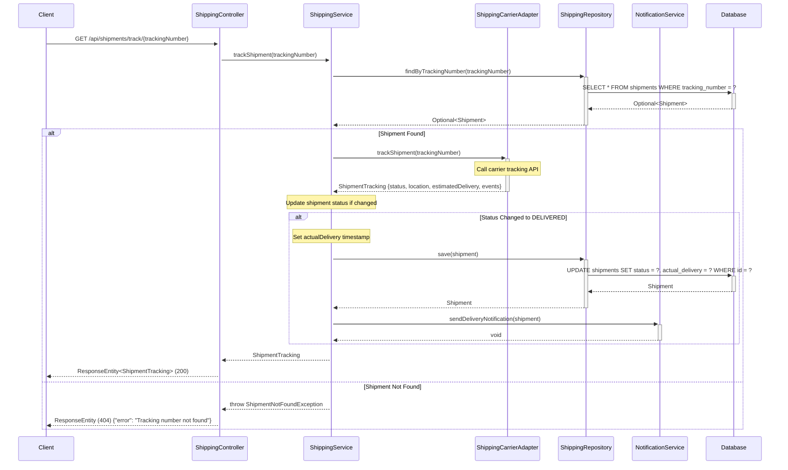
```mermaid
sequenceDiagram
    participant Client
    participant ShippingController
    participant ShippingService
    participant ShippingCarrierAdapter
    participant ShippingRepository
    participant NotificationService
    participant Database
    
    Client->>+ShippingController: GET /api/shipments/track/{trackingNumber}
    ShippingController->>+ShippingService: trackShipment(trackingNumber)
    
    ShippingService->>+ShippingRepository: findByTrackingNumber(trackingNumber)
    ShippingRepository->>+Database: SELECT * FROM shipments WHERE tracking_number = ?
    Database-->>-ShippingRepository: Optional<Shipment>
    ShippingRepository-->>-ShippingService: Optional<Shipment>
    
    alt Shipment Found
        ShippingService->>+ShippingCarrierAdapter: trackShipment(trackingNumber)
        
        Note over ShippingCarrierAdapter: Call carrier tracking API
        
        ShippingCarrierAdapter-->>-ShippingService: ShipmentTracking {status, location, estimatedDelivery, events}
        
        Note over ShippingService: Update shipment status if changed
        
        alt Status Changed to DELIVERED
            Note over ShippingService: Set actualDelivery timestamp
            
            ShippingService->>+ShippingRepository: save(shipment)
            ShippingRepository->>+Database: UPDATE shipments SET status = ?, actual_delivery = ? WHERE id = ?
            Database-->>-ShippingRepository: Shipment
            ShippingRepository-->>-ShippingService: Shipment
            
            ShippingService->>+NotificationService: sendDeliveryNotification(shipment)
            NotificationService-->>-ShippingService: void
        end
        
        ShippingService-->>ShippingController: ShipmentTracking
        ShippingController-->>Client: ResponseEntity<ShipmentTracking> (200)
    else Shipment Not Found
        ShippingService-->>ShippingController: throw ShipmentNotFoundException
        ShippingController-->>Client: ResponseEntity (404) {"error": "Tracking number not found"}
    end
```

### 3.19 Send Order Confirmation Notification

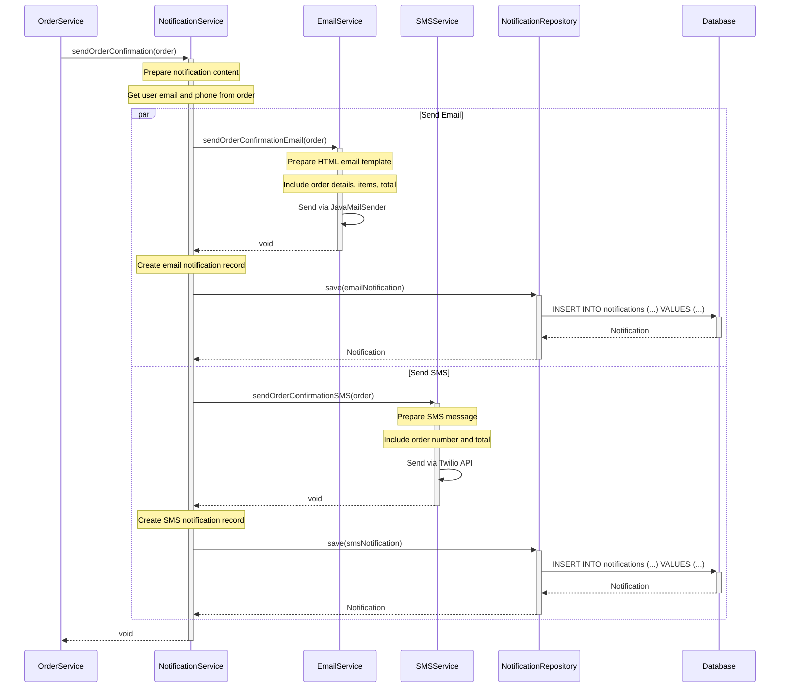
```mermaid
sequenceDiagram
    participant OrderService
    participant NotificationService
    participant EmailService
    participant SMSService
    participant NotificationRepository
    participant Database
    
    OrderService->>+NotificationService: sendOrderConfirmation(order)
    
    Note over NotificationService: Prepare notification content
    Note over NotificationService: Get user email and phone from order
    
    par Send Email
        NotificationService->>+EmailService: sendOrderConfirmationEmail(order)
        
        Note over EmailService: Prepare HTML email template
        Note over EmailService: Include order details, items, total
        
        EmailService->>EmailService: Send via JavaMailSender
        EmailService-->>-NotificationService: void
        
        Note over NotificationService: Create email notification record
        NotificationService->>+NotificationRepository: save(emailNotification)
        NotificationRepository->>+Database: INSERT INTO notifications (...) VALUES (...)
        Database-->>-NotificationRepository: Notification
        NotificationRepository-->>-NotificationService: Notification
    and Send SMS
        NotificationService->>+SMSService: sendOrderConfirmationSMS(order)
        
        Note over SMSService: Prepare SMS message
        Note over SMSService: Include order number and total
        
        SMSService->>SMSService: Send via Twilio API
        SMSService-->>-NotificationService: void
        
        Note over NotificationService: Create SMS notification record
        NotificationService->>+NotificationRepository: save(smsNotification)
        NotificationRepository->>+Database: INSERT INTO notifications (...) VALUES (...)
        Database-->>-NotificationRepository: Notification
        NotificationRepository-->>-NotificationService: Notification
    end
    
    NotificationService-->>-OrderService: void
```

### 3.20 Calculate Cart Cost Breakdown with Tax and Shipping

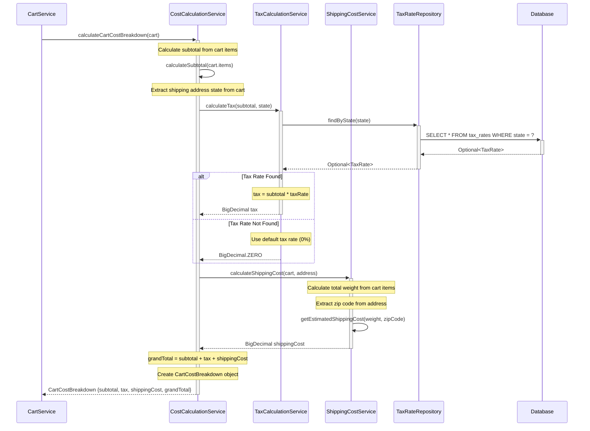
```mermaid
sequenceDiagram
    participant CartService
    participant CostCalculationService
    participant TaxCalculationService
    participant ShippingCostService
    participant TaxRateRepository
    participant Database
    
    CartService->>+CostCalculationService: calculateCartCostBreakdown(cart)
    
    Note over CostCalculationService: Calculate subtotal from cart items
    CostCalculationService->>CostCalculationService: calculateSubtotal(cart.items)
    
    Note over CostCalculationService: Extract shipping address state from cart
    
    CostCalculationService->>+TaxCalculationService: calculateTax(subtotal, state)
    TaxCalculationService->>+TaxRateRepository: findByState(state)
    TaxRateRepository->>+Database: SELECT * FROM tax_rates WHERE state = ?
    Database-->>-TaxRateRepository: Optional<TaxRate>
    TaxRateRepository-->>-TaxCalculationService: Optional<TaxRate>
    
    alt Tax Rate Found
        Note over TaxCalculationService: tax = subtotal * taxRate
        TaxCalculationService-->>-CostCalculationService: BigDecimal tax
    else Tax Rate Not Found
        Note over TaxCalculationService: Use default tax rate (0%)
        TaxCalculationService-->>CostCalculationService: BigDecimal.ZERO
    end
    
    CostCalculationService->>+ShippingCostService: calculateShippingCost(cart, address)
    
    Note over ShippingCostService: Calculate total weight from cart items
    Note over ShippingCostService: Extract zip code from address
    
    ShippingCostService->>ShippingCostService: getEstimatedShippingCost(weight, zipCode)
    ShippingCostService-->>-CostCalculationService: BigDecimal shippingCost
    
    Note over CostCalculationService: grandTotal = subtotal + tax + shippingCost
    
    Note over CostCalculationService: Create CartCostBreakdown object
    CostCalculationService-->>-CartService: CartCostBreakdown {subtotal, tax, shippingCost, grandTotal}
```

### 3.21 Validate Inventory Before Adding to Cart

```mermaid
sequenceDiagram
    participant CartService
    participant InventoryValidationService
    participant ProductRepository
    participant InventoryRepository
    participant Database
    
    CartService->>+InventoryValidationService: validateStock(productId, quantity)
    
    InventoryValidationService->>+ProductRepository: findById(productId)
    ProductRepository->>+Database: SELECT * FROM products WHERE id = ?
    Database-->>-ProductRepository: Optional<Product>
    ProductRepository-->>-InventoryValidationService: Optional<Product>
    
    alt Product Found
        InventoryValidationService->>+InventoryRepository: findByProductId(productId)
        InventoryRepository->>+Database: SELECT * FROM inventory WHERE product_id = ?
        Database-->>-InventoryRepository: Optional<Inventory>
        InventoryRepository-->>-InventoryValidationService: Optional<Inventory>
        
        alt Inventory Record Found
            Note over InventoryValidationService: Check if availableQuantity >= requested quantity
            
            alt Stock Available
                InventoryValidationService-->>-CartService: true
            else Insufficient Stock
                InventoryValidationService-->>CartService: false (throw OutOfStockException)
            end
        else Inventory Record Not Found
            Note over InventoryValidationService: Check product.stockQuantity
            
            alt Stock Available
                InventoryValidationService-->>CartService: true
            else Insufficient Stock
                InventoryValidationService-->>CartService: false (throw OutOfStockException)
            end
        end
    else Product Not Found
        InventoryValidationService-->>CartService: false (throw ProductNotFoundException)
    end
```
