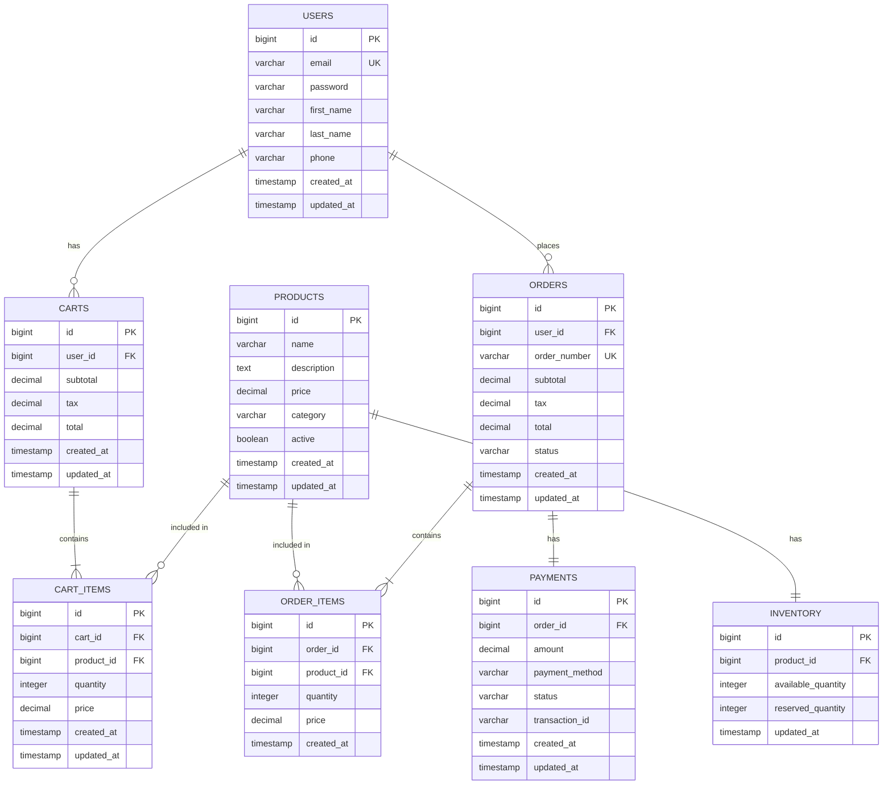

## 4. Database Design

### 4.1 Entity Relationship Diagram



### 4.2 Database Schema

#### 4.2.1 Users Table
```sql
CREATE TABLE users (
    id BIGSERIAL PRIMARY KEY,
    email VARCHAR(255) NOT NULL UNIQUE,
    password VARCHAR(255) NOT NULL,
    first_name VARCHAR(100) NOT NULL,
    last_name VARCHAR(100) NOT NULL,
    phone VARCHAR(20),
    created_at TIMESTAMP NOT NULL DEFAULT CURRENT_TIMESTAMP,
    updated_at TIMESTAMP NOT NULL DEFAULT CURRENT_TIMESTAMP
);

CREATE INDEX idx_users_email ON users(email);
```

#### 4.2.2 Carts Table
```sql
CREATE TABLE carts (
    id BIGSERIAL PRIMARY KEY,
    user_id BIGINT NOT NULL UNIQUE,
    subtotal DECIMAL(10, 2) DEFAULT 0.00,
    tax DECIMAL(10, 2) DEFAULT 0.00,
    total DECIMAL(10, 2) DEFAULT 0.00,
    created_at TIMESTAMP NOT NULL DEFAULT CURRENT_TIMESTAMP,
    updated_at TIMESTAMP NOT NULL DEFAULT CURRENT_TIMESTAMP,
    FOREIGN KEY (user_id) REFERENCES users(id) ON DELETE CASCADE
);

CREATE INDEX idx_carts_user_id ON carts(user_id);
CREATE INDEX idx_carts_updated_at ON carts(updated_at);
```

#### 4.2.3 Cart Items Table
```sql
CREATE TABLE cart_items (
    id BIGSERIAL PRIMARY KEY,
    cart_id BIGINT NOT NULL,
    product_id BIGINT NOT NULL,
    quantity INTEGER NOT NULL CHECK (quantity > 0),
    price DECIMAL(10, 2) NOT NULL,
    created_at TIMESTAMP NOT NULL DEFAULT CURRENT_TIMESTAMP,
    updated_at TIMESTAMP NOT NULL DEFAULT CURRENT_TIMESTAMP,
    FOREIGN KEY (cart_id) REFERENCES carts(id) ON DELETE CASCADE,
    FOREIGN KEY (product_id) REFERENCES products(id) ON DELETE CASCADE,
    UNIQUE (cart_id, product_id)
);

CREATE INDEX idx_cart_items_cart_id ON cart_items(cart_id);
CREATE INDEX idx_cart_items_product_id ON cart_items(product_id);
```

#### 4.2.4 Products Table
```sql
CREATE TABLE products (
    id BIGSERIAL PRIMARY KEY,
    name VARCHAR(255) NOT NULL,
    description TEXT,
    price DECIMAL(10, 2) NOT NULL,
    category VARCHAR(100),
    active BOOLEAN DEFAULT true,
    created_at TIMESTAMP NOT NULL DEFAULT CURRENT_TIMESTAMP,
    updated_at TIMESTAMP NOT NULL DEFAULT CURRENT_TIMESTAMP
);

CREATE INDEX idx_products_category ON products(category);
CREATE INDEX idx_products_active ON products(active);
```

#### 4.2.5 Orders Table
```sql
CREATE TABLE orders (
    id BIGSERIAL PRIMARY KEY,
    user_id BIGINT NOT NULL,
    order_number VARCHAR(50) NOT NULL UNIQUE,
    subtotal DECIMAL(10, 2) NOT NULL,
    tax DECIMAL(10, 2) NOT NULL,
    total DECIMAL(10, 2) NOT NULL,
    status VARCHAR(50) NOT NULL,
    created_at TIMESTAMP NOT NULL DEFAULT CURRENT_TIMESTAMP,
    updated_at TIMESTAMP NOT NULL DEFAULT CURRENT_TIMESTAMP,
    FOREIGN KEY (user_id) REFERENCES users(id)
);

CREATE INDEX idx_orders_user_id ON orders(user_id);
CREATE INDEX idx_orders_order_number ON orders(order_number);
CREATE INDEX idx_orders_status ON orders(status);
```

#### 4.2.6 Order Items Table
```sql
CREATE TABLE order_items (
    id BIGSERIAL PRIMARY KEY,
    order_id BIGINT NOT NULL,
    product_id BIGINT NOT NULL,
    quantity INTEGER NOT NULL,
    price DECIMAL(10, 2) NOT NULL,
    created_at TIMESTAMP NOT NULL DEFAULT CURRENT_TIMESTAMP,
    FOREIGN KEY (order_id) REFERENCES orders(id) ON DELETE CASCADE,
    FOREIGN KEY (product_id) REFERENCES products(id)
);

CREATE INDEX idx_order_items_order_id ON order_items(order_id);
```

#### 4.2.7 Payments Table
```sql
CREATE TABLE payments (
    id BIGSERIAL PRIMARY KEY,
    order_id BIGINT NOT NULL,
    amount DECIMAL(10, 2) NOT NULL,
    payment_method VARCHAR(50) NOT NULL,
    status VARCHAR(50) NOT NULL,
    transaction_id VARCHAR(255),
    created_at TIMESTAMP NOT NULL DEFAULT CURRENT_TIMESTAMP,
    updated_at TIMESTAMP NOT NULL DEFAULT CURRENT_TIMESTAMP,
    FOREIGN KEY (order_id) REFERENCES orders(id)
);

CREATE INDEX idx_payments_order_id ON payments(order_id);
CREATE INDEX idx_payments_transaction_id ON payments(transaction_id);
```

#### 4.2.8 Inventory Table
```sql
CREATE TABLE inventory (
    id BIGSERIAL PRIMARY KEY,
    product_id BIGINT NOT NULL UNIQUE,
    available_quantity INTEGER NOT NULL DEFAULT 0,
    reserved_quantity INTEGER NOT NULL DEFAULT 0,
    updated_at TIMESTAMP NOT NULL DEFAULT CURRENT_TIMESTAMP,
    FOREIGN KEY (product_id) REFERENCES products(id) ON DELETE CASCADE
);

CREATE INDEX idx_inventory_product_id ON inventory(product_id);
```

## 5. API Specifications

### 5.1 Shopping Cart API Endpoints

#### 5.1.1 Get Cart
```
GET /api/v1/cart/{userId}

Response 200 OK:
{
    "id": 1,
    "userId": 123,
    "items": [
        {
            "id": 1,
            "productId": 456,
            "quantity": 2,
            "price": 29.99,
            "createdAt": "2024-01-15T10:30:00",
            "updatedAt": "2024-01-15T10:30:00"
        }
    ],
    "subtotal": 59.98,
    "tax": 4.80,
    "total": 64.78,
    "createdAt": "2024-01-15T10:30:00",
    "updatedAt": "2024-01-15T10:30:00"
}
```

#### 5.1.2 Add Item to Cart
```
POST /api/v1/cart/{userId}/items

Request Body:
{
    "productId": 456,
    "quantity": 2
}

Response 200 OK:
{
    "id": 1,
    "userId": 123,
    "items": [
        {
            "id": 1,
            "productId": 456,
            "quantity": 2,
            "price": 29.99,
            "createdAt": "2024-01-15T10:30:00",
            "updatedAt": "2024-01-15T10:30:00"
        }
    ],
    "subtotal": 59.98,
    "tax": 4.80,
    "total": 64.78,
    "createdAt": "2024-01-15T10:30:00",
    "updatedAt": "2024-01-15T10:30:00"
}
```

#### 5.1.3 Update Cart Item
```
PUT /api/v1/cart/{userId}/items/{itemId}

Request Body:
{
    "quantity": 3
}

Response 200 OK:
{
    "id": 1,
    "userId": 123,
    "items": [
        {
            "id": 1,
            "productId": 456,
            "quantity": 3,
            "price": 29.99,
            "createdAt": "2024-01-15T10:30:00",
            "updatedAt": "2024-01-15T10:35:00"
        }
    ],
    "subtotal": 89.97,
    "tax": 7.20,
    "total": 97.17,
    "createdAt": "2024-01-15T10:30:00",
    "updatedAt": "2024-01-15T10:35:00"
}
```

#### 5.1.4 Remove Item from Cart
```
DELETE /api/v1/cart/{userId}/items/{itemId}

Response 200 OK:
{
    "id": 1,
    "userId": 123,
    "items": [],
    "subtotal": 0.00,
    "tax": 0.00,
    "total": 0.00,
    "createdAt": "2024-01-15T10:30:00",
    "updatedAt": "2024-01-15T10:40:00"
}
```

#### 5.1.5 Clear Cart
```
DELETE /api/v1/cart/{userId}

Response 204 No Content
```

#### 5.1.6 Merge Cart
```
POST /api/v1/cart/{userId}/merge

Request Body:
{
    "guestCartItems": [
        {
            "productId": 789,
            "quantity": 1,
            "price": 49.99
        }
    ]
}

Response 200 OK:
{
    "id": 1,
    "userId": 123,
    "items": [
        {
            "id": 1,
            "productId": 456,
            "quantity": 2,
            "price": 29.99,
            "createdAt": "2024-01-15T10:30:00",
            "updatedAt": "2024-01-15T10:30:00"
        },
        {
            "id": 2,
            "productId": 789,
            "quantity": 1,
            "price": 49.99,
            "createdAt": "2024-01-15T10:45:00",
            "updatedAt": "2024-01-15T10:45:00"
        }
    ],
    "subtotal": 109.97,
    "tax": 8.80,
    "total": 118.77,
    "createdAt": "2024-01-15T10:30:00",
    "updatedAt": "2024-01-15T10:45:00"
}
```

### 5.2 User API Endpoints

#### 5.2.1 Register User
```
POST /api/v1/users/register

Request Body:
{
    "email": "user@example.com",
    "password": "SecurePass123!",
    "firstName": "John",
    "lastName": "Doe"
}

Response 201 Created:
{
    "id": 123,
    "email": "user@example.com",
    "firstName": "John",
    "lastName": "Doe",
    "createdAt": "2024-01-15T10:00:00"
}
```

### 5.3 Product API Endpoints

#### 5.3.1 Get All Products
```
GET /api/v1/products?page=0&size=20&category=electronics

Response 200 OK:
{
    "content": [
        {
            "id": 456,
            "name": "Wireless Mouse",
            "description": "Ergonomic wireless mouse",
            "price": 29.99,
            "category": "electronics",
            "active": true
        }
    ],
    "totalElements": 100,
    "totalPages": 5,
    "size": 20,
    "number": 0
}
```

### 5.4 Order API Endpoints

#### 5.4.1 Create Order
```
POST /api/v1/orders

Request Body:
{
    "userId": 123,
    "items": [
        {
            "productId": 456,
            "quantity": 2,
            "price": 29.99
        }
    ]
}

Response 201 Created:
{
    "id": 789,
    "userId": 123,
    "orderNumber": "ORD-2024-001",
    "subtotal": 59.98,
    "tax": 4.80,
    "total": 64.78,
    "status": "PENDING",
    "createdAt": "2024-01-15T11:00:00"
}
```
